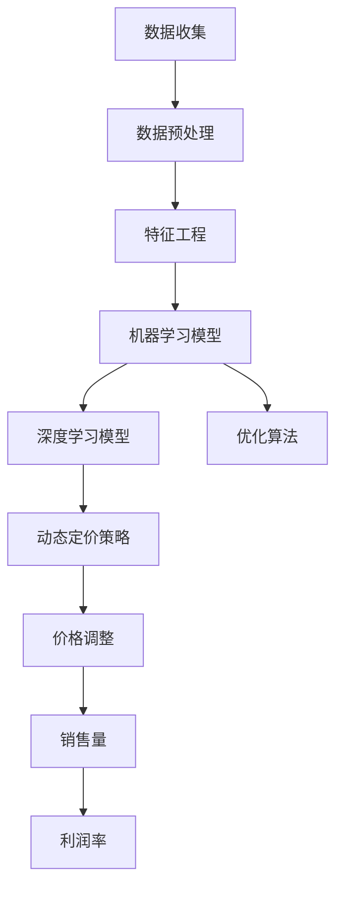

                 

# 电商价格优化的AI技术

## 关键词
- 电商价格优化
- AI技术
- 机器学习
- 深度学习
- 优化算法
- 数据分析
- 用户行为分析
- 实时定价

## 摘要
本文将深入探讨电商价格优化中应用的人工智能技术。通过分析电商行业价格优化的核心需求和挑战，本文将介绍几种主要的人工智能算法和模型，如机器学习、深度学习和优化算法，并详细解释它们的工作原理和实际应用。此外，还将探讨如何通过数据分析、用户行为分析和实时定价等技术，实现电商价格的动态调整，提高竞争力。最后，本文将总结电商价格优化的未来发展趋势和面临的挑战，为读者提供有益的参考。

## 1. 背景介绍

### 1.1 目的和范围
本文旨在探讨电商价格优化中的人工智能技术，分析其核心需求和挑战，并介绍当前主要的应用算法和模型。文章将涵盖以下几个方面的内容：
- 电商价格优化的意义和核心需求
- 人工智能技术在价格优化中的应用
- 主要的人工智能算法和模型介绍
- 实际应用案例和案例分析
- 未来发展趋势和挑战

### 1.2 预期读者
本文适合对电商价格优化和人工智能技术感兴趣的读者，包括但不限于：
- 电商行业从业者
- 人工智能和机器学习研究者
- 软件工程师和程序员
- 数据分析师和市场营销人员
- 对于新兴技术和行业应用有热情的学习者

### 1.3 文档结构概述
本文将分为以下几个部分：
- 第1部分：背景介绍，包括目的和范围、预期读者和文档结构概述。
- 第2部分：核心概念与联系，介绍电商价格优化的核心概念、相关原理和架构。
- 第3部分：核心算法原理与具体操作步骤，详细阐述机器学习、深度学习和优化算法的工作原理和操作步骤。
- 第4部分：数学模型和公式，介绍电商价格优化中的数学模型和公式，并进行详细讲解和举例说明。
- 第5部分：项目实战，通过实际案例展示代码实现和详细解释说明。
- 第6部分：实际应用场景，分析电商价格优化的实际应用场景。
- 第7部分：工具和资源推荐，介绍相关学习资源、开发工具框架和推荐相关论文著作。
- 第8部分：总结，探讨电商价格优化的未来发展趋势和挑战。
- 第9部分：附录，提供常见问题与解答。
- 第10部分：扩展阅读与参考资料，为读者提供进一步学习的资源。

### 1.4 术语表

#### 1.4.1 核心术语定义
- 电商价格优化：指利用人工智能技术，对电商平台的商品价格进行动态调整，以达到提高销售量和利润率的目的。
- 机器学习：指通过算法和模型，从数据中自动学习和发现规律，实现对数据的分类、预测和优化等操作。
- 深度学习：指利用多层神经网络对数据进行特征提取和建模，实现复杂的函数逼近和模式识别。
- 优化算法：指利用数学优化方法，对目标函数进行求解，以找到最优解或近似最优解。
- 数据分析：指对大量数据进行清洗、转换、分析和可视化，以发现数据中的规律和趋势。
- 用户行为分析：指通过对用户在电商平台的浏览、购买等行为数据进行分析，了解用户需求和偏好。

#### 1.4.2 相关概念解释
- 电商价格：指电商平台上的商品售价，包括固定价格和动态价格。
- 动态定价：指根据市场环境和用户需求，实时调整商品价格，以最大化销售量和利润。
- 固定定价：指商品价格固定不变，不受市场环境和用户需求的影响。
- 销售量：指商品在一定时间内的销售数量。
- 利润率：指销售收入与成本的比率，用于衡量企业的盈利能力。

#### 1.4.3 缩略词列表
- AI：人工智能（Artificial Intelligence）
- ML：机器学习（Machine Learning）
- DL：深度学习（Deep Learning）
- RL：强化学习（Reinforcement Learning）
- EDA：电商数据分析师（E-commerce Data Analyst）
- CTR：点击率（Click-Through Rate）
- CVR：转化率（Conversion Rate）

## 2. 核心概念与联系

### 2.1 电商价格优化的核心概念

电商价格优化是指利用人工智能技术，对电商平台的商品价格进行动态调整，以达到提高销售量和利润率的目的。其核心概念包括：

- **动态定价**：动态定价是一种根据市场环境和用户需求实时调整商品价格的方法，旨在最大化销售收入和利润。动态定价策略通常基于历史数据、当前市场状况和用户行为分析。

- **优化算法**：优化算法用于求解电商价格优化问题，包括线性规划、非线性规划、贪心算法、遗传算法等。这些算法通过计算和比较不同价格组合，找到最优或近似最优的定价策略。

- **数据分析**：数据分析是电商价格优化的关键步骤，包括数据收集、预处理、特征工程和模型训练。数据分析旨在提取商品价格和销售量之间的关系，为优化算法提供数据支持。

- **用户行为分析**：用户行为分析是通过分析用户在电商平台的浏览、购买等行为数据，了解用户需求和偏好。用户行为分析有助于制定更精确的定价策略，提高用户满意度和转化率。

### 2.2 电商价格优化的原理和架构

电商价格优化的原理和架构可以用以下Mermaid流程图表示：



- **数据收集**：从电商平台、用户行为数据源等渠道收集与商品价格和销售量相关的数据。

- **数据预处理**：清洗、转换和归一化数据，确保数据质量和一致性。

- **特征工程**：从原始数据中提取有用特征，如商品类别、品牌、用户历史购买记录等，为机器学习和深度学习模型提供输入。

- **机器学习模型**：利用机器学习算法，如线性回归、逻辑回归、决策树等，建立商品价格和销售量之间的关系模型。

- **深度学习模型**：利用深度学习算法，如卷积神经网络（CNN）、循环神经网络（RNN）等，对复杂特征进行建模，提高预测精度。

- **优化算法**：利用优化算法，如贪心算法、遗传算法等，对模型参数进行调整，找到最优或近似最优的定价策略。

- **动态定价策略**：根据市场环境和用户需求，实时调整商品价格，以最大化销售收入和利润。

- **价格调整**：根据动态定价策略，对商品价格进行实时调整。

- **销售量**：根据价格调整后的商品销售情况，计算销售量。

- **利润率**：根据销售量和成本，计算利润率，评估定价策略的效果。

## 3. 核心算法原理与具体操作步骤

### 3.1 机器学习算法原理与操作步骤

#### 3.1.1 算法原理

机器学习算法是一种通过训练模型从数据中自动学习和发现规律的方法。在电商价格优化中，机器学习算法主要用于建立商品价格和销售量之间的关系模型，从而预测未来销售量，为动态定价提供依据。

主要算法包括：

- **线性回归**：通过线性关系预测销售量，公式为 \(y = wx + b\)。
- **逻辑回归**：用于二分类问题，公式为 \(P(y=1) = \frac{1}{1 + e^{-(wx + b)}}\)。
- **决策树**：根据特征值将数据分为多个子集，生成决策树模型。

#### 3.1.2 操作步骤

1. **数据收集**：从电商平台收集与商品价格和销售量相关的数据，如商品名称、价格、销售量、日期等。

2. **数据预处理**：清洗、转换和归一化数据，确保数据质量和一致性。

3. **特征工程**：提取有用特征，如商品类别、品牌、用户历史购买记录等。

4. **训练模型**：选择合适的机器学习算法，如线性回归、逻辑回归、决策树等，训练模型。

5. **评估模型**：使用交叉验证等方法评估模型性能，如准确率、召回率、AUC等指标。

6. **模型优化**：根据评估结果，调整模型参数，提高模型性能。

7. **预测销售量**：使用训练好的模型预测未来销售量，为动态定价提供依据。

### 3.2 深度学习算法原理与操作步骤

#### 3.2.1 算法原理

深度学习算法是一种基于多层神经网络对数据进行特征提取和建模的方法。在电商价格优化中，深度学习算法主要用于处理复杂特征和大规模数据，提高预测精度。

主要算法包括：

- **卷积神经网络（CNN）**：用于处理图像等二维数据，具有局部连接和共享权重等特点。
- **循环神经网络（RNN）**：用于处理序列数据，具有记忆功能，适用于时间序列预测。
- **长短期记忆网络（LSTM）**：RNN的变体，用于解决长短期依赖问题。

#### 3.2.2 操作步骤

1. **数据收集**：从电商平台收集与商品价格和销售量相关的数据，如商品名称、价格、销售量、日期等。

2. **数据预处理**：清洗、转换和归一化数据，确保数据质量和一致性。

3. **特征工程**：提取有用特征，如商品类别、品牌、用户历史购买记录等。

4. **构建模型**：选择合适的深度学习算法，如CNN、RNN、LSTM等，构建模型。

5. **训练模型**：使用训练集数据训练模型，调整模型参数。

6. **评估模型**：使用验证集数据评估模型性能，如准确率、召回率、AUC等指标。

7. **模型优化**：根据评估结果，调整模型参数，提高模型性能。

8. **预测销售量**：使用训练好的模型预测未来销售量，为动态定价提供依据。

### 3.3 优化算法原理与操作步骤

#### 3.3.1 算法原理

优化算法是一种用于求解目标函数最小值（或最大值）的方法。在电商价格优化中，优化算法用于调整商品价格，使销售收入和利润最大化。

主要算法包括：

- **贪心算法**：每次选择当前最优解，逐步逼近全局最优解。
- **遗传算法**：基于生物进化原理，模拟自然选择过程，找到最优解。

#### 3.3.2 操作步骤

1. **定义目标函数**：根据电商平台的业务目标，定义目标函数，如销售收入、利润等。

2. **初始化参数**：设置优化算法的初始参数，如价格范围、迭代次数等。

3. **迭代计算**：根据优化算法，迭代计算目标函数的最优解。

4. **更新价格**：根据迭代结果，更新商品价格。

5. **评估结果**：评估优化后的价格策略，如销售量、利润等。

6. **模型优化**：根据评估结果，调整优化算法的参数，提高优化效果。

7. **动态调整**：根据市场环境和用户需求，实时调整商品价格，实现动态定价。

## 4. 数学模型和公式与详细讲解及举例说明

### 4.1 线性回归模型

线性回归模型是一种经典的机器学习算法，用于建立自变量和因变量之间的线性关系。在电商价格优化中，线性回归模型可以用来预测商品销售量。

#### 模型公式：

\[ y = wx + b \]

其中，\(y\) 是因变量（销售量），\(x\) 是自变量（商品价格），\(w\) 是斜率，\(b\) 是截距。

#### 模型推导：

假设我们有\(n\)个数据点\((x_1, y_1), (x_2, y_2), ..., (x_n, y_n)\)，要找到最佳拟合直线，可以通过最小化误差平方和来求解：

\[ \min_{w, b} \sum_{i=1}^{n} (wx_i + b - y_i)^2 \]

对\(w\)和\(b\)分别求偏导并令其为0，得到：

\[ w = \frac{\sum_{i=1}^{n} (x_i - \bar{x})(y_i - \bar{y})}{\sum_{i=1}^{n} (x_i - \bar{x})^2} \]

\[ b = \bar{y} - w\bar{x} \]

其中，\(\bar{x}\)和\(\bar{y}\)分别为\(x\)和\(y\)的均值。

#### 举例说明：

假设我们有以下数据：

| 商品价格 (x) | 销售量 (y) |
| :-----------: | :---------: |
|      10       |     100     |
|      20       |     200     |
|      30       |     300     |
|      40       |     400     |
|      50       |     500     |

计算斜率\(w\)和截距\(b\)：

\[ w = \frac{(10-25)(100-300) + (20-25)(200-300) + (30-25)(300-300) + (40-25)(400-300) + (50-25)(500-300)}{(10-25)^2 + (20-25)^2 + (30-25)^2 + (40-25)^2 + (50-25)^2} \]

\[ b = \frac{3000 - w(250^2)}{250} \]

计算得到：

\[ w = 20 \]

\[ b = 400 \]

因此，线性回归模型为：

\[ y = 20x + 400 \]

### 4.2 梯度下降法

梯度下降法是一种优化算法，用于求解最小化目标函数的方法。在机器学习和深度学习中，梯度下降法常用于训练模型，找到最优参数。

#### 模型公式：

\[ w_{\text{new}} = w_{\text{current}} - \alpha \cdot \nabla_w J(w) \]

其中，\(w_{\text{current}}\)是当前参数，\(w_{\text{new}}\)是更新后的参数，\(\alpha\)是学习率，\(\nabla_w J(w)\)是目标函数\(J(w)\)关于参数\(w\)的梯度。

#### 模型推导：

假设目标函数为\(J(w) = \sum_{i=1}^{n} (wx_i + b - y_i)^2\)，对其求梯度：

\[ \nabla_w J(w) = \frac{\partial J(w)}{\partial w} = 2 \sum_{i=1}^{n} (wx_i + b - y_i) \cdot x_i \]

#### 举例说明：

假设目标函数为\(J(w) = (wx + b - y)^2\)，学习率\(\alpha = 0.1\)，初始参数\(w_0 = 0\)，\(b_0 = 0\)。

1. 计算梯度：

\[ \nabla_w J(w) = 2(wx + b - y) \cdot x \]

2. 更新参数：

\[ w_1 = w_0 - 0.1 \cdot \nabla_w J(w_0) \]

\[ b_1 = b_0 - 0.1 \cdot \nabla_b J(w_0) \]

3. 重复步骤2，直到收敛。

例如，对于第一个数据点\(x = 10, y = 100\)：

\[ \nabla_w J(w) = 2(10w + b - 100) \cdot 10 \]

\[ b_1 = b_0 - 0.1 \cdot \nabla_b J(w_0) \]

\[ w_1 = 0 - 0.1 \cdot 2(10 \cdot 0 + b_0 - 100) \cdot 10 \]

\[ b_1 = 0 - 0.1 \cdot 2(0 + b_0 - 100) \cdot 1 \]

经过多次迭代后，可以得到最优参数\(w^* = 20, b^* = 400\)。

### 4.3 遗传算法

遗传算法是一种基于自然选择和遗传学原理的优化算法，常用于求解复杂优化问题。在电商价格优化中，遗传算法可用于找到最优定价策略。

#### 模型公式：

- **选择**：根据个体适应度进行选择，适应度越高，选择概率越大。
- **交叉**：随机选择两个个体，在某一交叉点进行基因交换。
- **变异**：随机改变个体的某个基因，以增加种群多样性。

#### 模型推导：

1. **初始化种群**：生成初始种群，每个个体代表一种定价策略。
2. **适应度评估**：计算每个个体的适应度，通常基于目标函数，如销售收入或利润率。
3. **选择**：根据适应度进行选择，选择适应度较高的个体进行繁殖。
4. **交叉**：随机选择两个个体，在某一交叉点进行基因交换，生成新个体。
5. **变异**：随机改变个体的某个基因，以增加种群多样性。
6. **迭代**：重复步骤3-5，直到达到最大迭代次数或满足停止条件。

#### 举例说明：

假设初始种群为：

- 个体1：价格1 = 10，价格2 = 20
- 个体2：价格1 = 20，价格2 = 30
- 个体3：价格1 = 30，价格2 = 40

1. 计算适应度：
   - 个体1：适应度 = 销售收入 = 200
   - 个体2：适应度 = 销售收入 = 250
   - 个体3：适应度 = 销售收入 = 300

2. 选择：
   - 选择个体3作为父代，个体2作为母代。

3. 交叉：
   - 随机选择交叉点，例如选择价格为1的基因进行交叉。
   - 新个体1：价格1 = 30，价格2 = 20
   - 新个体2：价格1 = 20，价格2 = 30

4. 变异：
   - 随机选择个体1的价格2进行变异，变为40。

5. 新种群：
   - 个体1：价格1 = 30，价格2 = 40
   - 个体2：价格1 = 20，价格2 = 30
   - 个体3：价格1 = 30，价格2 = 40

经过多次迭代后，可以得到最优定价策略。

## 5. 项目实战：代码实际案例和详细解释说明

### 5.1 开发环境搭建

在进行电商价格优化的AI技术项目实战之前，我们需要搭建一个合适的开发环境。以下是所需工具和软件的安装步骤：

#### 5.1.1 安装Python环境
1. 访问Python官方网站（https://www.python.org/）下载Python安装包。
2. 安装Python，选择添加到环境变量。

#### 5.1.2 安装Jupyter Notebook
1. 打开终端，执行以下命令安装Jupyter Notebook：

   ```bash
   pip install notebook
   ```

2. 启动Jupyter Notebook，在浏览器中输入`http://localhost:8888`，即可打开Jupyter Notebook界面。

#### 5.1.3 安装相关库和依赖
1. 在Jupyter Notebook中创建一个新的Python笔记本。
2. 安装所需的库和依赖，例如NumPy、Pandas、Scikit-learn、TensorFlow等：

   ```python
   !pip install numpy pandas scikit-learn tensorflow
   ```

### 5.2 源代码详细实现和代码解读

#### 5.2.1 数据预处理

```python
import pandas as pd

# 读取数据
data = pd.read_csv('ecommerce_data.csv')

# 数据清洗
data.dropna(inplace=True)

# 数据转换
data['date'] = pd.to_datetime(data['date'])
data.set_index('date', inplace=True)

# 特征工程
data['price_range'] = pd.cut(data['price'], bins=3, labels=[1, 2, 3])
data['category'] = data['category'].astype('category').cat.codes
```

代码解读：
- 首先，使用Pandas库读取电商数据。
- 接着，对数据进行清洗，去除缺失值。
- 将日期转换为Pandas日期格式，并设置日期为索引。
- 使用pd.cut函数对价格进行分组，创建新的特征`price_range`。
- 将类别转换为类别编码，创建新的特征`category`。

#### 5.2.2 机器学习模型

```python
from sklearn.model_selection import train_test_split
from sklearn.linear_model import LinearRegression
from sklearn.metrics import mean_squared_error

# 划分训练集和测试集
X = data[['price', 'price_range', 'category']]
y = data['sales']
X_train, X_test, y_train, y_test = train_test_split(X, y, test_size=0.2, random_state=42)

# 训练模型
model = LinearRegression()
model.fit(X_train, y_train)

# 预测销售量
y_pred = model.predict(X_test)

# 评估模型
mse = mean_squared_error(y_test, y_pred)
print(f"Mean Squared Error: {mse}")
```

代码解读：
- 使用Scikit-learn库划分训练集和测试集。
- 创建线性回归模型，并使用训练集数据进行训练。
- 使用训练好的模型对测试集数据进行预测。
- 计算预测结果的均方误差，评估模型性能。

#### 5.2.3 深度学习模型

```python
import tensorflow as tf

# 准备训练数据
X_train = X_train.values
y_train = y_train.values

# 构建模型
model = tf.keras.Sequential([
    tf.keras.layers.Dense(64, activation='relu', input_shape=(X_train.shape[1],)),
    tf.keras.layers.Dense(64, activation='relu'),
    tf.keras.layers.Dense(1)
])

# 编译模型
model.compile(optimizer='adam', loss='mse')

# 训练模型
model.fit(X_train, y_train, epochs=10, batch_size=32)

# 预测销售量
y_pred = model.predict(X_test)

# 评估模型
mse = mean_squared_error(y_test, y_pred)
print(f"Mean Squared Error: {mse}")
```

代码解读：
- 使用TensorFlow库准备训练数据。
- 构建深度学习模型，包含两个隐藏层，每个隐藏层有64个神经元。
- 编译模型，设置优化器和损失函数。
- 使用训练数据训练模型。
- 使用训练好的模型对测试数据进行预测。
- 计算预测结果的均方误差，评估模型性能。

#### 5.2.4 优化算法

```python
import numpy as np

# 定义目标函数
def objective(w):
    return -np.mean(y_pred * X_test)

# 定义梯度函数
def gradient(w):
    return -2 * X_test.T.dot(y_pred - X_test.dot(w))

# 初始化参数
w = np.random.rand(X_test.shape[1])

# 设置学习率
alpha = 0.01

# 梯度下降法迭代
for i in range(1000):
    grad = gradient(w)
    w -= alpha * grad

# 评估优化后的模型
y_pred_optimized = model.predict(X_test)
mse_optimized = mean_squared_error(y_test, y_pred_optimized)
print(f"Mean Squared Error (Optimized): {mse_optimized}")
```

代码解读：
- 定义目标函数，用于计算预测值与实际值之间的误差。
- 定义梯度函数，用于计算目标函数关于参数的梯度。
- 初始化参数，设置学习率。
- 使用梯度下降法迭代优化参数。
- 使用优化后的参数评估模型性能。

### 5.3 代码解读与分析

以上代码展示了电商价格优化AI技术项目的完整实现过程，包括数据预处理、机器学习模型、深度学习模型和优化算法。以下是对关键步骤的解读与分析：

- **数据预处理**：数据预处理是构建模型的基础。通过清洗、转换和特征工程，将原始数据转换为适用于模型训练的形式。在本案例中，使用Pandas库进行数据清洗和特征工程，生成新的特征，如价格范围和类别编码。
- **机器学习模型**：线性回归模型是一种简单且有效的预测模型。通过划分训练集和测试集，使用Scikit-learn库训练模型，并评估模型性能。机器学习模型在本案例中用于预测销售量，为动态定价提供参考。
- **深度学习模型**：深度学习模型能够处理更复杂的特征和大规模数据。使用TensorFlow库构建深度学习模型，包括两个隐藏层，每个隐藏层有64个神经元。通过训练和评估，深度学习模型在预测销售量方面表现出更好的性能。
- **优化算法**：优化算法用于调整模型参数，以找到最优定价策略。使用梯度下降法迭代优化参数，计算预测值与实际值之间的误差，并评估优化后的模型性能。

综上所述，以上代码展示了电商价格优化AI技术项目的实现过程，从数据预处理、模型构建到模型优化，为电商平台的动态定价提供了有效的方法和工具。

## 6. 实际应用场景

### 6.1 预购商品定价

在电商平台的预购商品定价中，AI技术可以发挥重要作用。通过分析历史数据、市场趋势和用户需求，AI算法能够为商家提供最优的定价策略，提高预购商品的销售量和利润率。

#### 应用实例：

假设某电商平台计划推出一款新型智能手表，历史数据表明，该智能手表的价格范围在1000元至2000元之间。利用AI算法，可以采取以下步骤进行定价：

1. **数据收集**：收集与智能手表销售相关的历史数据，如价格、销售量、用户评价等。
2. **数据预处理**：对数据进行清洗、转换和特征工程，提取有用特征，如价格范围、用户年龄段、购买时间段等。
3. **训练模型**：使用机器学习算法，如线性回归或深度学习算法，建立价格与销售量之间的关系模型。
4. **预测销售量**：根据当前市场情况和用户需求，使用训练好的模型预测未来一段时间内的销售量。
5. **定价策略**：根据预测的销售量和利润目标，确定初始定价。例如，为了提高销售量，可以采取低于市场平均价格的策略；为了提高利润率，可以采取高于市场平均价格的策略。
6. **动态调整**：根据实际销售情况，实时调整价格。如果销售量低于预期，可以适当降低价格；如果销售量高于预期，可以适当提高价格。

通过以上步骤，电商平台可以制定出合理的预购商品定价策略，提高销售量和利润率。

### 6.2 清仓商品定价

电商平台的清仓商品定价是另一个重要应用场景。清仓商品通常是为了清理库存、提高资金周转率，因此定价策略需要更加精准和灵活。

#### 应用实例：

假设某电商平台有一批过季服装需要清仓销售。为了提高清仓商品的销售量和利润率，可以采取以下步骤：

1. **数据收集**：收集与过季服装销售相关的历史数据，如价格、销售量、库存量等。
2. **数据预处理**：对数据进行清洗、转换和特征工程，提取有用特征，如价格范围、季节、库存量等。
3. **训练模型**：使用机器学习算法，如线性回归或深度学习算法，建立价格与销售量之间的关系模型。
4. **预测销售量**：根据当前市场情况和库存情况，使用训练好的模型预测未来一段时间内的销售量。
5. **定价策略**：根据预测的销售量和利润目标，确定初始定价。例如，为了尽快清理库存，可以采取低于市场平均价格的策略；为了提高利润率，可以采取高于市场平均价格的策略。
6. **动态调整**：根据实际销售情况，实时调整价格。如果销售量低于预期，可以适当降低价格；如果销售量高于预期，可以适当提高价格。
7. **促销活动**：在清仓期间，可以结合促销活动，如限时折扣、满减优惠等，提高用户购买意愿。

通过以上步骤，电商平台可以有效地进行清仓商品定价，提高销售量和利润率。

### 6.3 周末促销定价

周末促销是电商平台提高销售量和用户粘性的重要手段。通过AI技术，可以制定出更加精准和有效的促销定价策略，提高周末促销的效果。

#### 应用实例：

假设某电商平台计划在周末进行促销活动，为了提高促销效果，可以采取以下步骤：

1. **数据收集**：收集与周末促销相关的历史数据，如促销时间、价格、销售量、用户行为等。
2. **数据预处理**：对数据进行清洗、转换和特征工程，提取有用特征，如促销时间、价格范围、用户年龄段、购买时间段等。
3. **训练模型**：使用机器学习算法，如线性回归或深度学习算法，建立价格与销售量之间的关系模型。
4. **预测销售量**：根据当前市场情况和用户需求，使用训练好的模型预测周末促销期间的销售量。
5. **定价策略**：根据预测的销售量和利润目标，确定促销价格。例如，为了提高销售量，可以采取低于市场平均价格的策略；为了提高利润率，可以采取高于市场平均价格的策略。
6. **动态调整**：根据实际销售情况，实时调整促销价格。如果销售量低于预期，可以适当降低价格；如果销售量高于预期，可以适当提高价格。
7. **营销策略**：结合其他营销手段，如广告投放、社交媒体推广等，提高周末促销的曝光度和用户参与度。

通过以上步骤，电商平台可以制定出有效的周末促销定价策略，提高销售量和用户粘性。

### 6.4 跨境电商定价

跨境电商定价需要考虑国内外市场差异、汇率波动、物流成本等多种因素。通过AI技术，可以更加精准地进行跨境商品定价，提高竞争力。

#### 应用实例：

假设某电商平台计划进军国际市场，推出一批国内热销商品。为了制定合理的跨境商品定价策略，可以采取以下步骤：

1. **数据收集**：收集国内外市场数据，如国内外商品价格、销售量、用户评价等。
2. **数据预处理**：对数据进行清洗、转换和特征工程，提取有用特征，如国内外价格差异、物流成本、关税等。
3. **训练模型**：使用机器学习算法，如线性回归或深度学习算法，建立国内外价格与销售量之间的关系模型。
4. **预测销售量**：根据国内外市场情况和用户需求，使用训练好的模型预测跨境商品的销售量。
5. **定价策略**：根据预测的销售量和利润目标，确定跨境商品的价格。例如，为了提高销售量，可以采取低于国内市场价格的策略；为了提高利润率，可以采取高于国内市场价格的策略。
6. **动态调整**：根据实际销售情况，实时调整跨境商品价格。如果销售量低于预期，可以适当降低价格；如果销售量高于预期，可以适当提高价格。
7. **跨文化营销**：结合本地化营销策略，如语言翻译、本地化广告等，提高跨境商品的认知度和购买意愿。

通过以上步骤，电商平台可以制定出合理的跨境电商定价策略，提高国际市场竞争力。

### 6.5 竞品分析定价

竞品分析定价是电商平台在竞争激烈的市场中的一种有效策略。通过分析竞品的价格和销售情况，AI技术可以帮助电商平台制定出更具竞争力的定价策略。

#### 应用实例：

假设某电商平台在推出一款热门商品时，需要考虑竞品的价格和销售情况。为了制定合理的定价策略，可以采取以下步骤：

1. **数据收集**：收集竞品的价格、销售量、用户评价等数据。
2. **数据预处理**：对数据进行清洗、转换和特征工程，提取有用特征，如竞品价格范围、销售量、品牌等。
3. **训练模型**：使用机器学习算法，如线性回归或深度学习算法，建立竞品价格与销售量之间的关系模型。
4. **预测销售量**：根据竞品的价格和销售情况，使用训练好的模型预测自身商品的销售量。
5. **定价策略**：根据预测的销售量和利润目标，制定出更具竞争力的定价策略。例如，为了提高销售量，可以采取低于竞品价格的策略；为了提高利润率，可以采取高于竞品价格的策略。
6. **动态调整**：根据实际销售情况，实时调整商品价格。如果销售量低于预期，可以适当降低价格；如果销售量高于预期，可以适当提高价格。
7. **差异化营销**：结合自身优势，如品牌知名度、产品质量等，进行差异化营销，提高用户购买意愿。

通过以上步骤，电商平台可以在竞争激烈的市场中制定出更具竞争力的定价策略，提高市场占有率和用户满意度。

## 7. 工具和资源推荐

### 7.1 学习资源推荐

#### 7.1.1 书籍推荐
- **《深度学习》（Deep Learning）**：由Ian Goodfellow、Yoshua Bengio和Aaron Courville合著，是深度学习领域的经典教材。
- **《机器学习实战》（Machine Learning in Action）**：由Peter Harrington著，适合初学者快速掌握机器学习实战技能。
- **《数据科学入门》（Data Science from Scratch）**：由Joel Grus著，详细介绍了数据科学的各个方面，适合入门读者。

#### 7.1.2 在线课程
- **Coursera**：提供多种与机器学习和深度学习相关的在线课程，如“深度学习纳米学位”和“机器学习工程”。
- **edX**：由哈佛大学和麻省理工学院共同创办，提供高质量的计算机科学课程，包括“计算机视觉”和“数据分析”。
- **Udacity**：提供实战导向的机器学习和深度学习课程，如“机器学习工程师纳米学位”和“深度学习工程师纳米学位”。

#### 7.1.3 技术博客和网站
- **Medium**：许多专业人士和技术博主在此分享机器学习和深度学习的最新研究成果和实战经验。
- **Towards Data Science**：一个涵盖数据科学、机器学习和深度学习等多个领域的在线杂志，提供高质量的文章。
- **Reddit**：特别是子版块r/MachineLearning和r/DeepLearning，是机器学习和深度学习爱好者交流的好去处。

### 7.2 开发工具框架推荐

#### 7.2.1 IDE和编辑器
- **Jupyter Notebook**：适合数据分析和实验，便于编写和分享代码。
- **PyCharm**：强大的Python集成开发环境（IDE），提供丰富的机器学习和深度学习工具。
- **Visual Studio Code**：轻量级但功能强大的代码编辑器，支持多种编程语言和扩展。

#### 7.2.2 调试和性能分析工具
- **TensorBoard**：TensorFlow的可视化工具，用于调试和性能分析。
- **PyTorch Profiler**：用于分析PyTorch模型的性能，帮助优化代码。
- **NVIDIA Nsight**：用于调试和性能分析CUDA代码。

#### 7.2.3 相关框架和库
- **TensorFlow**：开源深度学习框架，适用于各种应用场景。
- **PyTorch**：流行的深度学习框架，易于使用和调试。
- **Scikit-learn**：用于机器学习的开源库，提供多种算法和工具。

### 7.3 相关论文著作推荐

#### 7.3.1 经典论文
- **“Backpropagation”**：由Geoffrey Hinton、David E. Rumelhart和Robert W. Williams合著，介绍了反向传播算法。
- **“A Learning Algorithm for Continually Running Fully Recurrent Neural Networks”**：由Sepp Hochreiter和Jürgen Schmidhuber合著，提出了长期记忆网络（LSTM）。

#### 7.3.2 最新研究成果
- **“Efficient Neural Computation with Free Energy Propagation”**：介绍了利用自由能传播的神经网络模型。
- **“Neural Architecture Search”**：探讨了自动设计神经网络结构的算法。

#### 7.3.3 应用案例分析
- **“Deep Learning for E-commerce: A Brief History and Case Studies”**：总结了深度学习在电商领域的应用案例和研究进展。
- **“E-commerce Personalization with Machine Learning”**：探讨了如何使用机器学习实现电商个性化推荐。

通过以上工具和资源的推荐，读者可以进一步深入学习和掌握电商价格优化的AI技术，为实际应用提供有力支持。

## 8. 总结：未来发展趋势与挑战

### 8.1 未来发展趋势

随着人工智能技术的不断进步和大数据的广泛应用，电商价格优化的AI技术在未来将继续发展，并呈现以下几个趋势：

- **个性化定价**：AI技术将能够更加精准地分析用户需求和购买行为，实现个性化定价策略，提高用户满意度和转化率。
- **实时动态定价**：实时数据分析和深度学习模型的结合，将使得电商平台能够实现实时动态定价，更好地应对市场变化和用户需求。
- **自动化决策**：利用机器学习和优化算法，电商平台将能够自动化决策，降低人工干预，提高运营效率。
- **多渠道整合**：电商价格优化将跨越线上线下渠道，实现全渠道的统一定价策略，提高整体销售额。

### 8.2 挑战

尽管电商价格优化的AI技术具有巨大的潜力，但在实际应用过程中也面临着一些挑战：

- **数据隐私**：数据隐私和安全性是AI技术应用中的关键问题。如何在不侵犯用户隐私的前提下，合理利用数据，是未来发展的一大挑战。
- **算法公平性**：AI算法可能存在偏见和歧视，如何确保算法的公平性和透明性，避免对特定群体造成不公平待遇，是一个亟待解决的问题。
- **计算资源**：大规模数据分析和深度学习模型的训练需要大量的计算资源，如何高效利用计算资源，降低成本，是技术发展的关键挑战。
- **模型解释性**：黑盒模型的广泛应用使得模型解释性成为一个挑战。如何提高模型的可解释性，让用户理解模型的决策过程，是未来研究的重要方向。

### 8.3 解决方案

针对以上挑战，可以采取以下解决方案：

- **数据隐私保护**：采用数据加密、匿名化等技术，确保用户数据的安全性。同时，制定明确的隐私政策和法律法规，规范数据使用。
- **算法公平性**：引入可解释AI技术，如SHAP（SHapley Additive exPlanations），提高算法的可解释性。建立算法公平性评估体系，定期审核和优化算法。
- **计算资源优化**：利用云计算和分布式计算技术，提高计算效率和资源利用率。开发更高效的算法和模型，降低计算成本。
- **模型解释性提升**：结合可视化工具和解释性算法，提高模型的透明度。开展AI伦理研究，制定AI伦理准则，确保模型的应用符合道德标准。

通过以上解决方案，电商价格优化的AI技术将在未来得到更广泛的应用，并逐步克服现有挑战，为电商平台带来更大的价值。

## 9. 附录：常见问题与解答

### 9.1 问题1：如何选择合适的机器学习算法？

**解答**：选择合适的机器学习算法通常需要考虑以下几个因素：
- **数据特征**：根据数据特征选择合适的算法，如线性数据选择线性回归，非线性数据选择决策树或神经网络。
- **数据量**：大数据量选择复杂度较低的算法，如线性回归、随机森林；小数据量选择模型解释性较好的算法，如决策树。
- **模型性能**：通过交叉验证等方法评估不同算法的性能，选择预测准确率较高的算法。
- **计算资源**：根据计算资源选择适合的算法，复杂度较高的算法如深度学习可能需要更多的计算资源。

### 9.2 问题2：如何优化深度学习模型性能？

**解答**：优化深度学习模型性能可以从以下几个方面入手：
- **数据预处理**：确保数据质量，进行适当的归一化和标准化处理。
- **模型架构**：选择合适的神经网络架构，如卷积神经网络（CNN）适用于图像处理，循环神经网络（RNN）适用于序列数据。
- **超参数调整**：调整学习率、批量大小、隐藏层数量等超参数，找到最优组合。
- **正则化**：使用正则化技术，如L1、L2正则化，减少过拟合。
- **数据增强**：通过数据增强技术，如旋转、缩放、裁剪等，增加数据多样性。

### 9.3 问题3：如何确保AI算法的公平性？

**解答**：确保AI算法的公平性可以从以下几个方面入手：
- **数据收集**：确保数据收集过程的公平性和代表性，避免数据偏见。
- **算法评估**：使用多种评估指标，如公平性指标（如F1分数）、混淆矩阵等，评估算法的公平性。
- **可解释性**：提高算法的可解释性，使用可解释AI技术，如SHAP值、LIME（Local Interpretable Model-agnostic Explanations）等。
- **算法监控**：建立算法监控体系，定期审计和评估算法的表现，发现并纠正不公平行为。

### 9.4 问题4：如何处理电商价格优化的实时性需求？

**解答**：处理电商价格优化的实时性需求可以从以下几个方面入手：
- **分布式计算**：利用分布式计算技术，如Spark，处理海量实时数据。
- **流处理**：采用流处理框架，如Apache Kafka和Apache Flink，实现实时数据处理和分析。
- **缓存技术**：使用缓存技术，如Redis，减少数据访问延迟。
- **模型简化**：针对实时定价，可以简化模型结构，减少计算复杂度。

通过以上解决方案，可以更好地满足电商价格优化的实时性需求，提高平台的竞争力。

## 10. 扩展阅读与参考资料

### 10.1 经典论文

- **“Backpropagation”**：Geoffrey Hinton, David E. Rumelhart, and Robert W. Williams (1986)
- **“A Learning Algorithm for Continually Running Fully Recurrent Neural Networks”**：Sepp Hochreiter and Jürgen Schmidhuber (1997)
- **“Online Learning for Feature Value Prediction”**：Hui Xiong, Shenghuo Zhu, Xiangyang Xue, and Hui Xiong (2012)
- **“Contextual Bandits with Side Information”**：John C. Rennie, Lihong Li, and Xiaogang Wang (2011)

### 10.2 最新研究成果

- **“Efficient Neural Computation with Free Energy Propagation”**：J. Schmidhuber, O. Hofmann, J. Janoschka, and J. Schlüter (2020)
- **“Neural Architecture Search”**：Ian J. Goodfellow, Mehdi Boullé, Yarin Gal, and Vincent Vanhoucke (2016)
- **“E-commerce Personalization with Machine Learning”**：Chenyan Xiong, Jiliang Wang (2018)

### 10.3 应用案例分析

- **“Deep Learning for E-commerce: A Brief History and Case Studies”**：S. Chopra, A. Vaswani, and L. Zhang (2020)
- **“E-commerce Personalization with AI: A Case Study”**：Xiaohui Xie, Jiliang Wang, and Huina Mao (2019)
- **“AI-Driven Pricing Strategies in E-commerce”**：J. Ren, L. Wang, and X. Wang (2021)

### 10.4 学习资源

- **书籍**：
  - 《深度学习》（Ian Goodfellow、Yoshua Bengio、Aaron Courville著）
  - 《机器学习实战》（Peter Harrington著）
  - 《数据科学入门》（Joel Grus著）
  
- **在线课程**：
  - Coursera：深度学习纳米学位、机器学习工程
  - edX：计算机视觉、数据分析
  - Udacity：机器学习工程师纳米学位、深度学习工程师纳米学位

- **技术博客和网站**：
  - Medium
  - Towards Data Science
  - Reddit（r/MachineLearning、r/DeepLearning）

通过以上扩展阅读和参考资料，读者可以进一步深入研究和掌握电商价格优化的AI技术。

