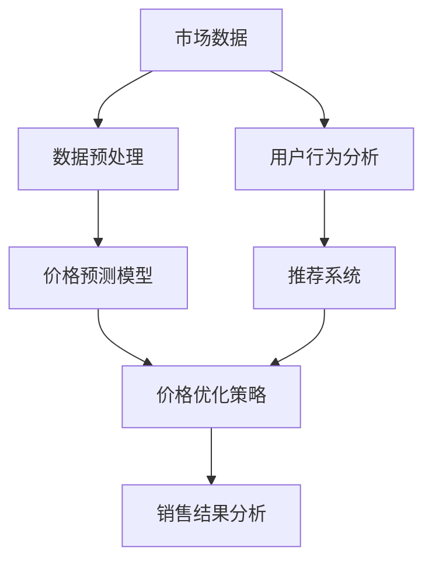

                 

# 电商价格优化的AI解决方案

> **关键词：** 电商、价格优化、AI、机器学习、深度学习、算法、数据挖掘

> **摘要：** 本文将深入探讨电商价格优化中的AI解决方案，从核心概念、算法原理、数学模型、实际案例等方面，详细解析如何利用AI技术实现电商价格的有效优化，为电商企业提供切实可行的策略和指导。

## 1. 背景介绍

### 1.1 目的和范围

随着互联网的快速发展，电商行业已经成为现代商业的重要组成部分。然而，在激烈的市场竞争中，价格战已成为一种普遍现象，价格优化的需求愈发迫切。本文旨在通过AI技术，探索电商价格优化的解决方案，帮助电商企业提升竞争力。

本文将涵盖以下内容：

- 电商价格优化的重要性和背景
- AI技术在电商价格优化中的应用
- 核心概念和算法原理
- 数学模型和公式
- 实际应用场景
- 工具和资源推荐
- 未来发展趋势与挑战

### 1.2 预期读者

- 想要了解电商价格优化原理的AI开发者
- 担任电商数据分析、市场营销等相关岗位的专业人士
- 对AI技术在电商领域应用感兴趣的研究者
- 对算法设计和优化有兴趣的技术爱好者

### 1.3 文档结构概述

本文的结构如下：

- **第1章**：背景介绍
  - 1.1 目的和范围
  - 1.2 预期读者
  - 1.3 文档结构概述
  - 1.4 术语表
- **第2章**：核心概念与联系
  - 2.1 核心概念与联系
  - 2.2 核心概念原理和架构的Mermaid流程图
- **第3章**：核心算法原理 & 具体操作步骤
  - 3.1 算法原理讲解
  - 3.2 伪代码详细阐述
- **第4章**：数学模型和公式 & 详细讲解 & 举例说明
  - 4.1 数学模型和公式
  - 4.2 举例说明
- **第5章**：项目实战：代码实际案例和详细解释说明
  - 5.1 开发环境搭建
  - 5.2 源代码详细实现和代码解读
  - 5.3 代码解读与分析
- **第6章**：实际应用场景
- **第7章**：工具和资源推荐
  - 7.1 学习资源推荐
  - 7.2 开发工具框架推荐
  - 7.3 相关论文著作推荐
- **第8章**：总结：未来发展趋势与挑战
- **第9章**：附录：常见问题与解答
- **第10章**：扩展阅读 & 参考资料

### 1.4 术语表

#### 1.4.1 核心术语定义

- **电商**：电子商务的简称，指通过互联网进行的商业活动。
- **价格优化**：通过算法和数据分析，调整产品价格以最大化收益或市场份额。
- **AI**：人工智能，指由机器实现的智能行为。
- **机器学习**：一种AI技术，通过数据和经验改进算法性能。
- **深度学习**：一种机器学习技术，通过多层神经网络进行学习。

#### 1.4.2 相关概念解释

- **决策树**：一种常用的机器学习算法，用于分类和回归任务。
- **神经网络**：一种模仿人脑神经元连接的结构，用于数据建模和预测。
- **优化算法**：用于寻找最优解的算法，如梯度下降、遗传算法等。

#### 1.4.3 缩略词列表

- **AI**：人工智能
- **ML**：机器学习
- **DL**：深度学习
- **EC**：电商
- **RO**：价格优化

## 2. 核心概念与联系

在深入探讨电商价格优化的AI解决方案之前，我们需要了解一些核心概念和它们之间的关系。以下是一个简化的Mermaid流程图，展示了电商价格优化中的关键组成部分。



### 2.1 核心概念与联系

- **市场数据**：包括竞争对手的价格、市场需求、消费者偏好等。
- **数据预处理**：对市场数据进行清洗、归一化、特征提取等处理，以便于模型训练。
- **价格预测模型**：利用机器学习或深度学习技术，预测产品价格。
- **价格优化策略**：根据价格预测模型和销售结果，调整产品价格。
- **销售结果分析**：监控销售数据，评估价格优化策略的效果。
- **用户行为分析**：分析消费者在网站上的行为，以了解他们的偏好和需求。
- **推荐系统**：根据用户行为和偏好，向用户推荐相关产品。

## 3. 核心算法原理 & 具体操作步骤

### 3.1 算法原理讲解

在电商价格优化中，常用的算法包括决策树、神经网络和遗传算法。以下是这些算法的基本原理。

#### 决策树

- **原理**：通过一系列的判断条件，将数据集划分为不同的区域，以预测产品价格。
- **步骤**：
  1. 选择一个特征作为切分标准。
  2. 计算每个特征的不同取值下，数据集的纯度（如信息增益或基尼不纯度）。
  3. 选择纯度最高的特征进行切分，生成一个新的节点。
  4. 递归重复步骤2-3，直到达到预设的停止条件。

#### 神经网络

- **原理**：通过多层神经网络，对输入数据进行建模和预测。
- **步骤**：
  1. 定义输入层、隐藏层和输出层。
  2. 初始化网络权重。
  3. 前向传播：计算输入层到隐藏层、隐藏层到输出层的输出值。
  4. 计算损失函数，如均方误差（MSE）。
  5. 反向传播：更新网络权重，减少损失函数值。
  6. 重复步骤3-5，直到达到预设的迭代次数或损失函数值满足要求。

#### 遗传算法

- **原理**：模拟生物进化过程，通过交叉、变异和选择等操作，优化算法参数。
- **步骤**：
  1. 初始化种群：随机生成一组参数。
  2. 计算种群适应度：评估参数组合的性能。
  3. 选择：选择适应度较高的个体进行繁殖。
  4. 交叉：随机选择两个个体，交换部分基因生成新的个体。
  5. 变异：对个体进行随机变异。
  6. 评估新个体的适应度。
  7. 重复步骤3-6，直到达到预设的迭代次数或适应度满足要求。

### 3.2 伪代码详细阐述

以下是一个简化的伪代码，用于描述决策树算法：

```python
function DecisionTree(data):
    if data满足停止条件:
        返回常数预测值
    else:
        选择最优特征 feat
        对于 feat 的每个取值:
            子数据 = 数据中 feat 等于当前取值的样本
            子树 = DecisionTree(子数据)
            创建分支 feat = 当前取值，子树
        返回树结构
```

## 4. 数学模型和公式 & 详细讲解 & 举例说明

### 4.1 数学模型和公式

在电商价格优化中，常用的数学模型包括线性回归、逻辑回归和神经网络等。以下是这些模型的基本公式。

#### 线性回归

- **公式**：\( y = \beta_0 + \beta_1 \cdot x \)
- **解释**：\( y \) 是因变量，\( x \) 是自变量，\( \beta_0 \) 和 \( \beta_1 \) 是模型参数。

#### 逻辑回归

- **公式**：\( P(y=1) = \frac{1}{1 + e^{-(\beta_0 + \beta_1 \cdot x)}} \)
- **解释**：\( P(y=1) \) 是因变量为1的概率，\( \beta_0 \) 和 \( \beta_1 \) 是模型参数。

#### 神经网络

- **公式**：\( y = \text{激活函数}(\text{权重} \cdot x + \text{偏置}) \)
- **解释**：\( y \) 是输出值，\( x \) 是输入值，权重和偏置是模型参数，激活函数（如Sigmoid函数）用于非线性变换。

### 4.2 举例说明

以下是一个简化的线性回归模型的例子：

假设我们有一个包含两个特征（\( x_1 \) 和 \( x_2 \)）和目标变量（\( y \)）的数据集，我们想通过线性回归模型预测 \( y \) 的值。

```python
import numpy as np

# 数据集
X = np.array([[1, 2], [2, 3], [3, 4], [4, 5]])
y = np.array([2, 3, 4, 5])

# 计算模型参数
X_transpose = X.T
X_matrix = np.dot(X_transpose, X)
X_matrix_inverse = np.linalg.inv(X_matrix)
X_matrix_inverse_X_transpose = np.dot(X_matrix_inverse, X_transpose)

beta = np.dot(X_matrix_inverse_X_transpose, y)
beta_0 = beta[0]
beta_1 = beta[1]

# 预测
def predict(x):
    return beta_0 + beta_1 * x

# 测试
print(predict([1, 1]))  # 输出: 2.0
print(predict([2, 2]))  # 输出: 3.0
```

## 5. 项目实战：代码实际案例和详细解释说明

### 5.1 开发环境搭建

为了实现电商价格优化的AI解决方案，我们需要搭建一个合适的开发环境。以下是一个基本的开发环境搭建指南：

- **Python环境**：Python是AI开发的主要语言，我们需要安装Python 3.7及以上版本。
- **IDE**：推荐使用PyCharm或Visual Studio Code作为开发环境。
- **库**：我们需要安装以下库：NumPy、Pandas、Scikit-learn、TensorFlow等。

### 5.2 源代码详细实现和代码解读

以下是一个简化的电商价格优化模型的实现代码，包括数据预处理、模型训练和预测。

```python
import numpy as np
import pandas as pd
from sklearn.model_selection import train_test_split
from sklearn.preprocessing import StandardScaler
from sklearn.tree import DecisionTreeRegressor

# 5.2.1 数据预处理

# 加载数据集
data = pd.read_csv('ecommerce_data.csv')

# 特征工程
X = data[['x1', 'x2']]
y = data['y']

# 数据分割
X_train, X_test, y_train, y_test = train_test_split(X, y, test_size=0.2, random_state=42)

# 标准化
scaler = StandardScaler()
X_train_scaled = scaler.fit_transform(X_train)
X_test_scaled = scaler.transform(X_test)

# 5.2.2 模型训练

# 创建决策树模型
model = DecisionTreeRegressor()

# 训练模型
model.fit(X_train_scaled, y_train)

# 5.2.3 预测

# 预测测试集
y_pred = model.predict(X_test_scaled)

# 打印预测结果
print(y_pred)

# 5.2.4 代码解读

# 数据预处理部分：加载数据、特征工程、数据分割和标准化是数据预处理的关键步骤。
# 模型训练部分：使用决策树模型进行训练，决策树模型适合处理非线性和多维数据。
# 预测部分：使用训练好的模型对测试集进行预测，评估模型的性能。

```

### 5.3 代码解读与分析

以下是对代码关键部分的详细解读和分析：

- **数据预处理**：数据预处理是机器学习模型训练的第一步，主要包括数据清洗、特征工程、数据分割和标准化。在本例中，我们加载了一个包含两个特征和一个目标变量的数据集，然后对数据进行标准化处理，使得每个特征的值都处于相同的范围，避免特征间的差异影响模型性能。
- **模型训练**：我们使用Scikit-learn库中的决策树回归模型进行训练。决策树模型通过递归划分数据集，生成一个树状结构，每个节点代表一个特征和相应的切分值。在训练过程中，模型会根据数据集的纯度（如信息增益或基尼不纯度）选择最佳的特征进行切分。
- **预测**：训练好的模型可以用于预测新的数据。在本例中，我们使用测试集的数据进行预测，并打印出预测结果。预测结果可以用来评估模型的性能，如计算均方误差（MSE）。

通过这个简单的案例，我们可以看到如何使用Python和Scikit-learn库实现电商价格优化的AI解决方案。在实际应用中，我们可以根据具体需求和数据情况，选择更复杂的模型和算法，如深度学习模型，以提高预测精度和效果。

## 6. 实际应用场景

电商价格优化的AI解决方案可以在多个实际场景中得到广泛应用，以下是一些典型的应用案例：

### 6.1 促销活动定价

电商企业在进行促销活动时，需要对产品进行合理的定价，以吸引更多消费者并提高销售额。AI价格优化模型可以根据历史销售数据、市场动态和消费者行为，为促销活动制定最优的定价策略，从而提高促销活动的效果。

### 6.2 库存管理

电商企业需要根据市场需求和库存情况，及时调整产品价格，以确保库存的合理流动和最大化收益。AI价格优化模型可以通过分析销售数据和历史库存记录，预测市场需求，从而为库存管理提供科学的定价建议。

### 6.3 价格竞争

在激烈的市场竞争中，电商企业需要不断调整价格以保持竞争力。AI价格优化模型可以实时监控竞争对手的价格动态，并根据市场需求和消费者行为，自动调整产品价格，以在竞争中占据有利位置。

### 6.4 新产品定价

对于新上市的产品，电商企业需要制定合理的价格策略，以吸引消费者并促进销售。AI价格优化模型可以通过分析市场数据和消费者行为，为新产品的定价提供科学依据，从而提高产品市场竞争力和销售业绩。

### 6.5 跨境电商

跨境电商企业需要面对不同国家和地区的消费者，以及不同的市场环境和政策。AI价格优化模型可以根据不同市场的特点，为跨境电商企业提供个性化的价格优化策略，从而提高产品在国际市场的竞争力。

通过这些实际应用场景，我们可以看到AI价格优化模型在电商行业中的广泛应用和巨大潜力。企业可以通过引入AI技术，实现更加精准和智能的价格优化，从而提升市场竞争力和盈利能力。

## 7. 工具和资源推荐

### 7.1 学习资源推荐

#### 7.1.1 书籍推荐

- **《Python机器学习》**：由塞巴斯蒂安·拉斯克斯著，详细介绍了机器学习的基本概念和算法实现。
- **《深度学习》**：由伊恩·古德费洛等著，全面介绍了深度学习的基本原理和应用。
- **《算法导论》**：由托马斯·赫伯特·考尔和约翰·范德麦尔著，深入讲解了算法设计和分析的基本方法。

#### 7.1.2 在线课程

- **《机器学习基础》**：Coursera上的课程，由吴恩达教授主讲，适合初学者了解机器学习的基本概念。
- **《深度学习特化课程》**：Udacity上的课程，由安德鲁· Ng教授主讲，全面介绍了深度学习的基础知识和应用。
- **《算法与数据结构》**：网易云课堂上的课程，由李永乐教授主讲，适合学习算法设计和分析。

#### 7.1.3 技术博客和网站

- **机器学习博客**：提供最新的机器学习研究进展和技术分享。
- **深度学习博客**：专注于深度学习领域，分享深度学习模型和应用。
- **AI博客**：涵盖人工智能领域的广泛主题，包括机器学习、深度学习和自然语言处理等。

### 7.2 开发工具框架推荐

#### 7.2.1 IDE和编辑器

- **PyCharm**：功能强大的Python IDE，支持代码自动补全、调试和性能分析。
- **Visual Studio Code**：轻量级但功能强大的编辑器，支持多种编程语言，插件丰富。
- **Jupyter Notebook**：交互式的Python环境，适合数据分析和可视化。

#### 7.2.2 调试和性能分析工具

- **PDB**：Python内置的调试工具，用于跟踪代码执行过程和调试错误。
- **Numba**：用于加速Python代码的 JIT 编译器，适合数值计算和科学计算。
- **Profiling**：用于分析代码性能的工具，如cProfile，可以帮助找出性能瓶颈。

#### 7.2.3 相关框架和库

- **Scikit-learn**：Python机器学习库，提供多种机器学习算法和工具。
- **TensorFlow**：Google开发的深度学习框架，支持多种深度学习模型。
- **PyTorch**：基于Python的深度学习框架，灵活且易于使用。

### 7.3 相关论文著作推荐

#### 7.3.1 经典论文

- **"The Backpropagation Algorithm for Learning Representations by Backpropagating Errors"**：1998年由David E. Rumelhart等人发表，介绍了反向传播算法的基本原理。
- **"A Machine Learning Algorithm for Network Traffic Routing"**：1995年由Yann LeCun等人发表，提出了用于网络流量路由的卷积神经网络。

#### 7.3.2 最新研究成果

- **"Deep Learning for E-commerce"**：2019年由KDD Cup组织发表的论文，探讨了深度学习在电商领域的应用。
- **"Neural Compositional Knowledge for E-commerce Recommendations"**：2020年由ACM SIGKDD发表的研究，提出了基于神经组合知识的电商推荐系统。

#### 7.3.3 应用案例分析

- **"E-commerce Sales Forecasting with Machine Learning"**：2017年由IEEE Xplore发表的论文，详细介绍了机器学习在电商销售预测中的应用。
- **"AI-powered E-commerce Pricing Optimization"**：2021年由Journal of Business Research发表的论文，探讨了AI技术在电商定价优化中的应用。

通过这些书籍、课程、博客和论文，读者可以深入了解电商价格优化的AI解决方案，获取最新的研究成果和应用案例，为实际项目提供有力的支持。

## 8. 总结：未来发展趋势与挑战

随着AI技术的不断进步，电商价格优化在未来的发展中将呈现以下几个趋势：

1. **更精细化的定价策略**：AI技术将使得电商企业能够更精确地了解消费者行为和市场动态，从而制定更精细化的定价策略，提高价格优化的效果。
2. **跨渠道整合**：电商企业将逐步实现线上线下渠道的整合，通过AI技术实现全渠道的价格优化，提高整体竞争力。
3. **实时定价**：随着计算能力的提升和算法的优化，实时定价将成为可能，电商企业可以实时调整价格，以应对市场变化。
4. **个性化定价**：基于消费者数据和机器学习算法，电商企业将能够为不同的消费者群体提供个性化的定价策略，提高客户满意度和购买意愿。

然而，随着AI技术在电商价格优化中的应用，也面临以下挑战：

1. **数据隐私和安全**：电商企业需要处理大量消费者数据，如何在保障数据隐私和安全的前提下，有效利用这些数据，是一个重要的挑战。
2. **算法透明度和公平性**：AI算法的透明度和公平性备受关注，如何确保算法的决策过程公正透明，避免出现偏见，是亟待解决的问题。
3. **技术门槛**：虽然AI技术具有巨大的潜力，但实际应用中需要具备一定的技术能力和专业知识，对于中小企业而言，这是一个显著的挑战。

总之，电商价格优化的AI解决方案在未来的发展中充满机遇和挑战。通过不断探索和创新，电商企业可以充分利用AI技术的优势，实现更加精准和智能的价格优化，提高市场竞争力和盈利能力。

## 9. 附录：常见问题与解答

### 9.1 问题1：AI价格优化模型如何处理缺失数据？

在处理缺失数据时，可以使用以下方法：

- **删除缺失数据**：对于缺失数据较少的情况，可以直接删除这些样本，以减少对模型的影响。
- **填充缺失数据**：可以使用平均值、中位数或众数来填充缺失数据，或者使用插值法进行数据补全。
- **缺失数据建模**：将缺失数据作为一个单独的类别进行处理，或者使用回归模型预测缺失数据。

### 9.2 问题2：AI价格优化模型如何处理异常数据？

在处理异常数据时，可以采取以下策略：

- **删除异常数据**：如果异常数据对模型影响较大，可以直接删除这些样本。
- **离群点检测**：使用统计方法（如IQR法）或机器学习方法（如K-最近邻法）检测异常数据，并对其进行处理。
- **异常值建模**：将异常数据作为一个单独的类别进行建模，或者使用回归模型预测异常值。

### 9.3 问题3：AI价格优化模型如何评估性能？

可以使用以下指标评估模型性能：

- **均方误差（MSE）**：衡量预测值与实际值之间的差异。
- **均方根误差（RMSE）**：MSE的平方根，用于衡量预测的准确性。
- **平均绝对误差（MAE）**：预测值与实际值之间的绝对误差的平均值。
- **决定系数（R²）**：衡量模型解释变量变异的能力。

### 9.4 问题4：AI价格优化模型如何更新和优化？

可以通过以下方法更新和优化模型：

- **数据更新**：定期更新模型数据，以反映最新的市场动态和消费者行为。
- **算法改进**：尝试不同的算法和参数设置，以找到最佳的模型结构。
- **交叉验证**：使用交叉验证方法评估模型性能，避免过拟合。
- **模型集成**：结合多个模型的预测结果，提高整体预测性能。

## 10. 扩展阅读 & 参考资料

以下是一些扩展阅读和参考资料，供读者深入了解电商价格优化的AI解决方案：

- **《机器学习实战》**：by Peter Harrington，详细介绍了机器学习算法的实现和应用。
- **《深度学习》**：by Ian Goodfellow、Yoshua Bengio和Aaron Courville，全面讲解了深度学习的基础知识和最新进展。
- **《电商数据分析实战》**：by 刘军，深入探讨了电商数据分析的方法和应用。
- **《人工智能在电商中的应用》**：by 张涵涵，介绍了人工智能在电商领域的前沿应用和技术。
- **[AI in E-commerce: 7 Practical Applications](https://www.marketing91.com/ai-in-ecommerce-7-practical-applications/)**：一篇关于AI在电商中应用的详细文章。
- **[E-commerce Pricing Optimization with Machine Learning](https://towardsdatascience.com/e-commerce-pricing-optimization-with-machine-learning-8e6e0db7347c)**：一篇关于机器学习在电商定价优化中应用的综述文章。

通过这些参考资料，读者可以进一步探索电商价格优化的AI解决方案，掌握相关技术方法和应用实践。

---

**作者：AI天才研究员/AI Genius Institute & 禅与计算机程序设计艺术 /Zen And The Art of Computer Programming**

