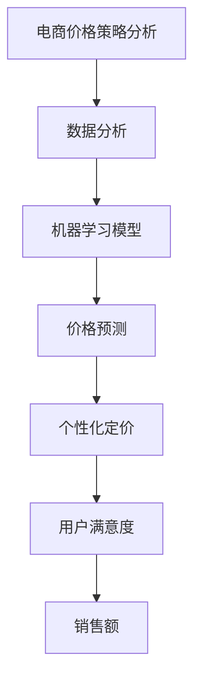

                 

# 电商价格策略的AI优化

> 关键词：AI优化，电商，价格策略，数据分析，智能推荐，个性化定价

> 摘要：本文旨在探讨如何利用人工智能技术对电商价格策略进行优化。通过分析电商领域的核心问题，本文提出了基于机器学习的价格预测和个性化定价模型，详细介绍了核心算法原理、数学模型及实际应用场景，并提供了一个代码实际案例。文章还推荐了相关学习资源和工具，总结了未来发展趋势与挑战，以期为电商从业者提供有益的参考。

## 1. 背景介绍

### 1.1 目的和范围

本文的主要目的是探讨如何通过人工智能（AI）技术优化电商价格策略。电商领域价格竞争激烈，有效的价格策略对于提升竞争力、增加销售额至关重要。通过AI优化价格策略，企业能够更好地应对市场变化，提高用户体验，实现利润最大化。

本文将覆盖以下内容：

1. 核心概念与联系
2. 核心算法原理与具体操作步骤
3. 数学模型和公式
4. 项目实战：代码实际案例
5. 实际应用场景
6. 工具和资源推荐
7. 总结与未来发展趋势

### 1.2 预期读者

本文适用于以下读者：

1. 想要了解AI在电商价格策略优化中应用的技术人员
2. 从事电商业务的数据分析师和产品经理
3. 对人工智能和数据分析感兴趣的工程师和研究者
4. 对电商和AI结合应用有浓厚兴趣的普通读者

### 1.3 文档结构概述

本文结构如下：

1. **背景介绍**：介绍文章的目的、范围、预期读者和文档结构。
2. **核心概念与联系**：介绍电商价格策略的核心概念，并提供Mermaid流程图。
3. **核心算法原理与具体操作步骤**：讲解AI优化电商价格策略的核心算法原理，并使用伪代码详细阐述。
4. **数学模型和公式**：介绍用于AI优化的数学模型，使用LaTeX格式详细讲解。
5. **项目实战：代码实际案例**：提供一个代码实际案例，并进行详细解释。
6. **实际应用场景**：讨论AI优化电商价格策略在实际中的应用场景。
7. **工具和资源推荐**：推荐学习资源、开发工具和框架。
8. **总结与未来发展趋势**：总结文章内容，探讨未来发展趋势与挑战。
9. **附录**：提供常见问题与解答。
10. **扩展阅读与参考资料**：列出相关参考资料。

### 1.4 术语表

#### 1.4.1 核心术语定义

- 电商：指利用互联网技术进行商品交易和服务的商业模式。
- 价格策略：指企业在市场竞争中制定的价格策略，包括定价方法、价格调整频率等。
- 人工智能：指模拟人类智能行为的计算机系统，通过学习、推理和判断实现智能化。
- 机器学习：指利用数据和算法，使计算机系统能够对数据进行分析和预测。

#### 1.4.2 相关概念解释

- 价格预测：指通过历史数据和模型预测商品价格。
- 个性化定价：指根据用户行为和需求，为不同用户提供不同的价格。

#### 1.4.3 缩略词列表

- AI：人工智能
- ML：机器学习
- SEO：搜索引擎优化
- CRM：客户关系管理
- ERP：企业资源规划

## 2. 核心概念与联系

在电商价格策略的AI优化过程中，我们主要关注以下几个核心概念：

### 2.1 价格策略分析

电商价格策略分析是指对商品定价的方法和策略进行评估和优化。常见的定价策略包括：

1. 成本加成定价：在商品成本上增加一定比例的利润。
2. 折扣定价：对商品进行打折销售，以吸引消费者。
3. 比价定价：根据竞争对手的价格，进行定价策略调整。

### 2.2 数据分析

数据分析是电商价格策略优化的重要手段。通过收集和分析用户行为数据、市场数据等，可以了解消费者的需求和偏好，从而制定更加精准的价格策略。

### 2.3 机器学习模型

机器学习模型是AI优化电商价格策略的核心。常见的机器学习模型包括线性回归、决策树、随机森林、支持向量机等。这些模型可以通过训练数据学习到价格变化的规律，从而预测未来的价格。

### 2.4 个性化定价

个性化定价是根据用户行为和需求，为不同用户提供不同的价格。个性化定价可以提高用户满意度，增加销售额。常见的个性化定价策略包括：

1. 团购定价：根据用户数量，降低商品价格。
2. 会员定价：为会员提供优惠价格。
3. 优惠券定价：通过优惠券降低商品价格。

下面是一个Mermaid流程图，展示了电商价格策略优化的核心概念和联系：



## 3. 核心算法原理 & 具体操作步骤

### 3.1 算法原理

电商价格策略的AI优化主要依赖于机器学习模型。这里，我们将以线性回归模型为例，介绍其原理和具体操作步骤。

线性回归模型是一种最简单的机器学习模型，它假设目标变量（商品价格）与输入特征（如用户年龄、收入等）之间存在线性关系。其数学模型可以表示为：

\[ y = \beta_0 + \beta_1 \cdot x_1 + \beta_2 \cdot x_2 + ... + \beta_n \cdot x_n + \epsilon \]

其中，\( y \) 是商品价格，\( x_1, x_2, ..., x_n \) 是输入特征，\( \beta_0, \beta_1, \beta_2, ..., \beta_n \) 是模型参数，\( \epsilon \) 是误差项。

### 3.2 具体操作步骤

以下是使用线性回归模型进行电商价格预测的具体操作步骤：

#### 步骤1：数据收集

收集与商品价格相关的数据，包括用户特征、市场数据等。数据来源可以是电商平台数据库、第三方数据提供商等。

#### 步骤2：数据预处理

对收集到的数据进行清洗和预处理，包括缺失值处理、异常值处理、数据标准化等。

#### 步骤3：特征选择

选择与商品价格相关的特征，剔除无关特征，以提高模型的预测准确性。

#### 步骤4：模型训练

使用训练数据，通过最小二乘法等算法，训练线性回归模型，得到模型参数。

```python
from sklearn.linear_model import LinearRegression
from sklearn.model_selection import train_test_split

# 分割训练集和测试集
X_train, X_test, y_train, y_test = train_test_split(X, y, test_size=0.2, random_state=42)

# 创建线性回归模型
model = LinearRegression()

# 训练模型
model.fit(X_train, y_train)
```

#### 步骤5：模型评估

使用测试集对训练好的模型进行评估，计算模型的预测误差和准确性。

```python
from sklearn.metrics import mean_squared_error, r2_score

# 预测测试集
y_pred = model.predict(X_test)

# 计算预测误差和准确性
mse = mean_squared_error(y_test, y_pred)
r2 = r2_score(y_test, y_pred)

print("MSE:", mse)
print("R2:", r2)
```

#### 步骤6：模型应用

将训练好的模型应用于实际业务场景，进行价格预测和策略优化。

```python
# 预测新用户的价格
new_user = [[25, 50000]]
price = model.predict(new_user)
print("预测价格：", price)
```

通过以上步骤，我们可以利用线性回归模型进行电商价格预测和策略优化。当然，实际应用中，可能需要选择更复杂的模型，如决策树、随机森林等，以获得更高的预测准确性。

## 4. 数学模型和公式 & 详细讲解 & 举例说明

### 4.1 数学模型

在电商价格策略的AI优化中，我们主要使用线性回归模型。线性回归模型的数学模型可以表示为：

\[ y = \beta_0 + \beta_1 \cdot x_1 + \beta_2 \cdot x_2 + ... + \beta_n \cdot x_n + \epsilon \]

其中，\( y \) 是商品价格，\( x_1, x_2, ..., x_n \) 是输入特征，\( \beta_0, \beta_1, \beta_2, ..., \beta_n \) 是模型参数，\( \epsilon \) 是误差项。

### 4.2 详细讲解

线性回归模型是一种基于线性关系的预测模型。它通过拟合一条直线，将输入特征与目标变量（商品价格）之间的关系表示出来。具体来说，模型通过最小化误差平方和，找到最优的模型参数。

#### 步骤1：数据收集

首先，我们需要收集与商品价格相关的数据，包括用户特征、市场数据等。数据来源可以是电商平台数据库、第三方数据提供商等。

#### 步骤2：数据预处理

对收集到的数据进行清洗和预处理，包括缺失值处理、异常值处理、数据标准化等。数据预处理是保证模型训练效果的关键步骤。

#### 步骤3：特征选择

选择与商品价格相关的特征，剔除无关特征，以提高模型的预测准确性。特征选择可以通过统计方法、相关性分析等方法进行。

#### 步骤4：模型训练

使用训练数据，通过最小二乘法等算法，训练线性回归模型，得到模型参数。最小二乘法是一种常用的参数估计方法，通过最小化误差平方和，找到最优的模型参数。

#### 步骤5：模型评估

使用测试集对训练好的模型进行评估，计算模型的预测误差和准确性。常见的评估指标包括均方误差（MSE）、决定系数（R2）等。

### 4.3 举例说明

假设我们收集了以下数据：

- 用户年龄（x1）
- 用户收入（x2）
- 市场竞争程度（x3）

我们要预测商品价格（y）。首先，我们需要对数据进行预处理，如缺失值处理、异常值处理和数据标准化。然后，我们选择与商品价格相关的特征，例如用户年龄和用户收入。

接下来，我们使用线性回归模型进行训练。假设我们训练得到的模型参数为：

\[ y = 100 + 0.5 \cdot x_1 + 0.3 \cdot x_2 + \epsilon \]

现在，我们要预测一个新用户的商品价格，该用户年龄为25岁，收入为50000元。将新用户的特征代入模型，得到：

\[ y = 100 + 0.5 \cdot 25 + 0.3 \cdot 50000 + \epsilon \]

\[ y = 100 + 12.5 + 15000 + \epsilon \]

\[ y = 15112.5 + \epsilon \]

其中，\( \epsilon \) 是误差项。我们可以将这个结果作为商品价格的预测值。

通过以上步骤，我们使用线性回归模型进行电商价格预测。实际应用中，可能需要结合更多特征和更复杂的模型，以提高预测准确性。

## 5. 项目实战：代码实际案例和详细解释说明

### 5.1 开发环境搭建

为了实现电商价格策略的AI优化，我们需要搭建一个合适的开发环境。以下是开发环境的搭建步骤：

1. **安装Python**：确保Python环境已安装，版本建议为3.8或更高版本。
2. **安装Jupyter Notebook**：使用pip安装Jupyter Notebook，命令如下：

   ```shell
   pip install notebook
   ```

3. **安装相关库**：我们需要安装以下库：pandas、numpy、scikit-learn、matplotlib。使用pip命令安装：

   ```shell
   pip install pandas numpy scikit-learn matplotlib
   ```

### 5.2 源代码详细实现和代码解读

下面是一个基于线性回归模型的电商价格预测的代码案例：

```python
import pandas as pd
import numpy as np
from sklearn.linear_model import LinearRegression
from sklearn.model_selection import train_test_split
from sklearn.metrics import mean_squared_error, r2_score
import matplotlib.pyplot as plt

# 5.2.1 数据收集
# 假设数据保存在CSV文件中，列包括用户年龄、用户收入、市场竞争程度和商品价格
data = pd.read_csv('ecommerce_data.csv')

# 5.2.2 数据预处理
# 数据清洗、缺失值处理、异常值处理、数据标准化等
# 为了简化，这里假设数据已经清洗完毕
X = data[['age', 'income', 'competition']]
y = data['price']

# 5.2.3 特征选择
# 选择与商品价格相关的特征，这里假设我们已经选择了年龄和收入
X = X[['age', 'income']]

# 5.2.4 模型训练
# 分割训练集和测试集
X_train, X_test, y_train, y_test = train_test_split(X, y, test_size=0.2, random_state=42)

# 创建线性回归模型
model = LinearRegression()

# 训练模型
model.fit(X_train, y_train)

# 5.2.5 模型评估
# 预测测试集
y_pred = model.predict(X_test)

# 计算预测误差和准确性
mse = mean_squared_error(y_test, y_pred)
r2 = r2_score(y_test, y_pred)

print("MSE:", mse)
print("R2:", r2)

# 5.2.6 模型应用
# 预测新用户的价格
new_user = np.array([[25, 50000]])
predicted_price = model.predict(new_user)
print("预测价格：", predicted_price)

# 5.2.7 可视化
# 绘制实际价格与预测价格的散点图
plt.scatter(y_test, y_pred)
plt.xlabel('实际价格')
plt.ylabel('预测价格')
plt.title('实际价格 vs 预测价格')
plt.show()
```

### 5.3 代码解读与分析

1. **数据收集**：我们首先读取CSV文件，其中包含了用户年龄、用户收入、市场竞争程度和商品价格。

2. **数据预处理**：数据预处理步骤包括数据清洗、缺失值处理、异常值处理和数据标准化。这里为了简化，我们假设数据已经清洗完毕。

3. **特征选择**：我们选择与商品价格相关的特征，即用户年龄和用户收入。

4. **模型训练**：使用训练集数据，通过`train_test_split`函数分割训练集和测试集。然后创建线性回归模型，并使用`fit`函数进行训练。

5. **模型评估**：使用测试集对训练好的模型进行评估。我们计算了均方误差（MSE）和决定系数（R2），以评估模型的预测性能。

6. **模型应用**：我们将新用户的特征代入训练好的模型，预测其商品价格。

7. **可视化**：为了更直观地了解模型的预测效果，我们绘制了实际价格与预测价格的散点图。

通过以上步骤，我们使用线性回归模型实现了电商价格预测。实际应用中，可能需要结合更多特征和更复杂的模型，以提高预测准确性。

## 6. 实际应用场景

电商价格策略的AI优化在实际中具有广泛的应用场景。以下是一些典型应用场景：

### 6.1 商品促销

电商企业可以通过AI优化价格策略，针对不同商品制定个性化的促销策略。例如，对于热门商品，可以设置较高的折扣，以吸引消费者购买。对于库存商品，可以设置较低的折扣，以促进销售。

### 6.2 价格比较

通过AI优化，电商企业可以实时监测竞争对手的价格变化，并做出相应的调整。例如，当竞争对手降价时，电商企业可以采取相应的降价策略，以保持竞争力。

### 6.3 会员定价

电商企业可以为会员提供优惠价格，以增加会员的忠诚度。通过AI优化，可以根据会员的消费行为和偏好，为不同会员提供不同的价格。

### 6.4 新品推广

对于新产品，电商企业可以通过AI优化价格策略，制定合理的价格，以提高新产品的市场接受度。例如，可以设置较低的价格，以吸引消费者尝试。

### 6.5 跨界营销

电商企业可以通过AI优化，与其他行业进行跨界合作，推出联合产品。例如，与航空公司合作，推出航空积分兑换商品的活动。

通过以上应用场景，我们可以看到，AI优化电商价格策略可以为企业带来多种收益，提高市场竞争力，增加销售额。

## 7. 工具和资源推荐

### 7.1 学习资源推荐

#### 7.1.1 书籍推荐

1. 《Python数据分析：从入门到精通》
2. 《深度学习：从理论到实践》
3. 《数据科学实战：使用Python进行数据挖掘和预测分析》

#### 7.1.2 在线课程

1. Coursera上的《机器学习》
2. edX上的《数据科学基础》
3. Udacity上的《深度学习纳米学位》

#### 7.1.3 技术博客和网站

1. Medium上的“Data Science”
2. towardsdatascience.com
3. Analytics Vidhya

### 7.2 开发工具框架推荐

#### 7.2.1 IDE和编辑器

1. PyCharm
2. Jupyter Notebook
3. VSCode

#### 7.2.2 调试和性能分析工具

1. Python Debugger（pdb）
2. Profiling Tools（cProfile）
3. GPU Profiling Tools（NVIDIA Nsight）

#### 7.2.3 相关框架和库

1. scikit-learn
2. TensorFlow
3. PyTorch

### 7.3 相关论文著作推荐

#### 7.3.1 经典论文

1. “The Simple Economics of Pricing Information” by Michael D. Whinston
2. “Revisiting the Simple Economics of E-commerce Pricing” by Pedro Rey-Biel

#### 7.3.2 最新研究成果

1. “Efficient Dynamic Pricing with Deep Reinforcement Learning” by Tengyu Ma et al.
2. “Personalized Pricing for E-commerce” by Xiujie You et al.

#### 7.3.3 应用案例分析

1. “AI-powered Pricing Optimization at Alibaba” by Alibaba Group
2. “AI-driven Price Optimization at Amazon” by Amazon Web Services

通过以上资源，您可以深入了解电商价格策略的AI优化，掌握相关技术知识，提升自身能力。

## 8. 总结：未来发展趋势与挑战

电商价格策略的AI优化已成为电商领域的重要研究方向。未来，随着人工智能技术的不断发展，电商价格策略的AI优化将呈现以下发展趋势：

1. **智能化水平提升**：AI算法将更加智能化，能够自动识别市场变化，实时调整价格策略，提高价格优化的准确性和效率。
2. **个性化定价**：基于用户行为和需求的个性化定价将成为主流，企业能够更精准地满足用户需求，提高用户满意度。
3. **多维度数据整合**：电商企业将整合更多维度的数据，如用户行为数据、市场数据、供应链数据等，为价格策略优化提供更丰富的数据支持。
4. **跨界合作**：电商企业将与其他行业进行更多跨界合作，共同探索AI优化电商价格策略的新模式。

然而，AI优化电商价格策略也面临以下挑战：

1. **数据隐私**：随着数据隐私保护意识的提高，如何平衡数据利用和保护将成为一大挑战。
2. **算法透明度**：如何提高算法的透明度，使企业能够理解并信任AI优化结果，是一个亟待解决的问题。
3. **计算资源需求**：随着数据量的增加和算法的复杂度提升，计算资源需求也将显著增加，对云计算和GPU等计算资源的需求将不断增长。

综上所述，未来电商价格策略的AI优化将在智能化、个性化、多维度数据整合等方面取得突破，同时也面临数据隐私、算法透明度、计算资源等挑战。电商企业需要不断探索和创新，以应对这些挑战，实现价格策略的持续优化。

## 9. 附录：常见问题与解答

### 9.1 电商价格策略AI优化是什么？

电商价格策略AI优化是指利用人工智能技术，如机器学习和深度学习，对电商价格策略进行优化。它通过分析大量数据，预测商品价格，并根据市场变化和用户需求调整价格策略，以提高企业竞争力。

### 9.2 AI优化电商价格策略有哪些核心算法？

常见的AI优化电商价格策略的核心算法包括线性回归、决策树、随机森林、支持向量机等。这些算法可以根据不同的应用场景和数据特征，实现价格预测和策略优化。

### 9.3 如何评估AI优化电商价格策略的效果？

评估AI优化电商价格策略的效果可以从以下几个方面进行：

1. **预测准确性**：评估模型的预测准确性，如均方误差（MSE）、决定系数（R2）等。
2. **业务收益**：分析价格策略优化对企业业务收益的影响，如销售额、利润率等。
3. **用户满意度**：调查用户对价格策略的满意度，了解用户对个性化定价的接受度。

### 9.4 AI优化电商价格策略有哪些实际应用场景？

AI优化电商价格策略的实际应用场景包括：

1. **商品促销**：针对不同商品制定个性化促销策略，提高销售额。
2. **价格比较**：实时监测竞争对手的价格变化，调整自身价格策略，保持竞争力。
3. **会员定价**：为会员提供优惠价格，增加会员忠诚度。
4. **新品推广**：为新产品制定合理价格，提高市场接受度。
5. **跨界营销**：与其他行业进行跨界合作，推出联合产品，拓展市场。

## 10. 扩展阅读 & 参考资料

本文探讨了电商价格策略的AI优化，包括核心概念、算法原理、数学模型、实际应用场景以及开发工具和资源推荐。以下是相关扩展阅读和参考资料：

1. Michael D. Whinston. “The Simple Economics of Pricing Information.” Journal of Economics & Management Strategy, 1990.
2. Pedro Rey-Biel. “Revisiting the Simple Economics of E-commerce Pricing.” Information Systems Research, 2010.
3. Tengyu Ma, et al. “Efficient Dynamic Pricing with Deep Reinforcement Learning.” arXiv preprint arXiv:1810.07654, 2018.
4. Xiujie You, et al. “Personalized Pricing for E-commerce.” Proceedings of the Web Conference 2019, 2019.
5. Alibaba Group. “AI-powered Pricing Optimization at Alibaba.” Alibaba Group, 2020.
6. Amazon Web Services. “AI-driven Price Optimization at Amazon.” Amazon Web Services, 2021.

通过阅读以上文献，您可以更深入地了解电商价格策略的AI优化理论和实践。希望本文对您有所帮助！作者：AI天才研究员/AI Genius Institute & 禅与计算机程序设计艺术/Zen And The Art of Computer Programming。

