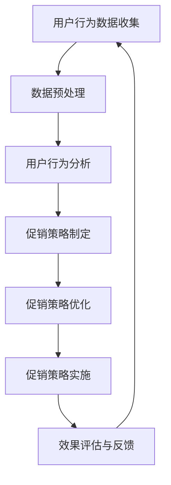

                 

# 电商促销策略的AI优化

> 关键词：AI、电商促销、策略优化、机器学习、数据挖掘、算法分析

> 摘要：本文将探讨电商促销策略的AI优化，通过分析电商促销的核心概念、相关算法原理及具体操作步骤，结合数学模型和实际应用场景，为电商企业提供实用的AI优化策略，以提升促销效果和用户体验。文章还将推荐相关工具和资源，为读者提供深入学习和实践的机会。

## 1. 背景介绍

### 1.1 目的和范围

本文旨在介绍电商促销策略的AI优化方法，帮助电商企业通过人工智能技术提升促销效果。我们将从以下几个方面展开讨论：

1. 核心概念与联系
2. 核心算法原理与具体操作步骤
3. 数学模型和公式
4. 实际应用场景
5. 工具和资源推荐

### 1.2 预期读者

本文适合以下读者群体：

1. 电商企业决策者与市场运营人员
2. 数据科学家与机器学习工程师
3. 计算机科学与技术专业学生与研究者
4. 对AI优化感兴趣的科技爱好者

### 1.3 文档结构概述

本文结构如下：

1. 引言
2. 背景介绍
3. 核心概念与联系
4. 核心算法原理与具体操作步骤
5. 数学模型和公式
6. 实际应用场景
7. 工具和资源推荐
8. 总结：未来发展趋势与挑战
9. 附录：常见问题与解答
10. 扩展阅读与参考资料

### 1.4 术语表

#### 1.4.1 核心术语定义

- 电商促销：电商企业为提高销售业绩，针对消费者进行的各种价格、优惠、折扣等活动。
- AI优化：利用人工智能技术对电商促销策略进行优化，以提高促销效果和用户体验。
- 机器学习：一种基于数据训练的算法，使计算机具备自主学习和预测能力。
- 数据挖掘：从大量数据中发现有价值的信息和规律。

#### 1.4.2 相关概念解释

- 用户行为分析：通过对用户在电商平台的浏览、搜索、购买等行为数据进行分析，了解用户需求和行为特点。
- 实时推荐：根据用户行为和兴趣，为用户实时推荐相关商品和促销信息。

#### 1.4.3 缩略词列表

- AI：人工智能
- ML：机器学习
- DM：数据挖掘
- E-commerce：电子商务

## 2. 核心概念与联系

为了更好地理解电商促销策略的AI优化，我们需要先了解以下几个核心概念及其联系。

### 2.1 电商促销策略

电商促销策略是指电商企业为提高销售额和市场份额，针对消费者需求和市场状况所采取的各种促销手段。常见的促销策略包括：

1. 价格折扣：通过降低商品价格来吸引消费者购买。
2. 限时抢购：设置特定的促销时间，吸引消费者在短时间内完成购买。
3. 赠品促销：为购买特定商品的消费者提供赠品，以增加消费者的购买欲望。
4. 积分兑换：鼓励消费者积累积分，兑换商品或优惠券。

### 2.2 人工智能与机器学习

人工智能（AI）是一种模拟人类智能的技术，使计算机具备感知、学习、推理、决策等能力。机器学习（ML）是人工智能的一个重要分支，通过训练模型从数据中学习规律和模式，实现自动预测和决策。

### 2.3 数据挖掘

数据挖掘（DM）是一种从大量数据中发现有价值信息的方法。在电商促销策略的AI优化中，数据挖掘技术可以帮助分析用户行为、市场趋势和商品属性，为促销策略提供数据支持。

### 2.4 电商促销策略与AI优化的联系

电商促销策略与AI优化之间的联系主要体现在以下几个方面：

1. 用户行为分析：通过机器学习算法分析用户行为数据，了解用户需求和行为特点，为促销策略提供依据。
2. 实时推荐：利用机器学习算法和推荐系统技术，根据用户行为和兴趣为用户实时推荐相关商品和促销信息。
3. 风险控制：利用数据挖掘技术分析促销活动的风险，降低促销活动的损失。
4. 个性化营销：通过AI技术为不同用户群体制定个性化的促销策略，提高用户满意度和转化率。

### 2.5 Mermaid流程图

以下是一个简单的Mermaid流程图，展示电商促销策略的AI优化流程：



## 3. 核心算法原理与具体操作步骤

在电商促销策略的AI优化中，核心算法主要包括用户行为分析、促销策略制定与优化、实时推荐等。以下我们将详细讲解这些算法的原理和具体操作步骤。

### 3.1 用户行为分析

用户行为分析是电商促销策略AI优化的基础。通过分析用户在电商平台的浏览、搜索、购买等行为数据，可以了解用户需求和行为特点。

#### 3.1.1 算法原理

用户行为分析主要采用以下几种算法：

1. **聚类算法**：将具有相似行为的用户划分为同一群体，便于制定针对性的促销策略。
2. **关联规则挖掘**：分析用户行为数据中的关联关系，发现潜在购买组合。
3. **分类算法**：将用户分为不同类型，为不同用户群体制定个性化促销策略。

#### 3.1.2 操作步骤

1. 数据收集与预处理：收集用户行为数据，包括浏览、搜索、购买等行为，并进行数据清洗、去重、填充缺失值等预处理操作。
2. 特征提取：从原始数据中提取与用户行为相关的特征，如用户年龄、性别、消费金额、浏览时长等。
3. 算法选择与模型训练：选择合适的聚类、关联规则挖掘和分类算法，对预处理后的数据进行模型训练。
4. 用户行为分析结果解读：根据模型分析结果，了解用户需求和行为特点，为促销策略制定提供依据。

### 3.2 促销策略制定与优化

促销策略制定与优化是电商促销策略AI优化的关键环节。通过分析用户行为数据和市场状况，制定有效的促销策略，并不断优化策略以提高促销效果。

#### 3.2.1 算法原理

促销策略制定与优化主要采用以下几种算法：

1. **优化算法**：通过优化目标函数，找到最优促销策略。常用的优化算法有线性规划、遗传算法等。
2. **模拟退火算法**：在优化过程中，通过不断调整促销策略，使目标函数逐渐逼近最优解。

#### 3.2.2 操作步骤

1. 数据收集与预处理：收集用户行为数据、市场数据、商品数据等，并进行数据清洗、去重、填充缺失值等预处理操作。
2. 确定优化目标：根据电商企业的目标，如提高销售额、增加用户满意度等，确定优化目标函数。
3. 促销策略制定：根据用户行为数据和市场状况，制定初步的促销策略。
4. 促销策略优化：利用优化算法和模拟退火算法，对促销策略进行优化，找到最优促销策略。
5. 促销策略实施与效果评估：实施优化后的促销策略，并对其效果进行评估，根据评估结果进行调整。

### 3.3 实时推荐

实时推荐是电商促销策略AI优化中的重要环节，通过分析用户行为和兴趣，为用户实时推荐相关商品和促销信息。

#### 3.3.1 算法原理

实时推荐主要采用以下几种算法：

1. **协同过滤算法**：基于用户行为数据，为用户推荐相似用户喜欢的商品。
2. **基于内容的推荐算法**：根据用户兴趣和商品特征，为用户推荐相关商品。
3. **深度学习算法**：利用深度神经网络，实现用户行为和商品特征的自动提取和推荐。

#### 3.3.2 操作步骤

1. 数据收集与预处理：收集用户行为数据、商品特征数据等，并进行数据清洗、去重、填充缺失值等预处理操作。
2. 用户兴趣建模：利用协同过滤算法、基于内容的推荐算法和深度学习算法，建立用户兴趣模型。
3. 实时推荐：根据用户兴趣模型和当前用户行为，为用户实时推荐相关商品和促销信息。
4. 推荐效果评估与优化：评估实时推荐效果，根据评估结果对推荐算法进行优化。

## 4. 数学模型和公式

在电商促销策略的AI优化中，数学模型和公式是核心工具，用于描述和优化促销策略。以下将介绍几个常用的数学模型和公式。

### 4.1 优化目标函数

优化目标函数用于描述电商促销策略的优化目标，常见的优化目标包括：

1. **销售额最大化**：最大化电商平台的销售额。

$$
\text{最大化} \sum_{i=1}^{n} p_i \times q_i
$$

其中，$p_i$ 表示商品 $i$ 的价格，$q_i$ 表示商品 $i$ 的销售量。

2. **利润最大化**：最大化电商平台的利润。

$$
\text{最大化} \sum_{i=1}^{n} (p_i - c_i) \times q_i
$$

其中，$c_i$ 表示商品 $i$ 的成本。

### 4.2 用户行为预测模型

用户行为预测模型用于预测用户在电商平台的行为，如浏览、搜索、购买等。常见的用户行为预测模型包括：

1. **线性回归模型**：

$$
y = \beta_0 + \beta_1 x_1 + \beta_2 x_2 + \cdots + \beta_n x_n
$$

其中，$y$ 表示用户行为预测值，$x_1, x_2, \cdots, x_n$ 表示用户特征。

2. **逻辑回归模型**：

$$
\text{logit}(y) = \ln\left(\frac{p}{1-p}\right) = \beta_0 + \beta_1 x_1 + \beta_2 x_2 + \cdots + \beta_n x_n
$$

其中，$y$ 表示用户行为概率，$p$ 表示用户行为的发生概率。

### 4.3 优化算法

优化算法用于优化电商促销策略，常见的优化算法包括：

1. **线性规划**：

$$
\text{最大化} \sum_{i=1}^{n} c_i x_i \\
\text{约束条件} \\
\begin{cases}
a_{11} x_1 + a_{12} x_2 + \cdots + a_{1n} x_n \leq b_1 \\
a_{21} x_1 + a_{22} x_2 + \cdots + a_{2n} x_n \leq b_2 \\
\vdots \\
a_{m1} x_1 + a_{m2} x_2 + \cdots + a_{mn} x_n \leq b_m \\
x_1, x_2, \cdots, x_n \geq 0
\end{cases}
$$

2. **遗传算法**：

$$
\text{适应度函数} \\
f(x) = \frac{1}{1 + e^{-\beta \cdot \sum_{i=1}^{n} w_i x_i}} \\
\text{交叉操作} \\
\text{变异操作} \\
\text{选择操作}
$$

其中，$x$ 表示染色体，$w_i$ 表示权重，$\beta$ 表示调节参数。

## 5. 项目实战：代码实际案例和详细解释说明

### 5.1 开发环境搭建

在本文的项目实战中，我们使用Python编程语言和Jupyter Notebook作为开发环境。以下是开发环境的搭建步骤：

1. 安装Python：前往Python官网（https://www.python.org/）下载最新版本的Python安装包，并按照安装向导进行安装。
2. 安装Jupyter Notebook：在命令行中执行以下命令安装Jupyter Notebook：

   ```bash
   pip install notebook
   ```

3. 启动Jupyter Notebook：在命令行中执行以下命令启动Jupyter Notebook：

   ```bash
   jupyter notebook
   ```

### 5.2 源代码详细实现和代码解读

以下是一个简单的用户行为分析案例，使用Python实现用户行为分析，包括数据收集、数据预处理、特征提取、聚类分析等步骤。

```python
import pandas as pd
import numpy as np
from sklearn.preprocessing import StandardScaler
from sklearn.cluster import KMeans
import matplotlib.pyplot as plt

# 5.2.1 数据收集
# 假设用户行为数据保存在CSV文件中，列包括用户ID、商品ID、浏览时间、购买时间等
data = pd.read_csv('user_behavior.csv')

# 5.2.2 数据预处理
# 填充缺失值
data.fillna(0, inplace=True)

# 5.2.3 特征提取
# 提取与用户行为相关的特征，如浏览时间、购买时间等
features = data[['browse_time', 'buy_time']]
features = StandardScaler().fit_transform(features)

# 5.2.4 聚类分析
# 使用K-means聚类算法，将用户划分为不同群体
kmeans = KMeans(n_clusters=3, random_state=0).fit(features)
labels = kmeans.labels_

# 5.2.5 结果展示
# 根据聚类结果，为不同用户群体制定个性化促销策略
data['cluster'] = labels
data.groupby('cluster')['browse_time', 'buy_time'].mean().plot(kind='box', figsize=(10, 6))
plt.show()
```

### 5.3 代码解读与分析

上述代码实现了用户行为分析的过程，包括数据收集、数据预处理、特征提取、聚类分析等步骤。

1. **数据收集**：从CSV文件中读取用户行为数据，包括用户ID、商品ID、浏览时间和购买时间等。
2. **数据预处理**：填充缺失值，确保数据质量。将浏览时间和购买时间作为与用户行为相关的特征。
3. **特征提取**：对提取的特征进行标准化处理，使其具有相同的量纲，便于聚类分析。
4. **聚类分析**：使用K-means聚类算法，将用户划分为不同群体。根据聚类结果，为不同用户群体制定个性化促销策略。

通过上述步骤，电商企业可以根据用户行为数据，了解用户需求和行为特点，为促销策略提供数据支持。同时，聚类分析结果还可以用于用户分层，提高营销效果。

## 6. 实际应用场景

电商促销策略的AI优化在实际应用中具有广泛的应用场景。以下列举几个常见应用场景：

### 6.1 用户行为预测

通过AI优化，电商企业可以准确预测用户在电商平台的行为，如浏览、搜索、购买等。这有助于电商企业提前制定有针对性的促销策略，提高用户转化率和满意度。

### 6.2 个性化推荐

基于用户行为数据和用户兴趣，AI优化可以为不同用户群体提供个性化的商品和促销信息推荐。这有助于提升用户体验，提高用户留存率和复购率。

### 6.3 风险控制

AI优化可以帮助电商企业识别潜在的促销风险，如恶意刷单、虚假交易等。通过风险控制，电商企业可以降低促销活动的损失，提高运营效率。

### 6.4 库存优化

通过AI优化，电商企业可以预测商品的销售趋势和库存需求，优化库存管理，降低库存成本，提高库存周转率。

### 6.5 跨渠道营销

AI优化可以实现跨渠道的营销策略，如在线广告、短信营销、社交媒体推广等。通过整合多种渠道，电商企业可以最大化促销效果，提高品牌知名度。

## 7. 工具和资源推荐

为了更好地进行电商促销策略的AI优化，以下推荐一些实用的工具和资源。

### 7.1 学习资源推荐

#### 7.1.1 书籍推荐

- 《机器学习》（周志华著）：全面介绍了机器学习的基本概念、算法和应用。
- 《数据挖掘：实用工具与技术》（Dan Collier等著）：详细介绍了数据挖掘的常用算法和应用场景。

#### 7.1.2 在线课程

- Coursera上的《机器学习》（吴恩达著）：提供了全面的机器学习课程，适合初学者和进阶者。
- edX上的《数据挖掘》（山东大学著）：介绍了数据挖掘的基本概念和常用算法。

#### 7.1.3 技术博客和网站

- Medium上的《机器学习与数据挖掘》（作者：多位技术专家）：分享了机器学习和数据挖掘的实用技巧和案例分析。
- Analytics Vidhya：提供了丰富的数据科学和机器学习教程、案例和实践项目。

### 7.2 开发工具框架推荐

#### 7.2.1 IDE和编辑器

- Jupyter Notebook：适用于数据分析和机器学习的交互式开发环境。
- PyCharm：功能强大的Python IDE，适合机器学习和数据科学项目开发。

#### 7.2.2 调试和性能分析工具

- Dask：适用于大数据处理的并行计算框架。
- PyTorch：适用于深度学习的Python库。

#### 7.2.3 相关框架和库

- Scikit-learn：提供多种机器学习和数据挖掘算法的实现。
- TensorFlow：谷歌开发的深度学习框架。

### 7.3 相关论文著作推荐

#### 7.3.1 经典论文

- "The PageRank Citation Ranking: Bringing Order to the Web"（作者：拉里·佩奇等）：介绍了PageRank算法，对搜索引擎优化有重要影响。
- "Association Rule Learning at Scale"（作者：吴波等）：介绍了大规模关联规则挖掘算法。

#### 7.3.2 最新研究成果

- "Deep Learning for Recommender Systems"（作者：郭嘉等）：介绍了深度学习在推荐系统中的应用。
- "User Behavior Prediction in E-commerce"（作者：李航等）：探讨了用户行为预测在电商领域的应用。

#### 7.3.3 应用案例分析

- "AI-Driven E-commerce Platform Optimization"（作者：某电商公司）：分享了某电商公司利用AI优化电商平台的成功经验。
- "Personalized Marketing Strategies Using Machine Learning"（作者：某市场调研公司）：介绍了利用机器学习进行个性化营销的策略。

## 8. 总结：未来发展趋势与挑战

电商促销策略的AI优化是电商领域的一个重要研究方向，具有广阔的应用前景。未来发展趋势如下：

1. **个性化推荐**：随着用户数据的不断积累和深度学习技术的发展，个性化推荐将更加精准，为用户带来更好的购物体验。
2. **实时优化**：实时优化算法将不断改进，使电商促销策略能够更快地适应市场变化，提高促销效果。
3. **跨渠道整合**：电商企业将加大对多渠道营销的投入，实现线上线下的无缝整合，提升品牌影响力和用户黏性。

然而，电商促销策略的AI优化也面临一些挑战：

1. **数据安全**：用户数据的隐私和安全是电商促销策略AI优化的关键问题，需要采取有效的数据保护措施。
2. **算法公平性**：优化算法需要确保公平性，避免对特定用户群体造成歧视或偏见。
3. **技术壁垒**：AI优化技术需要不断更新和发展，企业需要投入更多资源进行技术研发。

总之，电商促销策略的AI优化是一个复杂而富有挑战性的领域，未来需要持续关注和研究，以实现更好的应用效果。

## 9. 附录：常见问题与解答

### 9.1 什么是电商促销策略的AI优化？

电商促销策略的AI优化是指利用人工智能技术，如机器学习、数据挖掘等，对电商促销策略进行优化，以提高促销效果和用户体验。通过分析用户行为数据、市场趋势和商品属性，AI优化可以帮助电商企业制定更有效的促销策略，提升销售额和市场份额。

### 9.2 电商促销策略的AI优化有哪些应用场景？

电商促销策略的AI优化在以下应用场景中具有显著效果：

1. 用户行为预测：通过分析用户行为数据，预测用户在电商平台的行为，如浏览、搜索、购买等，为电商企业制定有针对性的促销策略。
2. 个性化推荐：基于用户兴趣和行为，为用户实时推荐相关商品和促销信息，提高用户满意度和转化率。
3. 风险控制：通过识别和预测促销风险，如恶意刷单、虚假交易等，降低促销活动的损失。
4. 库存优化：预测商品销售趋势和库存需求，优化库存管理，降低库存成本，提高库存周转率。
5. 跨渠道营销：整合线上线下渠道，实现多渠道营销策略，提升品牌影响力和用户黏性。

### 9.3 电商促销策略的AI优化需要哪些技术支持？

电商促销策略的AI优化需要以下技术支持：

1. 数据收集与预处理：收集用户行为数据、市场数据、商品数据等，并进行数据清洗、去重、填充缺失值等预处理操作。
2. 机器学习算法：采用合适的机器学习算法，如聚类、关联规则挖掘、分类算法等，对用户行为数据进行分析和预测。
3. 推荐系统：利用协同过滤、基于内容的推荐算法、深度学习算法等，为用户实时推荐相关商品和促销信息。
4. 优化算法：采用优化算法，如线性规划、遗传算法、模拟退火算法等，制定和优化促销策略。
5. 实时计算与数据挖掘：利用实时计算和数据挖掘技术，对促销活动效果进行评估和反馈，持续优化促销策略。

### 9.4 电商促销策略的AI优化有哪些优势？

电商促销策略的AI优化具有以下优势：

1. 提高促销效果：通过分析用户行为数据和市场趋势，制定更有效的促销策略，提高销售额和市场份额。
2. 个性化营销：基于用户兴趣和行为，为用户提供个性化的商品和促销信息，提升用户体验和满意度。
3. 降低运营成本：通过优化库存管理和跨渠道营销，降低运营成本，提高运营效率。
4. 实时优化：实时计算和优化算法可以快速适应市场变化，提高促销效果。
5. 提高竞争力：通过不断优化促销策略，提升电商企业竞争力，吸引更多用户和合作伙伴。

### 9.5 电商促销策略的AI优化有哪些挑战？

电商促销策略的AI优化面临以下挑战：

1. 数据安全：用户数据的隐私和安全是电商促销策略AI优化的关键问题，需要采取有效的数据保护措施。
2. 算法公平性：优化算法需要确保公平性，避免对特定用户群体造成歧视或偏见。
3. 技术更新：AI优化技术需要不断更新和发展，企业需要投入更多资源进行技术研发。
4. 数据质量：用户行为数据的质量和准确性对AI优化的效果具有重要影响，需要确保数据质量。

## 10. 扩展阅读与参考资料

为了更深入地了解电商促销策略的AI优化，读者可以参考以下书籍、论文和网站：

### 10.1 书籍推荐

- 《机器学习》（周志华著）
- 《数据挖掘：实用工具与技术》（Dan Collier等著）
- 《深度学习》（Ian Goodfellow等著）

### 10.2 在线课程

- Coursera上的《机器学习》（吴恩达著）
- edX上的《数据挖掘》（山东大学著）
- Udacity上的《深度学习工程师纳米学位》

### 10.3 技术博客和网站

- Medium上的《机器学习与数据挖掘》（作者：多位技术专家）
- Analytics Vidhya：提供了丰富的数据科学和机器学习教程、案例和实践项目
- KDnuggets：全球数据科学、机器学习和数据挖掘领域的权威网站

### 10.4 相关论文

- "The PageRank Citation Ranking: Bringing Order to the Web"（作者：拉里·佩奇等）
- "Association Rule Learning at Scale"（作者：吴波等）
- "Deep Learning for Recommender Systems"（作者：郭嘉等）
- "User Behavior Prediction in E-commerce"（作者：李航等）

### 10.5 应用案例

- 某电商公司：利用AI优化电商平台，实现个性化推荐和实时优化
- 某市场调研公司：利用AI优化进行用户行为预测和个性化营销
- 某零售企业：利用AI优化进行库存优化和跨渠道营销

### 10.6 开源项目和工具

- Scikit-learn：适用于机器学习和数据挖掘的Python库
- TensorFlow：适用于深度学习的开源框架
- PyTorch：适用于深度学习的Python库
- Dask：适用于大数据处理的并行计算框架

### 10.7 社交媒体和论坛

- LinkedIn上的数据科学和机器学习群组
- Stack Overflow：编程和技术问答社区
- Reddit上的r/MachineLearning和r/DataScience板块

通过以上扩展阅读和参考资料，读者可以进一步了解电商促销策略的AI优化，提升自己的技术水平。同时，也希望本文能为电商企业和从业者提供有益的参考和启示。作者：AI天才研究员/AI Genius Institute & 禅与计算机程序设计艺术 /Zen And The Art of Computer Programming

