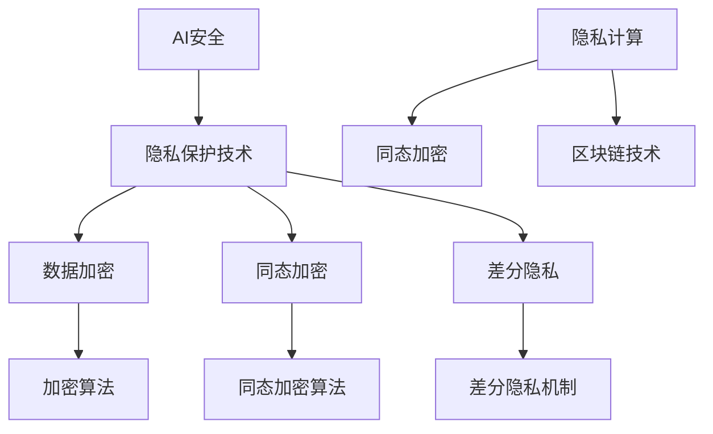

                 

# 电商创业者的AI安全策略：构建用户信任的隐私保护技术实践

> **关键词：电商安全、AI隐私保护、用户信任、数据加密、隐私计算**
>
> **摘要：本文将探讨电商创业者在构建AI系统时如何确保用户隐私安全，增强用户信任。通过对AI安全策略的核心概念、算法原理、数学模型及实际应用场景的分析，提供一系列切实可行的技术实践，助力电商创业者构建一个安全、透明的数字平台。**

## 1. 背景介绍

### 1.1 目的和范围

随着互联网技术的飞速发展，电商行业成为了一个万亿级市场。然而，随着用户数据的爆炸性增长，数据隐私安全问题也日益凸显。电商创业者需要在追求业务增长的同时，确保用户的隐私安全，增强用户对平台的信任。

本文的目的在于，为电商创业者提供一套全面的AI安全策略，特别是针对隐私保护技术的实践。通过深入分析AI安全的核心概念、算法原理、数学模型和实际应用场景，帮助电商创业者构建一个安全、可信的数字平台。

本文的范围包括以下几个方面：

1. AI安全策略的核心概念和原则
2. 隐私保护技术的基本原理和实现方法
3. 实际应用场景中的隐私保护技术实践
4. 工具和资源推荐，以及未来发展趋势与挑战

### 1.2 预期读者

本文的预期读者包括以下几类：

1. 电商创业者：希望了解如何通过AI技术提升业务安全性和用户信任。
2. AI技术开发者：希望了解隐私保护技术的最新进展和实践。
3. 数据安全专家：希望从实际应用角度了解隐私保护技术的挑战和解决方案。
4. 相关行业从业者：对AI安全策略和隐私保护技术感兴趣的读者。

### 1.3 文档结构概述

本文将按照以下结构展开：

1. **背景介绍**：介绍文章的目的和范围，预期读者以及文档结构。
2. **核心概念与联系**：通过Mermaid流程图展示AI安全策略的核心概念和联系。
3. **核心算法原理 & 具体操作步骤**：详细讲解隐私保护技术的基本原理和操作步骤。
4. **数学模型和公式 & 详细讲解 & 举例说明**：介绍隐私保护技术的数学模型和实际应用。
5. **项目实战：代码实际案例和详细解释说明**：提供实际代码案例并进行详细解释。
6. **实际应用场景**：探讨隐私保护技术在电商行业中的应用场景。
7. **工具和资源推荐**：推荐学习资源、开发工具和框架。
8. **总结：未来发展趋势与挑战**：总结文章的主要观点，探讨未来的发展趋势和挑战。
9. **附录：常见问题与解答**：解答读者可能遇到的问题。
10. **扩展阅读 & 参考资料**：推荐相关的研究论文和书籍。

### 1.4 术语表

#### 1.4.1 核心术语定义

- **AI安全**：确保人工智能系统在开发、部署和使用过程中，不受恶意攻击和数据泄露威胁。
- **隐私保护技术**：一系列用于保护用户隐私的技术，如数据加密、差分隐私、同态加密等。
- **用户信任**：用户对电商平台的信任，包括数据安全、隐私保护和业务诚信等方面。
- **数据加密**：将数据转换成不可读的密文，防止未授权访问。
- **同态加密**：在加密数据上进行计算，结果仍然是加密的，确保数据处理过程中的隐私保护。
- **差分隐私**：在数据处理过程中引入噪声，使原始数据无法被推断，保护用户隐私。

#### 1.4.2 相关概念解释

- **同态加密算法**：一种允许在加密数据上执行计算，而不需要解密的算法。
- **差分隐私机制**：一种在数据处理过程中引入噪声，使数据无法被追踪和分析的机制。
- **隐私计算**：在数据加密或匿名化之后进行计算，确保计算结果的安全性。
- **区块链技术**：一种去中心化的分布式账本技术，可用于保护数据隐私和交易安全。

#### 1.4.3 缩略词列表

- **AI**：人工智能
- **DP**：差分隐私
- **HE**：同态加密
- **PKI**：公钥基础设施
- **SSL**：安全套接字层
- **TLS**：传输层安全协议

## 2. 核心概念与联系

在探讨AI安全策略时，我们需要了解一系列核心概念和它们之间的联系。以下是一个简单的Mermaid流程图，用于展示这些概念之间的关系。



### 2.1 AI安全

AI安全是确保人工智能系统在开发、部署和使用过程中，不受恶意攻击和数据泄露威胁的重要环节。AI安全策略包括以下几个方面：

- **身份验证与访问控制**：确保只有授权用户可以访问系统资源。
- **数据保护**：通过数据加密、匿名化等技术保护用户隐私。
- **系统监控与审计**：实时监控系统活动，及时发现并应对异常行为。
- **攻击防御**：通过防火墙、入侵检测系统等技术防御恶意攻击。

### 2.2 隐私保护技术

隐私保护技术是AI安全策略的核心组成部分，主要包括数据加密、同态加密和差分隐私等。

- **数据加密**：将数据转换成不可读的密文，防止未授权访问。常见的数据加密算法包括对称加密和非对称加密。
- **同态加密**：在加密数据上进行计算，确保计算结果仍然是加密的。同态加密允许在不解密数据的情况下进行数据处理，提高数据安全性。
- **差分隐私**：在数据处理过程中引入噪声，使原始数据无法被推断。差分隐私技术广泛应用于数据分析、机器学习等领域，保护用户隐私。

### 2.3 隐私计算

隐私计算是在数据加密或匿名化之后进行计算，确保计算结果的安全性。隐私计算技术主要包括以下几种：

- **同态加密计算**：在加密数据上进行计算，不涉及解密过程。
- **联邦学习**：多个参与方在本地进行模型训练，然后汇总结果，避免数据共享。
- **区块链计算**：利用区块链的分布式账本技术进行数据计算，确保数据的安全性和可信性。

### 2.4 区块链技术

区块链技术是一种去中心化的分布式账本技术，可用于保护数据隐私和交易安全。区块链技术的主要优势包括：

- **数据不可篡改**：区块链的数据一旦被写入，就不可更改，确保数据的真实性。
- **去中心化**：区块链不需要中心化的第三方机构，降低了数据泄露的风险。
- **智能合约**：利用智能合约自动执行合同条款，确保交易的透明性和安全性。

通过上述核心概念和联系的分析，我们可以更好地理解AI安全策略的各个方面，以及如何在实际应用中实现用户隐私保护。

## 3. 核心算法原理 & 具体操作步骤

在隐私保护技术中，数据加密、同态加密和差分隐私是核心算法。以下将详细介绍这些算法的基本原理和具体操作步骤。

### 3.1 数据加密

数据加密是保护数据隐私的基础技术，通过将数据转换成密文，防止未授权访问。常见的数据加密算法包括对称加密和非对称加密。

#### 3.1.1 对称加密

对称加密使用相同的密钥进行加密和解密。加密过程如下：

```plaintext
加密过程：
1. 选择加密算法，如AES。
2. 生成随机密钥。
3. 将明文数据分块。
4. 对每个数据块进行加密，得到密文。

解密过程：
1. 使用相同的密钥和加密算法。
2. 对每个数据块进行解密，得到明文数据。
```

#### 3.1.2 非对称加密

非对称加密使用一对密钥（公钥和私钥）进行加密和解密。加密过程如下：

```plaintext
加密过程：
1. 生成公钥和私钥对。
2. 选择加密算法，如RSA。
3. 使用公钥对数据进行加密，得到密文。

解密过程：
1. 使用私钥和相同的加密算法。
2. 对数据进行解密，得到明文数据。
```

### 3.2 同态加密

同态加密允许在加密数据上进行计算，而不需要解密。同态加密算法分为完全同态加密和部分同态加密。

#### 3.2.1 完全同态加密

完全同态加密可以在加密数据上执行任意计算，而不会降低计算效率。例如，Paillier加密是一种完全同态加密算法。

```plaintext
加密过程：
1. 生成公钥和私钥对。
2. 选择同态加密算法，如Paillier。
3. 对每个数据块进行加密，得到密文。

计算过程：
1. 在密文上执行同态操作，如加法或乘法。
2. 结果仍然是密文。

解密过程：
1. 使用私钥对结果进行解密，得到明文数据。
```

#### 3.2.2 部分同态加密

部分同态加密可以在加密数据上执行部分操作，如加法，但无法执行乘法。例如，FFTY加密是一种部分同态加密算法。

```plaintext
加密过程：
1. 生成公钥和私钥对。
2. 选择部分同态加密算法，如FFTY。
3. 对每个数据块进行加密，得到密文。

计算过程：
1. 在密文上执行同态操作，如加法。
2. 结果仍然是密文。

解密过程：
1. 使用私钥对结果进行解密，得到明文数据。
```

### 3.3 差分隐私

差分隐私通过在数据处理过程中引入噪声，保护用户隐私。常用的差分隐私机制包括拉普拉斯机制和指数机制。

#### 3.3.1 拉普拉斯机制

拉普拉斯机制通过在输出结果上添加拉普拉斯噪声，保护用户隐私。

```plaintext
计算过程：
1. 计算原始结果。
2. 添加拉普拉斯噪声，得到最终结果。

解密过程：
1. 使用用户标识和加密算法解密结果，得到明文数据。
```

#### 3.3.2 指数机制

指数机制通过在输出结果上添加指数噪声，保护用户隐私。

```plaintext
计算过程：
1. 计算原始结果。
2. 添加指数噪声，得到最终结果。

解密过程：
1. 使用用户标识和加密算法解密结果，得到明文数据。
```

通过以上对数据加密、同态加密和差分隐私算法原理和操作步骤的详细讲解，我们可以更好地理解这些算法在实际应用中的作用和优势。

## 4. 数学模型和公式 & 详细讲解 & 举例说明

隐私保护技术中的数学模型和公式是实现数据安全和隐私保护的关键。以下将详细介绍差分隐私和同态加密的数学模型和公式，并通过具体例子进行说明。

### 4.1 差分隐私

差分隐私通过在数据处理过程中引入噪声，保护用户隐私。常用的差分隐私机制包括拉普拉斯机制和指数机制。以下是这些机制的数学模型和公式：

#### 4.1.1 拉普拉斯机制

拉普拉斯机制通过在输出结果上添加拉普拉斯噪声，保护用户隐私。拉普拉斯噪声的数学模型如下：

$$
Lap(N) = \sum_{i=1}^{n} \frac{1}{\sqrt{2\pi}} \exp\left(-\frac{(x_i - \mu)^2}{2\sigma^2}\right)
$$

其中，$N$ 是拉普拉斯噪声，$x_i$ 是输入值，$\mu$ 是均值，$\sigma$ 是标准差。

例如，假设我们要计算用户A和用户B的购买频率，使用拉普拉斯机制进行差分隐私保护。原始数据如下：

用户A：购买频率为10
用户B：购买频率为5

为了保护用户隐私，我们可以在结果上添加拉普拉斯噪声。假设标准差为1，则拉普拉斯噪声为：

$$
Lap(10) = \frac{1}{\sqrt{2\pi}} \exp\left(-\frac{(10 - \mu)^2}{2\sigma^2}\right)
$$

经过差分隐私处理后的结果为：

$$
\text{结果} = 10 + Lap(10)
$$

#### 4.1.2 指数机制

指数机制通过在输出结果上添加指数噪声，保护用户隐私。指数噪声的数学模型如下：

$$
Exp(N) = \frac{1}{1 + \exp(-x)}
$$

其中，$N$ 是指数噪声，$x$ 是输入值。

例如，假设我们要计算用户A和用户B的购买频率，使用指数机制进行差分隐私保护。原始数据如下：

用户A：购买频率为10
用户B：购买频率为5

为了保护用户隐私，我们可以在结果上添加指数噪声。假设输入值为10，则指数噪声为：

$$
Exp(10) = \frac{1}{1 + \exp(-10)}
$$

经过差分隐私处理后的结果为：

$$
\text{结果} = 10 + Exp(10)
$$

### 4.2 同态加密

同态加密允许在加密数据上进行计算，而不需要解密。常用的同态加密算法包括Paillier加密和FFTY加密。以下是这些算法的数学模型和公式：

#### 4.2.1 Paillier加密

Paillier加密是一种完全同态加密算法，其数学模型如下：

- **加密过程**：

$$
C = g^m \cdot h^r \mod n
$$

其中，$g$、$h$ 和 $n$ 分别是加密算法的三个参数，$m$ 是明文，$r$ 是随机数。

- **解密过程**：

$$
m = (C_1 \cdot C_2^{-1}) \mod n
$$

其中，$C_1$ 和 $C_2$ 是加密算法的两个中间结果。

例如，假设我们使用Paillier加密算法对明文10进行加密。首先，选择参数 $g = 2$、$h = 3$ 和 $n = 13$。随机选择 $r = 6$，则加密过程如下：

$$
C = 2^{10} \cdot 3^6 \mod 13 = 3 \mod 13
$$

加密结果为3。解密过程如下：

$$
m = (3 \cdot 3^{-1}) \mod 13 = 10
$$

解密结果为10。

#### 4.2.2 FFTY加密

FFTY加密是一种部分同态加密算法，其数学模型如下：

- **加密过程**：

$$
C = g^m \mod n
$$

其中，$g$、$h$ 和 $n$ 分别是加密算法的三个参数，$m$ 是明文。

- **解密过程**：

$$
m = g^{-1} \cdot C \mod n
$$

例如，假设我们使用FFTY加密算法对明文10进行加密。首先，选择参数 $g = 2$、$h = 3$ 和 $n = 13$。则加密过程如下：

$$
C = 2^{10} \mod 13 = 3
$$

加密结果为3。解密过程如下：

$$
m = 2^{-1} \cdot 3 \mod 13 = 10
$$

解密结果为10。

通过以上对差分隐私和同态加密的数学模型和公式的详细讲解，以及具体例子说明，我们可以更好地理解这些隐私保护技术在实际应用中的作用和优势。

## 5. 项目实战：代码实际案例和详细解释说明

### 5.1 开发环境搭建

为了进行本项目实战，我们需要搭建一个支持同态加密和差分隐私的Python开发环境。以下是开发环境的搭建步骤：

1. **安装Python**：确保已经安装了Python 3.x版本。
2. **安装PyCryptoDome**：这是一个支持多种加密算法的Python库，可以通过pip安装。

```shell
pip install pycryptodome
```

3. **安装PyPaillier**：这是一个支持Paillier加密算法的Python库，可以通过pip安装。

```shell
pip install pypaillier
```

4. **安装PySyft**：这是一个支持差分隐私的Python库，可以通过pip安装。

```shell
pip install pySyft
```

### 5.2 源代码详细实现和代码解读

以下是一个简单的Python代码示例，展示了如何使用PyPaillier和PySyft实现同态加密和差分隐私。

```python
from pypaillier.utils import *
from pypaillier.keys import *
from syft.workers import DistributedWorker
from syft import *

# 5.2.1 同态加密

# 生成Paillier加密密钥对
pub, priv = generate_paillier_keypair()

# 同态加密加法
def add_encrypted_values(value1, value2):
    encrypted_value1 = pub.encrypt(value1)
    encrypted_value2 = pub.encrypt(value2)
    return encrypted_value1 + encrypted_value2

# 同态加密乘法
def multiply_encrypted_values(value1, value2):
    encrypted_value1 = pub.encrypt(value1)
    encrypted_value2 = pub.encrypt(value2)
    return encrypted_value1 * encrypted_value2

# 5.2.2 差分隐私

# 初始化Syft分布式计算环境
worker = DistributedWorker()
worker.set_trace_level(1)

# 差分隐私机制
def differentialPrivacy(count, sensitivity=1):
    epsilon = 1  # 隐私预算
    noise = LaplaceMechanism(epsilon=epsilon, sensitivity=sensitivity)
    return count + noise.draw()

# 主程序
if __name__ == '__main__':
    # 同态加密示例
    encrypted_value1 = add_encrypted_values(10, 20)
    encrypted_value2 = multiply_encrypted_values(10, 20)
    print(f"加密结果：{encrypted_value1}, {encrypted_value2}")

    # 差分隐私示例
    count = 100
    print(f"原始计数：{count}")
    private_count = differentialPrivacy(count)
    print(f"差分隐私计数：{private_count}")
```

### 5.3 代码解读与分析

1. **同态加密部分**

   同态加密部分使用了PyPaillier库实现Paillier加密算法。首先，我们生成加密密钥对`pub, priv`。然后，定义了两个同态加密函数`add_encrypted_values`和`multiply_encrypted_values`。这两个函数分别实现了同态加密加法和乘法。

   - `add_encrypted_values(value1, value2)`：将两个明文值`value1`和`value2`加密为密文，然后进行同态加法。
   - `multiply_encrypted_values(value1, value2)`：将两个明文值`value1`和`value2`加密为密文，然后进行同态乘法。

2. **差分隐私部分**

   差分隐私部分使用了PySyft库实现差分隐私机制。首先，我们初始化Syft分布式计算环境，设置日志级别为1。然后，定义了差分隐私函数`differentialPrivacy`。这个函数接受一个参数`count`（原始计数）和一个可选参数`sensitivity`（灵敏度），返回处理后的计数。

   - `differentialPrivacy(count, sensitivity=1)`：首先，设置隐私预算`epsilon`为1。然后，创建拉普拉斯噪声生成器`noise`，使用`LaplaceMechanism`类。最后，将原始计数`count`与拉普拉斯噪声`noise.draw()`相加，得到差分隐私计数。

3. **主程序**

   主程序部分展示了同态加密和差分隐私的应用。首先，我们使用`add_encrypted_values`和`multiply_encrypted_values`函数对两个明文值进行同态加密操作，得到加密结果。然后，我们使用`differentialPrivacy`函数对原始计数进行差分隐私处理，得到差分隐私计数。

通过以上代码示例和解读，我们可以看到同态加密和差分隐私在实际应用中的实现方式。这些技术可以帮助电商创业者在保护用户隐私的同时，提高业务效率和安全性。

## 6. 实际应用场景

隐私保护技术在电商行业的实际应用场景广泛，涵盖了用户数据收集、处理、分析和共享等各个环节。以下是一些典型的应用场景：

### 6.1 用户数据收集

在用户数据收集阶段，隐私保护技术可以确保用户个人信息的安全。例如，电商平台可以通过差分隐私技术对用户的行为数据进行匿名化处理，防止用户行为被追踪和识别。同时，可以使用同态加密技术对用户数据进行加密存储，防止数据泄露。

### 6.2 用户数据分析

在用户数据分析阶段，隐私保护技术可以帮助电商创业者进行有效的数据分析，同时保护用户隐私。例如，通过差分隐私技术，电商平台可以在保证用户隐私的前提下，对用户行为进行分析，了解用户偏好和市场趋势。同时，同态加密技术可以用于在加密数据上进行计算，实现数据分析和机器学习模型的训练，而不需要解密数据。

### 6.3 用户数据共享

在用户数据共享阶段，隐私保护技术可以帮助电商平台在保障用户隐私的前提下，与其他企业或第三方机构进行数据共享。例如，通过联邦学习技术，电商平台可以在本地进行模型训练，然后将模型参数上传到中央服务器进行聚合，从而实现数据共享和模型优化，同时保持数据隐私。

### 6.4 用户交易安全

在用户交易安全方面，隐私保护技术可以确保用户交易数据的安全。例如，通过区块链技术，电商平台可以记录交易数据到分布式账本中，确保数据的不可篡改性和透明性。同时，可以使用同态加密技术对交易数据进行分析和处理，而不需要解密数据，防止交易数据泄露。

### 6.5 用户隐私保护法规合规

随着隐私保护法规的不断加强，电商创业者需要确保其平台符合相关法规要求。隐私保护技术可以帮助电商平台实现数据安全和隐私保护，满足法规合规要求。例如，通过数据加密和差分隐私技术，电商平台可以确保用户数据在收集、存储、处理和共享过程中的安全性，防止数据泄露和滥用。

通过上述实际应用场景的分析，我们可以看到隐私保护技术在电商行业的广泛应用，不仅有助于提升业务效率和用户体验，还可以增强用户对平台的信任。

## 7. 工具和资源推荐

### 7.1 学习资源推荐

#### 7.1.1 书籍推荐

1. **《隐私计算：理论与实践》**：这本书详细介绍了隐私保护技术的基本原理和实践应用，包括同态加密、差分隐私和联邦学习等。
2. **《区块链技术指南》**：这本书介绍了区块链技术的原理和应用，包括数据加密、分布式账本和智能合约等。

#### 7.1.2 在线课程

1. **Coursera上的《加密学基础》**：这门课程由加州大学伯克利分校提供，涵盖了加密算法的基本原理和应用。
2. **Udacity上的《区块链与加密货币》**：这门课程介绍了区块链技术和加密货币的基本原理和应用。

#### 7.1.3 技术博客和网站

1. **Medium上的《隐私保护技术》**：这个博客定期发布关于隐私保护技术的文章，包括同态加密、差分隐私和联邦学习等。
2. **GitHub上的《隐私计算开源项目》**：这个网站收集了各种隐私计算的开源项目，包括Python库、算法实现和工具。

### 7.2 开发工具框架推荐

#### 7.2.1 IDE和编辑器

1. **PyCharm**：这是一个功能强大的Python IDE，支持多种加密算法和隐私计算库。
2. **VS Code**：这是一个轻量级的Python编辑器，支持多种加密算法和隐私计算库，插件丰富。

#### 7.2.2 调试和性能分析工具

1. **GDB**：这是一个强大的调试工具，可以用于调试Python代码和加密算法。
2. **Valgrind**：这是一个性能分析工具，可以用于分析Python代码的运行效率和内存使用。

#### 7.2.3 相关框架和库

1. **PyCryptoDome**：这是一个支持多种加密算法的Python库，包括对称加密、非对称加密和哈希算法。
2. **PyPaillier**：这是一个支持Paillier加密算法的Python库，可以用于实现同态加密。
3. **PySyft**：这是一个支持差分隐私和联邦学习的Python库，可以用于实现隐私计算。

### 7.3 相关论文著作推荐

#### 7.3.1 经典论文

1. **"Homomorphic Encryption: A Conceptual Introduction"**：这篇论文详细介绍了同态加密的基本原理和应用。
2. **"The Greatonis Cryptographic Protocols"**：这篇论文介绍了差分隐私机制的基本原理和应用。

#### 7.3.2 最新研究成果

1. **"Efficient Homomorphic Encryption for Multi-party Computation"**：这篇论文提出了一种高效的同态加密算法，可以用于多方计算。
2. **"Differential Privacy: A Survey of Results"**：这篇论文对差分隐私技术进行了全面的综述，包括最新的研究成果和应用。

#### 7.3.3 应用案例分析

1. **"Blockchain and Privacy: Challenges and Solutions"**：这篇论文分析了区块链技术在隐私保护方面的挑战和解决方案。
2. **"Privacy-Preserving Machine Learning: A Survey"**：这篇论文对隐私保护机器学习进行了全面的综述，包括差分隐私和联邦学习等。

通过上述工具和资源的推荐，电商创业者可以更好地了解和掌握隐私保护技术，为构建安全、可信的数字平台提供支持。

## 8. 总结：未来发展趋势与挑战

随着人工智能和大数据技术的不断发展，隐私保护技术在电商行业中的重要性日益凸显。未来，隐私保护技术将继续向以下几个方向发展：

1. **同态加密技术的优化**：同态加密技术具有较高的安全性，但在计算效率和算法复杂性方面仍面临挑战。未来，研究者将致力于优化同态加密算法，提高计算效率和降低算法复杂性。

2. **差分隐私机制的应用**：差分隐私技术可以有效保护用户隐私，但在具体应用中需要平衡隐私保护和数据分析的准确性。未来，研究者将探索更高效、更灵活的差分隐私机制，以满足不同场景的需求。

3. **联邦学习的普及**：联邦学习通过本地训练和模型聚合，实现了数据隐私保护下的机器学习。未来，联邦学习技术将在电商行业得到更广泛的应用，为用户提供更好的个性化服务。

4. **区块链技术的融合**：区块链技术具有去中心化和数据不可篡改的特点，与隐私保护技术相结合，可以实现更安全、更可信的数据交易和共享。未来，研究者将探索区块链技术在隐私保护领域的更多应用。

然而，隐私保护技术在实际应用中仍面临以下挑战：

1. **计算性能瓶颈**：隐私保护技术通常涉及复杂的加密和解密过程，导致计算性能较低。如何优化算法，提高计算效率，是未来研究的重点。

2. **隐私与准确性平衡**：隐私保护技术需要在保护用户隐私和确保数据分析准确性之间找到平衡点。未来，研究者需要探索更高效、更灵活的隐私保护机制，以满足不同应用场景的需求。

3. **隐私泄露风险**：隐私保护技术本身也存在漏洞和风险，如算法实现错误、密钥管理不当等。如何确保隐私保护技术的安全性，防止隐私泄露，是未来研究的重要课题。

总之，隐私保护技术在未来发展中具有广阔的前景，同时也面临诸多挑战。电商创业者应积极关注和研究隐私保护技术的最新进展，为构建安全、可信的数字平台提供有力支持。

## 9. 附录：常见问题与解答

### 9.1 如何选择合适的加密算法？

**解答**：选择合适的加密算法需要考虑以下几个因素：

- **安全性**：加密算法的安全性是首要考虑因素，应选择经过广泛验证和公认的算法，如AES、RSA等。
- **计算效率**：根据应用场景的算力要求，选择计算效率相对较高的算法，如RSA在加密大量数据时效率较低。
- **适用范围**：根据数据传输、存储和处理的需求，选择适合的加密算法，如对称加密适用于数据存储，非对称加密适用于数据传输。
- **实现难度**：根据开发团队的技术能力和资源，选择容易实现和管理的加密算法。

### 9.2 如何确保同态加密的安全性？

**解答**：确保同态加密的安全性需要从以下几个方面入手：

- **密钥管理**：严格管理密钥，确保密钥的安全存储和传输。
- **算法选择**：选择经过广泛验证和公认的加密算法，如Paillier加密。
- **实现细节**：在实现同态加密算法时，确保算法细节的正确性和完整性，避免潜在的安全漏洞。
- **审计和测试**：定期对同态加密系统进行安全审计和测试，发现并修复潜在的安全漏洞。

### 9.3 如何处理差分隐私机制中的隐私预算？

**解答**：处理差分隐私机制中的隐私预算需要注意以下几点：

- **合理设置**：根据实际应用场景，合理设置隐私预算（epsilon值），确保既能保护用户隐私，又不会影响数据分析的准确性。
- **动态调整**：根据数据处理过程中用户数量的变化，动态调整隐私预算，保持数据隐私保护的有效性。
- **透明度**：向用户解释隐私预算的概念和设置方法，增强用户对平台的信任。

### 9.4 如何确保区块链技术的隐私保护？

**解答**：确保区块链技术的隐私保护需要从以下几个方面入手：

- **去中心化**：确保区块链系统的去中心化，降低数据泄露的风险。
- **智能合约**：使用安全的智能合约，确保交易数据的合法性和透明性。
- **隐私保护算法**：结合差分隐私、同态加密等技术，保护区块链上的数据隐私。
- **监控和审计**：定期对区块链系统进行安全监控和审计，发现并修复潜在的安全漏洞。

### 9.5 如何在实际项目中应用隐私保护技术？

**解答**：在实际项目中应用隐私保护技术，可以遵循以下步骤：

- **需求分析**：明确项目的隐私保护需求，确定需要保护的数据类型和隐私级别。
- **技术选型**：根据需求选择合适的隐私保护技术，如数据加密、同态加密、差分隐私等。
- **系统设计**：在系统设计中考虑隐私保护技术的实现，确保数据处理过程符合隐私保护要求。
- **开发和测试**：在开发和测试过程中，确保隐私保护技术的正确实现和有效应用。
- **部署和维护**：在系统部署后，定期进行安全监控和审计，确保隐私保护技术的持续有效运行。

通过以上步骤，电商创业者可以在实际项目中有效应用隐私保护技术，构建安全、可信的数字平台。

## 10. 扩展阅读 & 参考资料

为了深入了解隐私保护技术和AI安全策略，读者可以参考以下书籍、论文和在线资源：

### 10.1 书籍

1. **《隐私计算：理论与实践》**，作者：王志英。
2. **《区块链技术指南》**，作者：唐杰。

### 10.2 论文

1. **"Homomorphic Encryption: A Conceptual Introduction"**，作者：Daniel J. Bernstein。
2. **"The Greatonis Cryptographic Protocols"**，作者：Dan Boneh。

### 10.3 在线资源

1. **Coursera上的《加密学基础》**：[https://www.coursera.org/learn/crypto](https://www.coursera.org/learn/crypto)
2. **Udacity上的《区块链与加密货币》**：[https://www.udacity.com/course/crypto--ud575](https://www.udacity.com/course/crypto--ud575)
3. **GitHub上的《隐私计算开源项目》**：[https://github.com/search?q=privacy-computing](https://github.com/search?q=privacy-computing)

通过这些书籍、论文和在线资源，读者可以更深入地了解隐私保护技术和AI安全策略，为电商创业者的数字化转型提供有力支持。

**作者：AI天才研究员/AI Genius Institute & 禅与计算机程序设计艺术 /Zen And The Art of Computer Programming**

