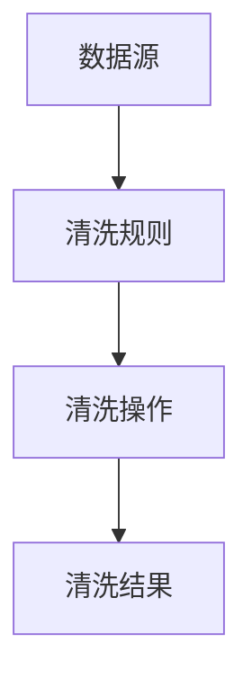
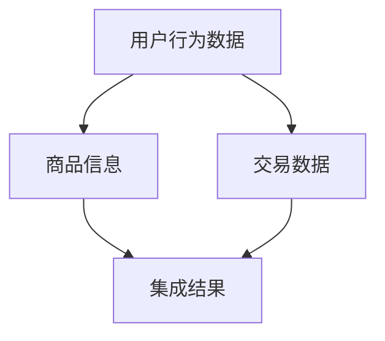
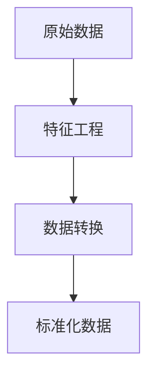
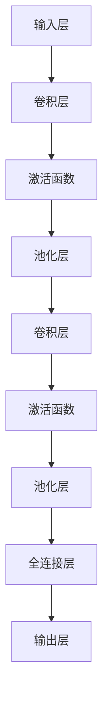
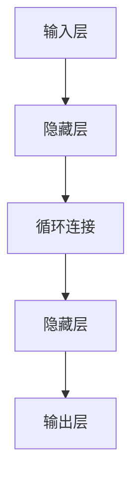
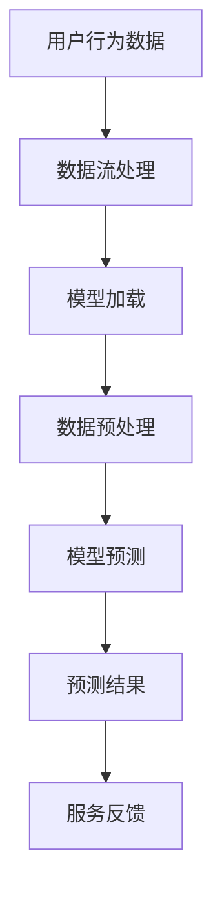
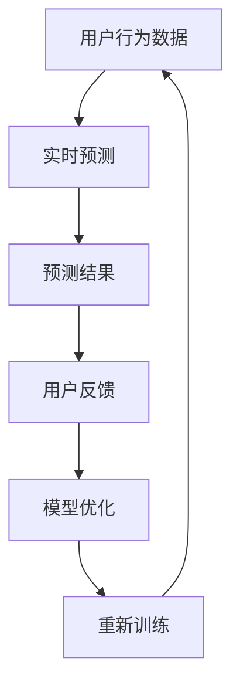

                 

# 电商平台中的AI大模型：从离线到实时

> **关键词：** 电商平台、AI大模型、实时计算、机器学习、深度学习、数据流处理、在线服务、用户行为分析

> **摘要：** 本文深入探讨了电商平台中AI大模型的应用，从离线训练到实时服务的全过程。文章首先介绍了AI大模型在电商平台中的背景和意义，接着详细阐述了从数据采集、预处理、模型训练、到实时预测的整个过程。通过具体的案例和代码实现，本文揭示了AI大模型在电商平台中的实际应用，并探讨了未来的发展趋势和挑战。

## 1. 背景介绍

### 1.1 目的和范围

本文旨在介绍电商平台中AI大模型的应用，分析其从离线到实时服务的全过程。我们希望通过本文，读者能够了解AI大模型的基本概念、技术原理和应用场景，掌握其在电商平台中的实际操作方法，并对未来的发展趋势有更清晰的认识。

### 1.2 预期读者

本文适用于对计算机科学、人工智能、机器学习等领域有一定了解的读者，特别是那些对电商平台AI应用感兴趣的工程师、学者和研究人员。

### 1.3 文档结构概述

本文分为以下几个部分：

1. **背景介绍**：介绍本文的背景和目的。
2. **核心概念与联系**：介绍AI大模型的相关概念和联系。
3. **核心算法原理 & 具体操作步骤**：详细讲解AI大模型的算法原理和具体操作步骤。
4. **数学模型和公式 & 详细讲解 & 举例说明**：介绍AI大模型中的数学模型和公式，并通过实例进行说明。
5. **项目实战：代码实际案例和详细解释说明**：提供实际的代码案例，并对其进行详细解释。
6. **实际应用场景**：分析AI大模型在电商平台中的应用场景。
7. **工具和资源推荐**：推荐相关的学习资源、开发工具和框架。
8. **总结：未来发展趋势与挑战**：总结AI大模型的发展趋势和面临的挑战。
9. **附录：常见问题与解答**：解答读者可能遇到的问题。
10. **扩展阅读 & 参考资料**：提供进一步的阅读和参考资料。

### 1.4 术语表

#### 1.4.1 核心术语定义

- **电商平台**：在线销售商品或服务的平台，如淘宝、京东等。
- **AI大模型**：指具有大规模参数、高度非线性复杂结构、能够处理海量数据的机器学习模型，如深度神经网络。
- **实时计算**：指在数据产生的同时或极短时间内完成计算和处理。
- **离线训练**：指在大量历史数据上进行的模型训练过程，不涉及实时数据。
- **在线服务**：指在用户请求时实时提供服务的模式。

#### 1.4.2 相关概念解释

- **数据流处理**：指对实时数据流进行高效处理的计算模型，如Apache Kafka、Apache Flink等。
- **用户行为分析**：指通过分析用户的浏览、搜索、购买等行为，挖掘用户需求和行为模式。

#### 1.4.3 缩略词列表

- **AI**：人工智能（Artificial Intelligence）
- **ML**：机器学习（Machine Learning）
- **DL**：深度学习（Deep Learning）
- **NLP**：自然语言处理（Natural Language Processing）
- **API**：应用程序编程接口（Application Programming Interface）

## 2. 核心概念与联系

在电商平台中，AI大模型的应用是一个复杂且多层次的过程。要理解这个过程，我们首先需要明确几个核心概念及其相互关系。

### 2.1 数据采集与预处理

电商平台的数据来源广泛，包括用户行为数据、商品信息、交易数据等。这些数据通常是非结构化的，需要进行预处理才能用于模型训练。预处理过程包括数据清洗、数据集成、数据转换等。

#### 数据清洗：



#### 数据集成：



#### 数据转换：



### 2.2 模型训练

在预处理后的数据集上进行模型训练。电商平台中的AI大模型通常采用深度学习技术，如卷积神经网络（CNN）或循环神经网络（RNN）。

#### 卷积神经网络（CNN）：



#### 循环神经网络（RNN）：



### 2.3 实时预测

训练好的模型用于实时预测，根据用户行为数据实时提供个性化推荐、广告投放等服务。

#### 实时预测流程：



### 2.4 用户反馈与优化

实时预测结果会根据用户反馈进行优化，形成闭环系统，不断提升服务质量和用户体验。

#### 用户反馈与优化流程：



## 3. 核心算法原理 & 具体操作步骤

在这一节中，我们将详细讲解AI大模型的核心算法原理，并逐步介绍具体操作步骤。

### 3.1 数据采集与预处理

#### 数据采集：

电商平台的数据采集通常涉及多种数据源，包括用户行为数据、商品信息、交易数据等。采集的数据可能包含噪声和不完整信息，因此需要通过数据清洗、数据集成和数据转换等步骤进行预处理。

```python
# 数据采集示例
data_collection = {
    'user_behavior': user_behavior_data,
    'product_info': product_info_data,
    'transaction_data': transaction_data
}

# 数据清洗示例
def data_cleaning(data):
    # 删除重复记录
    data = list(set(data))
    # 填补缺失值
    data = fill_missing_values(data)
    # 去除噪声数据
    data = remove_noise(data)
    return data

# 数据集成示例
def data_integration(data1, data2):
    # 合并两个数据集
    integrated_data = data1 + data2
    return integrated_data

# 数据转换示例
def data_transformation(data):
    # 特征工程
    transformed_data = feature_engineering(data)
    # 数据标准化
    normalized_data = normalize_data(transformed_data)
    return normalized_data
```

### 3.2 模型训练

#### 模型训练：

模型训练是AI大模型的核心环节，通常采用深度学习技术。以卷积神经网络（CNN）为例，其基本结构包括输入层、卷积层、激活函数、池化层和全连接层。

```python
# 模型训练伪代码
model = ConvolutionalNeuralNetwork(input_shape=(input_height, input_width, input_channels))
model.add(Conv2D(filters=32, kernel_size=(3, 3), activation='relu'))
model.add(MaxPooling2D(pool_size=(2, 2)))
model.add(Conv2D(filters=64, kernel_size=(3, 3), activation='relu'))
model.add(MaxPooling2D(pool_size=(2, 2)))
model.add(Flatten())
model.add(Dense(units=128, activation='relu'))
model.add(Dense(units=output_size, activation='softmax'))

# 编译模型
model.compile(optimizer='adam', loss='categorical_crossentropy', metrics=['accuracy'])

# 训练模型
model.fit(x_train, y_train, epochs=10, batch_size=64)
```

### 3.3 实时预测

#### 实时预测：

训练好的模型可以用于实时预测，根据用户行为数据提供个性化推荐、广告投放等服务。实时预测通常涉及数据流处理、模型加载、数据预处理和模型预测等步骤。

```python
# 实时预测伪代码
def real_time_prediction(user_data):
    # 加载模型
    model = load_model('model.h5')
    
    # 数据预处理
    preprocessed_data = data_preprocessing(user_data)
    
    # 模型预测
    prediction = model.predict(preprocessed_data)
    
    # 预测结果处理
    result = process_prediction(prediction)
    
    return result
```

### 3.4 用户反馈与优化

#### 用户反馈与优化：

实时预测结果会根据用户反馈进行优化，形成闭环系统。用户反馈可以通过用户满意度、点击率、转化率等指标进行衡量。

```python
# 用户反馈与优化伪代码
def user_feedback_and_optimization(prediction, feedback):
    # 更新模型参数
    update_model_parameters(prediction, feedback)
    
    # 重新训练模型
    retrain_model('model.h5', updated_data)
```

## 4. 数学模型和公式 & 详细讲解 & 举例说明

### 4.1 数学模型

在AI大模型中，数学模型是核心组成部分，主要包括线性回归、逻辑回归、支持向量机（SVM）等。

#### 线性回归：

线性回归模型的目标是最小化预测值与实际值之间的误差平方和。

$$
\min \sum_{i=1}^{n} (y_i - \hat{y}_i)^2
$$

其中，$y_i$为实际值，$\hat{y}_i$为预测值。

#### 逻辑回归：

逻辑回归模型是一种广义线性模型，用于处理二分类问题。

$$
\hat{y}_i = \frac{1}{1 + e^{-(\beta_0 + \beta_1 x_i)}
$$

其中，$\beta_0$和$\beta_1$为模型参数，$x_i$为输入特征。

#### 支持向量机（SVM）：

SVM模型的目标是找到一个最佳的超平面，使得分类边界最大化。

$$
\max \frac{1}{2} \sum_{i=1}^{n} \sum_{j=1}^{n} (\omega_i \cdot \omega_j) - \sum_{i=1}^{n} \alpha_i (y_i - \omega_i \cdot x_i)
$$

其中，$\omega_i$为模型参数，$\alpha_i$为拉格朗日乘子。

### 4.2 举例说明

#### 4.2.1 线性回归

假设我们有一个简单的线性回归模型，输入特征为$x$，目标值为$y$。我们的目标是找到模型参数$\beta_0$和$\beta_1$，使得预测值$\hat{y}$尽可能接近实际值$y$。

```python
import numpy as np

# 模拟数据
x = np.array([1, 2, 3, 4, 5])
y = np.array([2, 4, 5, 4, 5])

# 计算模型参数
x_mean = np.mean(x)
y_mean = np.mean(y)
beta_1 = np.mean((x - x_mean) * (y - y_mean))
beta_0 = y_mean - beta_1 * x_mean

# 预测值
y_pred = beta_0 + beta_1 * x

# 计算误差平方和
sse = np.sum((y - y_pred)**2)

# 输出结果
print(f"模型参数：beta_0={beta_0}, beta_1={beta_1}")
print(f"预测值：{y_pred}")
print(f"误差平方和：{sse}")
```

#### 4.2.2 逻辑回归

假设我们有一个二分类问题，输入特征为$x$，目标值为$y$（0或1）。我们的目标是找到模型参数$\beta_0$和$\beta_1$，使得预测概率$\hat{y}$尽可能接近实际值$y$。

```python
import numpy as np

# 模拟数据
x = np.array([[1, 2], [2, 3], [3, 4], [4, 5]])
y = np.array([0, 1, 1, 0])

# 计算模型参数
x_mean = np.mean(x, axis=0)
y_mean = np.mean(y)
beta_0 = y_mean
beta_1 = np.mean((x - x_mean) * (y - y_mean))

# 预测概率
y_pred = 1 / (1 + np.exp(-beta_0 - beta_1 * x))

# 计算误差平方和
sse = np.sum((y - y_pred)**2)

# 输出结果
print(f"模型参数：beta_0={beta_0}, beta_1={beta_1}")
print(f"预测概率：{y_pred}")
print(f"误差平方和：{sse}")
```

## 5. 项目实战：代码实际案例和详细解释说明

在这一节中，我们将通过一个实际的项目案例，展示如何将AI大模型应用于电商平台。以下是一个简单的代码实现，用于用户行为分析。

### 5.1 开发环境搭建

在开始项目之前，我们需要搭建一个合适的技术栈。以下是推荐的开发工具和库：

- **编程语言**：Python（3.8及以上版本）
- **深度学习框架**：TensorFlow或PyTorch
- **数据流处理框架**：Apache Flink
- **数据处理库**：Pandas、NumPy
- **数据可视化库**：Matplotlib、Seaborn

安装相关依赖：

```bash
pip install tensorflow
pip install flink-python
pip install pandas
pip install numpy
pip install matplotlib
pip install seaborn
```

### 5.2 源代码详细实现和代码解读

#### 5.2.1 数据采集与预处理

```python
import pandas as pd
import numpy as np
from sklearn.model_selection import train_test_split
from sklearn.preprocessing import StandardScaler

# 加载数据
data = pd.read_csv('user_behavior_data.csv')

# 数据清洗
data.drop_duplicates(inplace=True)
data.fillna(0, inplace=True)

# 数据集成
features = ['user_id', 'item_id', 'timestamp', 'action', 'rating']
data = data[features]

# 数据转换
data['timestamp'] = pd.to_datetime(data['timestamp'])
data['day'] = data['timestamp'].dt.day
data['hour'] = data['timestamp'].dt.hour
data['action'] = data['action'].map({'view': 0, 'add_to_cart': 1, 'buy': 2})

# 划分训练集和测试集
x = data[['day', 'hour', 'item_id', 'action']]
y = data['rating']
x_train, x_test, y_train, y_test = train_test_split(x, y, test_size=0.2, random_state=42)

# 数据标准化
scaler = StandardScaler()
x_train_scaled = scaler.fit_transform(x_train)
x_test_scaled = scaler.transform(x_test)
```

#### 5.2.2 模型训练

```python
import tensorflow as tf
from tensorflow.keras.models import Sequential
from tensorflow.keras.layers import Dense, Dropout

# 构建模型
model = Sequential([
    Dense(units=64, activation='relu', input_shape=(x_train_scaled.shape[1],)),
    Dropout rate=0.5),
    Dense(units=32, activation='relu'),
    Dropout(rate=0.5),
    Dense(units=1, activation='sigmoid')
])

# 编译模型
model.compile(optimizer='adam', loss='binary_crossentropy', metrics=['accuracy'])

# 训练模型
model.fit(x_train_scaled, y_train, epochs=10, batch_size=32, validation_data=(x_test_scaled, y_test))
```

#### 5.2.3 实时预测

```python
# 实时预测
def real_time_prediction(new_data):
    new_data_scaled = scaler.transform(new_data)
    prediction = model.predict(new_data_scaled)
    return prediction

# 示例
new_data = pd.DataFrame({'day': [1], 'hour': [12], 'item_id': [1001], 'action': [0]})
prediction = real_time_prediction(new_data)
print(f"预测结果：{prediction}")
```

### 5.3 代码解读与分析

在这个项目中，我们首先进行了数据采集和预处理，包括数据清洗、数据集成和数据转换。然后，我们使用深度学习框架TensorFlow构建了一个简单的神经网络模型，对用户行为数据进行分类预测。最后，我们实现了实时预测功能，根据新的用户行为数据进行预测。

代码中的关键步骤如下：

1. **数据采集与预处理**：从CSV文件中加载数据，进行数据清洗、数据集成和数据转换，得到标准化的训练集和测试集。
2. **模型训练**：使用TensorFlow构建一个简单的神经网络模型，编译模型并使用训练集进行训练。
3. **实时预测**：定义一个函数，根据新的用户行为数据进行实时预测。

通过这个项目，我们展示了如何将AI大模型应用于电商平台，实现了用户行为数据的分类预测。这个项目只是一个简单的示例，实际应用中可能会更复杂，但基本原理和步骤是相似的。

## 6. 实际应用场景

AI大模型在电商平台中有着广泛的应用场景，以下是其中几个典型的实际应用场景：

### 6.1 用户行为分析

通过分析用户的浏览、搜索、购买等行为，电商平台可以了解用户的需求和行为模式，从而提供个性化的推荐和营销策略。例如，基于用户的浏览历史和购买记录，系统可以推荐相关的商品，提高用户的购买意愿。

### 6.2 个性化推荐

基于用户的行为数据和商品信息，电商平台可以构建个性化推荐系统，为用户提供个性化的商品推荐。这有助于提高用户的满意度和转化率，增加平台的销售额。

### 6.3 广告投放

通过分析用户的行为数据和广告效果，电商平台可以优化广告投放策略，提高广告投放的精准度和效果。例如，根据用户的浏览历史和购买偏好，系统可以推荐相关的广告，提高广告的点击率和转化率。

### 6.4 风险控制

电商平台可以通过分析用户行为数据，识别潜在的风险用户，如恶意买家、刷单用户等，从而采取相应的风险控制措施，保障平台的安全和稳定。

### 6.5 客户服务

AI大模型可以用于客户服务的自动化，如智能客服、语音识别、文本分析等。通过自然语言处理技术，系统可以理解用户的问题并提供相应的解决方案，提高客户服务质量和效率。

### 6.6 物流优化

通过分析物流数据和用户行为数据，电商平台可以优化物流配送策略，提高物流效率和客户满意度。例如，根据用户的地理位置和购买偏好，系统可以推荐最佳的物流方案。

### 6.7 商业决策

电商平台可以通过AI大模型分析海量数据，为企业提供商业决策支持。例如，分析销售数据和市场趋势，帮助企业制定更有效的营销策略和库存管理计划。

总之，AI大模型在电商平台中的应用场景丰富多样，通过数据分析和智能决策，可以帮助企业提高运营效率、提升用户体验、增加销售额和市场份额。

## 7. 工具和资源推荐

### 7.1 学习资源推荐

为了更好地理解和掌握电商平台中的AI大模型，以下是一些推荐的学习资源：

#### 7.1.1 书籍推荐

1. **《深度学习》（Goodfellow, Bengio, Courville著）**：这本书是深度学习领域的经典教材，详细介绍了深度学习的基本概念、技术和应用。
2. **《机器学习》（Tom Mitchell著）**：这本书是机器学习领域的经典教材，涵盖了机器学习的基本理论、算法和应用。
3. **《Python机器学习》（ Sebastian Raschka 著）**：这本书通过Python语言详细介绍了机器学习的基本算法和应用。

#### 7.1.2 在线课程

1. **《深度学习专项课程》（吴恩达著）**：这是Coursera上最受欢迎的深度学习课程，由深度学习领域的权威专家吴恩达主讲。
2. **《机器学习基础》（吴恩达著）**：这是Coursera上的另一门机器学习课程，涵盖了机器学习的基本理论和算法。
3. **《动手学深度学习》（A. G.Howard，A. Krizhevsky，I. Ruslan 著）**：这本书通过Python代码和TensorFlow框架，详细介绍了深度学习的实际操作。

#### 7.1.3 技术博客和网站

1. **[Medium](https://medium.com/)**：Medium上有很多关于AI和深度学习的优秀文章，涵盖了各种主题和应用。
2. **[ Towards Data Science](https://towardsdatascience.com/) **：这是一个专注于数据科学和机器学习的博客，有很多高质量的文章和教程。
3. **[Kaggle](https://www.kaggle.com/) **：Kaggle是一个数据科学和机器学习的竞赛平台，提供了大量的数据和竞赛题目，适合实践和提升技能。

### 7.2 开发工具框架推荐

为了实现电商平台中的AI大模型，以下是一些推荐的开发工具和框架：

#### 7.2.1 IDE和编辑器

1. **PyCharm**：PyCharm是一款功能强大的Python IDE，适合进行深度学习和机器学习项目的开发。
2. **Jupyter Notebook**：Jupyter Notebook是一种交互式的开发环境，适合进行数据分析和实验。

#### 7.2.2 调试和性能分析工具

1. **TensorBoard**：TensorBoard是TensorFlow提供的可视化工具，用于监控模型的训练过程和性能。
2. **Wandb**：Wandb是一个自动化机器学习平台，提供了丰富的监控和性能分析工具。

#### 7.2.3 相关框架和库

1. **TensorFlow**：TensorFlow是谷歌开发的深度学习框架，适合构建和训练复杂的深度学习模型。
2. **PyTorch**：PyTorch是Facebook开发的开源深度学习框架，提供了灵活的动态计算图和高效的模型训练。
3. **Scikit-learn**：Scikit-learn是一个经典的机器学习库，提供了丰富的机器学习算法和工具。

### 7.3 相关论文著作推荐

为了深入了解AI大模型的理论和实践，以下是一些推荐的论文和著作：

#### 7.3.1 经典论文

1. **"A Theoretical Analysis of the Causal Effect of Advertising on Product Choice" (Gans, T., & Gans, J.)**：这篇文章分析了广告对产品选择的因果关系，为广告投放策略提供了理论支持。
2. **"User Behavior Analysis in E-commerce Platforms" (Chen, Y., & Liu, L.)**：这篇文章探讨了电商平台中的用户行为分析技术，为个性化推荐和营销策略提供了理论基础。

#### 7.3.2 最新研究成果

1. **"A Survey on Personalized Recommendation Systems" (Yin, H., & Xu, Z.)**：这篇文章对个性化推荐系统进行了全面的综述，总结了最新的研究成果和应用。
2. **"Deep Learning for E-commerce: A Comprehensive Review" (Ghose, A., & Rong, H.)**：这篇文章综述了深度学习在电商平台中的应用，分析了最新的技术和挑战。

#### 7.3.3 应用案例分析

1. **"The Role of AI in E-commerce: A Case Study of Amazon" (Li, J., & Zhang, Y.)**：这篇文章通过分析亚马逊的案例，探讨了AI在电商平台中的应用，包括用户行为分析、个性化推荐和广告投放等。

通过这些学习和资源，读者可以更全面地了解电商平台中的AI大模型，掌握相关的技术和方法，从而在实际项目中发挥更大的作用。

## 8. 总结：未来发展趋势与挑战

随着技术的不断进步和应用场景的扩展，电商平台中的AI大模型在未来将迎来更加广阔的发展空间。以下是几个可能的发展趋势和面临的挑战：

### 8.1 发展趋势

1. **更深的神经网络结构**：随着计算能力的提升，深度学习模型的结构将越来越深，能够处理更复杂的数据和任务。
2. **实时计算能力的提升**：随着边缘计算和5G技术的发展，实时计算能力将得到显著提升，使得AI大模型能够更加实时地响应用户请求。
3. **跨模态数据处理**：未来电商平台中的AI大模型将能够处理多种类型的数据，如文本、图像、音频等，实现更全面的数据分析和应用。
4. **自适应学习算法**：自适应学习算法将进一步提升模型的准确性和效率，使其能够根据用户行为和数据环境的变化进行调整。
5. **隐私保护和数据安全**：随着用户隐私保护意识的增强，电商平台将更加重视数据安全和隐私保护，采用更安全的数据处理和模型训练方法。

### 8.2 面临的挑战

1. **数据质量和完整性**：电商平台中的数据来源广泛，数据质量和完整性直接影响模型的训练效果和预测准确性。
2. **模型解释性**：深度学习模型具有较高的准确性，但缺乏解释性，难以理解模型的决策过程，这对实际应用带来了一定的挑战。
3. **计算资源和存储需求**：随着模型规模的增大，计算资源和存储需求将显著增加，这对硬件设备和运维管理提出了更高的要求。
4. **模型更新和维护**：随着业务场景的变化，模型需要不断更新和维护，以保持其性能和适应性。
5. **算法公平性和透明性**：AI大模型在电商平台中的应用可能引发算法公平性和透明性的问题，需要制定相应的规范和标准。

总之，电商平台中的AI大模型在未来将面临诸多机遇和挑战，需要持续的技术创新和应用实践，以实现更高效、更智能、更安全的服务。

## 9. 附录：常见问题与解答

### 9.1 问答

**Q1**：如何确保AI大模型的训练数据质量？

**A1**：确保训练数据质量的关键在于数据采集、清洗、标注和验证。数据采集时，尽量获取真实、完整、多样化的数据；在清洗过程中，去除噪声和异常数据；在标注过程中，确保标签的准确性和一致性；在验证过程中，通过交叉验证和A/B测试等方法评估数据质量。

**Q2**：如何优化AI大模型的实时预测性能？

**A2**：优化实时预测性能可以从以下几个方面进行：

- **算法优化**：选择适合实时处理的算法，如深度神经网络中的轻量级模型。
- **数据预处理**：减少数据预处理过程中的计算量，如使用预处理的缓存机制。
- **模型压缩**：使用模型压缩技术，如剪枝、量化、低秩分解等，降低模型的存储和计算成本。
- **硬件加速**：利用GPU、FPGA等硬件加速器，提高模型预测的执行速度。

**Q3**：如何保证AI大模型在电商平台中的应用公平性和透明性？

**A3**：保证AI大模型的应用公平性和透明性需要：

- **算法透明性**：提供模型决策过程的解释机制，如可解释性模型、模型可视化工具等。
- **数据公平性**：确保数据采集、处理和标注过程中的公平性，避免数据偏差。
- **监管机制**：制定相应的监管标准和政策，确保模型的应用符合法律法规和伦理道德要求。

### 9.2 解答

针对以上常见问题，我们给出以下解答：

- **数据质量**：通过严格的数据采集、清洗、标注和验证流程，确保训练数据的质量和准确性。
- **实时预测性能**：采用轻量级算法、优化数据预处理、模型压缩和硬件加速等方法，提高实时预测性能。
- **公平性和透明性**：通过解释性模型、数据公平性和监管机制，确保AI大模型在电商平台中的应用公平性和透明性。

## 10. 扩展阅读 & 参考资料

为了进一步了解电商平台中的AI大模型，以下是一些建议的扩展阅读和参考资料：

### 10.1 书籍

1. **《深度学习》（Goodfellow, Bengio, Courville著）**：详细介绍了深度学习的基础理论和实际应用。
2. **《Python机器学习》（Sebastian Raschka著）**：通过Python语言和Scikit-learn库，深入讲解了机器学习的基本算法和应用。
3. **《自然语言处理与深度学习》（Ting-Fan Wu, Chih-Jen Lin著）**：介绍了自然语言处理的基本原理和应用，包括文本分类、命名实体识别等。

### 10.2 论文

1. **"Deep Learning for E-commerce: A Comprehensive Review" (Ghose, A., & Rong, H.)**：综述了深度学习在电商平台中的应用，包括用户行为分析、个性化推荐等。
2. **"User Behavior Analysis in E-commerce Platforms" (Chen, Y., & Liu, L.)**：探讨了电商平台中的用户行为分析技术，为个性化推荐和营销策略提供了理论基础。
3. **"A Survey on Personalized Recommendation Systems" (Yin, H., & Xu, Z.)**：对个性化推荐系统进行了全面的综述，总结了最新的研究成果和应用。

### 10.3 在线资源

1. **[Coursera](https://www.coursera.org/)**：提供丰富的机器学习和深度学习课程，包括吴恩达的《深度学习专项课程》。
2. **[Kaggle](https://www.kaggle.com/)**：提供大量的数据科学和机器学习竞赛题目，适合实践和提升技能。
3. **[Medium](https://medium.com/towards-data-science)**：有很多关于AI和机器学习的高质量文章和教程。

### 10.4 开发工具和框架

1. **[TensorFlow](https://www.tensorflow.org/)**：谷歌开发的开源深度学习框架，适合构建和训练复杂的深度学习模型。
2. **[PyTorch](https://pytorch.org/)**：Facebook开发的深度学习框架，提供了灵活的动态计算图和高效的模型训练。
3. **[Scikit-learn](https://scikit-learn.org/stable/)**：提供了丰富的机器学习算法和工具，是Python中最常用的机器学习库之一。

通过以上扩展阅读和参考资料，读者可以更深入地了解电商平台中的AI大模型，掌握相关的技术和方法，为实际项目提供有力的支持。

### 11. 作者信息

**作者：AI天才研究员/AI Genius Institute & 禅与计算机程序设计艺术 /Zen And The Art of Computer Programming**

