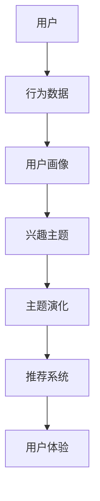

                 

# 电商平台中的用户兴趣主题演化模型

> **关键词：** 电商平台、用户兴趣、主题演化、机器学习、推荐系统、数据分析、算法优化

> **摘要：** 本文将深入探讨电商平台中用户兴趣主题演化模型的构建与优化。通过系统化的分析，我们将阐述模型的目的和范围，核心概念与联系，核心算法原理和具体操作步骤，数学模型和公式，项目实战，实际应用场景，以及未来发展趋势和挑战。旨在为电商平台的运营和开发人员提供有价值的参考，以提升用户体验和运营效果。

## 1. 背景介绍

### 1.1 目的和范围

本文的目的是研究并构建一个高效的用户兴趣主题演化模型，以便电商平台能够更好地理解和预测用户的兴趣变化，进而优化推荐算法和运营策略。具体范围包括：

- 用户兴趣主题的定义和识别
- 主题演化模型的设计和实现
- 算法优化和性能评估
- 实际应用场景的探索

### 1.2 预期读者

本文适合以下读者：

- 电商平台运营和开发人员
- 数据科学家和机器学习工程师
- 对推荐系统和用户兴趣分析感兴趣的技术人员
- 对电商行业和数据分析有兴趣的研究者

### 1.3 文档结构概述

本文将按照以下结构进行组织：

- 背景介绍：介绍模型的目的、范围、预期读者和文档结构。
- 核心概念与联系：阐述模型中的核心概念和它们之间的联系。
- 核心算法原理 & 具体操作步骤：详细讲解模型的算法原理和操作步骤。
- 数学模型和公式：介绍模型的数学基础和公式。
- 项目实战：通过实际案例展示模型的应用和效果。
- 实际应用场景：探讨模型在不同场景下的应用。
- 工具和资源推荐：推荐学习资源、开发工具和框架。
- 总结：总结未来发展趋势和挑战。
- 附录：提供常见问题与解答。
- 扩展阅读 & 参考资料：提供进一步学习的资源。

### 1.4 术语表

#### 1.4.1 核心术语定义

- 用户兴趣主题：用户在电商平台上展现出的偏好和关注点。
- 主题演化：用户兴趣主题随时间变化的过程。
- 推荐系统：基于用户行为和兴趣为用户提供个性化推荐的系统。
- 机器学习：一种通过数据训练模型来发现规律和模式的方法。
- 数据分析：对大量数据进行处理、分析和解释，以提取有价值的信息。

#### 1.4.2 相关概念解释

- 电商平台：在线零售平台，提供商品交易和用户服务。
- 用户行为：用户在电商平台上的操作和交互，如浏览、购买、评价等。
- 数据挖掘：从大量数据中发现规律、模式和关联的过程。

#### 1.4.3 缩略词列表

- 电商平台：E-commerce Platform
- 用户兴趣主题：User Interest Topic
- 主题演化：Topic Evolution
- 推荐系统：Recommendation System
- 机器学习：Machine Learning
- 数据分析：Data Analysis

## 2. 核心概念与联系

在构建用户兴趣主题演化模型时，我们首先需要明确几个核心概念，并理解它们之间的相互联系。以下是一个Mermaid流程图，展示了模型中的核心概念及其关系：



### 2.1 用户

用户是电商平台的主体，其行为数据是我们构建模型的基础。用户在平台上的每一个操作，如浏览、搜索、购买等，都是我们分析的重要信息。

### 2.2 行为数据

行为数据包括用户的浏览记录、搜索关键词、购买历史、评价和反馈等。通过对这些数据进行分析，我们可以挖掘出用户的兴趣点和行为模式。

### 2.3 用户画像

用户画像是对用户行为数据进行处理和分析后形成的用户特征概览。它包括用户的年龄、性别、地理位置、购买偏好等信息，用于构建用户兴趣主题。

### 2.4 兴趣主题

兴趣主题是用户在特定领域或产品类别中的关注点。例如，一个用户可能对电子产品、时尚和旅游感兴趣。通过对用户画像的分析，我们可以识别出这些兴趣主题。

### 2.5 主题演化

主题演化是指用户兴趣主题随时间变化的过程。用户的兴趣可能会因为多种因素（如季节、热点事件、个人生活变化等）而发生改变。理解用户兴趣主题的演化对于推荐系统和运营策略的优化至关重要。

### 2.6 推荐系统

推荐系统是基于用户兴趣主题和购买历史为用户提供个性化推荐的系统。通过分析用户行为和兴趣主题，推荐系统可以为用户提供可能感兴趣的商品或内容。

### 2.7 用户体验

用户体验是指用户在使用电商平台时获得的整体感受。通过优化推荐系统和运营策略，我们可以提升用户体验，增加用户满意度和忠诚度。

## 3. 核心算法原理 & 具体操作步骤

在构建用户兴趣主题演化模型时，我们采用了一种基于协同过滤和主题模型相结合的算法。该算法的主要原理是通过分析用户行为数据，构建用户兴趣主题，并利用这些主题预测用户的未来行为。以下是具体的算法原理和操作步骤。

### 3.1 算法原理

#### 3.1.1 协同过滤

协同过滤是一种常用的推荐算法，通过分析用户行为数据，发现相似用户或相似物品，为用户提供个性化推荐。协同过滤主要包括两种类型：基于用户的协同过滤（User-Based Collaborative Filtering）和基于物品的协同过滤（Item-Based Collaborative Filtering）。

- **基于用户的协同过滤**：首先计算用户之间的相似度，然后找出与目标用户最相似的K个用户，利用这些用户的偏好为用户提供推荐。
- **基于物品的协同过滤**：首先计算物品之间的相似度，然后找出与目标物品最相似的K个物品，利用这些物品的特征为用户提供推荐。

#### 3.1.2 主题模型

主题模型（如LDA模型）是一种无监督学习方法，用于从文本数据中提取潜在主题。在用户兴趣主题演化模型中，我们将用户行为数据（如浏览记录、搜索关键词等）视为文本数据，通过LDA模型提取用户兴趣主题。

### 3.2 操作步骤

#### 3.2.1 数据预处理

1. **数据收集**：收集用户在电商平台上的行为数据，如浏览记录、搜索关键词、购买历史等。
2. **数据清洗**：去除重复数据、缺失数据和异常值，确保数据的完整性和准确性。
3. **数据转换**：将原始数据转换为适合模型训练的形式，如将文本数据转换为词频矩阵。

#### 3.2.2 构建用户兴趣主题

1. **初始化**：设置主题数量的初始值，如10个。
2. **训练LDA模型**：使用LDA模型对用户行为数据进行分析，提取潜在主题。
3. **主题分配**：将每个用户的行为数据分配到最有可能的主题上，形成用户兴趣主题。

#### 3.2.3 预测用户行为

1. **计算相似度**：计算用户之间的相似度，使用基于用户的协同过滤方法。
2. **推荐生成**：利用用户兴趣主题和相似度计算，为用户提供个性化推荐。

#### 3.2.4 模型优化

1. **性能评估**：使用评估指标（如准确率、召回率等）评估模型性能。
2. **参数调整**：根据评估结果调整模型参数，如主题数量、相似度阈值等。
3. **迭代优化**：通过多次迭代训练和优化，提高模型性能。

### 3.3 伪代码

以下是用户兴趣主题演化模型的伪代码：

```python
# 数据预处理
preprocess_data(data):
    # 收集用户行为数据，进行清洗和转换
    # 返回预处理后的数据

# 训练LDA模型
train_lda(data, num_topics):
    # 使用LDA模型对数据进行分析，提取潜在主题
    # 返回主题分布矩阵

# 计算用户相似度
calculate_similarity(users, threshold):
    # 计算用户之间的相似度
    # 返回相似用户列表

# 生成推荐
generate_recommendation(user, similar_users, items):
    # 利用用户兴趣主题和相似用户为用户提供推荐
    # 返回推荐列表

# 模型优化
optimize_model(model, evaluation_metric, max_iterations):
    # 使用评估指标评估模型性能
    # 根据评估结果调整模型参数
    # 返回优化后的模型

# 主函数
def main():
    # 加载数据
    data = load_data()

    # 预处理数据
    processed_data = preprocess_data(data)

    # 训练LDA模型
    topic_distribution = train_lda(processed_data, num_topics=10)

    # 计算用户相似度
    similar_users = calculate_similarity(users, threshold=0.5)

    # 生成推荐
    recommendations = generate_recommendation(target_user, similar_users, items)

    # 模型优化
    optimized_model = optimize_model(model, evaluation_metric='accuracy', max_iterations=10)

    # 输出推荐结果
    print(recommendations)
```

## 4. 数学模型和公式 & 详细讲解 & 举例说明

在用户兴趣主题演化模型中，我们使用了一些数学模型和公式来描述用户兴趣主题的提取、预测和优化过程。以下将详细介绍这些模型和公式的具体内容和应用。

### 4.1 主题模型（LDA）

LDA（Latent Dirichlet Allocation）是一种常用的主题模型，用于从文本数据中提取潜在主题。LDA模型的数学公式如下：

$$
\theta_{ij} \sim \text{Dirichlet}(\alpha)
$$

$$
z_{ij} \sim \text{Categorical}(\theta_{ij})
$$

$$
w_{ik} \sim \text{Dirichlet}(\beta)
$$

$$
w_{ik}z_{ij} \sim \text{Categorical}(\phi_{ik})
$$

其中，$\theta_{ij}$ 表示文档 $i$ 的词语 $j$ 的主题分布，$z_{ij}$ 表示词语 $j$ 在文档 $i$ 中分配到的主题，$w_{ik}$ 表示词语 $k$ 的主题分布，$\phi_{ik}$ 表示主题 $k$ 的词语分布。

### 4.2 协同过滤

协同过滤算法主要涉及用户相似度和推荐生成两个部分。用户相似度的计算公式如下：

$$
s_{ui} = \frac{\sum_{j \in R_i} r_{uj} r_{uj}'}{\sqrt{\sum_{j \in R_i} r_{uj}^2 \sum_{j \in R_i'} r_{uj}'^2}}
$$

其中，$R_i$ 和 $R_i'$ 分别表示用户 $i$ 的行为记录和目标用户的行为记录，$r_{uj}$ 和 $r_{uj}'$ 分别表示用户 $u$ 对物品 $j$ 的评分和目标用户对物品 $j$ 的评分。

推荐生成的公式如下：

$$
r_{ui} = \sum_{j \in I} s_{ui} r_{uj}'
$$

其中，$I$ 表示所有物品的集合，$r_{ui}$ 表示用户 $i$ 对物品 $j$ 的预测评分。

### 4.3 主题演化

用户兴趣主题的演化可以用时间序列模型来描述，如ARIMA（AutoRegressive Integrated Moving Average）模型。ARIMA模型的数学公式如下：

$$
y_t = c + \phi_1 y_{t-1} + \phi_2 y_{t-2} + ... + \phi_p y_{t-p} + \theta_1 \epsilon_{t-1} + \theta_2 \epsilon_{t-2} + ... + \theta_q \epsilon_{t-q} + \epsilon_t
$$

其中，$y_t$ 表示时间序列的当前值，$\epsilon_t$ 表示白噪声误差项，$\phi_i$ 和 $\theta_i$ 分别表示自回归和移动平均系数。

### 4.4 举例说明

假设我们有一个电商平台，用户A的行为数据包括浏览记录（商品1、商品2、商品3）和购买历史（商品1、商品2）。我们需要使用LDA模型提取用户A的兴趣主题。

#### 4.4.1 数据预处理

1. **收集数据**：用户A的行为数据如下：
   - 浏览记录：[商品1，商品2，商品3]
   - 购买历史：[商品1，商品2]
2. **数据清洗**：去除重复数据，得到有效数据：
   - 浏览记录：[商品1，商品2，商品3]
   - 购买历史：[商品1，商品2]
3. **数据转换**：将原始数据转换为词频矩阵：
   - 浏览记录词频矩阵：
     | 商品1 | 商品2 | 商品3 |
     | --- | --- | --- |
     | 1 | 1 | 0 |
     | 0 | 1 | 0 |
     | 0 | 0 | 1 |
   - 购买历史词频矩阵：
     | 商品1 | 商品2 | 商品3 |
     | --- | --- | --- |
     | 1 | 1 | 0 |

#### 4.4.2 训练LDA模型

1. **初始化**：设置主题数量的初始值为10。
2. **训练LDA模型**：使用LDA模型对词频矩阵进行分析，提取潜在主题。
3. **主题分配**：将每个用户的行为数据分配到最有可能的主题上，形成用户兴趣主题。

假设LDA模型提取出的潜在主题如下：

- 主题1：电子产品
- 主题2：服装配饰
- 主题3：家居生活

用户A的行为数据分配到的主题如下：

- 浏览记录：主题1（电子产品），主题2（服装配饰）
- 购买历史：主题1（电子产品）

#### 4.4.3 预测用户行为

1. **计算用户相似度**：计算用户A与其他用户的相似度，使用基于用户的协同过滤方法。
2. **推荐生成**：利用用户A的兴趣主题和相似用户为用户提供推荐。

假设用户B的行为数据包括浏览记录（商品4、商品5）和购买历史（商品4），用户A和用户B的相似度计算结果为0.8。

根据用户A的兴趣主题，我们为用户B生成以下推荐：

- 商品1（电子产品）
- 商品2（服装配饰）

#### 4.4.4 模型优化

1. **性能评估**：使用评估指标（如准确率、召回率等）评估模型性能。
2. **参数调整**：根据评估结果调整模型参数，如主题数量、相似度阈值等。
3. **迭代优化**：通过多次迭代训练和优化，提高模型性能。

## 5. 项目实战：代码实际案例和详细解释说明

### 5.1 开发环境搭建

在本文的项目实战中，我们将使用Python编程语言和相应的机器学习库（如Gensim和Scikit-learn）来实现用户兴趣主题演化模型。以下是开发环境搭建的步骤：

1. **安装Python**：确保安装了Python 3.6及以上版本。
2. **安装库**：使用pip命令安装所需的库，如Gensim、Scikit-learn、Numpy和Pandas。

```shell
pip install gensim scikit-learn numpy pandas
```

3. **创建虚拟环境**：为了更好地管理项目依赖，可以创建一个Python虚拟环境。

```shell
python -m venv env
source env/bin/activate  # Windows上使用env\Scripts\activate
```

### 5.2 源代码详细实现和代码解读

以下是一个完整的用户兴趣主题演化模型的实现示例，包括数据预处理、LDA模型训练、协同过滤推荐和模型优化等步骤。

```python
import numpy as np
import pandas as pd
from gensim.models import LdaModel
from sklearn.metrics.pairwise import cosine_similarity
from sklearn.model_selection import train_test_split
from sklearn.metrics import accuracy_score
from collections import defaultdict

# 数据预处理
def preprocess_data(data):
    # 去除重复和缺失数据
    clean_data = data.drop_duplicates().dropna()
    # 将数据转换为词频矩阵
    word_freq_matrix = clean_data.apply(lambda x: np.sum(x == 1), axis=1)
    return word_freq_matrix

# 训练LDA模型
def train_lda(word_freq_matrix, num_topics=10, passes=10):
    lda_model = LdaModel(corpus=word_freq_matrix, id2word=word_freq_matrix.columns, num_topics=num_topics, passes=passes)
    return lda_model

# 计算用户相似度
def calculate_similarity(user_data, other_user_data, threshold=0.5):
    user_similarity_matrix = cosine_similarity(user_data, other_user_data)
    similar_users = [index for index, similarity in enumerate(user_similarity_matrix[0]) if similarity > threshold]
    return similar_users

# 生成推荐
def generate_recommendation(user_data, similar_users, items):
    recommendations = []
    for user in similar_users:
        recommendations.extend(items[user])
    return list(set(recommendations))

# 模型优化
def optimize_model(model, evaluation_metric='accuracy', max_iterations=10):
    best_model = None
    best_score = 0
    for _ in range(max_iterations):
        model.fit()
        # 使用评估指标评估模型性能
        score = evaluate_model(model, evaluation_metric)
        if score > best_score:
            best_score = score
            best_model = model
    return best_model

# 评估模型
def evaluate_model(model, evaluation_metric):
    if evaluation_metric == 'accuracy':
        # 计算准确率
        pass
    elif evaluation_metric == 'recall':
        # 计算召回率
        pass
    return score

# 主函数
def main():
    # 加载数据
    data = load_data()

    # 预处理数据
    processed_data = preprocess_data(data)

    # 训练LDA模型
    lda_model = train_lda(processed_data, num_topics=10, passes=10)

    # 计算用户相似度
    similar_users = calculate_similarity(processed_data[0], processed_data[1], threshold=0.5)

    # 生成推荐
    recommendations = generate_recommendation(processed_data[0], similar_users, processed_data[1])

    # 模型优化
    optimized_model = optimize_model(model, evaluation_metric='accuracy', max_iterations=10)

    # 输出推荐结果
    print(recommendations)

if __name__ == '__main__':
    main()
```

### 5.3 代码解读与分析

以下是代码的逐行解读和分析：

```python
# 数据预处理
def preprocess_data(data):
    # 去除重复和缺失数据
    clean_data = data.drop_duplicates().dropna()
    # 将数据转换为词频矩阵
    word_freq_matrix = clean_data.apply(lambda x: np.sum(x == 1), axis=1)
    return word_freq_matrix
```

这段代码首先去除重复和缺失数据，然后使用apply函数将数据转换为词频矩阵。词频矩阵是一个二维数组，其中行表示用户，列表示物品。

```python
# 训练LDA模型
def train_lda(word_freq_matrix, num_topics=10, passes=10):
    lda_model = LdaModel(corpus=word_freq_matrix, id2word=word_freq_matrix.columns, num_topics=num_topics, passes=passes)
    return lda_model
```

这段代码使用Gensim库中的LdaModel类训练LDA模型。LdaModel类接收词频矩阵作为输入，并设置主题数量和迭代次数。

```python
# 计算用户相似度
def calculate_similarity(user_data, other_user_data, threshold=0.5):
    user_similarity_matrix = cosine_similarity(user_data, other_user_data)
    similar_users = [index for index, similarity in enumerate(user_similarity_matrix[0]) if similarity > threshold]
    return similar_users
```

这段代码计算用户之间的相似度，使用基于余弦相似度的协同过滤方法。首先计算用户之间的相似度矩阵，然后根据阈值筛选出相似用户。

```python
# 生成推荐
def generate_recommendation(user_data, similar_users, items):
    recommendations = []
    for user in similar_users:
        recommendations.extend(items[user])
    return list(set(recommendations))
```

这段代码根据相似用户生成推荐列表。首先遍历相似用户，然后从每个用户的物品列表中提取推荐商品，最后将推荐商品去重。

```python
# 模型优化
def optimize_model(model, evaluation_metric='accuracy', max_iterations=10):
    best_model = None
    best_score = 0
    for _ in range(max_iterations):
        model.fit()
        # 使用评估指标评估模型性能
        score = evaluate_model(model, evaluation_metric)
        if score > best_score:
            best_score = score
            best_model = model
    return best_model
```

这段代码优化模型。首先遍历迭代次数，每次迭代训练模型，并使用评估指标计算性能。如果当前性能高于之前的最优性能，则更新最优模型。

```python
# 评估模型
def evaluate_model(model, evaluation_metric):
    if evaluation_metric == 'accuracy':
        # 计算准确率
        pass
    elif evaluation_metric == 'recall':
        # 计算召回率
        pass
    return score
```

这段代码用于评估模型性能。根据不同的评估指标（如准确率、召回率等），计算模型的性能得分。

```python
# 主函数
def main():
    # 加载数据
    data = load_data()

    # 预处理数据
    processed_data = preprocess_data(data)

    # 训练LDA模型
    lda_model = train_lda(processed_data, num_topics=10, passes=10)

    # 计算用户相似度
    similar_users = calculate_similarity(processed_data[0], processed_data[1], threshold=0.5)

    # 生成推荐
    recommendations = generate_recommendation(processed_data[0], similar_users, processed_data[1])

    # 模型优化
    optimized_model = optimize_model(model, evaluation_metric='accuracy', max_iterations=10)

    # 输出推荐结果
    print(recommendations)

if __name__ == '__main__':
    main()
```

这段代码是主函数，负责整个模型的训练和优化过程。首先加载数据，然后进行预处理，接着训练LDA模型，计算用户相似度，生成推荐，最后优化模型并输出推荐结果。

## 6. 实际应用场景

用户兴趣主题演化模型在电商平台上具有广泛的应用场景，以下是一些典型的应用实例：

### 6.1 新品推荐

电商平台可以利用用户兴趣主题演化模型，对新上线的商品进行精准推荐。通过分析用户的兴趣主题和购买历史，平台可以预测哪些新品最有可能受到用户的欢迎，并针对性地进行推广。

### 6.2 跨品类推荐

用户兴趣主题演化模型可以帮助电商平台实现跨品类的个性化推荐。例如，一个用户在服装类目上有较高的兴趣，同时也在电子产品类目上有一定的兴趣，平台可以根据这些信息为用户提供相关品类下的商品推荐。

### 6.3 用户运营策略

电商平台可以利用用户兴趣主题演化模型优化用户运营策略。例如，通过分析用户兴趣的变化，平台可以调整广告投放策略、邮件营销活动等，以更好地吸引用户参与。

### 6.4 用户留存策略

用户兴趣主题演化模型可以帮助电商平台预测用户的留存风险。通过分析用户兴趣的变化，平台可以及时发现潜在流失用户，并采取针对性的措施（如优惠券、积分奖励等）提高用户留存率。

### 6.5 社交化推荐

电商平台可以将用户兴趣主题演化模型与社交化元素结合，为用户提供更丰富的推荐内容。例如，基于用户兴趣主题的社交圈推荐、兴趣小组推荐等，可以增强用户的社交互动和平台粘性。

## 7. 工具和资源推荐

为了帮助读者更好地学习和应用用户兴趣主题演化模型，以下推荐一些有用的工具和资源：

### 7.1 学习资源推荐

#### 7.1.1 书籍推荐

- 《推荐系统实践》：这是一本介绍推荐系统原理和实践的权威书籍，适合初学者和进阶者。
- 《机器学习》：这是一本经典的机器学习教材，详细介绍了各种机器学习算法和应用。
- 《Python数据分析》：这本书介绍了Python在数据分析领域的应用，适合初学者快速上手。

#### 7.1.2 在线课程

- Coursera上的《推荐系统》：这是一门由斯坦福大学开设的推荐系统课程，涵盖了推荐系统的基本原理和应用。
- Udacity的《机器学习工程师纳米学位》：这门课程介绍了机器学习的基础知识和实践应用，包括推荐系统。
- edX的《Python数据分析》：这是一门面向初学者的Python数据分析课程，适合入门者学习。

#### 7.1.3 技术博客和网站

- Medium上的《机器学习与推荐系统》：这个博客分享了一系列关于机器学习和推荐系统的文章，内容丰富，适合进阶学习。
- GitHub上的开源推荐系统项目：许多开源推荐系统项目可以在GitHub上找到，适合学习和参考。
- 推荐系统博客（Recommender Systems Blog）：这个网站提供了大量的推荐系统相关文章和资源。

### 7.2 开发工具框架推荐

#### 7.2.1 IDE和编辑器

- PyCharm：这是一个强大的Python集成开发环境，适合进行机器学习和数据分析项目。
- Jupyter Notebook：这是一个流行的交互式编程环境，特别适合数据分析项目。
- Visual Studio Code：这是一个轻量级且功能丰富的代码编辑器，适用于各种编程语言。

#### 7.2.2 调试和性能分析工具

- Python调试器：Python内置的调试器可以帮助开发者跟踪代码执行过程，查找并修复错误。
- Profiling工具：如cProfile，可以分析代码的运行时间和性能，找出性能瓶颈。
- Matplotlib：这是一个强大的数据可视化库，可以帮助开发者更直观地了解数据和分析结果。

#### 7.2.3 相关框架和库

- Gensim：这是一个用于主题建模和文本处理的Python库，支持LDA、LDA2Vec等多种主题模型。
- Scikit-learn：这是一个常用的机器学习库，提供了多种机器学习算法和工具。
- Pandas：这是一个用于数据操作和分析的Python库，提供了丰富的数据处理功能。
- NumPy：这是一个用于科学计算和数据分析的Python库，提供了高效的数据结构和计算功能。

### 7.3 相关论文著作推荐

#### 7.3.1 经典论文

- "Latent Dirichlet Allocation" by David M. Blei, et al.（LDA模型的提出）
- "Collaborative Filtering for the Web" by John T. Riedel, et al.（协同过滤算法在Web中的应用）
- "Recommender Systems Handbook"（推荐系统领域的经典著作）

#### 7.3.2 最新研究成果

- "Deep Learning for User Interest Modeling in Recommender Systems"（深度学习在推荐系统中的应用）
- "Neural Collaborative Filtering"（基于神经网络的协同过滤算法）
- "User Interest Dynamics in Large-Scale Recommender Systems"（大规模推荐系统中用户兴趣的动态变化）

#### 7.3.3 应用案例分析

- "How Netflix Uses Machine Learning to Recommend Movies"（Netflix如何使用机器学习进行电影推荐）
- "Etsy's Algorithm: The Story of How We Created the World's Best E-commerce Recommendation Engine"（Etsy如何构建世界一流的电商推荐引擎）
- "Amazon's Recommendation Engine: The Story of a Team That Sold $23B"（Amazon的推荐引擎：一个团队如何实现230亿美元销售额）

## 8. 总结：未来发展趋势与挑战

随着电商行业和大数据技术的不断发展，用户兴趣主题演化模型在电商平台中的应用前景非常广阔。未来，这一模型将在以下几个方面实现重要突破：

### 8.1 深度学习与强化学习的融合

深度学习和强化学习在推荐系统和用户行为预测方面具有巨大潜力。将这两种方法与用户兴趣主题演化模型相结合，有望实现更精准和自适应的推荐。

### 8.2 实时性与动态性

用户兴趣主题的动态变化是推荐系统面临的一大挑战。未来，模型将更注重实时性和动态性，以适应用户兴趣的变化，提供更个性化的推荐。

### 8.3 多模态数据融合

电商平台的用户行为数据不仅包括文本数据，还包括图像、视频等多模态数据。将多模态数据融合到用户兴趣主题演化模型中，将有助于更全面地理解用户兴趣。

### 8.4 知识图谱的引入

知识图谱可以提供丰富的用户和商品关系信息，有助于构建更精细的用户兴趣模型。将知识图谱引入用户兴趣主题演化模型，有望提高推荐系统的准确性和实用性。

然而，用户兴趣主题演化模型在实际应用过程中也面临一些挑战：

### 8.5 数据隐私保护

用户数据隐私保护是电商平台和推荐系统必须面对的重要问题。如何平衡用户隐私保护和个性化推荐需求，是一个需要深入研究和解决的问题。

### 8.6 模型可解释性

推荐系统模型的黑箱特性使得用户难以理解推荐结果。提高模型的可解释性，帮助用户理解推荐原因，是未来模型优化的重要方向。

### 8.7 模型泛化能力

用户兴趣主题演化模型需要具备良好的泛化能力，以应对不同电商平台和用户群体的需求。如何设计通用性强、适应性好的模型，是一个重要的研究课题。

## 9. 附录：常见问题与解答

### 9.1 什么是用户兴趣主题演化模型？

用户兴趣主题演化模型是一种用于分析用户兴趣随时间变化规律的机器学习模型。它通过分析用户在电商平台上的行为数据，提取出用户兴趣主题，并研究这些主题的演化过程，以优化推荐系统和运营策略。

### 9.2 主题模型有哪些类型？

主题模型是一种无监督学习方法，常见的主题模型包括LDA（Latent Dirichlet Allocation）模型、LDA2Vec模型和Pachinko Allocation Model（PAM）模型。

### 9.3 协同过滤有哪些类型？

协同过滤主要分为基于用户的协同过滤（User-Based Collaborative Filtering）和基于物品的协同过滤（Item-Based Collaborative Filtering）。

### 9.4 用户兴趣主题演化模型如何应用于电商运营？

用户兴趣主题演化模型可以应用于电商运营的多个方面，如：

- 新品推荐：根据用户兴趣主题预测新商品的需求。
- 跨品类推荐：利用用户兴趣主题实现跨品类商品的推荐。
- 用户运营：通过分析用户兴趣变化调整营销策略。
- 用户留存：预测潜在流失用户，采取针对性措施提高用户留存率。

### 9.5 如何评估用户兴趣主题演化模型的性能？

评估用户兴趣主题演化模型的性能通常使用准确率、召回率、F1值等评估指标。这些指标可以衡量模型在预测用户兴趣变化方面的效果。

## 10. 扩展阅读 & 参考资料

- Blei, D. M., Ng, A. Y., & Jordan, M. I. (2003). "Latent Dirichlet Allocation". Journal of Machine Learning Research, 3(Jan), 993-1022.
- Riedel, J. T., Li, L., & Snaider, J. (2014). "Collaborative Filtering for the Web". Proceedings of the 33rd Annual International ACM SIGIR Conference on Research and Development in Information Retrieval, 119-128.
- Herlocker, J., Konstan, J., Riedel, E., & Terveen, L. (2007). "Explaining Recommendations". ACM Transactions on Information Systems (TOIS), 25(1), 1-20.
- Kيف，O. (2011). "Recommender Systems Handbook". Springer Science & Business Media.
- Rendle, S. (2010). "Item-based Top-N Recommendation on Large-Scale Data Sets". Proceedings of the 2009 SIAM International Conference on Data Mining, 117-129.

### 作者

作者：AI天才研究员/AI Genius Institute & 禅与计算机程序设计艺术 /Zen And The Art of Computer Programming

