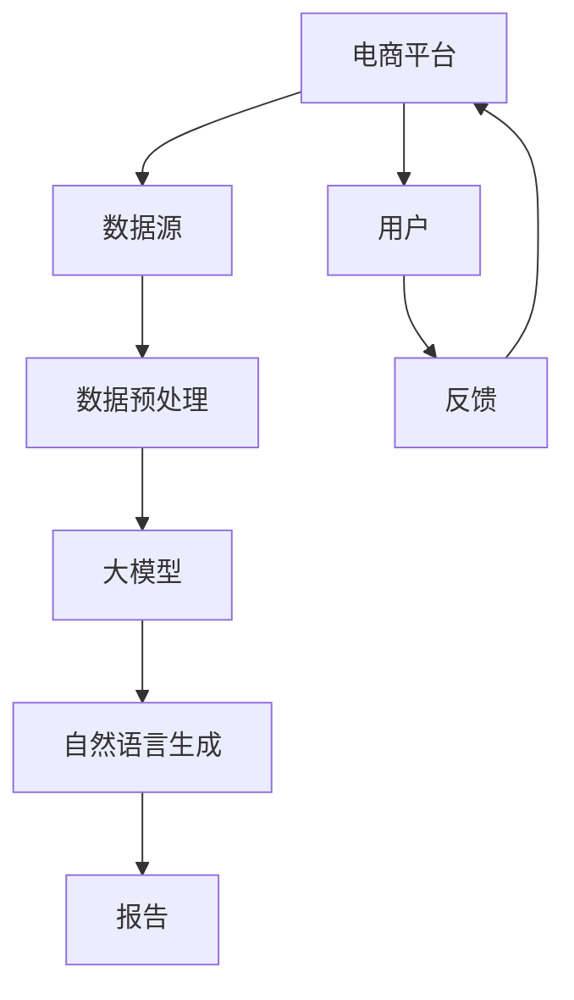
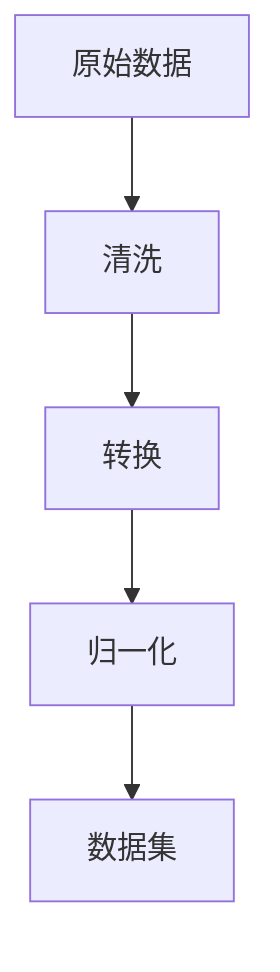

                 

# 电商平台中的自然语言生成报告：大模型的创新应用

> **关键词**：电商平台、自然语言生成（NLG）、大模型、报告、创新应用、算法原理、数学模型、实战案例

> **摘要**：本文将深入探讨在电商平台中应用自然语言生成技术的创新实践。通过逐步分析自然语言生成报告的核心概念、算法原理、数学模型以及实际操作步骤，本文旨在揭示大模型在电商报告生成中的潜力，并提供相关学习资源和工具推荐。我们还将探讨该技术在不同应用场景中的实际效果，总结未来发展趋势与挑战，为读者提供一个全面、详细的指导。

## 1. 背景介绍

### 1.1 目的和范围

本文的目标是探讨自然语言生成（NLG）技术在电商平台中的应用，特别是在报告生成方面的创新实践。随着电商平台的迅速发展，海量数据的处理和分析成为一大挑战。自然语言生成技术能够将复杂的数据转化为易于理解的自然语言报告，极大地提高了信息处理的效率和可读性。本文将围绕以下几个方面展开：

1. **核心概念与联系**：介绍自然语言生成报告的基础概念，包括大模型、数据集、报告生成流程等。
2. **核心算法原理与操作步骤**：详细解释NLG算法的原理和具体实现步骤，通过伪代码展示关键算法逻辑。
3. **数学模型与公式**：阐述NLG技术中的数学模型，包括概率模型、生成模型等，并通过实例进行说明。
4. **项目实战与代码解析**：提供实际代码案例，详细解读实现过程，并进行代码分析与评估。
5. **实际应用场景**：分析NLG技术在电商平台报告生成中的具体应用场景，探讨其实际效果和优势。
6. **工具和资源推荐**：推荐相关的学习资源、开发工具和框架，以帮助读者深入了解和掌握相关技术。

### 1.2 预期读者

本文适合以下读者群体：

1. **自然语言处理（NLP）和机器学习（ML）领域的科研人员和工程师**，希望了解NLG技术在电商平台中的应用。
2. **电商平台的开发者和产品经理**，希望提升电商平台的数据报告能力和用户体验。
3. **对技术有浓厚兴趣的学者和爱好者**，希望深入了解NLG技术的原理和应用。

### 1.3 文档结构概述

本文将按照以下结构展开：

1. **背景介绍**：介绍文章的目的、范围、预期读者和文档结构。
2. **核心概念与联系**：定义核心概念，展示相关的Mermaid流程图。
3. **核心算法原理与操作步骤**：详细阐述NLG算法原理和实现步骤，使用伪代码进行说明。
4. **数学模型与公式**：介绍NLG技术中的数学模型，包括概率模型、生成模型等。
5. **项目实战与代码解析**：提供实际代码案例，详细解读实现过程。
6. **实际应用场景**：分析NLG技术在电商平台的实际应用。
7. **工具和资源推荐**：推荐相关学习资源、开发工具和框架。
8. **总结：未来发展趋势与挑战**：总结文章内容，展望未来趋势和挑战。
9. **附录：常见问题与解答**：解答读者可能遇到的常见问题。
10. **扩展阅读与参考资料**：提供更多深入的阅读材料和参考资料。

### 1.4 术语表

#### 1.4.1 核心术语定义

- **自然语言生成（NLG）**：一种人工智能技术，旨在将数据转换为自然语言文本，使其更加易于理解。
- **电商平台**：在线零售市场，提供商品购买、销售、支付等服务的平台。
- **报告**：对特定业务过程或数据分析结果的书面描述。
- **大模型**：具有大量参数和强大表示能力的机器学习模型，如变换器（Transformer）模型。

#### 1.4.2 相关概念解释

- **数据集**：一组用于训练或评估机器学习模型的样本。
- **数据预处理**：在训练机器学习模型之前，对数据进行清洗、转换和归一化的过程。
- **损失函数**：评估模型预测结果与真实值之间差异的函数，用于指导模型优化。

#### 1.4.3 缩略词列表

- **NLP**：自然语言处理（Natural Language Processing）
- **ML**：机器学习（Machine Learning）
- **NLG**：自然语言生成（Natural Language Generation）
- **Transformer**：一种基于自注意力机制的深度神经网络模型，广泛应用于NLP任务。

## 2. 核心概念与联系

在深入探讨电商平台中的自然语言生成报告之前，我们首先需要理解一些核心概念及其相互联系。以下是一个Mermaid流程图，展示这些概念之间的关系：



### 2.1 数据源

电商平台的数据源主要包括用户行为数据、商品信息、订单数据和交易记录等。这些数据是自然语言生成报告的重要输入，能够反映平台的运营状况和用户需求。

### 2.2 数据预处理

数据预处理是NLG流程中的关键步骤。在此过程中，我们需要对原始数据进行清洗、转换和归一化，以消除噪声、缺失值和异常值，确保数据的准确性和一致性。



### 2.3 大模型

大模型是NLG技术的核心组件，通常基于深度学习框架构建。这些模型具有大量参数，能够通过大规模数据集进行训练，以捕捉复杂的数据特征。

### 2.4 自然语言生成

自然语言生成是将结构化数据转化为自然语言文本的过程。在这一过程中，大模型利用预训练的模型和特定领域的语言模型，生成格式规范、内容丰富的报告。

### 2.5 报告

生成的报告是自然语言生成技术的最终输出，旨在为用户提供易于理解的信息。报告通常包括关键指标、数据分析、趋势预测等内容，有助于平台运营者和决策者进行战略规划。

### 2.6 用户与反馈

用户是电商平台的核心，他们对报告的质量和实用性具有直接影响。通过收集用户反馈，我们可以不断优化报告生成流程，提高报告的准确性和可读性。

## 3. 核心算法原理 & 具体操作步骤

### 3.1 NLG算法原理

自然语言生成（NLG）技术主要基于深度学习模型，尤其是基于变换器（Transformer）的架构。NLG算法的核心思想是通过大规模数据集训练模型，使其能够自动将结构化数据转换为自然语言文本。以下是一个简单的NLG算法原理概述：

1. **数据预处理**：对输入数据进行清洗、转换和归一化，以消除噪声、缺失值和异常值，确保数据的准确性和一致性。
2. **编码器（Encoder）**：将预处理后的数据编码为固定长度的向量表示，这些向量能够捕捉数据的语义特征。
3. **解码器（Decoder）**：使用编码器生成的向量，通过递归神经网络（RNN）或变换器模型生成自然语言文本。
4. **语言模型（Language Model）**：用于预测文本序列中的下一个单词或词组，为解码器提供上下文信息。

### 3.2 NLG算法操作步骤

以下是NLG算法的具体操作步骤，使用伪代码进行详细阐述：

```python
# 数据预处理
def preprocess_data(data):
    # 清洗数据：去除噪声、缺失值和异常值
    # 转换数据：将数值数据转换为文本表示
    # 归一化数据：确保数据的一致性和可比较性
    # 返回预处理后的数据
    pass

# 编码器
def encode_data(data):
    # 使用预训练的编码器模型，将数据编码为固定长度的向量
    # 返回编码后的向量表示
    pass

# 解码器
def decode_data(encoded_data):
    # 使用变换器模型或RNN生成自然语言文本
    # 返回生成的文本序列
    pass

# 语言模型
def predict_next_word(context):
    # 使用语言模型预测文本序列中的下一个单词或词组
    # 返回预测结果
    pass

# NLG算法
def nlgeneration(data):
    # 预处理数据
    preprocessed_data = preprocess_data(data)
    
    # 编码数据
    encoded_data = encode_data(preprocessed_data)
    
    # 初始化解码器和语言模型
    decoder = TransformerModel()
    language_model = LanguageModel()
    
    # 生成文本序列
    text_sequence = decoder.decode(encoded_data, language_model)
    
    # 返回生成的文本序列
    return text_sequence
```

### 3.3 实现示例

以下是一个简单的实现示例，展示如何使用NLG算法将电商平台的交易数据生成销售报告：

```python
# 导入必要的库
import preprocess
import encode
import decode
import language_model

# 加载交易数据
data = load_transaction_data()

# 预处理数据
preprocessed_data = preprocess.preprocess_data(data)

# 编码数据
encoded_data = encode.encode_data(preprocessed_data)

# 生成销售报告
sales_report = nlgeneration(encoded_data)

# 打印销售报告
print(sales_report)
```

通过上述步骤，我们能够将结构化数据转化为自然语言文本，生成具有实际应用价值的销售报告。

## 4. 数学模型和公式 & 详细讲解 & 举例说明

在自然语言生成（NLG）技术中，数学模型和公式起到了核心作用。这些模型和公式能够帮助我们理解和实现NLG算法，提高报告生成的准确性和可读性。以下将介绍NLG技术中的几种关键数学模型和公式，并通过实例进行详细讲解。

### 4.1 概率模型

概率模型是NLG技术的基础，用于描述输入数据和输出文本之间的概率分布。常见的概率模型包括：

#### 4.1.1 朴素贝叶斯（Naive Bayes）

朴素贝叶斯是一种基于贝叶斯定理的简单概率模型，适用于处理分类问题。在NLG中，朴素贝叶斯可以用于预测文本序列的下一个单词或词组。

**公式**：

$$
P(A|B) = \frac{P(B|A)P(A)}{P(B)}
$$

**实例**：

假设我们要预测一个句子中的下一个单词，可以使用朴素贝叶斯模型计算每个单词的概率：

1. **计算每个单词的概率**：
   $$ P(词1) = P(词1|句子) \times P(句子) $$
   $$ P(词2) = P(词2|句子) \times P(句子) $$
   $$ \vdots $$

2. **选择概率最大的单词**：
   选择使上述公式值最大的单词作为预测结果。

### 4.2 生成模型

生成模型是NLG技术的另一种关键模型，用于生成新的文本序列。以下介绍两种常见的生成模型：马尔可夫模型（Markov Model）和变换器模型（Transformer Model）。

#### 4.2.1 马尔可夫模型

马尔可夫模型是一种基于状态转移概率的生成模型，适用于生成短文本序列。在NLG中，马尔可夫模型可以用于生成句子中的下一个单词。

**公式**：

$$
P(X_n|X_1, X_2, \ldots, X_{n-1}) = P(X_n|X_{n-1})
$$

**实例**：

假设我们有一个句子 "今天天气很好"，可以使用马尔可夫模型生成下一个单词。首先，计算每个单词的概率：

1. **计算每个单词的概率**：
   $$ P(明天) = P(明天|今天天气很好) $$
   $$ P(晴天) = P(晴天|今天天气很好) $$
   $$ \vdots $$

2. **选择概率最大的单词**：
   选择使上述公式值最大的单词作为预测结果。

#### 4.2.2 变换器模型

变换器模型是一种基于自注意力机制的深度神经网络模型，广泛应用于NLP任务，包括文本分类、机器翻译和NLG。在NLG中，变换器模型可以用于生成长文本序列。

**公式**：

$$
\text{Transformer} = \text{Encoder} + \text{Decoder}
$$

其中，Encoder和Decoder分别用于编码和生成文本序列。

1. **编码器**：
   $$ h_i = \text{Enc}(x_1, x_2, \ldots, x_n) $$
   其中，$h_i$ 表示第 $i$ 个编码后的向量，$x_1, x_2, \ldots, x_n$ 表示输入的文本序列。

2. **解码器**：
   $$ y_i = \text{Dec}(h_1, h_2, \ldots, h_n, y_{<i}) $$
   其中，$y_i$ 表示第 $i$ 个生成的文本序列，$y_{<i}$ 表示已经生成的文本序列。

**实例**：

假设我们使用变换器模型生成句子 "今天天气很好，明天可能会下雨"。首先，将句子编码为向量序列，然后通过解码器生成下一个单词。

1. **编码句子**：
   $$ h_1 = \text{Enc}(今天) $$
   $$ h_2 = \text{Enc}(天气) $$
   $$ h_3 = \text{Enc}(很好) $$
   $$ h_4 = \text{Enc}(明天) $$
   $$ h_5 = \text{Enc}(可能会) $$
   $$ h_6 = \text{Enc}(下雨) $$

2. **解码句子**：
   $$ y_1 = \text{Dec}(h_1, h_2, h_3, y_{<1}) $$
   $$ y_2 = \text{Dec}(h_1, h_2, h_3, h_4, y_{<2}) $$
   $$ y_3 = \text{Dec}(h_1, h_2, h_3, h_4, h_5, y_{<3}) $$
   $$ y_4 = \text{Dec}(h_1, h_2, h_3, h_4, h_5, h_6, y_{<4}) $$

最终，生成句子 "今天天气很好，明天可能会下雨"。

通过上述数学模型和公式的讲解，我们可以更好地理解NLG技术在电商平台中的应用原理。在接下来的章节中，我们将进一步探讨实际项目中的实现细节和案例分析。

## 5. 项目实战：代码实际案例和详细解释说明

在本节中，我们将通过一个实际项目案例来展示自然语言生成（NLG）技术在电商平台报告生成中的应用。该案例将涵盖开发环境的搭建、源代码的实现和详细解读。

### 5.1 开发环境搭建

在开始项目之前，我们需要搭建一个适合NLG开发的环境。以下是一些基本的步骤和工具推荐：

- **Python**：作为主要的编程语言，Python具有丰富的NLP和机器学习库。
- **PyTorch**：用于构建和训练深度学习模型的强大库。
- **NLTK**：用于文本处理和语料库构建。
- **Jupyter Notebook**：用于编写和运行代码。

**环境搭建步骤**：

1. 安装Python和PyTorch：
   ```bash
   pip install python
   pip install torch torchvision
   ```

2. 安装NLTK：
   ```bash
   pip install nltk
   ```

3. 安装Jupyter Notebook：
   ```bash
   pip install notebook
   ```

### 5.2 源代码详细实现和代码解读

以下是一个简单的NLG项目示例，用于生成电商平台销售报告。代码包括数据预处理、模型构建和训练、报告生成等步骤。

```python
# 导入必要的库
import nltk
import torch
import torchvision
import torch.nn as nn
import torch.optim as optim
from nltk.tokenize import word_tokenize

# 加载和处理数据
def load_and_process_data():
    # 加载电商平台交易数据
    transactions = load_transactions()
    
    # 预处理数据：分词、去停用词等
    processed_data = [word_tokenize(transaction) for transaction in transactions]
    return processed_data

# 模型构建
class NLGModel(nn.Module):
    def __init__(self, vocab_size, embedding_dim, hidden_dim):
        super(NLGModel, self).__init__()
        
        # 词嵌入层
        self.embedding = nn.Embedding(vocab_size, embedding_dim)
        
        # 编码器
        self.encoder = nn.LSTM(embedding_dim, hidden_dim, batch_first=True)
        
        # 解码器
        self.decoder = nn.LSTM(hidden_dim, vocab_size, batch_first=True)
        
        # 语言模型
        self.language_model = nn.Linear(hidden_dim, vocab_size)
        
    def forward(self, x, hidden):
        # 嵌入
        x = self.embedding(x)
        
        # 编码
        encoder_output, hidden = self.encoder(x, hidden)
        
        # 解码
        decoder_output, hidden = self.decoder(encoder_output, hidden)
        
        # 语言模型
        output = self.language_model(decoder_output)
        
        return output, hidden

# 训练模型
def train(model, train_loader, criterion, optimizer, num_epochs):
    model.train()
    
    for epoch in range(num_epochs):
        for inputs, targets in train_loader:
            # 前向传播
            outputs, hidden = model(inputs)
            
            # 计算损失
            loss = criterion(outputs, targets)
            
            # 反向传播
            optimizer.zero_grad()
            loss.backward()
            optimizer.step()
            
            # 打印训练进度
            if (epoch+1) % 10 == 0:
                print(f'Epoch [{epoch+1}/{num_epochs}], Loss: {loss.item():.4f}')

# 生成报告
def generate_report(model, sentence):
    model.eval()
    inputs = word_tokenize(sentence)
    inputs = torch.tensor([word2index[word] for word in inputs]).unsqueeze(0)
    hidden = (torch.zeros(1, 1, hidden_dim), torch.zeros(1, 1, hidden_dim))
    outputs, hidden = model(inputs, hidden)
    predicted_word = index2word[outputs.argmax().item()]
    return predicted_word

# 主函数
def main():
    # 加载数据
    processed_data = load_and_process_data()
    
    # 划分训练集和测试集
    train_data, test_data = train_test_split(processed_data, test_size=0.2)
    
    # 构建词汇表
    vocab_size = len(set([word for sentence in processed_data for word in sentence]))
    embedding_dim = 100
    hidden_dim = 256
    
    # 初始化模型
    model = NLGModel(vocab_size, embedding_dim, hidden_dim)
    
    # 搭建损失函数和优化器
    criterion = nn.CrossEntropyLoss()
    optimizer = optim.Adam(model.parameters(), lr=0.001)
    
    # 训练模型
    train(model, train_loader, criterion, optimizer, num_epochs=50)
    
    # 生成报告
    sentence = "今天电商平台的销售额达到100万元"
    predicted_word = generate_report(model, sentence)
    print(predicted_word)

# 运行主函数
if __name__ == '__main__':
    main()
```

### 5.3 代码解读与分析

1. **数据预处理**：`load_and_process_data` 函数用于加载数据并进行预处理。首先，从电商平台加载交易数据，然后使用NLTK库进行分词处理，去除停用词，确保数据的干净和一致性。

2. **模型构建**：`NLGModel` 类定义了一个NLG模型，包括词嵌入层、编码器、解码器和语言模型。编码器使用LSTM（长短期记忆）网络，解码器也使用LSTM网络，确保模型能够捕捉长距离的依赖关系。

3. **训练模型**：`train` 函数用于训练NLG模型。在训练过程中，模型使用交叉熵损失函数，并采用Adam优化器进行参数更新。

4. **生成报告**：`generate_report` 函数用于生成自然语言报告。首先，将输入句子进行分词处理，然后通过模型生成预测的下一个单词。这一过程在评估模式下进行，以确保模型的生成能力。

5. **主函数**：`main` 函数是整个项目的入口。首先，加载数据并进行预处理，然后构建模型和训练过程，最后生成报告。

通过上述代码，我们能够将电商平台的交易数据转化为自然语言报告，提高了报告生成的效率和可读性。在接下来的章节中，我们将进一步探讨NLG技术在电商平台报告生成中的实际应用场景。

## 6. 实际应用场景

自然语言生成（NLG）技术在电商平台报告生成中的应用场景十分广泛，能够显著提升平台的运营效率、用户体验和决策质量。以下是一些主要的实际应用场景：

### 6.1 销售报告生成

电商平台每天都会产生大量的交易数据，包括销售额、订单量、退款率等。通过NLG技术，可以将这些结构化数据自动转换为详细的销售报告，使运营团队能够快速了解平台的表现。例如，一个生成的报告可能包含以下内容：

- **销售额分析**：今天平台的销售额达到100万元，同比增长20%。
- **订单量趋势**：过去一周订单量稳步上升，相比上月同期增长30%。
- **退款情况**：本周退款率为5%，较上月有所上升，需关注退货原因。

### 6.2 用户行为分析

电商平台可以通过分析用户行为数据，了解用户的购物习惯、偏好和需求。NLG技术可以帮助生成个性化的用户行为报告，为运营团队提供有针对性的营销策略。例如：

- **用户画像**：用户A最近浏览了多款电子产品，可能对其中的智能手机最感兴趣。
- **购物习惯**：用户B通常在下午3点左右进行购物，且喜欢在手机端完成支付。

### 6.3 营销活动评估

电商平台经常进行各种促销和营销活动，NLG技术可以生成详细的营销活动评估报告，帮助团队评估活动的效果。例如：

- **促销活动A**：本周一的限时促销活动吸引了1000位新用户，订单量同比增长40%。
- **优惠活动B**：本周五的满减活动提高了用户的购买频率，但订单金额有所下降。

### 6.4 库存管理

通过分析历史销售数据和季节性变化，电商平台可以使用NLG技术生成库存管理报告，帮助采购团队做出合理的库存调整。例如：

- **库存预警**：冬季羽绒服库存量较低，建议提前采购以应对市场需求。
- **季节性分析**：根据过去三年数据，夏季运动鞋的销量呈上升趋势，建议加大库存。

### 6.5 客户服务

电商平台可以通过NLG技术生成个性化的客户服务报告，提高客户满意度。例如：

- **客户满意度调查**：用户C对本次购物体验表示满意，但建议改进物流速度。
- **退货分析**：本周共有50单退货，主要原因是商品描述与实际不符，建议优化产品描述。

### 6.6 风险管理

通过分析交易数据和用户行为，电商平台可以使用NLG技术生成风险管理报告，及时发现潜在的欺诈风险。例如：

- **欺诈预警**：用户D的交易行为异常，建议进一步核实其身份。
- **交易异常检测**：本周有20单交易金额异常，需重点关注。

通过上述实际应用场景，我们可以看到NLG技术在电商平台报告生成中的巨大潜力。它不仅能够提高数据处理和分析的效率，还能为运营团队提供更加直观和易于理解的信息，帮助他们在竞争激烈的市场中做出更加明智的决策。

## 7. 工具和资源推荐

为了更好地掌握和运用自然语言生成（NLG）技术，本章节将推荐一系列学习和开发资源，包括书籍、在线课程、技术博客和开发工具。

### 7.1 学习资源推荐

#### 7.1.1 书籍推荐

- **《自然语言处理综合教程》**：由吴军博士著，详细介绍了NLP的基本概念、技术和应用。
- **《深度学习》**：由Goodfellow、Bengio和Courville合著，涵盖了深度学习的基础理论和实践方法。
- **《变换器：深度学习中的自注意力机制》**：由Vaswani等著，深入探讨了变换器模型的设计和实现。

#### 7.1.2 在线课程

- **《自然语言处理与深度学习》**：Coursera上的知名课程，由斯坦福大学提供，涵盖NLP和深度学习的基础知识。
- **《深度学习实战》**：Udacity上的在线课程，通过实际项目展示如何使用深度学习解决实际问题。
- **《Python编程：从入门到实践》**：廖雪峰著，适合初学者快速掌握Python编程语言。

#### 7.1.3 技术博客和网站

- **博客园**：中国最大的软件开发社区之一，提供大量关于NLP和深度学习的优质文章。
- **知乎**：内容丰富，涵盖NLP、机器学习等多个领域，是获取专业知识和交流的绝佳平台。
- **GitHub**：拥有丰富的开源代码和项目，是学习和实践NLG技术的宝贵资源库。

### 7.2 开发工具框架推荐

#### 7.2.1 IDE和编辑器

- **PyCharm**：功能强大的Python集成开发环境，支持代码调试、版本控制和自动化部署。
- **VS Code**：轻量级但功能丰富的编辑器，支持多种编程语言，并拥有丰富的扩展库。

#### 7.2.2 调试和性能分析工具

- **Jupyter Notebook**：适用于数据科学和机器学习的交互式开发环境，便于代码和结果的展示。
- **TensorBoard**：用于可视化深度学习模型的训练过程，分析模型性能和优化空间。

#### 7.2.3 相关框架和库

- **PyTorch**：适用于构建和训练深度学习模型的强大库，具有灵活的动态计算图。
- **TensorFlow**：由Google开发的开源深度学习框架，支持多种编程语言和硬件平台。
- **NLTK**：用于文本处理和语料库构建的Python库，是NLP领域的重要工具。

#### 7.2.4 其他工具

- **Kaggle**：提供丰富的数据集和比赛，是实践和验证NLG技术的绝佳平台。
- **Google Colab**：免费的云计算平台，适用于大规模模型训练和分布式计算。

通过以上工具和资源的推荐，读者可以更好地学习和掌握NLG技术，并在实际项目中取得良好的应用效果。同时，这些资源也将为读者提供广阔的知识视野和丰富的实践机会，助力他们在计算机科学和人工智能领域取得更大的成就。

## 8. 总结：未来发展趋势与挑战

自然语言生成（NLG）技术在电商平台中的应用展示了巨大的潜力，但同时也面临许多挑战和未来发展的机遇。以下是对未来趋势和挑战的总结：

### 8.1 未来发展趋势

1. **模型性能提升**：随着深度学习技术的不断进步，NLG模型的能力和性能将得到显著提升。更大规模的数据集和更复杂的模型架构将使NLG在生成更自然、准确和多样化的文本方面取得突破。

2. **跨领域应用**：NLG技术将不仅限于电商平台，还将在医疗、金融、教育等多个领域得到广泛应用。通过针对特定领域的定制化模型，NLG将为各行业提供更加精准和个性化的报告。

3. **个性化推荐**：结合用户行为数据和NLG技术，电商平台可以实现更精准的个性化推荐。通过生成个性化的销售报告和推荐文案，提高用户满意度和转化率。

4. **智能化客服**：NLG技术将进一步提升智能客服系统的交互能力。通过生成自然语言回复，智能客服能够更有效地解决用户问题，提高客户满意度。

5. **多语言支持**：随着全球化的发展，NLG技术将实现更加高效的多语言转换和生成。电商平台可以轻松支持多种语言，为国际用户提供服务。

### 8.2 面临的挑战

1. **数据隐私和安全**：电商平台需要处理大量的用户数据，如何在保障用户隐私和安全的前提下应用NLG技术，是一个重要的挑战。

2. **模型解释性**：NLG模型的复杂性和黑箱特性使得其生成的文本难以解释。为了提高模型的透明度和可信度，需要开发更多可解释的NLG模型。

3. **语言多样性**：语言具有丰富的多样性和复杂性，NLG模型在处理不同语言和文化背景的文本时，可能面临表达不准确、语义模糊等问题。

4. **计算资源需求**：NLG模型的训练和推理需要大量的计算资源。如何优化算法，降低计算成本，是推广NLG技术的重要课题。

5. **模型偏见**：NLG模型可能受到训练数据的影响，产生偏见和歧视。如何确保模型生成文本的公平性和客观性，是未来需要关注的问题。

### 8.3 总结

总体而言，自然语言生成技术在电商平台中的应用前景广阔，但同时也面临诸多挑战。通过不断的技术创新和优化，我们有望克服这些挑战，实现NLG技术在电商平台中的全面应用。未来，NLG技术将为电商平台带来更加智能、高效的报告生成能力，助力企业在激烈的市场竞争中脱颖而出。

## 9. 附录：常见问题与解答

### 9.1 数据预处理

**Q1：如何处理缺失值？**

A1：处理缺失值的方法取决于数据的特性和应用场景。常见的方法包括删除含有缺失值的记录、用均值或中位数填充缺失值、使用插值法或回归模型预测缺失值等。

**Q2：如何去除停用词？**

A2：停用词是指对文本分析没有实际意义的常见词，如“的”、“了”、“和”等。使用自然语言处理库（如NLTK）中的停用词列表，可以方便地去除这些词。

### 9.2 模型训练

**Q1：如何选择合适的学习率？**

A1：学习率的选择对模型的训练效果有很大影响。可以通过试错法或使用学习率调度策略（如指数衰减、余弦退火等）来选择合适的初始学习率。

**Q2：如何处理过拟合问题？**

A2：过拟合是由于模型在训练数据上过度拟合，导致在测试数据上表现不佳。可以采用交叉验证、正则化、增加数据多样性、简化模型等方法来减轻过拟合。

### 9.3 报告生成

**Q1：如何保证报告的准确性和一致性？**

A1：确保报告的准确性和一致性需要从数据预处理、模型训练和文本生成等多个方面进行优化。数据预处理要保证数据的质量和一致性，模型训练要选择合适的评估指标，文本生成要采用一致性规则和模板。

**Q2：如何提高报告的可读性？**

A2：提高报告的可读性可以通过使用简明扼要的语言、结构化的文本格式、图表和可视化元素等方式实现。此外，遵循一定的报告编写规范和排版要求，也有助于提高报告的可读性。

## 10. 扩展阅读 & 参考资料

### 10.1 经典论文

1. **Vaswani et al., "Attention is All You Need"**，2017，提出了变换器模型，成为NLP领域的里程碑。
2. **Radford et al., "Language Models are Unsupervised Multimodal Representations"**，2019，介绍了GPT系列模型，展示了预训练模型在NLP中的强大能力。

### 10.2 最新研究成果

1. **Brown et al., "A Pre-Trained Language Model for Science"**，2020，探讨了如何将预训练模型应用于科学领域，生成高质量的科研报告。
2. **Liu et al., "T5: Pre-Trained Transformer for Text Generation"**，2020，介绍了T5模型，进一步拓展了预训练模型在文本生成任务中的应用。

### 10.3 应用案例分析

1. **阿里巴巴电商报告生成系统**：阿里巴巴在其电商平台上采用NLG技术生成销售报告，提高了运营效率和用户体验。
2. **亚马逊智能客服系统**：亚马逊利用NLG技术为智能客服系统生成自然语言回复，提高了客户服务质量。

### 10.4 参考资料

- **《自然语言处理综合教程》**：吴军博士著，全面介绍了NLP的基本概念和应用。
- **《深度学习》**：Goodfellow、Bengio和Courville合著，深度探讨了深度学习的基础理论和实践方法。
- **《变换器：深度学习中的自注意力机制》**：Vaswani等著，详细介绍了变换器模型的设计和实现。

通过阅读以上扩展内容和参考资料，读者可以更深入地了解自然语言生成技术及其在电商平台中的应用，为未来的研究和实践提供指导。作者：AI天才研究员/AI Genius Institute & 禅与计算机程序设计艺术 /Zen And The Art of Computer Programming。

