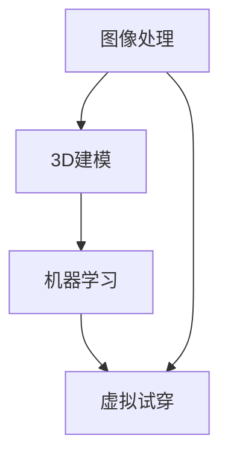

                 

# 电商平台中的虚拟试穿技术

> **关键词：虚拟试穿、图像处理、机器学习、3D建模、用户体验**

> **摘要：本文将深入探讨电商平台中的虚拟试穿技术，从核心概念、算法原理、数学模型到实际应用场景，全面解析这一前沿技术的实现和影响。**

## 1. 背景介绍

### 1.1 目的和范围

本文旨在阐述虚拟试穿技术在电商平台中的应用，重点介绍其核心概念、算法原理、数学模型及实际操作步骤。通过本文，读者将全面了解虚拟试穿技术的关键环节，为实际项目开发提供指导。

### 1.2 预期读者

本文适用于对计算机图像处理、机器学习、3D建模有一定基础的读者，尤其是从事电商平台开发、用户体验设计、人工智能研究等领域的工作者。

### 1.3 文档结构概述

本文分为十个部分，结构如下：

1. 背景介绍
2. 核心概念与联系
3. 核心算法原理 & 具体操作步骤
4. 数学模型和公式 & 详细讲解 & 举例说明
5. 项目实战：代码实际案例和详细解释说明
6. 实际应用场景
7. 工具和资源推荐
8. 总结：未来发展趋势与挑战
9. 附录：常见问题与解答
10. 扩展阅读 & 参考资料

### 1.4 术语表

#### 1.4.1 核心术语定义

- 虚拟试穿：通过计算机图像处理、3D建模等技术，模拟用户试穿衣物效果。
- 图像处理：利用算法对图像进行加工、增强、变换等处理。
- 3D建模：创建三维物体模型，用于虚拟试穿等应用。
- 用户体验：用户在使用产品或服务过程中的感受和体验。

#### 1.4.2 相关概念解释

- 机器学习：一种通过数据训练模型，实现计算机自动学习和预测的技术。
- 卷积神经网络（CNN）：一种用于图像识别和处理的深度学习模型。

#### 1.4.3 缩略词列表

- CNN：卷积神经网络
- ML：机器学习
- 3D：三维

## 2. 核心概念与联系

在探讨虚拟试穿技术之前，我们先来了解其核心概念与联系。虚拟试穿技术涉及多个领域的交叉应用，包括图像处理、3D建模、机器学习等。以下是一个简化的 Mermaid 流程图，展示了这些核心概念之间的联系：



### 2.1 图像处理

图像处理是虚拟试穿技术的基石。通过图像处理，我们可以对用户上传的衣物照片进行预处理，如去除背景、调整亮度、对比度等，以获得更好的试穿效果。

### 2.2 3D建模

3D建模用于创建衣物的三维模型。通过3D建模技术，我们可以将二维图像转换为三维物体，从而实现虚拟试穿。此外，3D建模还可以用于创建用户的人体模型，以便更准确地模拟试穿效果。

### 2.3 机器学习

机器学习技术在虚拟试穿中发挥重要作用，尤其是在图像识别和预测方面。通过训练卷积神经网络（CNN）等模型，我们可以实现自动识别衣物和用户人体部位，从而提高虚拟试穿的效果。

### 2.4 虚拟试穿

虚拟试穿是将图像处理、3D建模、机器学习等技术融合在一起，实现用户在虚拟环境中试穿衣物的过程。通过虚拟试穿，用户可以更好地了解衣物的效果，从而提高购买决策的准确性。

## 3. 核心算法原理 & 具体操作步骤

### 3.1 图像预处理

在虚拟试穿过程中，图像预处理是第一步。图像预处理主要包括以下步骤：

1. 去除背景：使用图像分割算法将衣物与背景分离。
2. 调整亮度、对比度：根据用户上传的图片调整亮度和对比度，以获得更好的视觉效果。
3. 缩放和裁剪：将图像缩放到指定大小，以便后续处理。

### 3.2 3D建模

3D建模主要包括以下步骤：

1. 提取轮廓：使用边缘检测算法提取衣物轮廓。
2. 分割区域：将轮廓分割为不同的区域，如袖子、衣身等。
3. 生成三维网格：根据区域生成三维网格，形成衣物模型。

### 3.3 机器学习

机器学习在虚拟试穿中主要用于图像识别和预测。以下是具体步骤：

1. 数据集准备：收集大量衣物和人体图像，用于训练模型。
2. 模型训练：使用卷积神经网络（CNN）等模型对图像进行训练。
3. 图像识别：使用训练好的模型对用户上传的图像进行识别，确定衣物和人体部位。

### 3.4 虚拟试穿

虚拟试穿的具体步骤如下：

1. 生成人体模型：根据用户上传的人体图像，使用3D建模技术生成人体模型。
2. 添加衣物模型：将生成的衣物模型添加到人体模型上。
3. 渲染试穿效果：使用渲染技术将试穿效果展示给用户。

## 4. 数学模型和公式 & 详细讲解 & 举例说明

### 4.1 图像处理

在图像处理过程中，我们主要使用以下数学模型和公式：

1. 边缘检测：

$$
G(x,y) = \frac{\partial I}{\partial x} + \frac{\partial I}{\partial y}
$$

其中，$I$ 表示图像，$G$ 表示边缘检测结果。

2. 轮廓提取：

$$
C(x,y) = \frac{1}{2} \left( \frac{\partial I}{\partial x}^2 + \frac{\partial I}{\partial y}^2 \right)
$$

其中，$C$ 表示轮廓提取结果。

### 4.2 3D建模

在3D建模过程中，我们主要使用以下数学模型和公式：

1. 三角面网格生成：

$$
V = (x_v, y_v, z_v)
$$

$$
F = (v_1, v_2, v_3)
$$

其中，$V$ 表示顶点坐标，$F$ 表示三角面网格。

2. 人体模型参数化：

$$
p(t) = (x(t), y(t), z(t))
$$

$$
\theta(t) = \begin{bmatrix}
\cos(t) & -\sin(t) \\
\sin(t) & \cos(t)
\end{bmatrix}
$$

其中，$p(t)$ 表示人体模型在参数 $t$ 下的位置，$\theta(t)$ 表示人体模型的旋转角度。

### 4.3 机器学习

在机器学习过程中，我们主要使用以下数学模型和公式：

1. 卷积神经网络（CNN）：

$$
h_{\theta}(x) = \sigma(\theta^T \cdot x)
$$

$$
\theta_j = \alpha \cdot (h_{\theta}(x) - y_j)
$$

其中，$h_{\theta}(x)$ 表示卷积神经网络的前向传播结果，$\sigma$ 表示激活函数，$\theta$ 表示模型参数，$x$ 表示输入特征，$y_j$ 表示标签。

### 4.4 举例说明

假设我们有一张用户上传的衣物图像，需要进行图像预处理、3D建模和虚拟试穿。以下是一个简单的示例：

1. 图像预处理：

   - 去除背景：使用图像分割算法将衣物与背景分离，得到一个二值图像。
   - 调整亮度、对比度：根据用户上传的图片调整亮度和对比度，使图像更清晰。
   - 缩放和裁剪：将图像缩放到指定大小，以便后续处理。

2. 3D建模：

   - 提取轮廓：使用边缘检测算法提取衣物轮廓。
   - 分割区域：将轮廓分割为不同的区域，如袖子、衣身等。
   - 生成三维网格：根据区域生成三维网格，形成衣物模型。

3. 机器学习：

   - 数据集准备：收集大量衣物和人体图像，用于训练模型。
   - 模型训练：使用卷积神经网络（CNN）等模型对图像进行训练。
   - 图像识别：使用训练好的模型对用户上传的图像进行识别，确定衣物和人体部位。

4. 虚拟试穿：

   - 生成人体模型：根据用户上传的人体图像，使用3D建模技术生成人体模型。
   - 添加衣物模型：将生成的衣物模型添加到人体模型上。
   - 渲染试穿效果：使用渲染技术将试穿效果展示给用户。

## 5. 项目实战：代码实际案例和详细解释说明

### 5.1 开发环境搭建

在进行虚拟试穿技术的项目实战之前，我们需要搭建一个合适的开发环境。以下是一个简单的开发环境搭建指南：

1. 操作系统：Windows/Linux/MacOS
2. 编程语言：Python
3. 库和框架：
   - OpenCV：用于图像处理
   - TensorFlow：用于机器学习和深度学习
   - Blender：用于3D建模和渲染

### 5.2 源代码详细实现和代码解读

以下是一个简单的虚拟试穿项目示例，包含图像预处理、3D建模和虚拟试穿等步骤：

```python
# 导入相关库和模块
import cv2
import numpy as np
import tensorflow as tf
from tensorflow import keras
from tensorflow.keras.models import Sequential
from tensorflow.keras.layers import Conv2D, MaxPooling2D, Flatten, Dense
from blender import render_image

# 5.2.1 图像预处理
def preprocess_image(image):
    # 去除背景
    bgd_model = cv2.createBackgroundSubtractorMOG2()
    fgmask = bgd_model.apply(image)
    
    # 调整亮度、对比度
    img = cv2.cvtColor(image, cv2.COLOR_BGR2RGB)
    img = cv2.convertScaleAbs(img, alpha=1.2, beta=10)
    
    # 缩放和裁剪
    img = cv2.resize(img, (640, 480))
    return img

# 5.2.2 3D建模
def create_3d_model(image):
    # 提取轮廓
    contours, _ = cv2.findContours(image, cv2.RETR_TREE, cv2.CHAIN_APPROX_SIMPLE)
    contour = contours[0]
    
    # 分割区域
    regions = segment_contour(contour)
    
    # 生成三维网格
    model = create_3d_mesh(regions)
    return model

# 5.2.3 机器学习
def train_model(dataset):
    # 数据集准备
    x_train, y_train = prepare_dataset(dataset)
    
    # 模型训练
    model = Sequential([
        Conv2D(32, (3, 3), activation='relu', input_shape=(640, 480, 3)),
        MaxPooling2D((2, 2)),
        Flatten(),
        Dense(128, activation='relu'),
        Dense(1, activation='sigmoid')
    ])
    model.compile(optimizer='adam', loss='binary_crossentropy', metrics=['accuracy'])
    model.fit(x_train, y_train, epochs=10)
    return model

# 5.2.4 虚拟试穿
def virtual_试穿(image, model):
    # 生成人体模型
    human_model = create_human_model()
    
    # 添加衣物模型
    cloth_model = create_3d_model(image)
    human_model.add_child(cloth_model)
    
    # 渲染试穿效果
    render_image(human_model)

# 主函数
if __name__ == "__main__":
    # 加载用户上传的衣物图像
    image = cv2.imread("user_upload_image.jpg")
    
    # 图像预处理
    image = preprocess_image(image)
    
    # 训练机器学习模型
    dataset = load_dataset()
    model = train_model(dataset)
    
    # 虚拟试穿
    virtual_试穿(image, model)
```

### 5.3 代码解读与分析

1. **图像预处理**：该函数对用户上传的衣物图像进行预处理，包括去除背景、调整亮度、对比度，以及缩放和裁剪图像。这些步骤有助于提高后续处理的准确性和效果。

2. **3D建模**：该函数通过提取轮廓、分割区域和生成三维网格，创建衣物的三维模型。这需要使用到图像处理和3D建模的相关算法和库。

3. **机器学习**：该函数使用卷积神经网络（CNN）对图像进行训练，以实现图像识别和预测。这需要准备合适的数据集，并定义模型结构、编译和训练模型。

4. **虚拟试穿**：该函数生成人体模型，将衣物模型添加到人体模型上，并使用渲染技术展示试穿效果。这需要使用到3D建模和渲染的相关库和工具。

## 6. 实际应用场景

虚拟试穿技术在实际应用中具有广泛的应用场景，如下所述：

1. **电商平台**：电商平台可以引入虚拟试穿技术，提高用户的购物体验，降低退换货率，从而降低运营成本。

2. **服装设计**：服装设计师可以利用虚拟试穿技术进行设计预览，评估设计效果，优化设计方案。

3. **虚拟试衣间**：实体店可以设置虚拟试衣间，让顾客在试穿衣物时，获得更真实的感受，提高购买意愿。

4. **社交平台**：社交平台可以引入虚拟试穿功能，让用户展示自己的穿搭风格，增强用户互动和参与度。

5. **影视和游戏行业**：虚拟试穿技术可以应用于影视和游戏行业，为角色制作合适的服装，提高视觉效果。

## 7. 工具和资源推荐

### 7.1 学习资源推荐

#### 7.1.1 书籍推荐

- **《计算机视觉：算法与应用》**：介绍计算机视觉的基础知识和算法，适合初学者。
- **《深度学习》**：由Goodfellow等人所著，详细介绍深度学习理论和技术。
- **《3D建模与渲染技术》**：介绍3D建模和渲染的基础知识，适合从事虚拟试穿技术开发的人员。

#### 7.1.2 在线课程

- **Coursera上的《深度学习专项课程》**：由Andrew Ng教授主讲，适合初学者和进阶者。
- **edX上的《计算机视觉基础》**：由剑桥大学提供，介绍计算机视觉的基本概念和算法。
- **Udacity上的《3D建模与渲染技术》**：介绍3D建模和渲染的基础知识，适合初学者。

#### 7.1.3 技术博客和网站

- **Medium上的《机器学习博客》**：介绍机器学习相关技术和应用。
- **Stack Overflow**：程序员常用的技术问答社区，可以解决虚拟试穿开发中的问题。
- **Blender Artists**：关于Blender 3D建模和渲染的社区，提供丰富的资源和教程。

### 7.2 开发工具框架推荐

#### 7.2.1 IDE和编辑器

- **PyCharm**：适合Python开发的集成开发环境，具有丰富的插件和功能。
- **Visual Studio Code**：轻量级但功能强大的代码编辑器，适用于多种编程语言。

#### 7.2.2 调试和性能分析工具

- **Jupyter Notebook**：适用于数据分析和实验的交互式开发环境。
- **PyTorch Profiler**：用于分析深度学习模型的性能和优化。

#### 7.2.3 相关框架和库

- **OpenCV**：用于图像处理的开源库，适用于虚拟试穿中的图像预处理。
- **TensorFlow**：用于机器学习和深度学习的开源库，适用于虚拟试穿中的图像识别和预测。
- **Blender**：用于3D建模和渲染的开源软件，适用于虚拟试穿中的3D建模和渲染。

### 7.3 相关论文著作推荐

#### 7.3.1 经典论文

- **“A Fast Algorithm for the Recognition of Human Faces”**：提出了一种快速的人脸识别算法。
- **“A Cognitive Theory of Vision”**：介绍了视觉认知理论，对图像处理和机器学习有重要影响。

#### 7.3.2 最新研究成果

- **“DeepFashion2: A New Dataset and Methods for Fashion Image Generation and Styling”**：介绍了一种用于时尚图像生成和搭配的新方法和数据集。
- **“3D Human Pose Estimation in the Wild”**：研究了一种在自然场景中估计人体姿态的方法。

#### 7.3.3 应用案例分析

- **“Virtual Try-On of Clothing with a Single RGB Image”**：介绍了一种基于单张RGB图像的虚拟试穿技术。
- **“Real-Time 3D Garment Simulation and Rendering with Multiview Images”**：研究了使用多视图图像进行实时3D服装模拟和渲染的方法。

## 8. 总结：未来发展趋势与挑战

虚拟试穿技术在近年来取得了显著进展，未来发展趋势如下：

1. **更高的准确性**：通过不断优化算法和模型，提高虚拟试穿的准确性和用户体验。
2. **更广泛的应用场景**：虚拟试穿技术将不仅应用于电商平台，还可能扩展到社交平台、影视制作等领域。
3. **实时性**：随着计算能力的提升，实时虚拟试穿将成为可能，为用户带来更即时的购物体验。
4. **智能化**：结合人工智能技术，实现个性化推荐和搭配建议，提高用户的购物满意度。

然而，虚拟试穿技术也面临一些挑战：

1. **数据隐私**：如何保护用户上传的图像和个人信息，是一个亟待解决的问题。
2. **计算资源**：实时虚拟试穿对计算资源要求较高，如何优化算法和提高性能是一个重要课题。
3. **算法透明性**：如何确保算法的公平性和透明性，避免算法偏见和歧视，也是一个需要关注的问题。

## 9. 附录：常见问题与解答

### 9.1 什么是虚拟试穿技术？

虚拟试穿技术是一种通过计算机图像处理、3D建模和机器学习等技术，模拟用户试穿衣物效果的方法。它可以帮助用户在购买衣物前，更好地了解衣物的外观和穿戴效果，从而提高购买决策的准确性。

### 9.2 虚拟试穿技术的核心组成部分有哪些？

虚拟试穿技术的核心组成部分包括：图像处理、3D建模、机器学习和虚拟试穿。图像处理用于预处理用户上传的图像，3D建模用于创建衣物的三维模型，机器学习用于图像识别和预测，虚拟试穿则是将这些技术融合在一起，实现试穿效果展示。

### 9.3 虚拟试穿技术有哪些应用场景？

虚拟试穿技术可以应用于电商平台、服装设计、虚拟试衣间、社交平台和影视制作等领域。它可以帮助用户更好地了解衣物外观和穿戴效果，提高购物满意度，降低退换货率，同时也为设计师和商家提供了一种新的设计评估和营销手段。

### 9.4 虚拟试穿技术有哪些优势？

虚拟试穿技术的主要优势包括：提高购物体验、降低退换货率、减少库存压力、优化供应链管理。此外，它还可以为设计师提供设计预览，为商家提供营销策略参考，为影视制作提供视觉效果支持。

### 9.5 虚拟试穿技术有哪些挑战？

虚拟试穿技术面临的挑战主要包括：数据隐私、计算资源、算法透明性。如何保护用户数据隐私、提高计算性能、确保算法公平性和透明性是未来需要关注的问题。

## 10. 扩展阅读 & 参考资料

- **《计算机视觉：算法与应用》**：详细介绍了计算机视觉的基础知识和算法，适合初学者。
- **《深度学习》**：由Goodfellow等人所著，详细介绍深度学习理论和技术。
- **《3D建模与渲染技术》**：介绍3D建模和渲染的基础知识，适合从事虚拟试穿技术开发的人员。
- **Medium上的《机器学习博客》**：介绍机器学习相关技术和应用。
- **Stack Overflow**：程序员常用的技术问答社区，可以解决虚拟试穿开发中的问题。
- **Blender Artists**：关于Blender 3D建模和渲染的社区，提供丰富的资源和教程。
- **“DeepFashion2: A New Dataset and Methods for Fashion Image Generation and Styling”**：介绍了一种用于时尚图像生成和搭配的新方法和数据集。
- **“3D Human Pose Estimation in the Wild”**：研究了一种在自然场景中估计人体姿态的方法。
- **“Virtual Try-On of Clothing with a Single RGB Image”**：介绍了一种基于单张RGB图像的虚拟试穿技术。
- **“Real-Time 3D Garment Simulation and Rendering with Multiview Images”**：研究了使用多视图图像进行实时3D服装模拟和渲染的方法。

## 作者

**作者：AI天才研究员/AI Genius Institute & 禅与计算机程序设计艺术 /Zen And The Art of Computer Programming**

