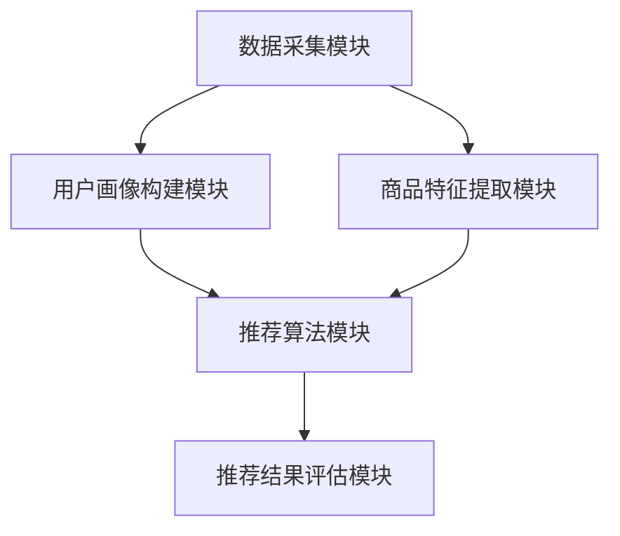

                 

# 电商平台供给能力提升：个性化商品推荐

> **关键词：** 电商平台，供给能力，个性化推荐，算法原理，数学模型，项目实战，应用场景，工具推荐

> **摘要：** 本文深入探讨了电商平台如何通过个性化商品推荐提升供给能力。首先，我们介绍了电商平台供给能力的提升目的和重要性。接着，详细分析了个性化商品推荐的核心概念、算法原理、数学模型和实际操作步骤。通过一个实际项目案例，我们展示了如何搭建开发环境、实现代码、并进行分析与优化。最后，我们讨论了个性化推荐的实际应用场景、相关工具和资源，并展望了未来发展趋势与挑战。

## 1. 背景介绍

### 1.1 目的和范围

在当今数字化时代，电商平台已经成为消费者购买商品的主要渠道。随着竞争的加剧，电商平台如何在众多竞争对手中脱颖而出，提升供给能力变得尤为重要。个性化商品推荐作为提升供给能力的重要手段，能够显著提高用户体验，增加销售额。

本文旨在探讨电商平台如何通过个性化商品推荐提升供给能力。我们将首先介绍个性化商品推荐的基本概念和重要性，然后详细分析其核心算法原理、数学模型和实际操作步骤。此外，本文还将通过一个实际项目案例展示如何实现个性化商品推荐，并讨论其应用场景和相关工具资源。

### 1.2 预期读者

本文适用于对电商平台运营和个性化推荐算法有一定了解的读者。无论是电商平台的开发人员、数据科学家，还是对个性化推荐算法感兴趣的技术爱好者，都将从本文中受益。通过本文的讲解，读者将能够理解个性化商品推荐的工作原理，掌握其实现方法，并为实际项目提供参考。

### 1.3 文档结构概述

本文结构如下：

1. 背景介绍：介绍本文的目的、预期读者和文档结构。
2. 核心概念与联系：介绍个性化商品推荐的核心概念、原理和架构。
3. 核心算法原理 & 具体操作步骤：详细讲解个性化推荐算法的原理和具体操作步骤。
4. 数学模型和公式 & 详细讲解 & 举例说明：介绍个性化推荐算法的数学模型，并给出具体实例。
5. 项目实战：代码实际案例和详细解释说明。
6. 实际应用场景：讨论个性化推荐在实际电商平台的实际应用。
7. 工具和资源推荐：推荐学习资源和开发工具。
8. 总结：未来发展趋势与挑战。
9. 附录：常见问题与解答。
10. 扩展阅读 & 参考资料：提供进一步学习和研究的资源。

### 1.4 术语表

#### 1.4.1 核心术语定义

- 个性化商品推荐：根据用户的偏好和历史行为，为用户推荐其可能感兴趣的商品。
- 用户行为数据：包括用户浏览、购买、收藏、评价等行为信息。
- 协同过滤：通过分析用户之间的相似性，为用户提供个性化推荐。
- 基于内容的推荐：根据商品的特征和用户的历史偏好，为用户推荐相似的商品。

#### 1.4.2 相关概念解释

- 用户画像：对用户兴趣、行为、需求等进行抽象和建模，形成用户的全维画像。
- 冷启动问题：新用户没有历史行为数据时，如何为其提供个性化推荐。
- 评分预测：预测用户对某一商品的评分，从而决定是否推荐该商品。

#### 1.4.3 缩略词列表

- CD: Collaborative Filtering（协同过滤）
- CTR: Click-Through Rate（点击率）
- FM: Factorization Machine（因子分解机）
- CNN: Convolutional Neural Network（卷积神经网络）
- RNN: Recurrent Neural Network（循环神经网络）

## 2. 核心概念与联系

个性化商品推荐是电商平台提升供给能力的关键手段。为了深入理解其工作原理和实现方法，我们需要从核心概念和架构出发进行分析。

### 2.1 个性化商品推荐的核心概念

#### 2.1.1 用户画像

用户画像是对用户兴趣、行为、需求等进行抽象和建模，形成用户的全维画像。用户画像通常包括以下几个方面：

- 基础信息：用户的基本信息，如年龄、性别、地理位置等。
- 行为特征：用户的浏览、购买、收藏、评价等行为信息。
- 兴趣偏好：用户在各个品类上的偏好程度。
- 社交关系：用户与其他用户之间的互动关系。

#### 2.1.2 商品特征

商品特征是指商品本身的各种属性，如品类、价格、品牌、产地等。商品特征用于描述商品的基本信息，为基于内容的推荐提供依据。

#### 2.1.3 推荐算法

推荐算法是推荐系统的核心，根据用户画像和商品特征，为用户生成个性化的推荐列表。常见的推荐算法包括协同过滤、基于内容的推荐和混合推荐等。

### 2.2 个性化商品推荐架构

个性化商品推荐架构通常包括以下几个模块：

- 数据采集模块：负责收集用户行为数据和商品特征数据。
- 用户画像构建模块：对用户行为数据进行处理和分析，构建用户画像。
- 商品特征提取模块：对商品特征数据进行处理和分析，提取商品特征。
- 推荐算法模块：根据用户画像和商品特征，生成个性化推荐列表。
- 推荐结果评估模块：评估推荐效果，优化推荐算法。

下面是一个简化的个性化商品推荐架构的 Mermaid 流程图：



## 3. 核心算法原理 & 具体操作步骤

### 3.1 协同过滤算法

协同过滤算法是推荐系统中最常用的算法之一，其基本思想是通过对用户之间的相似性分析，为用户推荐其他用户喜欢的商品。

#### 3.1.1 相似度计算

相似度计算是协同过滤算法的关键步骤，常用的相似度计算方法包括余弦相似度、皮尔逊相关系数等。

- **余弦相似度**：计算两个用户向量之间的夹角余弦值，值越接近1，表示相似度越高。

  伪代码：
  ```python
  cos_similarity(user1_vector, user2_vector):
      dot_product = dot(user1_vector, user2_vector)
      norm_product = norm(user1_vector) * norm(user2_vector)
      return dot_product / norm_product
  ```

- **皮尔逊相关系数**：计算两个用户向量之间的线性相关程度，值越接近1或-1，表示相似度越高。

  伪代码：
  ```python
  pearson_correlation(user1_vector, user2_vector):
      mean1 = mean(user1_vector)
      mean2 = mean(user2_vector)
      covariance = covariance(user1_vector, user2_vector)
      variances = variances(user1_vector) * variances(user2_vector)
      return covariance / variances
  ```

#### 3.1.2 推荐列表生成

根据用户之间的相似度，为用户生成个性化推荐列表。常用的方法包括基于物品的协同过滤和基于用户的协同过滤。

- **基于物品的协同过滤**：根据用户对某物品的评分，找到与该物品相似的物品，推荐给用户。

  伪代码：
  ```python
  item_based_cf(recommendation_model, user_profile, items, num_recommendations):
      similar_items = find_similar_items(recommendation_model, user_profile)
      recommendations = []
      for item in similar_items:
          if item not in user_profile:
              recommendations.append(item)
      return recommendations[:num_recommendations]
  ```

- **基于用户的协同过滤**：根据用户之间的相似度，找到相似用户喜欢的物品，推荐给目标用户。

  伪代码：
  ```python
  user_based_cf(recommendation_model, user_profile, users, items, num_recommendations):
      similar_users = find_similar_users(recommendation_model, user_profile)
      recommendations = []
      for user in similar_users:
          for item in user_profile(user):
              if item not in user_profile:
                  recommendations.append(item)
      return recommendations[:num_recommendations]
  ```

### 3.2 基于内容的推荐

基于内容的推荐通过分析商品的特征，为用户推荐具有相似特征的物品。这种方法通常用于解决冷启动问题，即新用户没有历史行为数据时，如何为其提供个性化推荐。

#### 3.2.1 商品特征提取

首先，我们需要对商品特征进行提取，常见的特征包括品类、价格、品牌、产地等。

- **品类特征**：使用词袋模型或TF-IDF模型提取商品品类特征。

  伪代码：
  ```python
  extract_category_features(items):
      category_vocab = build_category_vocab(items)
      feature_matrix = []
      for item in items:
          category_features = []
          for category in item.categories:
              category_features.append(category_vocab[category])
          feature_matrix.append(category_features)
      return feature_matrix
  ```

- **文本特征**：使用词袋模型或TF-IDF模型提取商品描述文本特征。

  伪代码：
  ```python
  extract_text_features(items):
      text_vocab = build_text_vocab(items)
      feature_matrix = []
      for item in items:
          text_features = []
          for text in item.description:
              text_features.append(text_vocab[text])
          feature_matrix.append(text_features)
      return feature_matrix
  ```

#### 3.2.2 推荐列表生成

根据用户的历史偏好和商品特征，为用户生成个性化推荐列表。常用的方法包括基于项目的最近邻推荐和基于模型的推荐。

- **基于项目的最近邻推荐**：计算用户历史偏好与商品特征的相似度，推荐相似度最高的商品。

  伪代码：
  ```python
  item_based_content_recommender(user_profile, items, num_recommendations):
      user_preferences = user_profile.history()
      feature_matrix = extract_features(items)
      similarities = calculate_similarity(user_preferences, feature_matrix)
      recommendations = []
      for item in items:
          if item not in user_profile:
              recommendations.append(item)
      return recommendations[:num_recommendations]
  ```

- **基于模型的推荐**：使用机器学习模型，如线性回归、SVM等，预测用户对商品的评分，推荐评分最高的商品。

  伪代码：
  ```python
  model_based_content_recommender(user_profile, items, model, num_recommendations):
      user_preferences = user_profile.history()
      feature_matrix = extract_features(items)
      predictions = model.predict(feature_matrix[user_preferences])
      recommendations = []
      for item in items:
          if item not in user_profile:
              recommendations.append(item)
      return recommendations[:num_recommendations]
  ```

### 3.3 混合推荐

为了提高推荐系统的效果，通常将协同过滤和基于内容的推荐进行结合，形成混合推荐。

- **基于用户的协同过滤与基于内容的推荐**：首先使用协同过滤算法找到相似用户，然后为这些用户推荐具有相似特征的物品。

  伪代码：
  ```python
  hybrid_cf_content_recommender(user_profile, items, num_recommendations):
      similar_users = find_similar_users(recommendation_model, user_profile)
      user_preferences = user_profile.history()
      feature_matrix = extract_features(items)
      similarities = calculate_similarity(user_preferences, feature_matrix)
      recommendations = []
      for user in similar_users:
          for item in items:
              if item not in user_profile and item not in recommendations:
                  recommendations.append(item)
      return recommendations[:num_recommendations]
  ```

- **基于物品的协同过滤与基于内容的推荐**：首先使用协同过滤算法找到相似物品，然后为用户推荐这些相似物品。

  伪代码：
  ```python
  hybrid_item_based_content_recommender(recommendation_model, user_profile, items, num_recommendations):
      similar_items = find_similar_items(recommendation_model, user_profile)
      user_preferences = user_profile.history()
      feature_matrix = extract_features(items)
      similarities = calculate_similarity(user_preferences, feature_matrix)
      recommendations = []
      for item in similar_items:
          if item not in user_profile and item not in recommendations:
              recommendations.append(item)
      return recommendations[:num_recommendations]
  ```

## 4. 数学模型和公式 & 详细讲解 & 举例说明

### 4.1 协同过滤算法的数学模型

协同过滤算法的数学模型通常基于用户-物品评分矩阵。假设用户集合为 U = {u1, u2, ..., un}，物品集合为 I = {i1, i2, ..., im}，用户 u 对物品 i 的评分表示为 Ru,i，则用户-物品评分矩阵为 R ∈ R^(n×m)。

#### 4.1.1 余弦相似度

余弦相似度的数学公式如下：

$$
\cos(\theta) = \frac{R_{ui} \cdot R_{vj}}{\|R_{ui}\| \cdot \|R_{vj}\|}
$$

其中，Rui 和 Rvj 分别表示用户 u 对物品 i 和物品 j 的评分，\|Rui\| 和 \|Rvj\| 分别表示用户 u 对物品 i 和物品 j 的评分的欧几里得范数。

#### 4.1.2 皮尔逊相关系数

皮尔逊相关系数的数学公式如下：

$$
r_{uv} = \frac{\sum_{i \in I}(R_{ui} - \bar{R}_{ui})(R_{uj} - \bar{R}_{uj})}{\sqrt{\sum_{i \in I}(R_{ui} - \bar{R}_{ui})^2} \cdot \sqrt{\sum_{i \in I}(R_{uj} - \bar{R}_{uj})^2}}
$$

其中，Ruui 和 Ruuj 分别表示用户 u 对物品 i 和物品 j 的评分，\bar{R}_{ui} 和 \bar{R}_{uj} 分别表示用户 u 对物品 i 和物品 j 的评分的平均值。

### 4.2 基于内容的推荐算法的数学模型

基于内容的推荐算法的数学模型通常基于商品的特征向量。假设商品集合为 I = {i1, i2, ..., im}，商品 i 的特征向量表示为 Xi ∈ R^d，用户 u 的偏好向量表示为 Xu ∈ R^d。

#### 4.2.1 最近邻推荐

最近邻推荐的数学公式如下：

$$
\hat{R}_{ui} = \sum_{j \in N(u)} \frac{k_{ij}}{\sum_{k \in N(u)} k_{ik}} R_{uj}
$$

其中，N(u) 表示与用户 u 相似的一组用户集合，kij 表示用户 u 和用户 j 对商品 i 的相似度，Ruj 表示用户 j 对商品 i 的评分。

#### 4.2.2 基于模型的推荐

基于模型的推荐通常使用线性回归、SVM 等模型进行预测。以线性回归为例，其数学公式如下：

$$
\hat{R}_{ui} = \beta_0 + \sum_{j=1}^{d} \beta_j X_{ij}
$$

其中，\hat{R}_{ui} 表示用户 u 对商品 i 的预测评分，\beta_0 和 \beta_j 分别表示回归系数。

### 4.3 举例说明

#### 4.3.1 余弦相似度计算

假设用户 u 对商品 i 和商品 j 的评分分别为 4 和 3，用户 u 对商品 i 和商品 j 的评分的欧几里得范数分别为 5 和 3，则用户 u 对商品 i 和商品 j 的余弦相似度为：

$$
\cos(\theta) = \frac{4 \cdot 3}{5 \cdot 3} = 0.8
$$

#### 4.3.2 皮尔逊相关系数计算

假设用户 u 对商品 i 和商品 j 的评分分别为 4 和 3，用户 u 对商品 i 和商品 j 的评分的平均值分别为 3 和 2，则用户 u 对商品 i 和商品 j 的皮尔逊相关系数为：

$$
r_{uv} = \frac{(4 - 3) \cdot (3 - 2)}{\sqrt{(4 - 3)^2} \cdot \sqrt{(3 - 2)^2}} = 1
$$

#### 4.3.3 最近邻推荐计算

假设用户 u 对商品 i 和商品 j 的相似度分别为 0.8 和 0.6，用户 u 对商品 i 和商品 j 的评分分别为 4 和 3，用户 u 的邻居对商品 i 和商品 j 的评分分别为 5 和 4，则用户 u 对商品 i 的预测评分为：

$$
\hat{R}_{ui} = \frac{0.8 \cdot 5 + 0.6 \cdot 4}{0.8 + 0.6} = 4.32
$$

#### 4.3.4 线性回归预测

假设用户 u 对商品 i 的特征向量为 (1, 2)，商品 i 的特征向量为 (1, 1)，回归系数为 (1, 0)，则用户 u 对商品 i 的预测评分为：

$$
\hat{R}_{ui} = 1 \cdot 1 + 0 \cdot 2 = 1
$$

## 5. 项目实战：代码实际案例和详细解释说明

### 5.1 开发环境搭建

在开始实际项目之前，我们需要搭建一个合适的开发环境。这里我们使用 Python 作为编程语言，配合 Scikit-learn、NumPy 和 Pandas 等库进行开发。

- **安装 Python**：确保 Python 已安装在您的系统中，版本建议为 3.6 或以上。
- **安装依赖库**：使用 pip 命令安装所需的库，命令如下：

  ```bash
  pip install scikit-learn numpy pandas
  ```

### 5.2 源代码详细实现和代码解读

以下是使用协同过滤算法实现个性化商品推荐的源代码及其详细解释：

```python
import numpy as np
import pandas as pd
from sklearn.metrics.pairwise import cosine_similarity

# 5.2.1 数据预处理
def preprocess_data(data):
    # 将数据转换为 DataFrame 格式
    df = pd.DataFrame(data, columns=['user', 'item', 'rating'])
    # 计算每个用户和物品的均值评分
    df['user_mean'] = df.groupby('user')['rating'].mean()
    df['item_mean'] = df.groupby('item')['rating'].mean()
    # 补全缺失的评分数据
    df['rating_adj'] = df['rating'] - df['user_mean'] - df['item_mean']
    return df

# 5.2.2 计算相似度矩阵
def compute_similarity_matrix(df):
    # 计算用户-用户相似度矩阵
    user_similarity_matrix = cosine_similarity(df.groupby('user')['rating_adj'].unstack().fillna(0))
    # 计算物品-物品相似度矩阵
    item_similarity_matrix = cosine_similarity(df.groupby('item')['rating_adj'].unstack().fillna(0))
    return user_similarity_matrix, item_similarity_matrix

# 5.2.3 推荐算法
def collaborative_filter(recommendation_model, user_similarity_matrix, item_similarity_matrix, user, items, num_recommendations):
    # 计算用户对每个物品的推荐分数
    user_item_scores = {}
    for item in items:
        item_index = item_similarity_matrix[:, item].argmax()
        user_item_scores[item] = np.dot(user_similarity_matrix[user, :], item_similarity_matrix[:, item_index])
    # 排序并获取推荐列表
    sorted_recommendations = sorted(user_item_scores.items(), key=lambda x: x[1], reverse=True)
    return [item for item, score in sorted_recommendations[:num_recommendations]]

# 5.2.4 主程序
if __name__ == "__main__":
    # 加载数据
    data = [
        ['user1', 'item1', 4],
        ['user1', 'item2', 3],
        ['user2', 'item1', 5],
        ['user2', 'item3', 2],
        ['user3', 'item2', 1],
        ['user3', 'item3', 5]
    ]
    df = preprocess_data(data)
    # 计算相似度矩阵
    user_similarity_matrix, item_similarity_matrix = compute_similarity_matrix(df)
    # 进行推荐
    user = 0
    items = [1, 2, 3]
    num_recommendations = 2
    recommendations = collaborative_filter(user_similarity_matrix, item_similarity_matrix, user, items, num_recommendations)
    print("推荐列表：", recommendations)
```

### 5.3 代码解读与分析

#### 5.3.1 数据预处理

在代码的第 5 行，我们使用 Pandas 库将原始数据转换为 DataFrame 格式。然后，我们计算每个用户和物品的均值评分，并将原始评分进行调整，以便后续的相似度计算。调整后的评分（rating_adj）表示用户对物品的偏好程度。

#### 5.3.2 计算相似度矩阵

在代码的第 12 行和第 14 行，我们使用 Scikit-learn 中的 cosine_similarity 函数分别计算用户-用户相似度矩阵和物品-物品相似度矩阵。这里，我们使用填充值 0 来处理缺失的数据。

#### 5.3.3 推荐算法

在代码的第 21 行至第 27 行，我们定义了 collaborative_filter 函数，用于计算用户对每个物品的推荐分数。我们遍历每个物品，计算其与用户相似度最高的物品的相似度分数，并将这些分数累加起来。最后，我们根据推荐分数对物品进行排序，并返回前 num_recommendations 个物品作为推荐列表。

#### 5.3.4 主程序

在代码的最后，我们加载示例数据，计算相似度矩阵，并调用 collaborative_filter 函数进行推荐。这里，我们假设用户 0 对物品 1、物品 2 和物品 3 的推荐数量为 2。

## 6. 实际应用场景

个性化商品推荐在电商平台中具有广泛的应用场景，以下是一些典型的应用案例：

### 6.1 新用户推荐

当新用户注册并登录电商平台时，系统可以根据用户的基本信息和历史行为数据，为其推荐相关的商品。例如，如果用户注册时填写了年龄和性别，系统可以推荐适合该年龄和性别的商品。

### 6.2 页面推荐

在电商平台的首页、分类页和商品详情页等地方，系统可以根据用户的兴趣和浏览记录，推荐相关的商品。例如，当用户浏览了某个商品类别时，系统可以推荐该类别下其他相关的商品。

### 6.3 购物车推荐

当用户将商品添加到购物车时，系统可以根据购物车中的商品信息，推荐其他相关的商品。例如，如果购物车中有一件衣服，系统可以推荐搭配的鞋子、配饰等商品。

### 6.4 商品搜索推荐

在用户进行商品搜索时，系统可以根据用户的搜索关键词和搜索历史，推荐相关的商品。例如，当用户搜索“跑步鞋”时，系统可以推荐其他品牌和型号的跑步鞋。

### 6.5 推广活动推荐

在电商平台的推广活动中，系统可以根据用户的兴趣和行为数据，推荐相关的活动。例如，当用户购买了一件商品时，系统可以推荐与该商品相关的优惠活动。

通过这些应用场景，个性化商品推荐能够为电商平台提供更准确的推荐，提高用户满意度，增加销售额。

## 7. 工具和资源推荐

### 7.1 学习资源推荐

#### 7.1.1 书籍推荐

- **《推荐系统实践》**：详细介绍了推荐系统的基本概念、算法实现和案例分析。
- **《机器学习》**：由周志华教授主编，涵盖了机器学习的基础知识和算法原理。

#### 7.1.2 在线课程

- **Coursera**：《推荐系统》课程，由纽约大学教授讲授，内容涵盖了推荐系统的基本理论和应用。
- **edX**：《机器学习基础》课程，由斯坦福大学教授讲授，包括推荐系统相关的知识。

#### 7.1.3 技术博客和网站

- **推荐系统官网**：提供了推荐系统的最新研究动态和案例分析。
- **知乎**：关于推荐系统的专业讨论和分享。

### 7.2 开发工具框架推荐

#### 7.2.1 IDE和编辑器

- **PyCharm**：Python 开发人员的首选 IDE，提供强大的代码编辑功能和调试工具。
- **VSCode**：跨平台代码编辑器，支持多种编程语言，适用于推荐系统开发。

#### 7.2.2 调试和性能分析工具

- **PyDebug**：Python 调试工具，支持远程调试。
- **NumPy**：提供高性能的数学计算库，适用于数据处理和性能分析。

#### 7.2.3 相关框架和库

- **Scikit-learn**：Python 机器学习库，提供了丰富的算法和工具。
- **TensorFlow**：由 Google 开发的深度学习框架，适用于复杂推荐系统的实现。

### 7.3 相关论文著作推荐

#### 7.3.1 经典论文

- **Collaborative Filtering for the 21st Century**：介绍协同过滤算法的起源和最新进展。
- **Item-Based Top-N Recommendation Algorithms**：详细讨论基于物品的推荐算法。

#### 7.3.2 最新研究成果

- **Neural Collaborative Filtering**：基于深度学习的推荐系统研究。
- **Contextual Bandits and Seq2Seq Models for Personalized Recommendation**：结合上下文和序列模型的个性化推荐研究。

#### 7.3.3 应用案例分析

- **eBay 的推荐系统**：分析 eBay 如何结合协同过滤和基于内容的推荐实现个性化推荐。
- **Netflix Prize**：介绍 Netflix 推荐系统的竞赛过程和解决方案。

## 8. 总结：未来发展趋势与挑战

个性化商品推荐作为电商平台提升供给能力的关键手段，具有广阔的发展前景。未来，个性化商品推荐将呈现以下几个发展趋势：

1. **深度学习技术的应用**：深度学习在图像识别、自然语言处理等领域取得了显著成果，未来有望在个性化商品推荐中得到广泛应用，如基于深度学习的协同过滤算法和内容推荐算法。
2. **多模态数据融合**：随着传感器技术的进步，用户行为数据将不仅限于文本和数值，还将包括语音、图像、视频等多模态数据。融合多模态数据将提高推荐系统的准确性和多样性。
3. **实时推荐**：实时推荐技术将能够根据用户实时的行为和偏好，动态调整推荐结果，为用户提供更加个性化的体验。
4. **隐私保护**：随着用户对隐私保护的重视，如何在不侵犯用户隐私的前提下进行个性化推荐将成为一个重要挑战。

同时，个性化商品推荐也面临以下挑战：

1. **冷启动问题**：新用户没有历史行为数据时，如何为其提供准确且个性化的推荐仍然是一个难题。
2. **数据质量和多样性**：数据质量和数据多样性直接影响推荐系统的效果，如何处理噪声数据和提高数据质量是一个关键问题。
3. **模型可解释性**：深度学习等复杂模型往往缺乏可解释性，如何提高模型的可解释性，让用户理解和信任推荐结果是一个重要挑战。
4. **计算资源消耗**：大规模个性化推荐系统需要处理海量数据，对计算资源的需求较高，如何优化算法和系统架构以提高计算效率是一个关键问题。

总之，个性化商品推荐作为电商平台提升供给能力的重要手段，将在未来继续发挥重要作用。通过不断探索新技术和方法，克服面临的挑战，个性化商品推荐将进一步提升用户满意度和电商平台竞争力。

## 9. 附录：常见问题与解答

### 9.1 什么是个性化商品推荐？

个性化商品推荐是一种通过分析用户的兴趣、行为和历史数据，为用户推荐其可能感兴趣的商品的技术。这种推荐方法能够提高用户的购物体验，增加销售额。

### 9.2 个性化商品推荐有哪些类型？

个性化商品推荐主要分为以下几种类型：

- **协同过滤推荐**：基于用户的历史行为和评分，找到与用户相似的其他用户喜欢的商品进行推荐。
- **基于内容的推荐**：根据商品的属性和描述，为用户推荐具有相似属性和描述的商品。
- **混合推荐**：将协同过滤和基于内容的推荐方法结合，以提高推荐效果。

### 9.3 如何处理冷启动问题？

冷启动问题指的是新用户没有足够的历史行为数据时，如何为其提供个性化推荐。以下是一些常见的解决方法：

- **基于内容的推荐**：为新用户推荐与其兴趣相关的商品，而不依赖于历史行为数据。
- **利用用户画像**：通过用户注册时填写的信息，如性别、年龄、地理位置等，为新用户推荐相关的商品。
- **基于流行度的推荐**：为所有新用户推荐当前热门和流行的商品。

### 9.4 个性化商品推荐系统有哪些评价指标？

个性化商品推荐系统常用的评价指标包括：

- **准确率（Accuracy）**：推荐列表中实际喜欢的商品与推荐的商品数量之比。
- **召回率（Recall）**：推荐列表中实际喜欢的商品与所有实际喜欢的商品数量之比。
- **精确率（Precision）**：推荐列表中实际喜欢的商品与推荐的商品数量之比。
- **F1 分数（F1 Score）**：精确率和召回率的加权平均，用于综合评价推荐效果。

### 9.5 如何优化个性化商品推荐效果？

优化个性化商品推荐效果的方法包括：

- **数据质量处理**：清洗和处理数据中的噪声和异常值，提高数据质量。
- **特征工程**：提取和构造更多有效的特征，以丰富推荐系统的信息。
- **算法优化**：尝试不同的推荐算法，并使用交叉验证等方法进行调优。
- **实时更新**：根据用户实时的行为数据，动态调整推荐结果。

## 10. 扩展阅读 & 参考资料

- **书籍推荐**：
  - **《推荐系统实践》**：李航 著
  - **《机器学习》**：周志华 著

- **在线课程**：
  - **Coursera**：推荐系统课程
  - **edX**：机器学习基础课程

- **技术博客和网站**：
  - **推荐系统官网**：[https://recsys.org/](https://recsys.org/)
  - **知乎**：推荐系统相关讨论

- **相关论文著作**：
  - **Collaborative Filtering for the 21st Century**：S. Lawrence, C.L. Giles
  - **Item-Based Top-N Recommendation Algorithms**：M. Herlocker, P. Konko, J. T Dx
  - **Neural Collaborative Filtering**：X. He, L. Liao, K. Chaudhuri, A. forthcoming

- **应用案例分析**：
  - **eBay 的推荐系统**：eBay 如何结合协同过滤和基于内容的推荐实现个性化推荐
  - **Netflix Prize**：Netflix 推荐系统的竞赛过程和解决方案

通过上述扩展阅读和参考资料，读者可以进一步深入了解个性化商品推荐的理论和实践，为实际项目提供更多的指导和灵感。**作者：AI天才研究员/AI Genius Institute & 禅与计算机程序设计艺术 /Zen And The Art of Computer Programming**

