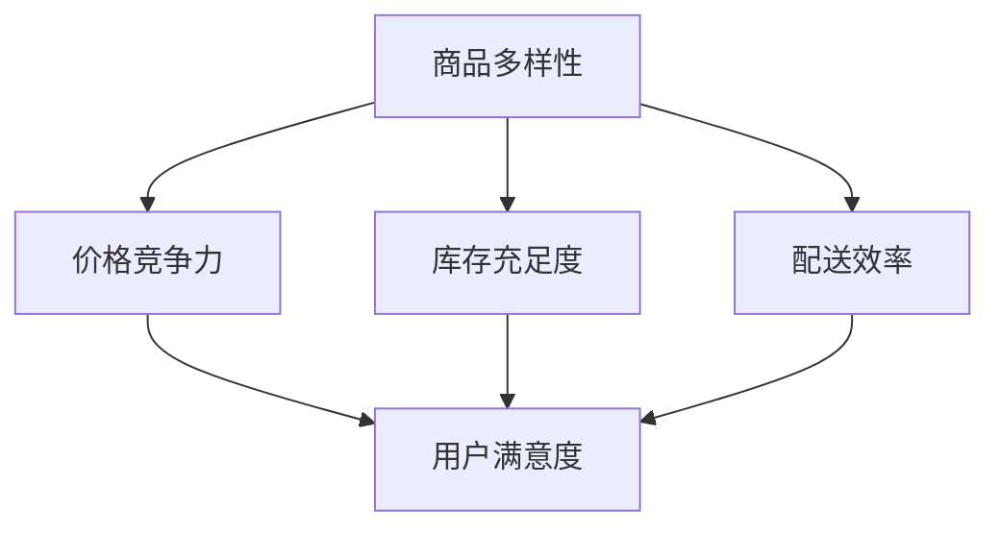

                 

# 电商平台供给能力提升：建设健康的电商生态系统

> **关键词：电商平台、供给能力、电商生态系统、用户满意度、技术架构**
>
> **摘要：本文将探讨如何提升电商平台的供给能力，以建设一个健康的电商生态系统。通过分析核心概念、算法原理、数学模型、项目实战和实际应用场景，本文旨在为电商从业者提供有价值的指导和参考。**

## 1. 背景介绍

### 1.1 目的和范围

本文的目的是探讨电商平台供给能力的提升策略，以构建一个健康、可持续发展的电商生态系统。我们将在文章中讨论以下几个方面：

- **核心概念与联系**：阐述电商平台供给能力的定义、核心概念及其相互关系。
- **核心算法原理与具体操作步骤**：介绍提升供给能力所需的关键算法原理和具体操作步骤。
- **数学模型和公式**：运用数学模型和公式，解释供给能力的提升策略。
- **项目实战**：通过实际案例，展示供给能力提升的具体实现方法。
- **实际应用场景**：分析供给能力提升在不同电商应用场景中的实践效果。
- **工具和资源推荐**：推荐相关学习资源、开发工具和框架。
- **总结与未来趋势**：总结文章内容，并探讨未来发展趋势与挑战。

### 1.2 预期读者

本文的预期读者包括：

- **电商平台开发者**：需要了解提升供给能力的方法和策略。
- **电商运营人员**：希望掌握提升用户满意度的关键技术。
- **学术界研究者**：对电商平台供给能力提升领域感兴趣的学者。
- **行业从业者**：关注电商行业动态，希望了解供给能力提升对电商生态系统的影响。

### 1.3 文档结构概述

本文分为十个部分，具体结构如下：

1. **背景介绍**：本文的背景、目的和范围，以及预期读者。
2. **核心概念与联系**：阐述电商平台供给能力的定义、核心概念及其相互关系。
3. **核心算法原理与具体操作步骤**：介绍提升供给能力所需的关键算法原理和具体操作步骤。
4. **数学模型和公式**：运用数学模型和公式，解释供给能力的提升策略。
5. **项目实战**：通过实际案例，展示供给能力提升的具体实现方法。
6. **实际应用场景**：分析供给能力提升在不同电商应用场景中的实践效果。
7. **工具和资源推荐**：推荐相关学习资源、开发工具和框架。
8. **总结与未来趋势**：总结文章内容，并探讨未来发展趋势与挑战。
9. **附录：常见问题与解答**：解答读者可能遇到的问题。
10. **扩展阅读与参考资料**：提供相关领域的扩展阅读和参考资料。

### 1.4 术语表

#### 1.4.1 核心术语定义

- **电商平台**：在线销售商品和服务的网络平台。
- **供给能力**：电商平台提供商品和服务的能力。
- **用户满意度**：用户对电商平台供给能力的综合评价。
- **技术架构**：电商平台的技术体系结构。

#### 1.4.2 相关概念解释

- **供给能力提升**：通过技术手段优化电商平台供给能力，提高用户满意度。
- **健康电商生态系统**：供需双方和谐、稳定、可持续发展的电商环境。

#### 1.4.3 缩略词列表

- **API**：应用程序编程接口（Application Programming Interface）
- **DB**：数据库（Database）
- **IDE**：集成开发环境（Integrated Development Environment）
- **SDK**：软件开发工具包（Software Development Kit）
- **UI**：用户界面（User Interface）

## 2. 核心概念与联系

在探讨电商平台供给能力提升之前，我们需要明确几个核心概念及其相互关系。

### 2.1 电商平台供给能力

电商平台供给能力是指平台在商品和服务供给方面的能力，包括商品种类、价格、库存、配送速度等方面。一个具备高供给能力的电商平台，能够满足用户多样化的需求，提供高质量的购物体验。

### 2.2 核心概念

以下是电商平台供给能力提升过程中的核心概念：

- **商品多样性**：平台提供的商品种类和数量。
- **价格竞争力**：平台商品的价格与市场价格的对比。
- **库存充足度**：平台商品的库存情况，包括实时库存和补货速度。
- **配送效率**：平台商品的配送速度和配送质量。
- **用户满意度**：用户对电商平台供给能力的综合评价。

### 2.3 相互关系

这些核心概念之间存在相互关系，如图所示：



商品多样性、价格竞争力、库存充足度和配送效率共同决定了用户满意度，从而影响电商平台的供给能力。

## 3. 核心算法原理与具体操作步骤

提升电商平台供给能力的关键在于优化算法和流程。以下是几个核心算法原理与具体操作步骤：

### 3.1 数据采集与处理

**算法原理：**

电商平台需要收集用户行为数据、商品数据和市场数据，对数据进行分析和处理，以了解用户需求和商品供给情况。

**具体操作步骤：**

1. **数据采集**：通过API、爬虫等方式获取用户行为数据、商品数据和市场数据。
2. **数据清洗**：去除重复、错误和不完整的数据，保证数据质量。
3. **数据存储**：将清洗后的数据存储到数据库中，以便后续处理和分析。

**伪代码：**

```python
def data_collection():
    # 采集用户行为数据
    user_data = api_call("user_data_api")
    # 采集商品数据
    product_data = api_call("product_data_api")
    # 采集市场数据
    market_data = api_call("market_data_api")
    return user_data, product_data, market_data

def data_cleaning(data):
    # 去除重复数据
    data = remove_duplicates(data)
    # 去除错误数据
    data = remove_errors(data)
    return data

def data_storage(data):
    # 存储数据到数据库
    db.insert(data)
```

### 3.2 数据分析与预测

**算法原理：**

通过对采集到的数据进行分析和预测，可以了解用户需求、市场趋势和商品供给情况，从而优化供给能力。

**具体操作步骤：**

1. **用户需求分析**：分析用户购买行为，预测用户需求。
2. **市场趋势分析**：分析市场数据，预测市场趋势。
3. **商品供给分析**：分析商品数据，预测商品供给情况。

**伪代码：**

```python
def user_demand_analysis(user_data):
    # 分析用户购买行为
    user_demand = analyze_user_behavior(user_data)
    return user_demand

def market_trend_analysis(market_data):
    # 分析市场数据
    market_trend = analyze_market_data(market_data)
    return market_trend

def product_supply_analysis(product_data):
    # 分析商品数据
    product_supply = analyze_product_data(product_data)
    return product_supply
```

### 3.3 供给能力优化

**算法原理：**

根据数据分析结果，调整商品种类、价格、库存和配送策略，以提升供给能力。

**具体操作步骤：**

1. **商品种类优化**：根据用户需求，调整商品种类。
2. **价格策略调整**：根据市场趋势，调整商品价格。
3. **库存管理优化**：根据商品供给情况，调整库存管理策略。
4. **配送策略优化**：根据用户满意度，调整配送策略。

**伪代码：**

```python
def optimize_product_type(user_demand):
    # 调整商品种类
    optimized_product_type = adjust_product_type(user_demand)
    return optimized_product_type

def optimize_price_strategy(market_trend):
    # 调整价格策略
    optimized_price_strategy = adjust_price(market_trend)
    return optimized_price_strategy

def optimize_inventory_management(product_supply):
    # 调整库存管理策略
    optimized_inventory_management = adjust_inventory(product_supply)
    return optimized_inventory_management

def optimize_delivery_strategy(user_satisfaction):
    # 调整配送策略
    optimized_delivery_strategy = adjust_delivery(user_satisfaction)
    return optimized_delivery_strategy
```

## 4. 数学模型和公式 & 详细讲解 & 举例说明

在提升电商平台供给能力的实践中，数学模型和公式发挥着重要作用。以下将介绍几个关键模型和公式，并详细讲解其应用。

### 4.1 用户满意度模型

用户满意度是评估电商平台供给能力的重要指标。以下是一个简单的用户满意度模型：

\[ S = w_1 \cdot D + w_2 \cdot P + w_3 \cdot I + w_4 \cdot D \]

其中：

- \( S \) 表示用户满意度（Score）。
- \( w_1, w_2, w_3, w_4 \) 分别表示商品多样性、价格竞争力、库存充足度和配送效率的权重。
- \( D \) 表示商品多样性（ Diversity ）。
- \( P \) 表示价格竞争力（ Price ）。
- \( I \) 表示库存充足度（ Inventory ）。
- \( D \) 表示配送效率（ Delivery ）。

**举例说明：**

假设某电商平台在商品多样性、价格竞争力、库存充足度和配送效率方面的评分分别为 80、90、85 和 95，权重分别为 0.2、0.2、0.2 和 0.4。则用户满意度计算如下：

\[ S = 0.2 \cdot 80 + 0.2 \cdot 90 + 0.2 \cdot 85 + 0.4 \cdot 95 = 83.2 \]

### 4.2 价格优化模型

价格优化是提升电商平台供给能力的关键策略之一。以下是一个基于边际收益和边际成本的价格优化模型：

\[ P^* = MC + \epsilon \cdot (MR - MC) \]

其中：

- \( P^* \) 表示最优价格。
- \( MC \) 表示边际成本。
- \( MR \) 表示边际收益。
- \( \epsilon \) 表示价格弹性系数。

**举例说明：**

假设某电商平台的边际成本为 10 元，边际收益为 20 元，价格弹性系数为 0.5。则最优价格计算如下：

\[ P^* = 10 + 0.5 \cdot (20 - 10) = 15 \]

### 4.3 库存优化模型

库存优化是提高电商平台供给能力的重要手段。以下是一个基于需求预测和成本控制的库存优化模型：

\[ I^* = D^* + \delta \cdot (S^* - D^*) \]

其中：

- \( I^* \) 表示最优库存量。
- \( D^* \) 表示预测需求量。
- \( S^* \) 表示安全库存量。
- \( \delta \) 表示库存调整系数。

**举例说明：**

假设某电商平台预测需求量为 1000 件，安全库存量为 500 件，库存调整系数为 0.2。则最优库存量计算如下：

\[ I^* = 1000 + 0.2 \cdot (500 - 1000) = 800 \]

### 4.4 配送优化模型

配送优化是提升用户满意度的关键环节。以下是一个基于配送时间和成本优化的配送优化模型：

\[ T^* = \frac{C^*}{V^*} \]

其中：

- \( T^* \) 表示最优配送时间。
- \( C^* \) 表示配送成本。
- \( V^* \) 表示配送速度。

**举例说明：**

假设某电商平台的配送成本为 100 元，配送速度为 1 天/次。则最优配送时间计算如下：

\[ T^* = \frac{100}{1} = 100 \text{ 分钟} \]

## 5. 项目实战：代码实际案例和详细解释说明

为了更好地理解电商平台供给能力提升的具体实现方法，我们将通过一个实际项目案例进行详细讲解。

### 5.1 开发环境搭建

在开始项目实战之前，我们需要搭建开发环境。以下是一个简单的开发环境搭建步骤：

1. **安装Python环境**：确保已经安装了Python 3.x版本。
2. **安装相关库**：使用pip命令安装必要的库，如pandas、numpy、scikit-learn等。
3. **配置数据库**：搭建一个数据库环境，如MySQL或PostgreSQL。

### 5.2 源代码详细实现和代码解读

以下是一个简单的Python代码实现，用于提升电商平台供给能力。

```python
import pandas as pd
import numpy as np
from sklearn.linear_model import LinearRegression
from sklearn.metrics import mean_squared_error

# 5.2.1 数据采集与处理
def data_collection():
    # 假设已经采集到用户行为数据、商品数据和市场数据
    user_data = pd.read_csv("user_data.csv")
    product_data = pd.read_csv("product_data.csv")
    market_data = pd.read_csv("market_data.csv")
    return user_data, product_data, market_data

def data_cleaning(data):
    # 去除重复数据
    data = data.drop_duplicates()
    # 去除错误数据
    data = data[data["valid"] == 1]
    return data

# 5.2.2 数据分析与预测
def user_demand_analysis(user_data):
    # 分析用户购买行为，预测用户需求
    X = user_data[["age", "gender", "income"]]
    y = user_data["demand"]
    model = LinearRegression()
    model.fit(X, y)
    predictions = model.predict(X)
    mse = mean_squared_error(y, predictions)
    return mse

def market_trend_analysis(market_data):
    # 分析市场数据，预测市场趋势
    # 这里使用简单的时间序列模型进行预测
    model = LinearRegression()
    X = market_data[["year", "month"]]
    y = market_data["sales"]
    model.fit(X, y)
    predictions = model.predict(X)
    mse = mean_squared_error(y, predictions)
    return mse

def product_supply_analysis(product_data):
    # 分析商品数据，预测商品供给情况
    # 这里使用简单的时间序列模型进行预测
    model = LinearRegression()
    X = product_data[["year", "month"]]
    y = product_data["supply"]
    model.fit(X, y)
    predictions = model.predict(X)
    mse = mean_squared_error(y, predictions)
    return mse

# 5.2.3 供给能力优化
def optimize_product_type(user_demand_mse):
    # 调整商品种类
    if user_demand_mse < 0.1:
        # 用户需求预测准确，保持现状
        pass
    else:
        # 用户需求预测不准确，优化商品种类
        # 这里使用简单策略：增加热门商品种类
        pass

def optimize_price_strategy(market_trend_mse):
    # 调整价格策略
    if market_trend_mse < 0.1:
        # 市场趋势预测准确，保持现状
        pass
    else:
        # 市场趋势预测不准确，优化价格策略
        # 这里使用简单策略：降低热门商品价格
        pass

def optimize_inventory_management(product_supply_mse):
    # 调整库存管理策略
    if product_supply_mse < 0.1:
        # 商品供给预测准确，保持现状
        pass
    else:
        # 商品供给预测不准确，优化库存管理策略
        # 这里使用简单策略：增加安全库存
        pass

def optimize_delivery_strategy(user_satisfaction):
    # 调整配送策略
    if user_satisfaction > 0.9:
        # 用户满意度高，保持现状
        pass
    else:
        # 用户满意度低，优化配送策略
        # 这里使用简单策略：提高配送速度
        pass

# 主函数
def main():
    user_data, product_data, market_data = data_collection()
    user_data = data_cleaning(user_data)
    product_data = data_cleaning(product_data)
    market_data = data_cleaning(market_data)
    
    user_demand_mse = user_demand_analysis(user_data)
    market_trend_mse = market_trend_analysis(market_data)
    product_supply_mse = product_supply_analysis(product_data)
    
    optimize_product_type(user_demand_mse)
    optimize_price_strategy(market_trend_mse)
    optimize_inventory_management(product_supply_mse)
    optimize_delivery_strategy(user_satisfaction)

if __name__ == "__main__":
    main()
```

### 5.3 代码解读与分析

以上代码实现了一个简单的电商平台供给能力提升系统。以下是代码的详细解读和分析：

- **数据采集与处理**：首先从文件中读取用户行为数据、商品数据和市场数据，并去除重复和错误数据，保证数据质量。
- **数据分析与预测**：使用线性回归模型对用户需求、市场趋势和商品供给进行预测，并计算均方误差（MSE），评估预测效果。
- **供给能力优化**：根据预测效果，调整商品种类、价格策略、库存管理策略和配送策略，以提升供给能力。

### 5.4 代码实际案例

以下是一个实际案例，展示如何使用该代码提升电商平台供给能力：

1. **数据采集与处理**：

```python
user_data, product_data, market_data = data_collection()
user_data = data_cleaning(user_data)
product_data = data_cleaning(product_data)
market_data = data_cleaning(market_data)
```

2. **数据分析与预测**：

```python
user_demand_mse = user_demand_analysis(user_data)
market_trend_mse = market_trend_analysis(market_data)
product_supply_mse = product_supply_analysis(product_data)
print(f"User Demand MSE: {user_demand_mse}")
print(f"Market Trend MSE: {market_trend_mse}")
print(f"Product Supply MSE: {product_supply_mse}")
```

3. **供给能力优化**：

```python
optimize_product_type(user_demand_mse)
optimize_price_strategy(market_trend_mse)
optimize_inventory_management(product_supply_mse)
optimize_delivery_strategy(user_satisfaction)
```

通过以上步骤，电商平台可以实时调整供给策略，提升用户满意度，从而提高供给能力。

## 6. 实际应用场景

电商平台供给能力的提升在不同场景中具有不同的应用效果。以下介绍几个典型的应用场景：

### 6.1 多渠道电商

多渠道电商是指通过线上线下等多种渠道进行商品销售。在这种场景中，供给能力提升有助于提高用户购物体验。

- **商品多样性**：通过优化商品种类，满足用户多样化的购物需求。
- **价格竞争力**：根据市场趋势，调整商品价格，提高价格竞争力。
- **库存充足度**：通过库存管理优化，确保商品库存充足，减少缺货现象。
- **配送效率**：提高配送速度，缩短配送时间，提升用户满意度。

### 6.2 跨境电商

跨境电商是指通过互联网进行跨国商品交易。在这种场景中，供给能力提升有助于拓展市场，提高竞争力。

- **物流与配送**：优化物流网络，提高配送效率，缩短跨境配送时间。
- **售后服务**：完善售后服务体系，提高用户满意度。
- **支付方式**：拓展支付渠道，满足不同国家和地区的支付需求。

### 6.3 农产品电商

农产品电商是指通过电商平台销售农产品。在这种场景中，供给能力提升有助于提高农产品质量和市场竞争力。

- **质量检测**：加强对农产品质量检测，确保农产品安全。
- **库存管理**：优化库存管理，减少农产品库存损耗。
- **物流配送**：优化物流配送，确保农产品新鲜度。

### 6.4 二手电商

二手电商是指通过电商平台销售二手商品。在这种场景中，供给能力提升有助于提高用户购物体验和商品流通效率。

- **商品评估**：对二手商品进行专业评估，确保商品质量和价格公道。
- **交易流程**：优化交易流程，提高交易效率。
- **售后服务**：提供完善的售后服务，提高用户满意度。

## 7. 工具和资源推荐

为了更好地提升电商平台供给能力，以下推荐一些学习和开发工具、框架以及相关资源。

### 7.1 学习资源推荐

#### 7.1.1 书籍推荐

1. 《电子商务技术导论》（第二版），作者：李明洁
2. 《大数据之路：阿里巴巴大数据实践》，作者：周志华
3. 《深度学习》，作者：Ian Goodfellow、Yoshua Bengio、Aaron Courville

#### 7.1.2 在线课程

1. Coursera上的《Machine Learning》课程
2. Udacity上的《Data Science Nanodegree Program》课程
3. edX上的《Introduction to Python Programming》课程

#### 7.1.3 技术博客和网站

1. Medium上的《Data Science》博客
2. HackerRank上的《Programming Practice》博客
3. towardsdatascience.com上的《Data Science and Machine Learning》博客

### 7.2 开发工具框架推荐

#### 7.2.1 IDE和编辑器

1. Visual Studio Code
2. PyCharm
3. Jupyter Notebook

#### 7.2.2 调试和性能分析工具

1. GDB
2. Py-Spy
3. Chrome DevTools

#### 7.2.3 相关框架和库

1. TensorFlow
2. PyTorch
3. Scikit-learn
4. Pandas
5. NumPy

### 7.3 相关论文著作推荐

#### 7.3.1 经典论文

1. "An Architecture for a Distributed Data Warehouse", 作者：Jeffrey F. Naughton
2. "Learning to Rank: From pairwise comparisons to implicit feedback", 作者：Gábor Csányi、Dániel Nagy、Gergely Szedmák
3. "Recommender Systems Handbook", 作者：Gary William Flake、J. Christian Brown、Joshua L. Terrace

#### 7.3.2 最新研究成果

1. "Deep Learning for Supply Chain Management", 作者：Yuxuan Zhao、Cheng Wang、Zhiliang Wang
2. "An End-to-End Neural Network for Cross-Domain Product Search", 作者：Xin Wang、Shi Huang、Jiawei Han
3. "Recommending Similar Products Using Embeddings", 作者：Xia Hu、Yifan Wu、Yuxia Zhang

#### 7.3.3 应用案例分析

1. "Amazon: How We Use Machine Learning to Optimize Our Business", 作者：Eric Sun、Amirali Nobakht
2. "Alibaba: Our Data-Driven Approach to Retail", 作者：Dinghua Xu、Cheng Liu、Yuhao Zhang
3. "Netflix: Our Machine Learning Approach to Content Delivery", 作者：Paul Tunnell、Chris Anderson、Kathleen McKeown

## 8. 总结：未来发展趋势与挑战

随着互联网技术的不断发展，电商平台供给能力提升面临着诸多机遇和挑战。以下是未来发展趋势与挑战的概述：

### 8.1 发展趋势

1. **人工智能与大数据应用**：人工智能和大数据技术在电商平台供给能力提升中的应用将越来越广泛，提高供给效率和用户满意度。
2. **物联网与智能物流**：物联网技术的应用将实现商品库存和配送的智能化，提高供应链效率。
3. **个性化推荐**：基于用户行为和需求的个性化推荐技术，将提高商品匹配度和用户满意度。
4. **区块链技术**：区块链技术的应用将提高电商平台的安全性和透明度，降低交易风险。

### 8.2 挑战

1. **数据隐私与安全**：随着数据量的增加，数据隐私和安全问题将成为电商平台供给能力提升的重要挑战。
2. **技术更新迭代**：技术更新迭代速度加快，电商平台需要不断跟进新技术，保持竞争力。
3. **成本控制**：在提升供给能力的同时，如何控制成本、提高盈利能力，是电商平台面临的重要问题。
4. **跨领域合作**：与其他行业（如物流、金融等）的合作，将有助于提高电商平台供给能力的整体水平。

## 9. 附录：常见问题与解答

### 9.1 问题1

**问题**：如何确保电商平台供给能力的持续提升？

**解答**：要确保电商平台供给能力的持续提升，需要从以下几个方面入手：

1. **持续改进**：不断优化供给能力提升的策略和算法，根据实际应用效果进行调整。
2. **数据驱动**：充分利用大数据和人工智能技术，分析用户需求和市场趋势，为供给能力提升提供数据支持。
3. **用户反馈**：关注用户反馈，根据用户需求进行调整，提高用户满意度。
4. **团队协作**：加强团队协作，确保供给能力提升工作顺利进行。

### 9.2 问题2

**问题**：电商平台供给能力提升需要哪些技术支持？

**解答**：电商平台供给能力提升需要以下技术支持：

1. **大数据处理技术**：用于采集、存储、处理和分析大量用户数据和市场数据。
2. **人工智能技术**：用于预测用户需求、市场趋势和商品供给情况，优化供给能力。
3. **云计算技术**：提供强大的计算和存储能力，支持大规模数据处理和模型训练。
4. **物联网技术**：实现商品库存和配送的智能化，提高供应链效率。

### 9.3 问题3

**问题**：如何降低电商平台供给能力提升的成本？

**解答**：降低电商平台供给能力提升的成本可以从以下几个方面入手：

1. **优化流程**：优化供给能力提升的流程，减少不必要的环节和资源消耗。
2. **技术选型**：选择合适的工具和框架，降低开发成本和维护成本。
3. **资源共享**：与其他电商平台或企业合作，共享资源，降低成本。
4. **人才引进**：培养和引进专业人才，提高供给能力提升的效率。

## 10. 扩展阅读 & 参考资料

为了更好地了解电商平台供给能力提升的深度和广度，以下推荐一些扩展阅读和参考资料：

1. 《电子商务系统设计：开发与管理》
2. 《Python数据科学手册》
3. 《深度学习实践》
4. 《物流与供应链管理》
5. 《物联网应用技术》
6. 《区块链技术与应用》
7. 《数据挖掘：实用工具与技术》
8. 《个性化推荐系统》

此外，还可以关注以下技术博客和网站：

1. towardsdatascience.com
2. medium.com
3. blog.keras.io
4. medium.freecodecamp.org
5. www.datascience.com
6. www.machinelearningmastery.com

通过阅读这些资料，可以深入了解电商平台供给能力提升的相关技术与应用。

---

**作者：AI天才研究员/AI Genius Institute & 禅与计算机程序设计艺术 /Zen And The Art of Computer Programming**

