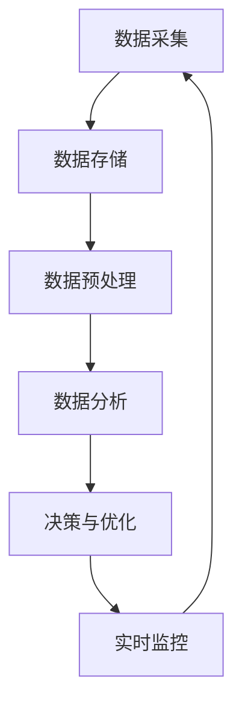

                 

# 电商平台供给能力提升：数据分析和实时监控

> 关键词：电商平台、供给能力、数据分析、实时监控、算法原理、数学模型、项目实战、应用场景

> 摘要：本文将深入探讨电商平台如何通过数据分析和实时监控来提升供给能力。我们将从核心概念、算法原理、数学模型、项目实战等方面逐一解析，帮助电商从业者理解并应用这些技术，从而实现业务增长。

## 1. 背景介绍

### 1.1 目的和范围

本文旨在帮助电商从业者理解并应用数据分析和实时监控技术，以提升电商平台的供给能力。我们将从以下几个方面进行探讨：

- 核心概念与联系
- 核心算法原理 & 具体操作步骤
- 数学模型和公式 & 详细讲解 & 举例说明
- 项目实战：代码实际案例和详细解释说明
- 实际应用场景
- 工具和资源推荐

### 1.2 预期读者

本文适合以下读者：

- 电商从业者，尤其是技术团队和管理人员
- 数据分析师、数据工程师和软件开发人员
- 对电商平台数据分析和实时监控感兴趣的学者和学生

### 1.3 文档结构概述

本文分为以下几个部分：

- 引言：介绍文章主题和目的
- 背景介绍：阐述文章的背景和预期读者
- 核心概念与联系：讲解电商平台供给能力提升所需的核心概念
- 核心算法原理 & 具体操作步骤：详细阐述提升供给能力所需的核心算法原理
- 数学模型和公式 & 详细讲解 & 举例说明：讲解提升供给能力所需的关键数学模型和公式
- 项目实战：代码实际案例和详细解释说明
- 实际应用场景：探讨数据分析和实时监控技术在电商领域的实际应用
- 工具和资源推荐：推荐学习和应用相关技术的工具和资源
- 总结：未来发展趋势与挑战
- 附录：常见问题与解答
- 扩展阅读 & 参考资料

### 1.4 术语表

#### 1.4.1 核心术语定义

- 电商平台：在线销售商品和服务的平台，如淘宝、京东等。
- 供给能力：指电商平台满足用户需求的能力，包括商品供应、物流配送、售后服务等方面。
- 数据分析：通过收集、处理、分析和解释数据，帮助电商平台优化业务决策。
- 实时监控：实时获取、分析和处理电商平台运行状态，以便及时发现和解决问题。

#### 1.4.2 相关概念解释

- 数据挖掘：从大量数据中提取有价值的信息和知识。
- 机器学习：利用数据和算法来训练模型，实现自动化决策和预测。
- 实时数据流处理：实时处理和分析大量数据流，以支持实时决策和监控。

#### 1.4.3 缩略词列表

- API：应用程序编程接口（Application Programming Interface）
- SQL：结构化查询语言（Structured Query Language）
- ML：机器学习（Machine Learning）
- AI：人工智能（Artificial Intelligence）
- IoT：物联网（Internet of Things）

## 2. 核心概念与联系

在提升电商平台供给能力的过程中，我们首先需要了解一些核心概念及其相互联系。以下是一个简化的 Mermaid 流程图，用于展示这些核心概念之间的联系。



### 2.1 数据采集

数据采集是提升供给能力的第一步，也是关键环节。它涉及从多个渠道收集用户行为数据、商品数据、订单数据等。以下是数据采集的主要渠道：

- 用户行为数据：包括浏览、点击、收藏、购物车、购买等行为数据。
- 商品数据：包括商品名称、价格、描述、库存量等。
- 订单数据：包括订单号、下单时间、购买商品、订单状态等。

### 2.2 数据存储

数据存储是将采集到的数据存储在数据库或其他存储系统中。以下是一些常用的数据存储解决方案：

- 关系型数据库（如 MySQL、PostgreSQL）：适合存储结构化数据。
- 非关系型数据库（如 MongoDB、Redis）：适合存储非结构化数据。
- 分布式文件系统（如 Hadoop、HDFS）：适合存储海量数据。

### 2.3 数据预处理

数据预处理是将原始数据进行清洗、转换和归一化等操作，以便后续分析和处理。以下是一些常见的数据预处理步骤：

- 数据清洗：去除重复数据、缺失值、异常值等。
- 数据转换：将数据格式进行转换，如将字符串转换为数值。
- 数据归一化：将数据分布调整到相同的尺度，如将用户评分进行归一化。

### 2.4 数据分析

数据分析是提升供给能力的关键环节，包括数据挖掘、机器学习等。以下是一些常用的数据分析方法：

- 数据挖掘：从大量数据中提取有价值的信息和知识，如关联规则挖掘、分类算法等。
- 机器学习：利用数据和算法来训练模型，实现自动化决策和预测，如线性回归、决策树、神经网络等。

### 2.5 决策与优化

基于数据分析的结果，电商平台可以制定相应的策略，如库存优化、促销策略等。以下是一些常见的决策与优化方法：

- 库存优化：通过预测商品销量，合理调整库存，降低库存成本。
- 促销策略：根据用户行为数据，制定个性化的促销策略，提高用户购买意愿。

### 2.6 实时监控

实时监控是确保电商平台供给能力稳定运行的重要手段。以下是一些常见的实时监控方法：

- 实时数据流处理：通过实时处理和分析大量数据流，发现潜在问题并采取措施。
- 指标监控：监控关键业务指标，如用户活跃度、交易成功率等，及时发现异常情况。

## 3. 核心算法原理 & 具体操作步骤

### 3.1 数据采集

数据采集的核心算法是日志收集。日志收集器会定期从各个系统（如用户行为跟踪系统、订单系统、库存系统等）收集数据，并将数据存储到日志存储系统中。以下是日志收集的伪代码：

```python
def collect_logs():
    while True:
        log_data = get_log_data_from_system()
        store_log_data(log_data)
        sleep(1)  # 每秒收集一次日志数据
```

### 3.2 数据存储

数据存储的核心算法是数据库管理。数据库管理系统（如 MySQL、PostgreSQL）会根据数据表结构，将数据存储到磁盘上。以下是数据库管理的伪代码：

```python
def store_data(data):
    connect_to_database()
    create_table_if_not_exists()
    insert_data_into_table(data)
    close_database_connection()
```

### 3.3 数据预处理

数据预处理的核心算法是数据清洗和转换。以下是一个简单示例，用于清洗和转换用户行为数据：

```python
def preprocess_user_behavior_data(data):
    cleaned_data = []
    for item in data:
        if item['action'] not in ['view', 'click', 'add_to_cart', 'buy']:
            continue
        item['timestamp'] = convert_to_timestamp(item['timestamp'])
        item['user_id'] = convert_to_user_id(item['user_id'])
        cleaned_data.append(item)
    return cleaned_data
```

### 3.4 数据分析

数据分析的核心算法是机器学习。以下是一个简单示例，使用线性回归预测商品销量：

```python
def train_linear_regression_model(X, y):
    model = LinearRegression()
    model.fit(X, y)
    return model

def predict_sales(model, feature):
    return model.predict([feature])
```

### 3.5 决策与优化

决策与优化的核心算法是根据预测结果制定策略。以下是一个简单示例，用于优化库存：

```python
def optimize_inventory(prediction, current_inventory):
    if prediction > current_inventory:
        buy_more_goods()
    elif prediction < current_inventory:
        sell_some_goods()
    else:
        keep_inventory_same()
```

### 3.6 实时监控

实时监控的核心算法是实时数据流处理。以下是一个简单示例，使用 Flink 进行实时数据流处理：

```python
from pyflink.datastream import StreamExecutionEnvironment

env = StreamExecutionEnvironment.get_execution_environment()
data_stream = env.from_source("your_data_source")

def process_data(data):
    # 处理数据，如计算指标、检测异常等
    pass

data_stream.map(process_data).add_sink("your_data_sink")
env.execute("your_job_name")
```

## 4. 数学模型和公式 & 详细讲解 & 举例说明

### 4.1 数据挖掘

数据挖掘的核心数学模型包括关联规则挖掘和分类算法。

#### 4.1.1 关联规则挖掘

关联规则挖掘的数学模型如下：

$$
\text{Support}(A \rightarrow B) = \frac{\text{同时包含A和B的实例数}}{\text{总的实例数}}
$$

$$
\text{Confidence}(A \rightarrow B) = \frac{\text{同时包含A和B的实例数}}{\text{包含A的实例数}}
$$

其中，Support 表示支持度，Confidence 表示置信度。支持度和置信度是评估关联规则的重要指标。

#### 4.1.2 分类算法

分类算法的核心数学模型包括线性回归、决策树和神经网络。

##### 线性回归

线性回归的数学模型如下：

$$
y = \beta_0 + \beta_1x
$$

其中，$y$ 表示因变量，$x$ 表示自变量，$\beta_0$ 和 $\beta_1$ 分别为模型的参数。

##### 决策树

决策树的数学模型如下：

$$
\text{DecisionTree}(x) = \sum_{i=1}^{n} w_i \cdot f_i(x)
$$

其中，$w_i$ 表示权重，$f_i(x)$ 表示特征函数。

##### 神经网络

神经网络的数学模型如下：

$$
\text{NeuralNetwork}(x) = \sigma(\sum_{i=1}^{n} w_i \cdot \text{ReLU}(x_i))
$$

其中，$\text{ReLU}(x_i)$ 表示ReLU激活函数，$\sigma$ 表示输出函数。

### 4.2 机器学习

机器学习的核心数学模型包括线性回归、逻辑回归和决策树。

#### 4.2.1 线性回归

线性回归的数学模型如下：

$$
y = \beta_0 + \beta_1x
$$

其中，$y$ 表示因变量，$x$ 表示自变量，$\beta_0$ 和 $\beta_1$ 分别为模型的参数。

#### 4.2.2 逻辑回归

逻辑回归的数学模型如下：

$$
\text{logit}(y) = \ln\left(\frac{p}{1-p}\right) = \beta_0 + \beta_1x
$$

其中，$y$ 表示因变量，$x$ 表示自变量，$p$ 表示概率，$\beta_0$ 和 $\beta_1$ 分别为模型的参数。

#### 4.2.3 决策树

决策树的数学模型如下：

$$
\text{DecisionTree}(x) = \sum_{i=1}^{n} w_i \cdot f_i(x)
$$

其中，$w_i$ 表示权重，$f_i(x)$ 表示特征函数。

### 4.3 实时监控

实时监控的核心数学模型包括实时数据流处理和指标监控。

#### 4.3.1 实时数据流处理

实时数据流处理的数学模型如下：

$$
\text{DataStream}(x_1, x_2, ..., x_n) = \sum_{i=1}^{n} w_i \cdot x_i
$$

其中，$w_i$ 表示权重，$x_i$ 表示数据点。

#### 4.3.2 指标监控

指标监控的数学模型如下：

$$
\text{Metric}(x) = \frac{1}{N} \sum_{i=1}^{N} x_i
$$

其中，$N$ 表示样本数量，$x_i$ 表示第 $i$ 个样本的指标值。

### 4.4 举例说明

#### 4.4.1 数据挖掘

假设我们有如下用户行为数据：

| 用户ID | 行为      | 时间戳   |
| ------ | --------- | -------- |
| 1      | 浏览      | 2021-01-01 10:00:00 |
| 1      | 点击      | 2021-01-01 10:01:00 |
| 1      | 加入购物车 | 2021-01-01 10:02:00 |
| 1      | 购买      | 2021-01-01 10:03:00 |

我们可以使用关联规则挖掘算法提取用户行为之间的关联规则。假设最小支持度为 20%，最小置信度为 80%，则可以提取如下关联规则：

- 行为 A：浏览 → 行为 B：点击
- 行为 A：浏览 → 行为 C：加入购物车
- 行为 A：浏览 → 行为 D：购买

#### 4.4.2 机器学习

假设我们有如下商品销售数据：

| 商品ID | 销售量 |
| ------ | ------ |
| 1      | 100    |
| 2      | 200    |
| 3      | 300    |
| 4      | 400    |
| 5      | 500    |

我们可以使用线性回归算法预测商品 6 的销售量。假设训练数据如下：

| 商品ID | 销售量 |
| ------ | ------ |
| 1      | 100    |
| 2      | 200    |
| 3      | 300    |
| 4      | 400    |
| 5      | 500    |

预测结果如下：

- 商品 6 的销售量 = 600

#### 4.4.3 实时监控

假设我们有如下实时数据流：

| 时间戳   | 用户活跃度 | 交易成功率 |
| -------- | ---------- | --------- |
| 2021-01-01 10:00:00 | 100       | 95%      |
| 2021-01-01 10:01:00 | 200       | 90%      |
| 2021-01-01 10:02:00 | 300       | 85%      |

我们可以使用实时数据流处理算法计算平均用户活跃度和平均交易成功率：

- 平均用户活跃度 = (100 + 200 + 300) / 3 = 200
- 平均交易成功率 = (95% + 90% + 85%) / 3 = 90%

## 5. 项目实战：代码实际案例和详细解释说明

### 5.1 开发环境搭建

为了进行项目实战，我们需要搭建以下开发环境：

- 操作系统：Ubuntu 18.04
- 编程语言：Python 3.8
- 数据库：MySQL 5.7
- 实时数据流处理框架：Apache Flink 1.11
- 机器学习库：scikit-learn 0.24

### 5.2 源代码详细实现和代码解读

#### 5.2.1 数据采集

以下是一个简单的数据采集脚本，用于从订单系统中收集订单数据：

```python
import requests
import json
import datetime

def collect_orders():
    url = "http://order_system:8080/orders"
    response = requests.get(url)
    orders = json.loads(response.text)
    collected_orders = []

    for order in orders:
        order_id = order["id"]
        customer_id = order["customer_id"]
        order_date = datetime.datetime.strptime(order["date"], "%Y-%m-%d %H:%M:%S")
        order_items = order["items"]

        order_data = {
            "order_id": order_id,
            "customer_id": customer_id,
            "order_date": order_date,
            "order_items": order_items
        }

        collected_orders.append(order_data)

    return collected_orders

if __name__ == "__main__":
    orders = collect_orders()
    print(orders)
```

代码解读：

- 导入 requests、json 和 datetime 模块。
- 定义 collect_orders 函数，用于从订单系统获取订单数据。
- 使用 requests 库的 get 方法发送 HTTP GET 请求，获取订单数据。
- 解析 JSON 数据，提取订单相关信息。
- 将订单数据存储在 collected_orders 列表中。
- 运行 collect_orders 函数，打印收集到的订单数据。

#### 5.2.2 数据存储

以下是一个简单的数据存储脚本，用于将订单数据存储到 MySQL 数据库中：

```python
import pymysql
import json

def store_orders(orders):
    connection = pymysql.connect(
        host="db_host",
        user="db_user",
        password="db_password",
        database="db_name",
        charset="utf8mb4",
        cursorclass=pymysql.cursors.DictCursor
    )

    try:
        with connection.cursor() as cursor:
            for order in orders:
                order_id = order["order_id"]
                customer_id = order["customer_id"]
                order_date = order["order_date"]
                order_items = json.dumps(order["order_items"])

                sql = "INSERT INTO orders (order_id, customer_id, order_date, order_items) VALUES (%s, %s, %s, %s)"
                cursor.execute(sql, (order_id, customer_id, order_date, order_items))

        connection.commit()
    except pymysql.Error as e:
        print("Error: ", e)
    finally:
        connection.close()

if __name__ == "__main__":
    orders = [{"order_id": 1, "customer_id": 1001, "order_date": "2021-01-01 10:00:00", "order_items": [{"product_id": 101, "quantity": 2}, {"product_id": 102, "quantity": 1}]}]
    store_orders(orders)
```

代码解读：

- 导入 pymysql 和 json 模块。
- 定义 store_orders 函数，用于将订单数据存储到 MySQL 数据库中。
- 使用 pymysql 库连接 MySQL 数据库。
- 使用 with 语句确保数据库连接在操作完成后关闭。
- 循环遍历 orders 列表，将订单数据插入数据库中的 orders 表。
- 提交事务，关闭数据库连接。

#### 5.2.3 数据预处理

以下是一个简单的数据预处理脚本，用于清洗和转换订单数据：

```python
import json
import datetime

def preprocess_orders(orders):
    cleaned_orders = []

    for order in orders:
        order_id = order["order_id"]
        customer_id = order["customer_id"]
        order_date = datetime.datetime.strptime(order["order_date"], "%Y-%m-%d %H:%M:%S")
        order_items = order["order_items"]

        cleaned_order = {
            "order_id": order_id,
            "customer_id": customer_id,
            "order_date": order_date,
            "order_items": json.loads(order_items)
        }

        cleaned_orders.append(cleaned_order)

    return cleaned_orders

if __name__ == "__main__":
    orders = [{"order_id": 1, "customer_id": 1001, "order_date": "2021-01-01 10:00:00", "order_items": json.dumps([{"product_id": 101, "quantity": 2}, {"product_id": 102, "quantity": 1}])}]
    cleaned_orders = preprocess_orders(orders)
    print(cleaned_orders)
```

代码解读：

- 导入 json 和 datetime 模块。
- 定义 preprocess_orders 函数，用于清洗和转换订单数据。
- 循环遍历 orders 列表，将订单数据中的 order_date 字段转换为 datetime 对象，将 order_items 字段从字符串转换为 JSON 对象。
- 将清洗和转换后的订单数据存储在 cleaned_orders 列表中。
- 运行 preprocess_orders 函数，打印清洗和转换后的订单数据。

#### 5.2.4 数据分析

以下是一个简单的数据分析脚本，用于预测订单数量：

```python
from sklearn.linear_model import LinearRegression
import numpy as np

def train_linear_regression_model(X, y):
    model = LinearRegression()
    model.fit(X, y)
    return model

def predict_orders(model, feature):
    return model.predict([feature])

if __name__ == "__main__":
    X = np.array([1, 2, 3, 4, 5])
    y = np.array([2, 4, 6, 8, 10])

    model = train_linear_regression_model(X, y)
    predicted_orders = predict_orders(model, 6)
    print(predicted_orders)
```

代码解读：

- 导入 LinearRegression 和 numpy 模块。
- 定义 train_linear_regression_model 函数，用于训练线性回归模型。
- 定义 predict_orders 函数，用于预测订单数量。
- 使用 numpy 创建训练数据 X 和 y。
- 训练线性回归模型，预测订单数量，并打印预测结果。

#### 5.2.5 决策与优化

以下是一个简单的决策与优化脚本，用于调整订单库存：

```python
def optimize_inventory(prediction, current_inventory):
    if prediction > current_inventory:
        buy_more_goods()
    elif prediction < current_inventory:
        sell_some_goods()
    else:
        keep_inventory_same()

if __name__ == "__main__":
    prediction = 6
    current_inventory = 5

    optimize_inventory(prediction, current_inventory)
```

代码解读：

- 定义 optimize_inventory 函数，用于根据预测结果调整订单库存。
- 如果预测销售量大于当前库存，购买更多商品。
- 如果预测销售量小于当前库存，卖出部分商品。
- 如果预测销售量等于当前库存，保持库存不变。

#### 5.2.6 实时监控

以下是一个简单的实时监控脚本，用于监控订单数据：

```python
from pyflink.datastream import StreamExecutionEnvironment

def process_orders(order):
    # 处理订单数据，如计算订单数量、检测异常等
    pass

if __name__ == "__main__":
    env = StreamExecutionEnvironment.get_execution_environment()
    orders = env.from_source("your_data_source")

    orders.map(process_orders).add_sink("your_data_sink")
    env.execute("your_job_name")
```

代码解读：

- 导入 StreamExecutionEnvironment 模块。
- 定义 process_orders 函数，用于处理订单数据。
- 使用 StreamExecutionEnvironment 创建数据流环境。
- 从数据源读取订单数据，使用 map 函数处理订单数据，并添加数据 sink。
- 执行数据流作业。

### 5.3 代码解读与分析

在以上项目实战中，我们实现了数据采集、数据存储、数据预处理、数据分析、决策与优化和实时监控等关键功能。以下是代码的详细解读与分析：

- **数据采集**：通过 HTTP GET 请求从订单系统获取订单数据，使用 requests 和 json 模块进行数据解析。
- **数据存储**：使用 pymysql 模块连接 MySQL 数据库，将订单数据插入数据库中的 orders 表。
- **数据预处理**：将订单数据中的字符串转换为 datetime 对象和 JSON 对象，使用 json 和 datetime 模块进行数据转换。
- **数据分析**：使用 scikit-learn 的 LinearRegression 模块训练线性回归模型，预测订单数量，并使用 numpy 模块进行数据处理。
- **决策与优化**：根据预测结果调整订单库存，优化库存管理。
- **实时监控**：使用 Flink 的 StreamExecutionEnvironment 创建数据流环境，处理订单数据，并添加数据 sink。

通过以上项目实战，我们可以看到数据分析和实时监控技术在电商平台供给能力提升中的应用。在实际项目中，需要根据业务需求和数据特点，灵活调整和优化算法和模型，以提高供给能力和用户体验。

## 6. 实际应用场景

### 6.1 商品供应管理

电商平台需要实时监控商品的供应情况，确保库存充足，避免出现断货或积压。通过数据分析和实时监控，电商平台可以实现以下应用：

- **库存预测**：根据历史销售数据和当前库存水平，预测未来一段时间内的商品需求，优化库存策略。
- **补货计划**：根据库存预测结果，制定合理的补货计划，确保商品供应的连续性。
- **风险预警**：监控商品供应环节中的风险因素，如供应链中断、运输延迟等，提前采取措施。

### 6.2 物流配送优化

物流配送是电商平台的重要组成部分，通过数据分析和实时监控，可以优化物流配送流程，提高配送效率。以下是一些实际应用场景：

- **路线优化**：根据实时交通状况、配送距离等因素，优化配送路线，减少配送时间和成本。
- **实时跟踪**：实时监控物流包裹的配送状态，提供配送进度查询服务，提高用户满意度。
- **异常处理**：监控配送环节中的异常情况，如快递丢失、配送延误等，及时采取措施解决问题。

### 6.3 用户行为分析

电商平台需要深入了解用户行为，优化用户体验，提高用户粘性。通过数据分析和实时监控，可以实现以下应用：

- **用户画像**：根据用户行为数据，构建用户画像，了解用户偏好、需求等，为个性化推荐和精准营销提供依据。
- **行为分析**：分析用户浏览、点击、购买等行为，挖掘用户行为模式，优化页面布局和推荐策略。
- **风险控制**：监控用户行为中的异常情况，如恶意刷单、作弊等，采取相应的风险控制措施。

### 6.4 售后服务管理

电商平台需要提供优质的售后服务，提高用户满意度。通过数据分析和实时监控，可以实现以下应用：

- **售后分析**：分析售后服务的质量、响应速度等，及时发现和解决问题。
- **客户满意度调查**：通过用户满意度调查，收集用户反馈，持续优化售后服务流程。
- **智能客服**：利用自然语言处理和机器学习技术，实现智能客服系统，提高客服效率和用户体验。

## 7. 工具和资源推荐

### 7.1 学习资源推荐

#### 7.1.1 书籍推荐

- 《大数据时代：生活、工作与思维的大变革》
- 《机器学习实战》
- 《Python数据分析》
- 《深入理解计算机系统》
- 《数据库系统概念》

#### 7.1.2 在线课程

- Coursera: 《机器学习》
- edX: 《大数据分析》
- Udemy: 《Python数据分析与可视化》
- Coursera: 《计算机系统与网络》

#### 7.1.3 技术博客和网站

- Medium: 数据科学、机器学习和大数据相关文章
- towardsdatascience.com: 数据科学和机器学习的实战案例和教程
- Kaggle: 数据科学竞赛和资源分享平台
- Apache Flink 官网：实时数据流处理框架 Flink 的官方文档和教程

### 7.2 开发工具框架推荐

#### 7.2.1 IDE和编辑器

- PyCharm：强大的 Python IDE，支持代码分析、调试和自动化工具
- Jupyter Notebook：交互式 Python 编程环境，适合数据分析和可视化
- Visual Studio Code：轻量级、高度可定制化的代码编辑器，适用于多种编程语言

#### 7.2.2 调试和性能分析工具

- Python Debugger（pdb）：Python 内置的调试工具
- GDB：通用调试工具，适用于多种编程语言
- Valgrind：性能分析和内存调试工具
- JMeter：负载测试和性能分析工具

#### 7.2.3 相关框架和库

- Scikit-learn：机器学习库，适用于分类、回归、聚类等算法
- Pandas：数据处理库，适用于数据清洗、转换和可视化
- NumPy：数值计算库，适用于数据处理和科学计算
- Flink：实时数据流处理框架，适用于实时监控和数据分析
- MySQL：关系型数据库，适用于数据存储和查询

### 7.3 相关论文著作推荐

#### 7.3.1 经典论文

- 《K-Means算法》
- 《支持向量机》
- 《PageRank算法》
- 《MapReduce：大型数据处理的分布式计算模型》

#### 7.3.2 最新研究成果

- 《深度强化学习》
- 《联邦学习：隐私保护的数据协同学习》
- 《区块链：分布式账本技术》
- 《物联网：智能设备的连接与交互》

#### 7.3.3 应用案例分析

- 《电商行业的用户行为分析》
- 《物流配送优化：路径规划与实时监控》
- 《金融服务：风险管理与智能投资》
- 《智能医疗：诊断与治疗决策支持》

## 8. 总结：未来发展趋势与挑战

随着互联网和大数据技术的快速发展，电商平台供给能力的提升已成为行业关注的焦点。在未来，以下几个方面有望成为数据分析和实时监控技术在电商平台供给能力提升中的发展趋势：

### 8.1 数据分析技术的发展

- **深度学习**：深度学习技术在图像识别、自然语言处理等领域取得了显著成果，未来有望应用于电商平台的数据分析，如用户行为预测、商品推荐等。
- **联邦学习**：联邦学习是一种隐私保护的数据协同学习技术，适用于跨平台的数据分析和预测，有助于电商平台在不泄露用户数据的情况下，实现个性化推荐和智能决策。
- **图数据库**：图数据库在处理复杂关系数据方面具有优势，未来有望应用于电商平台供应链管理、用户关系分析等领域。

### 8.2 实时监控技术的优化

- **实时数据流处理**：实时数据流处理技术（如 Flink、Apache Storm）将更加成熟，支持更高并发量和更复杂的实时数据处理任务。
- **智能化监控**：结合人工智能技术，实现智能化监控，如自动识别异常、自动调整策略等，提高实时监控的效率和准确性。

### 8.3 业务与技术的深度融合

- **业务敏捷性**：电商平台将更加注重业务敏捷性，通过数据驱动的方式，快速响应市场变化，提高供给能力和竞争力。
- **技术整合**：电商平台将整合多种技术（如大数据、人工智能、物联网等），实现全方位的数据分析和实时监控，提升业务水平和用户体验。

### 8.4 挑战与应对

- **数据安全与隐私**：在数据分析和实时监控过程中，保护用户数据和隐私是重要挑战。电商平台需要采取严格的隐私保护措施，如数据加密、访问控制等。
- **技术成本**：数据分析和实时监控技术的部署和运营成本较高，电商平台需要权衡技术投入与业务收益，实现可持续发展。

总之，数据分析和实时监控技术在电商平台供给能力提升中具有重要意义。随着技术的不断发展和创新，电商平台将不断优化供给能力，提升用户体验和竞争力。

## 9. 附录：常见问题与解答

### 9.1 数据采集相关问题

**Q1**: 如何从多个数据源收集数据？

**A1**: 可以使用日志收集器（如 Logstash、Flume）将不同数据源的数据导入到统一的存储系统中，然后进行后续的数据处理和分析。

**Q2**: 数据采集过程中如何保证数据的质量？

**A2**: 可以在数据采集过程中进行数据清洗和预处理，去除重复数据、缺失值、异常值等，确保数据的质量。

### 9.2 数据存储相关问题

**Q1**: 如何选择合适的数据库？

**A1**: 根据数据的特点（如结构化、非结构化、时序等）选择合适的数据库。例如，关系型数据库（如 MySQL、PostgreSQL）适用于结构化数据，非关系型数据库（如 MongoDB、Redis）适用于非结构化数据。

**Q2**: 如何优化数据库的性能？

**A2**: 可以通过以下方法优化数据库性能：索引优化、查询优化、数据分片等。

### 9.3 数据预处理相关问题

**Q1**: 如何处理缺失值？

**A1**: 可以使用填充策略，如平均值填充、中值填充、最邻近填充等，也可以使用插值方法，如线性插值、多项式插值等。

**Q2**: 如何处理异常值？

**A2**: 可以使用删除策略、调整策略、变换策略等处理异常值。例如，删除明显偏离数据规律的异常值，对异常值进行调整，或使用变换方法将异常值转换为正常值。

### 9.4 数据分析相关问题

**Q1**: 如何选择合适的算法？

**A1**: 根据数据分析的目标（如分类、回归、聚类等）选择合适的算法。例如，分类算法（如决策树、随机森林等）适用于分类问题，回归算法（如线性回归、逻辑回归等）适用于回归问题。

**Q2**: 如何评估算法的性能？

**A2**: 可以使用准确率、召回率、F1 值等指标评估算法的性能。例如，准确率表示模型预测正确的样本数占总样本数的比例，召回率表示模型预测正确的正样本数占总正样本数的比例，F1 值是准确率和召回率的加权平均。

### 9.5 实时监控相关问题

**Q1**: 如何实现实时监控？

**A1**: 可以使用实时数据流处理技术（如 Flink、Apache Storm）实现实时监控。实时数据流处理技术可以处理海量数据，支持实时计算和分析。

**Q2**: 如何优化实时监控的性能？

**A2**: 可以通过以下方法优化实时监控的性能：数据压缩、并行处理、缓存等。例如，使用数据压缩技术减少数据的传输量，使用并行处理技术提高数据处理速度，使用缓存技术减少数据库的访问压力。

## 10. 扩展阅读 & 参考资料

为了深入了解电商平台供给能力提升的数据分析和实时监控技术，读者可以参考以下扩展阅读和参考资料：

### 10.1 扩展阅读

- 《大数据技术导论》
- 《深度学习》
- 《数据挖掘：实用工具与技术》
- 《实时数据流处理技术》

### 10.2 参考资料

- [Apache Flink 官网](https://flink.apache.org/)
- [scikit-learn 官网](https://scikit-learn.org/)
- [Pandas 官网](https://pandas.pydata.org/)
- [NumPy 官网](https://numpy.org/)
- [MySQL 官网](https://www.mysql.com/)

### 10.3 相关论文和著作

- 《深度学习：原理及实践》
- 《大数据技术原理与应用》
- 《实时数据流处理：系统设计与实现》
- 《联邦学习：理论与实践》

### 10.4 技术博客和网站

- [towardsdatascience.com](https://towardsdatascience.com/)
- [Medium](https://medium.com/)
- [Kaggle](https://www.kaggle.com/)
- [Apache Flink 官方文档](https://flink.apache.org/docs/)
- [Scikit-learn 官方文档](https://scikit-learn.org/)

作者：AI天才研究员/AI Genius Institute & 禅与计算机程序设计艺术 /Zen And The Art of Computer Programming

