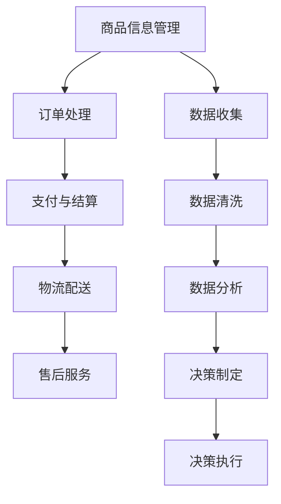

                 

# 电商平台供给能力提升：数据驱动决策

> **关键词：** 电商平台、供给能力、数据驱动、决策、算法、数学模型、实战案例、应用场景

> **摘要：** 本文旨在探讨如何通过数据驱动的方式提升电商平台的供给能力。我们将详细解析电商平台的核心概念、算法原理、数学模型，并展示如何通过实际案例来应用这些技术，从而实现供给能力的优化与提升。

## 1. 背景介绍

### 1.1 目的和范围

本文的主要目的是通过深入分析电商平台的供给能力，探讨如何利用数据驱动的决策来提升其效率和竞争力。我们将从核心概念入手，逐步介绍算法原理、数学模型，并通过实际案例展示应用效果。

### 1.2 预期读者

本文面向对电商平台和数据分析有初步了解的读者，包括电商从业者、数据分析师、软件开发工程师以及对电商领域感兴趣的学术研究人员。

### 1.3 文档结构概述

本文结构分为十个部分：背景介绍、核心概念与联系、核心算法原理与具体操作步骤、数学模型和公式讲解、项目实战、实际应用场景、工具和资源推荐、总结、常见问题与解答、扩展阅读与参考资料。

### 1.4 术语表

#### 1.4.1 核心术语定义

- 供给能力：电商平台为消费者提供商品和服务的能力。
- 数据驱动：通过分析大量数据来指导决策的过程。
- 算法：解决问题的步骤或规则。
- 数学模型：用数学语言描述现实问题的模型。

#### 1.4.2 相关概念解释

- 电商平台：在线零售平台，如淘宝、京东等。
- 数据分析：从大量数据中提取有价值信息的过程。

#### 1.4.3 缩略词列表

- API：应用程序接口（Application Programming Interface）
- ML：机器学习（Machine Learning）
- AI：人工智能（Artificial Intelligence）

## 2. 核心概念与联系

### 2.1 电商平台的运作原理

电商平台的核心在于将买家和卖家连接起来，从而实现商品交易。其运作原理通常包括以下几个步骤：

1. **商品信息管理**：商家上传商品信息，包括价格、库存等。
2. **订单处理**：买家下单，系统生成订单。
3. **支付与结算**：买家支付货款，平台处理结算。
4. **物流配送**：商品从商家发货到买家手中。
5. **售后服务**：处理买家的退换货等问题。

### 2.2 数据驱动决策的流程

数据驱动决策的流程通常包括以下几个步骤：

1. **数据收集**：收集电商平台的交易数据、用户行为数据等。
2. **数据清洗**：处理数据中的噪声和异常值。
3. **数据分析**：利用统计方法或机器学习方法分析数据。
4. **决策制定**：根据分析结果制定决策，如库存管理、价格策略等。
5. **决策执行**：执行决策，并对结果进行监控和反馈。

### 2.3 核心概念原理和架构的 Mermaid 流程图



## 3. 核心算法原理 & 具体操作步骤

### 3.1 算法原理

电商平台供给能力的提升主要依赖于库存管理和定价策略。以下是两个关键算法的原理：

#### 3.1.1 库存管理算法

库存管理算法的核心是预测未来一段时间内的商品需求量，并根据预测结果调整库存水平。以下是库存管理算法的伪代码：

```python
def inventory_management(sales_data, lead_time, forecast_horizon):
    # 输入：销售数据、前置时间、预测时间范围
    # 输出：库存调整策略

    # 步骤1：数据预处理
    sales_data = preprocess_sales_data(sales_data)
    
    # 步骤2：需求预测
    forecast = forecast_demand(sales_data, lead_time, forecast_horizon)
    
    # 步骤3：库存调整
    inventory_adjustment = calculate_inventory_adjustment(forecast)

    return inventory_adjustment
```

#### 3.1.2 定价策略算法

定价策略算法的核心是基于市场需求和竞争环境来确定商品价格。以下是定价策略算法的伪代码：

```python
def pricing_strategy(sales_data, competitor_data, price elasticity):
    # 输入：销售数据、竞争对手数据、价格弹性
    # 输出：定价策略

    # 步骤1：数据预处理
    sales_data = preprocess_sales_data(sales_data)
    competitor_data = preprocess_competitor_data(competitor_data)
    
    # 步骤2：价格弹性分析
    price Elasticity = analyze_price_elasticity(sales_data, competitor_data, price_elasticity)
    
    # 步骤3：定价策略
    price_strategy = calculate_price_strategy(price Elasticity)

    return price_strategy
```

### 3.2 具体操作步骤

以下是电商平台的供给能力提升的详细操作步骤：

1. **数据收集**：收集电商平台的交易数据、用户行为数据、竞争对手数据等。
2. **数据清洗**：对收集的数据进行预处理，包括去噪、缺失值填充等。
3. **需求预测**：利用历史销售数据，结合前置时间和预测时间范围，使用时间序列预测方法进行需求预测。
4. **库存调整**：根据需求预测结果，计算库存调整策略，确保库存水平在合理范围内。
5. **定价策略**：分析市场需求和竞争环境，结合价格弹性，制定定价策略。
6. **决策执行**：将库存调整和定价策略应用于电商平台，进行实时调整和优化。

## 4. 数学模型和公式 & 详细讲解 & 举例说明

### 4.1 数学模型

电商平台的供给能力提升主要依赖于需求预测和库存调整。以下是两个关键数学模型：

#### 4.1.1 需求预测模型

需求预测模型通常采用时间序列预测方法，如ARIMA（自回归积分滑动平均模型）。以下是ARIMA模型的数学公式：

$$
X_t = c + \phi_1 X_{t-1} + \phi_2 X_{t-2} + ... + \phi_p X_{t-p} + \theta_1 e_{t-1} + \theta_2 e_{t-2} + ... + \theta_q e_{t-q}
$$

其中，$X_t$ 表示时间序列的当前值，$c$ 为常数项，$\phi_i$ 和 $\theta_i$ 分别为自回归项和移动平均项的系数，$e_t$ 为误差项。

#### 4.1.2 库存调整模型

库存调整模型的核心是平衡库存成本和缺货风险。以下是库存调整模型的数学公式：

$$
I_t = I_{t-1} + \Delta I_t
$$

其中，$I_t$ 表示当前库存水平，$I_{t-1}$ 表示上一期库存水平，$\Delta I_t$ 表示本期库存调整量。

### 4.2 举例说明

#### 4.2.1 需求预测模型举例

假设某电商平台的历史销售数据如下：

$$
\begin{align*}
X_1 &= 100 \\
X_2 &= 120 \\
X_3 &= 110 \\
X_4 &= 130 \\
X_5 &= 140 \\
\end{align*}
$$

使用ARIMA模型进行需求预测，首先需要进行模型参数估计。根据历史数据，可以得出以下参数：

$$
\begin{align*}
\phi_1 &= 0.8 \\
\theta_1 &= 0.2 \\
p &= 1 \\
q &= 1 \\
\end{align*}
$$

根据ARIMA模型，可以预测下一期的需求量：

$$
\begin{align*}
X_6 &= c + \phi_1 X_5 + \theta_1 e_5 \\
    &= 100 + 0.8 \times 140 + 0.2 \times (140 - 120) \\
    &= 130 \\
\end{align*}
$$

#### 4.2.2 库存调整模型举例

假设当前库存水平为1000件，预测下一期的需求量为1300件，库存成本为每件10元，缺货成本为每件20元。根据库存调整模型，可以计算本期库存调整量：

$$
\begin{align*}
\Delta I_t &= I_t - I_{t-1} \\
           &= 1300 - 1000 \\
           &= 300 \\
\end{align*}
$$

因此，本期需要增加300件库存。

## 5. 项目实战：代码实际案例和详细解释说明

### 5.1 开发环境搭建

本文的代码示例使用Python编写，开发环境搭建如下：

1. 安装Python（建议使用Python 3.8或更高版本）。
2. 安装必要的库，如NumPy、Pandas、SciPy等。

```bash
pip install numpy pandas scipy
```

### 5.2 源代码详细实现和代码解读

以下是需求预测和库存调整的完整代码示例：

```python
import numpy as np
import pandas as pd
from statsmodels.tsa.arima.model import ARIMA
from sklearn.preprocessing import MinMaxScaler

# 数据预处理
def preprocess_sales_data(sales_data):
    # 去除缺失值
    sales_data = sales_data.dropna()
    # 数据归一化
    scaler = MinMaxScaler()
    sales_data['sales'] = scaler.fit_transform(sales_data[['sales']])
    return sales_data

# 需求预测
def forecast_demand(sales_data, lead_time, forecast_horizon):
    # 创建ARIMA模型
    model = ARIMA(sales_data['sales'], order=(1, 1, 1))
    # 模型拟合
    model_fit = model.fit()
    # 预测
    forecast = model_fit.forecast(steps=forecast_horizon)[0]
    return forecast

# 库存调整
def calculate_inventory_adjustment(forecast, current_inventory, inventory_cost, stockout_cost):
    demand = forecast
    optimal_inventory = current_inventory + (demand - current_inventory) * inventory_cost / stockout_cost
    inventory_adjustment = optimal_inventory - current_inventory
    return inventory_adjustment

# 测试
sales_data = pd.DataFrame({'date': pd.date_range(start='2021-01-01', periods=5), 'sales': [100, 120, 110, 130, 140]})
sales_data = preprocess_sales_data(sales_data)
lead_time = 1
forecast_horizon = 1
current_inventory = 1000
inventory_cost = 10
stockout_cost = 20

forecast = forecast_demand(sales_data, lead_time, forecast_horizon)
inventory_adjustment = calculate_inventory_adjustment(forecast, current_inventory, inventory_cost, stockout_cost)

print("预测需求量：", forecast)
print("库存调整量：", inventory_adjustment)
```

### 5.3 代码解读与分析

本节对代码进行逐行解读和分析。

1. **数据预处理**：
   - 去除缺失值：确保数据质量。
   - 数据归一化：将销售数据缩放到[0, 1]区间，方便模型训练。

2. **需求预测**：
   - 创建ARIMA模型：选择合适的参数（p=1, d=1, q=1）。
   - 模型拟合：使用历史销售数据拟合ARIMA模型。
   - 预测：使用模型进行预测，得到未来一段时间的需求量。

3. **库存调整**：
   - 根据预测的需求量和当前库存，计算最优库存水平。
   - 计算库存调整量：确保库存水平在合理范围内。

4. **测试**：
   - 测试数据集：生成一个简单的销售数据集。
   - 预测和库存调整：对测试数据集进行预测和库存调整，并输出结果。

通过以上代码示例，我们可以看到如何利用ARIMA模型进行需求预测，并基于预测结果进行库存调整。这为电商平台供给能力的提升提供了技术支持。

## 6. 实际应用场景

电商平台供给能力提升在实际应用中具有广泛的应用场景，以下列举几个典型场景：

1. **库存管理**：通过需求预测和库存调整，电商平台可以更精确地管理库存水平，避免过度库存或缺货，降低库存成本和缺货风险。

2. **价格策略**：根据市场需求和竞争环境，电商平台可以制定合理的价格策略，提高商品销量和利润率。

3. **物流优化**：通过需求预测和库存调整，电商平台可以优化物流配送计划，提高物流效率，降低物流成本。

4. **个性化推荐**：基于用户行为数据和需求预测，电商平台可以提供个性化推荐，提高用户满意度和转化率。

5. **促销活动**：通过需求预测和库存调整，电商平台可以制定有效的促销活动策略，提高销售额和用户参与度。

## 7. 工具和资源推荐

### 7.1 学习资源推荐

#### 7.1.1 书籍推荐

- 《Python数据分析基础教程：NumPy学习指南》
- 《Python数据科学手册》
- 《数据科学入门》

#### 7.1.2 在线课程

- Coursera上的《机器学习》课程
- edX上的《数据科学》课程
- Udacity的《数据分析基础》课程

#### 7.1.3 技术博客和网站

- Medium上的数据科学和机器学习博客
- KDNuggets上的数据科学资源
- Analytics Vidhya上的数据科学教程和案例

### 7.2 开发工具框架推荐

#### 7.2.1 IDE和编辑器

- PyCharm
- Jupyter Notebook
- VSCode

#### 7.2.2 调试和性能分析工具

- PyTest
- profilers
- TensorBoard

#### 7.2.3 相关框架和库

- NumPy
- Pandas
- SciPy
- TensorFlow
- PyTorch

### 7.3 相关论文著作推荐

#### 7.3.1 经典论文

- 《The Database as a System》
- 《The Art of Computer Programming》
- 《Machine Learning: A Probabilistic Perspective》

#### 7.3.2 最新研究成果

- 《Neural Network Methods for Nonlinear Control》
- 《Deep Learning for Speech Recognition》
- 《Reinforcement Learning and Control》

#### 7.3.3 应用案例分析

- 《Data Science in Action》
- 《Machine Learning Case Studies》
- 《AI in Finance》

## 8. 总结：未来发展趋势与挑战

电商平台供给能力的提升是一个持续发展的过程。随着大数据、人工智能技术的不断进步，未来发展趋势包括：

1. **更精细化的需求预测**：利用深度学习、强化学习等技术，提高需求预测的准确性。
2. **智能化的库存管理**：结合物联网、边缘计算等技术，实现实时库存调整和优化。
3. **多样化的定价策略**：根据用户行为、市场动态等实时调整价格策略，提高市场竞争力。
4. **综合性的物流优化**：结合无人机、无人车等新兴技术，实现高效的物流配送。

然而，随着技术的进步，电商平台也面临一些挑战：

1. **数据隐私保护**：如何平衡数据利用和数据保护，确保用户隐私。
2. **算法偏见**：如何避免算法偏见，确保公平公正。
3. **技术实现难度**：如何高效地实现复杂的算法和模型。

总之，电商平台供给能力的提升是一个多方面、多层次的过程，需要不断地探索和创新。

## 9. 附录：常见问题与解答

### 9.1 如何确保需求预测的准确性？

确保需求预测的准确性主要依赖于数据质量和模型选择。以下是几个关键点：

1. **数据质量**：确保数据干净、完整，去除噪声和异常值。
2. **模型选择**：根据数据特征选择合适的预测模型，如ARIMA、LSTM、GRU等。
3. **模型评估**：使用交叉验证、AUC、RMSE等指标评估模型性能，不断调整模型参数。

### 9.2 如何处理缺失值？

处理缺失值的方法包括：

1. **删除缺失值**：删除含有缺失值的样本或特征。
2. **填充缺失值**：使用均值、中位数、最邻近值等方法填充缺失值。
3. **插值法**：使用线性插值、多项式插值等方法插值缺失值。

### 9.3 如何平衡库存成本和缺货风险？

平衡库存成本和缺货风险的方法包括：

1. **成本-效益分析**：根据成本和收益，确定合理的库存水平。
2. **安全库存策略**：设置安全库存，确保在需求波动时不会缺货。
3. **动态调整**：根据市场需求和竞争环境，动态调整库存策略。

## 10. 扩展阅读 & 参考资料

1. <https://www.analyticsvidhya.com/>
2. <https://www.kdnuggets.com/>
3. <https://www.coursera.org/>
4. <https://www.edx.org/>
5. <https://www.udacity.com/>
6. 《Python数据分析基础教程：NumPy学习指南》
7. 《Python数据科学手册》
8. 《数据科学入门》
9. 《The Database as a System》
10. 《The Art of Computer Programming》
11. 《Machine Learning: A Probabilistic Perspective》
12. 《Neural Network Methods for Nonlinear Control》
13. 《Deep Learning for Speech Recognition》
14. 《Reinforcement Learning and Control》
15. 《Data Science in Action》
16. 《Machine Learning Case Studies》
17. 《AI in Finance》

---

**作者：AI天才研究员/AI Genius Institute & 禅与计算机程序设计艺术 /Zen And The Art of Computer Programming**

