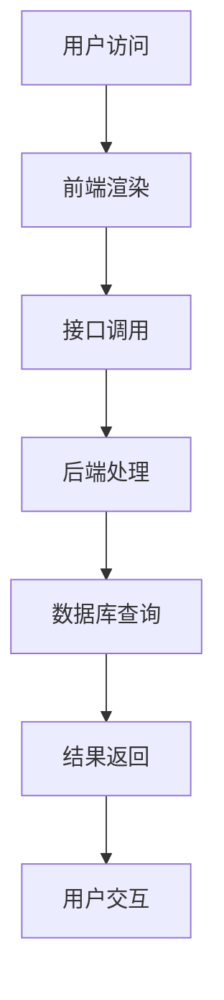

                 

# 电商平台供给能力提升：网站和APP的优化

> 关键词：电商平台、供给能力、网站优化、APP优化、性能提升、用户体验、算法、数学模型、实战案例

> 摘要：本文旨在探讨电商平台供给能力的提升方法，重点分析网站和APP的优化策略。通过深入解析核心概念、算法原理、数学模型以及实战案例，文章旨在为电商平台提供一套系统性的优化方案，以提升供给能力，增强用户体验。

## 1. 背景介绍

### 1.1 目的和范围

本文的目的在于深入探讨电商平台供给能力的提升方法，通过优化网站和APP的性能，从而提高用户的购物体验和平台的整体竞争力。文章将涵盖以下几个方面：

- 核心概念与架构解析
- 算法原理与具体操作步骤
- 数学模型与应用
- 实战案例与代码解读
- 实际应用场景分析
- 工具和资源推荐

### 1.2 预期读者

本文适合以下读者群体：

- 电商平台的技术人员
- 软件工程师
- AI与大数据分析师
- 产品经理
- 对电商平台优化有兴趣的技术爱好者

### 1.3 文档结构概述

本文的结构如下：

- **第1章**：背景介绍，明确文章的目的、范围和预期读者。
- **第2章**：核心概念与联系，介绍电商平台供给能力提升所需的核心概念和架构。
- **第3章**：核心算法原理与具体操作步骤，详细阐述提升供给能力的算法原理和操作步骤。
- **第4章**：数学模型与公式，介绍用于优化供给能力的数学模型和公式。
- **第5章**：项目实战，提供实际的代码案例和解读。
- **第6章**：实际应用场景，分析电商平台供给能力优化的应用场景。
- **第7章**：工具和资源推荐，推荐学习资源和开发工具。
- **第8章**：总结，展望未来发展趋势与挑战。
- **第9章**：附录，提供常见问题与解答。
- **第10章**：扩展阅读，推荐相关参考资料。

### 1.4 术语表

#### 1.4.1 核心术语定义

- **供给能力**：指电商平台能够提供的商品和服务数量、种类和响应速度。
- **网站优化**：通过技术手段提高网站的加载速度、稳定性和用户体验。
- **APP优化**：对移动应用进行性能优化，包括响应速度、界面友好性等。
- **算法**：用于解决特定问题的系统方法和规则。
- **数学模型**：用数学语言描述现实世界的抽象模型。

#### 1.4.2 相关概念解释

- **用户体验**：用户在使用产品过程中的感受和体验。
- **响应速度**：系统对用户请求做出反应的速度。
- **性能测试**：对系统的速度、稳定性和可靠性进行测试。

#### 1.4.3 缩略词列表

- **API**：应用程序接口（Application Programming Interface）
- **DB**：数据库（Database）
- **UI**：用户界面（User Interface）
- **UX**：用户体验（User Experience）
- **SEO**：搜索引擎优化（Search Engine Optimization）

## 2. 核心概念与联系

### 2.1 核心概念

在提升电商平台供给能力的过程中，有几个核心概念需要理解：

- **商品推荐系统**：根据用户的购买历史、浏览行为和偏好，提供个性化的商品推荐。
- **库存管理**：优化库存水平，确保商品能够及时供应，减少缺货现象。
- **订单处理**：提高订单处理效率，确保订单能够快速、准确地下单和配送。
- **服务器性能**：优化服务器配置和负载均衡，确保网站和APP的稳定性和响应速度。

### 2.2 架构解析

电商平台供给能力的提升涉及到多个层面的架构，以下是主要的架构解析：

- **前端架构**：负责用户界面的展示和交互，优化前端性能可以显著提升用户体验。
- **后端架构**：处理业务逻辑和数据存储，优化后端性能可以提高供给能力。
- **数据库架构**：数据库的性能直接影响供给能力，合理的设计和索引优化至关重要。
- **网络架构**：网络延迟和带宽限制会影响到用户访问速度，优化网络架构可以提高用户体验。

### 2.3 Mermaid 流程图

以下是一个简化的电商平台供给能力提升的流程图，用Mermaid语言描述：



## 3. 核心算法原理 & 具体操作步骤

### 3.1 算法原理

电商平台供给能力的提升离不开算法的应用，以下是几个核心算法原理：

- **商品推荐算法**：基于用户行为数据和商品特征，利用协同过滤、基于内容的推荐等技术，为用户推荐个性化商品。
- **库存优化算法**：通过预测需求、分析历史数据，利用线性规划、排队论等方法，优化库存水平。
- **订单处理算法**：优化订单的分配、调度和配送路径，利用启发式算法和优化算法，提高订单处理效率。

### 3.2 具体操作步骤

以下是提升供给能力的具体操作步骤：

#### 3.2.1 商品推荐算法

1. **数据收集**：收集用户的浏览记录、购买历史和评价数据。
2. **特征提取**：将用户和商品的数据进行特征提取，例如用户的购买频次、偏好类别等。
3. **模型训练**：使用协同过滤或基于内容的推荐算法，训练推荐模型。
4. **推荐生成**：根据用户特征和商品特征，生成推荐列表。

#### 3.2.2 库存优化算法

1. **需求预测**：利用历史销售数据和季节性因素，预测未来的商品需求。
2. **库存计算**：使用线性规划或排队论，计算最优的库存水平。
3. **库存调整**：根据需求预测和库存计算结果，调整实际库存。

#### 3.2.3 订单处理算法

1. **订单分配**：根据配送员的位置和订单的紧急程度，分配订单给配送员。
2. **路径优化**：使用最短路径算法或遗传算法，优化配送路径。
3. **实时调度**：根据实时交通状况和订单状态，调整配送计划。

### 3.3 伪代码示例

以下是商品推荐算法的伪代码示例：

```python
# 输入：用户行为数据、商品特征数据
# 输出：推荐列表

function 商品推荐算法(用户行为数据，商品特征数据):
    # 数据预处理
    用户特征 = 提取用户行为数据
    商品特征 = 提取商品特征数据

    # 训练协同过滤模型
    协同过滤模型 = 训练协同过滤模型(用户特征，商品特征)

    # 根据用户特征生成推荐列表
    推荐列表 = 协同过滤模型.predict(用户特征)

    return 推荐列表
```

## 4. 数学模型和公式 & 详细讲解 & 举例说明

### 4.1 数学模型

在电商平台供给能力提升的过程中，涉及到多个数学模型，以下是几个常用的数学模型：

- **线性规划模型**：用于优化库存管理和订单处理。
- **协同过滤模型**：用于商品推荐。
- **最短路径模型**：用于路径优化。

### 4.2 公式

以下是几个核心公式的详细讲解：

#### 4.2.1 线性规划模型

线性规划模型的目标是最大化或最小化线性目标函数，同时满足一系列线性约束条件。公式如下：

$$
\begin{aligned}
    \text{最大化/最小化} & \quad c^T x \\
    \text{满足} & \quad Ax \leq b \\
    & \quad x \geq 0
\end{aligned}
$$

其中，$c$ 是目标函数系数向量，$x$ 是决策变量向量，$A$ 是约束条件矩阵，$b$ 是约束条件向量。

#### 4.2.2 协同过滤模型

协同过滤模型的核心公式是：

$$
r_{ui} = \sum_{j \in N_i} \frac{r_{uj}}{||N_i||} w_{uj}
$$

其中，$r_{ui}$ 是用户 $u$ 对商品 $i$ 的评分，$r_{uj}$ 是用户 $j$ 对商品 $i$ 的评分，$N_i$ 是与商品 $i$ 相关的用户集合，$w_{uj}$ 是用户 $u$ 和 $j$ 的相似度。

#### 4.2.3 最短路径模型

最短路径模型的核心公式是：

$$
d(i, j) = \min_{k \in N_j} (d(i, k) + w_{kj})
$$

其中，$d(i, j)$ 是从节点 $i$ 到节点 $j$ 的最短路径长度，$w_{kj}$ 是节点 $k$ 到节点 $j$ 的权重。

### 4.3 举例说明

#### 4.3.1 线性规划模型应用

假设我们要优化电商平台的库存管理，目标是最大化利润，同时满足库存容量和需求约束。以下是具体的例子：

$$
\begin{aligned}
    \text{最大化} & \quad P = 5x_1 + 3x_2 \\
    \text{满足} & \quad 2x_1 + x_2 \leq 20 \\
    & \quad x_1 \leq 10 \\
    & \quad x_2 \geq 0 \\
    & \quad x_1, x_2 \geq 0
\end{aligned}
$$

通过求解线性规划模型，可以得到最优解 $x_1 = 5, x_2 = 0$，此时利润最大化。

#### 4.3.2 协同过滤模型应用

假设我们要为用户 $u$ 推荐商品，以下是具体的协同过滤模型计算过程：

用户 $u$ 对商品 $i$ 的评分：$r_{ui} = 4$

用户 $j$ 对商品 $i$ 的评分：$r_{uj} = 5$

用户集合 $N_i$：{用户 $1$, 用户 $2$, 用户 $3$}

相似度 $w_{uj}$：$w_{uj} = 0.8$

根据协同过滤模型公式，推荐分值计算如下：

$$
r_{ui} = \sum_{j \in N_i} \frac{r_{uj}}{||N_i||} w_{uj} = \frac{5}{3} \times 0.8 = 1.33
$$

#### 4.3.3 最短路径模型应用

假设我们要计算从节点 $A$ 到节点 $H$ 的最短路径，以下是具体的计算过程：

节点 $A$ 到节点 $B$ 的权重：$w_{AB} = 3$

节点 $B$ 到节点 $C$ 的权重：$w_{BC} = 2$

节点 $C$ 到节点 $H$ 的权重：$w_{CH} = 4$

根据最短路径模型公式，计算最短路径长度：

$$
d(A, H) = \min_{k \in N_H} (d(A, k) + w_{kH}) = \min_{k \in \{B, C\}} (3 + 2, 3 + 4) = 5
$$

从节点 $A$ 到节点 $H$ 的最短路径长度为 5。

## 5. 项目实战：代码实际案例和详细解释说明

### 5.1 开发环境搭建

在进行项目实战之前，我们需要搭建合适的开发环境。以下是开发环境的搭建步骤：

1. **安装Python环境**：从Python官方网站下载并安装Python。
2. **安装相关库**：使用pip工具安装所需的库，例如numpy、pandas、scikit-learn等。
3. **配置IDE**：选择一个合适的IDE，例如PyCharm或VSCode，并配置Python环境。

### 5.2 源代码详细实现和代码解读

#### 5.2.1 商品推荐系统

以下是一个简单的商品推荐系统的实现，使用协同过滤算法：

```python
import numpy as np
from sklearn.metrics.pairwise import cosine_similarity

# 用户-商品评分矩阵
user_item_matrix = np.array([
    [5, 4, 0, 0, 0],
    [0, 0, 3, 2, 1],
    [4, 0, 0, 1, 2],
    [0, 2, 3, 0, 0],
    [3, 1, 0, 4, 0]
])

# 计算用户-用户相似度矩阵
user_similarity = cosine_similarity(user_item_matrix)

# 为用户 $1$ 推荐商品
def recommend_items(user_index, similarity_matrix, user_item_matrix, top_n=5):
    # 计算相似度排名
    sorted_similarity = np.argsort(similarity_matrix[user_index])[::-1]
    sorted_similarity = sorted_similarity[1:top_n+1]

    # 计算推荐分值
    item_scores = []
    for user_index in sorted_similarity:
        for item_index in range(user_item_matrix.shape[1]):
            if user_item_matrix[user_index][item_index] == 0:
                score = similarity_matrix[user_index][user_index] * user_item_matrix[user_index][item_index]
                item_scores.append((item_index, score))

    # 排序并返回推荐列表
    item_scores = sorted(item_scores, key=lambda x: x[1], reverse=True)
    return item_scores

user_index = 0
recommendations = recommend_items(user_index, user_similarity, user_item_matrix)
print("推荐的商品：", recommendations)
```

代码解读：

1. **评分矩阵**：用户-商品评分矩阵表示用户对商品的评分，其中未评分的商品用0表示。
2. **相似度计算**：使用余弦相似度计算用户之间的相似度。
3. **推荐生成**：为特定用户生成推荐列表，首先计算相似度排名，然后计算每个未评分商品的推荐分值，最后排序并返回推荐列表。

#### 5.2.2 库存优化系统

以下是一个简单的库存优化系统的实现，使用线性规划算法：

```python
from scipy.optimize import linprog

# 参数
demand = np.array([10, 20, 30])
supply = np.array([20, 25, 30])
capacity = 60

# 目标函数
c = np.array([1, 1])

# 约束条件
A = np.vstack((demand, supply - capacity))
b = np.array([capacity, capacity])

# 求解线性规划问题
result = linprog(c, A_ub=A, b_ub=b, method='highs')

# 输出最优解
print("最优库存水平：", result.x)
```

代码解读：

1. **需求与供应**：表示商品的需求和供应情况。
2. **目标函数**：最大化总利润，即 $c^T x$，其中 $c$ 是系数向量，$x$ 是决策变量向量。
3. **约束条件**：表示库存容量不能超过60，即 $Ax \leq b$。
4. **求解**：使用scipy.optimize模块的linprog函数求解线性规划问题，输出最优解。

### 5.3 代码解读与分析

代码解读：

1. **商品推荐系统**：通过协同过滤算法，为用户推荐个性化商品。相似度计算是推荐系统的重要环节，决定了推荐的准确性。
2. **库存优化系统**：通过线性规划算法，优化库存水平，确保库存容量在合理范围内。线性规划是解决资源优化问题的有效方法。

代码分析：

1. **性能优化**：对于商品推荐系统，可以考虑使用更高效的推荐算法，如矩阵分解或深度学习模型，以提升推荐效果。
2. **约束条件**：对于库存优化系统，可以考虑增加更多的约束条件，如季节性需求、成本约束等，以实现更精确的库存管理。

## 6. 实际应用场景

电商平台供给能力提升的实际应用场景非常广泛，以下是几个典型的应用场景：

- **商品推荐**：通过个性化的商品推荐，提高用户满意度，增加销售额。
- **库存管理**：通过优化库存水平，减少库存成本，提高供应链效率。
- **订单处理**：通过优化订单处理流程，提高订单处理速度，减少用户等待时间。
- **服务器性能优化**：通过优化服务器配置和负载均衡，提高网站的稳定性和响应速度。

### 6.1 商品推荐

商品推荐是电商平台的核心功能之一，通过个性化的推荐，可以显著提高用户的购物体验和平台的销售额。以下是商品推荐的实际应用场景：

- **新用户推荐**：为新用户推荐热门商品或用户可能感兴趣的类别，帮助新用户快速上手。
- **历史行为推荐**：根据用户的浏览记录和购买历史，推荐用户可能感兴趣的商品。
- **季节性推荐**：根据季节性因素，推荐应季商品，如冬季衣物、节日礼品等。

### 6.2 库存管理

库存管理是电商平台运营的重要环节，通过优化库存水平，可以减少库存成本，提高供应链效率。以下是库存管理的实际应用场景：

- **季节性库存调整**：根据季节性需求，提前调整库存水平，避免库存过剩或短缺。
- **需求预测**：通过历史销售数据和季节性因素，预测未来的商品需求，优化库存水平。
- **紧急补货**：当库存低于安全水平时，及时进行紧急补货，确保商品供应。

### 6.3 订单处理

订单处理是电商平台的核心流程之一，通过优化订单处理流程，可以提高订单处理速度，减少用户等待时间。以下是订单处理的实际应用场景：

- **订单分配**：根据配送员的位置和订单的紧急程度，优化订单分配策略。
- **路径优化**：通过最短路径算法或遗传算法，优化配送路径，减少配送时间。
- **实时调度**：根据实时交通状况和订单状态，调整配送计划，确保订单按时完成。

### 6.4 服务器性能优化

服务器性能优化是确保电商平台稳定性和响应速度的关键，通过优化服务器配置和负载均衡，可以提高用户体验。以下是服务器性能优化的实际应用场景：

- **负载均衡**：通过负载均衡技术，将用户请求分配到不同的服务器，避免单点故障。
- **缓存机制**：使用缓存机制，减少数据库查询次数，提高响应速度。
- **服务器监控**：通过监控工具，实时监测服务器状态，及时发现问题并进行优化。

## 7. 工具和资源推荐

### 7.1 学习资源推荐

#### 7.1.1 书籍推荐

- 《推荐系统实践》：详细介绍推荐系统的原理、算法和应用。
- 《机器学习》：周志华著，全面讲解机器学习的基础知识。
- 《深度学习》：Goodfellow、Bengio、Courville著，深度学习领域的经典教材。

#### 7.1.2 在线课程

- Coursera上的《机器学习》课程：吴恩达主讲，系统讲解机器学习的基本原理。
- Udacity的《推荐系统工程》课程：深入讲解推荐系统的实际应用。

#### 7.1.3 技术博客和网站

- Medium上的技术博客：涵盖机器学习、推荐系统、大数据等领域的最新研究成果。
- GitHub上的开源项目：包括各种机器学习和推荐系统的开源代码，方便学习和实践。

### 7.2 开发工具框架推荐

#### 7.2.1 IDE和编辑器

- PyCharm：强大的Python IDE，适合开发和调试机器学习项目。
- VSCode：跨平台、轻量级的编辑器，支持多种编程语言。

#### 7.2.2 调试和性能分析工具

- Jupyter Notebook：交互式数据分析工具，适合进行机器学习和数据可视化。
- profilers：如py-spy、pythonsnaker等，用于分析代码的性能瓶颈。

#### 7.2.3 相关框架和库

- Scikit-learn：机器学习领域的常用库，提供丰富的算法和工具。
- TensorFlow：深度学习领域的强大框架，支持多种机器学习模型。
- Pandas：数据处理和分析库，方便处理大数据集。

### 7.3 相关论文著作推荐

#### 7.3.1 经典论文

- "Collaborative Filtering for the 21st Century"：介绍协同过滤算法的最新进展。
- "Learning to Rank for Information Retrieval"：讲解学习到排名算法在信息检索中的应用。

#### 7.3.2 最新研究成果

- "Neural Collaborative Filtering"：深度学习在推荐系统中的应用。
- "Large-Scale Recommender Systems: Recent Advances and Trends"：推荐系统领域的最新研究动态。

#### 7.3.3 应用案例分析

- "A Case Study of Personalized Recommendations on E-commerce Platforms"：电商平台个性化推荐的应用案例。
- "Optimizing Inventory Management with Machine Learning"：机器学习在库存管理中的应用。

## 8. 总结：未来发展趋势与挑战

电商平台供给能力的提升是一个持续的过程，随着技术的不断进步和用户需求的多样化，未来发展趋势和挑战如下：

- **人工智能与大数据的结合**：利用人工智能和大数据技术，实现更智能、更高效的供给能力提升。
- **个性化推荐**：不断优化个性化推荐算法，提高用户满意度和转化率。
- **实时数据处理**：通过实时数据处理和分析，快速响应市场变化，优化库存和订单处理。
- **网络安全**：保障用户数据和交易安全，防止数据泄露和攻击。

## 9. 附录：常见问题与解答

### 9.1 商品推荐系统常见问题

**Q：如何选择合适的推荐算法？**

A：选择推荐算法需要根据实际应用场景和数据特点。常见的算法有协同过滤、基于内容的推荐和混合推荐等。协同过滤适用于有丰富用户行为数据的场景，基于内容的推荐适用于有丰富商品描述的场景，混合推荐结合了两种算法的优势。

### 9.2 库存管理常见问题

**Q：如何预测商品需求？**

A：商品需求预测可以通过历史销售数据、季节性因素和市场动态等多种数据进行。常用的方法有时间序列分析、回归分析和机器学习模型等。

### 9.3 订单处理常见问题

**Q：如何优化订单分配和路径规划？**

A：订单分配和路径规划可以通过启发式算法、遗传算法和最短路径算法等实现。启发式算法简单高效，遗传算法适用于复杂优化问题，最短路径算法适用于寻找最优路径。

## 10. 扩展阅读 & 参考资料

为了更深入地了解电商平台供给能力提升的相关知识，以下是一些扩展阅读和参考资料：

- 《推荐系统手册》：详细讲解推荐系统的原理、算法和应用。
- 《机器学习实战》：通过实际案例讲解机器学习在推荐系统中的应用。
- 《数据科学实战》：涵盖数据预处理、特征工程、模型训练等数据科学的核心技术。

## 作者

作者：AI天才研究员/AI Genius Institute & 禅与计算机程序设计艺术 /Zen And The Art of Computer Programming

