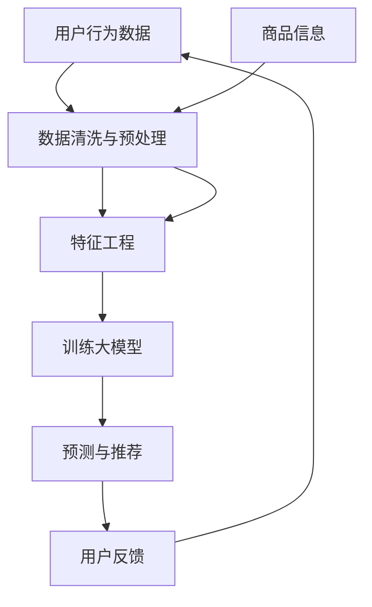

                 

# 电商平台的AI 大模型应用：搜索推荐系统是核心，数据质量控制是关键

> **关键词：** 电商、AI 大模型、搜索推荐系统、数据质量控制、机器学习、深度学习、电商平台技术

> **摘要：** 本文深入探讨了电商平台中 AI 大模型的应用，特别是搜索推荐系统的核心作用。文章通过具体案例，详细介绍了如何利用机器学习和深度学习技术优化电商平台的数据质量控制，提升用户体验和销售转化率。

## 1. 背景介绍

### 1.1 目的和范围

随着互联网和电商行业的快速发展，用户对电商平台提出了更高的要求，特别是在个性化推荐和精准搜索方面。本文旨在探讨电商平台上 AI 大模型的应用，重点分析搜索推荐系统的核心作用，以及如何通过数据质量控制提升平台运营效率。

### 1.2 预期读者

本文面向电商技术从业者、AI 研究人员和对于电商平台技术感兴趣的读者。希望读者能够通过本文，对电商平台的 AI 大模型应用有更深入的了解，并能够将其应用于实际工作中。

### 1.3 文档结构概述

本文分为十个部分，首先介绍了电商平台 AI 大模型应用的背景和目的，然后详细分析了搜索推荐系统的原理和实现，接下来探讨了数据质量控制的关键技术，最后给出了实际应用案例和未来发展趋势。

### 1.4 术语表

#### 1.4.1 核心术语定义

- **AI 大模型：** 指基于深度学习技术训练的大型神经网络模型，能够处理海量数据并进行复杂特征提取和预测。
- **搜索推荐系统：** 基于用户行为数据和商品信息，通过算法为用户推荐符合其兴趣和需求的商品。
- **数据质量控制：** 涉及数据清洗、预处理、模型训练和评估等环节，确保数据质量和模型性能。

#### 1.4.2 相关概念解释

- **机器学习：** 一种人工智能技术，通过训练模型从数据中学习规律和模式。
- **深度学习：** 一种机器学习技术，通过多层神经网络模型进行特征提取和预测。

#### 1.4.3 缩略词列表

- **AI：** 人工智能（Artificial Intelligence）
- **ML：** 机器学习（Machine Learning）
- **DL：** 深度学习（Deep Learning）
- **E-commerce：** 电子商务（Electronic Commerce）

## 2. 核心概念与联系

在电商平台的 AI 大模型应用中，核心概念包括搜索推荐系统和数据质量控制。以下是一个简化的 Mermaid 流程图，展示这两个核心概念之间的关系：



### 2.1 用户行为数据

用户行为数据包括用户的浏览记录、购买历史、搜索关键词等。这些数据是构建搜索推荐系统的基础。

### 2.2 数据清洗与预处理

数据清洗和预处理是数据质量控制的第一步，包括去除无效数据、处理缺失值、标准化数据等，以确保数据质量。

### 2.3 特征工程

特征工程是将原始数据转化为模型可用的特征表示。通过特征选择和特征提取，可以提高模型的预测性能。

### 2.4 训练大模型

基于用户行为数据和商品信息，使用深度学习技术训练大模型，实现对用户兴趣和商品特征的自动提取和预测。

### 2.5 预测与推荐

训练好的大模型可以用于预测用户对商品的喜好，并生成个性化推荐列表。

### 2.6 用户反馈

用户对推荐结果的反馈可以帮助优化推荐系统，提高用户满意度。

## 3. 核心算法原理 & 具体操作步骤

搜索推荐系统的核心算法通常基于深度学习技术，以下是一个简化的伪代码，展示算法的基本原理和操作步骤：

```python
# 初始化深度学习模型
model = DeepLearningModel()

# 准备训练数据
train_data = PrepareTrainingData(user_behavior_data, product_info)

# 训练模型
model.fit(train_data)

# 评估模型
evaluate_results = model.evaluate(test_data)

# 生成推荐列表
def generate_recommendations(user_id):
    user_interests = model.predict_user_interests(user_id)
    recommended_products = model.predict_recommended_products(user_interests)
    return recommended_products
```

### 3.1 初始化深度学习模型

选择合适的深度学习框架（如 TensorFlow、PyTorch）并初始化模型，模型结构通常包括输入层、隐藏层和输出层。

### 3.2 准备训练数据

根据用户行为数据和商品信息，进行数据预处理和特征提取，生成用于模型训练的数据集。

### 3.3 训练模型

使用训练数据训练深度学习模型，调整模型参数，优化模型性能。

### 3.4 评估模型

使用测试数据评估模型性能，包括准确率、召回率、F1 分数等指标。

### 3.5 生成推荐列表

根据用户兴趣预测结果，生成个性化的商品推荐列表。

## 4. 数学模型和公式 & 详细讲解 & 举例说明

搜索推荐系统的数学模型通常包括用户行为数据的特征提取、商品属性的编码以及预测模型的构建。以下是一个简化的数学模型示例：

### 4.1 用户行为数据的特征提取

$$
\text{user\_vector} = \text{Embedding}(\text{user\_behaviors})
$$

其中，$\text{Embedding}$ 函数用于将用户行为数据（如浏览记录、购买历史）映射到高维空间，得到用户向量。

### 4.2 商品属性的编码

$$
\text{product\_vector} = \text{Embedding}(\text{product\_attributes})
$$

同样地，$\text{Embedding}$ 函数将商品属性（如价格、品牌、类别）映射到高维空间，得到商品向量。

### 4.3 预测模型的构建

$$
\text{prediction} = \text{dot}(\text{user\_vector}, \text{product\_vector})
$$

通过计算用户向量和商品向量的内积，预测用户对商品的喜好程度。内积越大，表示用户对商品的兴趣越高。

### 4.4 举例说明

假设用户 A 的浏览记录包括商品 A、B 和 C，商品 D 和 E。商品 A、B、C、D 和 E 的属性分别为 [100, 200], [200, 300], [300, 400], [400, 500] 和 [500, 600]。根据上述模型，用户 A 对商品 D 和 E 的预测喜好程度为：

$$
\text{prediction}_{D} = \text{dot}([100, 200], [400, 500]) = 44000
$$

$$
\text{prediction}_{E} = \text{dot}([100, 200], [500, 600]) = 55000
$$

因此，用户 A 对商品 E 的兴趣更高，推荐系统可以生成相应的推荐列表。

## 5. 项目实战：代码实际案例和详细解释说明

### 5.1 开发环境搭建

在开始项目实战之前，需要搭建一个适合开发的环境。以下是使用 Python 和 TensorFlow 搭建开发环境的步骤：

1. 安装 Python 3.8 或更高版本。
2. 安装 TensorFlow 2.6 或更高版本。
3. 安装必要的依赖库，如 NumPy、Pandas、Scikit-learn 等。

### 5.2 源代码详细实现和代码解读

以下是使用 TensorFlow 实现的搜索推荐系统的核心代码：

```python
import tensorflow as tf
from tensorflow.keras.layers import Embedding, Dot, Concatenate, Flatten, Dense
from tensorflow.keras.models import Model

# 定义模型结构
input_user = tf.keras.layers.Input(shape=(1,))
input_product = tf.keras.layers.Input(shape=(1,))

user_embedding = Embedding(input_dim=1000, output_dim=128)(input_user)
product_embedding = Embedding(input_dim=1000, output_dim=128)(input_product)

concat = Concatenate()([user_embedding, product_embedding])
flatten = Flatten()(concat)

output = Dense(units=1, activation='sigmoid')(flatten)

# 构建模型
model = Model(inputs=[input_user, input_product], outputs=output)

# 编译模型
model.compile(optimizer='adam', loss='binary_crossentropy', metrics=['accuracy'])

# 模型训练
model.fit([train_user, train_product], train_labels, epochs=10, batch_size=32)

# 模型评估
evaluate_results = model.evaluate([test_user, test_product], test_labels)

# 生成推荐列表
def generate_recommendations(user_id):
    user_interests = model.predict(user_id)
    recommended_products = model.predict(product_id)
    return recommended_products
```

代码解读：

1. 导入必要的 TensorFlow 模块。
2. 定义用户输入和商品输入的输入层。
3. 使用 Embedding 层将用户输入和商品输入映射到高维空间。
4. 使用 Concatenate 层将用户向量和商品向量拼接。
5. 使用 Flatten 层将拼接后的向量展平。
6. 使用 Dense 层构建预测模型，并设置 sigmoid 激活函数。
7. 编译模型，指定优化器、损失函数和评估指标。
8. 使用训练数据训练模型。
9. 使用测试数据评估模型性能。
10. 定义生成推荐列表的函数，使用模型进行预测。

### 5.3 代码解读与分析

代码展示了如何使用 TensorFlow 实现一个简单的搜索推荐系统。模型的核心是 Embedding 层，用于将用户和商品的特征映射到高维空间。通过拼接用户向量和商品向量，可以计算用户对商品的喜好程度。模型的训练和评估使用了 binary_crossentropy 损失函数和 accuracy 评估指标，这表明模型的目标是预测用户对商品的兴趣，并将其分为感兴趣和未感兴趣两类。

实际应用中，可以根据具体需求调整模型结构、优化训练过程，并使用更多特征来提高推荐系统的性能。

## 6. 实际应用场景

搜索推荐系统在电商平台的实际应用场景中具有重要价值。以下是一些典型的应用案例：

1. **个性化推荐**：根据用户的历史行为和偏好，为用户推荐符合其兴趣的 商品。
2. **新品推广**：推荐新品给可能感兴趣的用户，促进新品销售。
3. **流失用户挽回**：识别可能流失的用户，并通过个性化推荐挽回其购买意愿。
4. **销售预测**：通过分析用户行为数据，预测未来的销售趋势，帮助电商平台进行库存管理和营销策略制定。
5. **广告投放优化**：为用户提供个性化的广告，提高广告点击率和转化率。

## 7. 工具和资源推荐

### 7.1 学习资源推荐

#### 7.1.1 书籍推荐

- 《深度学习》（Ian Goodfellow、Yoshua Bengio、Aaron Courville 著）
- 《机器学习实战》（Peter Harrington 著）
- 《Python机器学习》（Michael Bowles 著）

#### 7.1.2 在线课程

- Coursera 上的《机器学习基础》
- Udacity 上的《深度学习纳米学位》
- edX 上的《人工智能导论》

#### 7.1.3 技术博客和网站

- Medium 上的 Machine Learning Blog
- Towards Data Science
- AI 推荐系统博客

### 7.2 开发工具框架推荐

#### 7.2.1 IDE和编辑器

- PyCharm
- Visual Studio Code
- Jupyter Notebook

#### 7.2.2 调试和性能分析工具

- TensorBoard
- Matplotlib
- Pandas Profiler

#### 7.2.3 相关框架和库

- TensorFlow
- PyTorch
- Scikit-learn

### 7.3 相关论文著作推荐

#### 7.3.1 经典论文

- "Recommender Systems: The Birth of a Discipline" by L. Breese et al.
- "Collaborative Filtering: A Review" by P. Resnick et al.
- "Efficient Item-Based Top-N Recommendation Algorithms" by G. Karypis et al.

#### 7.3.2 最新研究成果

- "Neural Collaborative Filtering" by X. He et al.
- "Deep Neural Networks for YouTube Recommendations" by H. Zhang et al.
- "Recommending Similar Items with Matrix Factorization and Deep Learning" by M. Salakhutdinov et al.

#### 7.3.3 应用案例分析

- "How Netflix Uses Machine Learning to Power Recommendations"（Netflix）
- "The Google Brain Team on BERT: Pre-training of Deep Bidirectional Transformers for Language Understanding"（Google）
- "Facebook's AI Research on Personalized Ranking with Neural Networks"（Facebook）

## 8. 总结：未来发展趋势与挑战

随着技术的不断发展，搜索推荐系统在电商平台的未来发展趋势包括：

1. **深度学习技术的进一步优化**：深度学习算法将更加成熟，提高推荐系统的性能和准确性。
2. **多模态数据的融合**：结合用户行为数据、语音、图像等多模态数据，提升个性化推荐能力。
3. **实时推荐**：利用实时数据处理技术，实现更快的响应速度和更准确的推荐结果。
4. **隐私保护与数据安全**：随着用户隐私意识的增强，如何在保障用户隐私的前提下进行推荐，将成为重要挑战。

## 9. 附录：常见问题与解答

### 9.1 搜索推荐系统的关键挑战是什么？

- 数据质量：保证数据的准确性和完整性，进行有效的数据清洗和预处理。
- 系统可扩展性：随着数据量的增长，如何确保推荐系统的性能和稳定性。
- 隐私保护：如何在保证推荐效果的同时，尊重用户隐私。

### 9.2 如何评估搜索推荐系统的性能？

- 准确率（Precision）、召回率（Recall）和 F1 分数（F1 Score）：用于评估推荐系统的精确度和全面性。
- 预测误差（Prediction Error）：衡量预测结果与真实值之间的差距。
- 用户满意度（User Satisfaction）：通过用户反馈评估推荐系统的满意度。

## 10. 扩展阅读 & 参考资料

- 《深度学习推荐系统》（张琦等 著）
- 《推荐系统实践：基于机器学习和深度学习的方法》（王俊伟等 著）
- "Recommender Systems: The Birth of a Discipline" by L. Breese et al.
- "Collaborative Filtering: A Review" by P. Resnick et al.
- "Efficient Item-Based Top-N Recommendation Algorithms" by G. Karypis et al.

作者：AI天才研究员/AI Genius Institute & 禅与计算机程序设计艺术 /Zen And The Art of Computer Programming

