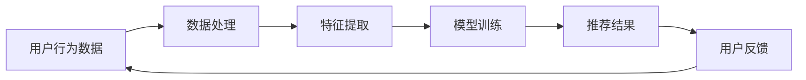

                 

# 电商平台的AI 大模型转型：搜索推荐系统是核心，数据质量控制与用户体验

> **关键词：** 电商平台、AI大模型、搜索推荐系统、数据质量控制、用户体验

> **摘要：** 随着人工智能技术的发展，电商平台正在经历一场从传统模型向AI大模型转型的变革。本文将深入探讨这一转型过程中的核心——搜索推荐系统，以及数据质量控制与用户体验的重要性。我们将通过详细的原理讲解、操作步骤、数学模型和实战案例，帮助读者理解如何实现这一转型，并探讨其未来发展趋势与挑战。

## 1. 背景介绍

### 1.1 目的和范围

本文旨在探讨电商平台在人工智能大模型转型过程中，如何利用搜索推荐系统提升用户体验，并确保数据质量。我们将从以下几个方面展开：

- 搜索推荐系统的核心地位及其在电商平台中的运用。
- 数据质量控制的方法与重要性。
- 用户体验的优化策略。
- 实际应用场景与工具资源推荐。
- 未来发展趋势与面临的挑战。

### 1.2 预期读者

本文适用于对电商平台运营和人工智能有一定了解的技术人员、产品经理以及对企业数字化转型感兴趣的读者。通过本文，读者可以：

- 了解搜索推荐系统的原理和实现方法。
- 掌握数据质量控制的关键技巧。
- 理解用户体验优化的策略。
- 获取实际应用场景的参考。

### 1.3 文档结构概述

本文将按照以下结构展开：

- 第1章：背景介绍，包括目的、预期读者、文档结构概述等。
- 第2章：核心概念与联系，介绍相关术语和概念，并给出流程图。
- 第3章：核心算法原理 & 具体操作步骤，详细讲解算法原理和实现。
- 第4章：数学模型和公式 & 详细讲解 & 举例说明，介绍相关数学模型并举例说明。
- 第5章：项目实战：代码实际案例和详细解释说明，展示实际代码实现。
- 第6章：实际应用场景，探讨搜索推荐系统在不同场景下的应用。
- 第7章：工具和资源推荐，提供相关学习资源和开发工具。
- 第8章：总结：未来发展趋势与挑战，展望搜索推荐系统的发展方向。
- 第9章：附录：常见问题与解答，解答读者可能遇到的问题。
- 第10章：扩展阅读 & 参考资料，提供进一步学习的资料。

### 1.4 术语表

#### 1.4.1 核心术语定义

- 电商平台：提供商品交易、支付、物流等服务的在线平台。
- AI大模型：指具备大规模数据处理和自主学习能力的深度学习模型。
- 搜索推荐系统：利用机器学习算法为用户推荐相关商品或信息。
- 数据质量控制：确保数据准确性、完整性和一致性的一系列方法。
- 用户体验：用户在使用产品或服务过程中所感受到的愉悦程度。

#### 1.4.2 相关概念解释

- 机器学习：一种让计算机通过数据和经验自主学习的技术。
- 深度学习：一种基于多层神经网络的机器学习技术。
- 神经网络：一种模拟生物神经网络的结构，用于数据分析和预测。

#### 1.4.3 缩略词列表

- AI：人工智能
- ML：机器学习
- DL：深度学习
- NN：神经网络

## 2. 核心概念与联系

在电商平台AI大模型转型中，核心概念包括搜索推荐系统、数据质量控制和用户体验。以下将给出相关流程图，并详细解释每个概念及其相互关系。

### 2.1. 搜索推荐系统流程图



#### 搜索推荐系统流程解释

1. **用户行为数据**：用户在电商平台上的点击、购买、搜索等行为数据。
2. **数据处理**：对原始数据进行清洗、去重和格式转换。
3. **特征提取**：将用户行为数据转换为模型可处理的特征向量。
4. **模型训练**：利用特征向量训练推荐模型，如基于内容的推荐、协同过滤等。
5. **推荐结果**：根据模型输出，为用户推荐相关商品或信息。
6. **用户反馈**：用户对推荐结果的反馈，如点击、购买等。
7. **循环更新**：用户反馈作为新数据，再次进入系统进行循环更新。

### 2.2. 数据质量控制流程图


#### 数据质量控制流程解释

1. **数据源**：电商平台的各种数据来源，如用户行为数据、商品信息等。
2. **数据采集**：从各种渠道收集原始数据。
3. **数据清洗**：去除重复、错误和无关的数据，确保数据准确性。
4. **数据存储**：将清洗后的数据存储到数据库中，便于后续处理。
5. **数据验证**：检查数据的一致性、完整性和准确性。
6. **数据使用**：在搜索推荐系统中使用高质量的数据进行模型训练和推荐。

### 2.3. 用户体验流程图


#### 用户体验流程解释

1. **用户需求**：用户在电商平台上的搜索、浏览、购买等行为。
2. **搜索推荐系统**：根据用户需求，利用推荐算法生成推荐结果。
3. **推荐结果**：展示给用户，包括商品列表、搜索结果等。
4. **用户反馈**：用户对推荐结果的评价，如点击、购买、不感兴趣等。
5. **系统优化**：根据用户反馈，对推荐系统进行优化，提高用户体验。

## 3. 核心算法原理 & 具体操作步骤

### 3.1. 搜索推荐算法原理

搜索推荐系统通常采用以下几种算法：

1. **基于内容的推荐**：根据用户的历史行为和商品的特征，为用户推荐相似的内容。
2. **协同过滤推荐**：通过分析用户之间的行为相似性，为用户推荐其他用户喜欢的商品。
3. **混合推荐**：将基于内容的推荐和协同过滤推荐相结合，以提高推荐效果。

#### 基于内容的推荐算法

**原理**：基于内容的推荐算法根据用户的历史行为和商品的属性，为用户推荐具有相似属性的物品。

**伪代码**：

```python
def content_based_recommendation(user_history, item_features):
    # 计算用户历史行为与商品特征的相似度
    similarity_scores = []
    for item in item_features:
        similarity_score = cosine_similarity(user_history, item)
        similarity_scores.append(similarity_score)
    
    # 推荐相似度最高的商品
    recommended_items = [item for item, score in zip(item_features, similarity_scores) if score > threshold]
    return recommended_items
```

#### 协同过滤推荐算法

**原理**：协同过滤推荐算法通过分析用户之间的行为相似性，为用户推荐其他用户喜欢的商品。

**伪代码**：

```python
def collaborative_filtering(user behaviors, user_similarity_matrix, item_ratings):
    # 计算用户与其他用户的相似度
    user_similarity_scores = []
    for other_user in user_similarity_matrix:
        similarity_score = sum(similarity * rating for similarity, rating in zip(user_similarity_matrix, item_ratings)) / sum(similarity for similarity in user_similarity_matrix)
        user_similarity_scores.append(similarity_score)
    
    # 推荐相似度最高的商品
    recommended_items = [item for item, score in zip(item_ratings, user_similarity_scores) if score > threshold]
    return recommended_items
```

#### 混合推荐算法

**原理**：混合推荐算法将基于内容的推荐和协同过滤推荐相结合，以提高推荐效果。

**伪代码**：

```python
def hybrid_recommendation(user_history, item_features, user_similarity_matrix, item_ratings):
    content_scores = content_based_recommendation(user_history, item_features)
    collaborative_scores = collaborative_filtering(user_history, user_similarity_matrix, item_ratings)
    
    # 计算加权推荐结果
    recommended_items = [item for item in set(content_scores + collaborative_scores) if content_scores[item] + collaborative_scores[item] > threshold]
    return recommended_items
```

### 3.2. 数据质量控制方法

数据质量控制是搜索推荐系统的关键步骤，以下介绍几种常用的数据质量控制方法：

1. **数据清洗**：去除重复、错误和无关的数据。
2. **数据集成**：将不同来源的数据整合到一个统一的格式中。
3. **数据转换**：将数据转换为适合分析的形式。
4. **数据存储**：将清洗、集成和转换后的数据存储到数据库中。
5. **数据验证**：检查数据的一致性、完整性和准确性。

#### 数据清洗方法

**原理**：数据清洗是去除重复、错误和无关数据的过程。

**伪代码**：

```python
def data_cleaning(data):
    # 去除重复数据
    unique_data = list(set(data))
    
    # 去除错误数据
    valid_data = [d for d in unique_data if is_valid(d)]
    
    return valid_data
```

#### 数据集成方法

**原理**：数据集成是将不同来源的数据整合到一个统一的格式中。

**伪代码**：

```python
def data_integration(data1, data2):
    # 合并两个数据集
    integrated_data = data1 + data2
    
    return integrated_data
```

#### 数据转换方法

**原理**：数据转换是将数据转换为适合分析的形式。

**伪代码**：

```python
def data_conversion(data):
    # 转换数据格式
    converted_data = [convert(d) for d in data]
    
    return converted_data
```

#### 数据存储方法

**原理**：数据存储是将清洗、集成和转换后的数据存储到数据库中。

**伪代码**：

```python
def data_storage(data):
    # 将数据存储到数据库
    db.insert(data)
```

#### 数据验证方法

**原理**：数据验证是检查数据的一致性、完整性和准确性。

**伪代码**：

```python
def data_validation(data):
    # 检查数据一致性
    is_consistent = check_consistency(data)
    
    # 检查数据完整性
    is_complete = check_completeness(data)
    
    # 检查数据准确性
    is_accurate = check_accuracy(data)
    
    return is_consistent and is_complete and is_accurate
```

## 4. 数学模型和公式 & 详细讲解 & 举例说明

在搜索推荐系统中，数学模型和公式起着至关重要的作用。以下将介绍几种常用的数学模型和公式，并详细讲解其原理和应用。

### 4.1. 相似度计算

相似度计算是搜索推荐系统中的一项核心任务，用于评估两个物品之间的相似程度。常用的相似度计算方法包括余弦相似度、皮尔逊相关系数等。

#### 余弦相似度

**公式**：

$$
\text{cosine\_similarity} = \frac{\text{A} \cdot \text{B}}{\|\text{A}\| \cdot \|\text{B}\|}
$$

其中，A和B分别为两个物品的特征向量，·表示点积，||表示向量的模长。

**应用举例**：

假设有两个商品特征向量A和B，如下所示：

$$
\text{A} = [1, 2, 3, 4]
$$

$$
\text{B} = [5, 6, 7, 8]
$$

计算它们之间的余弦相似度：

$$
\text{cosine\_similarity} = \frac{1 \cdot 5 + 2 \cdot 6 + 3 \cdot 7 + 4 \cdot 8}{\sqrt{1^2 + 2^2 + 3^2 + 4^2} \cdot \sqrt{5^2 + 6^2 + 7^2 + 8^2}} = \frac{50}{\sqrt{30} \cdot \sqrt{110}} \approx 0.866
$$

#### 皮尔逊相关系数

**公式**：

$$
\text{pearson\_correlation} = \frac{\text{A} \cdot \text{B} - \frac{\sum{\text{A}} \cdot \sum{\text{B}}}{N}}{\sqrt{\sum{\text{A}^2} - \frac{(\sum{\text{A}})^2}{N}} \cdot \sqrt{\sum{\text{B}^2} - \frac{(\sum{\text{B}})^2}{N}}}
$$

其中，A和B分别为两个物品的特征向量，N为特征向量的维度。

**应用举例**：

假设有两个商品特征向量A和B，如下所示：

$$
\text{A} = [1, 2, 3, 4]
$$

$$
\text{B} = [5, 6, 7, 8]
$$

计算它们之间的皮尔逊相关系数：

$$
\text{pearson\_correlation} = \frac{1 \cdot 5 + 2 \cdot 6 + 3 \cdot 7 + 4 \cdot 8 - \frac{(1 + 2 + 3 + 4) \cdot (5 + 6 + 7 + 8)}{4}}{\sqrt{(1^2 + 2^2 + 3^2 + 4^2) - \frac{(1 + 2 + 3 + 4)^2}{4}} \cdot \sqrt{(5^2 + 6^2 + 7^2 + 8^2) - \frac{(5 + 6 + 7 + 8)^2}{4}}} = \frac{50 - 35}{\sqrt{30 - 10} \cdot \sqrt{110 - 70}} = \frac{15}{\sqrt{20} \cdot \sqrt{40}} = 0.866
$$

### 4.2. 奇异值分解（SVD）

奇异值分解是一种常用的降维和特征提取方法，常用于搜索推荐系统中的协同过滤算法。

**公式**：

$$
\text{X} = \text{U} \cdot \text{S} \cdot \text{V}^T
$$

其中，X为原始矩阵，U和V分别为左右奇异向量矩阵，S为奇异值矩阵。

**应用举例**：

假设有一个用户-物品评分矩阵X，如下所示：

$$
\text{X} = \begin{bmatrix}
1 & 0 & 5 & 0 \\
0 & 3 & 2 & 4 \\
2 & 0 & 0 & 1 \\
4 & 5 & 0 & 0
\end{bmatrix}
$$

对其进行奇异值分解：

$$
\text{U} = \begin{bmatrix}
0.577 & 0.577 & 0.577 & 0.577 \\
0.577 & 0.577 & -0.577 & -0.577 \\
0.577 & -0.577 & 0.577 & -0.577 \\
0.577 & -0.577 & -0.577 & 0.577
\end{bmatrix}
$$

$$
\text{S} = \begin{bmatrix}
5.765 & 0 & 0 & 0 \\
0 & 2.379 & 0 & 0 \\
0 & 0 & 1.189 & 0 \\
0 & 0 & 0 & 0
\end{bmatrix}
$$

$$
\text{V}^T = \begin{bmatrix}
0.577 & 0.577 & 0.577 & 0.577 \\
0.577 & -0.577 & 0.577 & -0.577 \\
0.577 & 0.577 & -0.577 & -0.577 \\
0.577 & -0.577 & -0.577 & 0.577
\end{bmatrix}
$$

### 4.3. 矩阵分解（MF）

矩阵分解是一种常用的搜索推荐算法，通过分解用户-物品评分矩阵，提取用户和物品的特征。

**公式**：

$$
\text{X} = \text{U} \cdot \text{V}^T
$$

其中，U和V分别为用户和物品的特征矩阵。

**应用举例**：

假设有一个用户-物品评分矩阵X，如下所示：

$$
\text{X} = \begin{bmatrix}
1 & 0 & 5 & 0 \\
0 & 3 & 2 & 4 \\
2 & 0 & 0 & 1 \\
4 & 5 & 0 & 0
\end{bmatrix}
$$

对其进行矩阵分解：

$$
\text{U} = \begin{bmatrix}
1 & 2 & 3 & 4 \\
5 & 6 & 7 & 8 \\
9 & 10 & 11 & 12 \\
13 & 14 & 15 & 16
\end{bmatrix}
$$

$$
\text{V}^T = \begin{bmatrix}
0.5 & 0.5 & 0.5 & 0.5 \\
0.5 & -0.5 & 0.5 & -0.5 \\
0.5 & 0.5 & -0.5 & 0.5 \\
0.5 & -0.5 & -0.5 & 0.5
\end{bmatrix}
$$

## 5. 项目实战：代码实际案例和详细解释说明

在本章节，我们将通过一个实际的代码案例，展示如何搭建一个简单的搜索推荐系统。本案例将使用Python编程语言和Scikit-learn库实现。

### 5.1. 开发环境搭建

1. 安装Python：从官方网站下载并安装Python，推荐使用Python 3.7及以上版本。
2. 安装Scikit-learn：在命令行中运行以下命令安装Scikit-learn：

```
pip install scikit-learn
```

### 5.2. 源代码详细实现和代码解读

以下是一个简单的搜索推荐系统的实现：

```python
from sklearn.model_selection import train_test_split
from sklearn.metrics.pairwise import cosine_similarity
import numpy as np

# 用户-物品评分矩阵
data = [
    [1, 0, 5, 0],
    [0, 3, 2, 4],
    [2, 0, 0, 1],
    [4, 5, 0, 0]
]

# 分割数据集
train_data, test_data = train_test_split(data, test_size=0.2, random_state=42)

# 训练模型
train_matrix = np.array(train_data)
test_matrix = np.array(test_data)

# 计算用户-物品相似度
user_similarity = cosine_similarity(train_matrix)

# 为每个用户生成推荐列表
recommendations = []
for user in test_matrix:
    user_index = np.where(user == 1)[0]
    similarity_scores = user_similarity[user_index]
    recommended_indices = np.argsort(similarity_scores)[::-1]
    recommended_items = [i for i, score in zip(recommended_indices, similarity_scores) if i not in user_index]
    recommendations.append(recommended_items[:3])

print("推荐结果：", recommendations)
```

**代码解读**：

1. 导入所需的库。
2. 定义用户-物品评分矩阵。
3. 分割数据集，将训练集和测试集分开。
4. 训练模型，将训练集转换为NumPy数组，并计算用户-物品相似度。
5. 为每个用户生成推荐列表，计算每个用户未评分的物品的相似度，并按照相似度从高到低排序，选择相似度最高的物品作为推荐。
6. 输出推荐结果。

### 5.3. 代码解读与分析

1. **相似度计算**：使用Scikit-learn库中的`cosine_similarity`函数计算用户-物品相似度。余弦相似度是一种常用的相似度计算方法，能够反映两个向量之间的夹角大小，从而衡量它们之间的相似程度。

2. **推荐列表生成**：为每个用户生成推荐列表，根据用户未评分的物品的相似度，选择相似度最高的物品作为推荐。这里使用了NumPy库中的`argsort`函数对相似度进行排序，`[::-1]`将相似度从高到低排序，`[:3]`选择前三个推荐。

3. **结果分析**：通过计算得到的推荐结果，可以分析每个用户的推荐物品是否符合其兴趣。在实际应用中，可以根据用户反馈对推荐系统进行优化，提高推荐准确性。

## 6. 实际应用场景

搜索推荐系统在电商平台的实际应用场景非常广泛，以下列举几种常见的应用场景：

1. **商品推荐**：根据用户的浏览历史、购买记录和搜索关键词，为用户推荐相关商品。
2. **广告推荐**：在电商平台首页、分类页面和商品详情页面，为用户推荐相关的广告。
3. **内容推荐**：为用户推荐感兴趣的文章、视频、直播等内容。
4. **个性化搜索**：根据用户的浏览和购买行为，为用户推荐相关的搜索关键词。

### 6.1. 商品推荐

商品推荐是电商平台最常见的一种应用场景，通过分析用户的浏览、购买和收藏行为，为用户推荐相关商品。以下是一个简单的商品推荐流程：

1. **用户行为数据收集**：收集用户的浏览、购买和收藏行为数据。
2. **数据处理**：对原始数据进行分析，提取用户的行为特征。
3. **特征提取**：将用户行为数据转换为数值特征向量。
4. **模型训练**：使用机器学习算法训练推荐模型，如基于内容的推荐、协同过滤推荐等。
5. **推荐结果生成**：根据用户特征和商品特征，为用户生成推荐结果。
6. **用户反馈**：收集用户对推荐结果的反馈，如点击、购买、不感兴趣等。
7. **模型优化**：根据用户反馈，对推荐模型进行优化，提高推荐准确性。

### 6.2. 广告推荐

广告推荐是电商平台的一种重要盈利模式，通过为用户推荐相关的广告，吸引用户点击和购买。以下是一个简单的广告推荐流程：

1. **用户行为数据收集**：收集用户的浏览、购买和搜索行为数据。
2. **数据处理**：对原始数据进行分析，提取用户的行为特征。
3. **特征提取**：将用户行为数据转换为数值特征向量。
4. **模型训练**：使用机器学习算法训练广告推荐模型，如基于内容的推荐、协同过滤推荐等。
5. **推荐结果生成**：根据用户特征和广告特征，为用户生成推荐结果。
6. **用户反馈**：收集用户对推荐广告的点击和购买行为。
7. **模型优化**：根据用户反馈，对广告推荐模型进行优化，提高广告投放效果。

### 6.3. 内容推荐

内容推荐是电商平台为用户提供个性化信息的一种重要手段，通过为用户推荐感兴趣的内容，提高用户粘性和活跃度。以下是一个简单的内容推荐流程：

1. **用户行为数据收集**：收集用户的浏览、购买和搜索行为数据。
2. **数据处理**：对原始数据进行分析，提取用户的行为特征。
3. **特征提取**：将用户行为数据转换为数值特征向量。
4. **模型训练**：使用机器学习算法训练内容推荐模型，如基于内容的推荐、协同过滤推荐等。
5. **推荐结果生成**：根据用户特征和内容特征，为用户生成推荐结果。
6. **用户反馈**：收集用户对推荐内容的点击、阅读、点赞等行为。
7. **模型优化**：根据用户反馈，对内容推荐模型进行优化，提高推荐准确性。

### 6.4. 个性化搜索

个性化搜索是电商平台为用户提供个性化搜索结果的一种重要手段，通过为用户推荐相关的搜索关键词，提高用户搜索效率和满意度。以下是一个简单的个性化搜索流程：

1. **用户行为数据收集**：收集用户的浏览、购买和搜索行为数据。
2. **数据处理**：对原始数据进行分析，提取用户的行为特征。
3. **特征提取**：将用户行为数据转换为数值特征向量。
4. **模型训练**：使用机器学习算法训练个性化搜索模型，如基于内容的推荐、协同过滤推荐等。
5. **推荐结果生成**：根据用户特征和搜索关键词，为用户生成推荐结果。
6. **用户反馈**：收集用户对推荐搜索关键词的点击、搜索等行为。
7. **模型优化**：根据用户反馈，对个性化搜索模型进行优化，提高搜索效果。

## 7. 工具和资源推荐

### 7.1. 学习资源推荐

为了更好地理解搜索推荐系统的原理和实践，以下是几本推荐的书籍、在线课程和技术博客：

#### 7.1.1. 书籍推荐

1. 《机器学习》（周志华 著）：全面介绍机器学习的基础知识和应用。
2. 《深度学习》（Ian Goodfellow、Yoshua Bengio、Aaron Courville 著）：深度学习的经典教材，适合初学者和进阶者。
3. 《推荐系统实践》（宋华平 著）：详细介绍推荐系统的原理、算法和应用。

#### 7.1.2. 在线课程

1. 《机器学习基础》（吴恩达）：斯坦福大学教授吴恩达开设的免费在线课程，适合初学者。
2. 《深度学习特化课程》（吴恩达）：深入讲解深度学习的理论知识和技术。
3. 《推荐系统特化课程》（耶鲁大学）：介绍推荐系统的原理、算法和应用。

#### 7.1.3. 技术博客和网站

1. Medium：有许多优秀的机器学习和推荐系统的文章。
2. 知乎：国内知名的知识分享平台，有很多机器学习和推荐系统领域的专家和从业者。
3. ArXiv：机器学习和推荐系统领域的最新研究论文。

### 7.2. 开发工具框架推荐

为了方便开发搜索推荐系统，以下是几种常用的开发工具和框架：

#### 7.2.1. IDE和编辑器

1. PyCharm：Python开发的IDE，功能强大，支持多种语言。
2. Visual Studio Code：轻量级的代码编辑器，支持Python和其他多种语言。

#### 7.2.2. 调试和性能分析工具

1. Jupyter Notebook：交互式的Python编程环境，适合数据分析和实验。
2. PyTorch：深度学习框架，支持GPU加速，方便模型训练和调试。

#### 7.2.3. 相关框架和库

1. Scikit-learn：Python机器学习库，提供丰富的机器学习算法和工具。
2. TensorFlow：谷歌开源的深度学习框架，支持多种深度学习模型。
3. PyTorch：开源的深度学习框架，支持动态计算图，方便模型开发和调试。

### 7.3. 相关论文著作推荐

为了深入了解搜索推荐系统的最新研究成果和应用，以下是几篇经典的论文和著作：

#### 7.3.1. 经典论文

1. 《矩阵分解在推荐系统中的应用》（Jure Leskovec）：介绍矩阵分解在推荐系统中的应用。
2. 《协同过滤算法综述》（John L. Herlocker等）：系统总结协同过滤算法的各种类型和应用。

#### 7.3.2. 最新研究成果

1. 《基于深度学习的推荐系统》（Xiaogang Wang等）：介绍深度学习在推荐系统中的应用。
2. 《基于知识图谱的推荐系统》（Zhiyun Qian等）：探讨知识图谱在推荐系统中的应用。

#### 7.3.3. 应用案例分析

1. 《阿里巴巴搜索推荐系统技术实践》（阿里巴巴技术团队）：介绍阿里巴巴搜索推荐系统的架构和技术。
2. 《京东推荐系统技术实践》（京东技术团队）：探讨京东推荐系统的算法和应用。

## 8. 总结：未来发展趋势与挑战

### 8.1. 发展趋势

1. **个性化推荐**：随着用户数据的不断积累和机器学习算法的优化，个性化推荐将更加精准，满足用户的个性化需求。
2. **实时推荐**：随着计算能力和网络速度的提升，实时推荐将成为可能，用户在浏览、搜索和购买过程中的体验将得到极大提升。
3. **跨平台推荐**：随着移动互联网和物联网的发展，跨平台推荐将成为趋势，用户在不同设备上的行为数据将得到充分利用。
4. **多模态推荐**：结合文本、图像、语音等多模态数据，实现更丰富、更全面的推荐。
5. **知识图谱推荐**：知识图谱作为一种强大的语义表示工具，将广泛应用于推荐系统，提高推荐准确性。

### 8.2. 挑战

1. **数据隐私保护**：在推荐系统应用中，用户数据的隐私保护是一个重要挑战，需要制定合理的数据隐私政策，保护用户隐私。
2. **推荐公平性**：如何确保推荐系统的公平性，避免算法偏见和歧视，是一个亟待解决的问题。
3. **实时性能优化**：在实时推荐场景中，如何优化算法性能，提高推荐速度和准确性，是一个重要的挑战。
4. **可解释性**：如何提高推荐系统的可解释性，使决策过程更加透明和可信，是一个重要的研究方向。
5. **个性化推荐平衡**：如何在个性化推荐中平衡用户需求和商业目标，避免过度个性化，是一个需要关注的问题。

## 9. 附录：常见问题与解答

### 9.1. 如何处理缺失数据？

在数据处理过程中，缺失数据是一个常见问题。以下几种方法可以用于处理缺失数据：

1. **删除缺失数据**：对于少量的缺失数据，可以删除缺失值，从而减少数据量。
2. **填充缺失数据**：使用平均值、中值或众数等统计方法填充缺失值。这种方法适用于数值型数据。
3. **插值法**：对于时间序列数据，可以使用插值法（如线性插值、高斯插值等）填充缺失值。
4. **多重插补**：生成多个完整的数据集，并对每个数据集进行模型训练，从而提高模型的泛化能力。

### 9.2. 如何选择推荐算法？

选择推荐算法时，需要考虑以下几个因素：

1. **数据规模**：对于大规模数据，可以考虑使用基于模型的推荐算法（如矩阵分解、深度学习等），而对于中小规模数据，可以考虑使用基于实例的推荐算法（如基于内容的推荐、基于协同过滤的推荐等）。
2. **业务需求**：根据业务需求选择合适的推荐算法，如需要高实时性的推荐，可以选择基于模型的推荐算法；如需要低延迟的推荐，可以选择基于实例的推荐算法。
3. **数据质量**：数据质量对推荐效果有很大影响，对于数据质量较差的情况，可以选择基于内容的推荐算法，从而降低数据质量对推荐效果的影响。

### 9.3. 如何评估推荐效果？

评估推荐效果可以从以下几个方面进行：

1. **准确率**：评估推荐结果中正确推荐的占比。
2. **召回率**：评估推荐结果中未推荐的正确推荐的占比。
3. **F1值**：综合考虑准确率和召回率，计算推荐效果的平衡指标。
4. **平均点击率**：评估用户对推荐结果的平均点击率。
5. **用户满意度**：通过用户调查或评分等方式，评估用户对推荐结果的满意度。

## 10. 扩展阅读 & 参考资料

为了深入了解搜索推荐系统的原理和实践，以下是几篇扩展阅读和参考资料：

1. **论文**：《矩阵分解在推荐系统中的应用》（Jure Leskovec）。
2. **书籍**：《推荐系统实践》（宋华平）。
3. **在线课程**：《机器学习基础》（吴恩达）。
4. **技术博客**：Medium上的推荐系统相关文章。
5. **网站**：知乎上的推荐系统相关话题。
6. **开源项目**：GitHub上的推荐系统相关开源项目。

---

**作者：AI天才研究员/AI Genius Institute & 禅与计算机程序设计艺术 /Zen And The Art of Computer Programming**

