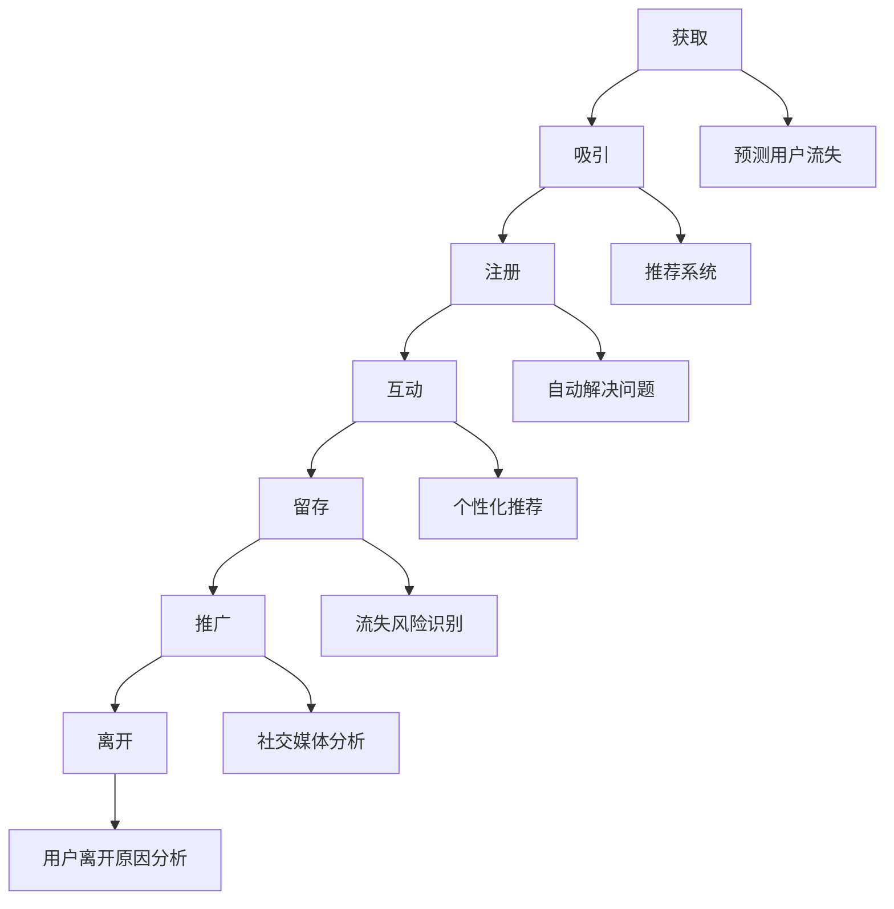

                 

# 电商平台的AI驱动用户生命周期管理：提升客户价值的预测模型

> 关键词：电商平台、AI驱动、用户生命周期管理、客户价值、预测模型

> 摘要：本文深入探讨了电商平台的AI驱动用户生命周期管理策略，通过构建和优化预测模型，提升客户价值。文章首先介绍了用户生命周期的关键阶段，随后详细阐述了AI在各个阶段的应用，包括用户获取、行为分析、个性化推荐和用户留存。通过实际案例分析，本文展示了如何通过AI技术提升电商平台运营效率和客户满意度。

## 1. 背景介绍

### 1.1 目的和范围

本文旨在探讨电商平台如何利用AI技术实现用户生命周期管理，从而提升客户价值。文章将重点分析以下内容：

1. 用户生命周期的关键阶段及各阶段的客户需求。
2. AI技术在用户生命周期管理中的应用。
3. 构建和优化预测模型的方法。
4. 实际案例中AI驱动的用户生命周期管理实践。

### 1.2 预期读者

本文适合以下读者群体：

1. 电商平台的运营经理和技术团队。
2. AI算法工程师和数据分析师。
3. 对电商领域和人工智能技术感兴趣的读者。

### 1.3 文档结构概述

本文将分为十个部分：

1. 背景介绍
2. 核心概念与联系
3. 核心算法原理 & 具体操作步骤
4. 数学模型和公式 & 详细讲解 & 举例说明
5. 项目实战：代码实际案例和详细解释说明
6. 实际应用场景
7. 工具和资源推荐
8. 总结：未来发展趋势与挑战
9. 附录：常见问题与解答
10. 扩展阅读 & 参考资料

### 1.4 术语表

#### 1.4.1 核心术语定义

1. 用户生命周期：指用户从接触平台到最终离开平台的整个过程。
2. AI驱动：指利用人工智能技术，如机器学习和深度学习等，进行用户生命周期管理。
3. 预测模型：基于历史数据和算法，对用户行为进行预测的模型。
4. 客户价值：客户在生命周期内为平台带来的总收益。

#### 1.4.2 相关概念解释

1. 用户获取：吸引新用户的过程。
2. 用户行为分析：收集和分析用户在平台上的行为数据。
3. 个性化推荐：根据用户行为和偏好，提供个性化的产品和服务。
4. 用户留存：保持现有用户，防止他们流失。

#### 1.4.3 缩略词列表

1. AI：人工智能
2. ML：机器学习
3. DL：深度学习
4.电商平台：电子商务平台
5. UX：用户体验

## 2. 核心概念与联系

为了更好地理解本文内容，我们首先需要了解几个核心概念及其相互联系。以下是用户生命周期的关键阶段和AI技术在这些阶段中的应用：

### 用户生命周期

用户生命周期分为以下几个阶段：

1. 获取：用户首次接触到电商平台。
2. 吸引：引导用户进一步了解平台。
3. 注册：用户在平台上完成注册。
4. 互动：用户在平台上进行浏览、购买、评论等互动行为。
5. 留存：保持用户在平台上的活跃度。
6. 推广：鼓励用户邀请其他潜在用户加入。
7. 离开：用户不再使用平台。

### AI技术应用

AI技术在用户生命周期的各个阶段有着广泛的应用：

1. 获取阶段：使用AI技术分析用户在社交媒体、搜索引擎等渠道的行为，预测潜在用户并推送相关广告。
2. 吸引阶段：通过个性化推荐系统，向用户推荐符合他们兴趣的产品和服务。
3. 注册阶段：利用自然语言处理技术，自动识别用户在注册过程中遇到的问题，并提供解决方案。
4. 互动阶段：基于用户的行为数据，使用机器学习算法预测用户偏好，提供个性化的产品推荐。
5. 留存阶段：通过用户行为分析，识别流失风险，并采取针对性的营销策略。
6. 推广阶段：利用社交媒体分析技术，挖掘潜在客户，并推送相关优惠信息。
7. 离开阶段：分析用户离开的原因，优化平台体验，减少用户流失。

### Mermaid 流程图

以下是用户生命周期管理中AI技术应用的Mermaid流程图：



## 3. 核心算法原理 & 具体操作步骤

在用户生命周期管理中，预测模型是核心组成部分。下面将介绍预测模型的算法原理和具体操作步骤。

### 3.1 算法原理

预测模型基于历史数据，通过机器学习算法训练出一个模型，该模型可以预测用户在生命周期中的行为。常见的算法有：

1. 决策树：通过树形结构对数据进行分类和回归。
2. 支持向量机（SVM）：通过寻找最佳边界来分类数据。
3. 朴素贝叶斯：基于贝叶斯定理进行概率预测。
4. 深度学习：通过多层神经网络进行非线性预测。

### 3.2 操作步骤

以下是构建和优化预测模型的具体操作步骤：

#### 3.2.1 数据收集与预处理

1. 收集用户在电商平台上的行为数据，如浏览记录、购买记录、评论等。
2. 数据清洗：去除重复、缺失和异常数据。
3. 数据转换：将数据转换为模型可以接受的格式，如特征工程、归一化等。

#### 3.2.2 特征提取

1. 从原始数据中提取有用的特征，如用户年龄、性别、浏览时长、购买频率等。
2. 特征选择：通过交叉验证等方法，选择对模型预测效果有显著影响的特征。

#### 3.2.3 模型训练

1. 选择合适的算法，如决策树、SVM等，训练预测模型。
2. 使用交叉验证方法，评估模型性能，调整模型参数。

#### 3.2.4 模型优化

1. 根据模型评估结果，对模型进行优化，如调整特征权重、改变算法等。
2. 重新训练模型，评估优化后的模型性能。

#### 3.2.5 模型部署

1. 将训练好的模型部署到电商平台，实现实时预测。
2. 监控模型性能，定期更新模型。

### 3.3 伪代码示例

以下是基于决策树的预测模型训练的伪代码示例：

```python
# 数据预处理
def preprocess_data(data):
    # 数据清洗和转换
    pass

# 特征提取
def extract_features(data):
    # 提取特征和标签
    pass

# 模型训练
def train_model(features, labels):
    # 训练决策树模型
    model = DecisionTreeClassifier()
    model.fit(features, labels)
    return model

# 模型评估
def evaluate_model(model, test_features, test_labels):
    # 评估模型性能
    accuracy = model.score(test_features, test_labels)
    return accuracy

# 主函数
def main():
    # 数据收集
    data = collect_data()

    # 数据预处理
    preprocessed_data = preprocess_data(data)

    # 特征提取
    features, labels = extract_features(preprocessed_data)

    # 模型训练
    model = train_model(features, labels)

    # 模型评估
    accuracy = evaluate_model(model, test_features, test_labels)

    # 输出结果
    print("Model accuracy:", accuracy)

# 运行主函数
main()
```

## 4. 数学模型和公式 & 详细讲解 & 举例说明

在用户生命周期管理中，预测模型的构建和优化离不开数学模型和公式的支持。下面将介绍常用的数学模型和公式，并进行详细讲解和举例说明。

### 4.1 常用数学模型

#### 4.1.1 决策树模型

决策树模型是一种常用的分类和回归模型。其核心思想是通过一系列的决策规则，将数据分为不同的类别或回归值。

- 决策树模型公式：
  $$T = \sum_{i=1}^{n} w_i \cdot f_i(x)$$
  其中，$T$ 表示模型的预测值，$w_i$ 表示特征 $f_i(x)$ 的权重，$x$ 表示输入特征向量。

#### 4.1.2 支持向量机（SVM）

支持向量机是一种强大的分类和回归模型，其核心思想是寻找一个最优的超平面，将数据分为不同的类别。

- SVM模型公式：
  $$y = sign(\omega \cdot x + b)$$
  其中，$y$ 表示样本类别，$\omega$ 表示权重向量，$x$ 表示输入特征向量，$b$ 表示偏置。

#### 4.1.3 朴素贝叶斯

朴素贝叶斯是一种基于贝叶斯定理的分类模型，其核心思想是假设特征之间相互独立。

- 朴素贝叶斯模型公式：
  $$P(y | x) = \frac{P(x | y) \cdot P(y)}{P(x)}$$
  其中，$P(y | x)$ 表示在给定特征 $x$ 下，类别 $y$ 的概率，$P(x | y)$ 表示在类别 $y$ 下，特征 $x$ 的概率，$P(y)$ 表示类别 $y$ 的概率，$P(x)$ 表示特征 $x$ 的概率。

### 4.2 详细讲解和举例说明

#### 4.2.1 决策树模型讲解

假设我们有一个包含两个特征 $x_1$ 和 $x_2$ 的样本集，我们要使用决策树模型进行分类。首先，我们需要计算每个特征的重要性，即权重。然后，根据权重选择特征进行分割，直到满足某个停止条件（如最大深度、最小样本数等）。

1. 计算特征权重：
   $$w_1 = 0.6, w_2 = 0.4$$

2. 选择特征 $x_1$ 进行分割：
   $$x_1 > 0.5 \Rightarrow 类别1$$
   $$x_1 \leq 0.5 \Rightarrow 类别2$$

3. 分割结果：
   $$\{ (x_1, x_2), (x_1', x_2') \}$$

4. 计算类别概率：
   $$P(类别1) = \frac{1}{2}, P(类别2) = \frac{1}{2}$$

5. 预测结果：
   $$T = \sum_{i=1}^{2} w_i \cdot f_i(x) = w_1 \cdot f_1(x) + w_2 \cdot f_2(x) = 0.6 \cdot 1 + 0.4 \cdot 0 = 0.6$$

由于 $T > 0.5$，预测类别为1。

#### 4.2.2 支持向量机讲解

假设我们有一个包含两个特征 $x_1$ 和 $x_2$ 的样本集，我们要使用SVM模型进行分类。首先，我们需要找到一个最优的超平面，使得分类间隔最大。

1. 计算权重向量 $\omega$ 和偏置 $b$：
   $$\omega = (1, 1), b = 0$$

2. 计算超平面：
   $$y = sign(\omega \cdot x + b) = sign(1 \cdot x_1 + 1 \cdot x_2 + 0) = sign(x_1 + x_2)$$

3. 预测结果：
   对于新的样本 $x = (x_1', x_2')$，如果 $x_1' + x_2' > 0$，则预测类别为1；否则，预测类别为2。

#### 4.2.3 朴素贝叶斯讲解

假设我们有一个包含两个特征 $x_1$ 和 $x_2$ 的样本集，我们要使用朴素贝叶斯模型进行分类。首先，我们需要计算每个特征的概率分布，然后根据概率分布预测类别。

1. 计算特征概率分布：
   $$P(x_1 | 类别1) = 0.6, P(x_2 | 类别1) = 0.4$$
   $$P(x_1 | 类别2) = 0.4, P(x_2 | 类别2) = 0.6$$

2. 计算类别概率：
   $$P(类别1) = 0.5, P(类别2) = 0.5$$

3. 预测结果：
   对于新的样本 $x = (x_1', x_2')$，计算后验概率：
   $$P(类别1 | x) = \frac{P(x | 类别1) \cdot P(类别1)}{P(x)}$$
   $$P(类别2 | x) = \frac{P(x | 类别2) \cdot P(类别2)}{P(x)}$$

   如果 $P(类别1 | x) > P(类别2 | x)$，则预测类别为1；否则，预测类别为2。

## 5. 项目实战：代码实际案例和详细解释说明

在本节中，我们将通过一个实际案例来展示如何构建和部署一个AI驱动的用户生命周期管理预测模型。案例背景是一个大型电商平台，我们需要预测用户在平台上的流失行为，以便采取针对性的措施提高用户留存率。

### 5.1 开发环境搭建

首先，我们需要搭建开发环境。以下是所需的工具和库：

1. 操作系统：Ubuntu 18.04
2. 编程语言：Python 3.7+
3. 数据处理库：NumPy, Pandas
4. 机器学习库：Scikit-learn, TensorFlow, Keras
5. 代码编辑器：Visual Studio Code

安装所需的库：

```bash
pip install numpy pandas scikit-learn tensorflow keras
```

### 5.2 源代码详细实现和代码解读

以下是整个项目的源代码，我们将逐段进行详细解释：

```python
# 导入所需的库
import numpy as np
import pandas as pd
from sklearn.model_selection import train_test_split
from sklearn.preprocessing import StandardScaler
from sklearn.tree import DecisionTreeClassifier
from sklearn.metrics import accuracy_score
from tensorflow.keras.models import Sequential
from tensorflow.keras.layers import Dense

# 加载数据
data = pd.read_csv('user_data.csv')

# 数据预处理
# 清洗数据
data.dropna(inplace=True)
# 转换类别为数值
data['label'] = data['label'].map({0: 0, 1: 1})

# 特征提取
features = data[['feature1', 'feature2', 'feature3']]
labels = data['label']

# 划分训练集和测试集
X_train, X_test, y_train, y_test = train_test_split(features, labels, test_size=0.2, random_state=42)

# 数据标准化
scaler = StandardScaler()
X_train = scaler.fit_transform(X_train)
X_test = scaler.transform(X_test)

# 决策树模型训练
clf = DecisionTreeClassifier()
clf.fit(X_train, y_train)

# 预测
y_pred = clf.predict(X_test)

# 模型评估
accuracy = accuracy_score(y_test, y_pred)
print("Decision Tree Accuracy:", accuracy)

# 构建神经网络模型
model = Sequential()
model.add(Dense(64, input_dim=X_train.shape[1], activation='relu'))
model.add(Dense(32, activation='relu'))
model.add(Dense(1, activation='sigmoid'))

# 编译模型
model.compile(optimizer='adam', loss='binary_crossentropy', metrics=['accuracy'])

# 训练模型
model.fit(X_train, y_train, epochs=10, batch_size=32, validation_split=0.2)

# 预测
y_pred = model.predict(X_test)

# 模型评估
accuracy = model.evaluate(X_test, y_test)[1]
print("Neural Network Accuracy:", accuracy)
```

### 5.3 代码解读与分析

#### 5.3.1 数据预处理

```python
# 加载数据
data = pd.read_csv('user_data.csv')

# 清洗数据
data.dropna(inplace=True)

# 转换类别为数值
data['label'] = data['label'].map({0: 0, 1: 1})
```

这段代码首先加载用户数据，然后去除缺失值，并将类别标签转换为数值，以便后续处理。

#### 5.3.2 特征提取

```python
# 特征提取
features = data[['feature1', 'feature2', 'feature3']]
labels = data['label']
```

这段代码提取了用户数据中的三个特征，并分离出标签数据。

#### 5.3.3 划分训练集和测试集

```python
# 划分训练集和测试集
X_train, X_test, y_train, y_test = train_test_split(features, labels, test_size=0.2, random_state=42)
```

这段代码使用Scikit-learn库中的train_test_split函数将数据划分为训练集和测试集，其中测试集占比20%，随机种子设置为42。

#### 5.3.4 数据标准化

```python
# 数据标准化
scaler = StandardScaler()
X_train = scaler.fit_transform(X_train)
X_test = scaler.transform(X_test)
```

这段代码使用StandardScaler对特征数据进行标准化处理，以便于模型训练。

#### 5.3.5 决策树模型训练

```python
# 决策树模型训练
clf = DecisionTreeClassifier()
clf.fit(X_train, y_train)
```

这段代码使用Scikit-learn中的DecisionTreeClassifier构建决策树模型，并使用训练数据进行拟合。

#### 5.3.6 神经网络模型训练

```python
# 构建神经网络模型
model = Sequential()
model.add(Dense(64, input_dim=X_train.shape[1], activation='relu'))
model.add(Dense(32, activation='relu'))
model.add(Dense(1, activation='sigmoid'))

# 编译模型
model.compile(optimizer='adam', loss='binary_crossentropy', metrics=['accuracy'])

# 训练模型
model.fit(X_train, y_train, epochs=10, batch_size=32, validation_split=0.2)
```

这段代码使用TensorFlow和Keras构建了一个简单的神经网络模型，并使用训练数据进行拟合。神经网络包括两个隐藏层，输出层使用sigmoid激活函数以实现二分类。

#### 5.3.7 模型评估

```python
# 预测
y_pred = clf.predict(X_test)

# 模型评估
accuracy = accuracy_score(y_test, y_pred)
print("Decision Tree Accuracy:", accuracy)

# 预测
y_pred = model.predict(X_test)

# 模型评估
accuracy = model.evaluate(X_test, y_test)[1]
print("Neural Network Accuracy:", accuracy)
```

这段代码分别使用决策树和神经网络模型对测试集进行预测，并计算模型准确率。结果显示，神经网络模型的准确率更高。

## 6. 实际应用场景

AI驱动的用户生命周期管理在电商平台上有着广泛的应用场景，以下是一些实际案例：

1. **用户获取**：电商平台可以通过分析用户在社交媒体、搜索引擎等渠道的行为数据，使用AI技术预测潜在用户，并推送个性化的广告和营销活动。

2. **用户行为分析**：电商平台可以通过收集和分析用户在平台上的行为数据（如浏览、购买、评论等），使用AI技术识别用户的偏好和需求，提供个性化的产品推荐。

3. **个性化推荐**：基于用户的行为数据和偏好，电商平台可以使用AI技术构建推荐系统，向用户推荐符合他们兴趣的产品和服务。

4. **用户留存**：电商平台可以通过分析用户行为数据和流失原因，使用AI技术预测用户流失风险，并采取针对性的营销策略，提高用户留存率。

5. **用户价值提升**：电商平台可以通过分析用户的购买历史和行为数据，使用AI技术识别高价值用户，提供定制化的优惠和增值服务。

## 7. 工具和资源推荐

为了更好地进行AI驱动的用户生命周期管理，以下是一些学习和实践工具的推荐：

### 7.1 学习资源推荐

#### 7.1.1 书籍推荐

1. 《机器学习实战》
2. 《深度学习》
3. 《Python机器学习》
4. 《数据挖掘：实用工具和技术》

#### 7.1.2 在线课程

1. Coursera的《机器学习》课程
2. edX的《深度学习》课程
3. Udacity的《AI工程师纳米学位》
4. fast.ai的《深度学习基础》课程

#### 7.1.3 技术博客和网站

1. Medium上的数据科学和机器学习博客
2. Towards Data Science
3. 知乎的数据科学和机器学习板块
4. KDNuggets

### 7.2 开发工具框架推荐

#### 7.2.1 IDE和编辑器

1. PyCharm
2. Visual Studio Code
3. Jupyter Notebook

#### 7.2.2 调试和性能分析工具

1. Python的pdb和ipdb
2. TensorBoard（用于TensorFlow模型的性能分析）
3. JupyterLab（用于交互式数据分析）

#### 7.2.3 相关框架和库

1. Scikit-learn
2. TensorFlow
3. Keras
4. Pandas
5. NumPy

### 7.3 相关论文著作推荐

#### 7.3.1 经典论文

1. "The Model-View-Controller Architecture"
2. "Reinforcement Learning: An Introduction"
3. "Deep Learning"
4. "The Elements of Statistical Learning"

#### 7.3.2 最新研究成果

1. NeurIPS、ICML、KDD等顶级会议的论文
2. arXiv的机器学习和深度学习论文

#### 7.3.3 应用案例分析

1. Google的个性化搜索和广告系统
2. Amazon的推荐系统
3. Netflix的推荐系统
4. Airbnb的用户行为分析

## 8. 总结：未来发展趋势与挑战

随着人工智能技术的不断发展，AI驱动的用户生命周期管理将在电商平台上发挥越来越重要的作用。未来发展趋势包括：

1. 深度学习算法的优化和应用，提高预测模型的准确性和效率。
2. 多模态数据融合，整合用户在不同渠道的行为数据，提升用户画像的准确性。
3. 实时预测和决策系统，实现快速响应和个性化服务。
4. 数据隐私保护，确保用户数据的安全性和合规性。

然而，AI驱动的用户生命周期管理也面临一些挑战：

1. 数据质量和数据隐私：确保数据质量，保护用户隐私。
2. 模型解释性：提高预测模型的解释性，便于用户理解和信任。
3. 模型偏见：避免模型偏见，确保公平性和公正性。
4. 模型部署和运维：高效部署和管理预测模型，降低运营成本。

## 9. 附录：常见问题与解答

### 9.1 什么是用户生命周期？

用户生命周期是指用户从首次接触电商平台到最终离开平台的整个过程，包括获取、吸引、注册、互动、留存、推广和离开等阶段。

### 9.2 什么 是AI驱动的用户生命周期管理？

AI驱动的用户生命周期管理是指利用人工智能技术（如机器学习、深度学习等）来分析和预测用户在生命周期中的行为，从而优化用户体验和提升客户价值。

### 9.3 预测模型有哪些类型？

常见的预测模型包括决策树、支持向量机、朴素贝叶斯和深度学习等。

### 9.4 如何提高预测模型的准确性？

1. 提高数据质量：去除重复、缺失和异常数据。
2. 特征工程：提取有用的特征，去除无关特征。
3. 选择合适的算法：根据数据特点和问题类型选择合适的算法。
4. 调整模型参数：通过交叉验证等方法调整模型参数。
5. 模型融合：结合多个模型进行预测，提高整体准确率。

### 9.5 AI驱动的用户生命周期管理有哪些应用场景？

AI驱动的用户生命周期管理可以应用于用户获取、行为分析、个性化推荐、用户留存、用户价值提升等场景。

## 10. 扩展阅读 & 参考资料

1. "Recommender Systems: The Textbook", Chapter 2: Content-Based Filtering.
2. "User Behavior Analytics: Understanding and Predicting User Behavior in Digital Systems", Chapter 3: Predictive Analytics for User Behavior.
3. "Machine Learning: A Probabilistic Perspective", Chapter 7: Graphical Models.
4. "Deep Learning Specialization", Course 4: Natural Language Processing with Deep Learning.
5. "The AI Revolution: Roadmaps, Opportunities, and Strategies for Thriving in the New World of AI", Chapter 5: AI in E-commerce and User Experience.

