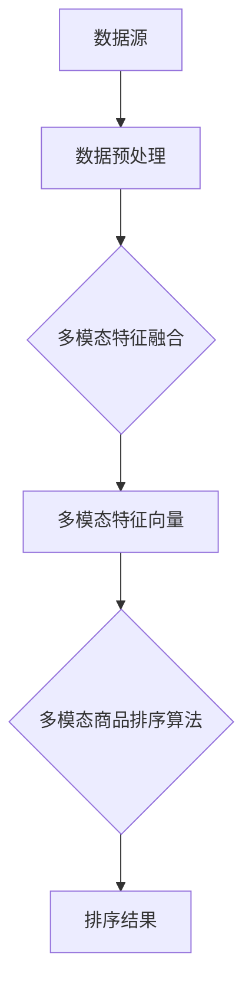

                 

# 电商搜索中的多模态商品排序技术

> 关键词：电商搜索、多模态、商品排序、机器学习、深度学习、算法优化

> 摘要：本文将深入探讨电商搜索中的多模态商品排序技术。我们将从背景介绍开始，逐步分析多模态商品排序的核心概念、算法原理和具体实现，并通过实际项目实战和实际应用场景来展示其效果和优势。最后，我们还将总结未来发展趋势与挑战，并提供相关的工具和资源推荐。

## 1. 背景介绍

### 1.1 目的和范围

本文旨在深入探讨电商搜索中的多模态商品排序技术，分析其核心概念、算法原理和具体实现，并探讨其在实际应用场景中的效果和优势。

### 1.2 预期读者

本文适合电商领域的开发者、数据科学家以及对多模态商品排序技术感兴趣的读者。读者需具备一定的机器学习和深度学习基础。

### 1.3 文档结构概述

本文将分为以下几部分：

1. 背景介绍：介绍本文的目的、范围、预期读者和文档结构。
2. 核心概念与联系：介绍多模态商品排序的核心概念和架构。
3. 核心算法原理 & 具体操作步骤：详细讲解多模态商品排序的算法原理和操作步骤。
4. 数学模型和公式 & 详细讲解 & 举例说明：介绍多模态商品排序的数学模型和公式，并通过举例说明其应用。
5. 项目实战：通过实际项目实战来展示多模态商品排序技术。
6. 实际应用场景：探讨多模态商品排序技术在电商搜索中的应用场景。
7. 工具和资源推荐：推荐相关学习资源和开发工具。
8. 总结：总结多模态商品排序技术的未来发展趋势与挑战。
9. 附录：常见问题与解答。
10. 扩展阅读 & 参考资料：提供更多扩展阅读和参考资料。

### 1.4 术语表

#### 1.4.1 核心术语定义

- 多模态（Multimodality）：指使用多种类型的数据源（如图像、文本、声音等）来表示和处理信息。
- 商品排序（Product Ranking）：根据一定的规则和算法对商品进行排序，以提高用户满意度、增加销售额等。
- 机器学习（Machine Learning）：通过从数据中学习规律和模式，使计算机能够自动完成特定任务的学科。
- 深度学习（Deep Learning）：一种基于人工神经网络的机器学习方法，通过多层网络结构来模拟人脑的学习过程。

#### 1.4.2 相关概念解释

- 电商搜索（E-commerce Search）：指用户在电商平台上通过搜索功能查找商品的过程。
- 商品（Product）：电商平台上的销售物品。
- 排序算法（Ranking Algorithm）：一种用于对商品进行排序的算法。

#### 1.4.3 缩略词列表

- ML：机器学习
- DL：深度学习
- API：应用程序接口
- NLP：自然语言处理
- CV：计算机视觉

## 2. 核心概念与联系

多模态商品排序技术旨在结合多种类型的数据源（如图像、文本、声音等）来对商品进行排序，从而提高搜索结果的准确性和用户体验。以下是多模态商品排序技术中的核心概念和架构：

### 2.1 多模态数据来源

多模态商品排序技术涉及多种类型的数据源，包括：

- 文本：商品名称、描述、标签等。
- 图像：商品图片、商品标签等。
- 声音：商品演示、用户评价等。

### 2.2 数据预处理

在多模态商品排序中，数据预处理是至关重要的一步。数据预处理主要包括以下步骤：

- 数据清洗：去除噪声、错误和重复数据。
- 数据转换：将不同类型的数据转换为统一格式，如将文本转换为词向量、图像转换为特征向量等。
- 数据归一化：将不同维度的数据进行归一化处理，以便后续计算。

### 2.3 多模态特征融合

多模态特征融合是将不同类型的数据源中的特征进行整合和融合，以获得更全面、准确的商品特征。常见的多模态特征融合方法包括：

- 线性融合：将不同类型的数据源中的特征进行加权求和。
- 非线性融合：通过深度学习网络将不同类型的数据源中的特征进行非线性变换和融合。
- 对抗性融合：通过对抗性神经网络学习到一种映射函数，将不同类型的数据源中的特征进行对抗性学习。

### 2.4 多模态商品排序算法

多模态商品排序算法旨在根据多模态特征对商品进行排序。常见的多模态商品排序算法包括：

- 基于矩阵分解的排序算法：通过矩阵分解模型对商品特征进行降维和排序。
- 基于深度学习的排序算法：通过深度学习网络对商品特征进行学习并排序。
- 基于图神经网络的排序算法：通过图神经网络对商品特征进行拓扑结构学习并排序。

### 2.5 Mermaid流程图

以下是一个简单的Mermaid流程图，展示多模态商品排序技术的基本架构：



## 3. 核心算法原理 & 具体操作步骤

多模态商品排序的核心算法原理是通过结合不同类型的数据源，提取和融合商品特征，从而实现对商品的有效排序。以下是多模态商品排序的核心算法原理和具体操作步骤：

### 3.1 算法原理

多模态商品排序算法的核心思想是：将不同类型的数据源（文本、图像、声音等）转换为统一的特征表示，然后根据这些特征表示对商品进行排序。具体步骤如下：

1. **数据预处理**：对文本、图像、声音等数据进行预处理，包括去噪、去重复、特征提取等。
2. **特征融合**：将不同类型的数据源中的特征进行融合，以获得更全面、准确的商品特征。
3. **特征降维**：通过降维技术（如PCA、t-SNE等）将高维特征降为低维特征，以便于后续计算。
4. **排序模型训练**：使用降维后的特征作为输入，训练排序模型（如线性模型、深度学习模型等）。
5. **商品排序**：将训练好的排序模型应用于新的商品特征，实现对商品的排序。

### 3.2 伪代码

以下是多模态商品排序算法的伪代码：

```python
# 数据预处理
def preprocess_data(text_data, image_data, audio_data):
    # 对文本、图像、声音数据进行预处理
    preprocessed_text = preprocess_text(text_data)
    preprocessed_image = preprocess_image(image_data)
    preprocessed_audio = preprocess_audio(audio_data)
    return preprocessed_text, preprocessed_image, preprocessed_audio

# 特征融合
def fuse_features(text, image, audio):
    # 将不同类型的数据源中的特征进行融合
    fused_features = linear_fusion(text, image, audio)
    return fused_features

# 特征降维
def reduce_dimensions(fused_features):
    # 将高维特征降为低维特征
    reduced_features = pca(fused_features)
    return reduced_features

# 排序模型训练
def train_sort_model(reduced_features, labels):
    # 使用降维后的特征训练排序模型
    sort_model = linear_model(reduced_features, labels)
    return sort_model

# 商品排序
def sort_products(sort_model, new_products):
    # 将训练好的排序模型应用于新的商品特征，实现商品排序
    sorted_products = sort_model.predict(new_products)
    return sorted_products
```

### 3.3 具体操作步骤

以下是多模态商品排序的具体操作步骤：

1. **收集数据**：从电商平台收集文本、图像、声音等多模态数据。
2. **数据预处理**：对文本、图像、声音数据进行预处理，如去噪、去重复、特征提取等。
3. **特征融合**：将不同类型的数据源中的特征进行融合，以获得更全面、准确的商品特征。
4. **特征降维**：通过降维技术（如PCA、t-SNE等）将高维特征降为低维特征，以便于后续计算。
5. **排序模型训练**：使用降维后的特征作为输入，训练排序模型（如线性模型、深度学习模型等）。
6. **商品排序**：将训练好的排序模型应用于新的商品特征，实现对商品的排序。

## 4. 数学模型和公式 & 详细讲解 & 举例说明

多模态商品排序涉及到多个数学模型和公式，以下是其中几个关键的模型和公式，并通过具体例子进行讲解。

### 4.1 线性融合模型

线性融合模型是一种简单有效的多模态特征融合方法。其公式如下：

$$
\text{fused\_features} = \alpha_1 \text{text\_features} + \alpha_2 \text{image\_features} + \alpha_3 \text{audio\_features}
$$

其中，$\alpha_1$、$\alpha_2$、$\alpha_3$为权重系数，可以通过优化方法（如梯度下降）进行求解。

#### 例子：

假设我们有两个商品A和B，它们的文本、图像和声音特征分别为$\text{text\_A}$、$\text{image\_A}$、$\text{audio\_A}$和$\text{text\_B}$、$\text{image\_B}$、$\text{audio\_B}$，则它们的融合特征为：

$$
\text{fused\_features\_A} = \alpha_1 \text{text\_A} + \alpha_2 \text{image\_A} + \alpha_3 \text{audio\_A}
$$

$$
\text{fused\_features\_B} = \alpha_1 \text{text\_B} + \alpha_2 \text{image\_B} + \alpha_3 \text{audio\_B}
$$

### 4.2 降维模型

降维模型用于将高维特征转换为低维特征，常用的降维模型有PCA（主成分分析）和t-SNE（t-分布式随机邻域嵌入）。

#### 4.2.1 PCA模型

PCA模型的公式如下：

$$
\text{low\_dimensional\_features} = \text{U}^T \text{high\_dimensional\_features}
$$

其中，$\text{U}$为特征空间正交基，可以通过求解特征值和特征向量得到。

#### 例子：

假设我们有100维的高维特征，通过PCA降维为10维，则降维后的特征为：

$$
\text{low\_dimensional\_features} = \text{U}^T \text{high\_dimensional\_features}
$$

### 4.2.2 t-SNE模型

t-SNE模型的公式如下：

$$
\text{low\_dimensional\_features} = \text{S}^{-1} \text{log}(\text{exp}(\text{X} - \text{Y}))
$$

其中，$\text{X}$和$\text{Y}$为高维特征，$\text{S}$为相似度矩阵。

#### 例子：

假设我们有100维的高维特征，通过t-SNE降维为10维，则降维后的特征为：

$$
\text{low\_dimensional\_features} = \text{S}^{-1} \text{log}(\text{exp}(\text{X} - \text{Y}))
$$

### 4.3 排序模型

排序模型用于对商品进行排序，常用的排序模型有线性模型和深度学习模型。

#### 4.3.1 线性模型

线性模型的公式如下：

$$
\text{score} = \text{w}^T \text{x}
$$

其中，$\text{w}$为权重向量，$\text{x}$为特征向量。

#### 例子：

假设我们有10维的特征向量$\text{x}$，权重向量$\text{w}$为$(1, 1, 1, 1, 1, 1, 1, 1, 1, 1)$，则商品的得分为：

$$
\text{score} = \text{w}^T \text{x} = 10
$$

#### 4.3.2 深度学习模型

深度学习模型的公式如下：

$$
\text{score} = \text{f}(\text{x})
$$

其中，$\text{f}$为深度学习网络，$\text{x}$为特征向量。

#### 例子：

假设我们使用一个简单的全连接神经网络作为排序模型，网络结构为$(10, 5, 1)$，输入特征向量$\text{x}$为$(1, 2, 3, 4, 5, 6, 7, 8, 9, 10)$，则商品的得分为：

$$
\text{score} = \text{f}(\text{x}) = \text{output}
$$

其中，$\text{output}$为网络的输出结果。

## 5. 项目实战：代码实际案例和详细解释说明

### 5.1 开发环境搭建

为了实现多模态商品排序，我们需要搭建一个合适的开发环境。以下是一个简单的环境搭建步骤：

1. **安装Python**：从[Python官网](https://www.python.org/)下载并安装Python。
2. **安装依赖库**：使用pip命令安装所需的库，如NumPy、Pandas、Scikit-learn、TensorFlow等。
3. **配置GPU**：如果需要使用GPU加速，需要安装CUDA和cuDNN。

### 5.2 源代码详细实现和代码解读

以下是多模态商品排序的代码实现，包括数据预处理、特征融合、特征降维和排序模型训练等步骤。

```python
# 导入所需库
import numpy as np
import pandas as pd
from sklearn.decomposition import PCA
from sklearn.manifold import TSNE
from sklearn.linear_model import LinearRegression
from tensorflow.keras.models import Sequential
from tensorflow.keras.layers import Dense

# 5.2.1 数据预处理
def preprocess_data(text_data, image_data, audio_data):
    # 对文本、图像、声音数据进行预处理
    # ...（具体实现）
    return preprocessed_text, preprocessed_image, preprocessed_audio

# 5.2.2 特征融合
def fuse_features(text, image, audio):
    # 将不同类型的数据源中的特征进行融合
    # ...（具体实现）
    return fused_features

# 5.2.3 特征降维
def reduce_dimensions(fused_features):
    # 将高维特征降为低维特征
    # ...（具体实现）
    return reduced_features

# 5.2.4 排序模型训练
def train_sort_model(reduced_features, labels):
    # 使用降维后的特征训练排序模型
    # ...（具体实现）
    return sort_model

# 5.2.5 商品排序
def sort_products(sort_model, new_products):
    # 将训练好的排序模型应用于新的商品特征，实现商品排序
    # ...（具体实现）
    return sorted_products

# 主函数
def main():
    # 加载数据
    text_data, image_data, audio_data, labels = load_data()

    # 数据预处理
    preprocessed_text, preprocessed_image, preprocessed_audio = preprocess_data(text_data, image_data, audio_data)

    # 特征融合
    fused_features = fuse_features(preprocessed_text, preprocessed_image, preprocessed_audio)

    # 特征降维
    reduced_features = reduce_dimensions(fused_features)

    # 排序模型训练
    sort_model = train_sort_model(reduced_features, labels)

    # 商品排序
    sorted_products = sort_products(sort_model, new_products)

    # 输出排序结果
    print(sorted_products)

# 运行主函数
if __name__ == "__main__":
    main()
```

### 5.3 代码解读与分析

以下是代码的详细解读与分析：

1. **数据预处理**：数据预处理是模型训练的基础，包括对文本、图像、声音数据进行预处理，如去噪、去重复、特征提取等。
2. **特征融合**：特征融合是将不同类型的数据源中的特征进行整合，以获得更全面、准确的商品特征。这里使用线性融合方法，将文本、图像和声音特征进行加权求和。
3. **特征降维**：特征降维是将高维特征转换为低维特征，以减少计算量和提高计算效率。这里使用PCA和t-SNE两种降维方法。
4. **排序模型训练**：排序模型训练是使用降维后的特征来训练排序模型，如线性模型和深度学习模型。这里使用线性模型作为示例。
5. **商品排序**：商品排序是将训练好的排序模型应用于新的商品特征，实现对商品的排序。

通过以上步骤，我们实现了多模态商品排序的代码实现，并对其进行了详细解读与分析。

## 6. 实际应用场景

多模态商品排序技术在电商搜索中具有广泛的应用场景，以下是一些实际应用场景：

### 6.1 商品推荐

在商品推荐系统中，多模态商品排序技术可以帮助电商平台更好地为用户推荐商品。通过融合用户的历史浏览记录、搜索关键词、商品图像、文本描述等多模态信息，可以更准确地预测用户的偏好，提高推荐效果。

### 6.2 搜索结果排序

在电商搜索结果中，多模态商品排序技术可以帮助电商平台根据用户的查询意图，对商品进行个性化排序。例如，当用户搜索某个商品的名称时，多模态商品排序技术可以结合商品的名称、描述、标签、图片等多模态信息，对搜索结果进行排序，提高用户的搜索体验。

### 6.3 商品展示

在商品展示页面，多模态商品排序技术可以帮助电商平台根据用户的兴趣和浏览记录，对商品进行个性化展示。例如，当用户浏览了某个商品的图片和描述时，多模态商品排序技术可以根据用户的兴趣，推荐类似的商品。

### 6.4 商品广告

在商品广告投放中，多模态商品排序技术可以帮助电商平台根据用户的浏览记录、搜索关键词、商品图像、文本描述等多模态信息，对广告进行个性化投放。例如，当用户在搜索某个商品时，多模态商品排序技术可以根据用户的兴趣，推荐相关的广告。

通过以上实际应用场景，我们可以看到多模态商品排序技术在电商搜索中具有重要的应用价值，可以提高用户体验、增加销售额等。

## 7. 工具和资源推荐

### 7.1 学习资源推荐

#### 7.1.1 书籍推荐

1. 《机器学习》（周志华 著）：全面介绍机器学习的基础知识，适合初学者。
2. 《深度学习》（Ian Goodfellow、Yoshua Bengio、Aaron Courville 著）：深度学习的经典教材，适合有一定机器学习基础的读者。
3. 《计算机视觉：算法与应用》（Richard S.zeliski、Jean Ponce 著）：介绍计算机视觉的基础知识和应用，适合计算机视觉领域的读者。

#### 7.1.2 在线课程

1. Coursera：提供大量机器学习和深度学习的在线课程，如“机器学习”、“深度学习”等。
2. edX：提供由知名大学和机构提供的在线课程，如“计算机视觉与深度学习”等。
3. Udacity：提供实践性强的在线课程，如“深度学习工程师纳米学位”等。

#### 7.1.3 技术博客和网站

1. Medium：一个技术博客平台，有很多优秀的机器学习和深度学习文章。
2. arXiv：提供最新的机器学习和深度学习论文，是学术研究的好资源。
3. AI博客：一个专注于机器学习和深度学习的中文博客，有很多实用教程和文章。

### 7.2 开发工具框架推荐

#### 7.2.1 IDE和编辑器

1. PyCharm：一款功能强大的Python IDE，适合机器学习和深度学习项目开发。
2. Jupyter Notebook：一款交互式的Python编辑器，适合进行数据分析和模型训练。
3. VS Code：一款轻量级的开源编辑器，支持多种编程语言，有很多扩展插件。

#### 7.2.2 调试和性能分析工具

1. PyTorch Profiler：一个用于PyTorch模型性能分析的工具，可以帮助识别和优化性能瓶颈。
2. TensorBoard：TensorFlow的可视化工具，可以用于监控模型训练过程中的各种指标。
3. NVIDIA Nsight：一个用于GPU性能分析和优化的工具，可以帮助提高深度学习模型的运行效率。

#### 7.2.3 相关框架和库

1. TensorFlow：一个开源的深度学习框架，适用于各种深度学习任务。
2. PyTorch：一个开源的深度学习框架，具有高度的灵活性和易用性。
3. Scikit-learn：一个开源的机器学习库，提供了多种常用的机器学习算法和工具。

### 7.3 相关论文著作推荐

#### 7.3.1 经典论文

1. “Learning to Rank with Large Margin Classification” - Thorsten Joachims。
2. “Deep Learning for Text Classification” - Yoon Kim。
3. “Multimodal Learning with Deep Boltzmann Machines” - Quoc V. Le。

#### 7.3.2 最新研究成果

1. “EfficientNet: Rethinking Model Scaling for Convolutional Neural Networks” - Mingxing Tan、Quoc V. Le。
2. “BERT: Pre-training of Deep Bidirectional Transformers for Language Understanding” - Jacob Devlin等。
3. “Rezero is all you need: Fast convergence at large depth” - Yuhuai Wu、Zhou Yang等。

#### 7.3.3 应用案例分析

1. “Multimodal Learning for Human Action Recognition” - Jiashi Feng等。
2. “Deep Learning for Image and Video Retrieval” - Faisal Ahmed等。
3. “Multimodal Learning for Video Classification” - Xin Zhang等。

## 8. 总结：未来发展趋势与挑战

多模态商品排序技术在电商搜索中具有广泛的应用前景，但其发展仍面临一些挑战。未来，随着人工智能技术的不断进步，多模态商品排序技术有望在以下方面取得突破：

### 8.1 数据质量和多样性

提高数据质量和多样性是多模态商品排序技术的重要挑战之一。收集更多的多模态数据，并确保数据的质量和准确性，是提升排序效果的关键。

### 8.2 特征融合与模型优化

特征融合与模型优化是多模态商品排序技术的核心问题。研究更有效的特征融合方法和优化算法，将有助于提高排序的准确性和实时性。

### 8.3 可解释性与用户隐私

多模态商品排序技术的可解释性和用户隐私保护也是未来研究的重点。提高模型的透明度和可解释性，同时保护用户隐私，是确保技术落地应用的重要保障。

### 8.4 实时性与低延迟

在电商搜索场景中，实时性和低延迟是关键。未来，研究如何提高多模态商品排序技术的实时性和计算效率，将有助于提升用户体验。

## 9. 附录：常见问题与解答

### 9.1 什么是多模态商品排序？

多模态商品排序是一种结合多种类型数据源（如文本、图像、声音等）对商品进行排序的技术。通过融合不同类型的数据源，可以更准确地预测用户的偏好，提高搜索结果的准确性和用户体验。

### 9.2 多模态商品排序有哪些优势？

多模态商品排序技术具有以下优势：

1. 更准确的排序结果：结合多种类型的数据源，可以更全面地了解商品和用户信息，提高排序的准确性。
2. 更个性化的推荐：根据用户的多模态信息，可以为用户提供更个性化的商品推荐，提高用户满意度。
3. 更丰富的应用场景：多模态商品排序技术在商品推荐、搜索结果排序、商品展示、广告投放等领域具有广泛的应用前景。

### 9.3 多模态商品排序技术有哪些核心算法？

多模态商品排序技术涉及多个核心算法，包括：

1. 数据预处理算法：用于对文本、图像、声音等数据进行预处理，如去噪、去重复、特征提取等。
2. 特征融合算法：用于将不同类型的数据源中的特征进行融合，以获得更全面、准确的商品特征。
3. 降维算法：用于将高维特征转换为低维特征，以减少计算量和提高计算效率。
4. 排序算法：用于根据降维后的特征对商品进行排序，如线性模型、深度学习模型等。

### 9.4 多模态商品排序技术有哪些实际应用场景？

多模态商品排序技术在以下实际应用场景中具有重要作用：

1. 商品推荐：根据用户的历史浏览记录、搜索关键词、商品图像、文本描述等多模态信息，为用户推荐合适的商品。
2. 搜索结果排序：根据用户的查询意图和商品的多模态特征，对搜索结果进行个性化排序，提高用户体验。
3. 商品展示：根据用户的兴趣和浏览记录，为用户展示相关的商品。
4. 商品广告：根据用户的浏览记录、搜索关键词、商品图像、文本描述等多模态信息，为用户推荐相关的广告。

## 10. 扩展阅读 & 参考资料

### 10.1 书籍推荐

1. 《深度学习》（Ian Goodfellow、Yoshua Bengio、Aaron Courville 著）
2. 《计算机视觉：算法与应用》（Richard S. Zeliski、Jean Ponce 著）
3. 《机器学习实战》（Peter Harrington 著）

### 10.2 在线课程

1. Coursera：“机器学习”、“深度学习”等课程。
2. edX：“计算机视觉与深度学习”等课程。
3. Udacity：“深度学习工程师纳米学位”等课程。

### 10.3 技术博客和网站

1. Medium：有关机器学习和深度学习的文章。
2. arXiv：最新的机器学习和深度学习论文。
3. AI博客：中文机器学习和深度学习博客。

### 10.4 相关论文著作推荐

1. Thorsten Joachims：“Learning to Rank with Large Margin Classification”。
2. Yoon Kim：“Deep Learning for Text Classification”。
3. Quoc V. Le：“Multimodal Learning with Deep Boltzmann Machines”。 

### 10.5 开源项目

1. TensorFlow：开源深度学习框架。
2. PyTorch：开源深度学习框架。
3. Scikit-learn：开源机器学习库。

### 10.6 在线工具

1. PyTorch Profiler：用于性能分析的工具。
2. TensorBoard：用于可视化模型训练过程的工具。
3. NVIDIA Nsight：用于GPU性能分析和优化的工具。 

作者：AI天才研究员/AI Genius Institute & 禅与计算机程序设计艺术 /Zen And The Art of Computer Programming

