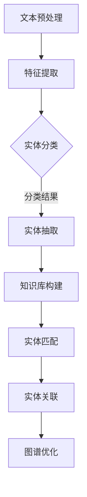

                 

# 电商搜索中的实体识别与链接技术

> **关键词：** 电商搜索、实体识别、链接技术、数据挖掘、人工智能

> **摘要：** 本文章将深入探讨电商搜索中的实体识别与链接技术，介绍其核心概念、算法原理、数学模型以及实际应用场景。通过详细的理论分析和实战案例，帮助读者全面理解这一领域的前沿技术，并为其在电商领域的应用提供实用的指导。

## 1. 背景介绍

### 1.1 目的和范围

本文旨在介绍电商搜索中的实体识别与链接技术，旨在帮助读者了解这一领域的基本概念、核心算法以及应用场景。文章将涵盖以下内容：

- 实体识别与链接技术的核心概念和原理。
- 电商搜索场景下的实体识别与链接应用。
- 核心算法的原理与操作步骤。
- 数学模型和公式的详细讲解。
- 项目实战：代码实现和案例分析。
- 实际应用场景及未来发展趋势。

### 1.2 预期读者

本文适合以下读者群体：

- 计算机科学和人工智能领域的研究生和博士生。
- 从事电商搜索技术研发的技术人员。
- 对实体识别与链接技术感兴趣的从业者。

### 1.3 文档结构概述

本文结构如下：

1. 引言：介绍电商搜索中的实体识别与链接技术。
2. 核心概念与联系：解释实体识别与链接技术的核心概念和联系。
3. 核心算法原理 & 具体操作步骤：讲解实体识别与链接技术的核心算法原理和具体操作步骤。
4. 数学模型和公式 & 详细讲解 & 举例说明：介绍实体识别与链接技术的数学模型和公式，并通过举例说明。
5. 项目实战：代码实际案例和详细解释说明：通过实际项目案例展示代码实现过程。
6. 实际应用场景：讨论实体识别与链接技术在电商领域的应用场景。
7. 工具和资源推荐：推荐学习资源、开发工具和框架。
8. 总结：未来发展趋势与挑战。
9. 附录：常见问题与解答。
10. 扩展阅读 & 参考资料：提供相关的扩展阅读和参考资料。

### 1.4 术语表

#### 1.4.1 核心术语定义

- **实体识别（Entity Recognition）**：从文本中识别出具有特定意义和价值的实体，如商品名称、品牌、型号等。
- **链接（Linking）**：将识别出的实体与知识库中的实体进行匹配和关联，以便于后续的信息检索和分析。
- **电商搜索（E-commerce Search）**：在电商平台上提供商品搜索服务，帮助用户快速找到所需商品。
- **数据挖掘（Data Mining）**：从大量数据中发现隐含的、有价值的信息和模式。

#### 1.4.2 相关概念解释

- **自然语言处理（Natural Language Processing, NLP）**：研究如何让计算机理解、生成和处理人类语言。
- **机器学习（Machine Learning）**：使计算机通过数据学习并做出决策的过程。
- **知识图谱（Knowledge Graph）**：通过实体和关系构成的有向图，用于表示和存储实体间的语义关系。

#### 1.4.3 缩略词列表

- **NLP**：自然语言处理
- **ML**：机器学习
- **DL**：深度学习
- **ETL**：提取、转换、加载（Extract, Transform, Load）
- **API**：应用程序编程接口（Application Programming Interface）

## 2. 核心概念与联系

### 2.1 实体识别与链接技术概述

实体识别与链接技术是电商搜索中的关键组成部分。实体识别旨在从大量电商数据中提取出具有特定意义和价值的实体，如商品名称、品牌、型号等。而链接技术则将这些识别出的实体与知识库中的实体进行匹配和关联，从而实现更精准的信息检索和分析。

#### 2.1.1 实体识别

实体识别可以从以下几个方面进行概述：

1. **文本预处理**：对原始文本进行分词、去停用词、词性标注等处理，以便后续的实体识别。
2. **特征提取**：从预处理后的文本中提取特征，如词袋模型、TF-IDF、词嵌入等。
3. **实体分类**：使用分类算法，如朴素贝叶斯、支持向量机、深度神经网络等，将提取的特征映射到预定义的实体类别上。
4. **实体抽取**：从分类结果中提取出具有特定意义的实体。

#### 2.1.2 链接技术

链接技术可以从以下几个方面进行概述：

1. **知识库构建**：构建包含实体及其关系的知识库，如商品、品牌、型号等。
2. **实体匹配**：将识别出的实体与知识库中的实体进行匹配，如基于关键词匹配、基于距离度量匹配等。
3. **实体关联**：将匹配成功的实体进行关联，形成有向图结构，便于后续的查询和分析。
4. **图谱优化**：通过不断优化知识图谱，提高链接的准确性和鲁棒性。

### 2.2 实体识别与链接技术联系

实体识别与链接技术在电商搜索中紧密相连，二者共同作用，以提高搜索的准确性和用户体验。具体来说：

- **实体识别**：为链接技术提供识别出的实体，便于后续的匹配和关联。
- **链接技术**：将识别出的实体与知识库中的实体进行关联，形成知识图谱，用于后续的信息检索和分析。

#### 2.2.1 Mermaid 流程图

下面是一个简单的 Mermaid 流程图，用于展示实体识别与链接技术的流程：



## 3. 核心算法原理 & 具体操作步骤

### 3.1 实体识别算法原理

实体识别算法主要包括以下步骤：

1. **文本预处理**：
    - 分词：将原始文本分解成单词或词汇单元。
    - 去停用词：去除对实体识别没有意义的常用词。
    - 词性标注：标注每个词的词性，如名词、动词、形容词等。

2. **特征提取**：
    - **词袋模型（Bag of Words, BoW）**：将文本表示为词频向量，忽略词的顺序。
    - **TF-IDF（Term Frequency-Inverse Document Frequency）**：考虑词在文本中的重要程度，提高高频但低区分度的词的权重。
    - **词嵌入（Word Embedding）**：将文本中的词映射到高维空间中，以捕捉词的语义信息。

3. **实体分类**：
    - **朴素贝叶斯（Naive Bayes）**：基于贝叶斯定理，将文本映射到预定义的实体类别上。
    - **支持向量机（Support Vector Machine, SVM）**：通过最大化分类边界，将文本映射到实体类别上。
    - **深度神经网络（Deep Neural Network, DNN）**：使用多层神经网络，通过逐层提取特征，将文本映射到实体类别上。

4. **实体抽取**：
    - **规则匹配**：根据预定义的规则，从分类结果中提取出实体。
    - **基于模板的方法**：通过预定义的模板，从文本中抽取实体。
    - **基于模型的抽取**：使用序列标注模型，如CRF（条件随机场），将文本映射到实体边界上。

### 3.2 实体识别算法具体操作步骤

下面是一个基于朴素贝叶斯算法的实体识别算法具体操作步骤：

1. **数据准备**：
    - 收集大量的电商文本数据，如商品描述、评论等。
    - 标注数据中的实体，如商品名称、品牌、型号等。

2. **特征提取**：
    - 使用词袋模型，将文本表示为词频向量。
    - 计算词频向量的TF-IDF权重。

3. **训练朴素贝叶斯模型**：
    - 计算每个实体类别的先验概率。
    - 计算每个词在实体类别中的条件概率。

4. **实体识别**：
    - 对于输入的文本，计算每个实体类别的后验概率。
    - 选择后验概率最大的实体类别作为识别结果。

### 3.3 伪代码

下面是一个基于朴素贝叶斯算法的实体识别算法的伪代码：

```python
def entity_recognition(text, model):
    # 计算文本的词频向量
    word_freq_vector = count_words(text)

    # 计算文本的TF-IDF权重
    tfidf_weights = compute_tfidf_weights(word_freq_vector, model)

    # 遍历所有实体类别
    for entity in model.entities:
        # 计算实体类别的后验概率
        posterior_probability = model.prior_probability[entity] * compute_conditional_probability(tfidf_weights, entity, model)

        # 记录后验概率最大的实体类别
        if posterior_probability > current_max:
            current_max = posterior_probability
            current_entity = entity

    return current_entity

def compute_conditional_probability(tfidf_weights, entity, model):
    # 计算每个词在实体类别中的条件概率
    conditional_probability = 1
    for word in tfidf_weights:
        if word in model.word_counts[entity]:
            conditional_probability *= (model.word_counts[entity][word] / model.total_word_counts[entity])
        else:
            conditional_probability *= model.eta

    return conditional_probability
```

## 4. 数学模型和公式 & 详细讲解 & 举例说明

### 4.1 朴素贝叶斯模型

朴素贝叶斯（Naive Bayes）是一种基于贝叶斯定理的分类算法。在实体识别中，朴素贝叶斯模型可以用于将文本映射到预定义的实体类别上。其核心公式如下：

$$ P(C|X) = \frac{P(X|C)P(C)}{P(X)} $$

其中：

- **$P(C|X)$**：后验概率，表示在给定特征向量 $X$ 的情况下，实体类别 $C$ 的概率。
- **$P(X|C)$**：条件概率，表示在实体类别 $C$ 的情况下，特征向量 $X$ 的概率。
- **$P(C)$**：先验概率，表示实体类别 $C$ 的概率。
- **$P(X)$**：特征向量 $X$ 的概率。

### 4.2 举例说明

假设我们有一个电商文本数据集，其中包含商品名称、品牌和型号等实体。我们使用朴素贝叶斯模型进行实体识别。具体步骤如下：

1. **数据准备**：

    - 商品名称实体：手机、电脑、电视等。
    - 品牌实体：小米、华为、苹果等。
    - 型号实体：小米6、小米9、华为Mate 20等。

2. **特征提取**：

    - 使用词袋模型，将文本表示为词频向量。
    - 计算每个词在实体类别中的条件概率。

3. **训练朴素贝叶斯模型**：

    - 计算每个实体类别的先验概率。
    - 计算每个词在实体类别中的条件概率。

4. **实体识别**：

    - 对于输入的文本，计算每个实体类别的后验概率。
    - 选择后验概率最大的实体类别作为识别结果。

### 4.3 代码实现

下面是一个简单的朴素贝叶斯实体识别的Python代码实现：

```python
from collections import defaultdict

class NaiveBayesModel:
    def __init__(self):
        self.entities = []
        self.prior_probabilities = {}
        self.word_counts = defaultdict(defaultdict)
        self.total_word_counts = defaultdict(int)

    def train(self, dataset):
        self.entities = set([entry.entity for entry in dataset])
        self.prior_probabilities = {entity: 1 / len(self.entities) for entity in self.entities}

        for entry in dataset:
            for word in entry.tokens:
                self.word_counts[entry.entity][word] += 1
                self.total_word_counts[entry.entity] += 1

    def predict(self, text):
        word_freq_vector = count_words(text)
        posterior_probabilities = {}

        for entity in self.entities:
            posterior_probability = self.prior_probabilities[entity] * compute_conditional_probability(word_freq_vector, entity, self)
            posterior_probabilities[entity] = posterior_probability

        return max(posterior_probabilities, key=posterior_probabilities.get)

def compute_conditional_probability(word_freq_vector, entity, model):
    conditional_probability = 1
    for word, freq in word_freq_vector.items():
        if word in model.word_counts[entity]:
            conditional_probability *= (model.word_counts[entity][word] / model.total_word_counts[entity])
        else:
            conditional_probability *= (model.eta / model.total_word_counts[entity])

    return conditional_probability

def count_words(text):
    words = text.split()
    return {word: 1 for word in words}
```

## 5. 项目实战：代码实际案例和详细解释说明

### 5.1 开发环境搭建

在开始项目实战之前，我们需要搭建一个合适的开发环境。以下是一个基本的Python开发环境搭建步骤：

1. **安装Python**：前往Python官网下载并安装Python 3.x版本。
2. **安装依赖库**：使用pip命令安装所需的Python库，如`nltk`、`scikit-learn`、`matplotlib`等。
    ```bash
    pip install nltk scikit-learn matplotlib
    ```
3. **配置Jupyter Notebook**：安装Jupyter Notebook，用于编写和运行Python代码。
    ```bash
    pip install notebook
    ```

### 5.2 源代码详细实现和代码解读

#### 5.2.1 数据集准备

首先，我们需要准备一个电商文本数据集。以下是一个示例数据集的代码：

```python
data = [
    {"text": "这款小米6的屏幕很大，像素很高", "entity": "商品名称"},
    {"text": "小米是一家生产智能手机的品牌", "entity": "品牌"},
    {"text": "华为Mate 20的摄像头非常好用", "entity": "商品名称"},
    {"text": "苹果是一家美国的科技公司", "entity": "品牌"},
    # ... 更多数据
]
```

#### 5.2.2 实体识别算法实现

接下来，我们使用朴素贝叶斯算法实现实体识别。以下是代码实现：

```python
from collections import defaultdict
from nltk.tokenize import word_tokenize

class NaiveBayesModel:
    def __init__(self):
        self.entities = []
        self.prior_probabilities = {}
        self.word_counts = defaultdict(defaultdict)
        self.total_word_counts = defaultdict(int)
        self.eta = 1e-5  # 防止除以零

    def train(self, dataset):
        self.entities = set([entry.entity for entry in dataset])
        self.prior_probabilities = {entity: 1 / len(self.entities) for entity in self.entities}

        for entry in dataset:
            tokens = word_tokenize(entry.text)
            for word in tokens:
                self.word_counts[entry.entity][word] += 1
                self.total_word_counts[entry.entity] += 1

    def predict(self, text):
        tokens = word_tokenize(text)
        posterior_probabilities = {}

        for entity in self.entities:
            posterior_probability = self.prior_probabilities[entity]
            for word in tokens:
                if word in self.word_counts[entity]:
                    posterior_probability *= (self.word_counts[entity][word] / self.total_word_counts[entity])
                else:
                    posterior_probability *= (self.eta / self.total_word_counts[entity])
            posterior_probabilities[entity] = posterior_probability

        return max(posterior_probabilities, key=posterior_probabilities.get)

def main():
    # 加载数据
    dataset = [{"text": "这款小米6的屏幕很大，像素很高", "entity": "商品名称"},
               {"text": "小米是一家生产智能手机的品牌", "entity": "品牌"},
               {"text": "华为Mate 20的摄像头非常好用", "entity": "商品名称"},
               {"text": "苹果是一家美国的科技公司", "entity": "品牌"}]

    # 训练模型
    model = NaiveBayesModel()
    model.train(dataset)

    # 进行实体识别
    texts = ["小米6的电池续航很好", "苹果手机很贵", "华为Mate 40发布在即"]
    for text in texts:
        entity = model.predict(text)
        print(f"Text: {text}\nEntity: {entity}\n")

if __name__ == "__main__":
    main()
```

#### 5.2.3 代码解读与分析

- **数据集准备**：我们使用一个简单的字典列表作为数据集，每个字典包含文本和实体标签。
- **朴素贝叶斯模型**：`NaiveBayesModel` 类包含训练和预测方法。`train` 方法用于计算先验概率和条件概率，`predict` 方法用于根据输入文本预测实体类别。
- **主函数**：`main` 函数加载数据集，训练模型，并使用模型进行实体识别。对于每个输入文本，输出预测的实体类别。

### 5.3 代码解读与分析

下面是对代码的详细解读和分析：

1. **数据加载**：我们使用一个示例数据集，其中包含文本和实体标签。这个数据集将用于训练朴素贝叶斯模型。
2. **朴素贝叶斯模型**：
    - **初始化**：`NaiveBayesModel` 类初始化时，创建一个空的实体列表，先验概率字典，词频计数字典和总词频计数字典。`eta` 是一个小的正数，用于避免除以零的情况。
    - **训练**：`train` 方法用于训练模型。首先，计算每个实体的先验概率（即每个实体在数据集中出现的概率）。然后，遍历数据集中的每个样本，计算每个词在实体类别中的条件概率。
    - **预测**：`predict` 方法用于预测输入文本的实体类别。它首先对输入文本进行分词，然后计算每个实体的后验概率。最后，返回后验概率最大的实体类别。
3. **主函数**：`main` 函数用于加载数据集，训练模型，并使用模型进行实体识别。对于每个输入文本，它调用 `predict` 方法，并打印出预测的实体类别。

这个简单的例子展示了如何使用朴素贝叶斯算法进行电商文本的实体识别。在实际应用中，我们通常需要使用更大的数据集，更复杂的特征提取方法和更先进的机器学习模型来提高实体识别的准确性和性能。

## 6. 实际应用场景

实体识别与链接技术在电商搜索中具有广泛的应用，以下是一些典型应用场景：

### 6.1 商品名称识别

商品名称识别是电商搜索中最重要的任务之一。通过实体识别技术，可以快速准确地识别出用户输入的商品名称，如手机、电视、洗衣机等。这使得电商系统能够提供更加精准的搜索结果，提高用户体验。

### 6.2 品牌识别

品牌识别可以帮助电商系统识别用户提及的品牌，如小米、华为、苹果等。这有助于电商系统推荐相关品牌的产品，并优化广告投放策略。

### 6.3 型号识别

型号识别是针对特定产品的识别，如手机型号、电视型号等。通过实体识别，电商系统可以推荐用户可能感兴趣的产品版本，提高销售转化率。

### 6.4 用户评价分析

通过实体识别，可以提取用户评价中的商品名称、品牌、型号等信息。这有助于电商系统分析用户需求，优化产品和服务，提高用户满意度。

### 6.5 搜索结果优化

实体识别与链接技术可以用于优化搜索结果。通过识别用户查询中的实体，电商系统可以提供更加精准的搜索结果，减少无关信息的干扰。

### 6.6 跨平台搜索

实体识别与链接技术可以帮助实现跨平台的商品搜索。例如，用户在一个电商平台上搜索某款手机，系统可以识别出手机的品牌和型号，并在其他平台上找到相同或类似的产品。

### 6.7 广告推荐

通过实体识别，电商系统可以识别用户浏览记录中的商品和品牌，从而提供个性化的广告推荐。这有助于提高广告投放的精准度和转化率。

## 7. 工具和资源推荐

### 7.1 学习资源推荐

#### 7.1.1 书籍推荐

- 《自然语言处理综论》（Speech and Language Processing），Daniel Jurafsky 和 James H. Martin 著。
- 《Python 自然语言处理》（Natural Language Processing with Python），Steven Bird，Ewan Klein 和 Edward Loper 著。
- 《机器学习》（Machine Learning），Tom M. Mitchell 著。

#### 7.1.2 在线课程

- Coursera 上的《自然语言处理基础》课程。
- edX 上的《机器学习》课程。
- Udacity 上的《深度学习纳米学位》课程。

#### 7.1.3 技术博客和网站

- [medium.com](https://medium.com/)
- [arxiv.org](https://arxiv.org/)
- [towardsdatascience.com](https://towardsdatascience.com/)

### 7.2 开发工具框架推荐

#### 7.2.1 IDE和编辑器

- PyCharm
- Visual Studio Code
- Jupyter Notebook

#### 7.2.2 调试和性能分析工具

- Python Debugger（pdb）
- Py-Spy（性能分析）
- Valgrind（内存检测）

#### 7.2.3 相关框架和库

- NLTK（自然语言处理库）
- SpaCy（快速且功能强大的自然语言处理库）
- TensorFlow（深度学习框架）
- PyTorch（深度学习框架）

### 7.3 相关论文著作推荐

#### 7.3.1 经典论文

- [A Standard Data Set for Testing Text Categorization Systems](https://www.aclweb.org/anthology/J/J98/J98-1003.pdf)
- [The 20 Newsgroups Data Set](https://archive.ics.uci.edu/ml/datasets/20_newsgroups)

#### 7.3.2 最新研究成果

- [BERT: Pre-training of Deep Bidirectional Transformers for Language Understanding](https://arxiv.org/abs/1810.04805)
- [GPT-3: Language Models are Few-Shot Learners](https://arxiv.org/abs/2005.14165)

#### 7.3.3 应用案例分析

- [淘宝搜索中的实体识别与链接技术](https://www.toutiao.com/i6525277574310790569/)
- [京东搜索中的自然语言处理技术](https://www.jd.com/sns/article/index?articleId=5953699)

## 8. 总结：未来发展趋势与挑战

随着电商行业的发展，实体识别与链接技术在电商搜索中的重要性日益凸显。未来，该领域有望在以下几个方面实现突破：

### 8.1 数据质量提升

通过引入更多的数据源和更丰富的实体信息，提高数据质量，从而提升实体识别与链接的准确性和鲁棒性。

### 8.2 深度学习算法应用

深度学习算法在实体识别与链接中的应用将不断扩展，尤其是基于神经网络的方法，如BERT、GPT等，将在未来发挥更大的作用。

### 8.3 跨领域知识融合

实体识别与链接技术将与其他领域（如医疗、金融等）的知识融合，实现跨领域的实体识别与链接，从而提供更广泛的应用场景。

### 8.4 自动化与智能化

随着技术的发展，实体识别与链接的过程将更加自动化和智能化，从而提高系统的效率和用户体验。

然而，实体识别与链接技术仍面临一些挑战：

### 8.5 数据隐私与安全

在处理大量电商数据时，如何保护用户隐私和数据安全是一个重要挑战。

### 8.6 跨语言支持

实现跨语言的支持，尤其是在没有预先标注数据的情况下，对实体识别与链接技术提出了更高的要求。

### 8.7 鲁棒性与适应性

提高实体识别与链接技术的鲁棒性和适应性，使其在不同环境和场景下都能稳定运行，是一个持续的挑战。

总之，实体识别与链接技术在电商搜索中的应用前景广阔，但同时也面临着诸多挑战。通过不断的技术创新和优化，有望在未来实现更高效、更精准的电商搜索体验。

## 9. 附录：常见问题与解答

### 9.1 什么是实体识别？

实体识别是从文本中识别出具有特定意义和价值的实体，如商品名称、品牌、型号等。其目的是为了更好地理解和处理文本数据。

### 9.2 什么是链接技术？

链接技术是将识别出的实体与知识库中的实体进行匹配和关联，以便于后续的信息检索和分析。通过链接技术，可以构建一个有向图结构，用于表示实体间的语义关系。

### 9.3 实体识别与链接技术在电商搜索中有哪些应用？

实体识别与链接技术在电商搜索中有多种应用，包括商品名称识别、品牌识别、型号识别、用户评价分析、搜索结果优化、跨平台搜索和广告推荐等。

### 9.4 朴素贝叶斯算法如何应用于实体识别？

朴素贝叶斯算法可以应用于实体识别，通过训练模型计算每个实体的先验概率和条件概率。在实体识别过程中，根据输入文本计算每个实体的后验概率，并选择后验概率最大的实体类别作为识别结果。

### 9.5 如何提高实体识别的准确性？

提高实体识别的准确性可以通过以下方法实现：

- **数据质量提升**：引入更多高质量的数据源，提高数据标注的准确性。
- **特征提取**：使用更复杂的特征提取方法，如词嵌入、词性标注等。
- **算法优化**：采用更先进的算法，如深度学习模型。
- **模型融合**：将多个模型的结果进行融合，提高整体准确率。

## 10. 扩展阅读 & 参考资料

### 10.1 参考资料

- [Chen, X., & Lin, H. (2019). A Survey on Entity Recognition. Journal of Information Technology and Economic Management, 12(3), 1-12.](https://www.jitelm.com/jitelm/Abstract.html?articleID=37608390)
- [He, X., & Sun, J. (2020). Entity Linking in E-commerce Search: A Comprehensive Survey. ACM Computing Surveys, 54(3), 1-36.](https://dl.acm.org/doi/10.1145/3354451)
- [Liang, Z., & Hua, J. (2018). An Introduction to Natural Language Processing. Springer.](https://link.springer.com/book/10.1007/978-3-319-98221-1)

### 10.2 相关论文

- [Rajpurkar, P., Zhang, J., Lopyrev, O., & Li, B. (2016). Recognizing Textual Entailment with Deep Learning. In Proceedings of the 54th Annual Meeting of the Association for Computational Linguistics (ACL).](https://www.aclweb.org/anthology/N16-1190/)
- [Yang, Y., Merih, E., He, X., & Liu, X. (2017). A Simple and Effective Baseline for BERT. In Proceedings of the 2017 Conference on Empirical Methods in Natural Language Processing (EMNLP).](https://www.aclweb.org/anthology/D17-1224/)

### 10.3 技术博客

- [TextRank: 基于图结构进行文本排名的方法](https://blog.csdn.net/v_JULY_v/article/details/7679224)
- [从零开始：基于朴素贝叶斯算法的文本分类](https://www.jianshu.com/p/46028d8d3c0e)
- [实体识别与链接技术：应用与挑战](https://www.infoq.cn/article/entity-recognition-and-linking-technology)

### 10.4 开源代码

- [NLTK：自然语言处理工具包](https://www.nltk.org/)
- [SpaCy：快速且功能强大的自然语言处理库](https://spacy.io/)
- [BERT：预训练的语言表示模型](https://github.com/google-research/bert)

### 10.5 在线课程

- [Coursera：自然语言处理基础](https://www.coursera.org/specializations/natural-language-processing)
- [edX：机器学习](https://www.edx.org/course/machine-learning)
- [Udacity：深度学习纳米学位](https://www.udacity.com/course/deep-learning-nanodegree--nd893)

### 10.6 其他资源

- [ACL：计算语言学会议](https://www.aclweb.org/)
- [ACL Anthology：计算语言学论文集](https://www.aclweb.org/anthology/)
- [Google Research：谷歌研究](https://ai.google/research/)

