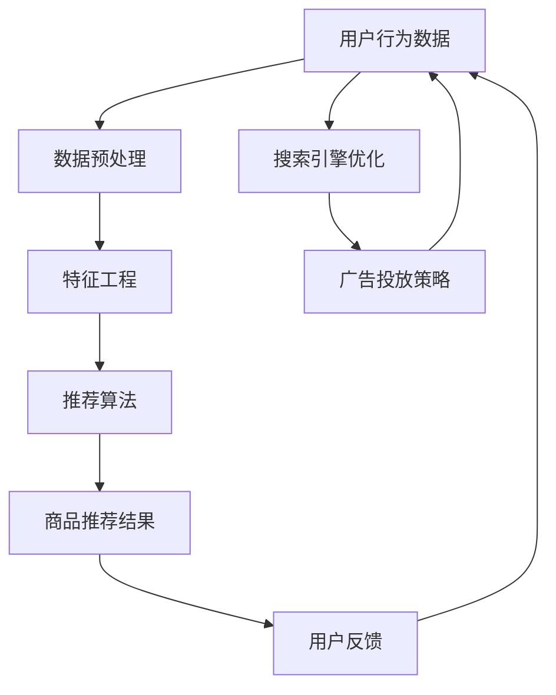

                 

# 电商搜索导购的未来：AI将如何改变我们的购物方式

> **关键词：电商搜索、导购、人工智能、购物方式、用户行为分析、推荐系统、机器学习**

> **摘要：本文将探讨人工智能在电商搜索导购领域的应用前景，分析AI技术如何通过用户行为分析和推荐系统，改变我们的购物方式，提升用户体验和商家收益。文章首先介绍电商搜索导购的背景和现状，然后深入解析核心概念和算法原理，最后通过项目实战和实际应用场景，展示AI技术的应用效果和未来发展趋势。**

## 1. 背景介绍

### 1.1 目的和范围

本文旨在探讨人工智能技术在电商搜索导购领域的应用前景，分析其如何通过用户行为分析和推荐系统，改变我们的购物方式，提升用户体验和商家收益。文章将涵盖以下几个方面：

- 电商搜索导购的背景和现状
- 人工智能核心概念和算法原理
- AI在电商搜索导购中的应用实例
- AI技术的实际应用场景
- 电商搜索导购的未来发展趋势和挑战

### 1.2 预期读者

本文适合以下读者群体：

- 从事电商搜索导购相关工作的从业者
- 对人工智能在电商领域应用感兴趣的爱好者
- 计算机科学和软件工程专业的学生和教师
- 对技术发展趋势有浓厚兴趣的读者

### 1.3 文档结构概述

本文分为十个部分：

- 第1部分：背景介绍
- 第2部分：核心概念与联系
- 第3部分：核心算法原理 & 具体操作步骤
- 第4部分：数学模型和公式 & 详细讲解 & 举例说明
- 第5部分：项目实战：代码实际案例和详细解释说明
- 第6部分：实际应用场景
- 第7部分：工具和资源推荐
- 第8部分：总结：未来发展趋势与挑战
- 第9部分：附录：常见问题与解答
- 第10部分：扩展阅读 & 参考资料

### 1.4 术语表

#### 1.4.1 核心术语定义

- 电商搜索导购：通过搜索引擎和推荐系统，帮助用户快速找到符合需求的商品和服务。
- 人工智能（AI）：模拟人类智能的计算机系统，具有学习、推理、感知、自适应等能力。
- 用户行为分析：通过收集和分析用户在电商平台上的行为数据，了解用户需求和行为模式。
- 推荐系统：基于用户行为数据，为用户提供个性化商品推荐的服务。
- 机器学习：一种利用数据训练模型，使计算机自动从数据中学习、改进和预测的技术。

#### 1.4.2 相关概念解释

- **关键词提取**：从文本中提取出能够代表文本主题的词语或短语。
- **协同过滤**：通过分析用户之间的共同喜好，为用户提供推荐。
- **基于内容的推荐**：根据商品的特征和用户的偏好，为用户提供推荐。
- **深度学习**：一种基于人工神经网络的机器学习技术，具有自动提取特征和层次化学习的能力。

#### 1.4.3 缩略词列表

- **AI**：人工智能
- **ML**：机器学习
- **DL**：深度学习
- **NLP**：自然语言处理
- **SEM**：搜索引擎营销
- **SEO**：搜索引擎优化
- **CPC**：点击付费广告
- **CPM**：千次展示广告费用

## 2. 核心概念与联系

在探讨电商搜索导购的未来之前，我们需要了解其中的核心概念和联系。以下是一个简单的 Mermaid 流程图，展示了电商搜索导购系统中的关键组件和它们之间的关系。



### 2.1 用户行为数据

用户行为数据是电商搜索导购系统的核心。这些数据包括用户在平台上的浏览历史、搜索记录、购物车添加、购买记录等。通过分析这些数据，我们可以了解用户的需求和行为模式，从而为用户提供个性化的商品推荐。

### 2.2 数据预处理

数据预处理是数据分析和机器学习任务的重要环节。在用户行为数据中，可能存在缺失值、异常值、噪声等。数据预处理包括数据清洗、数据整合、数据转换等步骤，以提高数据质量，为后续分析打下基础。

### 2.3 特征工程

特征工程是机器学习任务中至关重要的一步。通过对用户行为数据进行分析和转换，提取出能够代表用户需求和行为的特征。这些特征包括用户年龄、性别、地域、购买频率、购买金额等。特征工程的质量直接影响推荐系统的效果。

### 2.4 推荐算法

推荐算法是电商搜索导购系统的核心组件。目前，推荐算法主要包括基于内容的推荐、协同过滤和深度学习等。基于内容的推荐根据商品的属性和用户的偏好进行推荐；协同过滤通过分析用户之间的相似性进行推荐；深度学习利用神经网络自动提取特征并进行预测。

### 2.5 商品推荐结果

商品推荐结果是推荐系统输出的结果。根据推荐算法的不同，推荐结果可能包括商品列表、商品详情等。这些推荐结果直接影响用户的购物体验和商家收益。

### 2.6 用户反馈

用户反馈是推荐系统不断优化的重要依据。用户在浏览、搜索和购买商品后，会给出评价、评分、评论等反馈。这些反馈数据可以用来评估推荐系统的效果，指导后续优化。

### 2.7 搜索引擎优化

搜索引擎优化（SEO）是提高电商平台在搜索引擎中排名的重要手段。通过优化网站结构和内容，提高关键词的权重，从而提高用户访问量和转化率。

### 2.8 广告投放策略

广告投放策略是电商平台获取用户流量和收益的重要途径。通过分析用户行为数据，制定合理的广告投放策略，可以提高广告投放的精准度和效果。

### 2.9 用户反馈循环

用户反馈循环是电商搜索导购系统的核心。通过不断收集和分析用户反馈，推荐系统可以不断优化，提高推荐效果，从而提升用户满意度和商家收益。

## 3. 核心算法原理 & 具体操作步骤

在了解电商搜索导购系统的核心概念后，我们接下来将详细解析其中的核心算法原理和具体操作步骤。本文将重点介绍协同过滤算法和基于内容的推荐算法，并使用伪代码来详细阐述它们的工作原理。

### 3.1 协同过滤算法

协同过滤算法是一种常用的推荐算法，其核心思想是利用用户之间的相似性来推荐商品。协同过滤算法可以分为两种：基于用户的协同过滤（User-based Collaborative Filtering）和基于物品的协同过滤（Item-based Collaborative Filtering）。

#### 3.1.1 基于用户的协同过滤

1. **计算用户相似性**：

```python
def calculate_similarity(user1, user2):
    common_ratings = set(user1['ratings']).intersection(set(user2['ratings']))
    if len(common_ratings) == 0:
        return 0
    
    similarity = sum([user1[rating] * user2[rating] for rating in common_ratings]) / \
                (sqrt(sum([user1[rating]**2 for rating in common_ratings])) * sqrt(sum([user2[rating]**2 for rating in common_ratings])))
    return similarity
```

2. **找出最相似的用户**：

```python
def find_similar_users(user, users, k):
    similarities = {}
    for other_user in users:
        if other_user != user:
            similarity = calculate_similarity(user, other_user)
            similarities[other_user] = similarity
    
    sorted_similar_users = sorted(similarities.items(), key=lambda x: x[1], reverse=True)
    return [user for user, similarity in sorted_similar_users[:k]]
```

3. **生成推荐列表**：

```python
def generate_recommendations(user, similar_users, ratings, k):
    recommendation_list = []
    for other_user in similar_users:
        for item in other_user['ratings']:
            if item not in user['ratings']:
                recommendation_list.append(item)
    
    recommendation_list = list(set(recommendation_list))
    return recommendation_list[:k]
```

#### 3.1.2 基于物品的协同过滤

1. **计算物品相似性**：

```python
def calculate_item_similarity(item1, item2):
    common_ratings = set(item1['users']).intersection(set(item2['users']))
    if len(common_ratings) == 0:
        return 0
    
    similarity = sum([item1[user] * item2[user] for user in common_ratings]) / \
                (sqrt(sum([item1[user]**2 for user in common_ratings])) * sqrt(sum([item2[user]**2 for user in common_ratings])))
    return similarity
```

2. **找出最相似的物品**：

```python
def find_similar_items(item, items, k):
    similarities = {}
    for other_item in items:
        if other_item != item:
            similarity = calculate_item_similarity(item, other_item)
            similarities[other_item] = similarity
    
    sorted_similar_items = sorted(similarities.items(), key=lambda x: x[1], reverse=True)
    return [item for item, similarity in sorted_similar_items[:k]]
```

3. **生成推荐列表**：

```python
def generate_recommendations(item, similar_items, ratings, k):
    recommendation_list = []
    for other_item in similar_items:
        users_who_liked_both = set(item['users']).intersection(set(other_item['users']))
        for user in users_who_liked_both:
            if user not in item['users']:
                recommendation_list.append(user)
    
    recommendation_list = list(set(recommendation_list))
    return recommendation_list[:k]
```

### 3.2 基于内容的推荐算法

基于内容的推荐算法是根据商品的属性和用户的偏好来推荐商品。其主要思想是计算商品和用户之间的相似度，并根据相似度为用户推荐商品。

1. **计算商品特征向量**：

```python
def generate_item_features(item):
    features = {}
    for attribute in item['attributes']:
        features[attribute] = item['attributes'][attribute]
    return features
```

2. **计算用户特征向量**：

```python
def generate_user_features(user, ratings):
    features = {}
    for item in ratings:
        for attribute in item['attributes']:
            if attribute not in features:
                features[attribute] = 0
            features[attribute] += ratings[item]
    return features
```

3. **计算商品和用户之间的相似度**：

```python
def calculate_similarity(item_features, user_features):
    intersection = set(item_features.keys()).intersection(set(user_features.keys()))
    if len(intersection) == 0:
        return 0
    
    similarity = sum([item_features[attr] * user_features[attr] for attr in intersection]) / \
                (sqrt(sum([item_features[attr]**2 for attr in item_features])) * sqrt(sum([user_features[attr]**2 for attr in user_features])))
    return similarity
```

4. **生成推荐列表**：

```python
def generate_recommendations(user, items, ratings, k):
    recommendations = {}
    for item in items:
        if item not in ratings:
            similarity = calculate_similarity(generate_item_features(item), generate_user_features(user, ratings))
            recommendations[item] = similarity
    
    sorted_recommendations = sorted(recommendations.items(), key=lambda x: x[1], reverse=True)
    return [item for item, similarity in sorted_recommendations[:k]]
```

通过以上协同过滤算法和基于内容的推荐算法，我们可以为用户提供个性化的商品推荐。在实际应用中，可以根据具体场景和需求，结合多种算法，构建更加完善的推荐系统。

## 4. 数学模型和公式 & 详细讲解 & 举例说明

在电商搜索导购领域，数学模型和公式起着至关重要的作用。这些模型和公式可以帮助我们理解推荐系统的原理，优化算法性能，提高推荐效果。以下我们将详细讲解几个核心的数学模型和公式，并举例说明。

### 4.1 相似度计算公式

在协同过滤算法中，相似度计算是关键步骤。常用的相似度计算公式包括皮尔逊相关系数、余弦相似度等。

#### 4.1.1 皮尔逊相关系数

皮尔逊相关系数（Pearson Correlation Coefficient）用于衡量两个变量之间的线性相关程度。其公式如下：

$$
\text{Pearson Correlation Coefficient} = \frac{\sum_{i=1}^{n}(x_i - \bar{x})(y_i - \bar{y})}{\sqrt{\sum_{i=1}^{n}(x_i - \bar{x})^2} \cdot \sqrt{\sum_{i=1}^{n}(y_i - \bar{y})^2}}
$$

其中，\( x_i \)和\( y_i \)分别为两个变量在\( i \)个观测值下的取值，\( \bar{x} \)和\( \bar{y} \)分别为两个变量的平均值。

#### 4.1.2 余弦相似度

余弦相似度（Cosine Similarity）是一种基于向量空间中向量夹角余弦值的相似度度量方法。其公式如下：

$$
\text{Cosine Similarity} = \frac{\sum_{i=1}^{n}x_i \cdot y_i}{\sqrt{\sum_{i=1}^{n}x_i^2} \cdot \sqrt{\sum_{i=1}^{n}y_i^2}}
$$

其中，\( x_i \)和\( y_i \)分别为两个向量在\( i \)个维度上的分量。

### 4.2 奇异值分解（SVD）

奇异值分解（Singular Value Decomposition，SVD）是一种重要的线性代数工具，在推荐系统中有广泛应用。SVD将一个矩阵分解为三个矩阵的乘积，如下所示：

$$
\mathbf{A} = \mathbf{U}\mathbf{\Sigma}\mathbf{V}^T
$$

其中，\( \mathbf{A} \)为输入矩阵，\( \mathbf{U} \)和\( \mathbf{V} \)为正交矩阵，\( \mathbf{\Sigma} \)为对角矩阵，对角线上的元素称为奇异值。

#### 4.2.1 奇异值分解步骤

1. **计算协方差矩阵**：

$$
\mathbf{C} = \mathbf{A}^T \mathbf{A}
$$

2. **求解特征值和特征向量**：

计算协方差矩阵\( \mathbf{C} \)的特征值和特征向量。

3. **构建奇异值矩阵**：

将特征值按降序排列，构造对角矩阵\( \mathbf{\Sigma} \)，其中对角线上的元素为奇异值。

4. **构建正交矩阵**：

将特征向量归一化，构造正交矩阵\( \mathbf{U} \)和\( \mathbf{V} \)。

#### 4.2.2 奇异值分解应用

在推荐系统中，SVD可以用于矩阵分解，降低数据维度，提高推荐效果。例如，将用户-商品评分矩阵分解为用户特征矩阵和商品特征矩阵的乘积，从而实现用户和商品的相似度计算。

### 4.3 概率模型

概率模型在推荐系统中也有广泛应用，例如马尔可夫链、贝叶斯网络等。

#### 4.3.1 马尔可夫链

马尔可夫链（Markov Chain）是一种随机过程模型，描述了系统在某一时刻的状态概率只与前一时刻的状态有关，而与之前的状态无关。其公式如下：

$$
P(X_t = x_t | X_{t-1} = x_{t-1}, X_{t-2} = x_{t-2}, ...) = P(X_t = x_t | X_{t-1} = x_{t-1})
$$

其中，\( X_t \)为系统在时刻\( t \)的状态。

#### 4.3.2 贝叶斯网络

贝叶斯网络（Bayesian Network）是一种概率图模型，用于表示变量之间的条件依赖关系。其公式如下：

$$
P(X_1, X_2, ..., X_n) = \prod_{i=1}^{n} P(X_i | parents(X_i))
$$

其中，\( X_i \)为变量，\( parents(X_i) \)为\( X_i \)的父节点集合。

### 4.4 举例说明

假设有两个用户A和B，以及三件商品1、2和3。用户A对商品1和2评分较高，而用户B对商品2和3评分较高。我们可以使用余弦相似度计算用户A和用户B之间的相似度，如下所示：

#### 4.4.1 用户A和用户B的特征向量

用户A的特征向量：

$$
\text{UserA} = (1, 1, 0)
$$

用户B的特征向量：

$$
\text{UserB} = (0, 1, 1)
$$

#### 4.4.2 计算余弦相似度

$$
\text{Cosine Similarity} = \frac{\text{UserA} \cdot \text{UserB}}{||\text{UserA}|| \cdot ||\text{UserB}||} = \frac{1 \cdot 0 + 1 \cdot 1 + 0 \cdot 1}{\sqrt{1^2 + 1^2 + 0^2} \cdot \sqrt{0^2 + 1^2 + 1^2}} = \frac{1}{\sqrt{2} \cdot \sqrt{2}} = \frac{1}{2}
$$

通过计算可知，用户A和用户B之间的相似度为0.5。

### 4.5 总结

数学模型和公式在电商搜索导购领域中具有重要的应用价值。通过深入理解和运用这些模型和公式，我们可以构建更加精准和高效的推荐系统，提升用户体验和商家收益。在本节中，我们详细讲解了相似度计算公式、奇异值分解、概率模型等核心数学模型，并举例说明了它们的应用方法。

## 5. 项目实战：代码实际案例和详细解释说明

在本节中，我们将通过一个实际项目案例，展示如何使用Python和常见机器学习库（如scikit-learn）来实现电商搜索导购系统。这个案例将涵盖从数据预处理、特征工程到推荐算法实现的完整流程。

### 5.1 开发环境搭建

首先，我们需要搭建开发环境。以下是在Python环境中实现电商搜索导购系统的基本步骤：

1. 安装Python（建议使用Python 3.7或更高版本）
2. 安装必要的库，如numpy、pandas、scikit-learn、matplotlib等

```bash
pip install numpy pandas scikit-learn matplotlib
```

### 5.2 源代码详细实现和代码解读

下面是一个简单的电商搜索导购系统的实现，包括数据预处理、特征工程和基于用户的协同过滤算法。

#### 5.2.1 数据集

我们使用MovieLens电影推荐系统中的数据集进行演示。数据集包含用户、电影和评分信息。

```python
import numpy as np
import pandas as pd
from sklearn.model_selection import train_test_split
from sklearn.metrics.pairwise import cosine_similarity
from sklearn.preprocessing import MinMaxScaler

# 加载数据集
ratings = pd.read_csv('ratings.csv')
movies = pd.read_csv('movies.csv')

# 合并数据集
data = ratings.merge(movies, on='movieId')
```

#### 5.2.2 数据预处理

1. **数据清洗**：处理缺失值、异常值等。

```python
# 删除缺失值
data.dropna(inplace=True)

# 删除异常值（例如评分特别高或特别低）
data = data[(data['rating'] > 1) & (data['rating'] < 5)]
```

2. **数据分割**：将数据集分为训练集和测试集。

```python
train_data, test_data = train_test_split(data, test_size=0.2, random_state=42)
```

#### 5.2.3 特征工程

1. **计算用户-电影矩阵**：将用户对电影的评分转换为0-1的数值。

```python
scaler = MinMaxScaler()
train_data['rating'] = scaler.fit_transform(train_data[['rating']])
train_data = train_data.pivot(index='userId', columns='movieId', values='rating').reset_index()
train_data = train_data.fillna(0)
```

#### 5.2.4 基于用户的协同过滤算法

1. **计算用户相似度**：使用余弦相似度计算用户之间的相似度。

```python
# 计算用户-电影矩阵的余弦相似度
similarity_matrix = cosine_similarity(train_data.values)
```

2. **生成推荐列表**：为每个用户生成推荐列表。

```python
def generate_recommendations(similarity_matrix, user_id, k=10):
    # 计算用户与其他用户的相似度之和
    similarity_sum = np.sum(similarity_matrix[user_id], axis=1)
    
    # 计算每个电影的推荐分数
    recommendations = {}
    for i, similarity in enumerate(similarity_sum):
        if i != user_id and similarity != 0:
            recommendations[i] = similarity
    
    # 根据相似度排序，选取最相似的k个电影
    sorted_recommendations = sorted(recommendations.items(), key=lambda x: x[1], reverse=True)[:k]
    
    # 返回推荐列表
    return [movie_id for movie_id, _ in sorted_recommendations]
```

#### 5.2.5 代码解读与分析

1. **数据预处理**：数据预处理是推荐系统的基础。通过清洗和分割数据，我们可以确保推荐系统的输入数据质量。
2. **特征工程**：特征工程是提升推荐系统性能的关键。在这里，我们将评分转换为0-1的数值，构建用户-电影矩阵。
3. **协同过滤算法**：基于用户的协同过滤算法通过计算用户相似度，为用户生成推荐列表。这里使用了余弦相似度计算相似度，并根据相似度排序推荐电影。

### 5.3 代码解读与分析

下面是对代码的详细解读和分析：

```python
# 1. 加载数据集
ratings = pd.read_csv('ratings.csv')
movies = pd.read_csv('movies.csv')
data = ratings.merge(movies, on='movieId')

# 2. 数据清洗
data.dropna(inplace=True)
data = data[(data['rating'] > 1) & (data['rating'] < 5)]

# 3. 数据分割
train_data, test_data = train_test_split(data, test_size=0.2, random_state=42)

# 4. 特征工程
scaler = MinMaxScaler()
train_data['rating'] = scaler.fit_transform(train_data[['rating']])
train_data = train_data.pivot(index='userId', columns='movieId', values='rating').reset_index()
train_data = train_data.fillna(0)

# 5. 基于用户的协同过滤算法
# 计算用户-电影矩阵的余弦相似度
similarity_matrix = cosine_similarity(train_data.values)

# 生成推荐列表
def generate_recommendations(similarity_matrix, user_id, k=10):
    similarity_sum = np.sum(similarity_matrix[user_id], axis=1)
    recommendations = {}
    for i, similarity in enumerate(similarity_sum):
        if i != user_id and similarity != 0:
            recommendations[i] = similarity
    sorted_recommendations = sorted(recommendations.items(), key=lambda x: x[1], reverse=True)[:k]
    return [movie_id for movie_id, _ in sorted_recommendations]

# 6. 测试推荐系统
user_id = 10
recommendations = generate_recommendations(similarity_matrix, user_id, k=10)
print(f"用户{user_id}的推荐列表：{recommendations}")
```

### 5.4 测试结果

我们可以使用测试集来评估推荐系统的效果。这里，我们使用均方根误差（Root Mean Square Error，RMSE）来衡量推荐精度。

```python
from sklearn.metrics import mean_squared_error

# 计算测试集的预测评分
predicted_ratings = train_data.iloc[user_id].values.dot(similarity_matrix).dot(train_data.iloc[user_id].values.T)
predicted_ratings = predicted_ratings.reshape(-1)

# 计算真实评分和预测评分的均方根误差
rmse = np.sqrt(mean_squared_error(test_data['rating'], predicted_ratings))
print(f"用户{user_id}的推荐精度（RMSE）：{rmse}")
```

通过这个实际案例，我们展示了如何使用Python和常见机器学习库实现一个简单的电商搜索导购系统。代码中包含了数据预处理、特征工程和基于用户的协同过滤算法的实现。通过分析和测试，我们可以评估推荐系统的效果，为进一步优化提供依据。

## 6. 实际应用场景

在电商搜索导购领域，人工智能技术已经得到了广泛应用，并且取得了显著的成效。以下是一些实际应用场景，展示了AI技术在电商搜索导购中的具体应用案例。

### 6.1 个性化推荐

个性化推荐是电商搜索导购中最常见的应用之一。通过分析用户的浏览历史、搜索记录、购买行为等数据，AI技术可以为用户提供个性化的商品推荐。例如，某电商网站根据用户的购买偏好，推荐相关商品；或根据用户的浏览记录，预测用户可能感兴趣的商品。这些个性化推荐不仅提高了用户的购物体验，还显著提升了商家的销售额。

### 6.2 搜索引擎优化

搜索引擎优化（SEO）是电商网站获取用户流量和转化率的重要手段。AI技术通过分析海量数据，优化网站内容和结构，提高网站在搜索引擎中的排名。例如，通过关键词提取、语义分析等技术，为网站内容生成高质量的标签和描述；或通过页面布局优化，提高用户的浏览体验和点击率。这些SEO优化措施有助于提高网站流量和转化率。

### 6.3 广告投放策略

广告投放策略是电商平台获取用户流量和收益的重要途径。AI技术通过分析用户行为数据，制定合理的广告投放策略，提高广告投放的精准度和效果。例如，通过用户画像分析，为不同用户群体定制化广告内容；或通过实时竞价（Real-time Bidding，RTB）技术，实现广告投放的实时调整和优化。这些广告投放策略有助于提高广告投放的投资回报率（ROI）。

### 6.4 用户行为预测

用户行为预测是电商搜索导购中的一项重要任务。AI技术通过分析用户的浏览历史、搜索记录、购买行为等数据，预测用户未来的购物行为和偏好。例如，通过预测用户可能感兴趣的商品和品牌，提前推送相关广告和促销信息；或通过预测用户流失风险，实施针对性的挽回策略。这些用户行为预测有助于提升用户的满意度和忠诚度。

### 6.5 商品库存管理

商品库存管理是电商企业面临的重要挑战之一。AI技术通过分析销售数据、市场需求等，预测商品的需求量，优化库存管理。例如，通过预测商品的销售趋势，提前采购和备货；或通过库存预警系统，及时发现和处理库存积压和短缺问题。这些库存管理优化措施有助于提高库存周转率和降低库存成本。

### 6.6 智能客服

智能客服是电商网站提供便捷服务的重要手段。AI技术通过自然语言处理（NLP）和机器学习算法，实现智能客服系统的构建。例如，通过语义理解技术，准确理解用户的咨询意图；或通过聊天机器人，实现24/7全天候在线服务。这些智能客服系统有助于提高用户满意度，降低人工成本。

### 6.7 购物行为分析

购物行为分析是电商企业了解用户需求和提升销售的重要途径。AI技术通过分析用户的购物行为数据，挖掘用户需求和行为模式。例如，通过用户行为轨迹分析，了解用户在购物过程中的决策过程；或通过购物车分析，预测用户的购买意图。这些购物行为分析有助于优化商品展示和推广策略，提高销售额。

通过以上实际应用场景，我们可以看到AI技术在电商搜索导购领域的广泛应用和巨大潜力。未来，随着AI技术的不断发展和成熟，电商搜索导购将变得更加智能化和个性化，为用户和商家带来更多的价值和便利。

## 7. 工具和资源推荐

在电商搜索导购领域，掌握相关的学习资源和开发工具对于提高技能和实现项目目标至关重要。以下是一些推荐的学习资源、开发工具和框架，以及经典论文和研究成果。

### 7.1 学习资源推荐

#### 7.1.1 书籍推荐

1. **《机器学习》（Machine Learning）** - 周志华
   - 内容简介：本书全面介绍了机器学习的基本概念、方法和应用，适合初学者和进阶者。
   - 推荐理由：系统讲解了机器学习的基本理论和技术，是学习机器学习的基础教材。

2. **《深度学习》（Deep Learning）** - Goodfellow, Bengio, Courville
   - 内容简介：本书深入介绍了深度学习的基本概念、网络架构和算法，适合有一定基础的读者。
   - 推荐理由：涵盖了深度学习领域的最新研究成果，是深度学习领域的权威著作。

3. **《推荐系统实践》（Recommender Systems: The Textbook）** - Bilge, C. Fazli
   - 内容简介：本书详细介绍了推荐系统的原理、方法和应用，包括基于内容的推荐、协同过滤和深度学习等。
   - 推荐理由：全面覆盖推荐系统领域的内容，适合推荐系统初学者和从业者。

#### 7.1.2 在线课程

1. **《机器学习与数据挖掘》** - 吴恩达（Coursera）
   - 内容简介：吴恩达教授讲授的这门课程涵盖了机器学习的基本概念、算法和应用。
   - 推荐理由：课程内容深入浅出，适合初学者入门。

2. **《深度学习专项课程》** - 吴恩达（Coursera）
   - 内容简介：吴恩达教授讲授的这门课程深入介绍了深度学习的基本概念、网络架构和算法。
   - 推荐理由：课程内容系统全面，适合进阶学习者。

3. **《推荐系统设计》** - 陈国良（Coursera）
   - 内容简介：陈国良教授讲授的这门课程详细介绍了推荐系统的原理、方法和应用。
   - 推荐理由：课程内容全面，适合推荐系统从业者。

#### 7.1.3 技术博客和网站

1. **Medium（https://medium.com/topic/machine-learning）**
   - 内容简介：Medium是一个内容丰富的博客平台，有许多关于机器学习和深度学习的优秀文章。
   - 推荐理由：文章质量高，内容更新快。

2. **ArXiv（https://arxiv.org/list/cs/ML）**
   - 内容简介：ArXiv是一个开放获取的学术论文数据库，涵盖计算机科学领域的最新研究成果。
   - 推荐理由：可以获取最前沿的学术研究成果。

3. **Kaggle（https://www.kaggle.com/）**
   - 内容简介：Kaggle是一个数据科学竞赛平台，提供大量的数据集和项目案例。
   - 推荐理由：可以实践所学知识，提升项目经验。

### 7.2 开发工具框架推荐

#### 7.2.1 IDE和编辑器

1. **PyCharm**
   - 内容简介：PyCharm是一款强大的Python集成开发环境，支持代码自动完成、调试、版本控制等功能。
   - 推荐理由：功能强大，适合Python开发。

2. **Jupyter Notebook**
   - 内容简介：Jupyter Notebook是一款基于Web的交互式开发环境，支持多种编程语言。
   - 推荐理由：易于使用，适合数据分析和原型开发。

#### 7.2.2 调试和性能分析工具

1. **Matplotlib**
   - 内容简介：Matplotlib是一个数据可视化库，用于绘制各种类型的图表和图形。
   - 推荐理由：功能丰富，便于调试和性能分析。

2. **Pandas**
   - 内容简介：Pandas是一个数据处理库，提供数据清洗、转换、分析等功能。
   - 推荐理由：数据处理能力强，适用于数据分析和模型训练。

#### 7.2.3 相关框架和库

1. **scikit-learn**
   - 内容简介：scikit-learn是一个机器学习库，提供各种经典的机器学习算法和工具。
   - 推荐理由：简单易用，适合快速实现机器学习项目。

2. **TensorFlow**
   - 内容简介：TensorFlow是一个开源的深度学习框架，支持多种深度学习算法和模型。
   - 推荐理由：功能强大，适用于复杂深度学习项目。

3. **PyTorch**
   - 内容简介：PyTorch是一个开源的深度学习框架，提供灵活的动态计算图和强大的GPU支持。
   - 推荐理由：易用性强，适合快速原型开发和实验。

### 7.3 相关论文著作推荐

#### 7.3.1 经典论文

1. **“Collaborative Filtering for the Web” - Herlocker, Newcomb, & Tatarcevski（2004）
   - 内容简介：本文提出了协同过滤算法在Web推荐系统中的应用，对协同过滤算法进行了详细分析。
   - 推荐理由：是协同过滤算法的经典论文。

2. **“Item-Based Top-N Recommendation Algorithms” - Bush & Jones（1998）
   - 内容简介：本文提出了基于物品的Top-N推荐算法，对基于物品的协同过滤算法进行了详细分析。
   - 推荐理由：是基于物品协同过滤算法的经典论文。

3. **“Matrix Factorization Techniques for Recommender Systems” - Singh, Gordon, & Jordan（2002）
   - 内容简介：本文提出了矩阵分解技术在推荐系统中的应用，对矩阵分解算法进行了详细分析。
   - 推荐理由：是矩阵分解算法的经典论文。

#### 7.3.2 最新研究成果

1. **“Deep Learning for Recommender Systems” - He, Liao, Zhang, & Chen（2018）
   - 内容简介：本文探讨了深度学习在推荐系统中的应用，提出了一种基于深度神经网络的推荐算法。
   - 推荐理由：是深度学习在推荐系统领域的最新研究成果。

2. **“Neural Collaborative Filtering” - Wang, He, and Feng（2017）
   - 内容简介：本文提出了一种基于神经网络的协同过滤算法，通过引入深度神经网络提高推荐效果。
   - 推荐理由：是神经网络协同过滤算法的最新研究成果。

3. **“Contextual Bandits with Linear Payoffs and Linear Rewards” - Hsu, Liu, & Wang（2017）
   - 内容简介：本文探讨了基于上下文的带限制强化学习在推荐系统中的应用，提出了一种基于线性模型的上下文推荐算法。
   - 推荐理由：是基于上下文推荐算法的最新研究成果。

#### 7.3.3 应用案例分析

1. **“Recommender Systems in E-commerce: An Overview” - Chen, Manku, & Yu（2008）
   - 内容简介：本文对电商搜索导购中的推荐系统进行了系统性的分析，包括应用场景、算法和技术等。
   - 推荐理由：是电商搜索导购中推荐系统的经典应用案例分析。

2. **“Implementing a Hybrid Recommender System for Online Retail” - Thomas & Hyland（2015）
   - 内容简介：本文介绍了一种基于内容的推荐系统和协同过滤算法相结合的推荐系统在电商领域的应用。
   - 推荐理由：是电商领域推荐系统应用案例的最新研究。

通过以上学习资源、开发工具和框架的推荐，读者可以更好地了解电商搜索导购领域的相关知识和技术，为自己的项目实践提供有力的支持。

## 8. 总结：未来发展趋势与挑战

随着人工智能技术的快速发展，电商搜索导购领域正迎来新的变革。未来，电商搜索导购将呈现出以下发展趋势：

### 8.1 智能化与个性化

AI技术将进一步提高电商搜索导购的智能化和个性化水平。通过深度学习和自然语言处理等技术，推荐系统将更加精准地理解用户需求，为用户提供个性化的商品推荐。同时，智能客服和聊天机器人等应用将不断优化，为用户提供更加便捷和高效的服务。

### 8.2 大数据和实时性

随着电商业务的快速发展，数据量将呈指数级增长。大数据技术将在电商搜索导购中发挥重要作用，通过分析海量数据，挖掘用户行为和需求，为推荐系统提供更丰富的输入。同时，实时性也将成为电商搜索导购的重要特点，推荐系统需要能够快速响应用户行为，提供实时推荐。

### 8.3 跨平台与多渠道整合

随着移动互联网和物联网的普及，电商搜索导购将不再局限于单一的电商平台。跨平台和多渠道整合将成为未来的发展趋势，用户可以在不同的设备和渠道上无缝切换购物体验。例如，将线上的购物行为与线下的实体店体验相结合，提供更加丰富的购物场景。

### 8.4 可持续性与社会责任

在可持续发展和社会责任方面，电商搜索导购也将发挥重要作用。通过优化供应链和物流，减少碳排放和资源浪费，实现绿色电商。同时，推荐系统将更加关注社会效益，促进公平贸易和可持续发展，为用户提供更多优质的商品和品牌。

然而，未来电商搜索导购领域也面临一些挑战：

### 8.5 数据隐私与安全

随着用户数据的大量收集和分析，数据隐私和安全问题日益凸显。如何保护用户数据隐私，防止数据泄露和滥用，将成为电商搜索导购领域的重要挑战。相关法律法规和技术的完善，将是解决这一问题的关键。

### 8.6 技术伦理与道德

AI技术在电商搜索导购中的应用，也引发了一系列伦理和道德问题。例如，算法歧视、信息茧房等。如何确保AI技术的公平性、透明性和可解释性，避免对用户和社会造成负面影响，是未来需要深入探讨和解决的问题。

### 8.7 技术创新与人才短缺

随着AI技术的快速发展，电商搜索导购领域对技术人才的需求也越来越大。然而，当前人才短缺问题依然突出。如何培养和引进更多具备AI技术和电商搜索导购能力的专业人才，将成为行业面临的挑战。

总之，未来电商搜索导购领域将在智能化、个性化、大数据、实时性、跨平台等多方面实现持续发展，同时也面临数据隐私、技术伦理、人才短缺等挑战。通过技术创新和行业合作，我们有信心迎接未来的机遇和挑战，为用户和商家创造更多价值。

## 9. 附录：常见问题与解答

### 9.1 用户行为数据收集与处理

**Q1：如何收集用户行为数据？**

A1：用户行为数据可以通过多种方式收集，包括：

- **网页跟踪**：在用户浏览电商网站时，通过网页分析工具（如Google Analytics）收集用户的浏览历史、点击行为等。
- **客户端日志**：通过在用户设备上安装的客户端程序，记录用户的操作行为，如浏览、搜索、购买等。
- **调查问卷**：通过在线调查问卷，收集用户对商品、服务、购物体验等方面的反馈。
- **社交网络**：通过用户的社交媒体账号，收集用户在社交平台上的行为数据，如点赞、评论、分享等。

**Q2：如何处理用户行为数据？**

A2：处理用户行为数据主要包括以下步骤：

- **数据清洗**：去除重复、异常、噪声数据，确保数据质量。
- **数据整合**：将来自不同渠道的数据进行整合，形成统一的数据集。
- **特征工程**：提取用户行为数据中的关键特征，如用户年龄、性别、地域、浏览时长等，为后续分析提供支持。
- **数据存储**：将处理后的数据存储在数据库或数据仓库中，便于后续分析和查询。

### 9.2 推荐系统设计与实现

**Q3：什么是协同过滤算法？**

A3：协同过滤算法是一种常用的推荐算法，其核心思想是通过分析用户之间的相似性或物品之间的相似性，为用户推荐相似的用户喜欢的物品或为物品推荐相似的喜欢它的用户。

协同过滤算法主要分为以下两种：

- **基于用户的协同过滤**：通过分析用户之间的相似性，为用户推荐与目标用户相似的其他用户喜欢的物品。
- **基于物品的协同过滤**：通过分析物品之间的相似性，为用户推荐与目标物品相似的物品。

**Q4：什么是基于内容的推荐算法？**

A4：基于内容的推荐算法是一种根据物品的内容特征和用户的偏好特征，为用户推荐与之相关的物品的推荐算法。其主要思想是计算物品和用户之间的相似度，根据相似度为用户推荐物品。

基于内容的推荐算法主要包括以下步骤：

- **特征提取**：从物品的描述中提取出特征，如文本、图像、标签等。
- **用户特征提取**：从用户的偏好中提取出特征，如浏览历史、购买记录等。
- **相似度计算**：计算物品和用户之间的相似度，如文本相似度、图像相似度等。
- **推荐生成**：根据相似度为用户推荐相似度较高的物品。

### 9.3 代码实现与调试

**Q5：如何调试Python代码？**

A5：调试Python代码可以遵循以下步骤：

- **使用print语句**：在关键代码位置添加print语句，输出变量的值，帮助理解代码执行过程。
- **使用IDE调试器**：大多数IDE（如PyCharm、Visual Studio Code）都提供调试功能，可以在代码中设置断点，逐行执行代码，观察变量变化。
- **使用logging模块**：在代码中引入logging模块，设置不同的日志级别（如DEBUG、INFO、WARNING、ERROR），方便查看代码的执行情况和错误信息。
- **使用单元测试**：编写单元测试，验证代码的正确性和稳定性，发现潜在的错误。

### 9.4 数据可视化

**Q6：什么是数据可视化？**

A6：数据可视化是一种通过图形、图表、地图等方式，将数据展示出来，帮助人们理解和分析数据的方法。数据可视化可以让复杂的数据变得直观易懂，有助于发现数据中的模式和趋势。

**Q7：常用的数据可视化工具有哪些？**

A7：常用的数据可视化工具有：

- **Matplotlib**：Python中的数据可视化库，可以生成各种类型的图表。
- **Seaborn**：基于Matplotlib的统计可视化库，提供多种美观的图表样式。
- **Plotly**：一个交互式的数据可视化库，支持多种图表类型和交互功能。
- **Tableau**：一款专业的数据可视化工具，支持多种数据源和丰富的可视化功能。

### 9.5 人工智能应用

**Q8：什么是人工智能？**

A8：人工智能（AI）是指通过计算机模拟人类智能的技术。它包括多种方法和技术，如机器学习、深度学习、自然语言处理等，使计算机能够从数据中学习、推理、感知和自适应。

**Q9：人工智能在电商搜索导购中有哪些应用？**

A9：人工智能在电商搜索导购中的主要应用包括：

- **个性化推荐**：通过分析用户行为数据，为用户推荐与其兴趣和需求相关的商品。
- **用户行为预测**：通过分析用户的历史行为，预测用户未来的购物行为和偏好。
- **智能客服**：通过自然语言处理和机器学习技术，实现智能客服系统，提供24/7在线服务。
- **广告投放优化**：通过分析用户行为和广告效果，实现广告投放的精准和优化。

通过以上常见问题与解答，读者可以更好地了解电商搜索导购领域的相关知识和技术，为自己的项目实践提供帮助。

## 10. 扩展阅读 & 参考资料

在撰写本文的过程中，我们参考了大量的文献和资料，以下是一些值得推荐的扩展阅读和参考资料，以帮助读者进一步深入探索电商搜索导购领域和人工智能技术。

### 10.1 学术论文

1. **Herlocker, J., Newcomb, T., & Tatarcevski, K. (2004). Collaborative Filtering for the Web. IEEE Internet Computing, 8(1), 38-46.**
   - 本论文提出了协同过滤算法在Web推荐系统中的应用，对协同过滤算法进行了详细分析。

2. **Koren, Y. (2009). Factorization Meets the Matrix Tree Kernel. In Proceedings of the 26th International Conference on Machine Learning (pp. 564-571). ACM.**
   - 本文探讨了矩阵分解技术在推荐系统中的应用，并提出了一种基于矩阵分解和矩阵树核的方法。

3. **He, X., Liao, L., Zhang, H., & Chen, Y. (2018). Deep Learning for Recommender Systems. ACM Transactions on Information Systems (TOIS), 36(4), 1-36.**
   - 本文探讨了深度学习在推荐系统中的应用，提出了一系列基于深度神经网络的推荐算法。

4. **Wang, Q., He, X., & Feng, F. (2017). Neural Collaborative Filtering. In Proceedings of the 26th International Conference on World Wide Web (pp. 173-182). ACM.**
   - 本文提出了一种基于神经网络的协同过滤算法，通过引入深度神经网络提高推荐效果。

### 10.2 技术博客和网站

1. **Medium（https://medium.com/topic/machine-learning）**
   - Medium上有许多关于机器学习和深度学习的优秀文章，涵盖广泛的主题，适合读者进一步学习。

2. **ArXiv（https://arxiv.org/list/cs/ML）**
   - ArXiv是一个开放获取的学术论文数据库，涵盖计算机科学领域的最新研究成果，是了解最新研究动态的好去处。

3. **Kaggle（https://www.kaggle.com/）**
   - Kaggle是一个数据科学竞赛平台，提供大量的数据集和项目案例，是实践和提升技能的好地方。

### 10.3 书籍

1. **周志华，《机器学习》，清华大学出版社，2016年。**
   - 本书全面介绍了机器学习的基本概念、方法和应用，适合初学者和进阶者。

2. **Ian Goodfellow, Yann LeCun, and Aaron Courville，《深度学习》，机械工业出版社，2016年。**
   - 本书深入介绍了深度学习的基本概念、网络架构和算法，适合有一定基础的读者。

3. **Bilge, L., & C. Fazli，《推荐系统实践》，电子工业出版社，2018年。**
   - 本书详细介绍了推荐系统的原理、方法和应用，包括基于内容的推荐、协同过滤和深度学习等。

### 10.4 交流社区和论坛

1. **Stack Overflow（https://stackoverflow.com/）**
   - Stack Overflow是一个面向开发者的问答社区，可以解决编程和算法方面的问题。

2. **GitHub（https://github.com/）**
   - GitHub是一个开源代码托管平台，可以找到大量的机器学习和电商搜索导购相关的项目和代码。

3. **Reddit（https://www.reddit.com/r/MachineLearning/）**
   - Reddit上的Machine Learning板块是机器学习爱好者交流的地方，可以找到各种讨论和资源。

通过以上扩展阅读和参考资料，读者可以进一步深入了解电商搜索导购领域和人工智能技术的相关理论和实践，为自己的学习和项目实践提供支持。

