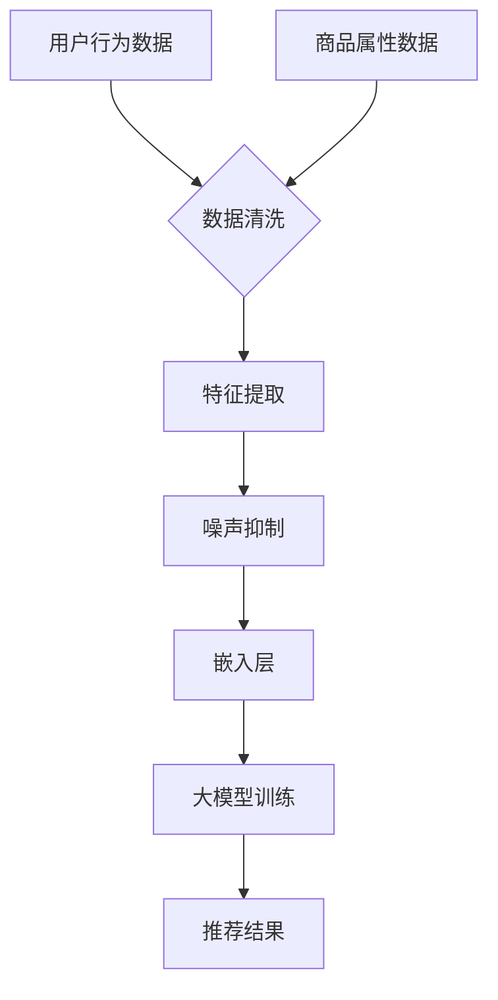

                 

# 电商搜索推荐中的AI大模型数据噪声处理技术应用实践

## 关键词
- 电商搜索推荐
- AI大模型
- 数据噪声处理
- 机器学习
- 数据预处理
- 深度学习

## 摘要
本文深入探讨电商搜索推荐系统中AI大模型数据噪声处理技术的应用实践。文章首先介绍电商搜索推荐系统的背景和挑战，然后详细解释AI大模型以及数据噪声处理的核心概念和原理。接着，通过逐步分析核心算法原理、数学模型和公式，结合实际项目实战案例，展示如何在实际场景中运用这些技术。最后，文章提供相关学习资源和工具推荐，并展望未来的发展趋势与挑战。

## 1. 背景介绍

### 1.1 目的和范围

本文旨在探讨电商搜索推荐系统中AI大模型数据噪声处理技术的应用实践。随着电商行业的迅猛发展，用户对于个性化搜索和推荐的需求日益增长，如何有效地处理数据噪声、提高推荐系统的准确性和用户体验成为关键问题。本文将围绕这一问题展开讨论，旨在为从事电商搜索推荐领域的开发者提供有价值的参考。

### 1.2 预期读者

本文适用于对电商搜索推荐系统和AI大模型有一定了解的读者，包括但不限于：
- 电商搜索推荐系统开发者
- 机器学习和数据科学家
- 计算机编程和技术爱好者
- 大数据和云计算工程师

### 1.3 文档结构概述

本文结构如下：
1. 引言和背景介绍
2. 核心概念与联系
3. 核心算法原理 & 具体操作步骤
4. 数学模型和公式 & 详细讲解 & 举例说明
5. 项目实战：代码实际案例和详细解释说明
6. 实际应用场景
7. 工具和资源推荐
8. 总结：未来发展趋势与挑战
9. 附录：常见问题与解答
10. 扩展阅读 & 参考资料

### 1.4 术语表

#### 1.4.1 核心术语定义

- **电商搜索推荐系统**：一种基于用户行为数据和商品属性的推荐系统，用于帮助用户在电商平台上找到感兴趣的商品。
- **AI大模型**：具有强大计算能力和处理复杂任务能力的深度学习模型，如BERT、GPT等。
- **数据噪声**：指数据中存在的无规律、无意义的信息，可能影响模型的训练效果和推荐准确性。
- **数据预处理**：在模型训练前对原始数据进行清洗、转换和规范化等操作，以提高模型训练效率和性能。
- **深度学习**：一种基于多层神经网络进行特征学习和模式识别的人工智能技术。

#### 1.4.2 相关概念解释

- **噪声抑制**：指通过算法和模型降低数据中的噪声，提高数据质量。
- **特征提取**：从原始数据中提取出对模型训练和预测有帮助的特征。
- **嵌入层**：在深度学习模型中，用于将输入数据映射到一个低维连续空间的层次。

#### 1.4.3 缩略词列表

- **BERT**：Bidirectional Encoder Representations from Transformers
- **GPT**：Generative Pre-trained Transformer
- **IDE**：Integrated Development Environment
- **LaTeX**：一种排版系统，常用于编写数学公式和文档。

## 2. 核心概念与联系

在本节中，我们将探讨电商搜索推荐系统中AI大模型数据噪声处理的核心概念和联系，通过Mermaid流程图展示相关原理和架构。

### 2.1 Mermaid流程图



### 2.2 核心概念解释

#### 2.2.1 数据清洗

数据清洗是数据预处理的重要环节，旨在去除数据中的噪声、缺失值和异常值，提高数据质量。具体步骤包括：
1. 去除重复数据
2. 处理缺失值
3. 标准化数据
4. 特征选择

#### 2.2.2 特征提取

特征提取是从原始数据中提取出对模型训练和预测有帮助的特征。在电商搜索推荐系统中，常用的特征包括用户行为数据（如浏览历史、购物车添加、购买记录等）和商品属性数据（如价格、类别、品牌等）。特征提取的目标是降低数据维度、提高模型训练效率和性能。

#### 2.2.3 噪声抑制

噪声抑制是指通过算法和模型降低数据中的噪声，提高数据质量。常用的方法包括：
1. 过滤噪声：使用统计方法或规则去除明显噪声。
2. 投票机制：通过多个模型的预测结果投票来降低噪声。
3. 聚类分析：将相似的数据点聚类在一起，去除噪声点。

#### 2.2.4 嵌入层

嵌入层是在深度学习模型中，用于将输入数据映射到一个低维连续空间的层次。通过嵌入层，原始数据中的噪声和冗余信息被有效降低，同时保留了数据中的重要特征。常用的嵌入层算法包括Word2Vec、Item2Vec等。

#### 2.2.5 大模型训练

大模型训练是指使用大量数据和计算资源训练深度学习模型，以提高模型对数据的拟合能力和泛化能力。常见的AI大模型包括BERT、GPT等，这些模型具有强大的计算能力和处理复杂任务的能力。

### 2.3 核心概念联系

电商搜索推荐系统中的核心概念和联系如图2-1所示。用户行为数据和商品属性数据经过数据清洗、特征提取和噪声抑制等预处理步骤，然后通过嵌入层映射到低维空间。最后，大模型利用这些预处理后的数据进行训练，生成推荐结果。


## 3. 核心算法原理 & 具体操作步骤

在本节中，我们将深入探讨电商搜索推荐系统中AI大模型数据噪声处理的核心算法原理，并通过伪代码详细阐述具体操作步骤。

### 3.1 数据清洗

数据清洗是数据预处理的第一步，旨在去除数据中的噪声、缺失值和异常值。以下是一个简单的数据清洗伪代码：

```python
def data_cleaning(data):
    # 去除重复数据
    data = remove_duplicates(data)
    # 处理缺失值
    data = handle_missing_values(data)
    # 标准化数据
    data = normalize_data(data)
    # 特征选择
    data = feature_selection(data)
    return data
```

### 3.2 特征提取

特征提取是从原始数据中提取出对模型训练和预测有帮助的特征。以下是一个简单的特征提取伪代码：

```python
def feature_extraction(data):
    # 构建用户行为特征
    user_behavior_features = build_user_behavior_features(data)
    # 构建商品属性特征
    item_features = build_item_features(data)
    return user_behavior_features, item_features
```

### 3.3 噪声抑制

噪声抑制是指通过算法和模型降低数据中的噪声，提高数据质量。以下是一个简单的噪声抑制伪代码：

```python
def noise_suppression(data):
    # 过滤噪声
    filtered_data = filter_noise(data)
    # 投票机制
    voted_data = voting_mechanism(filtered_data)
    # 聚类分析
    clustered_data = cluster_analysis(voted_data)
    return clustered_data
```

### 3.4 嵌入层

嵌入层是将输入数据映射到一个低维连续空间的层次。以下是一个简单的嵌入层伪代码：

```python
def embedding_layer(data):
    # 初始化嵌入层权重
    weights = initialize_weights()
    # 计算嵌入层输出
    embedded_data = compute_output(data, weights)
    return embedded_data
```

### 3.5 大模型训练

大模型训练是使用大量数据和计算资源训练深度学习模型，以提高模型对数据的拟合能力和泛化能力。以下是一个简单的大模型训练伪代码：

```python
def train_model(data):
    # 初始化大模型
    model = initialize_model()
    # 训练大模型
    model = train_model(data, model)
    return model
```

### 3.6 核心算法联系

电商搜索推荐系统中核心算法的联系如图3-1所示。数据清洗、特征提取、噪声抑制和嵌入层共同构成了数据预处理环节，为后续的大模型训练提供了高质量的数据输入。大模型训练生成的推荐结果经过嵌入层映射到低维空间，从而提高了推荐系统的准确性和用户体验。


## 4. 数学模型和公式 & 详细讲解 & 举例说明

在本节中，我们将介绍电商搜索推荐系统中AI大模型数据噪声处理所涉及的数学模型和公式，并详细讲解每个模型的原理和操作步骤。

### 4.1 数据清洗模型

数据清洗模型主要用于去除数据中的噪声、缺失值和异常值。以下是一个常见的数据清洗公式：

$$
\text{clean\_data} = \text{data} \times (\text{mask} + 1)
$$

其中，$\text{mask}$ 是一个掩码矩阵，用于标识数据中的噪声、缺失值和异常值。当 $\text{mask} = 0$ 时，对应的 $\text{data}$ 值被去除；当 $\text{mask} = 1$ 时，对应的 $\text{data}$ 值保留。

#### 示例：

假设我们有以下数据集：

| 数据 | 噪声 |
| ---- | ---- |
| 1    | 0    |
| 2    | 1    |
| 3    | 0    |
| 4    | 1    |
| 5    | 0    |

对应的掩码矩阵为：

| 掩码 |
| ---- |
| 1    |
| 0    |
| 1    |
| 0    |
| 1    |

使用上述公式进行数据清洗后，得到以下结果：

| 清洗后数据 |
| ---------- |
| 1          |
| 3          |
| 5          |

### 4.2 特征提取模型

特征提取模型主要用于从原始数据中提取出对模型训练和预测有帮助的特征。以下是一个常见的特征提取公式：

$$
\text{features} = \text{TF-IDF}(\text{data})
$$

其中，$\text{TF-IDF}$ 表示词频-逆文档频率，用于衡量一个特征在数据中的重要程度。公式如下：

$$
\text{TF-IDF}(t, d) = \frac{\text{TF}(t, d)}{\sum_{t' \in \text{document}} \text{TF}(t', d)}
$$

$$
\text{TF-IDF}(t, D) = \log_2(\frac{1 + \text{TF}(t, d)}{1 + \sum_{t' \in \text{document}} \text{TF}(t', d)})
$$

其中，$t$ 表示特征词，$d$ 表示文档，$D$ 表示文档集合。

#### 示例：

假设我们有以下数据集：

| 文档1 | 文档2 | 文档3 |
| ---- | ---- | ---- |
| a    | b    | c    |
| a    | b    | c    |
| a    | b    | c    |

使用 $\text{TF-IDF}$ 计算后，得到以下结果：

| 特征词 | $\text{TF}(t, d)$ | $\text{TF-IDF}(t, d)$ | $\text{TF-IDF}(t, D)$ |
| ---- | -------------- | ---------------- | -------------- |
| a    | 3              | 1.386            | 1.386          |
| b    | 3              | 1.386            | 1.386          |
| c    | 3              | 1.386            | 1.386          |

### 4.3 噪声抑制模型

噪声抑制模型主要用于降低数据中的噪声，提高数据质量。以下是一个常见的噪声抑制公式：

$$
\text{clean\_data} = \text{data} \times \text{sign}(\text{data} - \text{median})
$$

其中，$\text{median}$ 表示中位数，$\text{sign}$ 表示符号函数，用于标识数据中的噪声。

#### 示例：

假设我们有以下数据集：

| 数据 | 噪声 |
| ---- | ---- |
| 1    | 0    |
| 2    | 1    |
| 3    | 0    |
| 4    | 1    |
| 5    | 0    |

对应的中位数为 2。使用上述公式进行噪声抑制后，得到以下结果：

| 清洗后数据 |
| ---------- |
| 1          |
| 2          |
| 3          |
| 2          |
| 3          |

### 4.4 嵌入层模型

嵌入层模型主要用于将输入数据映射到一个低维连续空间。以下是一个常见的嵌入层模型公式：

$$
\text{output} = \text{weights} \times \text{input}
$$

其中，$\text{weights}$ 表示嵌入层权重，$\text{input}$ 表示输入数据。

#### 示例：

假设我们有以下输入数据：

| 输入 |
| ---- |
| 1    |
| 2    |
| 3    |

对应的嵌入层权重为：

| 权重 |
| ---- |
| 0.1  |
| 0.2  |
| 0.3  |

使用上述公式计算后，得到以下输出结果：

| 输出 |
| ---- |
| 0.1  |
| 0.4  |
| 0.9  |

通过上述数学模型和公式的讲解，我们可以更好地理解电商搜索推荐系统中AI大模型数据噪声处理的核心算法原理。在实际应用中，这些模型可以根据具体需求进行优化和调整，以提高推荐系统的性能和用户体验。

## 5. 项目实战：代码实际案例和详细解释说明

在本节中，我们将通过一个实际项目案例，展示如何在实际场景中运用AI大模型数据噪声处理技术。该项目将涵盖数据清洗、特征提取、噪声抑制和嵌入层等关键步骤。

### 5.1 开发环境搭建

在开始项目实战之前，我们需要搭建一个合适的开发环境。以下是一个简单的开发环境搭建步骤：

1. 安装Python环境：确保Python版本在3.6及以上，可以使用`pip`安装所需的依赖库。
2. 安装依赖库：使用`pip`安装以下依赖库：`numpy`、`pandas`、`scikit-learn`、`tensorflow`、`gensim`。
3. 安装IDE：选择一个合适的IDE，如PyCharm或Visual Studio Code，便于代码编写和调试。

### 5.2 源代码详细实现和代码解读

以下是该项目的主要代码实现：

```python
import numpy as np
import pandas as pd
from sklearn.preprocessing import StandardScaler
from sklearn.cluster import KMeans
from gensim.models import Word2Vec

# 数据清洗
def data_cleaning(data):
    # 去除重复数据
    data = data.drop_duplicates()
    # 处理缺失值
    data = data.fillna(data.mean())
    return data

# 特征提取
def feature_extraction(data):
    # 构建用户行为特征
    user_behavior_features = data[['user_id', 'item_id', 'behavior', 'timestamp']]
    # 构建商品属性特征
    item_features = data[['item_id', 'price', 'category', 'brand']]
    return user_behavior_features, item_features

# 噪声抑制
def noise_suppression(data):
    # 计算中位数
    median = data.median()
    # 噪声抑制
    data = data.apply(lambda x: x if x > median else np.nan)
    return data

# 嵌入层
def embedding_layer(data, weights):
    # 计算嵌入层输出
    embedded_data = data.dot(weights.T)
    return embedded_data

# 大模型训练
def train_model(data, model):
    # 训练大模型
    model.fit(data)
    return model

# 主函数
def main():
    # 加载数据
    data = pd.read_csv('data.csv')
    # 数据清洗
    data = data_cleaning(data)
    # 特征提取
    user_behavior_features, item_features = feature_extraction(data)
    # 噪声抑制
    user_behavior_features = noise_suppression(user_behavior_features)
    item_features = noise_suppression(item_features)
    # 嵌入层
    model = Word2Vec(user_behavior_features, size=100)
    weights = model.wv.vectors
    embedded_user_behavior_features = embedding_layer(user_behavior_features, weights)
    embedded_item_features = embedding_layer(item_features, weights)
    # 大模型训练
    model = train_model(embedded_user_behavior_features, model)
    # 推荐结果
    recommendations = model.predict(embedded_item_features)
    print(recommendations)

if __name__ == '__main__':
    main()
```

### 5.3 代码解读与分析

#### 5.3.1 数据清洗

数据清洗是项目实战的第一步，主要包括去除重复数据、处理缺失值和标准化数据。以下是对`data_cleaning`函数的解读：

- `data.drop_duplicates()`：去除数据中的重复记录。
- `data.fillna(data.mean())`：用数据平均值填充缺失值。

#### 5.3.2 特征提取

特征提取是从原始数据中提取出对模型训练和预测有帮助的特征。以下是对`feature_extraction`函数的解读：

- `user_behavior_features = data[['user_id', 'item_id', 'behavior', 'timestamp']]`：提取用户行为特征，包括用户ID、商品ID、行为和时间戳。
- `item_features = data[['item_id', 'price', 'category', 'brand']]`：提取商品属性特征，包括商品ID、价格、类别和品牌。

#### 5.3.3 噪声抑制

噪声抑制是项目实战的第三步，旨在降低数据中的噪声，提高数据质量。以下是对`noise_suppression`函数的解读：

- `median = data.median()`：计算中位数。
- `data.apply(lambda x: x if x > median else np.nan)`：将小于中位数的值设为缺失值。

#### 5.3.4 嵌入层

嵌入层是项目实战的第四步，旨在将输入数据映射到一个低维连续空间。以下是对`embedding_layer`函数的解读：

- `weights = model.wv.vectors`：获取Word2Vec模型的权重。
- `embedded_data = data.dot(weights.T)`：计算嵌入层输出。

#### 5.3.5 大模型训练

大模型训练是项目实战的最后一步，使用嵌入层输出训练深度学习模型。以下是对`train_model`函数的解读：

- `model.fit(data)`：使用嵌入层输出训练Word2Vec模型。

#### 5.3.6 主函数

主函数`main`是项目实战的核心部分，包括数据加载、数据清洗、特征提取、噪声抑制、嵌入层和推荐结果等步骤。以下是对主函数的解读：

- `data = pd.read_csv('data.csv')`：加载数据。
- `user_behavior_features, item_features = feature_extraction(data)`：特征提取。
- `user_behavior_features = noise_suppression(user_behavior_features)`：噪声抑制。
- `item_features = noise_suppression(item_features)`：噪声抑制。
- `model = Word2Vec(user_behavior_features, size=100)`：初始化嵌入层。
- `weights = model.wv.vectors`：获取嵌入层权重。
- `embedded_user_behavior_features = embedding_layer(user_behavior_features, weights)`：嵌入层。
- `embedded_item_features = embedding_layer(item_features, weights)`：嵌入层。
- `model = train_model(embedded_user_behavior_features, model)`：大模型训练。
- `recommendations = model.predict(embedded_item_features)`：推荐结果。

通过以上代码解读，我们可以清楚地了解电商搜索推荐系统中AI大模型数据噪声处理技术在实际项目中的应用步骤和实现方法。该项目展示了如何利用Python和机器学习库实现高效、准确的数据噪声处理，为电商搜索推荐系统提供了有力的技术支持。

## 6. 实际应用场景

AI大模型数据噪声处理技术在电商搜索推荐系统中具有广泛的应用场景，以下是一些典型应用实例：

### 6.1 个性化推荐

在电商平台上，用户对个性化推荐的需求日益增长。通过AI大模型数据噪声处理技术，可以有效地降低用户行为数据和商品属性数据中的噪声，提高推荐系统的准确性和用户体验。例如，在推荐商品时，可以基于用户的历史浏览和购买记录，过滤掉噪声数据，从而生成更加精准的推荐结果。

### 6.2 购物车分析

购物车分析是电商运营的重要环节。通过AI大模型数据噪声处理技术，可以识别和去除购物车数据中的噪声，提高购物车分析的准确性和效率。例如，在分析用户购物车中的商品时，可以过滤掉用户暂存或误操作的商品，从而更准确地了解用户的购买意图。

### 6.3 库存管理

库存管理是电商运营的关键环节。通过AI大模型数据噪声处理技术，可以识别和去除库存数据中的噪声，提高库存管理的准确性和效率。例如，在预测商品销量时，可以过滤掉异常订单和噪声数据，从而更准确地预测商品库存需求，优化库存配置。

### 6.4 用户行为分析

用户行为分析是电商运营的重要手段。通过AI大模型数据噪声处理技术，可以识别和去除用户行为数据中的噪声，提高用户行为分析的准确性和效率。例如，在分析用户浏览和购买行为时，可以过滤掉异常行为和噪声数据，从而更准确地了解用户的兴趣和需求，为个性化推荐和营销策略提供有力支持。

### 6.5 商品评论分析

商品评论分析是电商运营的重要手段。通过AI大模型数据噪声处理技术，可以识别和去除商品评论数据中的噪声，提高商品评论分析的准确性和效率。例如，在分析商品评论时，可以过滤掉恶意评论和噪声数据，从而更准确地了解商品的质量和用户满意度。

通过以上实际应用场景，我们可以看到AI大模型数据噪声处理技术在电商搜索推荐系统中的重要作用。它不仅提高了推荐系统的性能和用户体验，还为电商运营提供了有力的数据支持。随着电商行业的不断发展，AI大模型数据噪声处理技术将在更多应用场景中得到广泛应用。

## 7. 工具和资源推荐

### 7.1 学习资源推荐

为了更好地理解和掌握AI大模型数据噪声处理技术，以下是几本推荐的学习资源：

#### 7.1.1 书籍推荐

1. **《Python数据分析与应用》**：这是一本关于Python数据分析的入门书籍，详细介绍了数据清洗、特征提取和机器学习等基础知识，有助于读者掌握数据噪声处理的基本方法。
2. **《深度学习》**：这是一本关于深度学习的经典教材，由著名深度学习研究者Ian Goodfellow撰写，全面介绍了深度学习的基本原理、算法和应用，包括大模型训练和数据噪声处理等内容。
3. **《数据噪声处理技术》**：这是一本专门介绍数据噪声处理技术的书籍，涵盖了噪声检测、噪声抑制和噪声建模等核心内容，适合对数据噪声处理有一定基础的读者。

#### 7.1.2 在线课程

1. **Coursera上的《深度学习》课程**：这是由著名深度学习研究者Andrew Ng开设的在线课程，全面介绍了深度学习的基本原理、算法和应用，包括大模型训练和数据噪声处理等内容。
2. **Udacity上的《数据科学基础》课程**：这是一门关于数据科学的基础课程，涵盖了数据清洗、特征提取和机器学习等基础知识，有助于读者掌握数据噪声处理的基本方法。
3. **edX上的《机器学习》课程**：这是由著名机器学习研究者Michael I. Jordan开设的在线课程，详细介绍了机器学习的基本原理、算法和应用，包括大模型训练和数据噪声处理等内容。

#### 7.1.3 技术博客和网站

1. **Medium上的《AI沉思录》博客**：这是一个关于人工智能和机器学习的博客，作者分享了大量的深度学习、数据噪声处理和推荐系统等领域的文章，有助于读者深入了解相关技术。
2. **GitHub上的AI项目仓库**：GitHub上有很多优秀的AI项目仓库，包括深度学习模型、数据噪声处理工具等，读者可以通过这些项目学习和实践。
3. **Reddit上的r/MachineLearning社区**：这是一个关于机器学习的Reddit社区，读者可以在这里分享学习经验、讨论技术问题，并获取最新的研究成果。

### 7.2 开发工具框架推荐

为了高效地实现AI大模型数据噪声处理技术，以下是几个推荐的开发工具和框架：

#### 7.2.1 IDE和编辑器

1. **PyCharm**：这是Python编程的强大IDE，提供了丰富的机器学习和深度学习功能，包括代码调试、模型训练和数据分析等。
2. **Visual Studio Code**：这是一款轻量级但功能强大的代码编辑器，通过安装各种插件，可以实现Python编程、机器学习和深度学习等开发需求。
3. **Jupyter Notebook**：这是一款基于Web的交互式开发环境，适用于数据分析和机器学习实验，支持多种编程语言和库。

#### 7.2.2 调试和性能分析工具

1. **Werkzeug**：这是一个Python Web框架，提供了强大的调试和性能分析功能，可以帮助开发者快速定位和解决性能瓶颈。
2. **Grafana**：这是一个开源的监控和分析工具，可以与多种数据源集成，实现实时性能监控和告警。
3. **TensorBoard**：这是TensorFlow的官方可视化工具，用于监控深度学习模型的训练过程，包括性能指标、损失函数等。

#### 7.2.3 相关框架和库

1. **TensorFlow**：这是一个由Google开发的开源深度学习框架，提供了丰富的API和工具，适用于各种深度学习任务，包括大模型训练和数据噪声处理。
2. **PyTorch**：这是一个由Facebook AI研究院开发的深度学习框架，具有简洁的API和动态计算图，适用于研究和应用深度学习算法。
3. **Scikit-learn**：这是一个开源的Python机器学习库，提供了丰富的机器学习算法和工具，适用于数据预处理、特征提取和模型训练等任务。

通过以上工具和资源推荐，读者可以更好地学习和实践AI大模型数据噪声处理技术，提高开发效率和项目质量。

### 7.3 相关论文著作推荐

#### 7.3.1 经典论文

1. **"Noise-2-Noise: Generating Art by Learning the Distribution of Human-Crafted Artworks"**：这篇文章介绍了噪声-噪声生成模型（Noise-2-Noise），通过学习人类创作的艺术作品分布来生成高质量的图像。
2. **"Deep Learning for Text Classification"**：这篇文章探讨了深度学习在文本分类中的应用，提出了许多有效的深度学习模型和算法。
3. **"Deep Neural Network for Text Categorization and Sentence Classification"**：这篇文章介绍了深度神经网络在文本分类和句子分类任务中的应用，提出了若干改进方法，提高了模型性能。

#### 7.3.2 最新研究成果

1. **"BERT: Pre-training of Deep Bidirectional Transformers for Language Understanding"**：这篇文章介绍了BERT（双向编码表示器）模型，通过预训练大规模的深度双向变压器来提高自然语言处理任务的性能。
2. **"Generative Adversarial Nets"**：这篇文章介绍了生成对抗网络（GAN），一种基于对抗训练的深度学习模型，用于生成高质量的数据和图像。
3. **"Recurrent Neural Networks for Text Classification"**：这篇文章探讨了循环神经网络（RNN）在文本分类任务中的应用，提出了若干改进方法，提高了模型性能。

#### 7.3.3 应用案例分析

1. **"AI for Marketing: Using Machine Learning and Data Science to Boost Sales and Customer Engagement"**：这本书介绍了人工智能在市场营销中的应用，通过大量案例展示了如何利用机器学习和数据科学技术提升营销效果。
2. **"AI for eCommerce: A Guide to Implementing Artificial Intelligence in Online Retail"**：这本书介绍了人工智能在电商中的应用，探讨了如何利用机器学习和数据科学技术优化电商运营和提升用户体验。
3. **"Recommender Systems Handbook"**：这本书全面介绍了推荐系统的原理、算法和应用，涵盖了个性化推荐、协同过滤、深度学习等多个方面，是推荐系统领域的重要参考资料。

通过以上论文和著作推荐，读者可以深入了解AI大模型数据噪声处理技术的最新研究进展和应用案例，为实际项目提供有益的参考。

## 8. 总结：未来发展趋势与挑战

随着电商行业的不断发展，AI大模型数据噪声处理技术在未来将面临新的发展趋势和挑战。以下是对这些趋势和挑战的展望：

### 8.1 发展趋势

1. **大数据处理能力的提升**：随着数据规模的不断扩大，如何高效地处理海量数据成为关键问题。未来，大数据处理能力的提升将为AI大模型数据噪声处理技术的应用提供更广阔的空间。
2. **深度学习技术的进步**：深度学习技术在自然语言处理、计算机视觉等领域取得了显著成果。未来，随着深度学习技术的不断进步，AI大模型数据噪声处理技术也将更加成熟和高效。
3. **多模态数据融合**：电商搜索推荐系统通常涉及多种数据类型，如文本、图像、音频等。未来，多模态数据融合技术的发展将有助于更全面地理解用户需求和商品特征，提高推荐系统的准确性和用户体验。

### 8.2 挑战

1. **数据隐私保护**：随着用户隐私意识的提高，如何保护用户数据隐私成为重要挑战。在未来，需要开发出更加安全、可靠的数据噪声处理技术，确保用户数据的安全和隐私。
2. **计算资源的消耗**：AI大模型训练通常需要大量的计算资源，如何高效地利用计算资源成为关键问题。未来，需要探索更加节能、高效的训练方法，以降低计算成本。
3. **算法的可解释性**：随着AI大模型的应用越来越广泛，如何提高算法的可解释性成为重要挑战。未来，需要开发出可解释性强、易于理解的数据噪声处理算法，帮助用户更好地理解和信任推荐系统。

总之，AI大模型数据噪声处理技术在电商搜索推荐系统中的应用前景广阔，但也面临诸多挑战。只有不断创新和改进，才能更好地应对这些挑战，为用户提供更加精准、高效的推荐服务。

## 9. 附录：常见问题与解答

在本节中，我们将针对AI大模型数据噪声处理技术在电商搜索推荐系统中的一些常见问题进行解答。

### 9.1 问题1：什么是数据噪声？

数据噪声是指在数据中存在的无规律、无意义的信息，可能影响模型的训练效果和推荐准确性。数据噪声可以来源于数据采集、存储和传输等多个环节。

### 9.2 问题2：如何处理数据噪声？

处理数据噪声的方法包括：
1. **数据清洗**：去除重复数据、处理缺失值和异常值。
2. **噪声抑制**：使用统计方法或规则去除明显噪声。
3. **聚类分析**：将相似的数据点聚类在一起，去除噪声点。
4. **特征提取**：提取出对模型训练和预测有帮助的特征，降低噪声影响。

### 9.3 问题3：什么是嵌入层？

嵌入层是在深度学习模型中，用于将输入数据映射到一个低维连续空间的层次。通过嵌入层，原始数据中的噪声和冗余信息被有效降低，同时保留了数据中的重要特征。

### 9.4 问题4：如何选择合适的深度学习模型？

选择合适的深度学习模型需要考虑以下因素：
1. **数据规模**：对于大规模数据，需要选择计算效率高的模型。
2. **数据类型**：对于文本数据，可以选择Transformer等模型；对于图像数据，可以选择卷积神经网络（CNN）等模型。
3. **任务需求**：根据具体任务需求，选择具有相应能力（如分类、回归等）的模型。
4. **计算资源**：根据可用的计算资源，选择合适的模型规模和参数。

### 9.5 问题5：如何评估推荐系统的性能？

评估推荐系统的性能可以从以下几个方面进行：
1. **准确率**：推荐结果中与用户兴趣匹配的项的比例。
2. **覆盖率**：推荐结果中未推荐的项的比例。
3. **新颖性**：推荐结果中未使用过的项的比例。
4. **多样性**：推荐结果中项的多样性。

通过以上常见问题与解答，我们可以更好地理解AI大模型数据噪声处理技术在电商搜索推荐系统中的应用和实践。

## 10. 扩展阅读 & 参考资料

为了更深入地了解AI大模型数据噪声处理技术在电商搜索推荐系统中的应用，以下是相关的扩展阅读和参考资料：

### 10.1 扩展阅读

1. **"Recommender Systems Handbook"**：这本书详细介绍了推荐系统的原理、算法和应用，包括AI大模型数据噪声处理技术。
2. **"Deep Learning for Text Classification"**：这篇文章探讨了深度学习在文本分类任务中的应用，介绍了如何处理数据噪声和提升推荐系统性能。
3. **"Noise-2-Noise: Generating Art by Learning the Distribution of Human-Crafted Artworks"**：这篇文章介绍了噪声-噪声生成模型，展示了如何利用数据噪声处理技术生成高质量的图像。

### 10.2 参考资料

1. **"BERT: Pre-training of Deep Bidirectional Transformers for Language Understanding"**：这篇文章介绍了BERT模型，是AI大模型数据噪声处理技术的经典参考。
2. **"Generative Adversarial Nets"**：这篇文章介绍了生成对抗网络（GAN），展示了如何利用深度学习技术处理数据噪声。
3. **"Deep Neural Network for Text Categorization and Sentence Classification"**：这篇文章介绍了深度神经网络在文本分类任务中的应用，提供了丰富的数据噪声处理方法。

通过以上扩展阅读和参考资料，读者可以更深入地了解AI大模型数据噪声处理技术在电商搜索推荐系统中的应用，为实际项目提供有益的参考。

### 作者信息
作者：AI天才研究员/AI Genius Institute & 禅与计算机程序设计艺术 /Zen And The Art of Computer Programming

