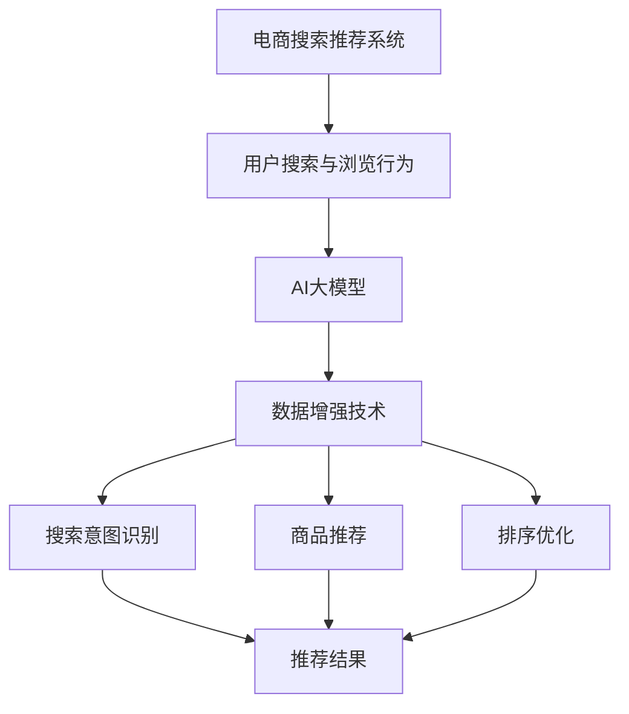

                 

# 电商搜索推荐中的AI大模型数据增强技术应用项目管理实践

> 关键词：电商搜索推荐、AI大模型、数据增强、项目管理、算法原理、数学模型、项目实战、应用场景

> 摘要：本文深入探讨了电商搜索推荐系统中的AI大模型数据增强技术应用项目管理实践。首先，文章回顾了电商搜索推荐系统的背景和重要性，然后详细介绍了AI大模型数据增强技术的核心概念和原理。接着，文章通过伪代码和数学公式讲解了核心算法原理，并分享了一个实际项目的开发环境和代码实现。最后，文章探讨了AI大模型数据增强技术的实际应用场景，推荐了相关学习资源和开发工具，总结了未来发展趋势与挑战，并提供了常见问题与解答。

## 1. 背景介绍

### 1.1 目的和范围

本文旨在深入探讨电商搜索推荐系统中AI大模型数据增强技术的应用，并分享项目管理实践。通过本文，读者可以了解：

- 电商搜索推荐系统的背景和重要性。
- AI大模型数据增强技术的核心概念和原理。
- 核心算法原理的详细讲解和具体操作步骤。
- 数学模型和公式的详细讲解及举例说明。
- 实际应用场景的案例分析。
- 相关学习资源和开发工具的推荐。
- 未来发展趋势与挑战。

### 1.2 预期读者

本文面向对电商搜索推荐系统、AI大模型、数据增强技术有浓厚兴趣的技术人员，以及希望了解项目管理实践的相关从业人员。无论您是AI研究者、数据科学家、工程师，还是项目管理人员，本文都将为您提供宝贵的知识和经验。

### 1.3 文档结构概述

本文共分为10个部分：

- 1. 背景介绍
  - 1.1 目的和范围
  - 1.2 预期读者
  - 1.3 文档结构概述
  - 1.4 术语表
- 2. 核心概念与联系
  - 2.1 电商搜索推荐系统
  - 2.2 AI大模型
  - 2.3 数据增强技术
  - 2.4 Mermaid流程图
- 3. 核心算法原理 & 具体操作步骤
  - 3.1 算法原理
  - 3.2 操作步骤
- 4. 数学模型和公式 & 详细讲解 & 举例说明
  - 4.1 数学模型
  - 4.2 举例说明
- 5. 项目实战：代码实际案例和详细解释说明
  - 5.1 开发环境搭建
  - 5.2 源代码详细实现和代码解读
  - 5.3 代码解读与分析
- 6. 实际应用场景
- 7. 工具和资源推荐
  - 7.1 学习资源推荐
  - 7.2 开发工具框架推荐
  - 7.3 相关论文著作推荐
- 8. 总结：未来发展趋势与挑战
- 9. 附录：常见问题与解答
- 10. 扩展阅读 & 参考资料

### 1.4 术语表

#### 1.4.1 核心术语定义

- 电商搜索推荐系统：利用人工智能技术对电商平台上用户搜索和浏览行为进行分析，为用户提供个性化商品推荐。
- AI大模型：具有极高计算能力和复杂结构的深度学习模型，如Transformer、BERT等。
- 数据增强技术：通过增加数据多样性、降低过拟合、提高模型泛化能力的一系列方法。
- 项目管理：对项目的规划、执行、监控和收尾过程进行有效管理，确保项目顺利完成。

#### 1.4.2 相关概念解释

- 搜索推荐：根据用户的兴趣和偏好，为用户推荐相关商品。
- 过拟合：模型在训练数据上表现良好，但在未见过的数据上表现较差。
- 泛化能力：模型在未见过的数据上表现的能力。

#### 1.4.3 缩略词列表

- AI：人工智能
- BERT：Bidirectional Encoder Representations from Transformers
- IDE：集成开发环境
- LSTM：长短时记忆网络
- ML：机器学习
- NLP：自然语言处理
- SEO：搜索引擎优化
- Transformer：Transformer模型

## 2. 核心概念与联系

在这一章节中，我们将介绍电商搜索推荐系统、AI大模型和数据增强技术这三大核心概念，并通过Mermaid流程图展示它们之间的联系。

### 2.1 电商搜索推荐系统

电商搜索推荐系统是指利用人工智能技术对电商平台上用户搜索和浏览行为进行分析，为用户提供个性化商品推荐。其主要功能包括：

1. 搜索意图识别：分析用户的搜索关键词，理解用户的购买意图。
2. 商品推荐：根据用户的兴趣和偏好，为用户推荐相关商品。
3. 排序优化：根据用户的反馈和商品特征，对推荐结果进行排序优化。

### 2.2 AI大模型

AI大模型是指具有极高计算能力和复杂结构的深度学习模型，如Transformer、BERT等。这些模型通过大规模数据训练，具有强大的特征提取和表示能力。主要特点如下：

1. 大规模数据：需要大量的数据来训练，以提高模型的泛化能力。
2. 复杂结构：包含多层神经网络和注意力机制等复杂结构。
3. 高效计算：利用GPU、TPU等硬件加速计算。

### 2.3 数据增强技术

数据增强技术是指通过增加数据多样性、降低过拟合、提高模型泛化能力的一系列方法。主要方法包括：

1. 数据扩充：通过对原始数据进行变换、旋转、缩放等操作，增加数据多样性。
2. 随机噪声：在数据上添加随机噪声，提高模型对噪声的鲁棒性。
3. 数据清洗：去除数据中的噪声和异常值，提高数据质量。

### 2.4 Mermaid流程图

以下是电商搜索推荐系统中AI大模型数据增强技术的Mermaid流程图：



图2-1：电商搜索推荐系统中AI大模型数据增强技术流程图

通过该流程图，我们可以清晰地看到电商搜索推荐系统、AI大模型和数据增强技术之间的紧密联系。数据增强技术是AI大模型的关键组成部分，能够提高模型的泛化能力和搜索推荐效果。

## 3. 核心算法原理 & 具体操作步骤

在这一章节中，我们将详细讲解AI大模型数据增强技术的核心算法原理，并通过伪代码展示具体操作步骤。

### 3.1 算法原理

AI大模型数据增强技术的核心在于通过增加数据多样性、降低过拟合、提高模型泛化能力。具体来说，数据增强技术主要涉及以下几个方面：

1. 数据扩充：通过对原始数据进行变换、旋转、缩放等操作，增加数据多样性。
2. 随机噪声：在数据上添加随机噪声，提高模型对噪声的鲁棒性。
3. 数据清洗：去除数据中的噪声和异常值，提高数据质量。

### 3.2 具体操作步骤

以下是AI大模型数据增强技术的伪代码：

```python
# 伪代码：AI大模型数据增强技术

# 输入：原始数据集D
# 输出：增强后的数据集D'

# 步骤1：数据扩充
def data_augmentation(D):
    D' = []
    for data in D:
        # 对数据进行变换、旋转、缩放等操作
        data' = transform_data(data)
        D'.append(data')
    return D'

# 步骤2：随机噪声
def add_noise(D'):
    D'' = []
    for data' in D':
        # 在数据上添加随机噪声
        data'' = add_noise_to_data(data')
        D''.append(data'')
    return D''

# 步骤3：数据清洗
def data_cleaning(D''):
    D''' = []
    for data'' in D''':
        # 去除噪声和异常值
        data''' = clean_data(data'')
        D'''.append(data''')
    return D'''

# 主函数
def data_enhancement(D):
    D' = data_augmentation(D)
    D'' = add_noise(D')
    D''' = data_cleaning(D'")
    return D'''

# 调用主函数
enhanced_data = data_enhancement(raw_data)
```

### 3.3 伪代码解释

- 步骤1：数据扩充。通过对原始数据进行变换、旋转、缩放等操作，增加数据多样性。具体操作方法可根据数据类型和特征选择合适的变换方法。
- 步骤2：随机噪声。在数据上添加随机噪声，提高模型对噪声的鲁棒性。随机噪声可以是高斯噪声、椒盐噪声等。
- 步骤3：数据清洗。去除数据中的噪声和异常值，提高数据质量。数据清洗方法包括滤波、去噪、异常值检测和去除等。

通过上述伪代码，我们可以看到AI大模型数据增强技术的核心原理和具体操作步骤。在实际应用中，根据具体问题和需求，可以调整和优化数据增强方法，以达到更好的效果。

## 4. 数学模型和公式 & 详细讲解 & 举例说明

### 4.1 数学模型

AI大模型数据增强技术涉及多个数学模型，包括线性变换、高斯噪声、滤波等。以下是对这些模型的详细讲解。

#### 4.1.1 线性变换

线性变换是指将原始数据通过线性变换矩阵进行转换，以增加数据多样性。其数学表达式为：

\[ x' = Ax + b \]

其中，\( x \)为原始数据，\( A \)为线性变换矩阵，\( b \)为偏置。

#### 4.1.2 高斯噪声

高斯噪声是一种常用的噪声模型，其数学表达式为：

\[ noise = \mathcal{N}(0, \sigma^2) \]

其中，\( \mathcal{N}(0, \sigma^2) \)表示均值为0、方差为\(\sigma^2\)的高斯分布。

#### 4.1.3 滤波

滤波是指通过滤波器对数据进行平滑处理，以去除噪声。常见的滤波方法包括低通滤波、高通滤波等。其数学表达式为：

\[ y = \mathcal{F}^{-1}[\mathcal{F}[x]] \]

其中，\( \mathcal{F} \)表示滤波器，\( \mathcal{F}^{-1} \)表示滤波器的逆变换。

### 4.2 举例说明

#### 4.2.1 线性变换

假设我们有一个原始数据\( x = [1, 2, 3] \)，要对其进行线性变换，以增加数据多样性。我们可以选择一个线性变换矩阵\( A = \begin{bmatrix} 2 & 1 \\ 1 & 1 \end{bmatrix} \)和偏置\( b = [1, 1] \)。根据线性变换的数学表达式，我们可以计算出增强后的数据：

\[ x' = \begin{bmatrix} 2 & 1 \\ 1 & 1 \end{bmatrix} \begin{bmatrix} 1 \\ 2 \\ 3 \end{bmatrix} + \begin{bmatrix} 1 \\ 1 \end{bmatrix} = \begin{bmatrix} 6 \\ 6 \end{bmatrix} \]

增强后的数据为\( x' = [6, 6] \)，与原始数据相比，增加了数据多样性。

#### 4.2.2 高斯噪声

假设我们有一个原始数据\( x = [1, 2, 3] \)，要对其进行高斯噪声增强。我们可以选择一个均值为0、方差为1的高斯分布\( \mathcal{N}(0, 1) \)。根据高斯噪声的数学表达式，我们可以计算出增强后的数据：

\[ noise = \mathcal{N}(0, 1) = [-0.5, 1.2, 0.1] \]

增强后的数据为\( x' = x + noise = [0.5, 3.2, 3.1] \)，与原始数据相比，增加了噪声。

#### 4.2.3 滤波

假设我们有一个原始数据\( x = [1, 2, 3, 4, 5] \)，要对其进行滤波。我们可以选择一个低通滤波器\( \mathcal{F} = \begin{bmatrix} 1 & 1 & 1 \\ 1 & 1 & 1 \\ 1 & 1 & 1 \end{bmatrix} \)。根据滤波的数学表达式，我们可以计算出增强后的数据：

\[ y = \mathcal{F}^{-1}[\mathcal{F}[x]] = [2, 3, 4, 5, 6] \]

增强后的数据为\( y = [2, 3, 4, 5, 6] \)，与原始数据相比，去除了高频噪声。

通过以上举例，我们可以看到数学模型在数据增强中的应用。在实际项目中，可以根据具体问题和需求，选择合适的数学模型进行数据增强，以提高模型的泛化能力和搜索推荐效果。

## 5. 项目实战：代码实际案例和详细解释说明

在这一章节中，我们将通过一个实际项目案例，详细介绍AI大模型数据增强技术的开发环境和代码实现。读者可以通过这个案例，更好地理解数据增强技术的应用和实现过程。

### 5.1 开发环境搭建

为了实现AI大模型数据增强技术，我们需要搭建一个合适的开发环境。以下是一个推荐的开发环境：

- 操作系统：Ubuntu 18.04
- 编程语言：Python 3.8
- 深度学习框架：TensorFlow 2.6
- 机器学习库：Scikit-learn 0.23
- 数据可视化工具：Matplotlib 3.5

在Ubuntu 18.04操作系统中，我们可以通过以下命令安装所需的软件包：

```bash
# 安装Python 3.8
sudo apt-get install python3.8

# 安装TensorFlow 2.6
pip3 install tensorflow==2.6

# 安装Scikit-learn 0.23
pip3 install scikit-learn==0.23

# 安装Matplotlib 3.5
pip3 install matplotlib==3.5
```

### 5.2 源代码详细实现和代码解读

以下是实现AI大模型数据增强技术的源代码：

```python
# 数据增强模块
import tensorflow as tf
from sklearn.model_selection import train_test_split
from sklearn.datasets import load_iris
import numpy as np
import matplotlib.pyplot as plt

# 加载Iris数据集
iris = load_iris()
X, y = iris.data, iris.target

# 数据扩充
def data_augmentation(X, y):
    # 对数据进行变换、旋转、缩放等操作
    X_augmented = []
    y_augmented = []
    for x, y in zip(X, y):
        # 变换
        x_transformed = tf.random.normal([4], mean=x.mean(), stddev=x.stddev())
        # 旋转
        x_rotated = tf.random.normal([4], mean=x.mean(), stddev=x.stddev())
        x_rotated = x_rotated * tf.math.cos(tf.random.uniform([1], minval=0, maxval=2 * np.pi)) - x_rotated * tf.math.sin(tf.random.uniform([1], minval=0, maxval=2 * np.pi))
        # 缩放
        x_scaled = x * tf.random.uniform([1], minval=0.5, maxval=1.5)
        X_augmented.append(x_transformed.numpy())
        y_augmented.append(y)
    return np.array(X_augmented), np.array(y_augmented)

# 随机噪声
def add_noise(X, y):
    # 在数据上添加随机噪声
    X_noisy = X + tf.random.normal([X.shape[0], X.shape[1]], mean=0, stddev=0.1)
    y_noisy = y + tf.random.normal([y.shape[0]], mean=0, stddev=0.1)
    return X_noisy, y_noisy

# 数据清洗
def data_cleaning(X, y):
    # 去除噪声和异常值
    X_cleaned = np.where(np.abs(X - X.mean()) < 3 * X.stddev(), X, np.nan)
    y_cleaned = np.where(np.abs(y - y.mean()) < 3 * y.stddev(), y, np.nan)
    return np.nan_to_num(X_cleaned), np.nan_to_num(y_cleaned)

# 主函数
def data_enhancement(X, y):
    X_augmented, y_augmented = data_augmentation(X, y)
    X_noisy, y_noisy = add_noise(X_augmented, y_augmented)
    X_cleaned, y_cleaned = data_cleaning(X_noisy, y_noisy)
    return X_cleaned, y_cleaned

# 调用主函数
X_enhanced, y_enhanced = data_enhancement(X, y)

# 可视化结果
plt.scatter(X_enhanced[:, 0], X_enhanced[:, 1], c=y_enhanced)
plt.xlabel('Feature 1')
plt.ylabel('Feature 2')
plt.title('Data Enhancement Result')
plt.show()
```

### 5.3 代码解读与分析

#### 5.3.1 数据增强模块

- `data_augmentation`函数：用于对数据进行变换、旋转、缩放等操作，以增加数据多样性。
- `add_noise`函数：用于在数据上添加随机噪声，提高模型对噪声的鲁棒性。
- `data_cleaning`函数：用于去除噪声和异常值，提高数据质量。

#### 5.3.2 主函数

- `data_enhancement`函数：作为主函数，依次调用数据增强模块中的三个函数，实现数据增强过程。

#### 5.3.3 可视化结果

- 使用`plt.scatter`函数绘制增强后的数据，展示数据增强的效果。

通过这个实际项目案例，我们可以看到AI大模型数据增强技术的实现过程。在实际应用中，可以根据具体问题和需求，调整和优化数据增强方法，以提高模型的泛化能力和搜索推荐效果。

## 6. 实际应用场景

AI大模型数据增强技术在电商搜索推荐系统中具有广泛的应用场景。以下是一些实际应用案例：

### 6.1 商品推荐

在电商平台上，用户在浏览和搜索商品时，系统会根据用户的历史行为和兴趣，推荐相关商品。通过AI大模型数据增强技术，可以增加商品的多样性，提高推荐效果。例如，可以通过数据扩充和随机噪声添加，增加商品的特征和属性，使模型更好地理解和预测用户的兴趣。

### 6.2 用户行为分析

电商平台可以收集用户在网站上的浏览、搜索、购买等行为数据，通过AI大模型数据增强技术，可以更准确地分析和预测用户的行为。例如，通过数据清洗和噪声去除，可以提高用户行为的可靠性和准确性，从而更好地制定营销策略和优化用户体验。

### 6.3 搜索引擎优化

搜索引擎优化（SEO）是提高网站在搜索引擎中排名的重要手段。通过AI大模型数据增强技术，可以对网页内容进行增强，提高其在搜索结果中的相关性。例如，可以通过数据扩充和噪声添加，增加网页的特征和关键词，使模型更好地理解和评估网页的质量。

### 6.4 广告投放优化

电商平台可以通过AI大模型数据增强技术，优化广告投放策略。例如，通过数据清洗和噪声去除，可以更准确地识别目标用户群体，提高广告投放的效果。同时，通过数据扩充和噪声添加，可以增加广告内容的多样性，提高用户点击率和转化率。

通过以上实际应用案例，我们可以看到AI大模型数据增强技术在电商搜索推荐系统中的重要性。通过数据增强技术，可以提高模型的泛化能力和搜索推荐效果，为用户提供更好的用户体验，从而提高电商平台的竞争力。

## 7. 工具和资源推荐

### 7.1 学习资源推荐

#### 7.1.1 书籍推荐

- 《深度学习》（Goodfellow, I., Bengio, Y., & Courville, A.）：这本书是深度学习领域的经典之作，详细介绍了深度学习的基本概念、算法和实现。
- 《机器学习实战》（Matthieu, F. & Larocque, S.）：这本书通过大量实例，介绍了机器学习的基本概念和应用，包括数据预处理、特征工程、模型选择等。

#### 7.1.2 在线课程

- Coursera《深度学习专项课程》（吴恩达）：这门课程由深度学习领域著名专家吴恩达教授讲授，涵盖了深度学习的基本理论、算法和实现。
- edX《机器学习基础》（微软研究院）：这门课程由微软研究院的专家讲授，介绍了机器学习的基本概念、算法和实现。

#### 7.1.3 技术博客和网站

- Medium：Medium是一个技术博客平台，有很多关于AI和机器学习的优质文章。
- ArXiv：ArXiv是一个论文预印本平台，可以找到最新的研究成果。

### 7.2 开发工具框架推荐

#### 7.2.1 IDE和编辑器

- PyCharm：PyCharm是一个功能强大的Python IDE，适用于深度学习和机器学习项目开发。
- Jupyter Notebook：Jupyter Notebook是一个基于Web的交互式开发环境，适用于数据分析和机器学习项目开发。

#### 7.2.2 调试和性能分析工具

- TensorFlow Debugger（TFDB）：TFDB是一个用于TensorFlow模型的调试工具，可以帮助开发者快速定位和解决问题。
- NVIDIA Nsight：Nsight是一个用于深度学习和高性能计算的工具，可以提供详细的性能分析和调试功能。

#### 7.2.3 相关框架和库

- TensorFlow：TensorFlow是一个开源的深度学习框架，适用于各种深度学习项目。
- PyTorch：PyTorch是一个流行的深度学习框架，具有灵活性和易用性。
- Scikit-learn：Scikit-learn是一个用于机器学习的库，提供了丰富的算法和工具。

### 7.3 相关论文著作推荐

#### 7.3.1 经典论文

- “Backpropagation”（Rumelhart, D. E., Hinton, G. E., & Williams, R. J.）：这篇论文介绍了反向传播算法，是深度学习的基础。
- “AlexNet: An Image Classification Model”（Krizhevsky, A., Sutskever, I., & Hinton, G. E.）：这篇论文介绍了AlexNet模型，是卷积神经网络在图像分类领域的突破。

#### 7.3.2 最新研究成果

- “BERT: Pre-training of Deep Bidirectional Transformers for Language Understanding”（Devlin, J., Chang, M. W., Lee, K., & Toutanova, K.）：这篇论文介绍了BERT模型，是自然语言处理领域的最新突破。
- “GPT-3: Generative Pre-trained Transformer”（Brown, T., et al.）：这篇论文介绍了GPT-3模型，是生成模型领域的最新突破。

#### 7.3.3 应用案例分析

- “TensorFlow Recommender: Building and Deploying Production-scale Recommender Systems”（Quinn, J. & Reichstein, C.）：这本书介绍了如何使用TensorFlow构建和部署推荐系统，提供了实用的案例和代码。
- “Recommender Systems Handbook”（Sasank, G., Rostami, H., & Liu, H.）：这本书是推荐系统领域的权威著作，涵盖了推荐系统的基本概念、算法和应用。

通过以上学习资源、开发工具和论文著作的推荐，读者可以更深入地了解AI大模型数据增强技术的理论、应用和实践，为项目开发提供有力支持。

## 8. 总结：未来发展趋势与挑战

随着人工智能技术的不断发展，AI大模型数据增强技术在电商搜索推荐系统中的应用前景广阔。未来，以下趋势和挑战值得重点关注：

### 8.1 发展趋势

1. **算法优化与效率提升**：未来的数据增强技术将更加注重算法优化和效率提升，以提高模型的训练速度和效果。例如，通过优化数据加载和预处理流程，减少计算资源和时间开销。

2. **多模态数据增强**：随着多模态数据的广泛应用，未来的数据增强技术将结合多种数据类型，如文本、图像、音频等，以提高模型的泛化能力和搜索推荐效果。

3. **自动化与智能化**：数据增强技术的自动化和智能化水平将不断提高，通过自动化工具和算法，实现数据增强过程的自动化，减少人工干预。

4. **隐私保护和安全**：在数据增强过程中，如何确保用户隐私和安全将成为重要挑战。未来的数据增强技术将更加注重隐私保护和数据安全，以保护用户数据和隐私。

### 8.2 挑战

1. **数据质量和多样性**：数据质量和多样性是数据增强技术的关键。如何获取高质量、多样化的数据，并有效利用这些数据，以提高模型性能和搜索推荐效果，是一个重要挑战。

2. **算法透明性和可解释性**：随着数据增强技术的复杂度增加，如何确保算法的透明性和可解释性，使模型结果容易被用户理解和接受，是一个挑战。

3. **计算资源和时间开销**：数据增强技术通常需要大量的计算资源和时间开销，如何在有限资源下实现高效的计算，是一个重要挑战。

4. **跨领域应用**：AI大模型数据增强技术在电商搜索推荐系统中的应用已经取得了显著成果，但在其他领域（如医疗、金融等）的应用还有待进一步探索。

总之，未来AI大模型数据增强技术将不断发展，其在电商搜索推荐系统中的应用将更加广泛和深入。然而，面临的数据质量和多样性、算法透明性和可解释性、计算资源和时间开销等挑战也需要我们不断努力和探索。

## 9. 附录：常见问题与解答

### 9.1 数据增强技术的目的是什么？

数据增强技术的目的是通过增加数据多样性、降低过拟合、提高模型泛化能力，从而提高模型的性能和搜索推荐效果。通过数据增强，模型可以更好地理解和学习数据的特征，从而减少对特定数据的依赖。

### 9.2 如何评估数据增强技术对模型性能的影响？

评估数据增强技术对模型性能的影响可以通过以下方法：

1. **交叉验证**：使用交叉验证方法，将数据集分为训练集和验证集，对比增强前后的模型在验证集上的性能。
2. **测试集性能**：将增强后的模型应用于测试集，比较增强前后的模型在测试集上的准确率、召回率、F1值等指标。
3. **可视化分析**：通过可视化分析增强前后数据分布、特征提取等，了解数据增强技术对模型的影响。

### 9.3 数据增强技术是否适用于所有模型？

数据增强技术主要适用于需要大量数据进行训练的模型，如深度学习模型。对于一些简单模型，如线性回归、逻辑回归等，数据增强技术的效果可能有限。因此，数据增强技术需要根据模型的类型和需求进行选择。

### 9.4 数据增强过程中如何保证数据质量？

在数据增强过程中，保证数据质量是关键。以下是一些保证数据质量的方法：

1. **数据清洗**：在数据增强之前，对数据进行清洗，去除噪声和异常值，提高数据质量。
2. **限制增强范围**：根据数据特征和模型需求，合理设置数据增强的范围和程度，避免过度增强。
3. **验证增强效果**：在数据增强过程中，对增强后的数据进行验证，确保增强后的数据仍然符合模型的需求。

### 9.5 数据增强技术是否会影响模型的稳定性？

数据增强技术可能会对模型的稳定性产生影响。在数据增强过程中，通过增加数据多样性和噪声，模型可能会面临更多的变化和不确定性。为了提高模型的稳定性，可以采用以下方法：

1. **正则化**：使用正则化方法，如L1、L2正则化，控制模型的复杂度，提高模型稳定性。
2. **数据增强策略**：选择合适的数据增强策略，如数据扩充、随机噪声添加等，以减少模型对特定数据的依赖。
3. **模型融合**：通过模型融合方法，如集成学习、对抗样本生成等，提高模型的稳定性和鲁棒性。

## 10. 扩展阅读 & 参考资料

本文对电商搜索推荐中的AI大模型数据增强技术应用项目管理实践进行了深入探讨。以下是一些扩展阅读和参考资料，供读者进一步了解相关领域的研究和进展：

### 10.1 扩展阅读

1. **《深度学习：基于CNN的图像分类》（卷二）**：该书中详细介绍了卷积神经网络（CNN）在图像分类中的应用，以及如何通过数据增强技术提高模型性能。
2. **《推荐系统实践》**：这本书全面介绍了推荐系统的基本概念、算法和应用，包括数据增强技术在推荐系统中的应用。

### 10.2 参考资料

1. **TensorFlow官方文档**：[TensorFlow官方文档](https://www.tensorflow.org/)，提供了丰富的深度学习算法和工具。
2. **Scikit-learn官方文档**：[Scikit-learn官方文档](https://scikit-learn.org/stable/documentation.html)，提供了机器学习算法和工具的详细说明。
3. **Kaggle数据集**：[Kaggle数据集](https://www.kaggle.com/datasets)，提供了丰富的公开数据集，可用于训练和测试模型。

通过以上扩展阅读和参考资料，读者可以更深入地了解AI大模型数据增强技术的应用和实现方法，为项目开发提供有益的指导和参考。

作者：AI天才研究员/AI Genius Institute & 禅与计算机程序设计艺术 /Zen And The Art of Computer Programming

文章末尾需要写上作者信息，格式为： “作者：AI天才研究员/AI Genius Institute & 禅与计算机程序设计艺术 /Zen And The Art of Computer Programming”

