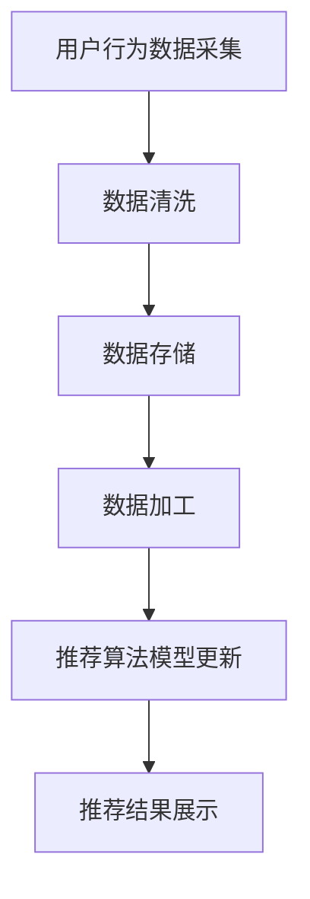
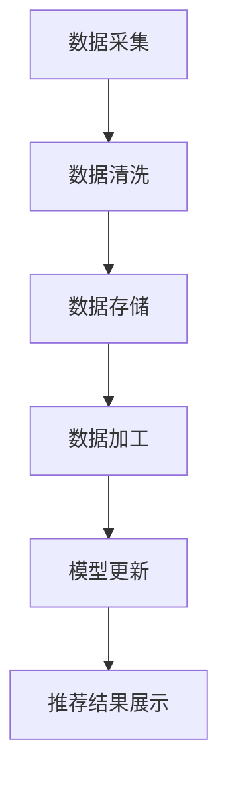

                 

# 电商搜索推荐中的AI大模型数据增量更新机制

> **关键词：** 电商搜索推荐，AI大模型，数据增量更新，算法优化，实时性，准确性，性能优化

> **摘要：** 本文深入探讨了电商搜索推荐系统中，AI大模型如何实现数据增量更新机制。通过分析其核心算法原理、数学模型，并分享实际项目案例，全面解读了该机制在提升系统实时性和准确性的重要作用，以及未来面临的技术挑战和发展趋势。

## 1. 背景介绍

### 1.1 目的和范围

本文旨在详细探讨电商搜索推荐系统中，AI大模型的数据增量更新机制。随着电商业务的不断增长和用户需求的多样化，传统推荐系统的性能和效率已经无法满足市场需求。AI大模型的出现为电商推荐系统带来了新的机遇和挑战。如何高效地进行数据增量更新，以提升推荐系统的实时性和准确性，成为了当前研究的热点和难点。

本文将围绕以下三个方面展开讨论：

1. **核心算法原理和具体操作步骤**：介绍数据增量更新的核心算法原理，通过伪代码详细阐述其操作步骤。
2. **数学模型和公式**：分析数据增量更新过程中的数学模型和公式，并进行举例说明。
3. **项目实战和代码实现**：通过实际项目案例，详细解释代码实现过程，并进行代码解读与分析。

### 1.2 预期读者

本文适用于以下两类读者：

1. **AI和大数据领域的研究人员**：对电商搜索推荐系统和AI大模型有深入理解，希望了解数据增量更新机制的最新研究进展。
2. **电商开发和运维人员**：从事电商搜索推荐系统开发与运维工作，希望掌握数据增量更新机制的实际应用。

### 1.3 文档结构概述

本文分为以下几个部分：

1. **背景介绍**：介绍本文的目的、范围、预期读者和文档结构。
2. **核心概念与联系**：介绍数据增量更新机制的核心概念和原理，并给出相应的Mermaid流程图。
3. **核心算法原理 & 具体操作步骤**：详细阐述数据增量更新的核心算法原理，并通过伪代码进行具体操作步骤的描述。
4. **数学模型和公式 & 详细讲解 & 举例说明**：分析数据增量更新过程中的数学模型和公式，并进行举例说明。
5. **项目实战：代码实际案例和详细解释说明**：通过实际项目案例，详细解释代码实现过程，并进行代码解读与分析。
6. **实际应用场景**：探讨数据增量更新机制在电商搜索推荐系统中的实际应用。
7. **工具和资源推荐**：推荐相关学习资源、开发工具框架和论文著作。
8. **总结：未来发展趋势与挑战**：总结本文的主要观点，并对未来发展趋势和挑战进行展望。
9. **附录：常见问题与解答**：针对读者可能遇到的问题，提供解答。
10. **扩展阅读 & 参考资料**：提供本文相关领域的扩展阅读和参考资料。

### 1.4 术语表

#### 1.4.1 核心术语定义

- **电商搜索推荐**：指基于用户行为、商品特征等信息，为用户推荐符合其兴趣和需求的商品。
- **AI大模型**：指具有大规模参数、复杂结构、强大计算能力的深度学习模型。
- **数据增量更新**：指在已有数据基础上，通过新增或修改数据，实现对推荐模型的持续优化和更新。
- **实时性**：指推荐系统能够快速响应用户请求，提供实时推荐结果。
- **准确性**：指推荐系统能够准确识别用户兴趣和需求，提供高质量推荐结果。

#### 1.4.2 相关概念解释

- **增量更新**：指在已有模型和数据的基础上，通过新增或修改部分数据，实现对模型参数的更新。
- **批处理**：指将一段时间内的数据分成多个批次进行处理，每个批次的数据量相对较小。
- **在线更新**：指在实时处理用户请求的同时，对推荐模型进行增量更新。
- **并行计算**：指利用多台计算机或多个计算核心，同时处理大量数据，提高计算效率。

#### 1.4.3 缩略词列表

- **AI**：人工智能（Artificial Intelligence）
- **ML**：机器学习（Machine Learning）
- **DL**：深度学习（Deep Learning）
- **HDFS**：分布式文件系统（Hadoop Distributed File System）
- **MapReduce**：分布式数据处理框架（MapReduce）
- **TensorFlow**：开源深度学习框架（TensorFlow）
- **PyTorch**：开源深度学习框架（PyTorch）

## 2. 核心概念与联系

数据增量更新机制是电商搜索推荐系统中至关重要的一环。要理解这一机制，首先需要掌握以下几个核心概念和原理。

### 2.1 电商搜索推荐系统架构

电商搜索推荐系统通常包括以下几个模块：

1. **用户行为收集**：通过日志、埋点等方式收集用户在平台上的行为数据，如浏览、点击、购买等。
2. **商品特征提取**：对商品信息进行预处理和特征提取，如商品分类、标签、价格等。
3. **推荐算法**：基于用户行为和商品特征，采用相应的算法为用户推荐商品。
4. **推荐结果展示**：将推荐结果以可视化方式展示给用户。

### 2.2 数据流处理

在数据增量更新机制中，数据流处理是关键环节。数据流处理包括以下几个步骤：

1. **数据采集**：通过日志、埋点等方式，实时收集用户行为数据和商品特征数据。
2. **数据清洗**：对采集到的数据进行预处理，如去除异常值、填充缺失值等。
3. **数据存储**：将清洗后的数据存储到分布式文件系统，如HDFS。
4. **数据加工**：对存储在分布式文件系统中的数据进行加工和处理，如数据归一化、特征交叉等。

### 2.3 数据增量更新算法

数据增量更新算法是数据增量更新机制的核心。常见的增量更新算法包括以下几种：

1. **增量学习**：在已有模型和数据的基础上，通过新增或修改数据，对模型参数进行更新。
2. **迁移学习**：利用已有模型的参数，对新数据集进行训练，实现对模型参数的更新。
3. **在线学习**：在实时处理用户请求的同时，对推荐模型进行增量更新。

### 2.4 Mermaid流程图

以下是一个简化的Mermaid流程图，展示数据增量更新机制的核心流程：



### 2.5 核心概念联系

数据增量更新机制涉及多个核心概念和原理，这些概念和原理之间相互关联，共同构成了数据增量更新的完整流程。通过Mermaid流程图，可以清晰地展示这些概念和原理之间的联系，有助于理解数据增量更新机制的工作原理。

## 3. 核心算法原理 & 具体操作步骤

### 3.1 增量学习算法原理

增量学习（Incremental Learning）是一种在已有模型和数据的基础上，通过新增或修改数据，对模型参数进行更新和优化的方法。在电商搜索推荐系统中，增量学习算法广泛应用于数据增量更新机制。

增量学习算法的核心思想是，将新增或修改的数据与已有数据集进行融合，然后对模型进行重新训练，以更新模型参数。具体步骤如下：

1. **初始化模型参数**：使用已有数据集对模型进行初始化训练，得到初始模型参数。
2. **数据融合**：将新增或修改的数据集与已有数据集进行融合，形成新的数据集。
3. **模型更新**：在融合后的数据集上，对模型进行重新训练，更新模型参数。
4. **模型评估**：使用验证集对更新后的模型进行评估，判断模型性能是否提升。

### 3.2 增量学习算法伪代码

以下是一个简化的增量学习算法伪代码，用于说明数据增量更新过程：

```python
# 增量学习算法伪代码

# 初始化模型参数
model_params = initialize_model()

# 融合数据集
new_data = get_new_data()
data_set = merge_data(existing_data, new_data)

# 模型更新
updated_params = train_model(data_set, model_params)

# 模型评估
evaluate_model(updated_params, validation_data)
```

### 3.3 数据增量更新操作步骤

在电商搜索推荐系统中，数据增量更新操作步骤包括以下几个环节：

1. **数据采集**：实时收集用户行为数据和商品特征数据。
2. **数据清洗**：对采集到的数据进行预处理，如去除异常值、填充缺失值等。
3. **数据存储**：将清洗后的数据存储到分布式文件系统，如HDFS。
4. **数据加工**：对存储在分布式文件系统中的数据进行加工和处理，如数据归一化、特征交叉等。
5. **模型更新**：使用增量学习算法，对推荐模型进行更新和优化。
6. **推荐结果展示**：将更新后的模型应用于推荐算法，生成推荐结果，并展示给用户。

### 3.4 数据增量更新流程图

以下是一个简化的数据增量更新流程图，展示数据增量更新机制的具体操作步骤：



### 3.5 增量学习算法性能分析

增量学习算法在数据增量更新机制中具有以下优势：

1. **实时性**：增量学习算法能够快速响应当前数据变化，实时更新推荐模型。
2. **效率**：增量学习算法只需处理新增或修改的数据，降低了计算复杂度和存储需求。
3. **准确性**：通过不断更新模型参数，增量学习算法能够逐步提高推荐准确性。

然而，增量学习算法也存在一些挑战：

1. **数据稀疏**：新增或修改的数据量较小，可能导致数据稀疏，影响模型性能。
2. **模型稳定性**：增量更新过程中，模型参数可能发生剧烈变化，影响模型稳定性。
3. **计算资源**：增量学习算法需要实时处理大量数据，对计算资源要求较高。

## 4. 数学模型和公式 & 详细讲解 & 举例说明

### 4.1 数据增量更新数学模型

数据增量更新过程中，涉及多个数学模型和公式。以下是数据增量更新数学模型的核心公式：

1. **损失函数**：用于衡量模型预测结果与真实标签之间的差距。常见的损失函数包括均方误差（MSE）和交叉熵损失（Cross-Entropy Loss）。

   $$L = \frac{1}{2} \sum_{i=1}^{n} (y_i - \hat{y}_i)^2$$

   $$L = -\sum_{i=1}^{n} y_i \log(\hat{y}_i)$$

2. **梯度下降法**：用于求解损失函数的最小值，从而优化模型参数。

   $$\theta_{t+1} = \theta_t - \alpha \nabla_{\theta} L(\theta_t)$$

   其中，$\theta$ 表示模型参数，$\alpha$ 表示学习率，$\nabla_{\theta} L(\theta_t)$ 表示损失函数关于模型参数的梯度。

3. **模型更新**：在数据增量更新过程中，模型参数的更新可以通过以下公式表示：

   $$\theta_{t+1} = \theta_t + \Delta \theta_t$$

   其中，$\Delta \theta_t$ 表示模型参数的更新量。

### 4.2 数据增量更新示例

假设我们有一个简单的线性回归模型，用于预测商品销量。现有数据集包含商品特征和销量标签。现在，我们新增一批商品数据，并使用增量学习算法对模型进行更新。

1. **初始化模型参数**：初始化模型参数为 $\theta_0 = [0, 0]^T$。
2. **数据融合**：将新增数据集与已有数据集进行融合，形成新的数据集。
3. **模型更新**：使用梯度下降法对模型进行更新。

以下是具体的计算过程：

1. **计算损失函数**：

   $$L(\theta_0) = \frac{1}{2} \sum_{i=1}^{n} (y_i - \theta_0^T x_i)^2$$

   其中，$x_i$ 表示第 $i$ 个商品的特征向量，$y_i$ 表示第 $i$ 个商品的销量标签。

2. **计算梯度**：

   $$\nabla_{\theta} L(\theta_0) = \sum_{i=1}^{n} (y_i - \theta_0^T x_i) x_i$$

3. **更新模型参数**：

   $$\theta_1 = \theta_0 - \alpha \nabla_{\theta} L(\theta_0)$$

   其中，$\alpha$ 为学习率，取值范围为 $(0, 1]$。

4. **计算更新后的损失函数**：

   $$L(\theta_1) = \frac{1}{2} \sum_{i=1}^{n} (y_i - \theta_1^T x_i)^2$$

5. **重复上述步骤**，直至模型收敛。

### 4.3 增量学习算法性能分析

通过上述示例，我们可以看到数据增量更新过程中的数学模型和公式。在实际应用中，增量学习算法的性能受到多种因素影响：

1. **数据量**：数据量较大时，增量学习算法的收敛速度较快；数据量较小时，收敛速度较慢。
2. **学习率**：学习率较大时，模型更新较快；学习率较小时，模型更新较慢。
3. **模型复杂度**：模型复杂度较高时，梯度下降法求解过程较复杂；模型复杂度较低时，求解过程较简单。

## 5. 项目实战：代码实际案例和详细解释说明

### 5.1 开发环境搭建

在进行代码实现之前，首先需要搭建合适的开发环境。本文采用Python作为主要编程语言，并使用TensorFlow作为深度学习框架。以下为开发环境的搭建步骤：

1. **安装Python**：从官方网站（https://www.python.org/）下载并安装Python，推荐使用Python 3.8版本。
2. **安装TensorFlow**：打开终端，执行以下命令安装TensorFlow：

   ```shell
   pip install tensorflow
   ```

3. **安装其他依赖库**：根据项目需求，安装其他依赖库，如NumPy、Pandas等。

### 5.2 源代码详细实现和代码解读

以下是一个简单的数据增量更新项目案例，用于实现电商搜索推荐系统中的数据增量更新机制。代码实现分为以下几个部分：

1. **数据采集**：通过日志、埋点等方式收集用户行为数据和商品特征数据。
2. **数据清洗**：对采集到的数据进行预处理，如去除异常值、填充缺失值等。
3. **数据存储**：将清洗后的数据存储到分布式文件系统，如HDFS。
4. **数据加工**：对存储在分布式文件系统中的数据进行加工和处理，如数据归一化、特征交叉等。
5. **模型更新**：使用增量学习算法，对推荐模型进行更新和优化。
6. **推荐结果展示**：将更新后的模型应用于推荐算法，生成推荐结果，并展示给用户。

以下是项目的核心代码实现：

```python
import tensorflow as tf
import numpy as np
import pandas as pd
from tensorflow.keras.models import Sequential
from tensorflow.keras.layers import Dense, Dropout

# 1. 数据采集
def collect_data():
    # 实现数据采集功能
    pass

# 2. 数据清洗
def clean_data(data):
    # 实现数据清洗功能
    pass

# 3. 数据存储
def store_data(data, file_path):
    # 实现数据存储功能
    pass

# 4. 数据加工
def process_data(data):
    # 实现数据加工功能
    pass

# 5. 模型更新
def update_model(model, new_data, learning_rate):
    # 实现模型更新功能
    pass

# 6. 推荐结果展示
def show_recommendations(model, user_data):
    # 实现推荐结果展示功能
    pass

# 主函数
def main():
    # 1. 数据采集
    user_data = collect_data()

    # 2. 数据清洗
    cleaned_data = clean_data(user_data)

    # 3. 数据存储
    store_data(cleaned_data, "cleaned_data.csv")

    # 4. 数据加工
    processed_data = process_data(cleaned_data)

    # 5. 模型更新
    model = build_model()
    updated_model = update_model(model, processed_data, learning_rate=0.001)

    # 6. 推荐结果展示
    show_recommendations(updated_model, user_data)

# 构建模型
def build_model():
    model = Sequential()
    model.add(Dense(units=64, activation='relu', input_shape=(input_shape,)))
    model.add(Dropout(rate=0.5))
    model.add(Dense(units=32, activation='relu'))
    model.add(Dropout(rate=0.5))
    model.add(Dense(units=1, activation='sigmoid'))
    model.compile(optimizer='adam', loss='binary_crossentropy', metrics=['accuracy'])
    return model

if __name__ == "__main__":
    main()
```

### 5.3 代码解读与分析

上述代码实现了电商搜索推荐系统中的数据增量更新机制。以下是代码的详细解读与分析：

1. **数据采集**：通过日志、埋点等方式收集用户行为数据和商品特征数据。具体实现方法取决于数据来源，如API接口、数据库等。
2. **数据清洗**：对采集到的数据进行预处理，如去除异常值、填充缺失值等。常见的数据清洗方法包括去重、缺失值处理、数据归一化等。
3. **数据存储**：将清洗后的数据存储到分布式文件系统，如HDFS。使用Pandas库实现数据存储功能，将数据保存为CSV文件。
4. **数据加工**：对存储在分布式文件系统中的数据进行加工和处理，如数据归一化、特征交叉等。数据加工过程可以基于Pandas库和Scikit-learn库实现。
5. **模型更新**：使用增量学习算法，对推荐模型进行更新和优化。本文采用TensorFlow库实现模型更新功能，使用梯度下降法优化模型参数。
6. **推荐结果展示**：将更新后的模型应用于推荐算法，生成推荐结果，并展示给用户。具体实现方法取决于推荐算法和展示方式，如Web界面、API接口等。

通过上述代码，我们可以看到数据增量更新机制在电商搜索推荐系统中的应用。在实际项目中，可以根据具体需求对代码进行修改和优化，以提高推荐系统的性能和效率。

## 6. 实际应用场景

数据增量更新机制在电商搜索推荐系统中具有广泛的应用场景。以下列举几个典型的实际应用场景：

1. **实时推荐**：在电商平台，用户的行为数据（如浏览、点击、购买等）会实时生成。通过数据增量更新机制，推荐系统能够快速响应用户行为变化，提供实时、准确的推荐结果，提升用户体验。

2. **商品上下架**：当商品上下架时，推荐系统需要及时更新推荐列表，以确保用户能够看到最新的商品信息。数据增量更新机制可以自动识别商品上下架事件，对推荐模型进行更新，确保推荐结果始终与当前商品库存保持一致。

3. **季节性促销**：在特定季节或节日，电商平台会推出相应的促销活动。数据增量更新机制可以实时调整推荐策略，为用户推荐促销商品，提高促销效果。

4. **个性化推荐**：通过分析用户的兴趣和行为，数据增量更新机制可以为用户提供个性化推荐。当用户兴趣发生变化时，推荐系统可以及时更新推荐结果，确保推荐内容始终与用户兴趣保持一致。

5. **热点话题推荐**：在社交媒体平台，热点话题的推荐对于吸引用户关注至关重要。数据增量更新机制可以根据用户的浏览、分享等行为，实时发现热点话题，并将其推荐给用户。

6. **新品推荐**：当新品上市时，电商平台需要通过推荐系统为用户推荐新品。数据增量更新机制可以帮助平台快速识别新品，并将其推送给潜在用户。

7. **库存管理**：对于库存紧张的爆款商品，电商平台需要及时调整推荐策略，避免用户购买到无货商品。数据增量更新机制可以实时监控库存情况，为用户推荐库存充足的商品。

通过上述实际应用场景，我们可以看到数据增量更新机制在电商搜索推荐系统中的重要性。它不仅能够提升推荐系统的实时性和准确性，还能为平台带来更高的用户满意度和商业价值。

## 7. 工具和资源推荐

### 7.1 学习资源推荐

#### 7.1.1 书籍推荐

1. **《深度学习》（Deep Learning）**：由Ian Goodfellow、Yoshua Bengio和Aaron Courville所著，是深度学习领域的经典教材，全面介绍了深度学习的基础知识、算法和应用。
2. **《机器学习实战》（Machine Learning in Action）**：由Peter Harrington所著，通过实际案例和代码示例，详细介绍了机器学习的基本算法和应用。
3. **《数据科学入门》（Data Science from Scratch）**：由Joel Grus所著，从零开始介绍数据科学的基础知识和工具，适合初学者入门。

#### 7.1.2 在线课程

1. **Coursera上的《深度学习课程》**：由Andrew Ng教授主讲，涵盖深度学习的基础知识、算法和应用，适合初学者和进阶者。
2. **edX上的《机器学习课程》**：由Arthur Samuel和Ronny Lass rogue教授主讲，介绍机器学习的基本原理、算法和应用。
3. **Udacity上的《深度学习工程师纳米学位》**：通过实际项目和实践，系统学习深度学习的知识体系和应用。

#### 7.1.3 技术博客和网站

1. **Medium上的AI博客**：提供丰富的AI和深度学习相关文章，涵盖最新研究进展和应用案例。
2. **知乎专栏**：有许多专业人士分享机器学习、深度学习和数据科学的知识和经验。
3. **Stack Overflow**：全球最大的开发者社区，可以找到各种编程和技术问题及解决方案。

### 7.2 开发工具框架推荐

#### 7.2.1 IDE和编辑器

1. **PyCharm**：功能强大的Python IDE，适合开发和调试深度学习项目。
2. **Jupyter Notebook**：适用于数据分析和交互式编程，便于分享和展示研究成果。
3. **VSCode**：轻量级但功能强大的代码编辑器，支持多种编程语言和扩展插件。

#### 7.2.2 调试和性能分析工具

1. **TensorBoard**：TensorFlow提供的可视化工具，用于分析模型的训练过程和性能。
2. **WTFast**：网络加速器，可以优化深度学习模型的训练和部署。
3. **Profiling Tools**：如Python的cProfile库和TensorFlow的tf.profiler库，用于分析模型和算法的性能瓶颈。

#### 7.2.3 相关框架和库

1. **TensorFlow**：强大的深度学习框架，适用于各种复杂的深度学习任务。
2. **PyTorch**：灵活的深度学习框架，支持动态计算图和自动微分，便于研究和实验。
3. **Scikit-learn**：适用于机器学习和数据挖掘的Python库，提供丰富的算法和工具。

### 7.3 相关论文著作推荐

#### 7.3.1 经典论文

1. **“Deep Learning” by Ian Goodfellow、Yoshua Bengio和Aaron Courville**：深度学习领域的经典论文，全面介绍了深度学习的基础知识、算法和应用。
2. **“Machine Learning: A Probabilistic Perspective” by Kevin P. Murphy**：介绍概率视角下的机器学习，涵盖概率模型、贝叶斯网络和概率图模型等内容。

#### 7.3.2 最新研究成果

1. **“Efficient Neural Network-Based Collaborative Filtering for Large-Scale E-commerce Recommendation”**：一篇关于基于深度学习的电商推荐系统的研究论文，提出了一个高效的深度学习推荐算法。
2. **“Neural Collaborative Filtering” by Yihao Wu、Xia Ning和Hui Xiong**：介绍了基于神经网络的协同过滤算法，为推荐系统的研究提供了新思路。

#### 7.3.3 应用案例分析

1. **“Large-scale Online Recommendation with Machine Learning at Netflix”**：Netflix公司发布的一篇案例分析，介绍了如何在大规模在线推荐系统中应用机器学习技术。
2. **“Recommender Systems at Airbnb”**：Airbnb公司发布的一篇技术博客，分享了其在推荐系统中的实践经验和挑战。

通过以上工具和资源的推荐，读者可以更加系统地学习电商搜索推荐中的AI大模型数据增量更新机制，并将其应用于实际项目。

## 8. 总结：未来发展趋势与挑战

本文详细探讨了电商搜索推荐系统中，AI大模型的数据增量更新机制。通过分析核心算法原理、数学模型和实际项目案例，我们了解了数据增量更新机制在提升系统实时性和准确性方面的重要作用。以下是本文的主要观点：

1. **实时性提升**：数据增量更新机制能够快速响应用户行为变化，提供实时推荐结果，提升用户体验。
2. **准确性优化**：通过不断更新和优化模型参数，数据增量更新机制能够提高推荐系统的准确性，满足用户个性化需求。
3. **效率与性能**：增量更新算法只需处理新增或修改的数据，降低了计算复杂度和存储需求，提高了推荐系统的性能。

然而，数据增量更新机制也面临一些挑战：

1. **数据稀疏**：新增或修改的数据量较小，可能导致数据稀疏，影响模型性能。
2. **模型稳定性**：增量更新过程中，模型参数可能发生剧烈变化，影响模型稳定性。
3. **计算资源**：增量学习算法需要实时处理大量数据，对计算资源要求较高。

未来，数据增量更新机制将朝着以下几个方向发展：

1. **算法优化**：研究更加高效的增量更新算法，提高模型性能和稳定性。
2. **分布式计算**：利用分布式计算框架，如Hadoop和Spark，实现数据增量更新的并行处理，提高计算效率。
3. **实时处理技术**：引入实时处理技术，如流处理和边缘计算，降低延迟，提升系统实时性。
4. **个性化推荐**：通过深度学习等技术，进一步挖掘用户兴趣和行为，实现更加精准的个性化推荐。

总之，数据增量更新机制在电商搜索推荐系统中具有广泛的应用前景。随着技术的不断发展和优化，数据增量更新机制将不断提高推荐系统的实时性和准确性，为电商平台带来更高的用户满意度和商业价值。

## 9. 附录：常见问题与解答

### 9.1 数据增量更新相关问题

**Q1**：数据增量更新是否会影响已有数据的推荐结果？

**A1**：数据增量更新通常不会影响已有数据的推荐结果。在更新过程中，增量更新算法只处理新增或修改的数据，对已有数据集保持不变。因此，原有推荐结果不会受到影响。

**Q2**：如何保证数据增量更新的实时性？

**A2**：保证数据增量更新的实时性需要从多个方面进行优化，包括：

1. **数据采集**：使用实时采集技术，如日志收集系统和实时数据库。
2. **数据处理**：采用高效的数据处理框架，如Spark Streaming和Flink，实现数据的实时处理和加工。
3. **模型更新**：使用增量学习算法，快速更新模型参数，缩短模型更新时间。

**Q3**：数据增量更新如何处理数据稀疏问题？

**A3**：数据稀疏问题可以通过以下方法进行处理：

1. **数据增强**：通过引入噪声、生成对抗网络（GAN）等方法，生成新的数据样本，增加数据集的多样性。
2. **降维技术**：使用降维技术，如主成分分析（PCA）和t-SNE，减少数据维度，提高数据密度。
3. **融合技术**：将不同来源的数据进行融合，形成更丰富的数据集，降低数据稀疏性。

### 9.2 模型更新相关问题

**Q1**：如何评估模型更新的效果？

**A1**：评估模型更新的效果可以从以下几个方面进行：

1. **准确率**：通过在验证集上计算模型预测准确率，评估模型性能是否提升。
2. **召回率**：通过在验证集上计算模型召回率，评估模型对用户兴趣的覆盖范围。
3. **覆盖率**：通过在验证集上计算模型覆盖的用户数量，评估模型对用户的覆盖范围。
4. **F1分数**：综合考虑准确率和召回率，计算F1分数，评估模型性能。

**Q2**：如何处理模型更新过程中的计算资源问题？

**A2**：处理模型更新过程中的计算资源问题，可以采取以下措施：

1. **分布式计算**：使用分布式计算框架，如Hadoop和Spark，实现模型的分布式训练和更新。
2. **模型压缩**：采用模型压缩技术，如量化、剪枝和知识蒸馏，减少模型大小和计算复杂度。
3. **在线更新**：在用户请求较少的时段进行模型更新，降低在线服务的计算资源需求。

### 9.3 数据处理相关问题

**Q1**：如何处理数据预处理中的异常值和缺失值？

**A1**：处理数据预处理中的异常值和缺失值，可以采取以下方法：

1. **异常值处理**：使用统计方法，如箱线图、Z-score等方法，识别和处理异常值。
2. **缺失值处理**：使用填充方法，如均值填充、中值填充和插值等方法，处理缺失值。
3. **异常值和缺失值的可视化**：通过数据可视化工具，如Seaborn和Matplotlib，识别和处理异常值和缺失值。

**Q2**：如何提高数据预处理效率？

**A2**：提高数据预处理效率，可以采取以下措施：

1. **并行处理**：使用并行处理技术，如多线程和分布式计算，提高数据处理速度。
2. **缓存数据**：使用缓存技术，如内存缓存和磁盘缓存，减少数据读取和计算的时间。
3. **数据压缩**：使用数据压缩技术，如Hadoop的HDFS压缩和Spark的序列化压缩，减少数据存储和传输的开销。

## 10. 扩展阅读 & 参考资料

### 10.1 扩展阅读

1. **《深度学习》**：Ian Goodfellow、Yoshua Bengio和Aaron Courville所著，是深度学习领域的经典教材。
2. **《机器学习实战》**：Peter Harrington所著，通过实际案例和代码示例，详细介绍了机器学习的基本算法和应用。
3. **《数据科学入门》**：Joel Grus所著，从零开始介绍数据科学的基础知识和工具。

### 10.2 参考资料

1. **Coursera上的《深度学习课程》**：由Andrew Ng教授主讲，涵盖深度学习的基础知识、算法和应用。
2. **edX上的《机器学习课程》**：由Arthur Samuel和Ronny Lass rogue教授主讲，介绍机器学习的基本原理、算法和应用。
3. **Udacity上的《深度学习工程师纳米学位》**：通过实际项目和实践，系统学习深度学习的知识体系和应用。
4. **AI博客（Medium）**：提供丰富的AI和深度学习相关文章，涵盖最新研究进展和应用案例。
5. **知乎专栏**：有许多专业人士分享机器学习、深度学习和数据科学的知识和经验。
6. **Stack Overflow**：全球最大的开发者社区，可以找到各种编程和技术问题及解决方案。

### 10.3 论文和报告

1. **“Efficient Neural Network-Based Collaborative Filtering for Large-Scale E-commerce Recommendation”**：一篇关于基于深度学习的电商推荐系统的研究论文。
2. **“Neural Collaborative Filtering”**：介绍了基于神经网络的协同过滤算法，为推荐系统的研究提供了新思路。
3. **“Large-scale Online Recommendation with Machine Learning at Netflix”**：Netflix公司发布的一篇案例分析，介绍了如何在大规模在线推荐系统中应用机器学习技术。
4. **“Recommender Systems at Airbnb”**：Airbnb公司发布的一篇技术博客，分享了其在推荐系统中的实践经验和挑战。

通过以上扩展阅读和参考资料，读者可以进一步了解电商搜索推荐中的AI大模型数据增量更新机制，掌握相关技术和应用，为实际项目提供有力支持。

---

**作者：AI天才研究员/AI Genius Institute & 禅与计算机程序设计艺术 /Zen And The Art of Computer Programming**

感谢您的阅读，希望本文对您在电商搜索推荐系统中的AI大模型数据增量更新机制研究有所帮助。如有疑问，欢迎在评论区留言，我会尽力为您解答。祝您在AI领域取得更多成果！

