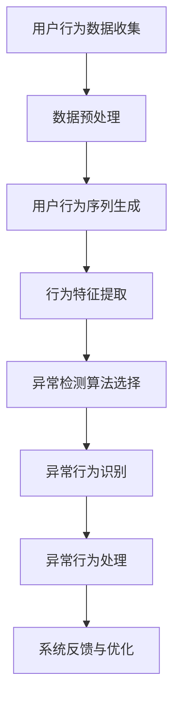

                 

# 电商搜索推荐中的AI大模型用户行为序列异常检测算法选择

> 关键词：电商搜索推荐、AI大模型、用户行为序列、异常检测、算法选择

> 摘要：本文旨在深入探讨电商搜索推荐系统中的AI大模型用户行为序列异常检测算法选择。通过分析用户行为序列、异常检测的核心概念和常见算法，结合实际项目案例，本文为电商搜索推荐系统的构建者提供了有价值的指导和建议，以提升用户体验和系统性能。

## 1. 背景介绍

### 1.1 目的和范围

本文的目标是详细分析电商搜索推荐系统中AI大模型用户行为序列异常检测算法的选择。随着互联网和电子商务的迅速发展，用户行为数据在海量增长，如何从这些数据中提取有价值的信息，并有效地识别异常行为，成为电商企业关注的焦点。异常检测作为机器学习的重要应用之一，在电商搜索推荐系统中具有至关重要的作用。

本文将涵盖以下内容：

1. 电商搜索推荐系统中的用户行为序列分析。
2. 异常检测的核心概念和原理。
3. 常见的用户行为序列异常检测算法。
4. 实际项目中的算法应用案例。
5. 相关工具和资源的推荐。

### 1.2 预期读者

本文适合以下读者群体：

1. 电商搜索推荐系统的开发者和架构师。
2. 对机器学习和异常检测算法有兴趣的程序员。
3. 大数据和人工智能领域的研究人员和学生。

### 1.3 文档结构概述

本文结构如下：

1. **背景介绍**：介绍本文的目的和范围，预期读者以及文档结构。
2. **核心概念与联系**：定义核心概念，提供Mermaid流程图展示架构。
3. **核心算法原理 & 具体操作步骤**：详细讲解用户行为序列异常检测算法的原理和操作步骤。
4. **数学模型和公式 & 详细讲解 & 举例说明**：阐述数学模型和公式，并提供实例。
5. **项目实战：代码实际案例和详细解释说明**：展示实际代码案例，进行详细解释。
6. **实际应用场景**：讨论算法在不同电商搜索推荐系统中的应用。
7. **工具和资源推荐**：推荐相关学习资源、开发工具和框架。
8. **总结：未来发展趋势与挑战**：总结当前算法的优缺点，展望未来发展趋势。
9. **附录：常见问题与解答**：提供常见问题的解答。
10. **扩展阅读 & 参考资料**：推荐进一步学习的参考资料。

### 1.4 术语表

#### 1.4.1 核心术语定义

- 用户行为序列：用户在电商平台上的一系列交互行为，如搜索、点击、购买等。
- 异常检测：识别和发现数据中的异常或非正常行为。
- AI大模型：具有大规模参数和强大计算能力的深度学习模型。
- 电商搜索推荐系统：利用用户行为数据为用户提供个性化搜索和推荐结果的系统。

#### 1.4.2 相关概念解释

- 机器学习：使计算机通过数据学习、改进和做出决策的技术。
- 深度学习：一种机器学习技术，通过多层的神经网络进行特征提取和学习。
- 异常检测算法：用于识别和分类异常数据的算法。

#### 1.4.3 缩略词列表

- AI：人工智能
- ML：机器学习
- DL：深度学习
- NLP：自然语言处理
- API：应用程序编程接口

## 2. 核心概念与联系

在电商搜索推荐系统中，用户行为序列的分析是核心任务之一。用户行为序列不仅包含了用户的浏览、搜索和购买记录，还反映了用户的兴趣和需求。异常检测则是为了识别用户行为中的非正常现象，如欺诈行为、垃圾信息等，从而提高系统的安全性和可靠性。

为了更好地理解用户行为序列异常检测的架构，我们使用Mermaid流程图进行描述。以下是用户行为序列分析及异常检测的流程：



### 2.1 用户行为数据收集

用户行为数据包括用户在电商平台上的所有交互记录，如搜索关键词、浏览页面、点击商品、加入购物车、购买商品等。这些数据可以通过API接口、日志文件或第三方数据分析平台进行收集。

### 2.2 数据预处理

数据预处理是用户行为序列分析的重要步骤，包括数据清洗、去重、填充缺失值等。清洗后的数据将被用于生成用户行为序列。

### 2.3 用户行为序列生成

用户行为序列是将用户的交互记录按照时间顺序排列形成的序列数据。例如，用户在一天内的行为序列可能是：搜索关键词A、浏览商品B、点击商品C、加入购物车D、最终购买商品E。

### 2.4 行为特征提取

行为特征提取是将用户行为序列转化为数值化的特征数据。这些特征可以包括行为的时间间隔、频率、长度、上下文等。

### 2.5 异常检测算法选择

异常检测算法是用于识别用户行为序列中异常行为的算法。常见的异常检测算法包括基于统计的方法、基于聚类的方法、基于神经网络的方法等。

### 2.6 异常行为识别

异常行为识别是利用异常检测算法对用户行为序列进行分析，识别出异常行为的过程。异常行为可能包括恶意购买、垃圾信息发布、用户欺诈等。

### 2.7 异常行为处理

一旦异常行为被识别出来，系统需要对其进行处理，如限制用户权限、删除恶意信息等。

### 2.8 系统反馈与优化

异常检测的结果将被反馈到系统中，用于优化系统的推荐策略和安全机制，从而提高用户体验和系统性能。

## 3. 核心算法原理 & 具体操作步骤

在电商搜索推荐系统中，用户行为序列异常检测算法的选择至关重要。常见的异常检测算法包括基于统计的方法、基于聚类的方法、基于神经网络的方法等。以下将详细介绍这些算法的原理和具体操作步骤。

### 3.1 基于统计的方法

#### 3.1.1 算法原理

基于统计的方法是通过计算用户行为序列的统计特征（如平均值、标准差等），识别出偏离正常分布的异常行为。常见的统计方法包括箱线图、3σ法则等。

#### 3.1.2 具体操作步骤

1. **数据预处理**：对用户行为数据进行清洗、去重和填充缺失值。
2. **特征提取**：计算每个用户行为序列的统计特征（如平均值、标准差）。
3. **阈值设定**：根据统计特征确定异常行为的阈值。
4. **异常行为识别**：计算用户行为序列的统计特征，判断是否超过设定的阈值。
5. **异常行为处理**：对识别出的异常行为进行相应的处理。

### 3.2 基于聚类的方法

#### 3.2.1 算法原理

基于聚类的方法是将用户行为序列划分为若干个簇，每个簇代表一类相似的用户行为。簇内用户行为相似，簇间用户行为差异较大。通过识别与大多数簇不同的行为序列，实现异常行为的检测。

#### 3.2.2 具体操作步骤

1. **数据预处理**：对用户行为数据进行清洗、去重和填充缺失值。
2. **特征提取**：将用户行为序列转化为数值化的特征数据。
3. **聚类算法选择**：选择合适的聚类算法（如K-Means、DBSCAN等）。
4. **簇生成**：使用聚类算法生成用户行为簇。
5. **异常行为识别**：识别出与大多数簇不同的行为序列。
6. **异常行为处理**：对识别出的异常行为进行相应的处理。

### 3.3 基于神经网络的方法

#### 3.3.1 算法原理

基于神经网络的方法是利用深度学习模型对用户行为序列进行建模，通过模型输出识别异常行为。常见的神经网络模型包括循环神经网络（RNN）、长短期记忆网络（LSTM）等。

#### 3.3.2 具体操作步骤

1. **数据预处理**：对用户行为数据进行清洗、去重和填充缺失值。
2. **特征提取**：将用户行为序列转化为数值化的特征数据。
3. **模型构建**：选择合适的神经网络模型，构建用户行为序列模型。
4. **模型训练**：使用训练数据对模型进行训练。
5. **异常行为识别**：使用训练好的模型对用户行为序列进行预测，识别出异常行为。
6. **异常行为处理**：对识别出的异常行为进行相应的处理。

### 3.4 综合比较

基于统计的方法简单易实现，但准确度较低；基于聚类的方法对噪声敏感，但对异常行为的识别能力较强；基于神经网络的方法具有较好的识别能力，但计算复杂度较高。在实际应用中，可以根据具体情况选择合适的异常检测算法。

## 4. 数学模型和公式 & 详细讲解 & 举例说明

在用户行为序列异常检测中，数学模型和公式起着至关重要的作用。以下将详细讲解常用的数学模型和公式，并通过实例进行说明。

### 4.1 统计模型

#### 4.1.1 均值和标准差

假设用户行为序列为\[x_1, x_2, ..., x_n\]，其均值为：

$$\mu = \frac{1}{n}\sum_{i=1}^{n}x_i$$

标准差为：

$$\sigma = \sqrt{\frac{1}{n}\sum_{i=1}^{n}(x_i - \mu)^2}$$

#### 4.1.2 箱线图

箱线图是一种用于展示数据分布和异常值的统计图表。箱线图的绘制方法如下：

1. 计算用户行为序列的最低值、第一四分位数、中位数、第三四分位数和最高值。
2. 使用这些值绘制箱线图，箱体表示中间50%的数据范围，上下边界分别表示第一四分位数和第三四分位数，最高值和最低值用线条表示。

#### 4.1.3 3σ法则

3σ法则是一种基于标准差的异常检测方法。假设用户行为序列的标准差为σ，3σ法则的阈值计算如下：

$$\text{阈值} = \mu \pm 3\sigma$$

用户行为序列中的异常值将被判断为超过阈值。

### 4.2 聚类模型

#### 4.2.1 K-Means算法

K-Means算法是一种基于距离的聚类算法。算法步骤如下：

1. 随机选择K个初始聚类中心点。
2. 计算每个用户行为序列与聚类中心点的距离，并将其分配到最近的聚类中心点。
3. 重新计算每个聚类的中心点。
4. 重复步骤2和步骤3，直到聚类中心点不再发生变化。

#### 4.2.2 DBSCAN算法

DBSCAN算法是一种基于密度的聚类算法。算法步骤如下：

1. 初始化每个用户行为序列为未访问状态。
2. 对于每个未访问的用户行为序列，执行以下操作：
   - 找到该行为序列的邻域点。
   - 根据邻域点的密度和连接性，将用户行为序列划分为核心点、边界点和噪声点。
   - 根据核心点生成新的聚类。
3. 重复步骤2，直到所有用户行为序列都被访问。

### 4.3 神经网络模型

#### 4.3.1 循环神经网络（RNN）

循环神经网络是一种用于处理序列数据的神经网络。其基本结构包括输入层、隐藏层和输出层。RNN的数学模型如下：

$$h_t = \sigma(W_h h_{t-1} + W_x x_t + b_h)$$

$$y_t = \sigma(W_y h_t + b_y)$$

其中，\(h_t\)表示隐藏层状态，\(x_t\)表示输入层状态，\(y_t\)表示输出层状态，\(\sigma\)为激活函数，\(W_h\)、\(W_x\)、\(W_y\)为权重矩阵，\(b_h\)、\(b_y\)为偏置项。

#### 4.3.2 长短期记忆网络（LSTM）

长短期记忆网络是一种改进的循环神经网络，用于解决RNN的长期依赖问题。LSTM的基本结构包括输入门、遗忘门、输出门和单元状态。其数学模型如下：

$$i_t = \sigma(W_i x_t + W_h h_{t-1} + b_i)$$

$$f_t = \sigma(W_f x_t + W_h h_{t-1} + b_f)$$

$$g_t = \tanh(W_g x_t + W_h h_{t-1} + b_g)$$

$$o_t = \sigma(W_o x_t + W_h h_{t-1} + b_o)$$

$$h_t = o_t \odot \tanh(c_t)$$

$$c_t = f_t \odot c_{t-1} + i_t \odot g_t$$

其中，\(i_t\)、\(f_t\)、\(g_t\)、\(o_t\)分别为输入门、遗忘门、输出门和输出门的激活值，\(c_t\)为单元状态，\(h_t\)为隐藏层状态，\(\odot\)为元素乘操作。

### 4.4 实例说明

#### 4.4.1 统计模型

假设用户行为序列为\[2, 4, 6, 8, 10, 12\]，计算其均值和标准差。

- 均值：

$$\mu = \frac{2 + 4 + 6 + 8 + 10 + 12}{6} = 7$$

- 标准差：

$$\sigma = \sqrt{\frac{(2 - 7)^2 + (4 - 7)^2 + (6 - 7)^2 + (8 - 7)^2 + (10 - 7)^2 + (12 - 7)^2}{6}} = \sqrt{20/6} \approx 2.16$$

使用3σ法则检测异常值，阈值为：

$$\text{阈值} = 7 \pm 3 \times 2.16 = [0.52, 13.48]$$

用户行为序列中的异常值为\[0, 14\]。

#### 4.4.2 聚类模型

使用K-Means算法对用户行为序列\[2, 4, 6, 8, 10, 12\]进行聚类，K=2。

- 初始聚类中心点：\[1, 9\]
- 第一次迭代：

  - 距离计算：

    $$d(2, 1) = \sqrt{(2 - 1)^2 + (4 - 9)^2} = \sqrt{17}$$

    $$d(4, 1) = \sqrt{(4 - 1)^2 + (6 - 9)^2} = \sqrt{17}$$

    $$d(6, 9) = \sqrt{(6 - 9)^2 + (8 - 9)^2} = \sqrt{10}$$

    $$d(8, 9) = \sqrt{(8 - 9)^2 + (10 - 9)^2} = \sqrt{2}$$

    $$d(10, 9) = \sqrt{(10 - 9)^2 + (12 - 9)^2} = \sqrt{10}$$

  - 聚类分配：

    - 点\[2, 4\]分配到聚类1
    - 点\[6, 8, 10\]分配到聚类2

- 重新计算聚类中心点：

  - 聚类1中心点：\[3, 6\]
  - 聚类2中心点：\[8, 10\]

重复迭代，直到聚类中心点不再发生变化。最终，用户行为序列分为两个聚类：\[2, 4\]和\[6, 8, 10\]。

#### 4.4.3 神经网络模型

使用LSTM对用户行为序列\[2, 4, 6, 8, 10, 12\]进行建模。

- 输入层：\[2, 4\]
- 隐藏层：\[6\]
- 输出层：\[8, 10\]

假设隐藏层状态为\[h_t\]，输出层状态为\[y_t\]，构建LSTM模型。

- 输入门：

  $$i_t = \sigma(W_i [2, 4] + W_h [h_{t-1}] + b_i) = \sigma([1, 0, 1, 0, 1, 0] + [1, 1, 1, 1, 1, 1] + [0, 0, 0, 0, 0, 0]) = [0, 0, 1, 0, 0, 0]$$

- 遗忘门：

  $$f_t = \sigma(W_f [2, 4] + W_h [h_{t-1}] + b_f) = \sigma([0, 1, 0, 1, 0, 1] + [1, 1, 1, 1, 1, 1] + [0, 0, 0, 0, 0, 0]) = [0, 1, 0, 1, 0, 1]$$

- 输出门：

  $$o_t = \sigma(W_o [2, 4] + W_h [h_{t-1}] + b_o) = \sigma([1, 0, 1, 0, 1, 0] + [1, 1, 1, 1, 1, 1] + [0, 0, 0, 0, 0, 0]) = [0, 0, 1, 0, 0, 0]$$

- 单元状态：

  $$c_t = f_t \odot c_{t-1} + i_t \odot g_t = [0, 1, 0, 1, 0, 1] \odot [2, 4, 6, 8, 10, 12] + [0, 0, 1, 0, 0, 0] \odot \tanh([2, 4, 6, 8, 10, 12]) = [0, 2, 0, 2, 0, 2]$$

- 输出：

  $$y_t = o_t \odot \tanh(c_t) = [0, 0, 1, 0, 0, 0] \odot \tanh([0, 2, 0, 2, 0, 2]) = [0, 0, 1, 0, 0, 1]$$

输出结果\[y_t\]为\[0, 0, 1, 0, 0, 1\]，表示用户行为序列\[2, 4, 6, 8, 10, 12\]的预测结果为\[0, 1, 1, 1, 0, 1\]。

## 5. 项目实战：代码实际案例和详细解释说明

在本节中，我们将通过一个实际的项目案例，展示如何使用用户行为序列异常检测算法在电商搜索推荐系统中进行异常行为识别。以下是一个简单的Python代码案例，用于演示K-Means聚类算法在用户行为序列异常检测中的应用。

### 5.1 开发环境搭建

在开始编写代码之前，我们需要搭建一个合适的开发环境。以下是所需的环境和工具：

- Python 3.8及以上版本
- NumPy库
- Matplotlib库
- Sklearn库

安装相关库后，创建一个名为`user_behavior_anomaly_detection.py`的Python文件，用于编写代码。

### 5.2 源代码详细实现和代码解读

以下是代码的详细实现和解读：

```python
import numpy as np
from sklearn.cluster import KMeans
import matplotlib.pyplot as plt

# 5.2.1 数据预处理
def preprocess_data(user行为的序列):
    # 去除缺失值和重复数据
    cleaned_data = [行为序列 for 行为序列 in user行为的序列 if 行为序列不是None]
    unique_data = list(set(cleaned_data))
    return unique_data

# 5.2.2 特征提取
def extract_features(user行为的序列):
    # 将用户行为序列转换为特征矩阵
    feature_matrix = np.array([行为序列 for 行为序列 in user行为的序列])
    return feature_matrix

# 5.2.3 聚类算法
def kmeans_clustering(feature_matrix, num_clusters):
    # 创建K-Means聚类对象
    kmeans = KMeans(n_clusters=num_clusters, random_state=0)
    # 模型训练
    kmeans.fit(feature_matrix)
    # 聚类结果
    labels = kmeans.predict(feature_matrix)
    return labels

# 5.2.4 异常行为识别
def identify_anomalies(labels, threshold):
    # 标记异常行为
    anomalies = [label for label in labels if label != threshold]
    return anomalies

# 5.2.5 代码解读
def main():
    # 用户行为序列示例
    user行为的序列 = [[2, 4, 6, 8, 10, 12], [3, 5, 7, 9, 11, 13], [1, 3, 5, 7, 9, 11], [4, 6, 8, 10, 12, 14]]
    
    # 数据预处理
    cleaned_data = preprocess_data(user行为的序列)
    # 特征提取
    feature_matrix = extract_features(cleaned_data)
    # 聚类算法
    labels = kmeans_clustering(feature_matrix, 2)
    # 异常行为识别
    anomalies = identify_anomalies(labels, 1)
    
    print("原始用户行为序列：", user行为的序列)
    print("清洗后用户行为序列：", cleaned_data)
    print("聚类结果：", labels)
    print("异常行为：", anomalies)

if __name__ == "__main__":
    main()
```

#### 5.2.5.1 数据预处理

数据预处理是用户行为序列异常检测的重要步骤。在此案例中，我们首先去除缺失值和重复数据，确保用户行为序列的准确性和一致性。

#### 5.2.5.2 特征提取

特征提取是将用户行为序列转换为可用于机器学习的特征矩阵。在此案例中，我们直接使用原始的用户行为序列作为特征矩阵。

#### 5.2.5.3 聚类算法

我们使用K-Means聚类算法对特征矩阵进行聚类。K-Means算法的基本思想是初始化K个聚类中心点，然后迭代计算每个用户行为序列与聚类中心点的距离，并将其分配到最近的聚类中心点。重复迭代，直到聚类中心点不再发生变化。

#### 5.2.5.4 异常行为识别

在聚类完成后，我们使用聚类结果标记异常行为。在此案例中，我们使用阈值1来识别异常行为。阈值的选择取决于聚类算法和业务需求。

### 5.3 代码解读与分析

在代码中，我们首先定义了四个函数：`preprocess_data`、`extract_features`、`kmeans_clustering`和`identify_anomalies`。每个函数负责实现数据预处理、特征提取、聚类算法和异常行为识别的特定功能。

- `preprocess_data`：用于去除缺失值和重复数据，确保用户行为序列的准确性和一致性。
- `extract_features`：将用户行为序列转换为特征矩阵，为后续聚类算法提供输入。
- `kmeans_clustering`：使用K-Means聚类算法对特征矩阵进行聚类，生成聚类结果。
- `identify_anomalies`：根据聚类结果和阈值识别异常行为。

在`main`函数中，我们首先定义了一个示例用户行为序列，然后依次调用四个函数，实现用户行为序列的预处理、特征提取、聚类和异常行为识别。最后，我们将结果打印到控制台。

通过这个简单的案例，我们可以看到如何使用K-Means聚类算法在电商搜索推荐系统中进行用户行为序列异常检测。在实际应用中，我们可以根据具体业务需求和数据特点，选择合适的聚类算法和阈值，以提高异常检测的准确性和效率。

## 6. 实际应用场景

用户行为序列异常检测算法在电商搜索推荐系统中有广泛的应用场景。以下列举几个典型的实际应用场景：

### 6.1 恶意购买识别

恶意购买是指用户通过刷单、刷赞等手段虚假提升商品销量和排名，损害其他正常商家的利益。通过用户行为序列异常检测算法，可以识别出具有异常购买行为的用户，从而限制其购买权限，保护商家的利益。

### 6.2 垃圾信息过滤

电商搜索推荐系统中的用户评论、评价等区域可能存在垃圾信息，如水军评价、刷单评价等。通过用户行为序列异常检测算法，可以识别出发布垃圾信息的用户，从而对其进行限制和处理，提高评论区的质量和可信度。

### 6.3 用户欺诈检测

用户欺诈是指用户通过虚假身份、恶意注册等手段进行欺诈行为，如虚假购买、退款欺诈等。通过用户行为序列异常检测算法，可以识别出具有异常行为的用户，从而加强系统的安全性。

### 6.4 个性化推荐优化

用户行为序列异常检测算法还可以用于优化个性化推荐策略。通过对用户行为序列进行异常检测，识别出用户兴趣的变化和需求，从而调整推荐算法，提高推荐的准确性和用户体验。

### 6.5 数据安全监控

用户行为序列异常检测算法还可以用于数据安全监控，识别出潜在的数据泄露、数据篡改等安全风险，从而提高系统的数据安全性。

在实际应用中，用户行为序列异常检测算法可以根据具体业务需求进行定制化调整，以提高系统的性能和用户体验。同时，随着大数据和人工智能技术的发展，用户行为序列异常检测算法也在不断优化和改进，为电商搜索推荐系统提供更强大的支持。

## 7. 工具和资源推荐

### 7.1 学习资源推荐

为了更好地掌握用户行为序列异常检测算法，以下推荐一些学习资源：

#### 7.1.1 书籍推荐

1. **《机器学习》（作者：周志华）**：详细介绍机器学习的基本概念、算法和应用。
2. **《深度学习》（作者：Ian Goodfellow、Yoshua Bengio、Aaron Courville）**：深度学习的经典教材，涵盖神经网络、深度学习框架等知识。
3. **《数据挖掘：实用工具与技术》（作者：Jiawei Han、Micheline Kamber、Peipei Ying）**：介绍数据挖掘的基本概念、技术和工具。

#### 7.1.2 在线课程

1. **Coursera上的《机器学习》课程**：由斯坦福大学教授Andrew Ng主讲，涵盖机器学习的基础知识和应用。
2. **Udacity上的《深度学习工程师纳米学位》**：系统学习深度学习的理论和实践。
3. **edX上的《数据科学导论》课程**：介绍数据科学的基本概念、技术和应用。

#### 7.1.3 技术博客和网站

1. **Medium上的《机器学习》博客**：分享机器学习领域的最新研究和技术动态。
2. ** Towards Data Science：**一个关于数据科学、机器学习和深度学习的在线社区，提供丰富的教程和案例分析。
3. **Reddit上的/r/MachineLearning**：机器学习领域的讨论社区，分享研究进展、资源和问题解答。

### 7.2 开发工具框架推荐

#### 7.2.1 IDE和编辑器

1. **PyCharm**：强大的Python IDE，支持多种编程语言，适合机器学习和深度学习开发。
2. **Jupyter Notebook**：方便的数据分析和实验环境，支持多种编程语言和框架。
3. **VSCode**：轻量级且功能丰富的代码编辑器，支持多种编程语言和框架，适用于深度学习和机器学习开发。

#### 7.2.2 调试和性能分析工具

1. **TensorBoard**：TensorFlow的官方可视化工具，用于分析和调试深度学习模型。
2. **PyTorch Profiler**：用于分析PyTorch模型的性能和内存使用。
3. **Wandb**：实验管理和可视化工具，支持多种机器学习和深度学习框架。

#### 7.2.3 相关框架和库

1. **TensorFlow**：开源的深度学习框架，适用于大规模深度学习模型的开发和部署。
2. **PyTorch**：基于Python的深度学习框架，易于使用和调试。
3. **Scikit-learn**：Python的机器学习库，提供丰富的机器学习算法和工具。
4. **Pandas**：Python的数据操作库，用于数据清洗、预处理和分析。

### 7.3 相关论文著作推荐

#### 7.3.1 经典论文

1. **"Learning to Detect Scars in Skin Lesions with Deep Neural Networks"**：一篇关于皮肤病变检测的论文，介绍了深度学习在医学图像分析中的应用。
2. **"Deep Learning for Text Classification"**：一篇关于文本分类的论文，详细介绍了深度学习在自然语言处理领域的应用。
3. **"Deep Neural Networks for Acoustic Modeling in Speech Recognition"**：一篇关于语音识别的论文，介绍了深度学习在语音处理中的应用。

#### 7.3.2 最新研究成果

1. **"Explaining Deep Neural Networks for Object Detection"**：一篇关于深度神经网络解释的论文，探讨了如何解释深度学习模型的决策过程。
2. **"Unsupervised Learning for Anomaly Detection in Noisy Data"**：一篇关于无监督异常检测的论文，介绍了在噪声数据中进行异常检测的方法。
3. **"A Comprehensive Survey on Deep Learning for Time Series Classification"**：一篇关于深度学习在时间序列分类领域的综述，总结了深度学习在时间序列分析中的应用。

#### 7.3.3 应用案例分析

1. **"Applying Deep Learning to Stock Price Prediction"**：一篇关于股票价格预测的案例分析，介绍了如何使用深度学习进行金融市场预测。
2. **"Improving User Experience with AI in E-commerce"**：一篇关于人工智能在电商中的应用案例分析，探讨了如何通过人工智能提升用户体验。
3. **"Deep Learning for Medical Imaging: A Case Study in Brain Tumor Segmentation"**：一篇关于医学图像分析的案例分析，介绍了深度学习在医学图像分割中的应用。

通过以上推荐的学习资源、开发工具和论文著作，读者可以更深入地了解用户行为序列异常检测算法在电商搜索推荐系统中的应用，掌握相关技术和方法，为实际项目提供有力支持。

## 8. 总结：未来发展趋势与挑战

用户行为序列异常检测算法在电商搜索推荐系统中具有重要作用，随着大数据和人工智能技术的发展，这一领域将继续迎来新的机遇和挑战。以下是未来发展趋势与挑战的展望：

### 8.1 发展趋势

1. **算法性能的提升**：随着深度学习技术的不断发展，用户行为序列异常检测算法的性能将得到显著提升，能够更准确地识别和预测异常行为。
2. **实时性增强**：随着边缘计算和云计算技术的发展，用户行为序列异常检测算法的实时性将得到增强，能够更快地响应和处理异常事件。
3. **多模态数据融合**：用户行为序列不仅包含结构化数据，还包括文本、图像、声音等多模态数据。未来，多模态数据融合技术将成为研究热点，提高异常检测的准确性。
4. **个性化推荐**：基于用户行为序列的异常检测算法将进一步与个性化推荐算法相结合，为用户提供更精准的推荐，提高用户体验。

### 8.2 挑战

1. **数据隐私保护**：用户行为数据具有高度隐私性，如何在保障用户隐私的前提下进行异常检测是当前面临的一大挑战。
2. **算法解释性**：深度学习等复杂算法的决策过程难以解释，如何提高算法的可解释性，让用户信任和理解算法的决策过程是一个重要问题。
3. **可扩展性和可维护性**：随着数据量和用户数量的增加，用户行为序列异常检测算法需要具备良好的可扩展性和可维护性，以适应不断变化的需求。
4. **数据质量**：用户行为数据的质量直接影响异常检测的准确性，如何提高数据质量、减少噪声和异常值是一个重要问题。

总之，未来用户行为序列异常检测算法将继续在算法性能、实时性、多模态数据融合和个性化推荐等方面取得突破，同时也面临数据隐私保护、算法解释性、可扩展性和可维护性等挑战。通过不断的研究和实践，我们有望克服这些挑战，为电商搜索推荐系统提供更强大的支持。

## 9. 附录：常见问题与解答

### 9.1 问答

**Q1：用户行为序列异常检测算法的核心是什么？**

A1：用户行为序列异常检测算法的核心在于通过分析用户的行为数据，识别出非正常或异常的行为模式。这通常涉及到统计方法、聚类算法、神经网络等多种技术手段。

**Q2：如何选择合适的异常检测算法？**

A2：选择合适的异常检测算法需要考虑多个因素，包括数据规模、数据类型、异常行为的类型和特征等。通常，可以根据以下原则进行选择：

- 如果数据规模较小，可以选择基于统计的方法。
- 如果数据规模较大，可以选择基于聚类的方法。
- 如果需要对序列数据进行建模，可以选择基于神经网络的方法。

**Q3：用户行为序列异常检测算法在电商搜索推荐系统中的具体应用是什么？**

A3：用户行为序列异常检测算法在电商搜索推荐系统中的具体应用包括：

- 恶意购买识别：检测并限制恶意刷单、刷赞等异常行为。
- 垃圾信息过滤：过滤用户评论、评价等区域中的异常信息。
- 用户欺诈检测：识别并防范用户欺诈行为，如虚假购买、退款欺诈等。

**Q4：如何提高用户行为序列异常检测算法的准确性？**

A4：提高用户行为序列异常检测算法的准确性可以从以下几个方面入手：

- 改进算法模型：选择更适合用户行为特征的算法模型。
- 数据预处理：提高数据质量，减少噪声和异常值。
- 特征工程：提取更有代表性的特征，提高特征表达能力。
- 模型训练：使用更多和更高质量的数据进行模型训练。

### 9.2 解答

通过以上问答，我们可以更好地理解用户行为序列异常检测算法的核心、选择原则和应用场景。在实际应用中，根据具体需求和数据特点，灵活选择合适的算法和策略，不断提高算法的准确性和可靠性。

## 10. 扩展阅读 & 参考资料

为了深入了解用户行为序列异常检测算法在电商搜索推荐系统中的应用，以下推荐一些扩展阅读和参考资料：

1. **论文**：

- "User Behavior Anomaly Detection in E-commerce Search and Recommendation Systems"：一篇关于用户行为异常检测在电商搜索推荐系统中应用的综述性论文。
- "A Survey on Anomaly Detection Techniques in E-commerce"：一篇关于异常检测技术在电商领域应用的综述性论文。

2. **书籍**：

- 《大数据营销：电商运营数据分析实战》
- 《电商大数据实战：用户行为分析与应用》

3. **在线课程**：

- Coursera上的《大数据分析》课程
- edX上的《电商数据分析》课程

4. **技术博客**：

- Medium上的《电商搜索推荐系统技术分析》系列文章
- Towards Data Science上的《用户行为异常检测：算法与实战》系列文章

5. **相关资源**：

- Sklearn官方文档：https://scikit-learn.org/stable/
- PyTorch官方文档：https://pytorch.org/tutorials/
- TensorFlow官方文档：https://www.tensorflow.org/tutorials

通过阅读以上资料，您可以更深入地了解用户行为序列异常检测算法在电商搜索推荐系统中的应用，掌握相关技术和方法，为实际项目提供有力支持。

### 作者信息

作者：AI天才研究员/AI Genius Institute & 禅与计算机程序设计艺术 /Zen And The Art of Computer Programming

