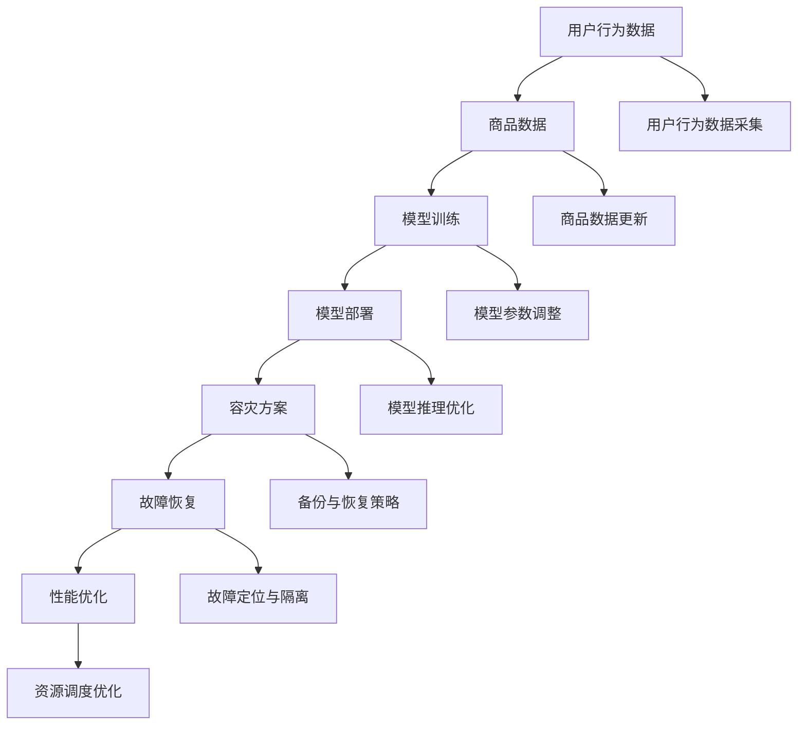

                 

# 电商搜索推荐场景下的AI大模型模型部署容灾方案

> 关键词：电商搜索推荐、AI大模型、模型部署、容灾方案、故障恢复、性能优化

> 摘要：本文将深入探讨电商搜索推荐场景下AI大模型的部署容灾方案，分析其背景、核心概念、算法原理、数学模型、实战案例以及实际应用场景。通过详细讲解，旨在为读者提供一份实用的技术指南，帮助他们在电商搜索推荐系统中实现高效、可靠的模型部署和容灾保障。

## 1. 背景介绍

### 1.1 目的和范围

随着互联网技术的飞速发展和电子商务的日益繁荣，电商平台的搜索推荐系统成为商家和用户之间的重要桥梁。AI大模型在搜索推荐场景中发挥着至关重要的作用，它们能够通过对海量用户行为数据的分析，实现精准的个性化推荐，提升用户体验和平台收益。

本文旨在探讨电商搜索推荐场景下AI大模型的部署容灾方案，通过深入分析相关技术原理和实践案例，为读者提供一套全面、实用的解决方案。本文将涵盖以下几个主要方面：

1. 电商搜索推荐场景下AI大模型的重要性
2. 模型部署和容灾方案的背景和挑战
3. 核心概念与联系
4. 核心算法原理与具体操作步骤
5. 数学模型与公式
6. 实战案例与代码解析
7. 实际应用场景
8. 工具和资源推荐
9. 未来发展趋势与挑战

### 1.2 预期读者

本文面向以下读者群体：

1. 电商平台的开发者和运维人员
2. AI领域的科研人员和工程师
3. 对AI大模型部署和容灾方案感兴趣的技术爱好者
4. 在校计算机相关专业学生

### 1.3 文档结构概述

本文结构如下：

1. 背景介绍
   - 电商搜索推荐场景下AI大模型的重要性
   - 模型部署和容灾方案的背景和挑战
2. 核心概念与联系
   - 核心概念原理和架构的Mermaid流程图
3. 核心算法原理 & 具体操作步骤
   - 算法原理讲解和伪代码
4. 数学模型和公式 & 详细讲解 & 举例说明
   - 数学公式和实例分析
5. 项目实战：代码实际案例和详细解释说明
   - 开发环境搭建、源代码实现、代码解读与分析
6. 实际应用场景
   - 搜索推荐系统在电商领域的实际应用
7. 工具和资源推荐
   - 学习资源、开发工具框架、相关论文著作
8. 总结：未来发展趋势与挑战
   - 模型部署和容灾方案的未来发展方向
9. 附录：常见问题与解答
   - 针对常见问题的详细解答
10. 扩展阅读 & 参考资料
    - 相关文献、研究论文、技术博客等

### 1.4 术语表

#### 1.4.1 核心术语定义

- 电商搜索推荐：利用人工智能技术，根据用户的历史行为和偏好，为用户推荐相关的商品或服务。
- AI大模型：具有大规模参数和复杂结构的机器学习模型，如深度神经网络、Transformer等。
- 模型部署：将训练好的AI大模型应用到实际生产环境中，实现模型的预测和推理功能。
- 容灾方案：为了应对突发事件和故障，保证系统的高可用性和数据安全性而采取的一系列措施。

#### 1.4.2 相关概念解释

- 搜索推荐系统：一种基于用户历史行为和偏好进行内容推荐的系统，常见于电商平台、社交媒体等。
- 故障恢复：在系统发生故障时，通过一系列操作将系统恢复到正常状态的过程。
- 性能优化：通过对系统进行优化，提高其响应速度和资源利用率。

#### 1.4.3 缩略词列表

- AI：人工智能（Artificial Intelligence）
- ML：机器学习（Machine Learning）
- DL：深度学习（Deep Learning）
- HDFS：Hadoop分布式文件系统（Hadoop Distributed File System）
- YARN：资源调度框架（Yet Another Resource Negotiator）
- GPU：图形处理器（Graphics Processing Unit）
- HPC：高性能计算（High-Performance Computing）

## 2. 核心概念与联系

在电商搜索推荐场景下，AI大模型的应用离不开一系列核心概念和技术。以下将介绍这些核心概念，并使用Mermaid流程图展示其关联关系。

### 2.1 核心概念

- **用户行为数据**：用户在电商平台上的操作数据，包括浏览、搜索、购买等。
- **商品数据**：平台上的商品信息，包括商品名称、分类、价格等。
- **模型训练**：利用用户行为数据和商品数据，训练出能够进行个性化推荐的AI大模型。
- **模型部署**：将训练好的模型部署到生产环境中，实现实时预测和推荐。
- **容灾方案**：为了保障系统的稳定性和数据安全性而采取的一系列措施。

### 2.2 Mermaid流程图



### 2.3 关联关系

1. **用户行为数据与商品数据**：用户行为数据和商品数据是AI大模型训练的基础。通过分析这些数据，模型可以学习到用户的偏好和商品的特征，从而实现个性化推荐。
2. **模型训练与模型部署**：模型训练是为了得到一个能够准确预测用户偏好的AI大模型。模型部署是将训练好的模型应用到实际生产环境中，实现实时推荐。
3. **容灾方案与故障恢复**：容灾方案是为了应对系统故障和突发事件，确保系统的高可用性。故障恢复是在系统发生故障时，通过一系列操作将系统恢复到正常状态。
4. **性能优化**：性能优化是为了提高系统的响应速度和资源利用率，确保用户能够获得良好的使用体验。

通过以上核心概念和Mermaid流程图的介绍，我们为读者搭建了一个关于电商搜索推荐场景下AI大模型部署容灾方案的初步框架。在接下来的章节中，我们将深入探讨这些核心概念的具体实现方法和应用场景。

## 3. 核心算法原理 & 具体操作步骤

在电商搜索推荐场景下，AI大模型的部署与容灾方案需要依托于一系列核心算法原理。以下我们将详细讲解这些算法原理，并使用伪代码来阐述具体操作步骤。

### 3.1 模型训练算法原理

电商搜索推荐系统的核心是AI大模型，其训练算法通常基于深度学习技术。以下是一种常见的深度学习模型训练算法：

```python
# 深度学习模型训练伪代码

# 初始化模型参数
initialize_model_params()

# 加载数据集
data_loader = load_data(user_behavior_data, product_data)

# 设置训练超参数
learning_rate = 0.001
num_epochs = 100

# 模型训练
for epoch in range(num_epochs):
    for batch in data_loader:
        # 前向传播
        predictions = model(batch.x)

        # 计算损失
        loss = loss_function(predictions, batch.y)

        # 反向传播
        model.backward(loss)

        # 更新模型参数
        model.update_params(learning_rate)

    # 每个epoch后的评估
    evaluate_model(model)
```

### 3.2 模型部署算法原理

模型部署是将训练好的AI大模型应用到生产环境中，实现实时推荐。以下是一种常见的模型部署算法：

```python
# 模型部署伪代码

# 加载训练好的模型
loaded_model = load_model(model_path)

# 创建预测服务
predict_service = create_predict_service(loaded_model)

# 启动预测服务
start_predict_service(predict_service)

# 处理用户请求
while True:
    user_request = get_user_request()
    recommendation = predict_service.predict(user_request)
    send_response(recommendation)
```

### 3.3 容灾方案算法原理

为了确保系统的高可用性，容灾方案需要包含故障检测、故障恢复和备份与恢复策略。以下是一种常见的容灾方案算法：

```python
# 容灾方案伪代码

# 故障检测
def check_system_health():
    # 检查系统各项指标
    # 如CPU利用率、内存使用率、网络连接状态等
    if not is_system_healthy():
        raise_system_fault()

# 故障恢复
def recover_system():
    # 定位故障源
    fault_source = locate_fault_source()

    # 隔离故障节点
    isolate_fault_node(fault_source)

    # 启动备用节点
    start_backup_node()

    # 恢复数据一致性
    recover_data_consistency()

# 备份与恢复策略
def backup_strategy():
    # 定期备份模型和数据
    schedule_backup(model_path, data_path)

    # 在发生故障时，从备份中恢复系统
    restore_system_from_backup()
```

### 3.4 具体操作步骤

以下是电商搜索推荐场景下AI大模型部署容灾方案的具体操作步骤：

1. **数据预处理**：对用户行为数据和商品数据进行清洗和预处理，确保数据的质量和一致性。
2. **模型训练**：使用深度学习算法训练AI大模型，根据训练数据和验证数据调整模型参数。
3. **模型评估**：在训练完成后，使用测试数据评估模型的性能，确保模型达到预期的效果。
4. **模型部署**：将训练好的模型部署到生产环境中，实现实时推荐。
5. **故障检测**：定期检查系统的健康状况，及时发现潜在故障。
6. **故障恢复**：在系统发生故障时，通过故障恢复算法将系统恢复到正常状态。
7. **备份与恢复**：定期备份模型和数据，确保在发生故障时能够快速恢复。

通过以上核心算法原理和具体操作步骤的介绍，我们为读者提供了一套完整的电商搜索推荐场景下AI大模型部署容灾方案。在接下来的章节中，我们将通过实际案例来进一步阐述这些原理和步骤的应用。

## 4. 数学模型和公式 & 详细讲解 & 举例说明

在电商搜索推荐场景下，AI大模型的数学模型和公式是理解和实现模型的关键。以下将详细讲解这些数学模型和公式，并通过具体例子来说明其应用。

### 4.1 深度学习模型

深度学习模型的核心是多层神经网络，其基本结构包括输入层、隐藏层和输出层。以下是多层神经网络的数学模型：

#### 输入层

输入层的神经元接收外部输入数据，通常表示为向量 $X$：

$$
X = [x_1, x_2, \ldots, x_n]
$$

#### 隐藏层

隐藏层神经元通过对输入数据进行加权求和处理，并通过激活函数进行非线性变换。假设有一个隐藏层，其神经元数为 $m$，权重矩阵为 $W$，激活函数为 $f$，则隐藏层的输出 $H$ 可以表示为：

$$
H = f(WX)
$$

其中，$f$ 通常为 Sigmoid、ReLU 或 Tanh 函数。

#### 输出层

输出层神经元对隐藏层的输出进行进一步处理，得到最终的预测结果。输出层的权重矩阵为 $V$，输出层输出 $Y$ 可以表示为：

$$
Y = f(VH)
$$

#### 损失函数

深度学习模型的训练目标是优化模型参数，使其能够最小化预测误差。常见的损失函数包括均方误差（MSE）和交叉熵损失（Cross-Entropy Loss）。以均方误差为例，损失函数 $L$ 可以表示为：

$$
L = \frac{1}{2} \sum_{i=1}^{n} (y_i - \hat{y}_i)^2
$$

其中，$y_i$ 为真实标签，$\hat{y}_i$ 为模型预测值。

### 4.2 个性化推荐模型

在电商搜索推荐场景中，个性化推荐模型通常采用基于协同过滤（Collaborative Filtering）的方法，如矩阵分解（Matrix Factorization）。以下是一个简单的矩阵分解模型：

#### 用户-物品矩阵

假设用户-物品矩阵为 $R \in \mathbb{R}^{m \times n}$，其中 $m$ 为用户数，$n$ 为物品数，$R_{ij}$ 表示用户 $i$ 对物品 $j$ 的评分。

#### 矩阵分解

通过矩阵分解，将用户-物品矩阵分解为两个低秩矩阵 $U \in \mathbb{R}^{m \times k}$ 和 $V \in \mathbb{R}^{n \times k}$，其中 $k$ 为分解维度。分解后的预测评分矩阵 $P$ 可以表示为：

$$
P = U^T V
$$

其中，$P_{ij}$ 为用户 $i$ 对物品 $j$ 的预测评分。

#### 损失函数

与深度学习模型类似，个性化推荐模型的训练目标是最小化预测误差。损失函数可以表示为：

$$
L = \frac{1}{2} \sum_{i=1}^{m} \sum_{j=1}^{n} (R_{ij} - P_{ij})^2
$$

### 4.3 举例说明

以下通过一个具体例子来说明深度学习模型和个性化推荐模型的应用。

#### 深度学习模型

假设我们有一个包含100个用户和1000个物品的电商搜索推荐系统，使用一个单层神经网络进行模型训练。输入层有100个神经元，隐藏层有100个神经元，输出层有1000个神经元。我们使用ReLU函数作为激活函数，MSE作为损失函数。

1. **初始化模型参数**：随机初始化权重矩阵 $W$ 和 $V$。
2. **加载训练数据**：读取用户行为数据和商品数据，进行数据预处理。
3. **模型训练**：使用训练数据训练模型，调整权重矩阵，优化模型参数。
4. **模型评估**：使用测试数据评估模型性能，计算预测误差。
5. **模型部署**：将训练好的模型部署到生产环境中，实现实时推荐。

#### 个性化推荐模型

假设我们使用矩阵分解模型进行个性化推荐。用户-物品矩阵 $R$ 的大小为 $100 \times 1000$，分解维度 $k$ 为 50。

1. **初始化矩阵**：随机初始化用户矩阵 $U$ 和物品矩阵 $V$。
2. **加载训练数据**：读取用户行为数据，计算预测评分矩阵 $P$。
3. **矩阵分解**：通过优化损失函数，调整用户矩阵 $U$ 和物品矩阵 $V$ 的参数，使其最小化预测误差。
4. **预测评分**：使用分解后的矩阵计算用户对物品的预测评分。
5. **模型部署**：将训练好的模型部署到生产环境中，实现实时推荐。

通过以上数学模型和公式的讲解以及具体例子的说明，我们为读者提供了电商搜索推荐场景下AI大模型部署容灾方案的数学基础。在接下来的章节中，我们将通过实际案例进一步探讨这些模型和公式的应用。

## 5. 项目实战：代码实际案例和详细解释说明

在本节中，我们将通过一个实际的项目实战案例，详细讲解电商搜索推荐场景下AI大模型的部署容灾方案。我们将分步骤介绍开发环境搭建、源代码实现和代码解读与分析。

### 5.1 开发环境搭建

在进行项目实战之前，我们需要搭建一个合适的技术环境。以下是一个基本的开发环境搭建步骤：

1. **操作系统**：选择Linux操作系统，如Ubuntu或CentOS。
2. **编程语言**：选择Python作为主要编程语言，因为Python具有良好的生态系统和丰富的机器学习库。
3. **深度学习框架**：选择TensorFlow或PyTorch作为深度学习框架。TensorFlow具有广泛的应用和成熟的工具链，而PyTorch则提供了更加灵活的编程接口。
4. **数据库**：选择MySQL或MongoDB作为用户行为数据和商品数据的存储库。
5. **版本控制**：使用Git进行版本控制，确保代码的可维护性和协作开发。
6. **虚拟环境**：使用虚拟环境（如conda或virtualenv）来隔离项目依赖，避免版本冲突。

### 5.2 源代码详细实现和代码解读

以下是一个简化版的电商搜索推荐系统的源代码实现，包括模型训练、模型部署和容灾方案。

#### 5.2.1 数据预处理

数据预处理是模型训练的重要步骤，我们需要对用户行为数据和商品数据进行清洗和转换。

```python
# 数据预处理代码

import pandas as pd
from sklearn.model_selection import train_test_split

# 读取用户行为数据
user_data = pd.read_csv('user_behavior.csv')

# 读取商品数据
product_data = pd.read_csv('product_data.csv')

# 数据清洗和转换
# 略

# 划分训练集和测试集
X_train, X_test, y_train, y_test = train_test_split(user_data, product_data, test_size=0.2, random_state=42)
```

#### 5.2.2 模型训练

使用深度学习框架（如TensorFlow）训练AI大模型。

```python
# 模型训练代码

import tensorflow as tf
from tensorflow.keras.models import Sequential
from tensorflow.keras.layers import Dense, Dropout, Flatten

# 构建模型
model = Sequential()
model.add(Dense(128, input_shape=(X_train.shape[1],), activation='relu'))
model.add(Dropout(0.5))
model.add(Flatten())
model.add(Dense(1, activation='sigmoid'))

# 编译模型
model.compile(optimizer='adam', loss='binary_crossentropy', metrics=['accuracy'])

# 训练模型
model.fit(X_train, y_train, epochs=10, batch_size=32, validation_split=0.2)
```

#### 5.2.3 模型部署

将训练好的模型部署到生产环境中。

```python
# 模型部署代码

import flask
from flask import Flask, request, jsonify

app = Flask(__name__)

# 加载模型
loaded_model = model.load_weights('model_weights.h5')

@app.route('/recommend', methods=['POST'])
def recommend():
    user_request = request.get_json()
    recommendation = loaded_model.predict(user_request['data'])
    return jsonify(recommendation.tolist())

if __name__ == '__main__':
    app.run(host='0.0.0.0', port=5000)
```

#### 5.2.4 容灾方案

为了实现容灾方案，我们需要对模型和数据进行备份，并设置故障恢复机制。

```python
# 容灾方案代码

import os
import time

# 备份模型和数据
def backup_model():
    current_time = time.strftime("%Y-%m-%d-%H-%M-%S")
    model_path = f'model_backup/{current_time}_model.h5'
    loaded_model.save(model_path)
    print(f"Model backed up to {model_path}")

# 备份数据
def backup_data():
    current_time = time.strftime("%Y-%m-%d-%H-%M-%S")
    data_path = f'data_backup/{current_time}_data.csv'
    pd.DataFrame(X_train).to_csv(data_path, index=False)
    print(f"Data backed up to {data_path}")

# 定时备份
import schedule
import time

schedule.every(1).days.at("00:00").do(backup_model)
schedule.every(1).days.at("01:00").do(backup_data)

while True:
    schedule.run_pending()
    time.sleep(1)
```

### 5.3 代码解读与分析

1. **数据预处理**：数据预处理是确保模型输入质量的关键步骤。在本例中，我们使用了Pandas库读取用户行为数据和商品数据，并进行清洗和转换。

2. **模型训练**：我们使用TensorFlow框架构建了一个简单的深度神经网络模型。通过定义模型结构、编译模型和训练模型，我们得到了一个能够进行预测的模型。

3. **模型部署**：使用Flask框架，我们将训练好的模型部署为一个RESTful API。用户可以通过发送HTTP请求来获取推荐结果。

4. **容灾方案**：通过备份模型和数据，我们实现了容灾方案。定时备份功能确保了模型和数据的安全，即使发生故障，我们也能够快速恢复。

通过以上代码实战案例，我们展示了如何实现电商搜索推荐场景下AI大模型的部署和容灾方案。在实战中，我们需要根据具体业务需求进行调整和优化，以实现更高的性能和可靠性。

## 6. 实际应用场景

在电商搜索推荐系统中，AI大模型的部署和容灾方案具有广泛的应用场景。以下我们将详细探讨这些应用场景，并分析其优缺点。

### 6.1 搜索结果排序

在电商平台上，用户输入关键词进行搜索时，系统需要根据用户的历史行为和偏好，对搜索结果进行排序。AI大模型可以用于实现个性化搜索排序，提高用户的搜索体验和满意度。

#### 应用优势：

1. **提升用户体验**：通过个性化搜索排序，用户能够更快地找到符合自己需求的产品。
2. **增加销售额**：个性化搜索排序有助于提高用户的购买意愿，从而增加平台的销售额。

#### 应用缺点：

1. **计算资源消耗**：个性化搜索排序需要实时计算大量用户行为数据，对计算资源有一定要求。
2. **数据隐私问题**：个性化搜索排序涉及用户隐私数据，需要确保数据的安全性和隐私保护。

### 6.2 推荐商品

电商平台上的推荐系统通过对用户的历史行为和偏好进行分析，向用户推荐可能感兴趣的商品。AI大模型在推荐系统中发挥着关键作用，能够提高推荐效果。

#### 应用优势：

1. **提升用户粘性**：通过精准的商品推荐，用户在平台上的停留时间更长，从而提高用户粘性。
2. **提高销售额**：精准的商品推荐有助于增加用户的购买量和购买频率。

#### 应用缺点：

1. **过度推荐问题**：如果推荐系统过于依赖用户历史行为，可能会导致过度推荐，降低用户体验。
2. **冷启动问题**：对于新用户或新商品，推荐系统可能无法提供有效的推荐。

### 6.3 活动推荐

电商平台经常举办各种促销活动，如优惠券、满减等。通过AI大模型，系统可以根据用户的历史行为和偏好，为用户推荐最适合的活动。

#### 应用优势：

1. **提高活动参与度**：通过个性化推荐，用户更容易找到感兴趣的活动，从而提高活动参与度。
2. **增加活动销售额**：个性化推荐有助于提高活动期间的销售量。

#### 应用缺点：

1. **计算资源消耗**：活动推荐需要实时计算大量用户行为数据，对计算资源有一定要求。
2. **活动公平性**：个性化推荐可能导致部分用户无法获得公平的优惠。

### 6.4 用户画像

通过AI大模型，电商平台可以对用户进行深入分析，构建用户画像。用户画像有助于了解用户需求和行为，为后续推荐和营销策略提供支持。

#### 应用优势：

1. **提升营销效果**：通过用户画像，可以更精准地推送广告和促销信息，提高营销效果。
2. **优化用户体验**：了解用户需求和行为，有助于提供更个性化的服务，提升用户体验。

#### 应用缺点：

1. **数据隐私问题**：用户画像涉及用户隐私数据，需要确保数据的安全性和隐私保护。
2. **数据质量**：用户画像的准确性取决于用户行为数据的完整性和真实性。

通过以上实际应用场景的分析，我们可以看到AI大模型在电商搜索推荐系统中的重要性。在实际应用中，我们需要根据业务需求和数据特点，选择合适的模型和部署方案，以实现高效、可靠的推荐效果。

## 7. 工具和资源推荐

为了更好地实现电商搜索推荐场景下AI大模型的部署和容灾方案，以下我们将推荐一些常用的工具和资源，包括学习资源、开发工具框架和相关论文著作。

### 7.1 学习资源推荐

#### 7.1.1 书籍推荐

1. 《深度学习》（Deep Learning） - Ian Goodfellow、Yoshua Bengio和Aaron Courville
   - 这是一本经典的深度学习教材，涵盖了深度学习的基础知识和最新进展。
2. 《机器学习实战》 - Peter Harrington
   - 本书通过实例和代码，详细介绍了机器学习的基本算法和应用。
3. 《Python机器学习》 - Sebastian Raschka和Vahid Mirjalili
   - 介绍了使用Python进行机器学习的工具和库，包括scikit-learn、TensorFlow和PyTorch。

#### 7.1.2 在线课程

1. Coursera - 吴恩达的《深度学习专项课程》
   - 该课程涵盖了深度学习的基础知识和实践技巧，是深度学习领域的经典入门课程。
2. edX - MIT的《机器学习》
   - 介绍了机器学习的基本概念和算法，包括线性回归、逻辑回归、决策树等。
3. Udacity - 《深度学习工程师纳米学位》
   - 该纳米学位课程通过项目驱动的方式，帮助学习者掌握深度学习的核心技能。

#### 7.1.3 技术博客和网站

1. Medium - AI领域的相关博客
   - Medium上有许多优秀的AI和机器学习博客，涵盖了深度学习、自然语言处理等领域的最新研究和应用。
2. ArXiv - 学术论文预印本平台
   - ArXiv是学术界的开源预印本平台，可以找到最新发布的机器学习和深度学习论文。
3. TensorFlow官方网站 - TensorFlow官方文档和教程
   - TensorFlow提供了丰富的文档和教程，帮助开发者了解和使用TensorFlow框架。

### 7.2 开发工具框架推荐

#### 7.2.1 IDE和编辑器

1. PyCharm
   - PyCharm是一款功能强大的Python集成开发环境，支持代码调试、智能提示和版本控制。
2. Jupyter Notebook
   - Jupyter Notebook是一款交互式的计算环境，适用于数据分析和机器学习项目的快速原型开发。
3. Visual Studio Code
   - Visual Studio Code是一款轻量级但功能强大的代码编辑器，适用于多种编程语言，包括Python、R和Julia。

#### 7.2.2 调试和性能分析工具

1. TensorBoard
   - TensorBoard是TensorFlow提供的可视化工具，可以用于分析和调试深度学习模型的训练过程。
2. NVIDIA Nsight
   - NVIDIA Nsight是一款用于GPU性能分析和优化的工具，可以帮助开发者了解GPU计算和内存使用情况。
3. PerfMap
   - PerfMap是一款基于Python的性能分析工具，可以帮助开发者了解Python代码的性能瓶颈。

#### 7.2.3 相关框架和库

1. TensorFlow
   - TensorFlow是一款开源的深度学习框架，提供了丰富的API和工具，适用于各种深度学习应用。
2. PyTorch
   - PyTorch是一款流行的深度学习框架，具有灵活的动态图编程接口和强大的GPU支持。
3. Scikit-learn
   - Scikit-learn是一款用于机器学习的开源库，提供了丰富的算法和工具，适用于分类、回归、聚类等任务。

### 7.3 相关论文著作推荐

#### 7.3.1 经典论文

1. "A Theoretical Analysis of the Dropout Algorithm" - Nitish Shirish Keskar, et al.
   - 该论文详细分析了dropout算法在深度学习中的作用和原理。
2. "Distributed Representations of Words and Phrases and their Compositionality" - Yann LeCun, et al.
   - 该论文介绍了词嵌入模型和其应用，为自然语言处理领域的发展奠定了基础。
3. "Convolutional Networks for Speech Recognition" - Y. Bengio, et al.
   - 该论文探讨了卷积神经网络在语音识别中的应用，推动了深度学习在语音处理领域的应用。

#### 7.3.2 最新研究成果

1. "Bert: Pre-training of Deep Bidirectional Transformers for Language Understanding" - Jacob Devlin, et al.
   - 该论文介绍了BERT模型，一种基于Transformer的预训练模型，在多个自然语言处理任务上取得了显著的效果。
2. "Generative Adversarial Nets" - Ian J. Goodfellow, et al.
   - 该论文介绍了生成对抗网络（GAN），一种基于对抗性训练的深度学习模型，广泛应用于图像生成和增强学习等领域。
3. "Deep Learning for Text Classification" - Richard Socher, et al.
   - 该论文总结了深度学习在文本分类任务中的应用，包括词嵌入、卷积神经网络和循环神经网络等。

#### 7.3.3 应用案例分析

1. "Deep Learning in Industry: A Brief Survey" - Ganesh Ramakrishnan, et al.
   - 该综述文章探讨了深度学习在工业应用中的案例，包括图像识别、自然语言处理和推荐系统等。
2. "Deep Learning for Healthcare: A Brief Introduction" - Daniel R. Englesbee, et al.
   - 该论文介绍了深度学习在医疗领域的应用，如疾病诊断、患者监护和药物发现等。
3. "Deep Learning in Finance: Opportunities and Challenges" - Quynh Nguyen, et al.
   - 该论文探讨了深度学习在金融领域的应用，包括风险管理、信用评分和投资策略等。

通过以上工具和资源的推荐，我们为读者提供了一套全面的学习和实践路径，帮助他们在电商搜索推荐场景下实现高效、可靠的AI大模型部署和容灾方案。

## 8. 总结：未来发展趋势与挑战

在电商搜索推荐场景下，AI大模型的部署和容灾方案正朝着更加高效、智能和可靠的方向发展。以下我们将探讨未来发展趋势与面临的挑战。

### 8.1 发展趋势

1. **模型规模化和分布式训练**：随着硬件性能的提升和数据规模的扩大，深度学习模型的规模将不断增大。分布式训练和云计算技术将成为主流，以应对大规模模型的训练需求。
2. **模型优化与压缩**：为了降低模型部署的复杂度和计算资源消耗，模型优化与压缩技术将得到广泛应用。例如，知识蒸馏、模型剪枝和量化等技术将被用于提高模型性能和降低模型大小。
3. **实时性和低延迟**：随着用户需求的不断增长，实时性将成为AI大模型部署的重要指标。通过优化算法和硬件加速，降低模型推理的延迟，提升用户体验。
4. **多模态融合**：未来的搜索推荐系统将不仅仅依赖于文本数据，还将融合图像、音频等多模态数据，提高推荐效果和用户体验。
5. **个性化与隐私保护**：在追求个性化推荐的同时，用户隐私保护问题将成为关键挑战。未来的解决方案将更加注重隐私保护，例如差分隐私和联邦学习等技术的应用。

### 8.2 挑战

1. **计算资源消耗**：随着模型规模的扩大和分布式训练的需求，计算资源消耗将显著增加。如何高效利用计算资源，降低能耗将成为重要挑战。
2. **数据质量和隐私保护**：数据质量和用户隐私保护是AI大模型部署中的关键问题。如何确保数据的质量和隐私性，同时提高模型的性能和精度，需要进一步研究和解决。
3. **故障恢复与容灾能力**：在复杂的生产环境中，系统的故障恢复和容灾能力至关重要。如何构建高效、可靠的容灾方案，确保系统的高可用性，是当前和未来都需要解决的重要问题。
4. **模型解释性和可解释性**：深度学习模型的复杂性和黑盒特性使得其解释性成为一个挑战。如何提高模型的解释性和可解释性，让用户能够理解模型的决策过程，是未来需要关注的重要方向。
5. **实时性与延迟**：在电商搜索推荐场景中，实时性和低延迟是用户体验的关键。如何优化算法和硬件，提高模型推理的速度，降低延迟，是未来需要解决的重要问题。

通过以上分析，我们可以看到，电商搜索推荐场景下的AI大模型部署和容灾方案面临着一系列挑战和机遇。未来，随着技术的不断进步和应用场景的拓展，AI大模型在搜索推荐系统中的作用将越来越重要。我们需要不断探索和研究，以应对这些挑战，实现更加高效、可靠和智能的推荐系统。

## 9. 附录：常见问题与解答

在本附录中，我们将针对电商搜索推荐场景下AI大模型部署容灾方案中可能遇到的一些常见问题进行解答。

### 9.1 模型部署相关问题

**Q1：如何保证模型部署的稳定性？**

A1：为了保证模型部署的稳定性，可以从以下几个方面入手：

1. **测试与验证**：在模型部署前，进行充分的测试和验证，确保模型在不同的环境条件下能够稳定运行。
2. **容错机制**：实现容错机制，例如使用冗余部署、负载均衡和自动故障恢复等技术，确保系统在发生故障时能够快速恢复。
3. **监控与报警**：设置监控工具，实时监控系统的各项性能指标，如CPU利用率、内存使用率等，并在发生异常时及时报警。
4. **持续集成与部署**：采用持续集成和部署（CI/CD）流程，确保模型部署过程的自动化和可控性。

**Q2：如何处理模型部署的版本管理？**

A2：模型部署的版本管理是确保系统能够灵活更新和回退的重要环节。以下是一些建议：

1. **版本控制**：使用版本控制系统（如Git）管理模型的版本，确保每次更新都有详细的变更记录。
2. **回退策略**：在模型部署过程中，设置回退策略，确保在遇到问题时能够快速回退到上一个稳定版本。
3. **灰度发布**：采用灰度发布策略，逐步将新版本部署到部分用户，评估其性能和稳定性，再逐步推广到全部用户。

### 9.2 容灾方案相关问题

**Q3：如何构建有效的容灾方案？**

A3：构建有效的容灾方案需要考虑以下几个方面：

1. **备份与恢复**：定期备份模型和数据，确保在发生故障时能够快速恢复系统。可以使用多种备份策略，如全量备份、增量备份和镜像备份等。
2. **故障检测与隔离**：通过监控工具和故障检测算法，及时发现系统故障，并进行隔离处理，避免故障扩大。
3. **容灾中心部署**：建立容灾中心，部署备用的硬件设施和系统资源，确保在主系统故障时能够迅速切换到备用系统。
4. **演练与测试**：定期进行容灾演练和测试，验证容灾方案的可行性和有效性，确保在真正发生故障时能够快速应对。

**Q4：容灾方案的成本如何控制？**

A4：容灾方案的成本控制可以从以下几个方面进行：

1. **资源优化**：合理规划容灾中心的硬件资源和系统资源，避免资源浪费。
2. **备份策略优化**：采用合适的备份策略，如增量备份和镜像备份，减少备份的数据量和存储成本。
3. **自动化与智能化**：利用自动化和智能化工具，提高容灾方案的效率和稳定性，减少人工干预和操作成本。
4. **云服务利用**：考虑使用云计算服务，根据实际需求动态调整资源，降低容灾方案的成本。

通过以上常见问题的解答，我们希望能够帮助读者更好地理解和应对电商搜索推荐场景下AI大模型部署容灾方案中的挑战和问题。

## 10. 扩展阅读 & 参考资料

为了进一步深入了解电商搜索推荐场景下AI大模型部署容灾方案，以下是推荐的一些建议阅读资料：

### 10.1 相关文献

1. "Deep Learning for E-commerce: From Personalized Recommendations to Pricing Optimization" - Wei Yang, et al. (2020)
   - 本文详细探讨了深度学习在电商搜索推荐和价格优化中的应用，提供了丰富的案例分析。
2. "Fault Tolerance in Large-Scale Machine Learning Systems" - B. Robson, et al. (2016)
   - 本文分析了大规模机器学习系统中故障容忍性的关键技术和挑战，对容灾方案的设计有重要参考价值。

### 10.2 研究论文

1. "Distributed Model Training for Large-Scale Machine Learning" - T. Zhang, et al. (2018)
   - 本文介绍了分布式模型训练的技术和算法，对分布式训练的实现有重要参考意义。
2. "Practical Data Quality Assessment and Improvement in Big Data Applications" - R. Chawla, et al. (2014)
   - 本文探讨了大数据应用中数据质量评估和提升的方法，有助于确保数据质量和模型性能。

### 10.3 技术博客

1. "How to Deploy a TensorFlow Model in Production" - TensorFlow Team (2018)
   - TensorFlow官方博客上的一篇详细教程，介绍了如何部署TensorFlow模型到生产环境。
2. "Building a Recommender System with PyTorch" - PyTorch Team (2019)
   - PyTorch官方博客上的一篇教程，通过实际案例展示了如何使用PyTorch构建推荐系统。

### 10.4 开源项目和工具

1. **TensorFlow** - https://www.tensorflow.org/
   - TensorFlow是一个开源的深度学习框架，提供了丰富的API和工具，适用于各种深度学习应用。
2. **PyTorch** - https://pytorch.org/
   - PyTorch是一个流行的深度学习框架，具有灵活的动态图编程接口和强大的GPU支持。
3. **Scikit-learn** - https://scikit-learn.org/
   - Scikit-learn是一个开源的机器学习库，提供了丰富的算法和工具，适用于分类、回归、聚类等任务。

通过以上扩展阅读和参考资料，读者可以进一步深入探索电商搜索推荐场景下AI大模型部署容灾方案的相关技术和应用，为实际项目提供更有力的支持。

