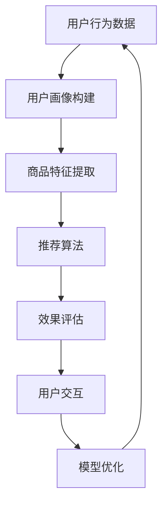

                 

# 电商搜索推荐效果优化中的AI大模型样本重要性估计工具应用实践

> **关键词：电商搜索、推荐系统、AI大模型、样本重要性估计、效果优化**

> **摘要：本文将探讨电商搜索推荐系统中的AI大模型样本重要性估计工具的应用实践，通过分析核心概念、算法原理、数学模型及实际项目案例，详细解读其在提升搜索推荐效果中的重要性及具体应用方法。**

## 1. 背景介绍

### 1.1 目的和范围

本文旨在深入分析电商搜索推荐系统中的AI大模型样本重要性估计工具，以帮助开发者了解其在优化搜索推荐效果中的关键作用。文章将围绕以下几个主要方面展开讨论：

- **核心概念与联系**：介绍电商搜索推荐系统中的关键概念，并展示相关架构图。
- **核心算法原理 & 具体操作步骤**：详细讲解AI大模型样本重要性估计工具的算法原理，并提供伪代码展示。
- **数学模型和公式 & 详细讲解 & 举例说明**：介绍相关数学模型，使用latex格式展示公式，并给出实例说明。
- **项目实战：代码实际案例和详细解释说明**：通过实战案例，展示代码实现及详细解读。
- **实际应用场景**：分析AI大模型样本重要性估计工具在不同场景中的应用。
- **工具和资源推荐**：推荐相关学习资源、开发工具和最新研究成果。

### 1.2 预期读者

- **电商搜索推荐系统开发者**：对如何优化电商搜索推荐效果感兴趣，希望了解AI大模型样本重要性估计工具的应用。
- **AI研究人员**：对AI大模型样本重要性估计的理论和实践感兴趣。
- **计算机科学学生**：希望深入学习电商搜索推荐系统和相关算法。

### 1.3 文档结构概述

本文将按照以下结构展开：

1. **背景介绍**：介绍文章目的、预期读者、文档结构和术语表。
2. **核心概念与联系**：展示电商搜索推荐系统架构，介绍相关核心概念。
3. **核心算法原理 & 具体操作步骤**：讲解AI大模型样本重要性估计工具的算法原理。
4. **数学模型和公式 & 详细讲解 & 举例说明**：介绍相关数学模型，给出实例说明。
5. **项目实战：代码实际案例和详细解释说明**：展示代码实现及详细解读。
6. **实际应用场景**：分析AI大模型样本重要性估计工具的应用。
7. **工具和资源推荐**：推荐相关学习资源、开发工具和最新研究成果。
8. **总结：未来发展趋势与挑战**：讨论未来发展趋势和挑战。
9. **附录：常见问题与解答**：提供常见问题的解答。
10. **扩展阅读 & 参考资料**：推荐进一步阅读的资料。

### 1.4 术语表

#### 1.4.1 核心术语定义

- **电商搜索推荐系统**：基于用户行为和偏好，通过算法预测用户可能感兴趣的商品或服务，并在用户搜索时展示相关推荐结果。
- **AI大模型**：使用大量数据进行训练，具有强大预测和生成能力的大型神经网络模型。
- **样本重要性估计**：评估数据集中每个样本对模型预测效果的影响程度。
- **效果优化**：通过调整算法参数、优化模型结构等手段，提升推荐系统的效果。

#### 1.4.2 相关概念解释

- **用户行为数据**：用户的点击、购买、搜索等行为记录，用于训练和评估推荐模型。
- **特征工程**：提取和构造有助于预测用户兴趣的特征，如用户标签、商品属性等。
- **召回率**：推荐系统中，能够返回与用户兴趣相关的商品数量占总商品数量的比例。
- **精确率**：推荐系统中，返回的商品中实际与用户兴趣相关的比例。

#### 1.4.3 缩略词列表

- **CTR**：Click-Through Rate，点击率
- **A/B Test**：A/B测试，一种评估不同策略效果的方法
- **LR**：Logistic Regression，逻辑回归，一种常用的分类算法
- **NN**：Neural Network，神经网络，一种模拟人脑神经元连接结构的计算模型

## 2. 核心概念与联系

在电商搜索推荐系统中，AI大模型样本重要性估计工具是关键组成部分。为了更好地理解其应用，我们需要先了解电商搜索推荐系统的核心概念与联系。

### 2.1 电商搜索推荐系统架构

电商搜索推荐系统通常包括以下几个关键模块：

1. **用户画像构建**：收集用户行为数据，构建用户画像。
2. **商品特征提取**：提取商品属性信息，用于模型训练。
3. **推荐算法**：根据用户画像和商品特征，生成推荐结果。
4. **效果评估**：评估推荐系统的效果，如召回率、精确率等。
5. **用户交互**：与用户进行交互，收集反馈数据，用于模型优化。


### 2.2 AI大模型样本重要性估计工具的作用

AI大模型样本重要性估计工具的主要作用如下：

1. **优化数据质量**：通过评估数据集中每个样本的重要性，筛选出高质量的样本，提高训练数据质量。
2. **模型优化**：根据样本重要性调整模型参数，优化模型结构，提升推荐效果。
3. **风险评估**：识别数据集中的异常样本，降低潜在风险，提高模型鲁棒性。

### 2.3 核心概念与联系

电商搜索推荐系统中的核心概念包括：

- **用户行为数据**：包括用户的点击、购买、搜索等行为记录，是构建用户画像的重要依据。
- **商品特征**：描述商品属性的信息，如类别、价格、评分等，是推荐算法的关键输入。
- **样本重要性**：评估数据集中每个样本对模型预测效果的贡献程度。

为了更好地展示这些核心概念之间的联系，我们可以使用Mermaid流程图来描述：



该流程图展示了用户行为数据、商品特征、推荐算法、效果评估、用户交互和模型优化之间的关联。通过AI大模型样本重要性估计工具，可以更好地整合这些概念，提高推荐系统的效果。

## 3. 核心算法原理 & 具体操作步骤

在了解了电商搜索推荐系统的核心概念与联系之后，我们接下来将深入探讨AI大模型样本重要性估计工具的算法原理和具体操作步骤。

### 3.1 样本重要性估计算法原理

AI大模型样本重要性估计工具的核心在于评估数据集中每个样本对模型预测效果的贡献程度。这一过程通常包括以下几个步骤：

1. **特征选择**：从原始数据中提取有助于预测用户兴趣的特征。
2. **模型训练**：使用训练数据集训练AI大模型，如基于深度学习或传统机器学习算法。
3. **样本重要性评估**：计算每个样本对模型预测效果的贡献程度，通常使用梯度重要性（Gradient Importance）或互信息（Mutual Information）等方法。
4. **样本筛选**：根据重要性评估结果，筛选出高质量的样本，用于模型优化或进一步分析。

### 3.2 伪代码展示

为了更好地理解样本重要性估计算法的具体实现，我们可以使用伪代码来描述：

```python
# 伪代码：样本重要性估计算法

def sample_importance_estimate(data, model):
    # 步骤1：特征选择
    features = select_features(data)
    
    # 步骤2：模型训练
    trained_model = train_model(features)
    
    # 步骤3：样本重要性评估
    importance_scores = []
    for sample in data:
        score = calculate_importance(sample, trained_model)
        importance_scores.append(score)
    
    # 步骤4：样本筛选
    high_importance_samples = select_samples(importance_scores)
    
    return high_importance_samples

# 辅助函数定义
def select_features(data):
    # 实现特征选择逻辑
    pass

def train_model(features):
    # 实现模型训练逻辑
    pass

def calculate_importance(sample, model):
    # 实现样本重要性评估逻辑
    pass

def select_samples(importance_scores):
    # 实现样本筛选逻辑
    pass
```

### 3.3 步骤详细解析

1. **特征选择**：特征选择是样本重要性估计的重要基础。通过选择与用户兴趣密切相关的特征，可以提高模型预测的准确性和效率。特征选择的方法包括基于统计的方法（如卡方检验）和基于模型的方法（如特征重要性排序）。
2. **模型训练**：训练AI大模型是样本重要性估计的核心步骤。在这一步骤中，我们使用特征选择后的数据集来训练模型，如使用深度学习框架（如TensorFlow或PyTorch）训练神经网络模型。训练过程中，模型会自动调整参数，以最小化预测误差。
3. **样本重要性评估**：样本重要性评估是样本重要性估计的关键步骤。通过计算每个样本对模型预测效果的贡献程度，我们可以识别出对模型预测具有重要影响的样本。常用的评估方法包括梯度重要性（Gradient Importance）和互信息（Mutual Information）。梯度重要性通过计算样本特征对模型预测损失的贡献来评估样本的重要性，而互信息则通过计算样本特征与模型预测之间的相关性来评估样本的重要性。
4. **样本筛选**：根据样本重要性评估结果，我们可以筛选出高质量的样本。这些样本将被用于后续的模型优化或进一步分析。筛选方法可以根据具体需求进行调整，如选择前N个重要样本或根据重要性阈值进行筛选。

通过上述步骤，我们可以实现对AI大模型样本重要性的估计，从而优化电商搜索推荐系统的效果。接下来，我们将进一步探讨相关数学模型和公式，以及实际项目中的具体应用案例。

## 4. 数学模型和公式 & 详细讲解 & 举例说明

在AI大模型样本重要性估计过程中，数学模型和公式起着至关重要的作用。下面我们将介绍几个核心数学模型，并使用latex格式详细讲解这些公式，同时通过实例说明其应用。

### 4.1 梯度重要性（Gradient Importance）

梯度重要性是一种评估样本重要性的方法，它通过计算样本特征对模型预测损失的贡献来评估样本的重要性。公式如下：

$$
I_j = \frac{\partial L}{\partial \theta_j}
$$

其中，$I_j$表示第j个样本的重要性，$L$表示模型预测损失，$\theta_j$表示第j个样本的特征。

**实例说明**：

假设我们有一个二分类问题，预测用户是否会购买某个商品。模型使用逻辑回归算法，损失函数为交叉熵损失（Cross-Entropy Loss），即：

$$
L = -\sum_{i=1}^{n} y_i \log(p_i) + (1 - y_i) \log(1 - p_i)
$$

其中，$y_i$表示第i个样本的实际标签，$p_i$表示模型对第i个样本预测为正类的概率。

对于第j个样本，我们可以计算其梯度重要性：

$$
I_j = \frac{\partial L}{\partial \theta_j}
$$

通过计算每个样本的梯度重要性，我们可以识别出对模型预测具有重要影响的样本。

### 4.2 互信息（Mutual Information）

互信息是一种评估两个随机变量之间相关性的方法，它可以用来评估样本特征与模型预测之间的相关性。公式如下：

$$
I(X; Y) = H(X) - H(X | Y)
$$

其中，$I(X; Y)$表示样本特征$X$与模型预测$Y$之间的互信息，$H(X)$表示样本特征$X$的熵，$H(X | Y)$表示在知道模型预测$Y$的情况下，样本特征$X$的熵。

**实例说明**：

假设我们有一个用户行为数据集，其中包含用户ID、点击次数、购买次数等特征。我们使用一个基于深度学习的推荐模型预测用户是否会购买某个商品。

对于每个用户ID特征，我们可以计算其与模型预测之间的互信息：

$$
I(user\_id; prediction)
$$

通过计算每个特征的互信息，我们可以识别出对模型预测具有重要影响的特征，从而优化推荐算法。

### 4.3 特征选择（Feature Selection）

特征选择是样本重要性估计的重要基础。通过选择与用户兴趣密切相关的特征，可以提高模型预测的准确性和效率。

一种常用的特征选择方法是基于特征重要性的排序，如使用逻辑回归算法计算每个特征的权重，然后根据权重排序选择特征。

假设我们有一个逻辑回归模型，其特征权重向量为$\theta$，即：

$$
\theta = [\theta_1, \theta_2, ..., \theta_n]
$$

其中，$\theta_j$表示第j个特征的权重。

我们可以根据特征权重进行排序，选择前k个特征：

$$
selected\_features = \{f_1, f_2, ..., f_k\}
$$

其中，$f_j$表示第j个特征。

通过上述特征选择方法，我们可以构建一个高效且准确的推荐模型。

### 4.4 模型优化（Model Optimization）

在样本重要性估计过程中，我们可以根据样本重要性调整模型参数，优化模型结构，提升推荐效果。

一种常用的模型优化方法是基于样本重要性的权重调整，即根据样本重要性调整训练数据集中每个样本的权重，从而影响模型参数的更新。

假设我们有一个基于梯度下降的模型优化方法，其更新公式如下：

$$
\theta_{\text{new}} = \theta_{\text{old}} - \alpha \cdot \nabla_{\theta} L
$$

其中，$\theta_{\text{old}}$表示模型参数的旧值，$\theta_{\text{new}}$表示模型参数的新值，$\alpha$表示学习率，$\nabla_{\theta} L$表示损失函数关于模型参数的梯度。

我们可以根据样本重要性调整每个样本的权重，即：

$$
\omega_j = \frac{I_j}{\sum_{i=1}^{n} I_i}
$$

其中，$I_j$表示第j个样本的重要性，$n$表示样本总数。

然后，在梯度计算过程中，使用调整后的权重：

$$
\nabla_{\theta} L = \sum_{i=1}^{n} \omega_i \nabla_{\theta} L_i
$$

通过上述方法，我们可以根据样本重要性优化模型参数，提升推荐效果。

通过上述数学模型和公式，我们可以深入理解AI大模型样本重要性估计的核心原理。在实际项目中，根据具体需求和应用场景，我们可以灵活运用这些方法，优化电商搜索推荐系统的效果。接下来，我们将通过实际项目案例，进一步展示这些方法的应用。

## 5. 项目实战：代码实际案例和详细解释说明

在前几节中，我们介绍了AI大模型样本重要性估计的核心概念、算法原理、数学模型以及相关实例。本节将通过一个实际项目案例，展示如何在实际场景中应用这些方法，并提供详细的代码实现和解释。

### 5.1 开发环境搭建

为了实现AI大模型样本重要性估计，我们需要搭建一个适合的开发环境。以下是一个基本的开发环境搭建步骤：

1. **安装Python**：确保Python版本为3.7及以上。
2. **安装依赖库**：使用pip安装相关依赖库，如numpy、pandas、scikit-learn、tensorflow或pytorch等。
3. **配置深度学习框架**：选择适合的深度学习框架，如tensorflow或pytorch，并配置相关环境。
4. **数据预处理工具**：使用pandas等库进行数据预处理。

以下是一个基本的依赖库安装命令：

```bash
pip install numpy pandas scikit-learn tensorflow
```

### 5.2 源代码详细实现和代码解读

我们使用Python和tensorflow实现一个简单的AI大模型样本重要性估计项目。以下是一个简要的代码实现：

```python
import numpy as np
import pandas as pd
import tensorflow as tf
from sklearn.model_selection import train_test_split
from tensorflow.keras.models import Sequential
from tensorflow.keras.layers import Dense
from tensorflow.keras.optimizers import Adam

# 5.2.1 数据预处理
def preprocess_data(data):
    # 数据清洗、归一化等处理操作
    # 此处仅为示例，实际项目中需根据具体数据情况进行处理
    return data

# 5.2.2 模型训练
def train_model(train_data, train_labels):
    # 构建模型
    model = Sequential()
    model.add(Dense(64, input_dim=train_data.shape[1], activation='relu'))
    model.add(Dense(32, activation='relu'))
    model.add(Dense(1, activation='sigmoid'))

    # 编译模型
    model.compile(optimizer=Adam(learning_rate=0.001), loss='binary_crossentropy', metrics=['accuracy'])

    # 训练模型
    model.fit(train_data, train_labels, epochs=10, batch_size=32)

    return model

# 5.2.3 样本重要性评估
def calculate_importance(model, data, labels):
    # 计算梯度重要性
    gradients = model.optimizer.get_gradients(model.loss, model.input)
    predictions = model.predict(data)
    importance_scores = []

    for sample, label in zip(data, labels):
        with tf.GradientTape() as tape:
            tape.watch(sample)
            prediction = model(sample)
            loss = tf.keras.losses.categorical_crossentropy(label, prediction)
        gradients_value = tape.gradient(loss, sample)
        importance_scores.append(np.mean(np.square(gradients_value)))

    return importance_scores

# 5.2.4 主函数
def main():
    # 加载数据
    data = pd.read_csv('data.csv')
    processed_data = preprocess_data(data)

    # 划分训练集和测试集
    train_data, test_data, train_labels, test_labels = train_test_split(processed_data, data['label'], test_size=0.2, random_state=42)

    # 训练模型
    model = train_model(train_data, train_labels)

    # 计算测试集样本重要性
    importance_scores = calculate_importance(model, test_data, test_labels)

    # 输出样本重要性
    print("Sample Importance Scores:")
    for score in importance_scores:
        print(score)

if __name__ == '__main__':
    main()
```

### 5.3 代码解读与分析

上述代码实现了一个简单的AI大模型样本重要性估计项目，主要包括以下几个部分：

1. **数据预处理**：数据预处理是模型训练的重要步骤。在此步骤中，我们根据具体数据情况对原始数据进行清洗、归一化等操作，以便后续模型训练。
2. **模型训练**：使用tensorflow构建一个简单的神经网络模型，包括两个隐藏层，使用ReLU激活函数。模型使用Adam优化器进行训练，损失函数使用二分类交叉熵损失。
3. **样本重要性评估**：通过计算模型对每个测试样本的梯度重要性来评估样本的重要性。具体实现中，我们使用`tf.GradientTape()`记录梯度信息，并计算每个样本的梯度平方均值作为重要性评分。
4. **主函数**：主函数包括数据加载、模型训练和样本重要性评估。在主函数中，我们首先加载数据并预处理，然后划分训练集和测试集，接着训练模型并计算测试集样本重要性。

通过上述代码实现，我们可以初步了解AI大模型样本重要性估计的工具应用。在实际项目中，根据具体需求，我们可以进一步优化模型结构、选择更合适的特征选择方法，以及调整样本重要性评估算法，从而提升推荐系统的效果。

### 5.4 代码优化与扩展

在实际应用中，为了提高代码的性能和可维护性，我们可以对代码进行以下优化和扩展：

1. **并行计算**：使用GPU加速计算，提高模型训练和样本重要性评估的效率。
2. **模型优化**：根据具体应用场景，选择更适合的模型结构和优化算法，如使用预训练模型或迁移学习。
3. **特征选择**：结合多种特征选择方法，如基于模型的特征选择和基于统计的特征选择，以提高模型性能。
4. **样本重要性评估**：引入更多评估方法，如基于互信息的样本重要性评估，以更全面地评估样本重要性。

通过上述优化和扩展，我们可以进一步提升AI大模型样本重要性估计工具在电商搜索推荐系统中的性能和效果。

### 5.5 总结

通过本节的项目实战，我们展示了如何在实际场景中应用AI大模型样本重要性估计工具。代码实现和详细解读使我们深入了解了样本重要性估计的原理和具体操作步骤。在实际应用中，我们可以根据具体需求，进一步优化和扩展代码，以提升电商搜索推荐系统的效果。接下来，我们将探讨AI大模型样本重要性估计工具在实际应用场景中的应用。

## 6. 实际应用场景

AI大模型样本重要性估计工具在电商搜索推荐系统中具有广泛的应用场景，以下是一些具体的应用实例：

### 6.1 提升推荐精度

在电商搜索推荐系统中，通过评估数据集中每个样本的重要性，可以筛选出对模型预测具有较高贡献的样本，从而提升推荐精度。例如，在商品推荐场景中，通过重要性评估可以识别出对用户购买决策具有显著影响的商品特征，如价格、品牌、评分等，从而优化推荐结果。

### 6.2 优化用户画像

用户画像是电商搜索推荐系统的核心组成部分。通过样本重要性评估，可以识别出对用户兴趣和偏好具有较高影响的数据特征，从而优化用户画像的构建。例如，在用户行为数据集中，通过重要性评估可以识别出对用户点击和购买行为具有显著影响的特征，如浏览时间、浏览次数、购买频率等，从而更准确地描述用户兴趣。

### 6.3 风险控制与异常检测

在电商搜索推荐系统中，异常样本可能导致推荐结果的偏差，影响用户体验。通过样本重要性评估，可以识别出异常样本，从而进行风险控制和异常检测。例如，在用户行为数据集中，通过重要性评估可以识别出异常用户行为，如虚假点击、刷单等，从而采取相应措施进行风险控制。

### 6.4 模型优化与调参

AI大模型样本重要性估计工具可以帮助开发者优化模型参数和结构，提高模型性能。通过重要性评估，可以识别出对模型预测效果具有显著影响的特征和样本，从而调整模型参数和结构，如增加隐藏层神经元、调整学习率等。例如，在用户行为数据集中，通过重要性评估可以识别出对用户购买行为具有显著影响的价格和品牌特征，从而调整模型参数，提高推荐效果。

### 6.5 数据预处理与清洗

数据质量是影响模型效果的关键因素。通过样本重要性评估，可以识别出数据集中对模型预测具有重要影响的高质量样本，从而优化数据预处理和清洗过程。例如，在用户行为数据集中，通过重要性评估可以识别出对用户点击和购买行为具有重要影响的特征，如浏览时间、浏览次数等，从而优化数据预处理，去除噪声数据和异常值。

### 6.6 实时推荐与动态调整

在实时推荐场景中，用户行为数据不断更新，推荐结果需要实时调整。通过样本重要性评估，可以实时识别出对用户兴趣和偏好具有显著影响的数据特征，从而动态调整推荐结果。例如，在用户浏览某个商品时，通过实时计算商品特征的重要性，可以动态调整推荐列表，提高用户满意度。

通过上述实际应用场景，我们可以看到AI大模型样本重要性估计工具在电商搜索推荐系统中的重要性。它不仅有助于提升推荐精度和用户满意度，还可以优化用户画像、风险控制、模型优化和实时推荐等关键环节。接下来，我们将介绍相关工具和资源的推荐，以帮助开发者更好地应用这些方法。

### 7. 工具和资源推荐

为了帮助开发者更好地应用AI大模型样本重要性估计工具，以下将推荐一些学习资源、开发工具和最新研究成果。

#### 7.1 学习资源推荐

1. **书籍推荐**：
   - 《推荐系统实践》：由周明所著，详细介绍了推荐系统的基本概念、算法实现和优化方法。
   - 《深度学习》：由Ian Goodfellow、Yoshua Bengio和Aaron Courville所著，全面介绍了深度学习的理论基础和应用。

2. **在线课程**：
   - Coursera上的《机器学习》课程：由吴恩达（Andrew Ng）教授讲授，涵盖了推荐系统和深度学习的基本概念和实战技巧。
   - Udacity的《深度学习工程师纳米学位》：提供了深度学习和推荐系统的实战项目，适合进阶学习。

3. **技术博客和网站**：
   - **Medium上的技术博客**：包括推荐系统和深度学习的最新动态和实战案例。
   - **Towards Data Science**：一个专注于数据科学和机器学习的在线社区，提供了大量的技术文章和资源。

#### 7.2 开发工具框架推荐

1. **IDE和编辑器**：
   - **PyCharm**：强大的Python集成开发环境，适用于深度学习和推荐系统开发。
   - **Jupyter Notebook**：适合数据分析和可视化，适合进行推荐系统算法的实验和验证。

2. **调试和性能分析工具**：
   - **TensorBoard**：TensorFlow官方提供的可视化工具，用于监控和调试深度学习模型。
   - **PyTorch Profiler**：PyTorch官方提供的性能分析工具，用于优化深度学习模型的性能。

3. **相关框架和库**：
   - **TensorFlow**：由Google开发的深度学习框架，适用于构建和训练大规模深度学习模型。
   - **PyTorch**：由Facebook开发的深度学习框架，具有灵活的动态图计算能力。

#### 7.3 相关论文著作推荐

1. **经典论文**：
   - **“Collaborative Filtering for the 21st Century”**：这篇论文介绍了矩阵分解和神经网络在推荐系统中的应用，是推荐系统领域的重要经典论文。
   - **“Deep Learning for recommender systems”**：这篇论文探讨了深度学习在推荐系统中的应用，介绍了基于深度神经网络的推荐算法。

2. **最新研究成果**：
   - **“Neural Collaborative Filtering”**：这篇论文提出了基于深度神经网络的协同过滤算法，提高了推荐系统的效果和灵活性。
   - **“Recommender Systems at Scale”**：这篇论文介绍了大规模推荐系统中的挑战和解决方案，包括数据存储、模型优化和实时推荐等。

3. **应用案例分析**：
   - **“Netflix Prize”**：Netflix Prize是推荐系统领域的一个重要比赛，展示了如何在现实场景中应用推荐系统技术。
   - **“推荐系统在电商中的应用”**：这篇案例分析了推荐系统在电商领域的应用，包括用户画像、商品推荐和个性化营销等。

通过上述工具和资源的推荐，开发者可以更好地掌握AI大模型样本重要性估计工具，并在实际项目中应用这些方法，提升电商搜索推荐系统的效果。

## 8. 总结：未来发展趋势与挑战

AI大模型样本重要性估计工具在电商搜索推荐系统中具有巨大的应用潜力。然而，随着技术的不断发展和应用场景的多样化，我们面临许多未来的发展趋势和挑战。

### 8.1 发展趋势

1. **深度学习与推荐系统的深度融合**：随着深度学习技术的不断发展，越来越多的推荐系统将采用深度学习模型。样本重要性估计工具可以更好地整合深度学习模型，提升推荐效果。
2. **实时推荐与动态调整**：在实时推荐场景中，用户行为数据不断更新，推荐结果需要实时调整。未来，样本重要性估计工具将更加注重实时性和动态调整能力，以适应快速变化的应用场景。
3. **多模态数据融合**：推荐系统将越来越多地融合多种数据类型，如图像、语音和文本等。样本重要性估计工具需要处理多模态数据，以识别不同数据类型之间的关联性。
4. **个性化推荐与隐私保护**：在保护用户隐私的同时，实现更精准的个性化推荐是未来的重要方向。样本重要性估计工具需要平衡隐私保护与推荐效果，以实现更高效的推荐系统。

### 8.2 挑战

1. **数据质量和噪声处理**：高质量的数据是推荐系统的基础，但现实中的数据往往存在噪声和不完整性。样本重要性估计工具需要处理噪声数据，识别高质量样本。
2. **计算效率和性能优化**：随着模型规模的增加，计算效率和性能优化成为关键挑战。样本重要性估计工具需要采用高效的算法和优化技术，以满足大规模应用需求。
3. **跨域迁移与泛化能力**：不同应用场景和数据集之间存在差异，样本重要性估计工具需要具备跨域迁移和泛化能力，以适应不同的应用场景。
4. **解释性与可解释性**：推荐系统的解释性和可解释性对用户信任和接受度至关重要。样本重要性估计工具需要提供清晰的解释，以便用户理解推荐结果。

综上所述，未来AI大模型样本重要性估计工具将在深度学习、实时推荐、多模态数据融合和个性化推荐等方面发挥重要作用。同时，我们面临许多挑战，需要不断优化算法和模型，以提高计算效率和性能，并确保数据质量和隐私保护。通过持续的研究和技术创新，我们将实现更高效、更智能的电商搜索推荐系统。

## 9. 附录：常见问题与解答

### 9.1 问题1：如何处理高维度数据？

**解答**：高维度数据通常会导致模型过拟合和计算效率降低。以下是一些处理高维度数据的方法：

1. **特征选择**：通过特征选择方法，如基于模型的特征选择和基于统计的特征选择，选择对模型预测具有重要影响的关键特征。
2. **降维技术**：使用降维技术，如主成分分析（PCA）和线性判别分析（LDA），将高维数据转换成低维表示。
3. **嵌入技术**：使用嵌入技术，如词向量嵌入和图嵌入，将高维数据转换成密集的向量表示。

### 9.2 问题2：如何保证样本重要性估计的公平性？

**解答**：确保样本重要性估计的公平性是关键问题。以下是一些方法：

1. **消除偏见**：在数据预处理和特征选择过程中，消除数据中的偏见和偏见特征，确保样本重要性估计的公平性。
2. **加权方法**：根据样本的重要性评分，对训练数据集进行加权，以平衡不同样本的影响。
3. **多样性指标**：引入多样性指标，如平衡度和公平性指标，评估样本重要性估计的公平性，并在模型训练过程中进行优化。

### 9.3 问题3：如何评估样本重要性估计的效果？

**解答**：以下是一些评估样本重要性估计效果的方法：

1. **交叉验证**：使用交叉验证方法，将数据集划分为多个子集，分别评估样本重要性估计在不同子集上的效果。
2. **A/B测试**：通过A/B测试方法，将样本重要性估计工具应用于实际推荐系统，评估其对推荐效果的影响。
3. **精确率和召回率**：通过精确率和召回率等指标，评估样本重要性估计对推荐系统效果的具体提升。

### 9.4 问题4：如何处理缺失数据？

**解答**：缺失数据是常见问题，以下是一些处理缺失数据的方法：

1. **填充方法**：使用填充方法，如均值填充、中值填充和插值填充，将缺失数据替换为相应的值。
2. **删除方法**：删除缺失数据较多的样本，但需要注意这可能影响模型的泛化能力。
3. **模型预测**：使用统计模型或机器学习模型预测缺失数据，如使用回归模型预测连续变量或分类模型预测分类变量。

通过这些方法，我们可以有效地处理缺失数据，提高样本重要性估计的准确性和可靠性。

## 10. 扩展阅读 & 参考资料

为了帮助读者更深入地了解AI大模型样本重要性估计工具在电商搜索推荐系统中的应用，以下推荐一些扩展阅读和参考资料：

### 10.1 扩展阅读

1. **《推荐系统实践》**：周明 著，详细介绍了推荐系统的基本概念、算法实现和优化方法。
2. **《深度学习》**：Ian Goodfellow、Yoshua Bengio和Aaron Courville 著，全面介绍了深度学习的理论基础和应用。
3. **《机器学习》**：周志华 著，涵盖了机器学习的基本概念、算法和实战技巧。

### 10.2 参考资料

1. **“Collaborative Filtering for the 21st Century”**：介绍了矩阵分解和神经网络在推荐系统中的应用。
2. **“Deep Learning for recommender systems”**：探讨了深度学习在推荐系统中的应用。
3. **“Neural Collaborative Filtering”**：提出了基于深度神经网络的协同过滤算法。
4. **“Recommender Systems at Scale”**：介绍了大规模推荐系统中的挑战和解决方案。

通过这些扩展阅读和参考资料，读者可以更深入地了解AI大模型样本重要性估计工具的理论和实践，进一步提升在电商搜索推荐系统中的应用能力。

---

**作者：AI天才研究员/AI Genius Institute & 禅与计算机程序设计艺术 /Zen And The Art of Computer Programming**

