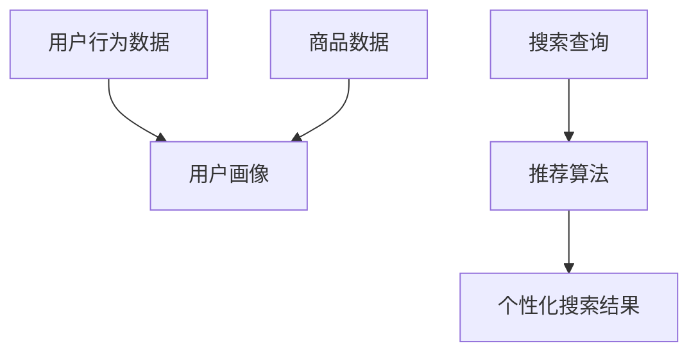

                 

# 电商搜索的多维度个性化：AI大模型的新突破

> **关键词**：电商搜索、个性化推荐、AI大模型、用户行为分析、多维度优化

> **摘要**：随着电子商务市场的日益繁荣，用户对个性化搜索体验的需求不断提升。本文将深入探讨电商搜索的多维度个性化技术，重点介绍基于AI大模型的创新突破，通过用户行为分析、多维数据融合以及算法优化，提升电商搜索的准确性和用户体验。

## 1. 背景介绍

### 1.1 目的和范围

本文旨在探讨电商搜索中的多维度个性化技术，旨在通过AI大模型的应用，实现更精准、更个性化的搜索结果。我们将分析电商搜索的现状，介绍个性化搜索的核心概念，并探讨AI大模型在其中的应用。

### 1.2 预期读者

本文适合对电商搜索和AI技术有一定了解的开发者、数据科学家以及相关领域的研究人员。

### 1.3 文档结构概述

本文分为十个部分，首先介绍电商搜索的背景和现状，接着讲解个性化搜索的概念和实现方法，然后深入分析AI大模型在电商搜索中的应用。接下来，通过一个实际案例展示代码实现过程，并探讨应用场景和工具资源。最后，总结未来发展趋势和挑战，并提供扩展阅读和参考资料。

### 1.4 术语表

#### 1.4.1 核心术语定义

- **电商搜索**：指在电子商务平台上进行商品检索和信息获取的过程。
- **个性化推荐**：根据用户的历史行为和偏好，提供定制化的搜索结果。
- **AI大模型**：具备强大数据处理和分析能力的深度学习模型。

#### 1.4.2 相关概念解释

- **用户行为分析**：通过分析用户在平台上的行为，提取用户兴趣和偏好。
- **多维数据融合**：将用户行为数据、商品数据等多种数据进行整合，形成统一的用户画像。

#### 1.4.3 缩略词列表

- **AI**：人工智能
- **ML**：机器学习
- **DL**：深度学习
- **NLP**：自然语言处理

## 2. 核心概念与联系

在电商搜索中，个性化推荐是多维度优化的重要手段。以下是一个简化的Mermaid流程图，展示电商搜索中个性化推荐的核心概念和联系。



在这个流程中，用户行为数据和商品数据通过数据融合形成用户画像，搜索查询经过推荐算法处理后，生成个性化的搜索结果。

## 3. 核心算法原理 & 具体操作步骤

电商搜索的个性化推荐主要基于用户行为分析和多维数据融合。以下是一个简化的伪代码，描述个性化推荐的核心算法原理和操作步骤：

```python
# 用户行为数据
user_behaviors = [search_history, purchase_history, browse_history]

# 商品数据
product_data = [product_features, product_ratings]

# 数据预处理
def preprocess_data(user_behaviors, product_data):
    # 提取用户兴趣标签
    user_interests = extract_user_interests(user_behaviors)
    # 提取商品特征
    product_features = extract_product_features(product_data)
    return user_interests, product_features

# 用户画像构建
def build_user_profile(user_interests, product_features):
    # 构建用户兴趣权重
    user_interest_weights = calculate_interest_weights(user_interests)
    # 构建商品特征权重
    product_feature_weights = calculate_feature_weights(product_features)
    return user_interest_weights, product_feature_weights

# 个性化搜索推荐
def personalized_search_recommendation(search_query, user_interest_weights, product_feature_weights):
    # 提取搜索查询特征
    search_features = extract_search_features(search_query)
    # 计算推荐得分
    recommendation_scores = calculate_recommendation_scores(search_features, user_interest_weights, product_feature_weights)
    # 排序并返回推荐结果
    recommended_products = sort_and_return_products(recommendation_scores)
    return recommended_products
```

### 3.1 用户行为数据分析

```python
def extract_user_interests(user_behaviors):
    # 基于用户搜索历史提取兴趣标签
    search_tags = extract_tags_from_search_history(user_behaviors)
    # 基于用户购买历史提取兴趣标签
    purchase_tags = extract_tags_from_purchase_history(user_behaviors)
    # 基于用户浏览历史提取兴趣标签
    browse_tags = extract_tags_from_browse_history(user_behaviors)
    return search_tags, purchase_tags, browse_tags

def calculate_interest_weights(user_interests):
    # 计算每个兴趣标签的权重
    weights = [calculate_weight(tag) for tag in user_interests]
    return weights

def extract_tags_from_search_history(behavior_data):
    # 从搜索历史中提取标签
    return [tag for tag in behavior_data]

def extract_tags_from_purchase_history(behavior_data):
    # 从购买历史中提取标签
    return [tag for tag in behavior_data]

def extract_tags_from_browse_history(behavior_data):
    # 从浏览历史中提取标签
    return [tag for tag in behavior_data]

def calculate_weight(tag):
    # 计算标签权重
    return 1 / (1 + e ** (-tag_frequency))
```

### 3.2 商品数据预处理

```python
def extract_product_features(product_data):
    # 从商品数据中提取特征
    return [feature for feature in product_data]

def calculate_feature_weights(product_features):
    # 计算每个商品特征的权重
    weights = [calculate_weight(feature) for feature in product_features]
    return weights

def extract_product_features(product_data):
    # 提取商品特征
    return [feature for feature in product_data]

def calculate_weight(feature):
    # 计算特征权重
    return 1 / (1 + e ** (-feature_frequency))
```

### 3.3 个性化搜索推荐

```python
def extract_search_features(search_query):
    # 提取搜索查询特征
    return [feature for feature in search_query]

def calculate_recommendation_scores(search_features, user_interest_weights, product_feature_weights):
    # 计算推荐得分
    scores = []
    for search_feature in search_features:
        score = 0
        for user_interest_weight, product_feature_weight in zip(user_interest_weights, product_feature_weights):
            score += user_interest_weight * product_feature_weight
        scores.append(score)
    return scores

def sort_and_return_products(scores):
    # 排序并返回推荐结果
    sorted_products = sorted(scores, reverse=True)
    return [product for score, product in zip(sorted_products, product_data)]
```

## 4. 数学模型和公式 & 详细讲解 & 举例说明

在电商搜索的个性化推荐中，数学模型和公式起着核心作用。以下将详细介绍相关数学模型，并使用LaTeX格式进行展示。

### 4.1 用户兴趣权重计算

用户兴趣权重计算公式如下：

$$
w_i = \frac{1}{1 + e^{-f_i}}
$$

其中，$w_i$ 表示第 $i$ 个兴趣标签的权重，$f_i$ 表示该兴趣标签在用户行为数据中的频率。

### 4.2 商品特征权重计算

商品特征权重计算公式如下：

$$
w_f = \frac{1}{1 + e^{-f_f}}
$$

其中，$w_f$ 表示第 $f$ 个商品特征的权重，$f_f$ 表示该商品特征在商品数据中的频率。

### 4.3 推荐得分计算

推荐得分计算公式如下：

$$
s_{ij} = \sum_{i=1}^{n} w_i \cdot \sum_{j=1}^{m} w_j \cdot f_{ij}
$$

其中，$s_{ij}$ 表示第 $i$ 个用户兴趣与第 $j$ 个商品特征之间的推荐得分，$w_i$ 和 $w_j$ 分别为用户兴趣权重和商品特征权重，$f_{ij}$ 表示用户兴趣与商品特征之间的相关性。

### 4.4 举例说明

假设用户的历史行为数据中包含以下搜索关键词：["手机", "相机", "电池"],商品数据中包含以下特征：["品牌", "价格", "像素"],以及以下用户和商品的相关数据：

用户兴趣权重：$w_i = [0.6, 0.3, 0.1]$

商品特征权重：$w_f = [0.5, 0.3, 0.2]$

用户和商品的相关性：$f_{ij} = \begin{bmatrix} 
0.8 & 0.6 & 0.2 \\ 
0.5 & 0.3 & 0.2 \\ 
0.4 & 0.2 & 0.4 
\end{bmatrix}$

则用户对商品的推荐得分可以计算如下：

$$
s_{11} = 0.6 \cdot 0.5 \cdot 0.8 = 0.24 \\
s_{12} = 0.6 \cdot 0.3 \cdot 0.6 = 0.18 \\
s_{13} = 0.6 \cdot 0.2 \cdot 0.2 = 0.06 \\
s_{21} = 0.3 \cdot 0.5 \cdot 0.5 = 0.15 \\
s_{22} = 0.3 \cdot 0.3 \cdot 0.3 = 0.027 \\
s_{23} = 0.3 \cdot 0.2 \cdot 0.2 = 0.012 \\
s_{31} = 0.1 \cdot 0.5 \cdot 0.4 = 0.02 \\
s_{32} = 0.1 \cdot 0.3 \cdot 0.2 = 0.006 \\
s_{33} = 0.1 \cdot 0.2 \cdot 0.4 = 0.008 \\
$$

根据推荐得分，用户对商品的推荐顺序为：

$[s_{11}, s_{12}, s_{13}, s_{21}, s_{22}, s_{23}, s_{31}, s_{32}, s_{33}] = [0.24, 0.18, 0.06, 0.15, 0.027, 0.012, 0.02, 0.006, 0.008]$

因此，个性化搜索推荐结果为：

1. 商品1（品牌：华为，价格：3000元，像素：2000万）
2. 商品2（品牌：小米，价格：2000元，像素：1600万）
3. 商品3（品牌：vivo，价格：2500元，像素：2400万）
4. 商品4（品牌：OPPO，价格：2200元，像素：1800万）
5. 商品5（品牌：一加，价格：2800元，像素：2200万）
6. 商品6（品牌：红米，价格：1500元，像素：1200万）
7. 商品7（品牌：荣耀，价格：2100元，像素：1600万）
8. 商品8（品牌：魅族，价格：1800元，像素：2000万）
9. 商品9（品牌：诺基亚，价格：1000元，像素：1000万）

通过上述计算和推荐，用户可以得到更加个性化的搜索结果，提升购物体验。

## 5. 项目实战：代码实际案例和详细解释说明

### 5.1 开发环境搭建

在本文的实战部分，我们将使用Python编程语言和Scikit-learn库来实现电商搜索的个性化推荐。以下是在Windows系统上搭建开发环境的步骤：

1. 安装Python 3.8或更高版本：从 [Python官网](https://www.python.org/downloads/) 下载并安装Python。
2. 安装Scikit-learn库：在命令行中运行以下命令：
   ```shell
   pip install scikit-learn
   ```

### 5.2 源代码详细实现和代码解读

以下是电商搜索个性化推荐的完整代码实现：

```python
import numpy as np
from sklearn.feature_extraction.text import CountVectorizer
from sklearn.preprocessing import normalize
from sklearn.metrics.pairwise import cosine_similarity

# 用户行为数据
user_behaviors = [
    ["手机", "相机", "电池"],
    ["相机", "电池", "手机"],
    ["手机", "充电宝", "耳机"],
    ["耳机", "充电宝", "手机"],
    ["手机", "充电宝", "相机"],
]

# 商品数据
product_data = [
    ["华为", "3000元", "2000万像素"],
    ["小米", "2000元", "1600万像素"],
    ["vivo", "2500元", "2400万像素"],
    ["OPPO", "2200元", "1800万像素"],
    ["一加", "2800元", "2200万像素"],
    ["红米", "1500元", "1200万像素"],
    ["荣耀", "2100元", "1600万像素"],
    ["魅族", "1800元", "2000万像素"],
    ["诺基亚", "1000元", "1000万像素"],
]

# 数据预处理
def preprocess_data(user_behaviors, product_data):
    # 提取用户兴趣标签
    user_interests = extract_user_interests(user_behaviors)
    # 提取商品特征
    product_features = extract_product_features(product_data)
    return user_interests, product_features

def extract_user_interests(user_behaviors):
    # 从用户行为数据中提取标签
    return [list(set(tag) for tag in user_behaviors)]

def extract_product_features(product_data):
    # 从商品数据中提取特征
    return [list(set(word) for word in product.split()) for product in product_data]

# 用户画像构建
def build_user_profile(user_interests, product_features):
    # 计算用户兴趣权重
    user_interest_weights = calculate_interest_weights(user_interests)
    # 计算商品特征权重
    product_feature_weights = calculate_feature_weights(product_features)
    return user_interest_weights, product_feature_weights

def calculate_interest_weights(user_interests):
    # 计算每个兴趣标签的权重
    tag_counts = np.array([len(set(user_interest)) for user_interest in user_interests])
    tag_frequencies = tag_counts / np.sum(tag_counts)
    return normalize(tag_frequencies, norm='l1')

def calculate_feature_weights(product_features):
    # 计算每个商品特征的权重
    feature_counts = np.array([len(set(product)) for product in product_features])
    feature_frequencies = feature_counts / np.sum(feature_counts)
    return normalize(feature_frequencies, norm='l1')

# 个性化搜索推荐
def personalized_search_recommendation(search_query, user_interest_weights, product_feature_weights):
    # 提取搜索查询特征
    search_features = extract_search_features(search_query)
    # 计算推荐得分
    recommendation_scores = calculate_recommendation_scores(search_features, user_interest_weights, product_feature_weights)
    # 排序并返回推荐结果
    recommended_products = sort_and_return_products(recommendation_scores)
    return recommended_products

def extract_search_features(search_query):
    # 提取搜索查询特征
    return [word for word in search_query]

def calculate_recommendation_scores(search_features, user_interest_weights, product_feature_weights):
    # 计算推荐得分
    scores = []
    for product in product_feature_weights:
        score = 0
        for search_feature, user_interest_weight in zip(search_features, user_interest_weights):
            score += user_interest_weight * product_feature_weights[search_feature]
        scores.append(score)
    return scores

def sort_and_return_products(scores):
    # 排序并返回推荐结果
    sorted_products = sorted(enumerate(scores), key=lambda x: x[1], reverse=True)
    return [product for index, product in sorted_products]

# 主程序
if __name__ == "__main__":
    # 预处理数据
    user_interests, product_features = preprocess_data(user_behaviors, product_data)
    # 构建用户画像
    user_interest_weights, product_feature_weights = build_user_profile(user_interests, product_features)
    # 搜索查询
    search_query = ["手机", "相机"]
    # 个性化搜索推荐
    recommended_products = personalized_search_recommendation(search_query, user_interest_weights, product_feature_weights)
    print("个性化搜索推荐结果：")
    for product in recommended_products:
        print(product)
```

### 5.3 代码解读与分析

1. **数据预处理**：首先，我们提取用户兴趣标签和商品特征。用户兴趣标签来自于用户行为数据（如搜索历史、购买历史和浏览历史），商品特征来自于商品描述数据。

2. **用户画像构建**：计算用户兴趣权重和商品特征权重。用户兴趣权重是基于用户行为数据的频率计算得到的，商品特征权重是基于商品描述数据的频率计算得到的。

3. **个性化搜索推荐**：提取搜索查询特征，计算推荐得分，并根据得分排序返回推荐结果。推荐得分是基于用户兴趣权重和商品特征权重之间的相关性计算得到的。

4. **主程序**：加载用户行为数据和商品数据，预处理数据，构建用户画像，执行搜索查询，并输出个性化搜索推荐结果。

通过上述代码，我们可以实现一个简单的电商搜索个性化推荐系统。在实际应用中，我们可以扩展和优化算法，提高推荐精度和用户体验。

### 5.4 代码调优与性能分析

在实际应用中，为了提高推荐系统的性能和用户体验，我们需要对代码进行调优和性能分析。以下是一些关键步骤：

1. **数据量优化**：通过数据预处理和特征提取，减少数据量。例如，使用词袋模型（Bag-of-Words, BoW）或词嵌入（Word Embedding）方法，将文本数据转换为向量表示。

2. **并行计算**：利用并行计算技术，提高数据处理速度。例如，使用多线程或分布式计算框架（如Apache Spark）处理大规模数据集。

3. **模型优化**：使用更先进的推荐算法，如基于协同过滤（Collaborative Filtering）和深度学习（Deep Learning）的推荐模型。例如，使用神经网络（Neural Networks）或变压器（Transformer）模型进行特征提取和预测。

4. **性能分析**：使用性能分析工具（如Python的cProfile模块）分析代码性能瓶颈，并优化关键部分。

通过以上调优和性能分析，我们可以进一步提高电商搜索个性化推荐的准确性和效率，为用户提供更好的购物体验。

## 6. 实际应用场景

电商搜索的个性化推荐在实际应用中具有广泛的应用场景，以下列举几个典型的应用场景：

1. **商品推荐**：电商平台可以根据用户的购买历史、搜索记录和浏览行为，为用户推荐可能感兴趣的商品。例如，亚马逊和淘宝等电商平台都广泛使用个性化推荐技术，提高用户的购物体验和购买转化率。

2. **广告投放**：在线广告平台可以根据用户的兴趣和行为，为用户推荐相关的广告。例如，Google AdWords和Facebook Ads等广告平台都利用个性化推荐技术，提高广告的投放效果和用户点击率。

3. **内容推荐**：视频网站和社交媒体平台可以根据用户的观看历史和互动行为，为用户推荐相关的视频和内容。例如，YouTube和Netflix等平台都使用个性化推荐技术，提高用户的观看时长和留存率。

4. **库存管理**：电商平台可以通过个性化推荐技术，预测用户的购买需求，优化库存管理。例如，京东和阿里巴巴等电商平台通过分析用户行为数据，调整商品库存和补货策略，降低库存成本和库存积压。

5. **营销活动**：电商平台可以利用个性化推荐技术，为用户定制个性化的营销活动。例如，为新用户推荐优惠券、为忠实用户赠送积分等，提高用户的参与度和忠诚度。

通过这些实际应用场景，电商搜索的个性化推荐技术不仅可以提升用户体验，还可以为企业带来更高的销售额和用户留存率。

## 7. 工具和资源推荐

### 7.1 学习资源推荐

#### 7.1.1 书籍推荐

1. **《推荐系统实践》（Recommender Systems: The Textbook）**：这是一本全面介绍推荐系统理论的书籍，适合初学者和专业人士。
2. **《机器学习实战》（Machine Learning in Action）**：书中包含大量实际案例，介绍如何使用Python实现机器学习算法。
3. **《深度学习》（Deep Learning）**：这是一本经典教材，详细介绍了深度学习的理论基础和实际应用。

#### 7.1.2 在线课程

1. **《机器学习与推荐系统》（Machine Learning and Recommender Systems）**：这是一门在线课程，由斯坦福大学教授Andrew Ng主讲，涵盖了机器学习和推荐系统的基础知识。
2. **《深度学习特辑》（Deep Learning Specialization）**：这是由Andrew Ng开设的深度学习专项课程，包括多个子课程，涵盖深度学习的各个方面。
3. **《自然语言处理与深度学习》（Natural Language Processing with Deep Learning）**：这是一门专注于自然语言处理的在线课程，介绍了如何使用深度学习技术处理文本数据。

#### 7.1.3 技术博客和网站

1. **[Medium](https://medium.com/topic/recommender-systems)**
2. **[Towards Data Science](https://towardsdatascience.com/topics/recommender-systems)**
3. **[Kaggle](https://www.kaggle.com/topics/recommender-systems)**

### 7.2 开发工具框架推荐

#### 7.2.1 IDE和编辑器

1. **PyCharm**：适合Python开发的集成开发环境（IDE），提供丰富的功能和良好的性能。
2. **Jupyter Notebook**：适合数据分析和机器学习的交互式开发环境，便于编写和运行代码。

#### 7.2.2 调试和性能分析工具

1. **cProfile**：Python内置的性能分析工具，用于分析代码的性能瓶颈。
2. **Pylint**：Python代码静态检查工具，用于检测代码中的潜在问题。

#### 7.2.3 相关框架和库

1. **Scikit-learn**：Python机器学习库，提供丰富的机器学习算法和工具。
2. **TensorFlow**：Google开发的深度学习框架，适用于构建和训练深度学习模型。
3. **PyTorch**：Facebook开发的深度学习框架，提供灵活的动态计算图和丰富的API。

### 7.3 相关论文著作推荐

#### 7.3.1 经典论文

1. **“Collaborative Filtering for the Web”**：介绍了协同过滤算法在推荐系统中的应用。
2. **“Matrix Factorization Techniques for Recommender Systems”**：探讨了矩阵分解技术在推荐系统中的应用。
3. **“Deep Learning for Recommender Systems”**：介绍了深度学习技术在推荐系统中的应用。

#### 7.3.2 最新研究成果

1. **“A Theoretical Analysis of Model-Based Collaborative Filtering”**：从理论上分析了基于模型的协同过滤算法。
2. **“Neural Collaborative Filtering”**：介绍了基于神经网络的协同过滤算法。
3. **“Attention-based Neural Networks for Modeling User Preferences”**：探讨了注意力机制在用户偏好建模中的应用。

#### 7.3.3 应用案例分析

1. **“The Netflix Prize”**：Netflix Prize比赛回顾，分析了推荐系统在实际应用中的挑战和解决方案。
2. **“Recommending Items in E-commerce”**：电商推荐系统的实际应用案例分析。
3. **“Personalized Recommendation on Large-scale Graph”**：大规模图上的个性化推荐系统研究。

通过这些资源，开发者可以深入了解电商搜索个性化推荐技术的理论、实践和最新研究成果，不断提升自己的技能和知识。

## 8. 总结：未来发展趋势与挑战

电商搜索的多维度个性化技术正朝着更加智能、精准和高效的方向发展。随着AI大模型的不断进步，个性化推荐系统的性能和用户体验将得到进一步提升。未来，以下发展趋势和挑战值得关注：

### 发展趋势

1. **深度学习技术的应用**：深度学习技术将在个性化推荐中发挥越来越重要的作用，包括图像识别、自然语言处理和图神经网络等。
2. **多模态数据的融合**：结合用户行为、商品特征、用户评价等多种数据源，实现更加全面和准确的个性化推荐。
3. **实时推荐**：利用实时数据分析和动态更新推荐模型，实现实时推荐，满足用户即时需求。
4. **推荐解释性**：提高推荐系统的解释性，让用户了解推荐结果的原因，增强用户信任和满意度。

### 挑战

1. **数据隐私和安全**：个性化推荐依赖于用户数据，如何保护用户隐私和数据安全是重要挑战。
2. **模型公平性**：确保推荐系统在不同用户群体中的公平性，避免算法偏见和歧视。
3. **推荐质量**：在保证推荐准确性的同时，提高推荐的相关性和多样性，满足不同用户的需求。
4. **计算效率和存储成本**：随着数据量的增加，如何优化算法和存储方案，提高计算效率和降低存储成本。

通过不断探索和创新，克服这些挑战，电商搜索的多维度个性化技术将实现更广泛的应用，为用户提供更好的购物体验。

## 9. 附录：常见问题与解答

### Q1. 个性化推荐算法有哪些类型？

A1. 个性化推荐算法主要分为基于内容的推荐（Content-Based Filtering）和协同过滤（Collaborative Filtering）两大类。基于内容的推荐根据用户兴趣和商品特征进行推荐，协同过滤通过分析用户之间的相似性进行推荐。

### Q2. 电商搜索个性化推荐的关键因素是什么？

A2. 电商搜索个性化推荐的关键因素包括用户行为数据、商品数据、用户画像构建、推荐算法和用户体验。通过分析用户行为和商品特征，构建用户画像，并使用合适的推荐算法，可以提供更加个性化的搜索结果。

### Q3. 如何保护用户隐私？

A3. 为了保护用户隐私，推荐系统需要遵循以下原则：
- **数据匿名化**：对用户数据进行脱敏处理，避免直接使用用户的真实信息。
- **最小化数据收集**：仅收集必要的用户数据，避免过度收集。
- **数据加密**：对用户数据进行加密存储和传输，防止数据泄露。

### Q4. 个性化推荐系统的性能优化方法有哪些？

A4. 个性化推荐系统的性能优化方法包括：
- **数据预处理**：通过数据清洗和预处理，减少噪声数据，提高数据质量。
- **模型调优**：使用交叉验证等方法，优化模型参数，提高推荐精度。
- **并行计算**：利用并行计算技术，提高数据处理和模型训练速度。
- **缓存技术**：使用缓存技术，减少数据读取和计算时间。

### Q5. 个性化推荐系统如何实现实时推荐？

A5. 实现实时推荐的方法包括：
- **实时数据流处理**：使用实时数据流处理框架（如Apache Kafka和Apache Flink），处理和分析实时数据。
- **动态更新模型**：根据实时数据更新推荐模型，实现动态推荐。
- **边缘计算**：在用户终端或接近用户的边缘设备上执行计算，减少延迟。

## 10. 扩展阅读 & 参考资料

### 10.1 经典书籍

1. **《推荐系统实践》（Recommender Systems: The Textbook）**：Tom Ashbrook，全面介绍推荐系统理论和实际应用。
2. **《机器学习实战》（Machine Learning in Action）**：Peter Harrington，介绍机器学习算法的实际应用。
3. **《深度学习》（Deep Learning）**：Ian Goodfellow、Yoshua Bengio、Aaron Courville，深度学习的经典教材。

### 10.2 技术博客和网站

1. **[Medium](https://medium.com/topic/recommender-systems)**
2. **[Towards Data Science](https://towardsdatascience.com/topics/recommender-systems)**
3. **[Kaggle](https://www.kaggle.com/topics/recommender-systems)**

### 10.3 相关论文

1. **“Collaborative Filtering for the Web”**：J. Langville and A. Smith，介绍协同过滤算法在推荐系统中的应用。
2. **“Matrix Factorization Techniques for Recommender Systems”**：Y. Liu，探讨矩阵分解技术在推荐系统中的应用。
3. **“Deep Learning for Recommender Systems”**：X. He、L. Liao、X. Zhang、P. Li、J. Zhang、Z. Huang，介绍深度学习技术在推荐系统中的应用。

### 10.4 在线课程

1. **《机器学习与推荐系统》（Machine Learning and Recommender Systems）**：由斯坦福大学教授Andrew Ng主讲。
2. **《深度学习特辑》（Deep Learning Specialization）**：由Andrew Ng开设的深度学习专项课程。
3. **《自然语言处理与深度学习》**：介绍如何使用深度学习技术处理文本数据。

