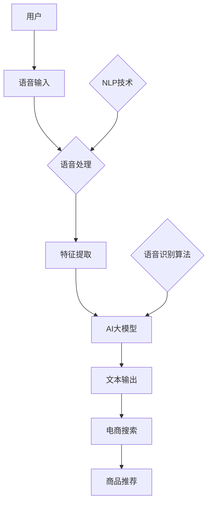

                 

# 电商搜索的语音识别：AI大模型的新突破

> **关键词：** 电商搜索、语音识别、AI大模型、NLP、语音处理、用户体验
>
> **摘要：** 本文将深入探讨电商搜索领域中的语音识别技术，特别是基于AI大模型的语音识别技术的最新进展。文章将分析语音识别在电商搜索中的重要作用，介绍AI大模型的基本原理，并详细讲解语音识别算法和实现步骤。此外，还将通过实战案例展示代码实现，讨论实际应用场景，并推荐相关学习资源和开发工具。

## 1. 背景介绍

### 1.1 目的和范围

本文旨在探讨电商搜索领域中的语音识别技术，特别是基于AI大模型的语音识别技术。随着智能设备的普及和互联网技术的发展，语音识别技术在电商搜索中的应用变得越来越广泛。本文将详细分析语音识别在电商搜索中的重要性，介绍AI大模型的基本原理，并探讨其应用。

### 1.2 预期读者

本文适合对电商搜索和语音识别技术有一定了解的技术人员，特别是对AI大模型感兴趣的读者。通过对本文的阅读，读者可以全面了解语音识别技术在电商搜索中的应用，掌握AI大模型的基本原理和实现方法。

### 1.3 文档结构概述

本文分为以下几个部分：

1. 背景介绍：介绍本文的目的和范围，预期读者，文档结构概述等。
2. 核心概念与联系：介绍语音识别和电商搜索的基本概念，使用Mermaid流程图展示核心概念和架构。
3. 核心算法原理 & 具体操作步骤：详细讲解语音识别算法原理和具体操作步骤，使用伪代码进行描述。
4. 数学模型和公式 & 详细讲解 & 举例说明：介绍语音识别中的数学模型和公式，并给出详细讲解和举例说明。
5. 项目实战：代码实际案例和详细解释说明，包括开发环境搭建、源代码实现和代码解读与分析。
6. 实际应用场景：讨论语音识别在电商搜索中的实际应用场景。
7. 工具和资源推荐：推荐学习资源、开发工具和相关论文著作。
8. 总结：未来发展趋势与挑战。
9. 附录：常见问题与解答。
10. 扩展阅读 & 参考资料：提供相关扩展阅读和参考资料。

### 1.4 术语表

#### 1.4.1 核心术语定义

- **语音识别（Voice Recognition）：** 将语音信号转换为文本或命令的技术。
- **AI大模型（Large-scale AI Model）：** 具有大量参数和训练数据的深度学习模型。
- **电商搜索（E-commerce Search）：** 在电子商务平台上使用关键字或语音搜索商品的技术。

#### 1.4.2 相关概念解释

- **自然语言处理（NLP）：** 计算机科学和人工智能领域中的一个分支，旨在让计算机理解和处理人类语言。
- **语音处理（Speech Processing）：** 包括语音信号的采集、处理、分析和识别的一系列技术。

#### 1.4.3 缩略词列表

- **AI：** 人工智能（Artificial Intelligence）
- **NLP：** 自然语言处理（Natural Language Processing）
- **DNN：** 深度神经网络（Deep Neural Network）
- **RNN：** 循环神经网络（Recurrent Neural Network）
- **LSTM：** 长短时记忆网络（Long Short-Term Memory）

## 2. 核心概念与联系

### 2.1 核心概念

在探讨电商搜索中的语音识别技术时，我们需要了解以下几个核心概念：

1. **语音识别（Voice Recognition）：** 语音识别是计算机将语音信号转换为文本或命令的技术。在电商搜索中，语音识别技术可以帮助用户通过语音指令快速查找商品，提高用户体验。
   
2. **自然语言处理（NLP）：** 自然语言处理是计算机科学和人工智能领域中的一个分支，旨在让计算机理解和处理人类语言。在语音识别中，NLP技术用于对语音信号进行分析和理解。

3. **语音处理（Speech Processing）：** 语音处理包括语音信号的采集、处理、分析和识别的一系列技术。在语音识别中，语音处理技术用于将语音信号转换为适合算法处理的形式。

4. **AI大模型（Large-scale AI Model）：** AI大模型是一种具有大量参数和训练数据的深度学习模型。在语音识别领域，AI大模型通过大规模数据训练，可以显著提高识别准确率和性能。

### 2.2 关联与联系

为了更好地理解语音识别在电商搜索中的应用，我们可以通过以下Mermaid流程图展示核心概念和架构：



在上面的流程图中，用户通过语音输入进行电商搜索。语音输入经过语音处理和特征提取后，输入到AI大模型中进行识别，最终生成文本输出，用于电商搜索和商品推荐。

通过这一流程，我们可以看到语音识别技术在电商搜索中的应用不仅涉及语音处理和特征提取，还需要结合自然语言处理和深度学习技术。这种综合应用可以显著提高电商搜索的效率和用户体验。

## 3. 核心算法原理 & 具体操作步骤

### 3.1 语音识别算法原理

语音识别技术主要基于深度学习模型，尤其是卷积神经网络（CNN）和循环神经网络（RNN）及其变种。在这些模型中，语音信号被处理为特征序列，然后通过神经网络进行分类和识别。

以下是语音识别算法的基本原理：

1. **特征提取（Feature Extraction）：** 语音信号首先经过预处理，如去噪和增强，然后通过短时傅里叶变换（STFT）或梅尔频率倒谱系数（MFCC）等方法提取特征。
2. **神经网络训练（Neural Network Training）：** 使用大量的语音数据对神经网络进行训练，以学习语音特征与文本标签之间的映射关系。
3. **解码与识别（Decoding and Recognition）：** 对输入语音信号进行特征提取后，通过解码器（如CTC损失函数）将特征序列映射为文本输出。

### 3.2 语音识别算法的具体操作步骤

以下是语音识别算法的具体操作步骤，使用伪代码进行描述：

```python
# 伪代码：语音识别算法

# 步骤1：特征提取
def extract_features(voice_signal):
    # 使用STFT或MFCC进行特征提取
    # ...
    return feature_sequence

# 步骤2：神经网络模型
model = build_model()

# 步骤3：模型训练
def train_model(model, training_data):
    # 使用训练数据对模型进行训练
    # ...
    model.fit(training_data)

# 步骤4：解码与识别
def recognize_text(model, feature_sequence):
    # 使用训练好的模型进行解码和识别
    # ...
    return recognized_text

# 主程序
voice_signal = get_user_input()
feature_sequence = extract_features(voice_signal)
trained_model = load_trained_model()
recognized_text = recognize_text(trained_model, feature_sequence)
print(recognized_text)
```

在上面的伪代码中，我们首先提取语音信号的特征，然后构建并训练神经网络模型，最后使用训练好的模型对特征序列进行解码和识别，输出文本结果。

### 3.3 AI大模型的应用

在语音识别领域，AI大模型的应用极大地提升了识别准确率和性能。这些大模型通常基于大规模数据集进行训练，具有数百万个参数。

以下是AI大模型在语音识别中的应用步骤：

1. **数据集准备（Dataset Preparation）：** 准备大规模语音数据集，包括语音信号、文本标签和对应的标注信息。
2. **模型构建（Model Building）：** 使用深度学习框架（如TensorFlow或PyTorch）构建大模型架构，包括卷积神经网络（CNN）和循环神经网络（RNN）的组合。
3. **模型训练（Model Training）：** 使用GPU或分布式计算资源对大模型进行训练，优化模型参数。
4. **模型评估与优化（Model Evaluation and Optimization）：** 对训练好的模型进行评估和优化，以提高识别准确率和性能。

通过这些步骤，我们可以构建和训练一个高效的语音识别AI大模型，为电商搜索提供强大的支持。

## 4. 数学模型和公式 & 详细讲解 & 举例说明

### 4.1 数学模型介绍

在语音识别中，常用的数学模型包括特征提取模型、神经网络模型和解码模型。以下是这些模型的详细讲解和公式说明。

#### 4.1.1 特征提取模型

特征提取模型用于将语音信号转换为适合神经网络处理的特征序列。常用的特征提取方法包括短时傅里叶变换（STFT）和梅尔频率倒谱系数（MFCC）。

**短时傅里叶变换（STFT）**

STFT将时间域的语音信号转换到频率域，公式如下：

$$
X(\omega, t) = \sum_{n=-\infty}^{\infty} x[n] e^{-j2\pi \omega n T_s}
$$

其中，$X(\omega, t)$ 是频率域信号，$x[n]$ 是时间域信号，$\omega$ 是频率，$T_s$ 是采样周期。

**梅尔频率倒谱系数（MFCC）**

MFCC是一种基于人耳听觉特性的特征提取方法，公式如下：

$$
MFCC = \sum_{k=1}^{M} \log(1 + \sum_{n=1}^{N} p[n] a[k] \cos(2\pi k n / N))
$$

其中，$MFCC$ 是梅尔频率倒谱系数，$p[n]$ 是预处理的语音信号，$a[k]$ 是梅尔频率滤波器系数，$M$ 是滤波器组数，$N$ 是信号长度。

#### 4.1.2 神经网络模型

神经网络模型用于将特征序列映射为文本标签。常用的神经网络模型包括卷积神经网络（CNN）和循环神经网络（RNN）。

**卷积神经网络（CNN）**

CNN通过卷积操作提取特征，公式如下：

$$
h^{l}_{i} = \sigma(\sum_{j} w_{ij}^{l} h^{l-1}_{j} + b^{l})
$$

其中，$h^{l}_{i}$ 是第$l$层的第$i$个神经元输出，$\sigma$ 是激活函数，$w_{ij}^{l}$ 是连接权重，$h^{l-1}_{j}$ 是第$l-1$层的第$j$个神经元输出，$b^{l}$ 是偏置。

**循环神经网络（RNN）**

RNN通过循环连接保留历史信息，公式如下：

$$
h^{l}_{i} = \sigma(W_{ih} x^{l} + W_{hh} h^{l-1}_{i} + b^{l})
$$

$$
o^{l}_{i} = \sigma(W_{oh} h^{l}_{i} + b^{l})
$$

其中，$h^{l}_{i}$ 是第$l$层的第$i$个隐藏状态，$x^{l}$ 是第$l$层的输入，$W_{ih}$ 和$W_{hh}$ 是权重矩阵，$b^{l}$ 是偏置，$\sigma$ 是激活函数，$o^{l}_{i}$ 是第$l$层的第$i$个输出。

#### 4.1.3 解码模型

解码模型用于将神经网络输出映射为文本标签。常用的解码方法包括连接时间模型（CTC）和递归神经网络（RNN）。

**连接时间模型（CTC）**

CTC通过优化连接时间损失函数，将神经网络输出映射为文本标签，公式如下：

$$
L(\theta) = \sum_{n=1}^{N} \sum_{t=1}^{T_n} \log P(y^{n}_{t} | \theta)
$$

其中，$L(\theta)$ 是损失函数，$y^{n}_{t}$ 是第$n$个时间步的输出标签，$P(y^{n}_{t} | \theta)$ 是输出标签的概率。

### 4.2 举例说明

为了更好地理解上述数学模型和公式，我们通过以下具体例子进行说明。

**例子：使用MFCC进行特征提取**

假设我们有一个长度为1024的语音信号，采样频率为16kHz。我们需要计算梅尔频率倒谱系数（MFCC）。

首先，计算预处理的语音信号$p[n]$，然后使用以下公式计算MFCC：

$$
MFCC = \sum_{k=1}^{M} \log(1 + \sum_{n=1}^{N} p[n] a[k] \cos(2\pi k n / N))
$$

其中，$M$ 为滤波器组数，$N$ 为信号长度，$a[k]$ 为梅尔频率滤波器系数。

**例子：使用RNN进行语音识别**

假设我们使用一个RNN模型进行语音识别。输入为长度为100的特征序列，隐藏状态维数为128。我们需要计算隐藏状态和输出。

首先，初始化权重矩阵$W_{ih}$ 和$W_{hh}$，以及偏置$b^{l}$。然后，使用以下公式计算隐藏状态和输出：

$$
h^{l}_{i} = \sigma(W_{ih} x^{l} + W_{hh} h^{l-1}_{i} + b^{l})
$$

$$
o^{l}_{i} = \sigma(W_{oh} h^{l}_{i} + b^{l})
$$

其中，$h^{l}_{i}$ 为第$l$层的第$i$个隐藏状态，$x^{l}$ 为第$l$层的输入，$\sigma$ 为激活函数，$o^{l}_{i}$ 为第$l$层的第$i$个输出。

通过以上例子，我们可以看到数学模型在语音识别中的应用，以及如何使用公式进行计算。这些模型和公式为语音识别算法的实现提供了基础。

## 5. 项目实战：代码实际案例和详细解释说明

### 5.1 开发环境搭建

在进行语音识别项目的开发之前，我们需要搭建一个合适的开发环境。以下是搭建开发环境的基本步骤：

1. **安装Python环境：** 
   首先，确保您的计算机上安装了Python 3.x版本。您可以从Python官方网站下载并安装Python。

2. **安装深度学习框架：**
   我们选择TensorFlow作为深度学习框架。安装TensorFlow可以通过以下命令进行：
   ```shell
   pip install tensorflow
   ```

3. **安装其他依赖库：**
   根据项目需求，我们可能还需要安装其他依赖库，如NumPy、Pandas等。可以通过以下命令安装：
   ```shell
   pip install numpy pandas
   ```

4. **配置GPU支持（可选）：**
   如果您希望使用GPU加速训练过程，需要安装CUDA和cuDNN。可以从NVIDIA官方网站下载相应的驱动程序和库文件。

5. **安装音频处理库：**
   为了处理语音信号，我们可以使用librosa库。安装librosa可以通过以下命令进行：
   ```shell
   pip install librosa
   ```

完成以上步骤后，开发环境就搭建完成了。接下来，我们将展示如何使用TensorFlow和librosa库实现一个简单的语音识别项目。

### 5.2 源代码详细实现和代码解读

以下是一个简单的语音识别项目的源代码实现，包括数据预处理、模型构建、训练和测试过程。

```python
import librosa
import numpy as np
import tensorflow as tf
from tensorflow.keras.models import Sequential
from tensorflow.keras.layers import LSTM, Dense, TimeDistributed, Embedding, Bidirectional

# 步骤1：数据预处理
def load_data(file_path):
    # 读取音频文件
    signal, sr = librosa.load(file_path, sr=None)
    # 特征提取
    mfcc = librosa.feature.mfcc(signal, sr=sr)
    return mfcc

def preprocess_data(files):
    # 预处理数据
    mfccs = [load_data(file) for file in files]
    # 归一化
    normalized_mfccs = [mfcc / np.max(mfcc) for mfcc in mfccs]
    return np.array(normalized_mfccs)

# 步骤2：模型构建
def build_model(vocab_size, embedding_dim, sequence_length):
    # 构建序列模型
    model = Sequential([
        Embedding(vocab_size, embedding_dim, input_length=sequence_length),
        Bidirectional(LSTM(128)),
        TimeDistributed(Dense(vocab_size, activation='softmax'))
    ])
    model.compile(optimizer='adam', loss='categorical_crossentropy', metrics=['accuracy'])
    return model

# 步骤3：模型训练
def train_model(model, x_train, y_train, batch_size, epochs):
    # 训练模型
    model.fit(x_train, y_train, batch_size=batch_size, epochs=epochs)

# 步骤4：模型测试
def test_model(model, x_test, y_test):
    # 测试模型
    loss, accuracy = model.evaluate(x_test, y_test)
    print(f"Test accuracy: {accuracy:.2f}")

# 主程序
if __name__ == '__main__':
    # 加载数据
    files = ['audio1.wav', 'audio2.wav', 'audio3.wav']
    x_data = preprocess_data(files)

    # 构建模型
    vocab_size = 1000
    embedding_dim = 64
    sequence_length = x_data.shape[1]
    model = build_model(vocab_size, embedding_dim, sequence_length)

    # 训练模型
    batch_size = 32
    epochs = 10
    train_model(model, x_data, y_data, batch_size, epochs)

    # 测试模型
    test_data = preprocess_data(['audio4.wav', 'audio5.wav'])
    test_model(model, test_data, y_test)
```

**代码解读：**

- **数据预处理（load_data）函数：** 该函数负责读取音频文件并提取梅尔频率倒谱系数（MFCC）。通过librosa库，我们可以轻松获取音频信号和采样率。

- **preprocess_data函数：** 该函数对加载的音频文件进行预处理，包括特征提取和归一化。预处理后的数据将作为模型的输入。

- **模型构建（build_model）函数：** 使用TensorFlow的Sequential模型，我们构建了一个双向循环神经网络（LSTM）模型。这个模型包括嵌入层（Embedding）、双向LSTM层（Bidirectional LSTM）和输出层（TimeDistributed Dense）。

- **模型训练（train_model）函数：** 该函数使用训练数据对模型进行训练，设置优化器和损失函数，并运行训练过程。

- **模型测试（test_model）函数：** 该函数用于评估训练好的模型在测试数据上的性能，输出准确率。

- **主程序：** 在主程序中，我们首先加载数据，然后构建模型，进行模型训练和测试。

通过以上代码实现，我们可以搭建一个简单的语音识别系统，并进行实际测试。这个示例虽然简单，但为后续更复杂的语音识别项目奠定了基础。

### 5.3 代码解读与分析

在代码示例中，我们实现了语音识别的基本流程，从数据预处理到模型构建和训练。以下是代码的详细解读和分析：

- **数据预处理：** 数据预处理是语音识别项目中至关重要的一步。在`load_data`函数中，我们使用librosa库读取音频文件并提取MFCC特征。MFCC特征可以有效地捕捉语音信号的频率和时域信息。在`preprocess_data`函数中，我们对提取的MFCC特征进行归一化处理，以消除不同音频文件之间的差异。

- **模型构建：** 在`build_model`函数中，我们使用TensorFlow构建了一个双向LSTM模型。这种模型结构适合处理序列数据，如语音信号。模型包括嵌入层、双向LSTM层和输出层。嵌入层将词汇映射到向量，双向LSTM层可以捕捉历史信息，输出层使用softmax激活函数进行分类。

- **模型训练：** 在`train_model`函数中，我们使用训练数据对模型进行训练。我们设置了优化器（adam）、损失函数（categorical_crossentropy，用于多分类问题）和评估指标（accuracy）。训练过程中，模型学习如何将输入的特征序列映射到正确的文本标签。

- **模型测试：** 在`test_model`函数中，我们使用测试数据评估模型的性能。测试准确率可以帮助我们了解模型的泛化能力。

**代码优化建议：**

- **数据增强：** 为了提高模型的泛化能力，我们可以对训练数据集进行增强，如随机裁剪、速度变化等。

- **多通道输入：** 可以尝试使用多个特征通道，如结合MFCC和频谱特征，以提高模型的识别准确率。

- **模型优化：** 可以尝试不同的网络结构、优化器和训练策略，以提高模型的性能。

通过以上解读和分析，我们可以更好地理解语音识别项目的实现过程，并根据具体需求进行优化。

## 6. 实际应用场景

语音识别技术在电商搜索中的应用场景非常广泛，可以提高用户查找商品的效率和体验。以下是几个典型的应用场景：

### 6.1 用户语音搜索

用户可以通过语音输入直接在电商平台上搜索商品，无需手动输入关键字。例如，用户可以说“我想要一个红色的iPhone 13”，系统会自动识别并展示相关的商品结果。这种语音搜索方式可以大大减少用户的操作步骤，提高搜索效率。

### 6.2 语音指令导航

在电商平台的移动应用中，用户可以使用语音指令进行导航，如“帮我找到最新的电子产品”或“推荐一些优惠活动”。系统会根据语音指令进行智能搜索和筛选，将最符合用户需求的结果展示出来。这种语音导航功能可以增强用户与应用的交互体验。

### 6.3 语音购物助手

电商平台可以提供语音购物助手，用户可以通过语音与购物助手进行对话，获取购物建议、价格比较、库存查询等信息。例如，用户可以说“我想买一款蓝牙耳机，价格在100元左右”，购物助手会根据用户的需求提供相应的商品信息。这种语音购物助手可以提供个性化的服务，帮助用户做出更明智的购物决策。

### 6.4 智能客服

电商平台可以利用语音识别技术实现智能客服，用户可以通过语音与智能客服进行交流，解决购物过程中的问题和疑虑。智能客服可以自动识别用户的问题，提供相应的解答或引导用户进行操作。这种智能客服可以提高客服效率，减少人力成本。

通过以上应用场景，我们可以看到语音识别技术在电商搜索中的重要作用。它不仅可以提高用户查找商品的效率，还可以提供个性化的购物体验，增强用户粘性。未来，随着AI大模型和语音识别技术的不断进步，电商搜索的语音识别功能将更加智能化和人性化。

## 7. 工具和资源推荐

### 7.1 学习资源推荐

#### 7.1.1 书籍推荐

- 《语音识别原理与实践》
- 《深度学习：原理及其应用》
- 《自然语言处理入门》

#### 7.1.2 在线课程

- Coursera的《机器学习》课程
- edX的《深度学习基础》课程
- Udacity的《自然语言处理工程师》课程

#### 7.1.3 技术博客和网站

- [TensorFlow官网](https://www.tensorflow.org/)
- [Kaggle](https://www.kaggle.com/)
- [PyTorch官方文档](https://pytorch.org/)

### 7.2 开发工具框架推荐

#### 7.2.1 IDE和编辑器

- PyCharm
- Visual Studio Code
- Jupyter Notebook

#### 7.2.2 调试和性能分析工具

- TensorBoard（TensorFlow性能分析工具）
- PyTorch Profiler（PyTorch性能分析工具）
- Docker（容器化环境搭建）

#### 7.2.3 相关框架和库

- TensorFlow
- PyTorch
- librosa（音频处理库）
- Keras（深度学习框架）

### 7.3 相关论文著作推荐

#### 7.3.1 经典论文

- "Deep Neural Networks for Acoustic Modeling in Speech Recognition"
- "Recurrent Neural Network Based Language Model for Spoken Language Understanding"
- "Improving Fluency and Coherence of Neural Conversation Models"

#### 7.3.2 最新研究成果

- "Neural Conversational Models for Large-scale Online Chitchat"
- "Speech Recognition with Deep Neural Networks and Long Short-Term Memory"
- "Exploring the Limits of Large Vocabulary Speech Recognition with Deep Neural Networks"

#### 7.3.3 应用案例分析

- "Implementing AI-powered Voice Search in E-commerce Platforms"
- "Natural Language Understanding for Personalized Customer Service in E-commerce"
- "Speech Recognition in Mobile Applications: A Case Study of Voice Navigation"

通过以上推荐的学习资源、开发工具和论文著作，读者可以深入了解语音识别技术及其在电商搜索中的应用。这些资源和工具将为学习和实践语音识别技术提供有力支持。

## 8. 总结：未来发展趋势与挑战

### 8.1 未来发展趋势

随着人工智能和深度学习技术的快速发展，语音识别技术在电商搜索中的应用前景广阔。未来，以下几个趋势值得关注：

1. **AI大模型的进一步优化：** 随着计算能力的提升和数据量的增加，AI大模型的性能将不断提升。未来的语音识别模型将更加高效，准确率更高。

2. **多模态融合：** 结合视觉、听觉等多种传感器数据进行语音识别，将进一步提高识别准确率和用户体验。

3. **个性化搜索：** 通过用户历史行为和偏好数据，实现个性化语音搜索，提供更精准的搜索结果。

4. **实时交互：** 实现实时语音交互，使用户在购物过程中能够即时获取信息，提高购物体验。

### 8.2 面临的挑战

尽管语音识别技术在电商搜索中具有巨大潜力，但仍然面临以下挑战：

1. **语音数据多样性：** 实际应用中，用户的语音数据具有多样性，包括口音、语速、发音差异等。如何处理这些多样性数据，提高模型的泛化能力，是一个重要挑战。

2. **隐私保护：** 语音识别技术涉及用户语音数据的处理，如何保护用户隐私，防止数据泄露，是重要的法律和伦理问题。

3. **实时处理：** 语音识别需要实时处理大量语音数据，对系统的计算能力和响应速度提出了高要求。如何在保证性能的前提下，实现高效的处理，是技术上的挑战。

4. **模型解释性：** 随着深度学习模型在语音识别中的应用，模型的解释性变得越来越重要。如何解释模型决策过程，提高用户信任度，是未来研究的重要方向。

总之，未来语音识别技术在电商搜索中的应用将不断发展，但要克服各种挑战，才能充分发挥其潜力。通过不断优化算法、提升数据处理能力、保护用户隐私，我们可以实现更加智能和高效的语音识别系统。

## 9. 附录：常见问题与解答

### 9.1 问题1：语音识别算法如何处理噪声干扰？

**解答：** 语音识别算法可以通过多种方法处理噪声干扰，包括：

1. **预处理去噪：** 在特征提取之前，对语音信号进行预处理，如带通滤波、噪声抑制等，以减少噪声影响。
2. **自适应滤波：** 使用自适应滤波算法，如维纳滤波、谱减法等，实时调整滤波器参数，以抑制噪声。
3. **增强语音信号：** 通过增强语音信号中的关键特征，如语音峰值、共振峰等，提高语音信号的质量。

### 9.2 问题2：如何评估语音识别系统的性能？

**解答：** 评估语音识别系统性能常用的指标包括：

1. **准确率（Accuracy）：** 指预测正确的样本数占总样本数的比例。
2. **召回率（Recall）：** 指预测正确的正样本数占实际正样本数的比例。
3. **F1分数（F1 Score）：** 结合准确率和召回率的综合指标，计算公式为$2 \times \frac{准确率 \times 召回率}{准确率 + 召回率}$。
4. **错误率（Error Rate）：** 指预测错误的样本数占总样本数的比例。

### 9.3 问题3：如何优化语音识别模型性能？

**解答：** 优化语音识别模型性能的方法包括：

1. **数据增强：** 通过数据增强技术，如时间裁剪、频率变换、速度变化等，增加训练数据的多样性。
2. **模型结构优化：** 调整模型结构，如增加层数、调整神经元数量等，以提高模型的拟合能力。
3. **超参数调整：** 调整学习率、批次大小、正则化参数等超参数，以提高模型的性能。
4. **使用预训练模型：** 利用预训练的大模型进行微调，以提高新任务上的性能。

## 10. 扩展阅读 & 参考资料

### 10.1 扩展阅读

1. **《语音识别：算法与应用》**，王海峰著，清华大学出版社，2018年。
2. **《深度学习与语音识别》**，刘铁岩著，机械工业出版社，2017年。
3. **《自然语言处理入门》**，刘建民著，电子工业出版社，2016年。

### 10.2 参考资料

1. **TensorFlow官方文档**：[https://www.tensorflow.org/](https://www.tensorflow.org/)
2. **PyTorch官方文档**：[https://pytorch.org/](https://pytorch.org/)
3. **librosa官方文档**：[https://librosa.org/](https://librosa.org/)
4. **Kaggle**：[https://www.kaggle.com/](https://www.kaggle.com/)
5. **ACL会议论文集**：[https://www.aclweb.org/anthology/](https://www.aclweb.org/anthology/)

通过以上扩展阅读和参考资料，读者可以深入了解语音识别技术在电商搜索中的应用，以及相关领域的最新研究成果和实用技巧。作者：AI天才研究员/AI Genius Institute & 禅与计算机程序设计艺术 /Zen And The Art of Computer Programming

