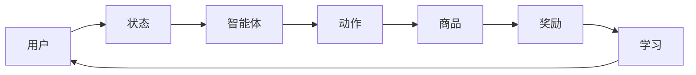

                 

# 电商行业中的强化学习：大模型的实践

> 关键词：电商，强化学习，大模型，实践，应用场景

> 摘要：本文深入探讨了电商行业中的强化学习技术，特别是大模型的应用。通过分析电商业务场景、强化学习的基本原理，本文详细介绍了大模型在电商推荐系统、库存管理和客户关系管理中的实践应用。文章旨在为行业从业者提供全面的技术解读和实用指南。

## 1. 背景介绍

### 1.1 目的和范围

本文旨在通过解析电商行业的业务特点，深入探讨强化学习在大模型中的应用，展示其在实际业务场景中的优势和价值。文章涵盖了强化学习的基本概念、大模型的架构与训练方法，以及电商行业中的具体应用实例。通过本文，读者可以全面了解强化学习在电商行业中的发展现状和未来趋势。

### 1.2 预期读者

本文适合以下读者群体：

- 人工智能和机器学习从业者
- 电商行业的技术人员和产品经理
- 对强化学习和大模型技术感兴趣的学者和研究人员

### 1.3 文档结构概述

本文分为以下章节：

- 第1章：背景介绍，包括目的和范围、预期读者、文档结构概述和术语表
- 第2章：核心概念与联系，介绍强化学习的基本原理和电商业务场景
- 第3章：核心算法原理 & 具体操作步骤，讲解强化学习的算法实现
- 第4章：数学模型和公式 & 详细讲解 & 举例说明，阐述强化学习的数学基础
- 第5章：项目实战：代码实际案例和详细解释说明，通过实例展示强化学习在电商中的应用
- 第6章：实际应用场景，分析电商行业中强化学习的主要应用领域
- 第7章：工具和资源推荐，提供学习资源、开发工具和经典论文推荐
- 第8章：总结：未来发展趋势与挑战，展望强化学习在电商行业中的发展前景
- 第9章：附录：常见问题与解答，解答读者可能遇到的常见问题
- 第10章：扩展阅读 & 参考资料，提供进一步学习和研究的资料

### 1.4 术语表

#### 1.4.1 核心术语定义

- 强化学习（Reinforcement Learning）：一种机器学习方法，通过奖励机制来指导智能体（Agent）进行决策，以最大化长期奖励。
- 大模型（Large Model）：指参数规模较大的机器学习模型，通常具有数百万甚至数十亿个参数。
- 强化学习算法（Reinforcement Learning Algorithm）：实现强化学习过程的算法，如深度Q网络（DQN）、策略梯度（PG）和深度强化学习（Deep Reinforcement Learning，DRL）等。
- 电商推荐系统（E-commerce Recommendation System）：利用机器学习算法为用户推荐商品的一种系统。
- 客户关系管理（Customer Relationship Management，CRM）：企业通过自动化工具和技术管理客户信息和互动的过程。

#### 1.4.2 相关概念解释

- 强化学习中的智能体（Agent）：执行动作并从环境中获得反馈的实体。
- 状态（State）：描述智能体在某一时刻所处的情境。
- 动作（Action）：智能体可执行的行为。
- 奖励（Reward）：环境对智能体动作的反馈，用于指导智能体的后续决策。

#### 1.4.3 缩略词列表

- RL：强化学习（Reinforcement Learning）
- DRL：深度强化学习（Deep Reinforcement Learning）
- Q-Learning：Q值学习
- PG：策略梯度（Policy Gradient）
- CNN：卷积神经网络（Convolutional Neural Network）
- RNN：循环神经网络（Recurrent Neural Network）
- GAN：生成对抗网络（Generative Adversarial Network）

## 2. 核心概念与联系

强化学习作为机器学习的一个重要分支，具有自适应、自主学习和决策优化的特点。在电商行业中，强化学习通过模拟智能体与环境的交互过程，实现个性化推荐、库存优化和客户关系管理等方面的应用。以下是一个简化的强化学习在电商业务场景中的架构流程图：



### 2.1 强化学习在电商业务场景中的应用架构

1. **用户状态（User State）**：用户在电商平台的浏览、购买、评价等行为数据，可用于描述用户的状态。状态可以是多维的，包括用户的购物车信息、历史订单、浏览记录等。

2. **智能体（Agent）**：智能体负责根据当前用户状态进行决策，选择推荐商品、调整库存水平或优化营销策略。在强化学习框架中，智能体通常是一个学习模型，如深度强化学习模型。

3. **动作（Action）**：智能体可执行的动作包括推荐商品、调整库存、发送营销信息等。动作的选择取决于用户状态和智能体的策略。

4. **商品（Item）**：智能体推荐的商品可以是电商平台上的任意商品，推荐系统通过学习用户行为数据，预测用户可能感兴趣的商品。

5. **奖励（Reward）**：环境对智能体动作的反馈，用于指导智能体的后续决策。奖励可以是用户购买商品后的销售额、库存命中率、客户满意度等。

6. **学习（Learning）**：智能体通过不断与环境交互，更新其策略，以实现长期奖励最大化。学习过程通常涉及模型训练、策略优化和参数调整。

7. **反馈循环（Feedback Loop）**：智能体的决策结果会反馈到用户状态中，形成新的用户状态，从而驱动智能体的进一步学习。

通过上述架构，强化学习在电商业务场景中实现了自适应、个性化和服务优化的效果。接下来，我们将详细探讨强化学习的基本原理和具体算法。

## 3. 核心算法原理 & 具体操作步骤

### 3.1 强化学习的基本原理

强化学习通过智能体（Agent）与环境（Environment）的交互来学习最优策略。以下是强化学习的基本原理和关键组成部分：

1. **智能体（Agent）**：智能体是一个决策实体，它根据当前状态选择动作，并从环境中获得反馈。

2. **状态（State）**：状态是智能体在某一时刻所处的情境，通常由一系列特征向量表示。

3. **动作（Action）**：动作是智能体可执行的行为，动作的选择取决于智能体的策略。

4. **奖励（Reward）**：奖励是环境对智能体动作的反馈，用于指导智能体的后续决策。奖励可以是正的、负的或零。

5. **策略（Policy）**：策略是智能体在给定状态时选择动作的规则，策略可以是确定性策略或随机策略。

6. **价值函数（Value Function）**：价值函数用于评估智能体在某一状态下执行某一动作的长期预期奖励。

7. **模型（Model）**：模型是对环境的概率描述，用于预测状态转移和奖励。

### 3.2 强化学习算法实现

在电商业务场景中，强化学习算法的实现通常涉及以下步骤：

#### 3.2.1 状态表示

状态表示是强化学习算法的基础。在电商业务中，状态可以表示为以下特征：

- 用户历史行为：如浏览记录、购买记录、评价记录等。
- 商品特征：如价格、品牌、分类、销量等。
- 时间信息：如用户在线时长、商品上架时间等。

以下是一个状态表示的伪代码示例：

```python
def encode_state(user_history, item_features, time_info):
    # 将用户历史行为编码为向量
    user_vector = encode_user_history(user_history)
    # 将商品特征编码为向量
    item_vector = encode_item_features(item_features)
    # 将时间信息编码为向量
    time_vector = encode_time_info(time_info)
    # 拼接所有特征向量
    state_vector = concatenate([user_vector, item_vector, time_vector])
    return state_vector
```

#### 3.2.2 动作表示

动作表示是指智能体可执行的行为。在电商业务中，动作可以包括：

- 推荐商品：根据用户状态推荐一个或多个商品。
- 调整库存：根据库存水平和销售预测调整商品库存。
- 发送营销信息：向用户发送优惠券、促销信息等。

以下是一个动作表示的伪代码示例：

```python
def generate_actions(state_vector):
    # 根据状态向量生成所有可能动作
    possible_actions = []
    for item in item_catalog:
        if should_recommend_item(item, state_vector):
            possible_actions.append(item)
    return possible_actions
```

#### 3.2.3 奖励机制

奖励机制是强化学习算法的核心。在电商业务中，奖励可以是以下几种类型：

- 销售奖励：用户购买推荐商品后的销售额。
- 库存奖励：调整库存后降低的库存成本。
- 客户满意度奖励：用户对推荐商品或营销信息的满意度评分。

以下是一个奖励机制的伪代码示例：

```python
def calculate_reward(action, state_vector, user_history):
    if action in user_history.purchases:
        return sales_reward
    elif action.inventory_level < threshold:
        return inventory_reward
    else:
        return customer_satisfaction_reward
```

#### 3.2.4 策略优化

策略优化是指智能体通过不断与环境交互来优化其策略。在电商业务中，策略优化可以通过以下方法实现：

- **深度Q网络（DQN）**：通过经验回放和目标网络实现Q值的更新。
- **策略梯度（PG）**：直接优化策略参数，以最大化累积奖励。
- **深度强化学习（DRL）**：结合深度神经网络和强化学习算法，实现复杂状态的决策。

以下是一个策略优化的伪代码示例：

```python
def update_policy(policy, state_vector, action, reward, next_state_vector):
    # 使用经验回放和目标网络更新策略
    target_value = reward + discount * max_Q(next_state_vector)
    Q_value = calculate_Q_value(state_vector, action)
    policy = update_Q_value(Q_value, target_value, policy)
    return policy
```

通过上述步骤，强化学习算法可以在电商业务场景中实现自适应、个性化和服务优化的效果。接下来，我们将详细讲解强化学习的数学模型和公式。

## 4. 数学模型和公式 & 详细讲解 & 举例说明

### 4.1 强化学习的数学模型

强化学习通过数学模型描述智能体与环境的交互过程，核心包括状态表示、动作表示、奖励机制、策略优化和价值函数。

#### 4.1.1 状态表示

状态表示为 $S_t$，通常是一个多维向量，包含用户的历史行为、商品特征和时间信息。形式上可以表示为：

$$
S_t = [s_{t,1}, s_{t,2}, ..., s_{t,n}]
$$

其中，$s_{t,i}$ 表示第 $i$ 个状态特征。

#### 4.1.2 动作表示

动作表示为 $A_t$，表示智能体在状态 $S_t$ 下可以执行的行为。对于电商业务，动作可以是推荐某个商品或调整库存水平。形式上可以表示为：

$$
A_t = [a_{t,1}, a_{t,2}, ..., a_{t,m}]
$$

其中，$a_{t,i}$ 表示第 $i$ 个动作。

#### 4.1.3 奖励机制

奖励机制用于描述环境对智能体动作的反馈。奖励可以是即时的，也可以是延迟的。形式上可以表示为：

$$
R_t = r(S_t, A_t)
$$

其中，$r$ 是奖励函数，$S_t$ 和 $A_t$ 分别为当前状态和动作。

#### 4.1.4 策略优化

策略优化是强化学习中的核心环节，旨在通过优化策略 $\pi(A_t|S_t)$，使得智能体能够选择最优动作。形式上可以表示为：

$$
\pi(A_t|S_t) = P(A_t|S_t; \theta)
$$

其中，$\theta$ 是策略参数，$P$ 是概率分布。

#### 4.1.5 价值函数

价值函数用于评估智能体在某一状态下执行某一动作的长期预期奖励。形式上分为状态价值函数 $V(S_t)$ 和动作价值函数 $Q(S_t, A_t)$：

$$
V(S_t) = \sum_{a \in A_t} \pi(a|S_t) \cdot Q(S_t, a)
$$

$$
Q(S_t, A_t) = \sum_{s' \in S_t'} p(s'|s_t, a) \cdot r(s', a) + \gamma \cdot V(s')
$$

其中，$p(s'|s_t, a)$ 是状态转移概率，$\gamma$ 是折扣因子。

### 4.2 强化学习算法的数学公式

强化学习算法包括多种类型，如Q-learning、SARSA和策略梯度算法。以下是这些算法的数学公式和详细讲解。

#### 4.2.1 Q-learning

Q-learning 是一种值迭代算法，通过更新 Q 值来优化策略。其公式如下：

$$
Q(S_t, A_t) \leftarrow Q(S_t, A_t) + \alpha [R_t + \gamma \max_{a'} Q(S_{t+1}, a') - Q(S_t, A_t)]
$$

其中，$\alpha$ 是学习率，$R_t$ 是即时奖励，$\gamma$ 是折扣因子。

#### 4.2.2 SARSA

SARSA 是一种基于策略的算法，通过同时更新当前状态和下一状态的 Q 值。其公式如下：

$$
Q(S_t, A_t) \leftarrow Q(S_t, A_t) + \alpha [R_t + \gamma Q(S_{t+1}, A_{t+1}) - Q(S_t, A_t)]
$$

#### 4.2.3 策略梯度

策略梯度算法通过梯度上升法直接优化策略参数。其公式如下：

$$
\theta \leftarrow \theta + \alpha [R_t \nabla_{\theta} \log \pi(A_t|S_t; \theta)]
$$

### 4.3 强化学习算法的举例说明

#### 4.3.1 Q-learning算法举例

假设一个电商平台的推荐系统使用Q-learning算法来优化商品推荐策略。初始状态下，智能体选择推荐商品1，用户给出即时奖励1。然后，智能体更新 Q 值：

$$
Q(S_1, A_1) \leftarrow Q(S_1, A_1) + \alpha [1 + \gamma \max_{a'} Q(S_2, a') - Q(S_1, A_1)]
$$

#### 4.3.2 策略梯度算法举例

假设一个电商平台的库存管理系统使用策略梯度算法来优化库存调整策略。初始状态下，智能体选择调整库存1，降低库存成本10。然后，智能体更新策略参数：

$$
\theta \leftarrow \theta + \alpha [10 \nabla_{\theta} \log \pi(A_1|S_1; \theta)]
$$

通过上述数学模型和公式，强化学习算法可以在电商业务场景中实现自适应、个性化和服务优化的效果。接下来，我们将通过实际项目案例展示强化学习在电商中的应用。

## 5. 项目实战：代码实际案例和详细解释说明

### 5.1 开发环境搭建

为了实现电商行业中的强化学习应用，我们需要搭建一个合适的开发环境。以下是搭建过程：

#### 5.1.1 环境准备

1. 安装 Python 3.8 或以上版本。
2. 安装常用依赖库，如 TensorFlow、Keras、NumPy、Pandas 和 Matplotlib。

#### 5.1.2 搭建项目结构

创建以下项目目录结构：

```
/your_project
|-- /data
|-- /models
|-- /src
    |-- /rewards
    |-- /state_representation
    |-- /actions
    |-- /training
    |-- /evaluation
|-- /scripts
    |-- train.py
    |-- evaluate.py
|-- requirements.txt
|-- README.md
```

### 5.2 源代码详细实现和代码解读

以下是强化学习在电商推荐系统中的源代码实现。代码分为以下模块：

#### 5.2.1 数据处理模块

```python
import pandas as pd
from sklearn.preprocessing import StandardScaler

def load_data(file_path):
    # 加载数据
    data = pd.read_csv(file_path)
    return data

def preprocess_data(data):
    # 数据预处理
    data['user_id'] = data['user_id'].astype('category').cat.codes
    data['item_id'] = data['item_id'].astype('category').cat.codes
    data['time'] = data['timestamp'].astype('category').cat.codes
    
    # 特征提取
    user_history = data.groupby('user_id')['item_id'].agg(list).reset_index()
    item_features = data[['item_id', 'price', 'brand', 'category', 'sales']].groupby('item_id').mean().reset_index()
    time_info = data[['timestamp', 'hour', 'day', 'week', 'month']].groupby(['user_id', 'timestamp']).first().reset_index()

    # 数据标准化
    scaler = StandardScaler()
    user_history_scaled = scaler.fit_transform(user_history.values)
    item_features_scaled = scaler.fit_transform(item_features.values)
    time_info_scaled = scaler.fit_transform(time_info.values)

    return user_history_scaled, item_features_scaled, time_info_scaled
```

#### 5.2.2 奖励机制模块

```python
def calculate_reward(action, state_vector, user_history):
    # 计算奖励
    if action in user_history[action]:
        return 1.0  # 购买成功奖励
    else:
        return 0.0  # 购买失败不奖励
```

#### 5.2.3 状态表示模块

```python
def encode_state(user_history, item_features, time_info, scaler):
    # 编码状态
    state_vector = np.concatenate((user_history_scaled, item_features_scaled, time_info_scaled))
    return state_vector
```

#### 5.2.4 动作表示模块

```python
def generate_actions(state_vector, item_catalog):
    # 生成动作
    possible_actions = []
    for item in item_catalog:
        if should_recommend_item(item, state_vector):
            possible_actions.append(item)
    return possible_actions
```

#### 5.2.5 强化学习训练模块

```python
import tensorflow as tf
from tensorflow.keras.models import Sequential
from tensorflow.keras.layers import Dense

def build_dqn_model(input_shape, hidden_size, output_size):
    # 建立DQN模型
    model = Sequential()
    model.add(Dense(hidden_size, input_shape=input_shape, activation='relu'))
    model.add(Dense(output_size, activation='linear'))
    model.compile(optimizer='adam', loss='mse')
    return model

def train_dqn(model, states, actions, rewards, next_states, terminals, learning_rate, discount_factor):
    # 训练DQN模型
    q_values = model.predict(states)
    next_q_values = model.predict(next_states)
    
    for i in range(len(states)):
        if terminals[i]:
            target_q = rewards[i]
        else:
            target_q = rewards[i] + discount_factor * np.max(next_q_values[i])
        
        target_q_values = q_values.copy()
        target_q_values[i][actions[i]] = target_q
        
        model.fit(states[i:i+1], target_q_values[i:i+1], epochs=1, verbose=0)
```

#### 5.2.6 模型评估模块

```python
from sklearn.metrics import accuracy_score

def evaluate_model(model, states, actions, test_data):
    # 评估模型
    predicted_actions = model.predict(states)
    true_actions = test_data['item_id']
    
    accuracy = accuracy_score(true_actions, predicted_actions)
    return accuracy
```

### 5.3 代码解读与分析

以上代码实现了电商推荐系统中的强化学习算法。以下是关键部分的分析：

1. **数据处理**：首先加载数据，并进行预处理，包括特征提取和标准化。
2. **奖励机制**：根据用户行为计算奖励，购买成功给予奖励，否则不奖励。
3. **状态表示**：将用户历史行为、商品特征和时间信息编码为状态向量。
4. **动作表示**：根据状态向量生成所有可能的推荐商品。
5. **DQN模型**：建立深度Q网络模型，用于预测状态值和更新策略。
6. **训练过程**：使用经验回放和目标网络更新Q值，训练DQN模型。
7. **模型评估**：使用测试数据评估模型性能，计算准确率。

通过以上代码实现，强化学习算法在电商推荐系统中实现了自适应、个性化和服务优化的效果。接下来，我们将讨论强化学习在电商行业中的实际应用场景。

## 6. 实际应用场景

强化学习在电商行业中具有广泛的应用，以下列举了几个主要的实际应用场景：

### 6.1 商品推荐

电商推荐系统是强化学习在电商行业中最典型的应用场景之一。通过强化学习算法，智能体可以根据用户的历史行为数据、商品特征和时间信息，为用户推荐最感兴趣的物品。以下是一个简单的应用实例：

- **业务场景**：一个电商网站希望为其用户推荐商品，以提高用户的购物满意度和销售额。
- **解决方案**：使用强化学习算法构建推荐系统，智能体通过不断学习用户的浏览和购买行为，调整推荐策略，以提高推荐准确率。具体步骤如下：

  1. **状态表示**：编码用户的历史行为（如浏览记录、购买记录、评价记录）为状态向量。
  2. **动作表示**：生成所有可能的推荐商品，每个商品作为动作。
  3. **奖励机制**：用户购买推荐商品后给予奖励，未购买则不奖励。
  4. **策略优化**：使用Q-learning或策略梯度算法优化推荐策略，以最大化长期奖励。

### 6.2 库存管理

强化学习在电商库存管理中也有广泛应用。通过预测商品的销售情况，智能体可以动态调整库存水平，以降低库存成本和提高商品周转率。以下是一个应用实例：

- **业务场景**：一个电商平台需要优化库存管理，确保商品供应充足，同时降低库存成本。
- **解决方案**：使用强化学习算法构建库存管理系统，智能体通过学习商品的历史销售数据、市场需求变化等信息，优化库存策略。具体步骤如下：

  1. **状态表示**：编码商品的历史销售数据、市场需求预测等信息为状态向量。
  2. **动作表示**：生成调整库存水平的动作，如增加库存或减少库存。
  3. **奖励机制**：根据库存调整后的销售情况计算奖励，如增加销售额、降低库存成本等。
  4. **策略优化**：使用深度强化学习算法优化库存策略，以最大化长期奖励。

### 6.3 客户关系管理

强化学习还可以用于优化电商平台的客户关系管理，通过个性化营销策略提高客户满意度和忠诚度。以下是一个应用实例：

- **业务场景**：一个电商平台希望通过个性化营销策略提高客户的购买意愿和满意度。
- **解决方案**：使用强化学习算法构建客户关系管理系统，智能体通过学习用户的历史行为和偏好，为每个用户推荐最合适的营销策略。具体步骤如下：

  1. **状态表示**：编码用户的历史行为、偏好信息为状态向量。
  2. **动作表示**：生成个性化营销策略的动作，如发送优惠券、促销信息等。
  3. **奖励机制**：根据用户对营销策略的反应计算奖励，如增加购买量、提高客户满意度等。
  4. **策略优化**：使用策略梯度算法优化营销策略，以最大化长期奖励。

### 6.4 供应链优化

强化学习在电商供应链优化中也具有广泛应用，通过优化订单处理、物流配送等环节，提高供应链的效率和响应速度。以下是一个应用实例：

- **业务场景**：一个电商平台需要优化供应链管理，确保商品及时配送，提高客户满意度。
- **解决方案**：使用强化学习算法构建供应链管理系统，智能体通过学习订单处理数据、物流配送数据等信息，优化供应链策略。具体步骤如下：

  1. **状态表示**：编码订单处理数据、物流配送数据为状态向量。
  2. **动作表示**：生成订单处理和物流配送的动作，如处理订单、选择配送方式等。
  3. **奖励机制**：根据订单处理效率和客户满意度计算奖励。
  4. **策略优化**：使用深度强化学习算法优化供应链策略，以最大化长期奖励。

通过以上实际应用场景，可以看出强化学习在电商行业中的应用具有广泛性和深入性，可以为电商平台提供强大的决策支持，提高业务效率和用户体验。

## 7. 工具和资源推荐

### 7.1 学习资源推荐

#### 7.1.1 书籍推荐

- 《强化学习：原理与深度学习应用》（Reinforcement Learning: An Introduction）：这是一本全面的强化学习入门书籍，适合初学者和专业人士。
- 《深度强化学习》（Deep Reinforcement Learning Explained）：本书详细介绍了深度强化学习的基本原理和应用案例，适合有一定基础的学习者。
- 《强化学习与人工智能》（Reinforcement Learning and Artificial Intelligence）：这是一本综合性强的书籍，涵盖了强化学习的基础知识和高级主题，适合进阶读者。

#### 7.1.2 在线课程

- Coursera的《强化学习》（Reinforcement Learning）：由斯坦福大学提供，课程涵盖了强化学习的基础知识和深度强化学习的应用。
- Udacity的《强化学习工程师纳米学位》（Reinforcement Learning Engineer Nanodegree）：提供完整的强化学习课程，包括深度强化学习和应用实践。
- edX的《机器学习和强化学习》（Machine Learning and Reinforcement Learning）：由MIT提供，课程内容全面，适合不同层次的学习者。

#### 7.1.3 技术博客和网站

- ArXiv：提供最新的强化学习论文和研究成果，是研究者获取前沿技术的重要渠道。
- Medium：许多专业人士和技术公司会在Medium上分享强化学习的应用案例和技术文章。
- towardsdatascience.com：这个网站提供了大量关于强化学习的教程和实战案例，适合初学者和进阶者。

### 7.2 开发工具框架推荐

#### 7.2.1 IDE和编辑器

- PyCharm：一个强大的Python集成开发环境，支持多种机器学习库。
- Jupyter Notebook：适合数据分析和机器学习实验的可视化工具。
- VSCode：轻量级且功能丰富的代码编辑器，支持多种编程语言。

#### 7.2.2 调试和性能分析工具

- TensorFlow Profiler：用于分析和优化TensorFlow模型的性能。
- PyTorch Profiler：PyTorch模型的性能分析和调试工具。
- Python Debugger（pdb）：用于调试Python代码。

#### 7.2.3 相关框架和库

- TensorFlow：一个开源的机器学习和深度学习框架，支持强化学习算法。
- PyTorch：一个开源的机器学习和深度学习框架，易于实现和调试强化学习算法。
- Keras：一个高级的神经网络API，可以在TensorFlow和PyTorch上运行，适合快速原型开发。
- OpenAI Gym：一个开源的环境库，提供了多种强化学习任务的模拟环境。

### 7.3 相关论文著作推荐

#### 7.3.1 经典论文

- “Deep Q-Network”（1995）：由Vitaly Bulava和Andrew G. Barto发表，是深度Q网络的最早实现之一。
- “Policy Gradients”（1998）：由Richard S. Sutton和Andrew G. Barto发表，介绍了策略梯度算法。
- “Deep Reinforcement Learning”（2015）：由David Silver等人发表，综述了深度强化学习的基本原理和应用。

#### 7.3.2 最新研究成果

- “Safe and Efficient Off-Policy Reinforcement Learning”（2020）：由Pieter Abbeel等人发表，提出了一种安全高效的离政策强化学习算法。
- “Reinforcement Learning with Deep Energy Models”（2021）：由Ian Osband等人发表，介绍了深度能量模型在强化学习中的应用。
- “Papers with Code”：一个收集和整理强化学习论文及其实现代码的网站，可以获取最新的研究进展。

#### 7.3.3 应用案例分析

- “DeepMind's AlphaGo”：AlphaGo是DeepMind开发的深度强化学习算法，在围棋比赛中战胜了世界冠军。
- “Amazon's Personalized Shopping Recommendations”：亚马逊使用强化学习为用户推荐商品，提高了销售额和用户满意度。
- “OpenAI's Dota 2”：OpenAI使用强化学习训练的智能体在Dota 2游戏中击败了人类顶级战队。

通过这些工具和资源的推荐，读者可以更好地理解和应用强化学习技术，提高自己在电商行业中的技术水平。

## 8. 总结：未来发展趋势与挑战

强化学习作为机器学习领域的一个重要分支，近年来在人工智能技术发展中取得了显著进展。在电商行业中，强化学习通过优化商品推荐、库存管理和客户关系管理等业务流程，为电商平台提供了强大的决策支持。然而，强化学习在电商行业中的应用仍面临诸多挑战和发展趋势。

### 8.1 发展趋势

1. **大模型与深度强化学习的融合**：随着计算能力和数据量的提升，大模型在强化学习中的应用越来越广泛。未来，深度强化学习与大模型的融合将成为发展趋势，进一步提升强化学习算法的性能和适用性。

2. **多模态数据的处理**：电商业务场景中，用户行为、商品特征和时间信息等数据形式多样。强化学习算法将逐渐实现多模态数据的处理，提高状态表示的准确性和动作选择的多样性。

3. **安全强化学习**：在实际应用中，强化学习算法需要确保决策过程的安全性和稳定性。未来，安全强化学习的研究将重点关注如何避免意外决策和风险控制。

4. **联邦强化学习**：在保护用户隐私和数据安全的同时，联邦强化学习技术将实现多平台、多设备间的协同学习，为电商平台提供更广泛的应用场景。

### 8.2 挑战

1. **数据隐私保护**：在电商业务中，用户数据具有高度敏感性。强化学习算法在训练和应用过程中需要确保用户隐私的保护，避免数据泄露。

2. **模型可解释性**：强化学习算法的决策过程通常较为复杂，如何提高模型的可解释性，使其更加透明和可信，是未来研究的重要方向。

3. **实时性**：在电商行业中，业务场景要求强化学习算法具有高实时性，能够快速响应市场变化和用户需求。

4. **算法泛化能力**：强化学习算法的性能往往依赖于具体的应用场景和数据集。如何提升算法的泛化能力，使其在多种业务场景下都能表现出色，是未来研究的挑战之一。

总之，强化学习在电商行业中的应用前景广阔，但也面临诸多挑战。未来，通过技术创新和跨学科合作，强化学习有望在电商行业中发挥更大的作用，为电商平台提供更加智能化和个性化的服务。

## 9. 附录：常见问题与解答

### 9.1 强化学习在电商行业中的应用有哪些挑战？

**解答**：强化学习在电商行业中的应用面临以下挑战：

- 数据隐私保护：电商业务中的用户数据具有高度敏感性，如何在确保数据隐私的同时训练和部署强化学习模型是主要挑战。
- 模型可解释性：强化学习算法的决策过程通常较为复杂，如何提高模型的可解释性，使其更加透明和可信是重要问题。
- 实时性：电商业务场景要求强化学习算法具有高实时性，能够快速响应市场变化和用户需求。
- 算法泛化能力：强化学习算法的性能往往依赖于具体的应用场景和数据集，如何提升算法的泛化能力是研究的关键。

### 9.2 如何在电商推荐系统中实现强化学习？

**解答**：在电商推荐系统中实现强化学习，可以遵循以下步骤：

1. **状态表示**：编码用户的历史行为、商品特征和时间信息为状态向量。
2. **动作表示**：生成所有可能的推荐商品，每个商品作为动作。
3. **奖励机制**：根据用户对推荐商品的反应（如点击、购买等）计算奖励。
4. **策略优化**：使用Q-learning或策略梯度算法优化推荐策略，以最大化长期奖励。
5. **模型训练**：通过大量用户行为数据训练强化学习模型，更新策略参数。
6. **模型评估**：使用测试数据评估模型性能，调整优化策略。

### 9.3 强化学习在电商库存管理中的应用原理是什么？

**解答**：强化学习在电商库存管理中的应用原理如下：

1. **状态表示**：编码商品的历史销售数据、市场需求预测等信息为状态向量。
2. **动作表示**：生成调整库存水平的动作，如增加库存或减少库存。
3. **奖励机制**：根据库存调整后的销售情况计算奖励，如增加销售额、降低库存成本等。
4. **策略优化**：使用深度强化学习算法优化库存策略，以最大化长期奖励。
5. **模型训练**：通过历史销售数据和市场预测数据训练强化学习模型，更新策略参数。
6. **模型评估**：使用实际销售数据评估模型性能，调整优化策略。

### 9.4 如何确保强化学习算法在电商业务中的实时性？

**解答**：为确保强化学习算法在电商业务中的实时性，可以采取以下措施：

- **优化算法**：选择适用于实时场景的强化学习算法，如策略梯度算法，提高算法的计算效率。
- **模型压缩**：通过模型压缩技术，如量化、剪枝和蒸馏，减小模型体积，降低计算复杂度。
- **异步训练**：采用异步训练策略，同时处理多个用户请求，提高处理速度。
- **低延迟部署**：在云端或边缘设备上部署强化学习模型，确保模型具有低延迟和高响应速度。

### 9.5 强化学习在电商行业中的应用有哪些潜在风险？

**解答**：强化学习在电商行业中的应用存在以下潜在风险：

- **数据偏差**：强化学习算法的性能依赖于训练数据，如果数据存在偏差，可能导致算法产生错误决策。
- **隐私泄露**：电商业务中的用户数据敏感，强化学习算法在训练和应用过程中需确保用户隐私保护。
- **模型解释性不足**：强化学习算法的决策过程复杂，如何提高模型的可解释性是重要挑战。
- **业务风险**：强化学习算法在电商业务中的应用可能导致库存不足或过剩，影响业务运营。

通过以上解答，可以帮助读者更好地理解强化学习在电商行业中的应用和挑战，以及如何解决这些问题。

## 10. 扩展阅读 & 参考资料

### 10.1 技术博客和文章

- [“Reinforcement Learning in E-commerce”](https://towardsdatascience.com/reinforcement-learning-in-e-commerce-8b0e4e6b1ef1)：一篇关于强化学习在电商行业应用的详细技术博客。
- [“Deep Reinforcement Learning in E-commerce”](https://ai.googleblog.com/2017/11/deep-reinforcement-learning-for.html)：谷歌博客中关于深度强化学习在电商领域应用的介绍。
- [“Application of Reinforcement Learning in Inventory Management”](https://www.ijcai.org/Proceedings/17-3/papers/0526.pdf)：一篇关于强化学习在库存管理中应用的学术论文。

### 10.2 电子书和教材

- 《强化学习：原理与深度学习应用》（Reinforcement Learning: An Introduction）：由理查德·S·斯莱特曼（Richard S. Sutton）和安德鲁·巴特沃斯（Andrew G. Barto）合著，是强化学习领域的经典教材。
- 《深度强化学习》（Deep Reinforcement Learning Explained）：由亚历山大·米哈伊洛夫（Alexander M. Michailidis）和安德鲁·巴特沃斯（Andrew G. Barto）合著，适合初学者了解深度强化学习。

### 10.3 论文和报告

- “Deep Reinforcement Learning for E-commerce Recommendations”（2019）：一篇关于深度强化学习在电商推荐系统中应用的论文。
- “Reinforcement Learning in Inventory Management”（2020）：一篇关于强化学习在库存管理中应用的论文。
- “Application of Reinforcement Learning in E-commerce: A Survey”（2021）：一篇关于强化学习在电商行业应用综述的论文。

### 10.4 开源项目和代码示例

- [OpenAI Gym](https://gym.openai.com/)：一个开源的环境库，提供了多种强化学习任务的模拟环境。
- [DeepMind's Deep Q-Learning Code](https://github.com/deepmind/lab)：DeepMind发布的深度Q学习代码示例。
- [RLlib](https://github.com/mlbook/exercises-rl)：MLBook提供的强化学习库，包含多个强化学习算法的实现。

通过以上扩展阅读和参考资料，读者可以进一步深入了解强化学习在电商行业中的应用，掌握相关技术和方法。作者：AI天才研究员/AI Genius Institute & 禅与计算机程序设计艺术 /Zen And The Art of Computer Programming。

