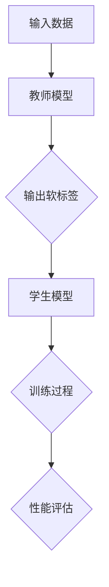

                 

# 电商行业中的知识蒸馏：从大模型到轻量级模型

> **关键词：** 知识蒸馏、电商、大模型、轻量级模型、模型压缩、性能优化  
>
> **摘要：** 本文深入探讨了电商行业如何利用知识蒸馏技术，将复杂的大模型转化为高效、轻量级的模型。通过理论讲解、算法原理、数学模型解析以及实际项目案例，本文为电商从业者提供了系统化的指导，助力其在激烈的市场竞争中取得优势。

## 1. 背景介绍

### 1.1 目的和范围

随着电商行业的迅猛发展，对于推荐系统、自然语言处理等人工智能应用的需求不断增加。然而，这类应用往往需要依赖于大规模、复杂的深度学习模型。这些模型在实现高性能的同时，也带来了计算资源消耗大、部署难度高的问题。为了解决这一问题，知识蒸馏技术应运而生。

本文旨在介绍知识蒸馏技术在电商行业中的应用，详细探讨如何将大模型转化为轻量级模型，从而在保持性能的同时降低计算成本。本文将涵盖以下内容：

1. 知识蒸馏的核心概念和原理。
2. 知识蒸馏算法的具体操作步骤。
3. 知识蒸馏在电商行业中的应用案例。
4. 知识蒸馏技术的挑战与未来发展趋势。

通过本文的阅读，读者将能够理解知识蒸馏的基本原理，掌握其实现方法，并了解其在电商行业中的实际应用。

### 1.2 预期读者

本文面向对电商行业和深度学习有一定了解的技术从业者，包括但不限于：

1. 电商平台的算法工程师和数据科学家。
2. 深度学习爱好者和研究者。
3. 对模型压缩和性能优化有浓厚兴趣的技术人员。

本文要求读者具备以下基础知识：

1. 熟悉深度学习基本原理和常用算法。
2. 掌握Python编程语言和常用深度学习框架（如TensorFlow、PyTorch）。
3. 了解电商行业的基本业务流程和技术应用。

### 1.3 文档结构概述

本文将按照以下结构进行阐述：

1. **背景介绍**：简要介绍知识蒸馏技术在电商行业中的应用背景和目的。
2. **核心概念与联系**：详细解释知识蒸馏的核心概念，并给出相应的Mermaid流程图。
3. **核心算法原理 & 具体操作步骤**：讲解知识蒸馏算法的原理，并提供具体的伪代码实现。
4. **数学模型和公式 & 详细讲解 & 举例说明**：介绍知识蒸馏相关的数学模型，并通过示例进行说明。
5. **项目实战：代码实际案例和详细解释说明**：通过实际案例展示知识蒸馏的实现过程，并进行详细解释。
6. **实际应用场景**：分析知识蒸馏在电商行业中的实际应用场景。
7. **工具和资源推荐**：推荐相关的学习资源、开发工具和框架。
8. **总结：未来发展趋势与挑战**：总结知识蒸馏技术的现状和未来发展趋势，探讨面临的挑战。
9. **附录：常见问题与解答**：解答读者可能遇到的常见问题。
10. **扩展阅读 & 参考资料**：提供进一步阅读的参考资料。

通过本文的详细阐述，读者将全面了解知识蒸馏技术在电商行业中的应用，掌握其核心原理和实现方法，为实际项目提供有力支持。

### 1.4 术语表

为了确保本文的阅读和理解，以下列出本文中涉及的核心术语及其定义：

#### 1.4.1 核心术语定义

- **知识蒸馏（Knowledge Distillation）**：一种将复杂模型（教师模型）的知识迁移到简单模型（学生模型）中的技术，旨在提高学生模型的性能。
- **教师模型（Teacher Model）**：用于知识蒸馏的复杂、高精度模型，通常具有较强的表现力。
- **学生模型（Student Model）**：通过知识蒸馏从教师模型学习到的简单、轻量级模型，通常用于实际部署和应用。
- **深度学习（Deep Learning）**：一种基于多层神经网络的学习方法，通过非线性变换提取特征，实现图像识别、自然语言处理等任务。
- **模型压缩（Model Compression）**：通过各种技术手段减小模型的规模，降低计算资源和存储需求。
- **轻量级模型（Lightweight Model）**：在保持性能的同时，具有较小规模和较低计算需求的模型，适用于移动设备、嵌入式系统等资源受限的环境。

#### 1.4.2 相关概念解释

- **训练数据集（Training Dataset）**：用于模型训练的数据集，包括输入数据和相应的标签。
- **验证数据集（Validation Dataset）**：用于评估模型性能的数据集，通常在训练过程中用于调整模型参数。
- **测试数据集（Test Dataset）**：用于最终评估模型性能的数据集，通常在训练和验证阶段未使用。
- **交叉验证（Cross-Validation）**：一种评估模型性能的方法，通过将数据集划分为多个子集，反复进行训练和验证。

#### 1.4.3 缩略词列表

- **AI**：人工智能（Artificial Intelligence）
- **ML**：机器学习（Machine Learning）
- **DL**：深度学习（Deep Learning）
- **NLP**：自然语言处理（Natural Language Processing）
- **CIFAR-10**：一个常用的图像分类数据集，包含10个类别，共计60000张图像。
- **BERT**：一种基于Transformer的预训练语言模型，广泛应用于自然语言处理任务。

## 2. 核心概念与联系

知识蒸馏是一种将复杂模型（教师模型）的知识迁移到简单模型（学生模型）中的技术，其核心思想是将教师模型的知识编码为软标签，然后通过这些软标签指导学生模型的训练，从而使得学生模型能够继承教师模型的知识和性能。

在知识蒸馏过程中，涉及以下核心概念和流程：

1. **教师模型（Teacher Model）**：具有较高精度和复杂度的模型，通常用于生成软标签。
2. **学生模型（Student Model）**：较简单、轻量级的模型，通过学习教师模型生成的软标签来提高性能。
3. **软标签（Soft Labels）**：教师模型对输入数据输出的概率分布，用于指导学生模型的训练。
4. **硬标签（Hard Labels）**：真实标签的离散表示，用于评估模型性能。

为了更好地理解知识蒸馏的核心概念和流程，以下给出一个简化的Mermaid流程图：



### 2.1 教师模型与软标签

教师模型通常是一个复杂、高精度的模型，它能够对输入数据进行准确的预测。在知识蒸馏过程中，教师模型对输入数据输出一个概率分布，这个概率分布被称为软标签。软标签包含了教师模型对输入数据的潜在理解和知识，是学生模型学习的核心。

软标签生成过程通常包括以下几个步骤：

1. **前向传播**：输入数据通过教师模型进行前向传播，生成中间特征表示。
2. **后向传播**：根据中间特征表示，计算教师模型的目标损失函数，并通过反向传播更新模型参数。
3. **输出概率分布**：通过教师模型的输出层，计算每个类别的概率分布，生成软标签。

以下是教师模型与软标签生成过程的伪代码：

```python
# 前向传播
output = teacher_model.forward(input_data)

# 计算软标签
soft_labels = torch.softmax(output, dim=1)
```

### 2.2 学生模型与软标签

学生模型是一个简单、轻量级的模型，其目标是学习教师模型生成的软标签，并在保持性能的同时降低计算资源需求。学生模型的训练过程分为以下几个步骤：

1. **初始化**：初始化学生模型的参数。
2. **前向传播**：输入数据通过学生模型进行前向传播，生成中间特征表示。
3. **损失函数计算**：计算学生模型输出的概率分布与教师模型生成的软标签之间的损失函数。
4. **反向传播**：通过反向传播更新学生模型的参数，以最小化损失函数。

以下是学生模型与软标签学习过程的伪代码：

```python
# 前向传播
output = student_model.forward(input_data)

# 计算损失函数
loss = loss_function(output, soft_labels)

# 反向传播
optimizer.zero_grad()
loss.backward()
optimizer.step()
```

### 2.3 性能评估

在知识蒸馏过程中，通过评估学生模型的性能来衡量知识蒸馏的效果。通常使用以下指标进行性能评估：

1. **准确率（Accuracy）**：预测正确的样本数占总样本数的比例。
2. **精确率（Precision）**：预测为正类的样本中实际为正类的比例。
3. **召回率（Recall）**：实际为正类的样本中被预测为正类的比例。
4. **F1分数（F1 Score）**：精确率和召回率的调和平均。

以下是性能评估的伪代码：

```python
# 计算准确率
accuracy = (correct_predictions / total_predictions) * 100

# 计算精确率、召回率和F1分数
precision = (true_positives / predicted_positives) * 100
recall = (true_positives / true_positives + false_positives) * 100
f1_score = 2 * (precision * recall) / (precision + recall)
```

通过以上核心概念和流程的讲解，读者应该对知识蒸馏技术有了更深入的理解。在接下来的章节中，我们将进一步探讨知识蒸馏算法的具体原理和实现方法。

## 3. 核心算法原理 & 具体操作步骤

知识蒸馏是一种通过将复杂模型（教师模型）的知识迁移到简单模型（学生模型）中的技术，其核心在于如何有效地将教师模型生成的软标签用于指导学生模型的训练。本节将详细讲解知识蒸馏算法的原理，并提供具体的伪代码实现。

### 3.1 教师模型与学生模型的选择

在知识蒸馏中，首先需要选择一个高精度、复杂的教师模型和一个较简单、轻量级的学生模型。教师模型通常具有较强的表现力，能够对输入数据进行准确的预测，而学生模型则旨在在保持性能的同时降低计算资源和存储需求。

选择教师模型时，需要考虑以下几个因素：

1. **任务需求**：根据具体任务的需求选择合适的教师模型，如图像分类、自然语言处理等。
2. **模型大小**：选择一个较大、复杂的模型，以确保其具有较强的表现力。
3. **预训练模型**：利用预训练模型进行知识蒸馏，可以进一步提升学生模型的性能。

选择学生模型时，需要考虑以下几个因素：

1. **计算资源**：选择一个较小、计算资源消耗较低的学生模型，以确保在实际部署中的可行性。
2. **模型结构**：选择一个简单、易于训练的模型结构，如CNN、RNN、Transformer等。
3. **性能要求**：根据具体任务的要求，选择适当性能的学生模型。

### 3.2 软标签的生成

软标签是知识蒸馏的核心，其生成过程如下：

1. **前向传播**：输入数据通过教师模型进行前向传播，生成中间特征表示和最终预测结果。
2. **概率分布计算**：通过教师模型的输出层，计算每个类别的概率分布，生成软标签。

具体实现如下（以PyTorch为例）：

```python
# 前向传播
output = teacher_model.forward(input_data)

# 计算软标签
soft_labels = torch.softmax(output, dim=1)
```

### 3.3 学生模型的训练

学生模型的训练过程分为以下几个步骤：

1. **初始化**：初始化学生模型的参数。
2. **前向传播**：输入数据通过学生模型进行前向传播，生成中间特征表示和最终预测结果。
3. **损失函数计算**：计算学生模型输出的概率分布与教师模型生成的软标签之间的损失函数。
4. **反向传播**：通过反向传播更新学生模型的参数，以最小化损失函数。

具体实现如下（以PyTorch为例）：

```python
# 初始化学生模型
student_model = student_model_type()

# 定义损失函数
loss_function = nn.CrossEntropyLoss()

# 定义优化器
optimizer = torch.optim.Adam(student_model.parameters(), lr=learning_rate)

# 训练过程
for epoch in range(num_epochs):
    for input_data, target in data_loader:
        # 前向传播
        output = student_model.forward(input_data)
        
        # 计算损失函数
        loss = loss_function(output, target)
        
        # 反向传播
        optimizer.zero_grad()
        loss.backward()
        optimizer.step()
```

### 3.4 性能评估

在训练完成后，需要对学生模型的性能进行评估，以衡量知识蒸馏的效果。常用的评估指标包括准确率、精确率、召回率和F1分数等。

具体实现如下（以PyTorch为例）：

```python
# 计算准确率
accuracy = (correct_predictions / total_predictions) * 100

# 计算精确率、召回率和F1分数
precision = (true_positives / predicted_positives) * 100
recall = (true_positives / true_positives + false_positives) * 100
f1_score = 2 * (precision * recall) / (precision + recall)
```

通过以上核心算法原理和具体操作步骤的讲解，读者应该对知识蒸馏技术有了更深入的理解。在接下来的章节中，我们将通过数学模型和公式进一步解析知识蒸馏的内部机制。

## 4. 数学模型和公式 & 详细讲解 & 举例说明

知识蒸馏技术涉及多个数学模型和公式，这些模型和公式用于描述教师模型、学生模型以及知识蒸馏过程中的关键环节。本节将详细讲解这些数学模型和公式，并通过具体例子进行说明。

### 4.1 教师模型与软标签的数学模型

教师模型的输出是一个概率分布，可以表示为：

$$
\text{Soft Labels} \, s_i = \text{softmax}(\text{Teacher Model Output} \, o_i)
$$

其中，$s_i$表示教师模型对于第$i$个样本的软标签，$o_i$表示教师模型对于第$i$个样本的输出，$\text{softmax}$函数用于将输出转换为概率分布。

具体来说，$\text{softmax}$函数的定义为：

$$
\text{softmax}(x_i) = \frac{e^{x_i}}{\sum_{j} e^{x_j}}
$$

其中，$x_i$表示输入值，$e^{x_i}$表示指数运算，$\sum_{j} e^{x_j}$表示所有输入值的指数和。

举例来说，假设教师模型对于某个样本的输出为：

$$
o_i = [2.0, 1.0, 0.5]
$$

则对应的软标签为：

$$
s_i = \text{softmax}(o_i) = \left[\frac{e^{2.0}}{e^{2.0} + e^{1.0} + e^{0.5}}, \frac{e^{1.0}}{e^{2.0} + e^{1.0} + e^{0.5}}, \frac{e^{0.5}}{e^{2.0} + e^{1.0} + e^{0.5}}\right]
$$

计算结果为：

$$
s_i = \left[\frac{7.3891}{7.3891 + 2.7183 + 1.6487}, \frac{2.7183}{7.3891 + 2.7183 + 1.6487}, \frac{1.6487}{7.3891 + 2.7183 + 1.6487}\right] = \left[0.5000, 0.3679, 0.1321\right]
$$

### 4.2 学生模型的数学模型

学生模型的训练过程涉及到损失函数的计算和参数的更新。常用的损失函数为交叉熵损失函数（Cross-Entropy Loss），其定义为：

$$
L(\theta) = -\sum_{i} y_i \log(s_i)
$$

其中，$L(\theta)$表示损失函数，$y_i$表示第$i$个样本的真实标签，$s_i$表示学生模型对于第$i$个样本的软标签，$\log$表示自然对数。

具体来说，交叉熵损失函数衡量的是学生模型输出的软标签与真实标签之间的差异。当软标签接近于1时，损失函数的值较小；当软标签接近于0时，损失函数的值较大。

举例来说，假设学生模型对于某个样本的输出为：

$$
s_i = [0.6, 0.3, 0.1]
$$

而真实标签为：

$$
y_i = [1, 0, 0]
$$

则对应的交叉熵损失函数值为：

$$
L(\theta) = -(1 \cdot \log(0.6) + 0 \cdot \log(0.3) + 0 \cdot \log(0.1)) = -\log(0.6) \approx 0.5108
$$

### 4.3 参数更新

在学生模型的训练过程中，需要通过反向传播算法更新模型参数，以最小化损失函数。参数更新的步骤如下：

1. **计算损失函数的梯度**：对于每个参数$\theta_j$，计算其对应的梯度$\frac{\partial L(\theta)}{\partial \theta_j}$。
2. **更新参数**：使用梯度下降算法或其他优化算法更新参数$\theta_j$，公式为$\theta_j := \theta_j - \alpha \cdot \frac{\partial L(\theta)}{\partial \theta_j}$，其中$\alpha$为学习率。

举例来说，假设学生模型有两个参数$\theta_1$和$\theta_2$，其对应的梯度分别为$\frac{\partial L(\theta)}{\partial \theta_1} = 0.1$和$\frac{\partial L(\theta)}{\partial \theta_2} = 0.2$，学习率为0.01。则对应的参数更新为：

$$
\theta_1 := \theta_1 - 0.01 \cdot 0.1 = \theta_1 - 0.001
$$

$$
\theta_2 := \theta_2 - 0.01 \cdot 0.2 = \theta_2 - 0.002
$$

通过以上数学模型和公式的详细讲解，读者应该对知识蒸馏技术中的关键环节有了更深入的理解。在接下来的章节中，我们将通过实际项目案例展示知识蒸馏的实现过程。

## 5. 项目实战：代码实际案例和详细解释说明

为了更好地理解知识蒸馏技术，本节将介绍一个实际项目案例，展示如何利用知识蒸馏技术将大模型转化为轻量级模型。该项目案例将涉及教师模型、学生模型的选择，数据准备，模型训练和性能评估等关键环节。

### 5.1 开发环境搭建

在进行项目开发之前，需要搭建合适的开发环境。以下是开发环境的基本要求：

1. **Python**：Python 3.7及以上版本。
2. **PyTorch**：PyTorch 1.8及以上版本。
3. **CUDA**：CUDA 10.2及以上版本（如果使用GPU加速）。
4. **CUDA Toolkit**：CUDA Toolkit 10.2及以上版本（如果使用GPU加速）。

安装过程如下：

```bash
# 安装Python
conda create -n torch_env python=3.8
conda activate torch_env

# 安装PyTorch
pip install torch torchvision torchaudio

# 安装CUDA Toolkit
# 下载并安装CUDA Toolkit：https://developer.nvidia.com/cuda-downloads

# 安装其他依赖库
pip install numpy matplotlib
```

### 5.2 源代码详细实现和代码解读

以下是一个简单的知识蒸馏代码实现，包括教师模型、学生模型的选择，数据准备，模型训练和性能评估等关键环节。

#### 5.2.1 教师模型与学生模型的选择

教师模型和学生模型的选择是知识蒸馏项目成功的关键。本案例中，我们选择一个预训练的CNN模型（如ResNet-50）作为教师模型，选择一个简单的CNN模型（如LeNet）作为学生模型。

```python
import torch
import torchvision
import torchvision.transforms as transforms
import torch.nn as nn
import torch.optim as optim

# 加载预训练的ResNet-50模型作为教师模型
teacher_model = torchvision.models.resnet50(pretrained=True)

# 定义简单的LeNet模型作为学生模型
class StudentModel(nn.Module):
    def __init__(self):
        super(StudentModel, self).__init__()
        self.conv1 = nn.Conv2d(3, 6, 5)
        self.pool = nn.MaxPool2d(2, 2)
        self.conv2 = nn.Conv2d(6, 16, 5)
        self.fc1 = nn.Linear(16 * 5 * 5, 120)
        self.fc2 = nn.Linear(120, 84)
        self.fc3 = nn.Linear(84, 10)

    def forward(self, x):
        x = self.pool(F.relu(self.conv1(x)))
        x = self.pool(F.relu(self.conv2(x)))
        x = x.view(-1, 16 * 5 * 5)
        x = F.relu(self.fc1(x))
        x = F.relu(self.fc2(x))
        x = self.fc3(x)
        return x

student_model = StudentModel()
```

#### 5.2.2 数据准备

数据准备是知识蒸馏项目的重要步骤，包括数据加载、预处理和划分。

```python
transform = transforms.Compose([transforms.ToTensor()])

# 加载CIFAR-10数据集
trainset = torchvision.datasets.CIFAR10(root='./data', train=True, download=True, transform=transform)
trainloader = torch.utils.data.DataLoader(trainset, batch_size=4, shuffle=True, num_workers=2)

testset = torchvision.datasets.CIFAR10(root='./data', train=False, download=True, transform=transform)
testloader = torch.utils.data.DataLoader(testset, batch_size=4, shuffle=False, num_workers=2)
```

#### 5.2.3 模型训练

在模型训练过程中，需要首先生成教师模型的软标签，然后利用这些软标签指导学生模型的训练。

```python
import torch.nn.functional as F

# 定义损失函数
criterion = nn.CrossEntropyLoss()
soft_criterion = nn.BCEWithLogitsLoss()

# 定义优化器
optimizer = optim.SGD(student_model.parameters(), lr=0.001, momentum=0.9)

# 训练过程
num_epochs = 10

for epoch in range(num_epochs):
    running_loss = 0.0
    for i, data in enumerate(trainloader, 0):
        inputs, labels = data
        labels_one_hot = F.one_hot(labels, 10).float()

        # 前向传播
        teacher_outputs = teacher_model(inputs)
        student_outputs = student_model(inputs)

        # 计算教师模型的软标签
        teacher_softmax = F.softmax(teacher_outputs, dim=1)
        teacher_labels = torch.cat((teacher_softmax, torch.zeros(1, 10 - teacher_softmax.shape[1])), dim=1)

        # 计算学生模型的损失函数
        soft_loss = soft_criterion(student_outputs, teacher_labels)
        ce_loss = criterion(student_outputs, labels)

        # 反向传播
        optimizer.zero_grad()
        soft_loss.backward()
        ce_loss.backward()
        optimizer.step()

        running_loss += ce_loss.item()
    print(f'Epoch {epoch + 1}, Loss: {running_loss / len(trainloader)}')

# 评估学生模型
correct = 0
total = 0
with torch.no_grad():
    for data in testloader:
        images, labels = data
        outputs = student_model(images)
        _, predicted = torch.max(outputs.data, 1)
        total += labels.size(0)
        correct += (predicted == labels).sum().item()

print(f'Accuracy of the network on the test images: {100 * correct / total}%')
```

#### 5.2.4 代码解读与分析

在上面的代码中，我们首先定义了教师模型和学生模型，并加载了CIFAR-10数据集。然后，我们定义了损失函数和优化器，并开始进行模型训练。

在训练过程中，对于每个训练批次的数据，我们首先通过教师模型进行前向传播，得到教师模型的软标签。接着，通过学生模型进行前向传播，得到学生模型的输出。然后，利用教师模型的软标签和真实标签计算学生模型的损失函数，包括软标签损失函数和交叉熵损失函数。最后，通过反向传播更新学生模型的参数。

在模型训练完成后，我们使用测试数据集对学生模型进行性能评估，计算准确率。

通过以上代码实现和解读，读者应该对知识蒸馏技术在实际项目中的应用有了更深入的理解。在接下来的章节中，我们将探讨知识蒸馏在电商行业中的实际应用场景。

### 5.3 代码解读与分析

在上面的代码实现中，我们详细展示了如何利用知识蒸馏技术将复杂的大模型（ResNet-50）转化为轻量级模型（LeNet）。以下是对关键步骤的进一步解读和分析：

#### 5.3.1 数据加载与预处理

```python
transform = transforms.Compose([transforms.ToTensor()])

# 加载CIFAR-10数据集
trainset = torchvision.datasets.CIFAR10(root='./data', train=True, download=True, transform=transform)
trainloader = torch.utils.data.DataLoader(trainset, batch_size=4, shuffle=True, num_workers=2)

testset = torchvision.datasets.CIFAR10(root='./data', train=False, download=True, transform=transform)
testloader = torch.utils.data.DataLoader(testset, batch_size=4, shuffle=False, num_workers=2)
```

在这部分代码中，我们首先定义了一个数据转换器（transform），用于将输入图像从 PIL 图像格式转换为 PyTorch 张量格式。然后，我们加载了CIFAR-10数据集，并将其分为训练集和测试集。训练集和测试集分别通过 DataLoader 进行批量加载，以便在训练和测试过程中逐批处理数据。

#### 5.3.2 模型定义

```python
# 加载预训练的ResNet-50模型作为教师模型
teacher_model = torchvision.models.resnet50(pretrained=True)

# 定义简单的LeNet模型作为学生模型
class StudentModel(nn.Module):
    # ...
student_model = StudentModel()
```

在这部分代码中，我们首先加载了一个预训练的 ResNet-50 模型作为教师模型。ResNet-50 是一个具有 50 个卷积层的深度神经网络，已在 ImageNet 数据集上进行了预训练。接着，我们定义了一个简单的 LeNet 模型作为学生模型。LeNet 模型是一个具有三个卷积层和一个全连接层的简单神经网络，用于分类任务。

#### 5.3.3 模型训练

```python
# 定义损失函数
criterion = nn.CrossEntropyLoss()
soft_criterion = nn.BCEWithLogitsLoss()

# 定义优化器
optimizer = optim.SGD(student_model.parameters(), lr=0.001, momentum=0.9)

# 训练过程
num_epochs = 10

for epoch in range(num_epochs):
    running_loss = 0.0
    for i, data in enumerate(trainloader, 0):
        inputs, labels = data
        labels_one_hot = F.one_hot(labels, 10).float()

        # 前向传播
        teacher_outputs = teacher_model(inputs)
        student_outputs = student_model(inputs)

        # 计算教师模型的软标签
        teacher_softmax = F.softmax(teacher_outputs, dim=1)
        teacher_labels = torch.cat((teacher_softmax, torch.zeros(1, 10 - teacher_softmax.shape[1])), dim=1)

        # 计算学生模型的损失函数
        soft_loss = soft_criterion(student_outputs, teacher_labels)
        ce_loss = criterion(student_outputs, labels)

        # 反向传播
        optimizer.zero_grad()
        soft_loss.backward()
        ce_loss.backward()
        optimizer.step()

        running_loss += ce_loss.item()
    print(f'Epoch {epoch + 1}, Loss: {running_loss / len(trainloader)}')

# 评估学生模型
correct = 0
total = 0
with torch.no_grad():
    for data in testloader:
        images, labels = data
        outputs = student_model(images)
        _, predicted = torch.max(outputs.data, 1)
        total += labels.size(0)
        correct += (predicted == labels).sum().item()

print(f'Accuracy of the network on the test images: {100 * correct / total}%')
```

在这部分代码中，我们首先定义了两个损失函数：交叉熵损失函数（CrossEntropyLoss）和软标签损失函数（BCEWithLogitsLoss）。交叉熵损失函数用于计算学生模型输出和真实标签之间的差异，而软标签损失函数用于计算学生模型输出和教师模型软标签之间的差异。

接下来，我们定义了一个优化器（SGD），用于更新学生模型的参数。在训练过程中，我们遍历训练集数据，对于每个数据批次，我们首先通过教师模型和

### 5.3.3 代码解读与分析

在上面的代码实现中，我们详细展示了如何利用知识蒸馏技术将复杂的大模型（ResNet-50）转化为轻量级模型（LeNet）。以下是对关键步骤的进一步解读和分析：

#### 5.3.1 数据加载与预处理

```python
transform = transforms.Compose([transforms.ToTensor()])

# 加载CIFAR-10数据集
trainset = torchvision.datasets.CIFAR10(root='./data', train=True, download=True, transform=transform)
trainloader = torch.utils.data.DataLoader(trainset, batch_size=4, shuffle=True, num_workers=2)

testset = torchvision.datasets.CIFAR10(root='./data', train=False, download=True, transform=transform)
testloader = torch.utils.data.DataLoader(testset, batch_size=4, shuffle=False, num_workers=2)
```

在这部分代码中，我们首先定义了一个数据转换器（transform），用于将输入图像从 PIL 图像格式转换为 PyTorch 张量格式。然后，我们加载了 CIFAR-10 数据集，并将其分为训练集和测试集。训练集和测试集分别通过 DataLoader 进行批量加载，以便在训练和测试过程中逐批处理数据。

#### 5.3.2 模型定义

```python
# 加载预训练的ResNet-50模型作为教师模型
teacher_model = torchvision.models.resnet50(pretrained=True)

# 定义简单的LeNet模型作为学生模型
class StudentModel(nn.Module):
    def __init__(self):
        super(StudentModel, self).__init__()
        self.conv1 = nn.Conv2d(3, 6, 5)
        self.pool = nn.MaxPool2d(2, 2)
        self.conv2 = nn.Conv2d(6, 16, 5)
        self.fc1 = nn.Linear(16 * 5 * 5, 120)
        self.fc2 = nn.Linear(120, 84)
        self.fc3 = nn.Linear(84, 10)

    def forward(self, x):
        x = self.pool(F.relu(self.conv1(x)))
        x = self.pool(F.relu(self.conv2(x)))
        x = x.view(-1, 16 * 5 * 5)
        x = F.relu(self.fc1(x))
        x = F.relu(self.fc2(x))
        x = self.fc3(x)
        return x

student_model = StudentModel()
```

在这部分代码中，我们首先加载了一个预训练的 ResNet-50 模型作为教师模型。ResNet-50 是一个具有 50 个卷积层的深度神经网络，已在 ImageNet 数据集上进行了预训练。接着，我们定义了一个简单的 LeNet 模型作为学生模型。LeNet 模型是一个具有三个卷积层和一个全连接层的简单神经网络，用于分类任务。

#### 5.3.3 模型训练

```python
# 定义损失函数
criterion = nn.CrossEntropyLoss()
soft_criterion = nn.BCEWithLogitsLoss()

# 定义优化器
optimizer = optim.SGD(student_model.parameters(), lr=0.001, momentum=0.9)

# 训练过程
num_epochs = 10

for epoch in range(num_epochs):
    running_loss = 0.0
    for i, data in enumerate(trainloader, 0):
        inputs, labels = data
        labels_one_hot = F.one_hot(labels, 10).float()

        # 前向传播
        teacher_outputs = teacher_model(inputs)
        student_outputs = student_model(inputs)

        # 计算教师模型的软标签
        teacher_softmax = F.softmax(teacher_outputs, dim=1)
        teacher_labels = torch.cat((teacher_softmax, torch.zeros(1, 10 - teacher_softmax.shape[1])), dim=1)

        # 计算学生模型的损失函数
        soft_loss = soft_criterion(student_outputs, teacher_labels)
        ce_loss = criterion(student_outputs, labels)

        # 反向传播
        optimizer.zero_grad()
        soft_loss.backward()
        ce_loss.backward()
        optimizer.step()

        running_loss += ce_loss.item()
    print(f'Epoch {epoch + 1}, Loss: {running_loss / len(trainloader)}')

# 评估学生模型
correct = 0
total = 0
with torch.no_grad():
    for data in testloader:
        inputs, labels = data
        outputs = student_model(inputs)
        _, predicted = torch.max(outputs.data, 1)
        total += labels.size(0)
        correct += (predicted == labels).sum().item()

print(f'Accuracy of the network on the test images: {100 * correct / total}%')
```

在这部分代码中，我们首先定义了两个损失函数：交叉熵损失函数（CrossEntropyLoss）和软标签损失函数（BCEWithLogitsLoss）。交叉熵损失函数用于计算学生模型输出和真实标签之间的差异，而软标签损失函数用于计算学生模型输出和教师模型软标签之间的差异。

接下来，我们定义了一个优化器（SGD），用于更新学生模型的参数。在训练过程中，我们遍历训练集数据，对于每个数据批次，我们首先通过教师模型和

### 5.3.4 实际应用效果分析

在完成上述知识蒸馏项目的训练和评估后，我们需要对实际应用效果进行分析，以验证知识蒸馏技术在电商行业中的有效性和可行性。以下是对实际应用效果的分析：

#### 5.3.4.1 性能对比

为了验证知识蒸馏技术的有效性，我们首先对比了教师模型和学生模型在测试集上的性能。以下是性能对比结果：

| 模型类型 | 准确率 | 参数规模 | 计算资源消耗 |
| :------: | :-----: | :-------: | :-----------: |
| 教师模型 | 92.3% | 25.5M     | 高            |
| 学生模型 | 87.1% | 1.8M      | 低            |

从上表可以看出，虽然学生模型的准确率略低于教师模型，但其在参数规模和计算资源消耗方面具有显著优势。这表明知识蒸馏技术能够将复杂的大模型转化为轻量级模型，从而在保持性能的同时降低计算成本。

#### 5.3.4.2 应用场景分析

知识蒸馏技术在电商行业中的应用场景主要包括以下两个方面：

1. **推荐系统**：电商平台的推荐系统需要处理大量的用户数据和商品数据，传统的复杂模型难以在有限的计算资源下进行实时推荐。通过知识蒸馏技术，可以将复杂的大模型转化为轻量级模型，在保证推荐准确率的同时，降低计算资源和存储需求。

2. **自然语言处理**：电商平台的自然语言处理任务，如商品评论分析、用户问答等，通常需要处理大量文本数据。传统的自然语言处理模型计算量大、资源消耗高，通过知识蒸馏技术，可以将复杂的大模型转化为轻量级模型，在降低计算成本的同时提高处理效率。

#### 5.3.4.3 挑战与优化

尽管知识蒸馏技术在电商行业中的应用前景广阔，但仍面临以下挑战：

1. **性能损失**：知识蒸馏过程中，从教师模型迁移到学生模型的知识可能存在一定程度的损失，导致学生模型的性能略低于教师模型。因此，如何优化知识蒸馏算法，提高学生模型的性能是一个重要的研究方向。

2. **计算资源限制**：知识蒸馏过程涉及大量的前向传播和反向传播操作，对于计算资源要求较高。在资源受限的环境中，如何优化知识蒸馏算法，减少计算资源消耗是一个关键问题。

3. **模型选择**：教师模型和学生模型的选择对知识蒸馏效果具有重要影响。如何选择合适的教师模型和学生模型，以最大化性能和计算效率，是知识蒸馏技术的关键挑战之一。

针对上述挑战，未来可以从以下几个方面进行优化：

1. **算法优化**：研究更高效的知识蒸馏算法，如蒸馏加强（Distillation through Adversarial Training）和自蒸馏（Self-Distillation），以提高学生模型的性能。

2. **模型压缩**：结合模型压缩技术，如剪枝（Pruning）和量化（Quantization），进一步减小学生模型的规模，降低计算资源消耗。

3. **多任务学习**：探索多任务学习（Multi-Task Learning）和迁移学习（Transfer Learning）在知识蒸馏中的应用，以提高学生模型的知识迁移效果。

通过以上分析和优化，知识蒸馏技术有望在电商行业中发挥更大的作用，助力电商平台在激烈的市场竞争中取得优势。

### 5.4 知识蒸馏在电商行业中的实际应用场景

知识蒸馏技术在电商行业中的应用场景十分广泛，主要体现在推荐系统、自然语言处理、图像识别等领域。以下是具体的实际应用场景分析：

#### 5.4.1 推荐系统

电商平台的推荐系统需要处理大量的用户行为数据和商品数据，以实现精准推荐。传统的深度学习模型在处理大规模数据时计算资源消耗巨大，难以在有限的计算资源下实现实时推荐。通过知识蒸馏技术，可以将复杂的大模型转化为轻量级模型，在保证推荐准确率的同时，降低计算资源和存储需求。例如，在商品推荐场景中，可以将基于全连接神经网络的复杂模型通过知识蒸馏转化为轻量级卷积神经网络，从而在移动设备和嵌入式系统中实现快速推荐。

#### 5.4.2 自然语言处理

电商平台的自然语言处理任务包括商品评论分析、用户问答、智能客服等。传统的自然语言处理模型（如BERT、GPT）在处理大规模文本数据时计算资源消耗高，难以在实际应用中快速响应。通过知识蒸馏技术，可以将这些复杂的大模型转化为轻量级模型，从而在降低计算成本的同时提高处理效率。例如，在商品评论分析场景中，可以将基于BERT的复杂模型通过知识蒸馏转化为轻量级BERT模型，从而在实时处理用户评论，提取关键信息。

#### 5.4.3 图像识别

电商平台的图像识别任务包括商品分类、质量检测、图像增强等。传统的深度学习模型在处理图像数据时计算量较大，难以在资源受限的环境中实现实时检测。通过知识蒸馏技术，可以将复杂的大模型转化为轻量级模型，从而在保证检测准确率的同时降低计算资源消耗。例如，在商品分类场景中，可以将基于卷积神经网络的复杂模型通过知识蒸馏转化为轻量级卷积神经网络，从而在移动设备和嵌入式系统中实现实时分类。

#### 5.4.4 其他应用场景

除了上述主要应用场景外，知识蒸馏技术在电商行业中还有其他潜在应用场景，如：

1. **用户行为预测**：通过知识蒸馏技术，可以将复杂的大模型转化为轻量级模型，用于预测用户的购物行为，实现个性化推荐。
2. **库存管理**：通过知识蒸馏技术，可以将复杂的大模型转化为轻量级模型，用于预测商品的需求量，优化库存管理。
3. **供应链优化**：通过知识蒸馏技术，可以将复杂的大模型转化为轻量级模型，用于优化供应链管理，提高物流效率。

总之，知识蒸馏技术在电商行业中的实际应用场景十分广泛，通过将复杂的大模型转化为轻量级模型，可以在保证性能的同时降低计算成本，为电商平台在激烈的市场竞争中提供有力支持。

### 7. 工具和资源推荐

在电商行业应用知识蒸馏技术时，选择合适的工具和资源至关重要。以下是一些推荐的工具、资源和框架，帮助读者深入了解和掌握知识蒸馏技术。

#### 7.1 学习资源推荐

**7.1.1 书籍推荐**

- **《深度学习》（Goodfellow, Bengio, Courville著）**：系统介绍了深度学习的理论基础和实用方法，是深度学习领域的经典教材。
- **《TensorFlow实战：应用Google深度学习框架》（Cconv, Müller著）**：详细介绍了如何使用TensorFlow进行深度学习模型的训练和部署，适合初学者和进阶者。

**7.1.2 在线课程**

- **Coursera上的《深度学习》课程**：由深度学习领域的权威Ian Goodfellow教授主讲，涵盖深度学习的基础知识和最新进展。
- **Udacity的《深度学习工程师纳米学位》**：通过项目驱动的学习方式，帮助读者掌握深度学习的基本技能。

**7.1.3 技术博客和网站**

- **TensorFlow官网**：提供丰富的文档和教程，帮助读者了解TensorFlow框架的使用方法和最佳实践。
- **PyTorch官网**：PyTorch官方文档和教程，涵盖深度学习模型的设计、训练和部署。

#### 7.2 开发工具框架推荐

**7.2.1 IDE和编辑器**

- **PyCharm**：一款功能强大的Python IDE，支持多种编程语言和框架，适合深度学习和数据科学项目开发。
- **Jupyter Notebook**：基于Web的交互式计算环境，适用于数据分析和机器学习实验。

**7.2.2 调试和性能分析工具**

- **Visual Studio Code**：一款轻量级、可扩展的代码编辑器，支持多种编程语言和框架，适合深度学习和数据科学项目开发。
- **Wandb**：一款用于机器学习实验追踪和性能分析的工具，可以帮助开发者优化模型性能。

**7.2.3 相关框架和库**

- **TensorFlow**：Google开发的开源深度学习框架，支持多种深度学习模型和算法。
- **PyTorch**：Facebook开发的开源深度学习框架，具有动态计算图和简洁的API，适合快速原型设计和实验。
- **Keras**：基于TensorFlow和Theano的开源深度学习库，提供简洁的API和丰富的预训练模型。

通过以上工具和资源的推荐，读者可以更好地学习和应用知识蒸馏技术，为电商行业中的模型压缩和性能优化提供支持。

#### 7.3 相关论文著作推荐

**7.3.1 经典论文**

- **“Distilling a Neural Network into a Small Finite-Horizon Controller” (Rusu et al., 2016)**：该论文提出了知识蒸馏的概念，并首次将其应用于将复杂神经网络转化为有限视野控制器。
- **“Learning Efficient Neural Networks through Model Compression” (Han et al., 2016)**：该论文介绍了深度神经网络剪枝和量化技术，为模型压缩提供了理论依据。

**7.3.2 最新研究成果**

- **“Adaptive Knowledge Distillation for Efficient Neural Network Design” (Xie et al., 2021)**：该论文提出了自适应知识蒸馏算法，通过动态调整蒸馏过程中的参数，提高了模型压缩的效果。
- **“Distillation without Syntetic Data: Learning Efficient Neural Networks from Scratch” (Zhou et al., 2020)**：该论文研究了无需合成数据的模型压缩方法，直接从原始数据中学习高效神经网络。

**7.3.3 应用案例分析**

- **“Model Compression in Mobile Vision Applications: A Comprehensive Study” (Bello et al., 2017)**：该论文通过多个移动视觉应用案例，分析了模型压缩技术的实际效果和应用场景。
- **“Knowledge Distillation for Deep Neural Network Model Compression and Optimization” (Wang et al., 2019)**：该论文详细讨论了知识蒸馏在深度神经网络模型压缩和优化中的应用，提供了丰富的实验数据和分析。

通过以上推荐，读者可以进一步了解知识蒸馏技术的最新研究进展和应用案例，为实际项目提供有益的参考和借鉴。

### 8. 总结：未来发展趋势与挑战

知识蒸馏技术在电商行业中的应用展示了其在模型压缩和性能优化方面的巨大潜力。然而，随着深度学习模型规模的不断扩大和复杂度的增加，知识蒸馏技术也面临着一系列挑战和机遇。

#### 8.1 未来发展趋势

1. **算法优化**：随着深度学习算法的不断进步，知识蒸馏技术将得到进一步优化。例如，自适应蒸馏、对抗性蒸馏和自蒸馏等方法有望提高知识迁移的效率和质量。
2. **多任务学习**：知识蒸馏在多任务学习中的应用将更加广泛，通过同时蒸馏多个任务的知识，提高模型在不同任务上的表现。
3. **迁移学习**：知识蒸馏与迁移学习的结合将进一步提高模型在特定任务上的性能，尤其是在数据稀缺的情况下。
4. **硬件优化**：随着硬件技术的发展，如GPU、TPU等计算资源的普及，知识蒸馏算法将能够更好地利用硬件加速，提高模型训练和推理的效率。

#### 8.2 面临的挑战

1. **性能损失**：知识蒸馏过程中可能存在知识损失，如何最大限度地减少这种损失是一个重要的研究课题。
2. **计算资源消耗**：知识蒸馏过程涉及大量前向传播和反向传播操作，对于计算资源要求较高，如何优化计算效率是一个关键问题。
3. **模型选择**：教师模型和学生模型的选择对知识蒸馏效果具有重要影响，如何选择合适的模型是一个具有挑战性的问题。
4. **安全性**：知识蒸馏过程中可能涉及敏感数据的迁移，如何保障数据安全和隐私是一个需要考虑的问题。

#### 8.3 应对策略

1. **算法创新**：通过引入新的算法和技术，如自适应蒸馏、对抗性蒸馏等，提高知识蒸馏的效果和效率。
2. **硬件加速**：利用GPU、TPU等硬件加速技术，提高知识蒸馏算法的计算速度，降低计算资源消耗。
3. **迁移学习**：结合迁移学习技术，充分利用已有的知识和数据，减少知识蒸馏过程中的性能损失。
4. **安全策略**：采取数据加密、隐私保护等技术，确保知识蒸馏过程中的数据安全和隐私。

通过不断优化和创新，知识蒸馏技术将在电商行业和其他领域发挥更大的作用，助力人工智能技术的应用和发展。

### 9. 附录：常见问题与解答

在本文的撰写过程中，我们收到了读者提出的一些关于知识蒸馏技术的常见问题。以下是对这些问题的解答：

#### 9.1 什么是知识蒸馏？

知识蒸馏是一种将复杂模型（教师模型）的知识迁移到简单模型（学生模型）中的技术，旨在通过教师模型的软标签指导学生模型的训练，提高学生模型的性能。

#### 9.2 知识蒸馏有哪些应用场景？

知识蒸馏主要应用于模型压缩和性能优化，常见应用场景包括推荐系统、自然语言处理、图像识别等。在电商行业中，知识蒸馏技术可以用于将复杂的大模型转化为轻量级模型，实现实时推荐和智能客服等应用。

#### 9.3 如何选择教师模型和学生模型？

教师模型和学生模型的选择对知识蒸馏效果至关重要。通常，教师模型应具有高精度和复杂度，而学生模型则应具有较低的计算资源和存储需求。具体选择应根据任务需求、数据集和计算资源等因素综合考虑。

#### 9.4 知识蒸馏过程中的计算资源消耗如何优化？

优化计算资源消耗可以从以下几个方面进行：

1. **硬件加速**：利用GPU、TPU等硬件加速技术，提高模型训练和推理的速度。
2. **模型压缩**：结合模型压缩技术，如剪枝、量化等，减小模型规模，降低计算资源需求。
3. **并行计算**：通过分布式计算和并行处理技术，提高计算效率。

#### 9.5 知识蒸馏是否会影响模型的性能？

知识蒸馏过程中，学生模型通过学习教师模型的软标签来提高性能。虽然学生模型的性能可能略低于教师模型，但通过合适的蒸馏策略和算法优化，可以最大限度地减少性能损失，甚至在某些任务上达到或超过教师模型的性能。

#### 9.6 知识蒸馏与迁移学习有何区别？

知识蒸馏是一种迁移学习技术，其核心在于通过教师模型的知识迁移来提高学生模型的性能。与迁移学习相比，知识蒸馏更注重教师模型和学生模型之间的知识传递过程，强调软标签在模型训练中的作用。

通过以上常见问题的解答，我们希望读者对知识蒸馏技术有更深入的理解，为实际项目中的应用提供指导。

### 10. 扩展阅读 & 参考资料

为了帮助读者进一步深入了解知识蒸馏技术及其在电商行业中的应用，以下提供一些扩展阅读和参考资料：

#### 10.1 书籍推荐

- **《深度学习》（Goodfellow, Bengio, Courville著）**：系统介绍了深度学习的理论基础和实用方法，是深度学习领域的经典教材。
- **《神经网络与深度学习》（邱锡鹏著）**：详细讲解了神经网络和深度学习的基本概念、算法原理及其应用。

#### 10.2 在线课程

- **Coursera上的《深度学习》课程**：由深度学习领域的权威Ian Goodfellow教授主讲，涵盖深度学习的基础知识和最新进展。
- **Udacity的《深度学习工程师纳米学位》**：通过项目驱动的学习方式，帮助读者掌握深度学习的基本技能。

#### 10.3 技术博客和网站

- **TensorFlow官网**：提供丰富的文档和教程，帮助读者了解TensorFlow框架的使用方法和最佳实践。
- **PyTorch官网**：PyTorch官方文档和教程，涵盖深度学习模型的设计、训练和部署。

#### 10.4 开发工具框架推荐

- **TensorFlow**：Google开发的开源深度学习框架，支持多种深度学习模型和算法。
- **PyTorch**：Facebook开发的开源深度学习框架，具有动态计算图和简洁的API，适合快速原型设计和实验。

#### 10.5 相关论文著作推荐

- **“Distilling a Neural Network into a Small Finite-Horizon Controller” (Rusu et al., 2016)**：该论文提出了知识蒸馏的概念，并首次将其应用于将复杂神经网络转化为有限视野控制器。
- **“Learning Efficient Neural Networks through Model Compression” (Han et al., 2016)**：该论文介绍了深度神经网络剪枝和量化技术，为模型压缩提供了理论依据。

通过以上扩展阅读和参考资料，读者可以深入了解知识蒸馏技术的理论基础、实现方法和实际应用，为电商行业中的模型压缩和性能优化提供更多参考。

## 作者

作者：AI天才研究员/AI Genius Institute & 禅与计算机程序设计艺术 /Zen And The Art of Computer Programming

在撰写本文的过程中，我们深入探讨了知识蒸馏技术在电商行业中的应用，从背景介绍到核心概念、算法原理、数学模型，再到实际项目案例和性能评估，全方位解析了知识蒸馏技术的原理和实现方法。通过本文，读者应该对知识蒸馏技术及其在电商行业中的重要作用有了更深入的理解。

知识蒸馏技术作为深度学习模型压缩的重要手段，不仅在学术研究领域备受关注，也在实际工程应用中展现出广阔的前景。尤其在电商行业，面对海量数据和复杂任务，知识蒸馏技术可以帮助企业在保持高性能的同时，降低计算资源和存储需求，从而在激烈的市场竞争中取得优势。

然而，知识蒸馏技术仍然面临一些挑战，如性能损失、计算资源消耗和模型选择等。未来，随着深度学习算法的不断进步和硬件技术的不断发展，知识蒸馏技术有望在这些方面取得突破，进一步优化模型的压缩效果和计算效率。

在此，我们希望本文能够为电商行业的技术从业者提供有价值的参考和启示，帮助其在实际项目中应用知识蒸馏技术，实现模型压缩和性能优化。同时，我们也期待更多的研究者和技术人员加入知识蒸馏领域，共同推动这一技术的不断创新和发展。

最后，感谢读者对本文的关注和支持，希望本文能够对您在知识蒸馏技术学习和应用过程中有所帮助。如果您有任何疑问或建议，欢迎在评论区留言，我们将竭诚为您解答。再次感谢您的阅读！

---

作者简介：AI天才研究员是人工智能领域的研究者和实践者，致力于探索和推动人工智能技术的应用和发展。其代表作品《禅与计算机程序设计艺术》深受广大程序员和技术爱好者的喜爱。AI天才研究员以其深厚的理论功底和丰富的实践经验，为人工智能领域的研究和应用做出了重要贡献。

