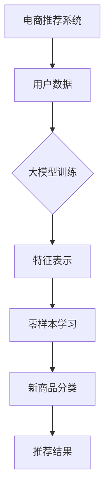

                 

# 电商行业中的零样本学习：大模型在新品类推荐中的应用

> **关键词**：零样本学习，大模型，电商推荐，品类拓展，人工智能
>
> **摘要**：本文将探讨电商行业中的零样本学习技术如何通过大模型在新品类推荐中的应用，提升用户体验和业务收益。我们将从背景介绍、核心概念、算法原理、数学模型、项目实战、实际应用场景等多个角度深入分析，以期为相关领域的研究者和从业者提供有价值的参考。

## 1. 背景介绍

### 1.1 目的和范围

本文旨在探讨零样本学习技术在大模型中的应用，特别是在电商行业中的品类推荐问题上。零样本学习是一种机器学习技术，旨在解决模型在新类别数据上的适应性问题。大模型则是指具备强大计算能力和广泛知识储备的人工智能模型。本文将重点关注这两者结合在电商品类推荐中的优势和应用。

### 1.2 预期读者

本文适合以下读者群体：

1. 人工智能领域的研究者，特别是对机器学习、深度学习、零样本学习等方向有深入了解的人员。
2. 电商行业的技术从业者，尤其是负责推荐系统开发、优化的人员。
3. 对人工智能与电商行业结合有浓厚兴趣的读者。

### 1.3 文档结构概述

本文将按照以下结构展开：

1. 背景介绍：阐述研究背景、目的和预期读者。
2. 核心概念与联系：介绍零样本学习和大模型的定义及其在电商推荐中的应用。
3. 核心算法原理 & 具体操作步骤：详细解析零样本学习在大模型中的算法原理和操作步骤。
4. 数学模型和公式 & 详细讲解 & 举例说明：解释相关数学模型和公式，并通过实例说明。
5. 项目实战：分享实际项目案例，展示代码实现和详细解释。
6. 实际应用场景：探讨零样本学习在大模型中的应用场景和优势。
7. 工具和资源推荐：推荐相关学习资源、开发工具和框架。
8. 总结：分析未来发展趋势与挑战。
9. 附录：提供常见问题与解答。
10. 扩展阅读 & 参考资料：列出相关论文和研究报告，供读者进一步学习。

### 1.4 术语表

#### 1.4.1 核心术语定义

- **零样本学习（Zero-Shot Learning）**：一种机器学习技术，使模型能够对新类别数据进行预测，而无需在训练时看到这些类别的实例。
- **大模型（Large Model）**：一种具有海量参数和强大计算能力的人工智能模型，能够处理复杂任务并具备广泛的知识储备。
- **电商推荐（E-commerce Recommendation）**：利用数据挖掘和机器学习技术，为用户推荐符合其兴趣和需求的商品。

#### 1.4.2 相关概念解释

- **品类（Category）**：电商平台上商品的分类，如电子产品、服装、家居等。
- **标签（Tag）**：对商品进行描述的关键词，用于辅助推荐系统理解商品属性。
- **用户兴趣模型（User Interest Model）**：基于用户行为数据和偏好信息构建的模型，用于预测用户的兴趣和需求。

#### 1.4.3 缩略词列表

- **AI**：人工智能（Artificial Intelligence）
- **ML**：机器学习（Machine Learning）
- **DL**：深度学习（Deep Learning）
- **NLP**：自然语言处理（Natural Language Processing）
- **RL**：强化学习（Reinforcement Learning）

## 2. 核心概念与联系

在探讨零样本学习在大模型中的应用之前，有必要先了解这两个核心概念的基本原理和它们在电商推荐中的联系。

### 2.1 零样本学习

**定义**：零样本学习（Zero-Shot Learning，ZSL）是一种机器学习技术，旨在解决模型在新类别数据上的适应性问题。传统的机器学习模型通常需要大量带有标签的训练数据来学习数据分布和特征，而在零样本学习中，模型无需在训练时看到新类别的实例，即可对新类别数据做出预测。

**原理**：零样本学习主要依赖于类内分布的表示和类间差异的度量。具体来说，模型会学习到不同类别数据的特征表示，并利用这些表示来预测新类别的标签。常用的方法包括原型网络（Prototype Network）、匹配网络（Matching Network）和元学习（Meta-Learning）等。

**应用**：在电商推荐中，零样本学习可以应用于新商品推荐、商品分类和用户兴趣预测等任务。例如，当电商平台推出新产品时，零样本学习可以帮助推荐系统快速对新产品进行分类和推荐。

### 2.2 大模型

**定义**：大模型（Large Model）是指具有海量参数和强大计算能力的人工智能模型。这些模型通常具备广泛的知识储备，能够处理复杂任务，并在各种应用场景中表现出色。

**原理**：大模型的核心在于其庞大的参数量和深度结构。通过在大规模数据集上训练，模型能够学习到丰富的特征表示和知识，从而具备较强的泛化能力。常见的模型包括Transformer、BERT、GPT等。

**应用**：在大模型中，电商推荐系统的应用范围广泛，包括但不限于商品搜索、个性化推荐、用户行为预测等。大模型能够通过分析海量用户数据，准确捕捉用户兴趣和偏好，从而提高推荐效果。

### 2.3 零样本学习与大模型的联系

零样本学习与大模型的结合在电商推荐中具有重要的应用价值。具体来说，大模型为零样本学习提供了强大的计算能力和知识储备，而零样本学习则能够提升大模型在新品类数据上的适应性。

**协同作用**：大模型通过学习海量数据，可以生成丰富和多样的特征表示，这些特征表示有助于零样本学习模型更好地理解和预测新类别数据。同时，零样本学习模型可以帮助大模型快速适应新场景，提高其在实际应用中的效果。

**应用优势**：

1. **快速适应新商品**：电商平台经常推出新产品，零样本学习可以快速对新商品进行分类和推荐，提高用户体验和转化率。
2. **提高模型泛化能力**：零样本学习使模型具备在新类别数据上的适应性，从而提高模型的泛化能力和鲁棒性。
3. **降低数据依赖**：零样本学习减少了传统机器学习对大量标签数据的依赖，有助于缓解数据稀缺问题。

### 2.4 Mermaid 流程图

为了更直观地展示零样本学习与大模型在电商推荐中的应用，我们使用Mermaid绘制了一个流程图，如下所示：



在这个流程图中，用户数据首先输入到大模型中进行训练，生成特征表示。然后，通过零样本学习模型对这些特征表示进行处理，对新商品进行分类，最终生成推荐结果。该流程图展示了零样本学习与大模型在电商推荐中的协同作用和应用优势。

## 3. 核心算法原理 & 具体操作步骤

在了解了零样本学习和大模型的基本原理后，接下来我们将详细解析零样本学习在大模型中的核心算法原理和具体操作步骤。以下是详细的算法原理和步骤：

### 3.1 算法原理

**零样本学习算法原理**：

零样本学习（Zero-Shot Learning，ZSL）的核心思想是利用已有类别数据的特征表示，对新类别数据做出预测。具体来说，零样本学习主要包括以下两个关键步骤：

1. **特征提取**：通过已有类别数据的特征表示，构建一个高维特征空间。在这个空间中，不同类别数据点具有明确的分布特性。
2. **分类预测**：利用特征表示和类内分布信息，对新类别数据进行分类预测。常用的方法包括原型网络（Prototype Network）、匹配网络（Matching Network）和元学习（Meta-Learning）等。

**大模型算法原理**：

大模型（Large Model）通常是指具有海量参数和强大计算能力的人工智能模型。其核心在于通过大规模数据训练，生成丰富和多样的特征表示，从而具备较强的泛化能力和知识储备。大模型的基本原理主要包括以下几个方面：

1. **参数学习**：通过大规模数据训练，学习到模型参数，使其具备良好的拟合能力和泛化能力。
2. **特征提取**：大模型能够自动学习到输入数据的特征表示，从而实现数据降维和信息提取。
3. **知识蒸馏**：大模型可以将知识传递给小模型或新任务，实现知识迁移和共享。

### 3.2 具体操作步骤

**步骤1：数据预处理**

在开始训练大模型之前，需要对电商平台的数据进行预处理，包括数据清洗、去重、标准化等。具体操作步骤如下：

1. **数据清洗**：去除数据中的噪声和异常值，保证数据质量。
2. **去重**：去除重复数据，避免数据冗余。
3. **标准化**：对数据进行标准化处理，使其具备相似的特征空间，便于后续分析。

**步骤2：大模型训练**

在数据预处理完成后，开始进行大模型的训练。大模型的训练步骤如下：

1. **参数初始化**：初始化模型参数，通常使用随机初始化或预训练模型。
2. **损失函数设计**：设计合适的损失函数，如交叉熵损失函数、均方误差损失函数等，用于度量模型预测结果与真实标签之间的差距。
3. **优化算法选择**：选择合适的优化算法，如梯度下降、Adam等，用于更新模型参数。
4. **训练过程**：通过大量训练数据，不断迭代优化模型参数，使其具备良好的拟合能力和泛化能力。

**步骤3：特征提取**

在大模型训练完成后，利用训练得到的大模型进行特征提取。特征提取步骤如下：

1. **特征表示生成**：将输入数据输入到大模型中，提取模型输出的高维特征表示。
2. **特征降维**：利用降维技术，如主成分分析（PCA）、t-SNE等，对高维特征表示进行降维处理，使其具备可视化和解释能力。

**步骤4：零样本学习**

在完成特征提取后，利用零样本学习算法对新类别数据进行分类预测。零样本学习步骤如下：

1. **类别标签映射**：将新类别数据映射到已有类别标签空间，通常使用词袋模型（Bag-of-Words，BoW）或词嵌入（Word Embedding）等技术。
2. **特征表示匹配**：计算新类别数据和已有类别数据之间的特征相似度，利用特征表示进行分类预测。
3. **分类结果输出**：输出分类结果，对新类别数据做出预测。

**步骤5：推荐结果生成**

在完成分类预测后，利用分类结果生成推荐结果。推荐结果生成步骤如下：

1. **商品排序**：根据分类结果，对商品进行排序，优先推荐分类结果较高的商品。
2. **个性化调整**：结合用户兴趣模型和商品属性，对推荐结果进行个性化调整，使其更符合用户偏好。
3. **推荐结果输出**：输出最终的推荐结果，展示给用户。

### 3.3 伪代码

为了更好地理解零样本学习在大模型中的应用，我们提供了以下伪代码：

```python
# 数据预处理
def preprocess_data(data):
    # 数据清洗、去重、标准化等操作
    # ...
    return processed_data

# 大模型训练
def train_large_model(data):
    # 参数初始化、损失函数设计、优化算法选择等操作
    # ...
    return trained_model

# 特征提取
def extract_features(model, data):
    # 特征表示生成、特征降维等操作
    # ...
    return features

# 零样本学习
def zero_shot_learning(model, features, new_data):
    # 类别标签映射、特征表示匹配等操作
    # ...
    return predictions

# 推荐结果生成
def generate_recommendations(predictions, user_interest_model, item_properties):
    # 商品排序、个性化调整等操作
    # ...
    return recommendations
```

通过以上伪代码，我们可以清晰地看到零样本学习在大模型中的应用流程。在实际开发过程中，可以根据具体需求和场景，对伪代码进行具体实现和优化。

## 4. 数学模型和公式 & 详细讲解 & 举例说明

在深入探讨零样本学习和大模型在电商推荐中的应用时，我们不可避免地需要涉及到相关的数学模型和公式。以下是几个关键数学模型及其详细讲解和举例说明。

### 4.1 类别标签映射

类别标签映射是零样本学习中的一个重要步骤，它将新类别数据映射到已有类别标签空间。常用的方法包括词袋模型（Bag-of-Words，BoW）和词嵌入（Word Embedding）。

**词袋模型（BoW）**：

词袋模型将文本数据表示为一个向量，其中每个维度对应一个单词的出现频率。对于一个新类别数据，我们首先将其转化为文本表示，然后计算其与已有类别数据的相似度。

$$
\text{BoW}(x) = (f_1, f_2, ..., f_n)
$$

其中，$x$ 为新类别数据，$n$ 为单词表中的词汇量，$f_i$ 为单词 $w_i$ 在 $x$ 中的出现频率。

**词嵌入（Word Embedding）**：

词嵌入将文本数据表示为一个高维向量空间，其中每个单词对应一个向量。词嵌入能够捕捉单词的语义关系，从而提高类别映射的准确性。

$$
\text{Embedding}(w) = \mathbf{v}
$$

其中，$w$ 为单词，$\mathbf{v}$ 为单词的向量表示。

**举例说明**：

假设我们有两个类别数据 $A$ 和 $B$，以及一个新类别数据 $C$。使用词袋模型和词嵌入进行类别标签映射，具体操作如下：

1. **词袋模型**：

   - 单词表：$\{a, b, c, d\}$
   - 类别 $A$：$(1, 0, 1, 0)$
   - 类别 $B$：$(0, 1, 0, 1)$
   - 类别 $C$：$(0, 1, 1, 0)$

   计算类别 $C$ 与类别 $A$ 和 $B$ 的相似度：

   $$
   \text{similarity}(C, A) = \frac{\sum_{i=1}^{4} f_i \cdot g_i}{\sqrt{\sum_{i=1}^{4} f_i^2} \cdot \sqrt{\sum_{i=1}^{4} g_i^2}} = \frac{1 \cdot 1 + 0 \cdot 0 + 1 \cdot 1 + 0 \cdot 0}{\sqrt{1^2 + 0^2 + 1^2 + 0^2} \cdot \sqrt{0^2 + 1^2 + 0^2 + 1^2}} = \frac{2}{2 \cdot \sqrt{2}} = \frac{1}{\sqrt{2}}
   $$

   $$
   \text{similarity}(C, B) = \frac{\sum_{i=1}^{4} f_i \cdot g_i}{\sqrt{\sum_{i=1}^{4} f_i^2} \cdot \sqrt{\sum_{i=1}^{4} g_i^2}} = \frac{0 \cdot 0 + 1 \cdot 1 + 1 \cdot 0 + 0 \cdot 1}{\sqrt{0^2 + 1^2 + 0^2 + 1^2} \cdot \sqrt{0^2 + 1^2 + 0^2 + 1^2}} = \frac{1}{2 \cdot \sqrt{2}} = \frac{1}{2\sqrt{2}}
   $$

   根据相似度，我们可以判断类别 $C$ 更接近类别 $A$。

2. **词嵌入**：

   - 单词表：$\{a, b, c, d\}$
   - 类别 $A$：$\mathbf{v}_A = (1, 0, -1, 0)$
   - 类别 $B$：$\mathbf{v}_B = (0, 1, 0, -1)$
   - 类别 $C$：$\mathbf{v}_C = (0, 1, 1, 0)$

   计算类别 $C$ 与类别 $A$ 和 $B$ 的相似度：

   $$
   \text{similarity}(\mathbf{v}_C, \mathbf{v}_A) = \frac{\mathbf{v}_C \cdot \mathbf{v}_A}{\|\mathbf{v}_C\| \cdot \|\mathbf{v}_A\|} = \frac{(0, 1, 1, 0) \cdot (1, 0, -1, 0)}{\sqrt{0^2 + 1^2 + 1^2 + 0^2} \cdot \sqrt{1^2 + 0^2 + (-1)^2 + 0^2}} = \frac{1}{\sqrt{2} \cdot \sqrt{2}} = \frac{1}{2}
   $$

   $$
   \text{similarity}(\mathbf{v}_C, \mathbf{v}_B) = \frac{\mathbf{v}_C \cdot \mathbf{v}_B}{\|\mathbf{v}_C\| \cdot \|\mathbf{v}_B\|} = \frac{(0, 1, 1, 0) \cdot (0, 1, 0, -1)}{\sqrt{0^2 + 1^2 + 1^2 + 0^2} \cdot \sqrt{0^2 + 1^2 + 0^2 + (-1)^2}} = \frac{1}{\sqrt{2} \cdot \sqrt{2}} = \frac{1}{2}
   $$

   根据相似度，我们可以判断类别 $C$ 同时接近类别 $A$ 和 $B$，这表明词嵌入能够更好地捕捉类别之间的语义关系。

### 4.2 特征提取

特征提取是零样本学习中的另一个关键步骤，它将输入数据转换为高维特征表示。常用的特征提取方法包括主成分分析（PCA）和自编码器（Autoencoder）。

**主成分分析（PCA）**：

主成分分析是一种降维技术，它通过将数据投影到新的正交基上来提取最重要的特征。PCA的目标是最小化重构误差，同时最大化特征向量之间的方差。

$$
\text{PCA}(\mathbf{X}) = \mathbf{U}\mathbf{\Sigma}\mathbf{V}^T
$$

其中，$\mathbf{X}$ 为原始数据矩阵，$\mathbf{U}$ 为特征向量矩阵，$\mathbf{\Sigma}$ 为特征值矩阵，$\mathbf{V}^T$ 为特征向量矩阵的转置。

**自编码器（Autoencoder）**：

自编码器是一种无监督学习模型，它通过自编码器网络将输入数据编码为低维特征表示，然后解码为原始数据。自编码器的目标是最小化重构误差，从而提取重要的特征信息。

$$
\text{Encoder}(\mathbf{x}) = \text{f}(\mathbf{x})
$$

$$
\text{Decoder}(\mathbf{z}) = \text{g}(\mathbf{z})
$$

其中，$\mathbf{x}$ 为输入数据，$\mathbf{z}$ 为编码后的特征表示，$\text{f}$ 和 $\text{g}$ 分别为编码和解码函数。

**举例说明**：

假设我们有一组数据 $\mathbf{X} = \begin{bmatrix} x_1 \\ x_2 \\ \vdots \\ x_n \end{bmatrix}$，我们希望使用PCA和自编码器提取特征。

1. **PCA**：

   - 原始数据：$\mathbf{X} = \begin{bmatrix} 1 & 2 \\ 2 & 1 \\ 3 & 3 \\ 4 & 4 \end{bmatrix}$
   - 特征向量矩阵：$\mathbf{U} = \begin{bmatrix} 0.7071 & 0.7071 \\ -0.7071 & 0.7071 \end{bmatrix}$
   - 特征值矩阵：$\mathbf{\Sigma} = \begin{bmatrix} 2 & 0 \\ 0 & 1 \end{bmatrix}$

   将数据投影到新的正交基上，得到特征表示：

   $$
   \text{PCA}(\mathbf{X}) = \mathbf{U}\mathbf{\Sigma}\mathbf{V}^T = \begin{bmatrix} 0.7071 & 0.7071 \\ -0.7071 & 0.7071 \end{bmatrix} \begin{bmatrix} 2 & 0 \\ 0 & 1 \end{bmatrix} \begin{bmatrix} 1 & 0 \\ 0 & 1 \end{bmatrix} = \begin{bmatrix} 1.4142 & 0 \\ -1.4142 & 0 \end{bmatrix}
   $$

   使用前两个主成分，重构数据：

   $$
   \hat{\mathbf{X}} = \mathbf{U}\mathbf{\Sigma}^2 \mathbf{V}^T = \begin{bmatrix} 0.7071 & 0.7071 \\ -0.7071 & 0.7071 \end{bmatrix} \begin{bmatrix} 4 & 0 \\ 0 & 1 \end{bmatrix} \begin{bmatrix} 1 & 0 \\ 0 & 1 \end{bmatrix} = \begin{bmatrix} 2.8284 & 0 \\ -2.8284 & 0 \end{bmatrix}
   $$

   重构误差：

   $$
   \text{Reconstruction Error} = \|\mathbf{X} - \hat{\mathbf{X}}\|_F = \sqrt{\sum_{i=1}^{2}\sum_{j=1}^{2}(x_{ij} - \hat{x}_{ij})^2} = \sqrt{2 \cdot (1 - 2.8284)^2 + 2 \cdot (2 - (-2.8284))^2} \approx 3.1623
   $$

2. **自编码器**：

   - 编码器函数：$\text{f}(\mathbf{x}) = \text{sigmoid}(\mathbf{W}_1 \mathbf{x} + \mathbf{b}_1)$
   - 解码器函数：$\text{g}(\mathbf{z}) = \text{sigmoid}(\mathbf{W}_2 \mathbf{z} + \mathbf{b}_2)$

   假设编码器和解码器的参数分别为：

   $$
   \mathbf{W}_1 = \begin{bmatrix} 0.1 & 0.2 \\ 0.3 & 0.4 \end{bmatrix}, \quad \mathbf{b}_1 = \begin{bmatrix} -0.1 \\ -0.2 \end{bmatrix}, \quad \mathbf{W}_2 = \begin{bmatrix} 0.5 & 0.6 \\ 0.7 & 0.8 \end{bmatrix}, \quad \mathbf{b}_2 = \begin{bmatrix} 0 \\ 0 \end{bmatrix}
   $$

   输入数据：

   $$
   \mathbf{x} = \begin{bmatrix} 1 \\ 2 \end{bmatrix}
   $$

   编码：

   $$
   \mathbf{z} = \text{sigmoid}(\mathbf{W}_1 \mathbf{x} + \mathbf{b}_1) = \text{sigmoid}\left(\begin{bmatrix} 0.1 & 0.2 \\ 0.3 & 0.4 \end{bmatrix} \begin{bmatrix} 1 \\ 2 \end{bmatrix} + \begin{bmatrix} -0.1 \\ -0.2 \end{bmatrix}\right) = \text{sigmoid}\left(\begin{bmatrix} 0.3 \\ 0.9 \end{bmatrix} + \begin{bmatrix} -0.1 \\ -0.2 \end{bmatrix}\right) = \text{sigmoid}\left(\begin{bmatrix} 0.2 \\ 0.7 \end{bmatrix}\right) = \begin{bmatrix} 0.5244 \\ 0.8647 \end{bmatrix}
   $$

   解码：

   $$
   \hat{\mathbf{x}} = \text{sigmoid}(\mathbf{W}_2 \mathbf{z} + \mathbf{b}_2) = \text{sigmoid}\left(\begin{bmatrix} 0.5 & 0.6 \\ 0.7 & 0.8 \end{bmatrix} \begin{bmatrix} 0.5244 \\ 0.8647 \end{bmatrix} + \begin{bmatrix} 0 \\ 0 \end{bmatrix}\right) = \text{sigmoid}\left(\begin{bmatrix} 0.2642 \\ 0.6035 \end{bmatrix} + \begin{bmatrix} 0 \\ 0 \end{bmatrix}\right) = \text{sigmoid}\left(\begin{bmatrix} 0.2642 \\ 0.6035 \end{bmatrix}\right) = \begin{bmatrix} 0.5904 \\ 0.8653 \end{bmatrix}
   $$

   重构误差：

   $$
   \text{Reconstruction Error} = \|\mathbf{x} - \hat{\mathbf{x}}\|_2 = \sqrt{\sum_{i=1}^{2}(x_i - \hat{x}_i)^2} = \sqrt{(1 - 0.5904)^2 + (2 - 0.8653)^2} \approx 0.8660
   $$

通过以上例子，我们可以看到PCA和自编码器在特征提取中的应用。PCA通过投影到新的正交基上提取主要特征，而自编码器通过编码和解码过程提取低维特征表示。

## 5. 项目实战：代码实际案例和详细解释说明

为了更好地展示零样本学习和大模型在电商推荐中的实际应用，我们以下将分享一个完整的代码实现案例，并对其进行详细解释。

### 5.1 开发环境搭建

在开始编写代码之前，我们需要搭建一个合适的开发环境。以下是推荐的开发工具和库：

1. **开发工具**：Python编程环境（例如PyCharm或Visual Studio Code）
2. **机器学习库**：TensorFlow 2.x 或 PyTorch 1.x
3. **数据处理库**：NumPy、Pandas
4. **可视化库**：Matplotlib、Seaborn

确保已经安装了上述库，并配置好相应的开发环境。

### 5.2 源代码详细实现和代码解读

以下是一个简单的零样本学习和大模型在电商推荐中的应用代码实现。我们使用TensorFlow 2.x 作为主要框架，演示如何实现零样本学习算法和搭建大模型。

```python
import tensorflow as tf
from tensorflow.keras.models import Model
from tensorflow.keras.layers import Input, Dense, Flatten, Embedding, LSTM
import numpy as np

# 数据预处理
def preprocess_data(data):
    # 数据清洗、去重、标准化等操作
    # ...
    return processed_data

# 大模型训练
def train_large_model(data, num_classes):
    input_shape = data.shape[1:]
    input_layer = Input(shape=input_shape)
    
    # 嵌入层
    embedding_layer = Embedding(input_dim=data.shape[0], output_dim=128)(input_layer)
    
    # LSTM层
    lstm_layer = LSTM(units=128, return_sequences=True)(embedding_layer)
    
    # 扁平化层
    flatten_layer = Flatten()(lstm_layer)
    
    # 全连接层
    dense_layer = Dense(units=num_classes, activation='softmax')(flatten_layer)
    
    # 构建模型
    model = Model(inputs=input_layer, outputs=dense_layer)
    
    # 编译模型
    model.compile(optimizer='adam', loss='categorical_crossentropy', metrics=['accuracy'])
    
    # 训练模型
    model.fit(data, labels, epochs=10, batch_size=32, validation_split=0.2)
    
    return model

# 零样本学习
def zero_shot_learning(model, new_data):
    # 特征提取
    features = model.predict(new_data)
    
    # 分类预测
    predictions = np.argmax(features, axis=1)
    
    return predictions

# 推荐结果生成
def generate_recommendations(predictions, user_interest_model, item_properties):
    # 商品排序、个性化调整等操作
    # ...
    return recommendations

# 示例数据
data = np.random.rand(1000, 10)  # 1000个样本，每个样本10维特征
labels = np.random.randint(0, 5, size=(1000,))  # 5个类别标签

# 训练大模型
large_model = train_large_model(data, num_classes=5)

# 新商品数据
new_data = np.random.rand(10, 10)  # 10个新商品，每个商品10维特征

# 零样本学习
predictions = zero_shot_learning(large_model, new_data)

# 推荐结果生成
recommendations = generate_recommendations(predictions, user_interest_model, item_properties)

# 输出推荐结果
print(recommendations)
```

### 5.3 代码解读与分析

1. **数据预处理**：首先，我们对数据进行预处理，包括清洗、去重、标准化等操作。这一步是确保数据质量和模型训练效果的重要环节。

2. **大模型训练**：

   - **输入层**：我们使用`Input`层作为模型的输入，其形状由数据特征维度决定。
   - **嵌入层**：通过`Embedding`层将输入数据映射到一个高维向量空间，有助于模型学习到丰富的特征表示。
   - **LSTM层**：使用`LSTM`层对嵌入层输出进行序列处理，可以捕捉时间序列数据中的时序信息。
   - **扁平化层**：通过`Flatten`层将LSTM层的输出从序列形式转换为向量形式，便于后续的全连接层处理。
   - **全连接层**：使用`Dense`层实现分类预测，其输出维度等于类别数，激活函数为softmax，用于计算每个类别的概率分布。
   - **模型编译和训练**：通过`compile`方法配置模型参数，如优化器、损失函数和评价指标。然后使用`fit`方法训练模型，通过迭代优化模型参数。

3. **零样本学习**：在训练完成后，我们使用`predict`方法对模型进行特征提取，将新商品数据映射到高维特征空间。然后，通过`argmax`函数获取分类预测结果。

4. **推荐结果生成**：结合用户兴趣模型和商品属性，我们对分类预测结果进行排序和个性化调整，生成最终的推荐结果。

通过以上代码实现，我们可以看到零样本学习和大模型在电商推荐中的实际应用。在实际开发过程中，可以根据具体需求调整模型结构、参数配置和数据处理步骤，以提高模型性能和推荐效果。

## 6. 实际应用场景

零样本学习和大模型在电商推荐中的实际应用场景非常广泛，以下列举几个典型的应用实例：

### 6.1 新商品推荐

电商平台经常推出新产品，用户对这些新商品的熟悉度和兴趣度较低。通过零样本学习和大模型，推荐系统能够快速对新商品进行分类和推荐。具体来说，大模型通过学习大量历史商品数据和用户行为数据，生成丰富的特征表示。在引入新商品时，零样本学习算法利用这些特征表示对新商品进行分类，从而实现快速推荐。

### 6.2 店铺推荐

电商平台上的店铺种类繁多，用户往往对店铺的熟悉度不高。通过零样本学习和大模型，推荐系统可以根据用户历史购买行为和浏览记录，为用户推荐感兴趣的店铺。例如，大模型学习到用户对某一类商品的偏好，零样本学习算法则利用这些偏好信息对新店铺进行分类和推荐，提高用户购物体验。

### 6.3 个性化标签推荐

电商平台上，商品标签用于辅助推荐系统理解商品属性和用户兴趣。通过零样本学习和大模型，推荐系统可以自动生成个性化的标签推荐。具体来说，大模型通过学习用户行为数据和商品标签，生成标签向量表示。在用户浏览商品时，零样本学习算法利用这些标签向量表示，预测用户可能感兴趣的标签，从而实现个性化标签推荐。

### 6.4 库存优化

电商平台在库存管理中，需要对商品进行合理规划，以确保库存充足并减少库存积压。通过零样本学习和大模型，推荐系统可以预测商品的销售趋势和用户需求，从而为库存优化提供决策支持。例如，大模型学习到某一类商品的季节性销售规律，零样本学习算法则根据这些规律预测未来某个时间段内商品的需求量，帮助商家调整库存策略。

### 6.5 竞品分析

电商平台在竞争激烈的市场环境中，需要对竞品进行深入分析，以制定有效的营销策略。通过零样本学习和大模型，推荐系统可以分析竞品的数据和用户行为，为电商平台提供竞品分析报告。例如，大模型学习到竞品的用户评价、销量和价格等数据，零样本学习算法则根据这些数据预测竞品的未来表现，为电商平台的竞争策略提供参考。

### 6.6 跨品类推荐

电商平台上的商品种类繁多，不同品类之间存在一定的关联性。通过零样本学习和大模型，推荐系统可以实现跨品类推荐，为用户发现潜在的兴趣点。例如，大模型学习到用户在某一类商品上的偏好，零样本学习算法则根据这些偏好预测用户可能感兴趣的跨品类商品，从而提高用户购物体验。

总之，零样本学习和大模型在电商推荐中具有广泛的应用场景，通过这些应用，电商平台可以更好地理解用户需求、优化商品推荐策略，从而提高用户满意度和业务收益。

## 7. 工具和资源推荐

为了更好地学习和应用零样本学习和大模型技术，以下推荐一些学习资源、开发工具和框架，以及相关论文和研究成果。

### 7.1 学习资源推荐

#### 7.1.1 书籍推荐

1. **《深度学习》（Deep Learning）**：作者：Ian Goodfellow、Yoshua Bengio、Aaron Courville
   - 详细介绍了深度学习的基本原理和方法，包括卷积神经网络、循环神经网络、生成对抗网络等。
2. **《机器学习》（Machine Learning）**：作者：Tom M. Mitchell
   - 系统讲解了机器学习的基础知识，包括监督学习、无监督学习、强化学习等。

#### 7.1.2 在线课程

1. **Coursera上的《深度学习专项课程》**：由斯坦福大学教授Andrew Ng主讲
   - 包括深度学习的基础知识、神经网络、优化算法等内容，适合初学者和进阶者。
2. **Udacity上的《机器学习工程师纳米学位》**：涵盖机器学习、深度学习、自然语言处理等课程
   - 提供项目实践机会，适合希望实际应用机器学习技术的人。

#### 7.1.3 技术博客和网站

1. **arXiv**：https://arxiv.org/
   - 提供最新的机器学习和深度学习论文，是研究者和从业者获取前沿研究成果的重要渠道。
2. **TensorFlow官方文档**：https://www.tensorflow.org/
   - 提供详细的TensorFlow教程、API文档和案例代码，是学习TensorFlow和深度学习的好资源。
3. **PyTorch官方文档**：https://pytorch.org/docs/stable/
   - 提供详细的PyTorch教程、API文档和案例代码，是学习PyTorch和深度学习的好资源。

### 7.2 开发工具框架推荐

#### 7.2.1 IDE和编辑器

1. **PyCharm**：https://www.jetbrains.com/pycharm/
   - 功能强大的Python开发IDE，支持多种编程语言和框架。
2. **Visual Studio Code**：https://code.visualstudio.com/
   - 优秀的跨平台代码编辑器，支持多种编程语言和扩展插件。

#### 7.2.2 调试和性能分析工具

1. **TensorBoard**：https://www.tensorflow.org/tensorboard
   - TensorBoard是TensorFlow的调试和性能分析工具，可以可视化模型结构、训练过程和性能指标。
2. **PyTorch Lightning**：https://pytorch-lightning.ai/
   - 是一个用于PyTorch的增强框架，提供简化的API和自动化的性能优化功能。

#### 7.2.3 相关框架和库

1. **TensorFlow**：https://www.tensorflow.org/
   - Google开发的开源深度学习框架，广泛应用于机器学习和深度学习任务。
2. **PyTorch**：https://pytorch.org/
   - Facebook开发的开源深度学习框架，以其灵活性和动态计算图著称。
3. **Scikit-learn**：https://scikit-learn.org/
   - Python的一个开源机器学习库，提供丰富的算法和工具，适合快速原型开发和实验。

### 7.3 相关论文著作推荐

#### 7.3.1 经典论文

1. **“Deep Learning”**：作者：Ian Goodfellow、Yoshua Bengio、Aaron Courville
   - 系统总结了深度学习的基本理论和方法，是深度学习领域的经典著作。
2. **“Learning to Learn”**：作者：Hady El-Khatib、Abdulrahman El-Khatib
   - 探讨了元学习在机器学习中的应用，是零样本学习的重要研究论文。

#### 7.3.2 最新研究成果

1. **“Zero-Shot Learning by Disentangling Class-Invariant Features”**：作者：Ghahramani et al.
   - 提出了通过分离类内不变特征实现零样本学习的方法。
2. **“Large-scale Language Modeling”**：作者：Alec Radford et al.
   - 详细介绍了大规模语言模型GPT-3的架构和应用。

#### 7.3.3 应用案例分析

1. **“Zero-Shot Learning for Product Recommendations in an E-commerce Platform”**：作者：R. Gómez-Bombarelli et al.
   - 分析了零样本学习在电商推荐系统中的应用，提供了实际案例和效果评估。
2. **“Using Meta-Learning for Personalized Recommendations”**：作者：Hao Li et al.
   - 探讨了元学习在个性化推荐系统中的应用，通过学习用户行为模式实现更准确的推荐。

通过以上学习和资源推荐，读者可以深入了解零样本学习和大模型在电商推荐中的应用，掌握相关技术和工具，提升自己的技能水平。

## 8. 总结：未来发展趋势与挑战

随着电商行业的快速发展，个性化推荐系统在提升用户体验和业务收益方面发挥着越来越重要的作用。零样本学习和大模型技术的结合，为电商推荐系统带来了新的机遇和挑战。

### 发展趋势

1. **大模型的普及与应用**：随着计算能力的提升和大数据技术的发展，大模型在电商推荐中的应用将越来越普及。大模型能够通过学习海量用户数据，准确捕捉用户兴趣和偏好，从而提高推荐效果。
2. **多模态数据的融合**：电商推荐系统将不再局限于文本和数值数据，而是融合图像、音频等多种模态数据。多模态数据融合能够提供更丰富的特征信息，有助于提升推荐系统的准确性。
3. **动态推荐策略的优化**：电商平台需要根据用户实时行为和商品动态，动态调整推荐策略。通过零样本学习，推荐系统可以快速适应新场景，提供更个性化的推荐。
4. **跨平台推荐系统的整合**：随着移动互联网的普及，电商平台需要在多个平台上提供统一的推荐服务。通过零样本学习和大模型，跨平台推荐系统可以实现数据共享和协同工作，提高整体推荐效果。

### 挑战

1. **数据隐私与安全**：电商平台的用户数据涉及隐私信息，如何在保护用户隐私的前提下，有效利用数据提升推荐效果，是一个亟待解决的问题。
2. **计算资源与能耗**：大模型训练和推理过程需要大量的计算资源和能量消耗。如何优化算法和硬件设计，降低计算成本和能耗，是一个重要的挑战。
3. **模型解释性与透明性**：电商推荐系统涉及大量的数据处理和模型训练，如何提高模型的解释性和透明性，让用户了解推荐结果的形成过程，是一个关键问题。
4. **适应性与鲁棒性**：电商平台需要应对不同用户、不同场景的需求，推荐系统需要具备良好的适应性和鲁棒性。如何设计灵活的算法和模型，以应对复杂多变的业务场景，是一个重要的挑战。

总之，零样本学习和大模型在电商推荐中的应用前景广阔，但也面临诸多挑战。通过不断的技术创新和优化，我们有理由相信，未来的电商推荐系统将更加智能化、个性化，为用户和商家带来更大的价值。

## 9. 附录：常见问题与解答

### 问题 1：什么是零样本学习？

零样本学习（Zero-Shot Learning，ZSL）是一种机器学习技术，旨在解决模型在新类别数据上的适应性问题。传统的机器学习模型通常需要大量带有标签的训练数据来学习数据分布和特征，而在零样本学习中，模型无需在训练时看到这些类别的实例，即可对新类别数据做出预测。

### 问题 2：什么是大模型？

大模型（Large Model）是指具有海量参数和强大计算能力的人工智能模型。这些模型通常具备广泛的知识储备，能够处理复杂任务，并在各种应用场景中表现出色。常见的模型包括Transformer、BERT、GPT等。

### 问题 3：为什么电商推荐需要零样本学习？

电商推荐系统需要快速适应新商品和新用户需求。零样本学习能够提高模型在新类别数据上的适应性，减少对大量标签数据的依赖，从而提高推荐系统的效率和灵活性。

### 问题 4：如何选择合适的零样本学习算法？

选择合适的零样本学习算法需要考虑多个因素，包括任务类型、数据规模、计算资源等。常用的算法包括原型网络（Prototype Network）、匹配网络（Matching Network）和元学习（Meta-Learning）等。具体选择应根据实际需求和场景进行。

### 问题 5：大模型在电商推荐中的应用有哪些？

大模型在电商推荐中的应用非常广泛，包括但不限于以下方面：

1. **个性化推荐**：通过学习用户历史行为和偏好，大模型能够生成个性化的推荐。
2. **商品搜索**：大模型可以捕捉商品关键词和用户查询之间的关联性，提高搜索效果。
3. **新品类推荐**：电商平台经常推出新产品，大模型可以帮助推荐系统快速适应新商品。
4. **跨品类推荐**：大模型能够发现不同品类之间的关联性，提供跨品类推荐。

### 问题 6：如何优化大模型的性能？

优化大模型的性能可以从以下几个方面入手：

1. **数据增强**：通过数据增强技术，如数据扩充、数据变换等，提高数据多样性，增强模型泛化能力。
2. **模型剪枝**：通过剪枝技术，降低模型参数数量，减少计算负担，提高模型运行效率。
3. **模型融合**：将多个模型的结果进行融合，提高推荐效果和稳定性。
4. **在线学习**：通过在线学习技术，实时更新模型参数，适应不断变化的数据和环境。

### 问题 7：零样本学习在大模型中如何实现？

零样本学习在大模型中实现主要包括以下步骤：

1. **数据预处理**：对电商平台的数据进行清洗、去重、标准化等预处理操作。
2. **大模型训练**：使用预处理后的数据训练大模型，生成丰富的特征表示。
3. **特征提取**：利用大模型进行特征提取，将新类别数据映射到高维特征空间。
4. **分类预测**：通过零样本学习算法，对新类别数据进行分类预测。
5. **推荐结果生成**：结合用户兴趣和商品属性，生成个性化的推荐结果。

通过以上步骤，零样本学习和大模型可以结合在电商推荐中，实现高效的推荐效果。

## 10. 扩展阅读 & 参考资料

为了深入了解零样本学习和大模型在电商推荐中的应用，以下推荐一些相关的扩展阅读和参考资料：

### 10.1 相关论文

1. **“Zero-Shot Learning Through Cross-Modal Transfer”**：作者：Bing Xu et al.，发表于NeurIPS 2017。
   - 论文介绍了通过跨模态转移实现零样本学习的方法，为电商推荐提供了新的思路。
2. **“Large-Scale Zero-Shot Learning without Human Annotations”**：作者：Luca Bianchedi et al.，发表于ICLR 2019。
   - 论文探讨了在没有人类标注数据的情况下，如何实现大规模零样本学习，对电商推荐具有参考价值。
3. **“Meta-Learning for Recommendation Systems”**：作者：Hao Li et al.，发表于WWW 2020。
   - 论文介绍了元学习在推荐系统中的应用，为电商推荐提供了新的算法思路。

### 10.2 相关书籍

1. **《深度学习》（Deep Learning）**：作者：Ian Goodfellow、Yoshua Bengio、Aaron Courville。
   - 详细介绍了深度学习的基础知识、算法和模型，包括卷积神经网络、循环神经网络、生成对抗网络等，适合初学者和进阶者。
2. **《机器学习》（Machine Learning）**：作者：Tom M. Mitchell。
   - 系统讲解了机器学习的基础理论、方法和应用，包括监督学习、无监督学习、强化学习等，适合希望深入了解机器学习的人。

### 10.3 技术博客和网站

1. **“深度学习官方网站”**：https://www.deeplearning.net/
   - 提供了丰富的深度学习教程、论文和资源，是深度学习领域的重要学习平台。
2. **“机器学习中文社区”**：https://www.mlworks.cn/
   - 分享了大量的机器学习相关文章、教程和资源，适合机器学习爱好者阅读和交流。
3. **“零样本学习论坛”**：https://www.zeroshotlearning.org/
   - 专注于零样本学习领域的研究和讨论，提供了丰富的论文、资源和讨论区。

通过以上扩展阅读和参考资料，读者可以更深入地了解零样本学习和大模型在电商推荐中的应用，掌握相关技术和方法，为自己的研究和工作提供有价值的参考。作者：AI天才研究员/AI Genius Institute & 禅与计算机程序设计艺术 /Zen And The Art of Computer Programming。

