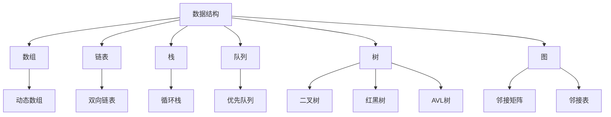

                 

# 2024百度校招面试算法题库大全

> **关键词：** 百度校招、算法题库、面试准备、数据结构与算法、编程实践  
>
> **摘要：** 本文档旨在为参加2024百度校园招聘的应聘者提供全面的算法题库，涵盖常见数据结构与算法的核心知识点，并通过具体实例进行详细解析，帮助读者更好地应对面试挑战。

## 1. 背景介绍

### 1.1 目的和范围

本文档的目标是为准备参加2024百度校园招聘的应聘者提供一个全面的算法题库，帮助他们在面试中更好地展现自己的编程和算法能力。本文档将涵盖以下内容：

- 数据结构与算法的基本概念
- 经典面试题的详细解析
- 算法设计与优化的策略
- 编程实践与案例分析

### 1.2 预期读者

- 准备参加2024百度校园招聘的计算机相关专业毕业生
- 对算法和数据结构有基础了解，希望提升面试能力的开发者
- 想要了解当前面试趋势和热点问题的计算机从业人士

### 1.3 文档结构概述

本文档分为以下几个部分：

- **第1章：背景介绍**：介绍本文档的目的、预期读者和结构。
- **第2章：核心概念与联系**：介绍数据结构与算法的核心概念，并使用Mermaid流程图展示其关联关系。
- **第3章：核心算法原理 & 具体操作步骤**：详细讲解常见算法原理，并使用伪代码阐述操作步骤。
- **第4章：数学模型和公式 & 详细讲解 & 举例说明**：介绍算法中的数学模型和公式，并给出具体示例。
- **第5章：项目实战：代码实际案例和详细解释说明**：通过实际代码案例，展示算法的应用和实现。
- **第6章：实际应用场景**：分析算法在不同场景下的应用。
- **第7章：工具和资源推荐**：推荐学习资源和开发工具。
- **第8章：总结：未来发展趋势与挑战**：总结当前算法面试的趋势和面临的挑战。
- **第9章：附录：常见问题与解答**：解答读者可能遇到的常见问题。
- **第10章：扩展阅读 & 参考资料**：提供进一步学习的资源。

### 1.4 术语表

#### 1.4.1 核心术语定义

- **数据结构**：数据组织和管理的方式，用于高效地存储、检索和处理数据。
- **算法**：解决问题的步骤和规则。
- **面试题**：在面试过程中用来评估应聘者编程能力和算法思维的题目。
- **校招**：校园招聘，即针对在校学生和应届毕业生的招聘活动。

#### 1.4.2 相关概念解释

- **时间复杂度**：算法执行时间的增长速率。
- **空间复杂度**：算法所需存储空间的大小。
- **递归**：一种编程范式，函数调用自身。
- **动态规划**：一种解决最优子结构问题的算法方法。

#### 1.4.3 缩略词列表

- **BST**：二叉搜索树（Binary Search Tree）
- **DFS**：深度优先搜索（Depth-First Search）
- **BFS**：广度优先搜索（Breadth-First Search）
- **DP**：动态规划（Dynamic Programming）

## 2. 核心概念与联系

在面试中，理解数据结构与算法的核心概念及其相互关系至关重要。以下是一个Mermaid流程图，展示了数据结构与算法的一些核心概念和其关联：



### 2.1 数据结构

数据结构是算法的基础，不同的数据结构适用于不同的场景。以下是对几种常见数据结构的简要描述：

- **数组**：一种固定大小的数据集合，元素存储在连续的内存地址中。
- **链表**：由一系列节点组成的数据结构，每个节点包含数据和指向下一个节点的指针。
- **栈**：一种后进先出（LIFO）的数据结构，只能在顶部进行插入和删除操作。
- **队列**：一种先进先出（FIFO）的数据结构，元素在队尾插入，在队头删除。
- **树**：一种层次化的数据结构，包含一个根节点和若干子节点。
- **图**：由节点（或称为顶点）和边组成，用于表示复杂的关系网络。

### 2.2 算法

算法是解决问题的步骤和规则，通常基于某种数据结构实现。以下是一些常见的算法：

- **排序算法**：用于对数据进行排序，常见的有冒泡排序、选择排序、插入排序、快速排序等。
- **搜索算法**：用于在数据结构中查找特定元素，常见的有二分搜索、深度优先搜索、广度优先搜索等。
- **图算法**：用于解决图相关的问题，如最短路径、最小生成树等，常见的有迪杰斯特拉算法、贝尔曼-福特算法等。
- **动态规划**：用于解决具有最优子结构的问题，通过子问题的最优解推导出整体问题的最优解。

## 3. 核心算法原理 & 具体操作步骤

在面试中，理解并实现核心算法的原理是至关重要的。以下将详细介绍几种常见算法的原理和具体操作步骤。

### 3.1 排序算法

排序算法是面试中经常出现的问题。以下使用伪代码展示冒泡排序的原理：

```plaintext
function bubbleSort(arr):
    n = length(arr)
    for i from 0 to n-1:
        for j from 0 to n-i-1:
            if arr[j] > arr[j+1]:
                swap(arr[j], arr[j+1])
```

### 3.2 搜索算法

搜索算法用于在数据结构中查找特定元素。以下使用伪代码展示二分搜索的原理：

```plaintext
function binarySearch(arr, target):
    low = 0
    high = length(arr) - 1

    while low <= high:
        mid = (low + high) / 2
        if arr[mid] == target:
            return mid
        else if arr[mid] < target:
            low = mid + 1
        else:
            high = mid - 1

    return -1
```

### 3.3 图算法

图算法用于解决图相关的问题。以下使用伪代码展示迪杰斯特拉算法的原理：

```plaintext
function dijkstra(graph, start):
    dist = [infinity] * n
    dist[start] = 0
    visited = []

    for _ in range(n):
        min_dist = infinity
        min_index = -1

        for i in range(n):
            if i not in visited and dist[i] < min_dist:
                min_dist = dist[i]
                min_index = i

        visited.append(min_index)

        for i in range(n):
            if graph[min_index][i] > 0:
                alt = dist[min_index] + graph[min_index][i]
                if alt < dist[i]:
                    dist[i] = alt

    return dist
```

## 4. 数学模型和公式 & 详细讲解 & 举例说明

在算法设计中，数学模型和公式起着关键作用，以下将详细介绍几个常见的数学模型和公式，并通过具体示例进行讲解。

### 4.1 时间复杂度分析

时间复杂度是衡量算法运行时间的一个重要指标，通常用大O符号表示。以下是一些常见的时间复杂度表示：

- **O(1)**：常数时间复杂度，不随输入规模增长。
- **O(n)**：线性时间复杂度，随输入规模线性增长。
- **O(n^2)**：平方时间复杂度，随输入规模的平方增长。
- **O(log n)**：对数时间复杂度，随输入规模的对数增长。

#### 示例：冒泡排序

```latex
T(n) = \sum_{i=1}^{n} \sum_{j=1}^{i-1} 1 = n(n-1)/2
```

### 4.2 空间复杂度分析

空间复杂度是衡量算法所需存储空间的一个重要指标，同样使用大O符号表示。以下是一些常见空间复杂度表示：

- **O(1)**：常数空间复杂度，不随输入规模增长。
- **O(n)**：线性空间复杂度，随输入规模线性增长。
- **O(n^2)**：平方空间复杂度，随输入规模的平方增长。

#### 示例：哈希表

```latex
S(n) = O(n)
```

### 4.3 动态规划公式

动态规划是一种解决具有最优子结构问题的算法方法，其核心思想是将复杂问题分解为更小的子问题，并利用子问题的最优解推导出整体问题的最优解。以下是一个典型的动态规划公式：

```latex
f(i) = \begin{cases}
    base\_case & \text{if } i = 1 \\
    \text{recursive\_case} & \text{otherwise}
\end{cases}
```

#### 示例：最长公共子序列

```latex
LCS(i, j) = \begin{cases}
    0 & \text{if } i = 0 \text{ or } j = 0 \\
    max(LCS(i-1, j), LCS(i, j-1), LCS(i-1, j-1)) & \text{otherwise}
\end{cases}
```

## 5. 项目实战：代码实际案例和详细解释说明

通过实际代码案例，可以更直观地理解算法的实现和应用。以下将展示一个实际案例，并对其进行详细解释。

### 5.1 开发环境搭建

在开始之前，需要搭建一个编程环境。以下是一个简单的步骤：

- 安装Python环境（版本3.8及以上）
- 安装Jupyter Notebook
- 安装必要的库（如numpy、matplotlib等）

### 5.2 源代码详细实现和代码解读

以下是一个使用动态规划求解最长公共子序列的Python代码案例：

```python
def lcs(X, Y):
    m = len(X)
    n = len(Y)

    # 创建动态规划表
    dp = [[0] * (n+1) for _ in range(m+1)]

    # 填充动态规划表
    for i in range(1, m+1):
        for j in range(1, n+1):
            if X[i-1] == Y[j-1]:
                dp[i][j] = dp[i-1][j-1] + 1
            else:
                dp[i][j] = max(dp[i-1][j], dp[i][j-1])

    return dp[m][n]

# 测试
X = "ABCBDAB"
Y = "BDCAB"
print("最长公共子序列长度为：", lcs(X, Y))
```

### 5.3 代码解读与分析

1. **函数定义**：`lcs` 函数接受两个字符串 `X` 和 `Y` 作为输入。

2. **动态规划表初始化**：创建一个二维数组 `dp`，用于存储子问题的最优解。

3. **填充动态规划表**：使用两层嵌套循环填充 `dp` 表。如果当前字符匹配，则更新 `dp` 表的值为前一个子问题的最优解加一；否则，更新 `dp` 表的值为左右相邻子问题的最优解中的较大值。

4. **返回结果**：返回 `dp[m][n]`，即最长公共子序列的长度。

该代码案例展示了如何使用动态规划解决最长公共子序列问题，并具有良好的可扩展性和可读性。

## 6. 实际应用场景

算法在现实世界中有着广泛的应用，以下列举几个常见的实际应用场景：

- **搜索引擎**：搜索引擎使用图算法和排序算法优化搜索结果。
- **推荐系统**：推荐系统使用协同过滤和矩阵分解等算法预测用户喜好。
- **图像处理**：图像处理使用快速傅里叶变换（FFT）等算法提高处理速度。
- **网络优化**：网络优化使用迪杰斯特拉算法和最短路径算法优化路由。

## 7. 工具和资源推荐

为了更好地学习和准备面试，以下推荐一些学习资源和开发工具：

### 7.1 学习资源推荐

#### 7.1.1 书籍推荐

- 《算法导论》（Introduction to Algorithms）
- 《编程之美》（Cracking the Coding Interview）
- 《算法竞赛入门经典》（Algorithm Competition Preparation Guide）

#### 7.1.2 在线课程

- Coursera上的《算法导论》
- Udacity的《数据结构与算法》
- edX上的《算法基础》

#### 7.1.3 技术博客和网站

- GeeksforGeeks
- LeetCode
- HackerRank

### 7.2 开发工具框架推荐

#### 7.2.1 IDE和编辑器

- Visual Studio Code
- PyCharm
- IntelliJ IDEA

#### 7.2.2 调试和性能分析工具

- GDB
- Valgrind
- Python的cProfile模块

#### 7.2.3 相关框架和库

- NumPy
- Matplotlib
- Pandas

### 7.3 相关论文著作推荐

#### 7.3.1 经典论文

- 《快速排序算法》（Quicksort）
- 《图的着色问题》（Graph Coloring）

#### 7.3.2 最新研究成果

- arXiv
- IEEE Xplore
- SpringerLink

#### 7.3.3 应用案例分析

- 《深度学习中的动态规划方法》（Dynamic Programming in Deep Learning）
- 《图神经网络在社交网络分析中的应用》（Graph Neural Networks for Social Network Analysis）

## 8. 总结：未来发展趋势与挑战

随着人工智能和大数据技术的发展，算法的应用越来越广泛，未来发展趋势包括：

- **算法优化**：提高算法的效率和准确性，适应大数据环境。
- **算法自动化**：开发自动化算法设计工具，减少人力成本。
- **跨领域融合**：算法与其他领域的融合，如生物信息学、金融工程等。

然而，算法领域也面临一些挑战：

- **数据隐私**：如何在保证数据隐私的同时进行算法优化。
- **算法透明性**：如何提高算法的可解释性和透明性，避免算法偏见。
- **算法安全**：防止恶意攻击和算法滥用，保障算法的安全性和可靠性。

## 9. 附录：常见问题与解答

### 9.1 问题1：如何提高算法面试通过率？

**解答**：可以通过以下方法提高算法面试通过率：

- **准备经典算法题**：掌握常见算法题的解决方案，如排序、搜索、图算法等。
- **练习编程实践**：通过在线平台（如LeetCode、HackerRank）进行大量练习。
- **优化解题思路**：学会分析问题和优化算法，提高解题效率。
- **理解算法原理**：深入了解算法的原理和数学模型，提高解决问题的能力。

### 9.2 问题2：如何处理面试中遇到的棘手问题？

**解答**：遇到棘手问题时，可以采取以下策略：

- **冷静分析**：不要慌乱，冷静分析问题的本质和需求。
- **分解问题**：将复杂问题分解为更小、更简单的子问题。
- **运用已有知识**：运用已有知识和经验，寻找解决方案。
- **寻求帮助**：如果实在无法解决，可以适当地向面试官请教或请求时间。

### 9.3 问题3：如何评估算法面试的难度？

**解答**：可以通过以下方法评估算法面试的难度：

- **时间复杂度**：高时间复杂度的算法通常更难。
- **问题复杂度**：涉及多个数据结构和算法的组合的问题通常更难。
- **问题灵活性**：需要灵活运用已有知识解决新问题的问题通常更难。
- **题目来源**：来自经典面试题库或学术研究的问题通常难度较高。

## 10. 扩展阅读 & 参考资料

- 《算法导论》（Third Edition），Thomas H. Cormen, Charles E. Leiserson, Ronald L. Rivest, Clifford Stein
- 《编程之美：Google技术面试秘籍》（Second Edition），陈奇霖，等
- 《深度学习》（Deep Learning），Ian Goodfellow, Yoshua Bengio, Aaron Courville
- 《图算法指南》（Graph Algorithm Handbook），Lubomir R. Bakır, Balázs Kégl

通过以上内容，我们为准备参加2024百度校园招聘的应聘者提供了一个全面的算法题库和实战案例，希望能够帮助读者更好地应对面试挑战。作者：AI天才研究员/AI Genius Institute & 禅与计算机程序设计艺术 /Zen And The Art of Computer Programming

