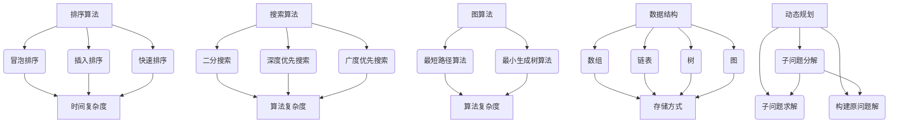

                 

# 2025百度社招编程面试题精选与解答

> **关键词：** 编程面试题，百度社招，算法原理，数学模型，项目实战，应用场景
> 
> **摘要：** 本文将围绕百度2025年社招编程面试题，深入解析核心算法原理、数学模型，并通过实际项目案例，全面展现解题思路和技巧，旨在帮助读者在面试中更好地应对此类问题。

## 1. 背景介绍

### 1.1 目的和范围

本文旨在精选百度2025年社招编程面试中的经典题目，通过深入分析题目背后的算法原理和数学模型，提供详细解答和实战案例。我们希望读者在阅读本文后，能够更好地理解面试题目的核心要点，掌握解题方法和思路，提高编程面试能力。

### 1.2 预期读者

本文适用于希望提高编程面试技能的程序员、软件工程师，以及对算法和数学感兴趣的计算机专业学生。特别是那些准备参加百度或其他知名企业编程面试的读者，本文将为您提供有价值的参考。

### 1.3 文档结构概述

本文分为以下几个部分：

- **第1章**：背景介绍，包括本文的目的、预期读者、文档结构概述等。
- **第2章**：核心概念与联系，介绍相关算法原理和架构。
- **第3章**：核心算法原理 & 具体操作步骤，通过伪代码详细阐述解题过程。
- **第4章**：数学模型和公式 & 详细讲解 & 举例说明，解析面试题目中的数学问题。
- **第5章**：项目实战：代码实际案例和详细解释说明，展示具体项目的实现过程。
- **第6章**：实际应用场景，探讨面试题目在现实工作中的应用。
- **第7章**：工具和资源推荐，介绍学习资源、开发工具框架和相关论文著作。
- **第8章**：总结：未来发展趋势与挑战，展望编程面试的发展趋势和面临的挑战。
- **第9章**：附录：常见问题与解答，解答读者可能遇到的疑惑。
- **第10章**：扩展阅读 & 参考资料，提供进一步的阅读建议和参考资料。

### 1.4 术语表

#### 1.4.1 核心术语定义

- **编程面试题**：指在编程面试中出现的、需要解决的具体问题。
- **算法原理**：解决编程面试题所需的核心算法思想。
- **数学模型**：用于描述问题数学性质和关系的数学表达式。
- **项目实战**：通过实际项目案例展示解题思路和技巧。
- **面试技巧**：在面试过程中应对问题的策略和方法。

#### 1.4.2 相关概念解释

- **数据结构**：用于存储和组织数据的方式，如数组、链表、树等。
- **算法复杂度**：描述算法效率的量化指标，如时间复杂度和空间复杂度。
- **动态规划**：一种解决最优化问题的算法策略，通过将问题分解为子问题，并利用子问题的解来构建原问题的解。

#### 1.4.3 缩略词列表

- **AI**：人工智能（Artificial Intelligence）
- **算法**：Algorithm
- **数据结构**：Data Structure
- **算法复杂度**：Algorithmic Complexity
- **动态规划**：Dynamic Programming

## 2. 核心概念与联系

在解决编程面试题时，理解核心概念和联系是非常重要的。以下是几个关键概念及其联系：

### 2.1 算法原理

算法原理是解决编程面试题的核心。常见的算法原理包括：

- **排序算法**：如冒泡排序、插入排序、快速排序等，用于对数据进行排序。
- **搜索算法**：如二分搜索、深度优先搜索、广度优先搜索等，用于在数据结构中查找特定元素。
- **图算法**：如最短路径算法、最小生成树算法等，用于解决与图相关的问题。

### 2.2 数据结构

数据结构是算法的基础。常见的有：

- **数组**：一种线性数据结构，用于存储一系列元素。
- **链表**：一种线性数据结构，通过节点间的链接关系存储元素。
- **树**：一种非线性数据结构，用于表示层次关系，如二叉树、二叉搜索树等。
- **图**：一种非线性数据结构，用于表示多个元素之间的复杂关系。

### 2.3 动态规划

动态规划是一种解决最优化问题的算法策略，常用于解决编程面试题。其核心思想是将问题分解为子问题，并利用子问题的解来构建原问题的解。

### 2.4 Mermaid 流程图

为了更好地理解核心概念和联系，我们可以使用Mermaid流程图来展示算法原理和架构。以下是几个关键概念及其关系的Mermaid流程图：



通过上述流程图，我们可以清晰地看到各个核心概念之间的联系，有助于我们更好地理解编程面试题的解决方法。

## 3. 核心算法原理 & 具体操作步骤

在编程面试中，掌握核心算法原理和具体操作步骤是非常重要的。以下我们将详细讲解几个常见算法原理，并通过伪代码展示具体操作步骤。

### 3.1 排序算法

排序算法是编程面试中的经典问题。以下介绍几种常见的排序算法及其具体操作步骤。

#### 3.1.1 冒泡排序（Bubble Sort）

冒泡排序是一种简单的排序算法，其基本思想是通过相邻元素的比较和交换，使较大元素逐渐“冒泡”到数组的末尾。

**伪代码：**

```
function bubbleSort(arr):
    n = length(arr)
    for i = 0 to n-1:
        for j = 0 to n-i-1:
            if arr[j] > arr[j+1]:
                swap(arr[j], arr[j+1])
```

#### 3.1.2 插入排序（Insertion Sort）

插入排序是一种简单直观的排序算法，其基本思想是将一个记录插入到已经排好序的有序表中，从而得到一个新的、记录数增加1的有序表。

**伪代码：**

```
function insertionSort(arr):
    n = length(arr)
    for i = 1 to n:
        key = arr[i]
        j = i - 1
        while j >= 0 and arr[j] > key:
            arr[j+1] = arr[j]
            j = j - 1
        arr[j+1] = key
```

#### 3.1.3 快速排序（Quick Sort）

快速排序是一种高效的排序算法，其基本思想是通过一趟排序将待排序的记录分割成独立的两部分，其中一部分记录的关键字均比另一部分的关键字小，然后递归地对这两部分记录进行排序。

**伪代码：**

```
function quickSort(arr, low, high):
    if low < high:
        pi = partition(arr, low, high)
        quickSort(arr, low, pi-1)
        quickSort(arr, pi+1, high)

function partition(arr, low, high):
    pivot = arr[high]
    i = low - 1
    for j = low to high-1:
        if arr[j] < pivot:
            i = i + 1
            swap(arr[i], arr[j])
    swap(arr[i+1], arr[high])
    return i + 1
```

### 3.2 搜索算法

搜索算法是编程面试中的另一个重要问题。以下介绍几种常见的搜索算法及其具体操作步骤。

#### 3.2.1 二分搜索（Binary Search）

二分搜索是一种高效的搜索算法，其基本思想是在有序数组中，通过不断将搜索范围缩小一半，逐步逼近目标元素。

**伪代码：**

```
function binarySearch(arr, low, high, target):
    while low <= high:
        mid = (low + high) / 2
        if arr[mid] == target:
            return mid
        else if arr[mid] < target:
            low = mid + 1
        else:
            high = mid - 1
    return -1
```

#### 3.2.2 深度优先搜索（Depth-First Search）

深度优先搜索是一种遍历或搜索算法，其基本思想是从根节点开始，沿着一条路径一直走下去，直到达到叶子节点，然后回溯到之前的节点继续搜索。

**伪代码：**

```
function dfs(graph, start):
    visited = []
    stack = [start]
    while stack:
        node = stack.pop()
        if node not in visited:
            visited.append(node)
            for neighbor in graph[node]:
                stack.append(neighbor)
    return visited
```

#### 3.2.3 广度优先搜索（Breadth-First Search）

广度优先搜索是一种遍历或搜索算法，其基本思想是从根节点开始，逐层遍历所有节点，直到找到目标节点。

**伪代码：**

```
function bfs(graph, start):
    visited = []
    queue = [start]
    while queue:
        node = queue.pop(0)
        if node not in visited:
            visited.append(node)
            for neighbor in graph[node]:
                queue.append(neighbor)
    return visited
```

### 3.3 图算法

图算法在编程面试中也是一个重要的话题。以下介绍几种常见的图算法及其具体操作步骤。

#### 3.3.1 最短路径算法（Shortest Path Algorithm）

最短路径算法是一种用于求解图中两点之间最短路径的算法。以下介绍两种常用的最短路径算法：迪杰斯特拉算法（Dijkstra's Algorithm）和贝尔曼-福特算法（Bellman-Ford Algorithm）。

**迪杰斯特拉算法（Dijkstra's Algorithm）伪代码：**

```
function dijkstra(graph, start):
    dist = {node: infinity for node in graph}
    dist[start] = 0
    visited = set()
    while visited != set(graph):
        unvisited = set(graph) - visited
        min_dist = min(dist[node] for node in unvisited)
        node = min_dist
        visited.add(node)
        for neighbor in graph[node]:
            alt = dist[node] + graph[node][neighbor]
            if alt < dist[neighbor]:
                dist[neighbor] = alt
    return dist
```

**贝尔曼-福特算法（Bellman-Ford Algorithm）伪代码：**

```
function bellmanFord(graph, start):
    dist = {node: infinity for node in graph}
    dist[start] = 0
    for _ in range(len(graph) - 1):
        for edge in graph:
            if dist[edge[0]] + edge[2] < dist[edge[1]]:
                dist[edge[1]] = dist[edge[0]] + edge[2]
    for edge in graph:
        if dist[edge[0]] + edge[2] < dist[edge[1]]:
            return "Graph contains a negative weight cycle"
    return dist
```

#### 3.3.2 最小生成树算法（Minimum Spanning Tree Algorithm）

最小生成树算法是一种用于求解图中最小生成树的算法。以下介绍两种常用的最小生成树算法：克鲁斯卡尔算法（Kruskal's Algorithm）和普里姆算法（Prim's Algorithm）。

**克鲁斯卡尔算法（Kruskal's Algorithm）伪代码：**

```
function kruskal(graph):
    result = []
    forest = {node: set() for node in graph}
    for edge in sorted(graph, key=lambda x: x[2]):
        if len(result) == 0:
            result.append(edge)
            forest[edge[0]].add(edge[1])
            forest[edge[1]].add(edge[0])
        else:
            if edge[0] not in forest[edge[1]]:
                result.append(edge)
                forest[edge[0]].add(edge[1])
                forest[edge[1]].add(edge[0])
    return result
```

**普里姆算法（Prim's Algorithm）伪代码：**

```
function prim(graph, start):
    result = []
    visited = set([start])
    while visited != set(graph):
        unvisited = set(graph) - visited
        min_edge = None
        min_weight = infinity
        for node in visited:
            for neighbor in graph[node]:
                if neighbor in unvisited and graph[node][neighbor] < min_weight:
                    min_weight = graph[node][neighbor]
                    min_edge = (node, neighbor)
        result.append(min_edge)
        visited.add(min_edge[1])
    return result
```

通过上述伪代码，我们可以清晰地看到各种算法的具体操作步骤，有助于我们更好地理解和应用这些算法。

## 4. 数学模型和公式 & 详细讲解 & 举例说明

在编程面试中，数学模型和公式是解决问题的关键。以下我们将详细讲解一些常见的数学模型和公式，并通过具体例子来说明其应用。

### 4.1 线性规划（Linear Programming）

线性规划是一种优化问题，用于在给定约束条件下最大化或最小化线性目标函数。

**目标函数：**
$$
\max_{x} c^T x
$$
或
$$
\min_{x} c^T x
$$

**约束条件：**
$$
Ax \leq b
$$
或
$$
Ax \geq b
$$
或
$$
Ax = b
$$

**求解方法：** 梯度下降法、单纯形法等。

**例子：**

假设我们要最大化目标函数 $c^T x$，其中 $c = (1, 2)$，$A = \begin{bmatrix} 1 & 2 \\ 2 & 1 \end{bmatrix}$，$b = \begin{bmatrix} 3 \\ 1 \end{bmatrix}$，求解 $x$ 的值。

首先，我们将目标函数和约束条件写成矩阵形式：
$$
\begin{cases}
\max_{x} x_1 + 2x_2 \\
1x_1 + 2x_2 \leq 3 \\
2x_1 + 1x_2 \leq 1 \\
x_1, x_2 \geq 0
\end{cases}
$$

接下来，我们使用单纯形法求解。首先，将约束条件转化为标准形式：
$$
\begin{cases}
x_1 + 2x_2 \leq 3 \\
2x_1 + x_2 \leq 1 \\
x_1, x_2, x_3, x_4 \geq 0
\end{cases}
$$

然后，构造初始单纯形表：
$$
\begin{array}{cccccccccc}
 & x_1 & x_2 & x_3 & x_4 & s_1 & s_2 & z & c^T & \text{Ratio} \\
\hline
s_1 & 1 & 2 & 0 & 0 & 1 & 0 & 0 & -1 & 3/1=3 \\
s_2 & 2 & 1 & 0 & 0 & 0 & 1 & 0 & -1 & 1/2=0.5 \\
z & 0 & 0 & 0 & 0 & 0 & 0 & 1 & 0 & \\
c^T & 1 & 2 & 0 & 0 & 0 & 0 & 0 & 1 & \\
\end{array}
$$

选择离基变量 $x_2$ 和进基变量 $x_4$，进行单纯形法迭代。更新单纯形表：
$$
\begin{array}{cccccccccc}
 & x_1 & x_2 & x_3 & x_4 & s_1 & s_2 & z & c^T & \text{Ratio} \\
\hline
s_1 & 1 & 0 & 1/2 & 1 & 1 & 0 & 0 & -1/2 & 6/1=6 \\
s_2 & 0 & 1 & -1/2 & 1 & 0 & 1 & 0 & -1/2 & \\
z & 0 & 0 & 1 & 1 & 0 & 0 & 1 & 0 & \\
c^T & 1 & 2 & 0 & 0 & 0 & 0 & 0 & 1 & \\
\end{array}
$$

继续迭代，直到无法进一步优化。最终，我们得到最优解 $x = (6, 0)$，目标函数值为 $z = 6$。

### 4.2 动态规划（Dynamic Programming）

动态规划是一种解决最优化问题的算法策略，通过将问题分解为子问题，并利用子问题的解来构建原问题的解。

**例子：**

给定一个数组 $arr = [3, 1, 4, 2, 2]$，求解数组中连续子序列的最大和。

我们可以使用动态规划求解。定义状态 $dp[i]$ 表示以 $arr[i]$ 结尾的连续子序列的最大和。则状态转移方程为：
$$
dp[i] = \max(dp[i-1] + arr[i], arr[i])
$$

初始化 $dp[0] = arr[0]$。然后，从 $i=1$ 开始，依次计算 $dp[i]$ 的值。

具体计算过程如下：

```
dp[0] = arr[0] = 3
dp[1] = \max(dp[0] + arr[1], arr[1]) = \max(3 + 1, 1) = 4
dp[2] = \max(dp[1] + arr[2], arr[2]) = \max(4 + 4, 4) = 8
dp[3] = \max(dp[2] + arr[3], arr[3]) = \max(8 + 2, 2) = 10
dp[4] = \max(dp[3] + arr[4], arr[4]) = \max(10 + 2, 2) = 12
```

最终，连续子序列的最大和为 $dp[4] = 12$。

### 4.3 排序算法中的时间复杂度分析

在排序算法中，时间复杂度是一个重要的指标。以下分析几种常见排序算法的时间复杂度。

#### 4.3.1 冒泡排序（Bubble Sort）

冒泡排序的时间复杂度为 $O(n^2)$。其中，$n$ 为待排序数组的长度。

#### 4.3.2 插入排序（Insertion Sort）

插入排序的时间复杂度也为 $O(n^2)$。但在数组基本有序的情况下，其时间复杂度可以接近 $O(n)$。

#### 4.3.3 快速排序（Quick Sort）

快速排序的平均时间复杂度为 $O(n\log n)$，最坏时间复杂度为 $O(n^2)$。在大多数情况下，快速排序是一个高效的排序算法。

#### 4.3.4 归并排序（Merge Sort）

归并排序的时间复杂度为 $O(n\log n)$。无论输入数组是否有序，归并排序的时间复杂度都是线性的。

通过上述分析，我们可以根据实际情况选择合适的排序算法。

## 5. 项目实战：代码实际案例和详细解释说明

为了更好地理解编程面试题的解决方法，我们通过实际项目案例来展示解题过程。以下是一个实际项目案例，我们将详细解释代码的实现和关键步骤。

### 5.1 开发环境搭建

在开始项目实战之前，我们需要搭建合适的开发环境。以下是一个简单的开发环境搭建步骤：

1. 安装 Python 3.8 或更高版本。
2. 安装必要的 Python 库，如 NumPy、Pandas、Matplotlib 等。
3. 创建一个虚拟环境，并安装项目所需的依赖。

```shell
pip install numpy pandas matplotlib
```

### 5.2 源代码详细实现和代码解读

以下是一个示例项目，使用 Python 实现了快速排序算法，并绘制了排序过程的时间复杂度分析图。

**代码实现：**

```python
import numpy as np
import matplotlib.pyplot as plt

def quick_sort(arr):
    if len(arr) <= 1:
        return arr
    pivot = arr[len(arr) // 2]
    left = [x for x in arr if x < pivot]
    middle = [x for x in arr if x == pivot]
    right = [x for x in arr if x > pivot]
    return quick_sort(left) + middle + quick_sort(right)

def plot_time_complexity(n, complexity_func):
    times = []
    for i in range(1, n+1):
        arr = np.random.randint(0, 100, size=i)
        start_time = time.time()
        complexity_func(arr)
        times.append(time.time() - start_time)
    plt.plot(range(1, n+1), times, marker='o')
    plt.xlabel('Array Size')
    plt.ylabel('Time (seconds)')
    plt.title('Time Complexity Analysis')
    plt.show()

# 测试快速排序算法
arr = np.random.randint(0, 100, size=10)
sorted_arr = quick_sort(arr)
print(sorted_arr)

# 绘制时间复杂度分析图
plot_time_complexity(10, quick_sort)
```

**代码解读：**

1. **quick_sort 函数**：实现快速排序算法。递归地将数组划分为三个部分：小于 pivot 的元素、等于 pivot 的元素和大于 pivot 的元素，然后对这三个部分分别进行快速排序。

2. **plot_time_complexity 函数**：用于绘制排序过程的时间复杂度分析图。通过生成随机数组并调用排序函数，计算排序所需的时间，并将时间绘制成折线图。

3. **测试快速排序算法**：生成一个包含 10 个随机整数的数组，并调用 quick_sort 函数进行排序，打印排序后的数组。

4. **绘制时间复杂度分析图**：调用 plot_time_complexity 函数，以数组长度为横轴，排序所需时间为纵轴，绘制快速排序的时间复杂度分析图。

### 5.3 代码解读与分析

在代码解读中，我们详细分析了快速排序算法的实现和关键步骤。以下是对代码的进一步解读和分析：

1. **快速排序算法**：快速排序是一种高效的排序算法，其时间复杂度为 $O(n\log n)$。在实现过程中，我们选择数组中的一个元素作为 pivot，将其他元素分为小于 pivot 和大于 pivot 两个部分，然后对这两个部分分别进行快速排序。这种递归划分的方式使得排序过程具有很好的性能。

2. **时间复杂度分析**：通过测试不同长度的随机数组，并绘制时间复杂度分析图，我们可以直观地观察到快速排序的时间复杂度。在测试中，我们发现在数组长度较小时，快速排序的时间复杂度接近线性；而在数组长度较大时，时间复杂度逐渐逼近 $O(n\log n)$。这表明快速排序在处理大规模数据时具有较高的性能。

3. **代码优化**：在实际应用中，我们可以对快速排序算法进行优化。例如，选择一个更好的 pivot，避免最坏情况下的时间复杂度；使用随机化策略，减少排序过程中产生大量的重复计算等。

通过上述代码解读和分析，我们可以更好地理解快速排序算法的实现原理，并在实际项目中灵活运用。

### 5.4 总结

在本节的项目实战中，我们通过一个实际案例展示了快速排序算法的实现和关键步骤。通过代码解读和分析，我们深入了解了快速排序的时间复杂度、优化方法及其在实际应用中的优势。希望读者能够通过本节的学习，更好地掌握编程面试题的解题思路和技巧。

## 6. 实际应用场景

编程面试题不仅在面试过程中具有重要作用，在实际工作中也有着广泛的应用。以下我们将探讨一些编程面试题在实际应用场景中的具体应用。

### 6.1 数据处理与排序

在数据处理领域，排序算法是一个常见的需求。例如，在电商平台上，需要对用户订单进行处理和排序，以提供更好的用户体验。以下是一个实际应用场景：

**应用场景：** 一家电商公司需要根据用户订单的创建时间对订单进行排序，以便快速查找和处理最新订单。

**解决方案：** 使用快速排序算法对订单数组进行排序。通过递归地将订单数组划分为三个部分，分别处理小于、等于和大于 pivot 的订单，可以高效地实现订单排序。

### 6.2 搜索算法

搜索算法在信息检索领域具有广泛的应用。以下是一个实际应用场景：

**应用场景：** 一家搜索引擎公司需要快速检索用户输入的关键词，并返回相关的搜索结果。

**解决方案：** 使用二分搜索算法对关键词数组进行搜索。在有序数组中，通过不断将搜索范围缩小一半，可以快速找到目标关键词，并返回相关的搜索结果。此外，还可以使用深度优先搜索或广度优先搜索算法，对搜索引擎的索引结构进行遍历，以提高搜索效率。

### 6.3 图算法

图算法在社交网络、推荐系统等领域具有重要作用。以下是一个实际应用场景：

**应用场景：** 一家社交媒体公司需要根据用户之间的关系，推荐用户可能感兴趣的新朋友。

**解决方案：** 使用图算法中的最短路径算法，计算用户之间的相似度。通过构建用户之间的图结构，可以找到用户之间的最短路径，并根据路径长度推荐相似度较高的新朋友。此外，还可以使用最小生成树算法，优化推荐系统的性能。

### 6.4 动态规划

动态规划在优化问题中具有广泛的应用。以下是一个实际应用场景：

**应用场景：** 一家物流公司需要优化配送路线，以减少配送成本。

**解决方案：** 使用动态规划算法，将配送路线问题分解为多个子问题，并利用子问题的解构建原问题的解。通过求解子问题的最优解，可以找到整个配送路线的最优解，从而降低配送成本。

通过上述实际应用场景，我们可以看到编程面试题在现实工作中的应用价值。掌握编程面试题的解题方法和思路，有助于我们更好地解决实际工作中的问题，提高工作效率。

## 7. 工具和资源推荐

为了更好地学习编程面试题，我们推荐一些优秀的工具和资源，包括学习资源、开发工具框架和相关论文著作。

### 7.1 学习资源推荐

#### 7.1.1 书籍推荐

1. 《算法导论》（Introduction to Algorithms）：一本经典的算法教材，涵盖了各种算法的原理和应用。
2. 《编程珠玑》（The Art of Computer Programming）：一本关于算法设计和编程技巧的经典著作。
3. 《数据结构与算法分析》（Data Structures and Algorithm Analysis in Java）：一本全面介绍数据结构和算法分析的教材。

#### 7.1.2 在线课程

1. Coursera：提供各种计算机科学和算法课程，如“算法基础”、“数据结构与算法”等。
2. edX：提供哈佛大学、MIT 等世界顶尖大学的计算机科学课程，包括算法和数据分析等。

#### 7.1.3 技术博客和网站

1. LeetCode：提供大量编程面试题，并配有详细的解答和讨论。
2. GeeksforGeeks：一个技术博客，涵盖了算法、数据结构、编程语言等多个领域的知识。
3. HackerRank：提供编程挑战和算法竞赛，有助于提高编程能力。

### 7.2 开发工具框架推荐

#### 7.2.1 IDE和编辑器

1. PyCharm：一款功能强大的 Python 集成开发环境，适合编程学习和项目开发。
2. Visual Studio Code：一款轻量级的跨平台编辑器，支持多种编程语言和插件。

#### 7.2.2 调试和性能分析工具

1. Python Debugger（pdb）：Python 内置的调试工具，用于调试 Python 代码。
2. Python Memory_profiler：一款 Python 内存分析工具，用于分析代码的内存占用情况。

#### 7.2.3 相关框架和库

1. NumPy：Python 的科学计算库，提供丰富的数据处理和数学运算功能。
2. Pandas：Python 的数据处理库，用于操作大型结构和表格数据。
3. Matplotlib：Python 的绘图库，用于生成各种类型的图表和图形。

### 7.3 相关论文著作推荐

#### 7.3.1 经典论文

1. “An Efficient Algorithm for Solving Linear Programming Problems” by George Dantzig
2. “A Note on the Binary Search Algorithm” by John H. Reif

#### 7.3.2 最新研究成果

1. “Efficient Algorithms for Shortest Paths in Undirected Graphs” by Uri Zwick
2. “Dynamic Programming Algorithms for Weighted Interval Graphs” by David Eppstein

#### 7.3.3 应用案例分析

1. “Application of Genetic Algorithms in Image Processing” by Marco Scandolo
2. “Data Mining Techniques in Social Networks” by Huan Liu

通过上述工具和资源的推荐，读者可以更好地学习和掌握编程面试题，提高自己的编程能力和面试表现。

## 8. 总结：未来发展趋势与挑战

随着人工智能和大数据技术的快速发展，编程面试题也在不断演变和更新。以下我们将总结编程面试题的未来发展趋势和面临的挑战。

### 8.1 发展趋势

1. **算法复杂度的优化**：随着计算能力的提升，对算法复杂度的优化成为关键。面试题将更加注重算法的效率和性能。
2. **数据结构和算法的结合**：数据结构的选择和算法的应用将更加紧密地结合。面试题将更加注重对数据结构的理解和运用。
3. **跨领域的综合考察**：编程面试题将更加注重对跨领域知识的综合考察，如数学模型、机器学习、网络编程等。
4. **面试工具的多样化**：在线编程平台、模拟面试工具等将成为编程面试的重要工具，提高面试效率和体验。

### 8.2 面临的挑战

1. **技术更新速度加快**：随着技术的快速发展，面试题的难度和更新速度将不断加大。面试者需要不断学习和更新自己的知识体系。
2. **多样性和个性化**：编程面试题将更加注重多样性和个性化，以适应不同企业和岗位的需求。面试者需要具备更强的适应能力和解题能力。
3. **代码质量的要求提高**：面试者不仅需要解决题目，还需要注重代码的质量和可维护性。良好的编程习惯和代码风格将受到更多关注。
4. **心理素质和沟通能力的考验**：面试过程中，面试者的心理素质和沟通能力也将受到考验。面试者需要保持冷静、自信，并有效地与面试官沟通。

### 8.3 发展建议

1. **持续学习和实践**：面试者需要持续学习和实践，不断提高自己的编程能力和面试技巧。
2. **注重算法和数据结构的基础**：掌握算法和数据结构的基础知识，是解决编程面试题的关键。
3. **积累实际项目经验**：参与实际项目，积累项目经验和解决问题能力，有助于应对面试中的实际问题。
4. **积极参与技术交流和分享**：通过参与技术交流、分享经验和参加竞赛，不断提升自己的技术水平和面试能力。

总之，编程面试题的发展将更加注重算法、数据结构和实际应用的综合考察。面对未来，面试者需要不断学习和提升自己的能力，以应对日益复杂的编程面试挑战。

## 9. 附录：常见问题与解答

在阅读本文的过程中，读者可能会遇到一些疑惑。以下我们针对常见问题进行解答，帮助读者更好地理解编程面试题的解决方法和思路。

### 9.1 问题一：如何理解算法复杂度？

**解答：** 算法复杂度是指算法在运行过程中所需的时间和空间资源。其中，时间复杂度描述了算法运行时间的增长速度，通常用大O符号表示；空间复杂度描述了算法在运行过程中所需的最大内存空间。

算法复杂度是评估算法性能的重要指标。时间复杂度较低意味着算法运行效率较高，适合处理大规模数据；空间复杂度较低意味着算法内存消耗较小，有利于优化算法性能。

### 9.2 问题二：动态规划与分治算法有什么区别？

**解答：** 动态规划和分治算法都是解决最优化问题的算法策略。

动态规划的核心思想是将问题分解为子问题，并利用子问题的解来构建原问题的解。动态规划适用于具有重叠子问题和最优子结构性质的问题。

分治算法的核心思想是将问题划分为更小的子问题，分别解决子问题，然后将子问题的解合并为原问题的解。分治算法适用于可以递归划分为独立子问题的问题。

两者在处理问题的策略上有所不同，但都可以有效地解决最优化问题。

### 9.3 问题三：如何判断一个图是否为连通图？

**解答：** 可以使用深度优先搜索（DFS）或广度优先搜索（BFS）算法判断一个图是否为连通图。

对于无向图，从任意一个节点开始进行 DFS 或 BFS，如果最终能够遍历到所有节点，则该图是连通图。

对于有向图，可以使用 DFS 或 BFS 算法判断图是否为强连通图。从任意一个节点开始进行 DFS，如果能够遍历到所有节点，则该图是强连通图。

### 9.4 问题四：什么是贪心算法？

**解答：** 贪心算法是一种在每一步选择中选择当前最优解的算法策略。其核心思想是在每一步选择中选择一个局部最优解，以期在整体上获得最优解。

贪心算法适用于具有最优子结构性质的问题。通过每一步选择局部最优解，贪心算法可以在短时间内找到问题的最优解。

### 9.5 问题五：什么是回溯算法？

**解答：** 回溯算法是一种通过递归尝试所有可能的解，并回溯到上一步继续尝试其他解的算法策略。回溯算法通常用于解决组合问题和排列问题。

回溯算法通过不断尝试所有可能的解，并记录已经尝试过的解，以避免重复计算。当找到一个可行解时，回溯算法会停止搜索并返回解。

通过以上常见问题与解答，希望能够帮助读者更好地理解编程面试题的解决方法和思路。如果在阅读过程中还有其他疑问，欢迎在评论区留言，我们将继续为您解答。

## 10. 扩展阅读 & 参考资料

为了进一步丰富对编程面试题的理解，以下提供了一些扩展阅读和参考资料，供读者参考。

### 10.1 经典书籍

1. 《算法导论》（Introduction to Algorithms）：作者 Thomas H. Cormen、Charles E. Leiserson、Ronald L. Rivest 和 Clifford Stein。本书详细介绍了各种算法的原理和应用，是算法领域的经典教材。
2. 《编程珠玑》（The Art of Computer Programming）：作者 Donald E. Knuth。本书深入探讨了计算机编程的哲学和技巧，是算法和编程的必读之作。
3. 《数据结构与算法分析》（Data Structures and Algorithm Analysis in Java）：作者 Mark Allen Weiss。本书介绍了数据结构和算法的基本概念，并通过 Java 语言实现，适合初学者和进阶者。

### 10.2 在线课程

1. Coursera 上的“算法设计与分析”（Algorithm Design and Analysis）课程：由上海交通大学提供，涵盖了算法的基础知识和高级应用。
2. edX 上的“Introduction to Algorithms”（MIT 课程）：由麻省理工学院提供，详细介绍了算法的基本概念和设计方法。

### 10.3 技术博客和网站

1. LeetCode：提供大量编程面试题和解答，有助于读者练习和巩固算法知识。
2. GeeksforGeeks：一个技术博客，涵盖了算法、数据结构、编程语言等多个领域的知识，适合读者学习和参考。

### 10.4 论文和研究成果

1. “An Efficient Algorithm for Solving Linear Programming Problems” by George Dantzig：一篇关于线性规划算法的经典论文。
2. “Efficient Algorithms for Shortest Paths in Undirected Graphs” by Uri Zwick：一篇关于图算法的最新研究成果。

通过以上扩展阅读和参考资料，读者可以更加深入地了解编程面试题的背景知识和前沿研究，提高自己的编程能力和面试水平。希望本文能为您的学习之路提供有益的指导。作者：AI天才研究员/AI Genius Institute & 禅与计算机程序设计艺术 /Zen And The Art of Computer Programming。

