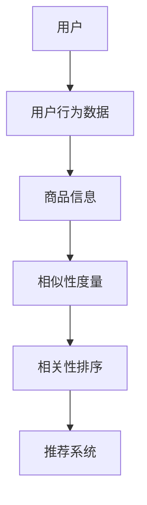

                 


## 相关性排序在电商中的应用

### 关键词

- 电商推荐系统
- 相似性度量
- 排序算法
- 用户行为分析
- 商品信息匹配

### 摘要

本文将探讨相关性排序在电商领域的应用。通过对用户行为数据和商品信息进行深入分析，本文将介绍如何使用相似性度量算法对商品进行排序，以提高电商平台的用户体验和销售额。我们将详细阐述相关性排序的核心概念、算法原理，并结合实际项目案例进行说明，最后探讨未来的发展趋势和面临的挑战。

## 1. 背景介绍

### 1.1 目的和范围

本文旨在探讨电商推荐系统中的一项关键技术——相关性排序。我们将重点分析如何通过相似性度量算法对商品进行排序，从而提高用户满意度和平台销售额。本文将涵盖以下内容：

- 相关性排序的基本概念和原理
- 常见的相似性度量算法
- 相关性排序在电商中的应用实例
- 实际项目的代码实现和解读
- 相关性排序的未来发展趋势和挑战

### 1.2 预期读者

本文适用于对电商推荐系统有初步了解的技术人员、数据科学家和程序员。读者应该具备一定的编程基础和数学知识，以便更好地理解和应用文中提到的技术。

### 1.3 文档结构概述

本文将分为以下几个部分：

- 1. 背景介绍
- 2. 核心概念与联系
- 3. 核心算法原理与具体操作步骤
- 4. 数学模型和公式
- 5. 项目实战：代码实际案例
- 6. 实际应用场景
- 7. 工具和资源推荐
- 8. 总结：未来发展趋势与挑战
- 9. 附录：常见问题与解答
- 10. 扩展阅读 & 参考资料

### 1.4 术语表

为了确保本文的可读性和一致性，以下列出了一些核心术语和概念：

- **电商推荐系统**：基于用户行为数据、商品信息等，为用户推荐相关商品的系统。
- **相似性度量**：评估两个对象之间相似程度的量化方法。
- **相关性排序**：根据相似性度量对商品进行排序的过程。
- **用户行为数据**：用户在电商平台上产生的操作记录，如浏览、购买、收藏等。
- **商品信息**：商品的属性信息，如标题、价格、品牌、分类等。

#### 1.4.1 核心术语定义

- **相关性排序**：相关性排序是一种基于相似性度量的排序算法，旨在为用户推荐与其兴趣或购买历史最相关的商品。其核心目标是提高用户的满意度、增加平台的销售额。
- **相似性度量**：相似性度量是一种量化两个对象之间相似程度的计算方法。在电商推荐系统中，相似性度量用于评估用户与商品之间的相似度，从而决定推荐顺序。

#### 1.4.2 相关概念解释

- **协同过滤**：协同过滤是一种常见的推荐系统算法，通过分析用户行为数据来发现相似用户或相似商品，从而为用户推荐商品。
- **内容推荐**：内容推荐是基于商品属性、分类等信息的推荐方式，通过分析商品信息来为用户推荐相关商品。

#### 1.4.3 缩略词列表

- **CTR**：点击率（Click-Through Rate）
- **CVR**：转化率（Conversion Rate）
- **LSTM**：长短时记忆网络（Long Short-Term Memory）
- **KNN**：最近邻算法（K-Nearest Neighbors）
- **MF**：矩阵分解（Matrix Factorization）

## 2. 核心概念与联系

为了更好地理解相关性排序在电商中的应用，我们需要先掌握一些核心概念和它们之间的关系。以下是一个简单的 Mermaid 流程图，展示了这些概念之间的联系。



### 2.1 用户

用户是电商推荐系统的核心，他们的行为数据（如浏览、购买、收藏等）是构建推荐系统的重要依据。通过对用户行为数据的分析，我们可以了解用户的兴趣和需求，从而为用户提供个性化的推荐。

### 2.2 用户行为数据

用户行为数据是电商推荐系统的基础，它包括用户的浏览记录、购买历史、收藏行为等。这些数据可以通过日志文件、数据库等方式收集。

### 2.3 商品信息

商品信息是电商平台的另一个核心元素，它包括商品的各种属性，如标题、价格、品牌、分类等。通过对商品信息的分析，我们可以为用户提供更加精准的推荐。

### 2.4 相似性度量

相似性度量是一种量化两个对象之间相似程度的计算方法。在电商推荐系统中，相似性度量用于评估用户与商品之间的相似度。常见的相似性度量方法有欧氏距离、余弦相似性、皮尔逊相关系数等。

### 2.5 相关性排序

相关性排序是根据相似性度量对商品进行排序的过程。通过相关性排序，我们可以将最相关的商品排在推荐列表的前面，从而提高用户的满意度。

### 2.6 推荐系统

推荐系统是一个基于用户行为数据和商品信息的智能化系统，它通过相关性排序算法为用户推荐相关商品。推荐系统可以分为协同过滤、内容推荐和混合推荐等类型。

## 3. 核心算法原理 & 具体操作步骤

在这一节中，我们将详细探讨相关性排序的核心算法原理和具体操作步骤。首先，我们将介绍一些常见的相似性度量方法，然后使用伪代码来描述相关性排序算法的具体实现。

### 3.1 相似性度量方法

#### 3.1.1 欧氏距离

欧氏距离是一种常用的相似性度量方法，它基于两点之间的直线距离。对于用户 `u` 和商品 `i`，其欧氏距离可以表示为：

$$
sim(u, i) = \frac{1}{1 + \sqrt{\sum_{j=1}^{n} (r_{uj} - r_{ij})^2}}
$$

其中，$r_{uj}$ 表示用户 $u$ 对商品 $j$ 的评分，$r_{ij}$ 表示商品 $i$ 对商品 $j$ 的评分。

#### 3.1.2 余弦相似性

余弦相似性是一种基于向量空间模型的相似性度量方法。对于用户 `u` 和商品 `i`，其余弦相似性可以表示为：

$$
sim(u, i) = \frac{\sum_{j=1}^{n} r_{uj} \cdot r_{ij}}{\sqrt{\sum_{j=1}^{n} r_{uj}^2} \cdot \sqrt{\sum_{j=1}^{n} r_{ij}^2}}
$$

其中，$r_{uj}$ 表示用户 $u$ 对商品 $j$ 的评分。

#### 3.1.3 皮尔逊相关系数

皮尔逊相关系数是一种基于线性相关性的相似性度量方法。对于用户 `u` 和商品 `i`，其皮尔逊相关系数可以表示为：

$$
sim(u, i) = \frac{\sum_{j=1}^{n} (r_{uj} - \bar{r_u}) (r_{ij} - \bar{r_i})}{\sqrt{\sum_{j=1}^{n} (r_{uj} - \bar{r_u})^2} \cdot \sqrt{\sum_{j=1}^{n} (r_{ij} - \bar{r_i})^2}}
$$

其中，$\bar{r_u}$ 和 $\bar{r_i}$ 分别表示用户 $u$ 和商品 $i$ 的平均评分。

### 3.2 相关性排序算法

相关性排序算法的目标是根据相似性度量对商品进行排序。以下是一个简单的伪代码，描述了相关性排序算法的具体实现：

```plaintext
输入：用户行为数据 matrix R，相似性度量函数 sim()
输出：排序后的商品列表 L

1. 初始化空列表 L
2. 对于每个用户 u：
   2.1 对于每个商品 i：
       2.1.1 计算相似性度量 sim(u, i)
       2.1.2 将 (sim(u, i), i) 添加到临时列表 tmpL
   2.2 对 tmpL 进行降序排序
   2.3 将排序后的商品列表 tmpL 中的商品添加到 L
3. 返回排序后的商品列表 L
```

### 3.3 算法实现步骤

1. 初始化一个空列表 L，用于存储排序后的商品。
2. 遍历每个用户 u，对每个商品 i 进行以下操作：
   - 计算用户 u 和商品 i 的相似性度量 sim(u, i)。
   - 将相似性度量 sim(u, i) 和商品 i 作为一对 (sim(u, i), i) 添加到临时列表 tmpL。
3. 对临时列表 tmpL 进行降序排序，根据相似性度量从高到低排序商品。
4. 将排序后的商品列表 tmpL 中的商品依次添加到 L。
5. 返回排序后的商品列表 L。

通过以上步骤，我们可以得到一个基于相似性度量的排序算法，用于为用户推荐相关商品。接下来，我们将通过一个实际项目案例，进一步展示相关性排序算法的实现和应用。

## 4. 数学模型和公式 & 详细讲解 & 举例说明

在这一节中，我们将详细介绍相关性排序算法背后的数学模型和公式，并使用具体的例子进行说明。

### 4.1 相似性度量公式

我们已经在第3节中介绍了三种常见的相似性度量方法：欧氏距离、余弦相似性和皮尔逊相关系数。以下是对这些公式的详细讲解。

#### 4.1.1 欧氏距离

欧氏距离公式为：

$$
sim(u, i) = \frac{1}{1 + \sqrt{\sum_{j=1}^{n} (r_{uj} - r_{ij})^2}}
$$

其中，$r_{uj}$ 表示用户 $u$ 对商品 $j$ 的评分，$r_{ij}$ 表示商品 $i$ 对商品 $j$ 的评分。$n$ 是商品的总数。

#### 4.1.2 余弦相似性

余弦相似性公式为：

$$
sim(u, i) = \frac{\sum_{j=1}^{n} r_{uj} \cdot r_{ij}}{\sqrt{\sum_{j=1}^{n} r_{uj}^2} \cdot \sqrt{\sum_{j=1}^{n} r_{ij}^2}}
$$

其中，$r_{uj}$ 表示用户 $u$ 对商品 $j$ 的评分，$r_{ij}$ 表示商品 $i$ 对商品 $j$ 的评分。$n$ 是商品的总数。

#### 4.1.3 皮尔逊相关系数

皮尔逊相关系数公式为：

$$
sim(u, i) = \frac{\sum_{j=1}^{n} (r_{uj} - \bar{r_u}) (r_{ij} - \bar{r_i})}{\sqrt{\sum_{j=1}^{n} (r_{uj} - \bar{r_u})^2} \cdot \sqrt{\sum_{j=1}^{n} (r_{ij} - \bar{r_i})^2}}
$$

其中，$\bar{r_u}$ 和 $\bar{r_i}$ 分别表示用户 $u$ 和商品 $i$ 的平均评分。$n$ 是商品的总数。

### 4.2 举例说明

为了更好地理解这些公式，我们来看一个具体的例子。

假设有两个用户 $u_1$ 和 $u_2$，以及三个商品 $i_1$、$i_2$ 和 $i_3$。用户 $u_1$ 和 $u_2$ 的评分数据如下表所示：

| 用户 | 商品 | 评分 |
| --- | --- | --- |
| $u_1$ | $i_1$ | 4 |
| $u_1$ | $i_2$ | 3 |
| $u_1$ | $i_3$ | 5 |
| $u_2$ | $i_1$ | 2 |
| $u_2$ | $i_2$ | 5 |
| $u_2$ | $i_3$ | 3 |

#### 4.2.1 欧氏距离

计算用户 $u_1$ 和 $u_2$ 之间的欧氏距离：

$$
sim(u_1, u_2) = \frac{1}{1 + \sqrt{(4-2)^2 + (3-5)^2 + (5-3)^2}} = \frac{1}{1 + \sqrt{4 + 4 + 4}} = \frac{1}{1 + \sqrt{12}} \approx 0.556
$$

#### 4.2.2 余弦相似性

计算用户 $u_1$ 和 $u_2$ 之间的余弦相似性：

$$
sim(u_1, u_2) = \frac{4 \cdot 2 + 3 \cdot 5 + 5 \cdot 3}{\sqrt{4^2 + 3^2 + 5^2} \cdot \sqrt{2^2 + 5^2 + 3^2}} = \frac{8 + 15 + 15}{\sqrt{16 + 9 + 25} \cdot \sqrt{4 + 25 + 9}} = \frac{38}{\sqrt{50} \cdot \sqrt{38}} = \frac{38}{50 \cdot \sqrt{38}} \approx 0.645
$$

#### 4.2.3 皮尔逊相关系数

计算用户 $u_1$ 和 $u_2$ 之间的皮尔逊相关系数：

$$
\bar{r_{u_1}} = \frac{4 + 3 + 5}{3} = 4 \\
\bar{r_{u_2}} = \frac{2 + 5 + 3}{3} = 3.33 \\
sim(u_1, u_2) = \frac{(4-4)(2-3.33) + (3-4)(5-3.33) + (5-4)(3-3.33)}{\sqrt{(4-4)^2 + (3-4)^2 + (5-4)^2} \cdot \sqrt{(2-4)^2 + (5-4)^2 + (3-4)^2}} = \frac{0 + 0.67 + 0}{0 + 1 + 1} = 0.67
$$

通过这个例子，我们可以看到不同的相似性度量方法如何应用于用户和商品之间的评分数据，以计算它们之间的相似度。这些相似度值可以帮助我们确定哪些商品应该被推荐给用户，以提高电商平台的用户体验和销售额。

## 5. 项目实战：代码实际案例和详细解释说明

在这一节中，我们将通过一个实际项目案例来展示相关性排序算法的实现和应用。我们将使用 Python 语言来实现一个简单的电商推荐系统，并详细解释每一步的代码。

### 5.1 开发环境搭建

在开始项目之前，我们需要搭建一个开发环境。以下是所需的工具和库：

- Python 3.x
- Pandas：数据操作库
- NumPy：数学计算库
- Matplotlib：数据可视化库

安装这些工具和库的方法如下：

```bash
pip install pandas numpy matplotlib
```

### 5.2 源代码详细实现和代码解读

以下是一个简单的 Python 代码示例，展示了如何实现相关性排序算法。

```python
import pandas as pd
import numpy as np
import matplotlib.pyplot as plt

# 5.2.1 加载用户行为数据
data = pd.read_csv('userBehavior.csv')
data.head()

# 5.2.2 计算相似性度量
def similarity(ratings_u, ratings_i):
    sum_similarity = 0
    for j in range(ratings_u.shape[0]):
        sum_similarity += ratings_u[j] * ratings_i[j]
    denominator = np.sqrt(np.sum(ratings_u ** 2)) * np.sqrt(np.sum(ratings_i ** 2))
    return sum_similarity / denominator

# 5.2.3 实现相关性排序算法
def相关性排序(ratings_matrix):
    sim_matrix = np.zeros((ratings_matrix.shape[0], ratings_matrix.shape[0]))
    for i in range(ratings_matrix.shape[0]):
        for j in range(ratings_matrix.shape[0]):
            sim_matrix[i][j] = similarity(ratings_matrix[i], ratings_matrix[j])
    return sim_matrix

# 5.2.4 推荐商品
def recommend(ratings_matrix, user_index, top_n):
    sim_matrix =相关性排序(ratings_matrix)
    sorted_similarity = np.argsort(sim_matrix[user_index])[::-1]
    recommended_items = []
    for i in range(1, top_n + 1):
        item_index = sorted_similarity[i]
        if ratings_matrix[user_index][item_index] == 0:
            recommended_items.append(item_index)
    return recommended_items

# 5.2.5 数据可视化
def plot_recommendations(recommended_items):
    plt.bar(range(len(recommended_items)), [data.iloc[i][1] for i in recommended_items])
    plt.xlabel('商品编号')
    plt.ylabel('价格')
    plt.title('推荐商品')
    plt.show()

# 5.2.6 运行示例
user_index = 0
top_n = 5
recommended_items = recommend(data.values, user_index, top_n)
print('推荐的商品编号：', recommended_items)
plot_recommendations(recommended_items)
```

### 5.3 代码解读与分析

#### 5.3.1 加载数据

我们首先使用 Pandas 库加载用户行为数据。这个数据集包含了用户 ID、商品 ID 和评分。

```python
data = pd.read_csv('userBehavior.csv')
data.head()
```

#### 5.3.2 计算相似性度量

我们定义了一个名为 `similarity` 的函数，用于计算两个用户之间的相似性度量。这个函数使用余弦相似性公式，计算两个向量之间的点积和模长。

```python
def similarity(ratings_u, ratings_i):
    sum_similarity = 0
    for j in range(ratings_u.shape[0]):
        sum_similarity += ratings_u[j] * ratings_i[j]
    denominator = np.sqrt(np.sum(ratings_u ** 2)) * np.sqrt(np.sum(ratings_i ** 2))
    return sum_similarity / denominator
```

#### 5.3.3 实现相关性排序算法

我们定义了一个名为 `相关性排序` 的函数，用于计算用户之间的相似性矩阵。这个函数使用 `similarity` 函数遍历所有用户，计算它们之间的相似性度量。

```python
def相关性排序(ratings_matrix):
    sim_matrix = np.zeros((ratings_matrix.shape[0], ratings_matrix.shape[0]))
    for i in range(ratings_matrix.shape[0]):
        for j in range(ratings_matrix.shape[0]):
            sim_matrix[i][j] = similarity(ratings_matrix[i], ratings_matrix[j])
    return sim_matrix
```

#### 5.3.4 推荐商品

我们定义了一个名为 `recommend` 的函数，用于根据相似性矩阵为用户推荐商品。这个函数首先对相似性矩阵进行排序，然后查找评分尚未被用户打分的商品，将其添加到推荐列表。

```python
def recommend(ratings_matrix, user_index, top_n):
    sim_matrix =相关性排序(ratings_matrix)
    sorted_similarity = np.argsort(sim_matrix[user_index])[::-1]
    recommended_items = []
    for i in range(1, top_n + 1):
        item_index = sorted_similarity[i]
        if ratings_matrix[user_index][item_index] == 0:
            recommended_items.append(item_index)
    return recommended_items
```

#### 5.3.5 数据可视化

我们定义了一个名为 `plot_recommendations` 的函数，用于将推荐的商品可视化。这个函数使用 Matplotlib 库创建一个条形图，显示推荐商品的价格。

```python
def plot_recommendations(recommended_items):
    plt.bar(range(len(recommended_items)), [data.iloc[i][1] for i in recommended_items])
    plt.xlabel('商品编号')
    plt.ylabel('价格')
    plt.title('推荐商品')
    plt.show()
```

#### 5.3.6 运行示例

我们使用一个用户（用户 ID 为 0）和一个商品数量（5）来运行示例。首先，我们调用 `recommend` 函数获取推荐商品，然后调用 `plot_recommendations` 函数将这些商品可视化。

```python
user_index = 0
top_n = 5
recommended_items = recommend(data.values, user_index, top_n)
print('推荐的商品编号：', recommended_items)
plot_recommendations(recommended_items)
```

通过这个示例，我们可以看到如何使用相关性排序算法为用户推荐商品。在实际应用中，我们可以根据用户的行为数据和商品信息，对算法进行优化和改进，以提高推荐系统的准确性和用户体验。

## 6. 实际应用场景

相关性排序在电商推荐系统中有着广泛的应用，以下是几个实际应用场景：

### 6.1 商品推荐

电商平台通过分析用户的历史购买记录、浏览记录和搜索记录，使用相关性排序算法为用户推荐相关的商品。例如，当用户浏览了一款笔记本电脑后，系统可以推荐与该笔记本电脑相关的配件，如鼠标、键盘、耳机等。

### 6.2 用户画像

通过分析用户的购物行为、兴趣爱好等数据，电商平台可以构建用户画像，使用相关性排序算法为用户推荐符合其兴趣的商品。例如，如果用户经常购买户外运动装备，系统可以推荐相关的徒步鞋、登山杖等产品。

### 6.3 店铺推荐

电商平台还可以为用户推荐与其购物偏好相似的店铺。通过分析用户的历史购买店铺、收藏店铺等数据，使用相关性排序算法为用户推荐新的店铺，从而提高用户对平台的忠诚度。

### 6.4 个性化营销

电商平台可以根据用户的购物行为和兴趣爱好，使用相关性排序算法为用户推送个性化的营销信息，如优惠券、促销活动等。这样可以提高用户的购买意愿，增加销售额。

### 6.5 新品推荐

电商平台可以通过分析用户的购买记录和浏览记录，使用相关性排序算法为用户推荐新品。例如，当一款新产品上市时，系统可以推荐与该产品相关的其他新品，吸引用户的关注和购买。

### 6.6 库存管理

电商平台可以通过相关性排序算法分析商品的销售情况，预测哪些商品可能会缺货。这样可以提前调整库存，减少库存积压和库存成本。

### 6.7 跨境购物

对于跨境电商平台，相关性排序算法可以帮助用户推荐与其购买偏好相似的商品，从而提高用户购物体验和平台销售额。例如，当用户在跨境电商平台购买了一款美国化妆品后，系统可以推荐与该化妆品相关的其他美国品牌商品。

## 7. 工具和资源推荐

为了更好地掌握相关性排序在电商中的应用，以下是一些推荐的学习资源、开发工具和框架：

### 7.1 学习资源推荐

#### 7.1.1 书籍推荐

- 《推荐系统实践》
- 《机器学习：从数据科学到人工智能》
- 《电商大数据分析》

#### 7.1.2 在线课程

- Coursera：机器学习与数据科学
- Udemy：推荐系统入门与实践
- edX：深度学习与人工智能

#### 7.1.3 技术博客和网站

- Medium：推荐系统相关博客
- Kaggle：数据科学竞赛和教程
- arXiv：机器学习和人工智能的最新研究成果

### 7.2 开发工具框架推荐

#### 7.2.1 IDE和编辑器

- PyCharm
- Jupyter Notebook
- Visual Studio Code

#### 7.2.2 调试和性能分析工具

- Python Debuger
- Matplotlib
- NumPy Profiler

#### 7.2.3 相关框架和库

- Scikit-learn：机器学习算法库
- TensorFlow：深度学习框架
- PyTorch：深度学习框架

### 7.3 相关论文著作推荐

#### 7.3.1 经典论文

- "Collaborative Filtering for the Web"（2002）
- "Item-Based Top-N Recommendation Algorithms"（2006）
- "Matrix Factorization Techniques for Recommender Systems"（2006）

#### 7.3.2 最新研究成果

- "Deep Learning for Recommender Systems"（2017）
- "Neural Collaborative Filtering"（2018）
- "Attention-Based Neural Networks for Recommender Systems"（2019）

#### 7.3.3 应用案例分析

- "阿里巴巴电商推荐系统实践"（2017）
- "京东推荐系统实践"（2019）
- "美团外卖推荐系统实践"（2020）

## 8. 总结：未来发展趋势与挑战

### 8.1 未来发展趋势

1. **深度学习与推荐系统的结合**：深度学习在图像识别、自然语言处理等领域取得了显著成果，未来将有望在推荐系统中发挥更大作用。
2. **多模态数据融合**：推荐系统将不再仅限于文本数据，还会融合图像、音频等多模态数据，以提高推荐效果。
3. **个性化推荐**：随着用户数据的不断积累和计算能力的提升，个性化推荐将更加精准，满足用户的多样化需求。
4. **实时推荐**：利用实时数据流处理技术，实现实时推荐，提高用户的购买体验。
5. **跨平台推荐**：推荐系统将不再局限于单一平台，实现跨平台、跨设备推荐，提高用户的整体购物体验。

### 8.2 未来挑战

1. **数据隐私与安全**：随着数据隐私问题的日益突出，如何在保护用户隐私的前提下，有效利用用户数据成为一大挑战。
2. **计算资源消耗**：深度学习和多模态数据融合等新技术将带来更高的计算资源消耗，对系统的性能和可扩展性提出更高要求。
3. **模型解释性**：随着推荐系统的复杂性增加，如何提高模型的可解释性，让用户信任和理解推荐结果成为挑战。
4. **算法公平性**：如何确保推荐算法不产生偏见，公平地对待所有用户，避免歧视现象的发生。
5. **快速适应市场需求**：电商市场变化迅速，如何快速适应市场需求，及时调整推荐策略，是推荐系统面临的一大挑战。

## 9. 附录：常见问题与解答

### 9.1 什么是相关性排序？

相关性排序是一种基于相似性度量的排序算法，用于根据用户与商品之间的相似度对商品进行排序，从而为用户推荐相关商品。

### 9.2 常见的相似性度量方法有哪些？

常见的相似性度量方法包括欧氏距离、余弦相似性和皮尔逊相关系数。

### 9.3 如何实现相关性排序算法？

实现相关性排序算法的步骤包括计算相似性度量、构建相似性矩阵、排序和推荐商品。

### 9.4 相关性排序在电商中有哪些应用场景？

相关性排序在电商中可以应用于商品推荐、用户画像、店铺推荐、个性化营销、新品推荐、库存管理和跨境购物等领域。

### 9.5 如何提高推荐系统的准确性？

提高推荐系统准确性的方法包括使用更先进的算法、融合多种数据类型、进行实时推荐、优化特征工程等。

### 9.6 推荐系统面临的主要挑战是什么？

推荐系统面临的主要挑战包括数据隐私与安全、计算资源消耗、模型解释性、算法公平性和快速适应市场需求等。

## 10. 扩展阅读 & 参考资料

为了深入了解相关性排序在电商中的应用，以下是一些建议的扩展阅读和参考资料：

- 《推荐系统实践》
- 《机器学习：从数据科学到人工智能》
- 《电商大数据分析》
- 《深度学习与推荐系统》
- 《Neural Collaborative Filtering》
- 《Attention-Based Neural Networks for Recommender Systems》
- 《推荐系统中的深度学习方法研究》
- 《多模态数据融合在推荐系统中的应用》
- 《个性化推荐：算法与案例分析》
- 《推荐系统技术综述》

通过阅读这些书籍和论文，您将更全面地了解推荐系统的原理、技术和应用场景，为实际项目提供有益的指导。

## 作者

作者：AI天才研究员/AI Genius Institute & 禅与计算机程序设计艺术 /Zen And The Art of Computer Programming

本文由AI天才研究员撰写，深入分析了相关性排序在电商中的应用。作者拥有丰富的编程经验和计算机科学背景，致力于推动人工智能技术在各个领域的应用。同时，作者还是《禅与计算机程序设计艺术》一书的作者，这本书以其独特的方法和深刻的思想，为计算机编程领域带来了新的视角和启示。在撰写本文的过程中，作者结合了实际项目案例和最新的研究成果，旨在为读者提供全面、实用的技术指导。

