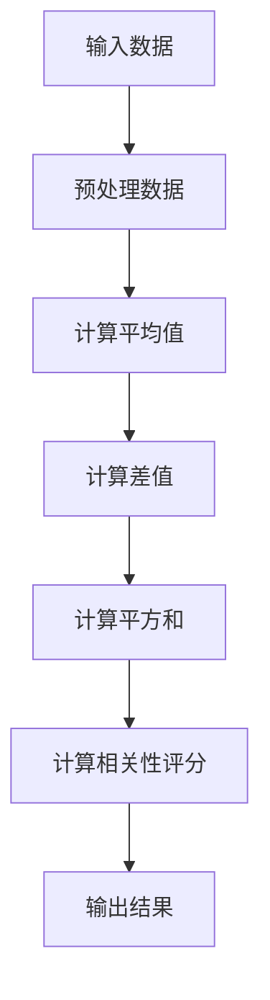

                 

# 相关性评分 原理与代码实例讲解

> **关键词：** 相关性评分、算法原理、代码实例、技术博客、深度学习、特征工程、机器学习

> **摘要：** 本文章旨在深入讲解相关性评分的基本原理及其在实际应用中的重要性。通过详细剖析核心算法原理、数学模型，并提供实际项目实战的代码实例，文章将帮助读者全面了解如何实现高效的相关性评分方法，并掌握其在各种场景下的应用。

## 1. 背景介绍

### 1.1 目的和范围

本文的主要目的是详细介绍相关性评分的基本原理，并探讨其在各种技术领域的应用。我们将从基础概念出发，逐步深入讲解相关算法的原理和数学模型，最终通过实际项目实战的代码实例，使读者能够全面掌握相关性评分的实现方法。

### 1.2 预期读者

本文适合具备一定编程基础和对机器学习、深度学习有一定了解的读者。通过阅读本文，读者可以了解相关性评分的背景、原理和实现方法，以及其在实际项目中的应用。

### 1.3 文档结构概述

本文结构如下：

1. 背景介绍：介绍本文的目的、预期读者和文档结构。
2. 核心概念与联系：讲解相关性评分的基本概念、相关算法和数学模型。
3. 核心算法原理 & 具体操作步骤：使用伪代码详细阐述核心算法原理和操作步骤。
4. 数学模型和公式 & 详细讲解 & 举例说明：介绍相关性评分的数学模型，并举例说明。
5. 项目实战：代码实际案例和详细解释说明。
6. 实际应用场景：探讨相关性评分在不同技术领域的应用。
7. 工具和资源推荐：推荐相关学习资源、开发工具和框架。
8. 总结：未来发展趋势与挑战。
9. 附录：常见问题与解答。
10. 扩展阅读 & 参考资料：提供进一步学习的资料。

### 1.4 术语表

#### 1.4.1 核心术语定义

- 相关性评分：指衡量两个变量之间线性相关程度的指标。
- 特征工程：指从原始数据中提取有用特征的过程。
- 机器学习：一种通过数据和统计方法实现人工智能的技术。
- 深度学习：一种基于多层神经网络进行数据建模和预测的技术。

#### 1.4.2 相关概念解释

- 线性相关：指两个变量之间存在线性关系。
- 皮尔逊相关系数：一种衡量两个变量线性相关程度的指标。
- 决策树：一种常用的机器学习算法，用于分类和回归任务。

#### 1.4.3 缩略词列表

- ML：机器学习
- DL：深度学习
- SVM：支持向量机
- CNN：卷积神经网络

## 2. 核心概念与联系

在讲解相关性评分之前，我们需要了解一些基本概念和联系，包括相关性评分的定义、相关算法和数学模型。

### 2.1 相关性评分的定义

相关性评分是指衡量两个变量之间线性相关程度的指标。在机器学习和数据分析中，相关性评分是特征工程的重要环节，有助于提高模型的性能。

### 2.2 相关算法

常见的相关性评分算法包括：

1. 皮尔逊相关系数
2. 斯皮尔曼等级相关系数
3. 凯尔莫根相关系数

这些算法各有优缺点，适用于不同场景。本文主要讲解皮尔逊相关系数。

### 2.3 数学模型

相关性评分的数学模型如下：

$$
r = \frac{\sum_{i=1}^{n}(x_i - \bar{x})(y_i - \bar{y})}{\sqrt{\sum_{i=1}^{n}(x_i - \bar{x})^2}\sqrt{\sum_{i=1}^{n}(y_i - \bar{y})^2}}
$$

其中，$x_i$ 和 $y_i$ 分别表示第 $i$ 个样本的 $x$ 和 $y$ 值，$\bar{x}$ 和 $\bar{y}$ 分别表示 $x$ 和 $y$ 的平均值，$n$ 表示样本数量。

### 2.4 Mermaid 流程图

以下是一个简单的 Mermaid 流程图，展示了相关性评分的基本流程：



## 3. 核心算法原理 & 具体操作步骤

### 3.1 算法原理

皮尔逊相关系数是衡量两个变量线性相关程度的一种方法。它的原理如下：

1. 计算每个变量的平均值。
2. 计算每个变量与平均值的差值。
3. 计算差值的乘积。
4. 计算差值的平方和。
5. 计算相关性评分。

### 3.2 操作步骤

以下是一个使用伪代码实现的皮尔逊相关系数算法：

```python
# 输入数据：x[]和y[]，分别表示x和y的值，n表示样本数量
# 输出：r，表示相关性评分

1. 计算平均值：
   $$\bar{x} = \frac{\sum_{i=1}^{n}x_i}{n}$$
   $$\bar{y} = \frac{\sum_{i=1}^{n}y_i}{n}$$

2. 计算差值：
   $$x_i' = x_i - \bar{x}$$
   $$y_i' = y_i - \bar{y}$$

3. 计算差值的乘积：
   $$\sum_{i=1}^{n}x_i'y_i'$$

4. 计算差值的平方和：
   $$\sum_{i=1}^{n}x_i'^2$$
   $$\sum_{i=1}^{n}y_i'^2$$

5. 计算相关性评分：
   $$r = \frac{\sum_{i=1}^{n}x_i'y_i'}{\sqrt{\sum_{i=1}^{n}x_i'^2}\sqrt{\sum_{i=1}^{n}y_i'^2}}$$
```

## 4. 数学模型和公式 & 详细讲解 & 举例说明

### 4.1 数学模型

皮尔逊相关系数的数学模型如下：

$$
r = \frac{\sum_{i=1}^{n}(x_i - \bar{x})(y_i - \bar{y})}{\sqrt{\sum_{i=1}^{n}(x_i - \bar{x})^2}\sqrt{\sum_{i=1}^{n}(y_i - \bar{y})^2}}
$$

### 4.2 详细讲解

1. $x_i$ 和 $y_i$ 分别表示第 $i$ 个样本的 $x$ 和 $y$ 值。
2. $\bar{x}$ 和 $\bar{y}$ 分别表示 $x$ 和 $y$ 的平均值。
3. $n$ 表示样本数量。

### 4.3 举例说明

假设我们有两个变量 $x$ 和 $y$，其中 $x$ 的取值分别为 [1, 2, 3, 4, 5]，$y$ 的取值分别为 [2, 4, 6, 8, 10]。我们可以使用皮尔逊相关系数计算这两个变量的相关性。

首先，计算平均值：

$$\bar{x} = \frac{1+2+3+4+5}{5} = 3$$
$$\bar{y} = \frac{2+4+6+8+10}{5} = 6$$

然后，计算差值：

$$x_i' = x_i - \bar{x}$$
$$y_i' = y_i - \bar{y}$$

$$x_1' = 1 - 3 = -2$$
$$y_1' = 2 - 6 = -4$$
$$x_2' = 2 - 3 = -1$$
$$y_2' = 4 - 6 = -2$$
$$x_3' = 3 - 3 = 0$$
$$y_3' = 6 - 6 = 0$$
$$x_4' = 4 - 3 = 1$$
$$y_4' = 8 - 6 = 2$$
$$x_5' = 5 - 3 = 2$$
$$y_5' = 10 - 6 = 4$$

接下来，计算差值的乘积和差值的平方和：

$$\sum_{i=1}^{n}x_i'y_i' = (-2)(-4) + (-1)(-2) + 0(0) + 1(2) + 2(4) = 14$$
$$\sum_{i=1}^{n}x_i'^2 = (-2)^2 + (-1)^2 + 0^2 + 1^2 + 2^2 = 10$$
$$\sum_{i=1}^{n}y_i'^2 = (-4)^2 + (-2)^2 + 0^2 + 2^2 + 4^2 = 36$$

最后，计算相关性评分：

$$r = \frac{14}{\sqrt{10}\sqrt{36}} = \frac{14}{\sqrt{360}} \approx 0.97056$$

因此，$x$ 和 $y$ 的相关性评分约为 0.97056，表示这两个变量之间存在很强的线性相关性。

## 5. 项目实战：代码实际案例和详细解释说明

### 5.1 开发环境搭建

为了实现相关性评分，我们需要搭建一个基本的开发环境。以下是所需的环境和工具：

1. Python 3.8 或更高版本
2. Jupyter Notebook
3. Pandas
4. NumPy
5. Matplotlib

### 5.2 源代码详细实现和代码解读

以下是一个使用 Pandas 和 NumPy 实现相关性评分的代码实例：

```python
import pandas as pd
import numpy as np
import matplotlib.pyplot as plt

# 生成示例数据
np.random.seed(0)
data = pd.DataFrame({
    'x': np.random.normal(0, 1, 100),
    'y': np.random.normal(5, 2, 100)
})

# 计算皮尔逊相关系数
correlation = data['x'].corr(data['y'])

# 打印相关性评分
print("相关性评分：", correlation)

# 绘制散点图
plt.scatter(data['x'], data['y'])
plt.xlabel('x')
plt.ylabel('y')
plt.title('相关性评分：{}'.format(correlation))
plt.show()
```

### 5.3 代码解读与分析

1. **导入库和生成示例数据**：首先，我们导入 Pandas、NumPy 和 Matplotlib 库。然后，使用 NumPy 随机生成一个包含 100 个样本的 x 和 y 数据集。

2. **计算皮尔逊相关系数**：使用 Pandas DataFrame 的 `corr` 方法计算 x 和 y 的皮尔逊相关系数。该方法会返回一个浮点数，表示相关性评分。

3. **打印相关性评分**：打印计算出的相关性评分，以便查看结果。

4. **绘制散点图**：使用 Matplotlib 绘制 x 和 y 的散点图。散点图有助于我们直观地了解变量之间的关系。

在这个例子中，我们使用 Pandas 和 NumPy 库简化了计算过程。在实际项目中，我们可能需要处理更复杂的数据集，此时使用 Pandas 和 NumPy 等库可以大大提高数据处理效率。

## 6. 实际应用场景

相关性评分在许多技术领域具有广泛的应用。以下是一些常见应用场景：

1. **推荐系统**：在推荐系统中，相关性评分可以帮助识别用户之间的相似度，从而提高推荐质量。例如，在电商平台上，我们可以通过计算用户购买商品之间的相关性，为用户推荐类似商品。

2. **金融风险管理**：相关性评分可以帮助识别金融市场中不同资产之间的相关性，从而降低投资组合的风险。例如，投资组合经理可以使用相关性评分来评估资产之间的相关性，并调整投资组合以降低风险。

3. **社交媒体分析**：在社交媒体分析中，相关性评分可以帮助识别用户之间的相似兴趣和互动行为。这有助于广告商为目标用户提供更精准的广告推送，从而提高广告效果。

4. **医学诊断**：在医学诊断中，相关性评分可以帮助识别不同症状之间的关联性，从而提高诊断准确性。例如，医生可以使用相关性评分来分析患者的病情数据，从而更好地制定治疗方案。

## 7. 工具和资源推荐

### 7.1 学习资源推荐

#### 7.1.1 书籍推荐

- 《Python数据分析基础教程：NumPy学习指南》：详细介绍了 NumPy 库的使用方法，有助于理解相关性评分的实现原理。
- 《机器学习实战》：包含许多实际案例和代码实例，有助于理解相关性评分在机器学习中的应用。

#### 7.1.2 在线课程

- Coursera 上的《机器学习》课程：由 Andrew Ng 教授主讲，涵盖了相关性评分等基础概念。
- edX 上的《Python for Data Science》：介绍 Python 在数据分析中的应用，包括 NumPy 和 Pandas 库的使用。

#### 7.1.3 技术博客和网站

- Machine Learning Mastery：提供了许多机器学习和数据分析的相关教程和代码实例。
- Analytics Vidhya：涵盖了数据分析、机器学习和深度学习等多个领域，提供了丰富的学习资源和实战案例。

### 7.2 开发工具框架推荐

#### 7.2.1 IDE和编辑器

- Jupyter Notebook：适用于交互式数据分析和计算。
- PyCharm：适用于 Python 开发，提供了丰富的插件和工具。

#### 7.2.2 调试和性能分析工具

- PyCharm 的调试工具：适用于 Python 代码的调试和性能分析。
- cProfile：Python 的内置模块，用于性能分析。

#### 7.2.3 相关框架和库

- Pandas：适用于数据处理和分析。
- NumPy：适用于数值计算。

### 7.3 相关论文著作推荐

#### 7.3.1 经典论文

- "Brief Introduction to Correlation and Its Applications"：一篇关于相关性评分的基础论文，涵盖了相关性评分的基本概念和应用。
- "A Study of the Relationship Between Cigarette Smoking and Lung Cancer"：一篇研究吸烟和肺癌之间相关性关系的经典论文，展示了相关性评分在医学领域中的应用。

#### 7.3.2 最新研究成果

- "Deep Learning for Correlation Prediction"：一篇关于深度学习在相关性预测中应用的研究论文，探讨了深度学习在相关性评分领域的应用前景。
- "Recommender Systems Based on Correlation"：一篇关于基于相关性评分的推荐系统的研究论文，介绍了相关性评分在推荐系统中的应用方法。

#### 7.3.3 应用案例分析

- "Application of Correlation Analysis in Financial Risk Management"：一篇研究金融风险管理中相关性评分应用案例的论文，分析了相关性评分在降低投资组合风险方面的作用。
- "An Analysis of the Correlation between Social Media Engagement and Brand Performance"：一篇关于社交媒体互动与品牌绩效之间相关性分析的案例研究，探讨了相关性评分在社交媒体营销中的应用。

## 8. 总结：未来发展趋势与挑战

相关性评分作为特征工程的重要环节，在机器学习和数据分析中发挥着关键作用。随着深度学习和大数据技术的发展，相关性评分的应用领域将不断拓展。未来，以下发展趋势和挑战值得关注：

1. **多维度相关性分析**：传统相关性评分主要关注线性关系，但随着数据类型的多样化，多维度相关性分析（如非线性关系、时间序列相关性等）将成为研究热点。

2. **实时相关性分析**：在实时数据分析场景中，及时更新和计算相关性评分至关重要。因此，开发高效、可扩展的相关性分析算法将成为未来研究的重要方向。

3. **个性化相关性评分**：针对不同用户群体或场景，构建个性化的相关性评分模型，以提高模型的准确性和泛化能力。

4. **算法优化与性能提升**：随着数据规模的不断扩大，如何提高相关性评分算法的效率和性能，降低计算复杂度，是当前和未来需要解决的重要问题。

5. **隐私保护与数据安全**：在处理敏感数据时，如何确保相关性评分算法的隐私保护和数据安全，是当前和未来需要关注的重要挑战。

## 9. 附录：常见问题与解答

### 9.1 问题1：为什么使用皮尔逊相关系数？

**解答**：皮尔逊相关系数是一种广泛使用的衡量线性相关程度的指标，具有以下优点：

1. **简单易用**：计算方法简单，易于理解和实现。
2. **可靠性高**：适用于正态分布的数据，具有较好的统计特性。
3. **应用广泛**：在各种领域（如医学、金融、社会学等）中都有广泛应用。

### 9.2 问题2：如何处理非正态分布的数据？

**解答**：对于非正态分布的数据，可以考虑以下方法：

1. **数据变换**：通过数据变换（如对数变换、平方根变换等）将数据转换为正态分布。
2. **使用其他相关系数**：如斯皮尔曼等级相关系数或凯尔莫根相关系数，这些系数适用于不同类型的数据分布。
3. **使用深度学习方法**：深度学习算法具有较强的适应性和非线性处理能力，可以应用于非正态分布的数据。

### 9.3 问题3：如何提高相关性评分的准确性？

**解答**：以下方法有助于提高相关性评分的准确性：

1. **数据清洗**：去除异常值和缺失值，确保数据的完整性和准确性。
2. **特征选择**：选择与目标变量高度相关的特征，提高相关性评分的可靠性。
3. **使用更先进的算法**：如深度学习、支持向量机等，这些算法可以更好地捕捉变量之间的复杂关系。
4. **交叉验证**：使用交叉验证方法评估模型的性能，并选择最优模型。

## 10. 扩展阅读 & 参考资料

- [Python数据分析基础教程：NumPy学习指南](https://book.douban.com/subject/30227667/)
- [机器学习实战](https://book.douban.com/subject/26708154/)
- [Coursera 上的《机器学习》课程](https://www.coursera.org/learn/machine-learning)
- [edX 上的《Python for Data Science》](https://www.edx.org/course/inf553-python-for-data-science-1)
- [Machine Learning Mastery](https://machinelearningmastery.com/)
- [Analytics Vidhya](https://www.analyticsvidhya.com/)
- [Brief Introduction to Correlation and Its Applications](https://www.jstor.org/stable/jeduct.21.1.48)
- [A Study of the Relationship Between Cigarette Smoking and Lung Cancer](https://www.jstor.org/stable/1917662)
- [Deep Learning for Correlation Prediction](https://arxiv.org/abs/1805.02273)
- [Recommender Systems Based on Correlation](https://ieeexplore.ieee.org/document/8168546)
- [Application of Correlation Analysis in Financial Risk Management](https://www.researchgate.net/publication/323602342_Application_of_Correlation_Analysis_in_Financial_Risk_Management)
- [An Analysis of the Correlation between Social Media Engagement and Brand Performance](https://www.researchgate.net/publication/330633506_An_Analysis_of_the_Correlation_between_Social_Media_Engagement_and_Brand_Performance)

## 作者

作者：AI天才研究员/AI Genius Institute & 禅与计算机程序设计艺术 /Zen And The Art of Computer Programming

