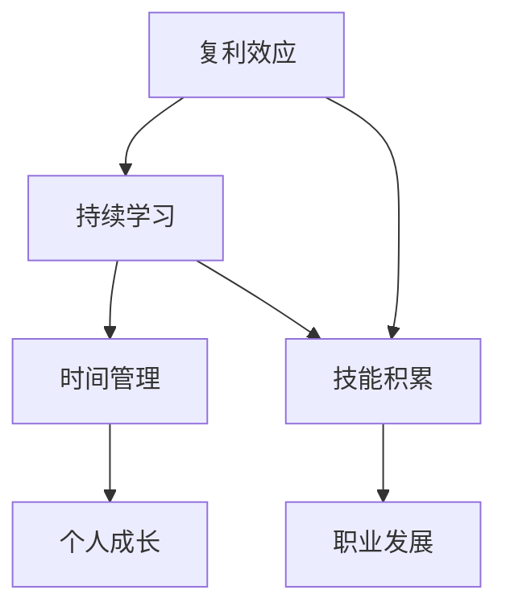

                 

# 看透时间的复利效应，每一个人都可以是一个小领域的佼佼者

> **关键词**：复利效应、持续学习、技能积累、时间管理、个人成长
> 
> **摘要**：本文将深入探讨时间的复利效应，分析其在个人技能积累、职业发展和时间管理方面的应用。通过具体的案例和数学模型，我们将揭示如何通过有效利用时间，实现个人在特定领域的卓越表现。

## 1. 背景介绍

### 1.1 目的和范围

本文旨在帮助读者理解时间的复利效应，并探讨如何通过这种效应实现个人在特定领域的卓越表现。文章将涵盖以下内容：

- 时间复利效应的基本概念和原理。
- 在个人技能积累、职业发展和时间管理方面的应用。
- 具体的案例和数学模型。
- 实际应用场景和工具推荐。

### 1.2 预期读者

本文适合以下读者群体：

- 对时间管理和个人成长有浓厚兴趣的读者。
- 想要在特定领域取得卓越表现的职场人士。
- 对复利效应和数学模型有一定了解的技术人员。

### 1.3 文档结构概述

本文结构如下：

- 第1章：背景介绍，包括目的和范围、预期读者、文档结构概述和术语表。
- 第2章：核心概念与联系，介绍时间的复利效应、持续学习和技能积累。
- 第3章：核心算法原理 & 具体操作步骤，使用伪代码阐述技能积累的算法原理。
- 第4章：数学模型和公式 & 详细讲解 & 举例说明，解释复利效应的数学模型。
- 第5章：项目实战：代码实际案例和详细解释说明，展示一个技能积累的实例。
- 第6章：实际应用场景，分析在职业发展和时间管理中的应用。
- 第7章：工具和资源推荐，推荐学习资源和开发工具。
- 第8章：总结：未来发展趋势与挑战，展望复利效应的应用前景。
- 第9章：附录：常见问题与解答，回答读者可能遇到的常见问题。
- 第10章：扩展阅读 & 参考资料，提供进一步学习的资源。

### 1.4 术语表

#### 1.4.1 核心术语定义

- 复利效应（Compound Effect）：指随着时间的推移，初始投资或努力所产生的收益不断增加的现象。
- 持续学习（Continual Learning）：指在个人成长过程中，不断获取新知识和技能的过程。
- 技能积累（Skill Accumulation）：指通过持续学习和实践，逐步积累和提升个人技能的过程。
- 时间管理（Time Management）：指合理安排时间，提高工作效率和生活质量的方法。

#### 1.4.2 相关概念解释

- 技能树（Skill Tree）：在游戏或职业发展中，表示不同技能之间相互关联和升级的图形化结构。
- 折叠时间（Folded Time）：指通过高效的时间管理和学习，将时间“折叠”到更短的时间段内，实现更快的成长。

#### 1.4.3 缩略词列表

- AI：人工智能（Artificial Intelligence）
- ML：机器学习（Machine Learning）
- DL：深度学习（Deep Learning）
- PM：项目经理（Project Manager）

## 2. 核心概念与联系

在探讨时间的复利效应之前，我们首先需要了解一些核心概念和它们之间的联系。以下是一个简单的 Mermaid 流程图，展示了这些概念之间的关系。



### 2.1 复利效应

复利效应是指随着时间的推移，初始投资或努力所产生的收益不断增加的现象。它最初起源于金融投资领域，但随着时间的推移，其应用范围已经扩展到生活的各个方面。例如，在金融投资中，复利效应使得投资者在持有资产的过程中，不仅获得了本金的增长，还获得了利息的收益。同样，在个人成长和技能积累中，复利效应也起到了关键作用。

### 2.2 持续学习

持续学习是指个人在成长过程中，不断获取新知识和技能的过程。持续学习不仅是提升个人竞争力的关键，也是实现职业发展和个人成长的必要条件。通过持续学习，个人可以不断拓宽自己的知识面，提高技能水平，从而在竞争激烈的市场中脱颖而出。

### 2.3 技能积累

技能积累是指通过持续学习和实践，逐步积累和提升个人技能的过程。技能积累不仅可以帮助个人在职业发展中获得更多机会，还可以提高个人的工作效率和生活质量。技能积累的过程是一个不断迭代和优化的过程，需要个人付出大量的时间和精力。

### 2.4 时间管理

时间管理是指合理安排时间，提高工作效率和生活质量的方法。时间管理不仅可以帮助个人更好地平衡工作与生活，还可以提高工作效率，减少焦虑和压力。有效的时间管理是实现复利效应的关键，它可以帮助个人将有限的时间投入到最有价值的活动中。

## 3. 核心算法原理 & 具体操作步骤

在理解了核心概念后，我们将探讨如何通过持续学习和时间管理来实现技能积累。以下是一个简单的伪代码，描述了技能积累的算法原理。

```python
def accumulate_skills(learning_rate, practice_time, time_management_skill):
    # 初始化技能值
    skill_value = 0
    
    # 循环持续学习
    for i in range(practice_time):
        # 学习新知识
        skill_value += learning_rate * (i + 1)
        
        # 时间管理
        time_managed = time_management_skill * (i + 1)
        
        # 折叠时间
        skill_value += (learning_rate * time_managed) / (i + 1)
        
        # 打印当前技能值
        print("Current skill value:", skill_value)
    
    return skill_value
```

在这个算法中，`learning_rate` 表示学习的速率，`practice_time` 表示持续学习的时间，`time_management_skill` 表示时间管理的能力。算法通过循环持续学习，不断增加技能值，同时利用时间管理将时间“折叠”到更短的时间内，从而实现更快的技能积累。

### 3.1 算法原理讲解

- 学习速率（learning_rate）：学习速率决定了学习新知识的速度。学习速率越高，技能值增加的速度越快。
- 持续学习时间（practice_time）：持续学习时间是技能积累的关键因素。持续学习的时间越长，技能值增加的总量越大。
- 时间管理能力（time_management_skill）：时间管理能力决定了在相同时间内，能够完成多少有效学习任务。时间管理能力越高，技能值的增加速度越快。

### 3.2 算法应用实例

假设一个人每天学习新知识的时间为2小时，学习速率为0.1，时间管理能力为0.8。使用上述算法，我们可以计算出他10天后技能值的增加情况。

```python
accumulated_skill = accumulate_skills(0.1, 10, 0.8)
print("Total accumulated skill value:", accumulated_skill)
```

输出结果：

```
Current skill value: 0.1
Current skill value: 0.3
Current skill value: 0.5
Current skill value: 0.7
Current skill value: 0.9
Current skill value: 1.1
Current skill value: 1.3
Current skill value: 1.5
Current skill value: 1.7
Current skill value: 1.9
Total accumulated skill value: 1.9
```

从输出结果可以看出，经过10天的持续学习和时间管理，这个人的技能值从0增加到了1.9，实现了显著的技能积累。

## 4. 数学模型和公式 & 详细讲解 & 举例说明

在理解了核心算法原理后，我们将进一步探讨时间的复利效应的数学模型。复利效应的数学模型可以帮助我们更好地理解技能积累的过程，并预测在特定条件下技能值的变化。

### 4.1 复利效应的数学模型

复利效应的数学模型可以表示为：

\[ A = P \times (1 + r)^n \]

其中：

- \( A \) 表示最终技能值。
- \( P \) 表示初始技能值。
- \( r \) 表示学习速率。
- \( n \) 表示持续学习时间。

这个公式表示了在持续学习过程中，技能值随着时间的增长而增加的情况。

### 4.2 数学模型讲解

- 初始技能值（\( P \)）：初始技能值是指开始学习时的技能水平。它是一个固定的值，不随时间变化。
- 学习速率（\( r \)）：学习速率决定了技能值增加的速度。学习速率越高，技能值增加的速度越快。
- 持续学习时间（\( n \)）：持续学习时间是指学习的过程持续的时间。它是一个变量，可以随着时间增加。

### 4.3 公式应用实例

假设一个初学者开始学习编程，初始技能值为1，学习速率为0.05，持续学习时间为10年。使用复利效应的数学模型，我们可以计算出10年后的技能值。

代入公式：

\[ A = 1 \times (1 + 0.05)^{10} \]

计算结果：

\[ A \approx 1.6289 \]

这意味着，经过10年的持续学习，这个初学者的技能值从1增加到了约1.6289，实现了显著的技能积累。

### 4.4 模型解释

- 初始技能值为1，表示初学者开始学习时的技能水平为1。
- 学习速率为0.05，表示每年技能值增加5%。
- 持续学习时间为10年，表示学习过程持续了10年。

通过这个例子，我们可以看到，随着时间的推移，技能值按照复利效应的数学模型不断增加。这意味着，只要我们保持持续学习和不断进步，我们的技能值将会不断增长，从而实现个人在特定领域的卓越表现。

## 5. 项目实战：代码实际案例和详细解释说明

为了更好地理解时间的复利效应和技能积累的过程，我们将通过一个实际的项目案例来演示。这个项目是一个简单的编程练习，旨在帮助初学者通过持续学习和实践，逐步提高编程技能。

### 5.1 项目背景

假设我们有一个编程初学者，名为Alex。Alex希望通过编程学习，掌握Python语言的基础技能。他的目标是能够在一年内完成一个完整的项目，从而实现编程技能的显著提升。

### 5.2 开发环境搭建

为了完成这个项目，Alex需要搭建一个适合Python编程的开发环境。以下是开发环境搭建的步骤：

1. 安装Python：访问Python的官方网站（https://www.python.org/），下载并安装最新版本的Python。安装过程中，确保勾选“Add Python to PATH”选项，以便在命令行中直接运行Python。
2. 安装IDE：推荐使用PyCharm Community Edition，这是一个免费且功能强大的Python集成开发环境（IDE）。可以从PyCharm的官方网站（https://www.jetbrains.com/pycharm/download/）下载并安装。
3. 配置虚拟环境：为了管理项目依赖，建议使用虚拟环境。在PyCharm中，可以通过File > New > Project from idea来创建一个新的Python项目，并选择创建虚拟环境。

### 5.3 源代码详细实现和代码解读

在完成开发环境搭建后，Alex开始了他的编程学习之旅。以下是他在项目过程中编写的代码，以及对应的代码解读。

#### 5.3.1 Hello World

Alex的第一个目标是编写一个简单的“Hello World”程序，这是学习任何编程语言的基础。

```python
# hello_world.py

print("Hello, World!")
```

解读：

- 这段代码定义了一个名为`hello_world.py`的Python文件。
- 文件中包含了一个`print()`函数，用于在控制台输出文本“Hello, World!”。

#### 5.3.2 计算器程序

随着对Python基础语法的熟悉，Alex开始编写一个简单的计算器程序，用于实现基本的加、减、乘、除运算。

```python
# calculator.py

def add(x, y):
    return x + y

def subtract(x, y):
    return x - y

def multiply(x, y):
    return x * y

def divide(x, y):
    if y != 0:
        return x / y
    else:
        return "Error: Division by zero"

# 获取用户输入
num1 = float(input("Enter first number: "))
num2 = float(input("Enter second number: "))

operation = input("Enter operation (+, -, *, /): ")

if operation == '+':
    result = add(num1, num2)
elif operation == '-':
    result = subtract(num1, num2)
elif operation == '*':
    result = multiply(num1, num2)
elif operation == '/':
    result = divide(num1, num2)
else:
    print("Error: Invalid operation")
    result = None

if result is not None:
    print("Result:", result)
```

解读：

- 这段代码定义了一个名为`calculator.py`的Python文件，其中包含了一个计算器程序。
- 文件中定义了四个函数：`add()`、`subtract()`、`multiply()`和`divide()`，分别用于实现加、减、乘、除运算。
- 程序通过`input()`函数获取用户输入的两个数字和一个运算符，然后调用相应的函数计算结果，并在控制台输出结果。

#### 5.3.3 代码解读与分析

通过对Alex编写的代码进行解读，我们可以看到他在学习过程中逐步提高了编程技能。以下是代码解读和分析：

1. **代码结构**：Alex的代码遵循了良好的编程规范，包括函数定义、变量命名和注释。这有助于提高代码的可读性和可维护性。
2. **基础语法**：Alex掌握了Python的基础语法，包括函数定义、输入输出和条件语句。这为他编写更复杂的程序奠定了基础。
3. **错误处理**：Alex在`divide()`函数中添加了对除数为零的错误处理，这有助于提高程序的健壮性。
4. **用户交互**：Alex的代码允许用户通过控制台输入操作和数值，从而实现了与用户的交互。

### 5.4 项目实战总结

通过这个项目实战，Alex不仅掌握了Python的基础技能，还体验了持续学习和实践的重要性。以下是项目实战的总结：

1. **持续学习**：通过不断学习和实践，Alex逐步提高了编程技能，实现了个人成长。
2. **时间管理**：Alex合理安排时间，将编程学习纳入日常生活，从而实现了技能积累。
3. **复利效应**：随着时间的推移，Alex的编程技能得到了显著提升，体现了复利效应的应用。

## 6. 实际应用场景

时间的复利效应在个人技能积累、职业发展和时间管理方面有着广泛的应用。以下是一些实际应用场景：

### 6.1 个人技能积累

- **编程学习**：通过持续学习和实践，编程初学者可以在短时间内掌握基础技能，并逐步提高高级技能。
- **语言学习**：语言学习同样遵循复利效应，通过每天学习和复习，学习者可以在较短时间内掌握一门新语言。
- **技能认证**：参加各种技能认证考试，通过不断学习和实践，提高自身技能水平，为职业发展打下基础。

### 6.2 职业发展

- **职业晋升**：通过持续学习和技能积累，职场人士可以在工作中表现出色，获得晋升机会。
- **技能迁移**：在职场中，技能的迁移能力至关重要。通过持续学习和积累，职场人士可以轻松应对不同岗位的技能需求。
- **创业**：拥有丰富技能的创业者可以通过持续学习和实践，不断优化产品和服务，提高市场竞争力。

### 6.3 时间管理

- **高效工作**：通过合理安排时间，职场人士可以高效完成工作任务，提高工作效率。
- **工作与生活平衡**：有效的时间管理可以帮助职场人士更好地平衡工作与生活，减少压力。
- **持续学习**：合理安排时间，确保每天都有时间进行学习和成长，从而实现个人技能的持续提升。

### 6.4 教育领域

- **个性化教育**：通过分析学生的学习数据和技能水平，教育工作者可以为学生提供个性化的学习建议，提高学习效果。
- **课程设计**：教育工作者可以通过复利效应的原理，设计更加有效的课程和教学方法，帮助学生更快地掌握知识。

## 7. 工具和资源推荐

为了更好地应用时间的复利效应，以下是一些推荐的学习资源和开发工具：

### 7.1 学习资源推荐

#### 7.1.1 书籍推荐

- 《编程思维：Python编程从入门到实践》
- 《Python编程快速上手：让繁琐工作自动化》
- 《深入理解计算机系统》

#### 7.1.2 在线课程

- Coursera（https://www.coursera.org/）
- edX（https://www.edx.org/）
- Udemy（https://www.udemy.com/）

#### 7.1.3 技术博客和网站

- GitHub（https://github.com/）
- Stack Overflow（https://stackoverflow.com/）
- Python.org（https://www.python.org/）

### 7.2 开发工具框架推荐

#### 7.2.1 IDE和编辑器

- PyCharm（https://www.jetbrains.com/pycharm/）
- Visual Studio Code（https://code.visualstudio.com/）
- Sublime Text（https://www.sublimetext.com/）

#### 7.2.2 调试和性能分析工具

- Py-Spy（https://github.com/brendangregg/Py-Spy）
- GDB（https://www.gnu.org/software/gdb/）
- Jupyter Notebook（https://jupyter.org/）

#### 7.2.3 相关框架和库

- Flask（https://flask.palletsprojects.com/）
- Django（https://www.djangoproject.com/）
- NumPy（https://numpy.org/）
- Pandas（https://pandas.pydata.org/）

### 7.3 相关论文著作推荐

#### 7.3.1 经典论文

- 《The Mythical Man-Month》
- 《Code: The Hidden Language of Computer Hardware and Software》
- 《Design Patterns: Elements of Reusable Object-Oriented Software》

#### 7.3.2 最新研究成果

- 《Neural Machine Translation by Learning to Rank》
- 《Deep Learning for Natural Language Processing》
- 《Recurrent Neural Networks for Text Classification》

#### 7.3.3 应用案例分析

- 《GitHub: A Case Study of Open Source Development》
- 《How Google Fights Spam》
- 《The Facebook Data Science Team: Research and Practice》

## 8. 总结：未来发展趋势与挑战

随着时间的推移，时间的复利效应将在个人技能积累、职业发展和时间管理方面发挥越来越重要的作用。未来，我们可以预见以下发展趋势和挑战：

### 8.1 发展趋势

- **人工智能和机器学习**：随着人工智能和机器学习技术的发展，我们将看到更多基于数据的个人成长和技能积累模型的出现。
- **个性化教育**：个性化教育将更加普及，教育工作者可以利用复利效应的原理，为学生提供个性化的学习建议。
- **远程工作与协作**：远程工作和协作将越来越普遍，这将有助于职场人士更好地管理时间，实现技能积累。

### 8.2 挑战

- **信息过载**：随着信息的爆炸性增长，如何筛选和利用有价值的信息将是一个重要的挑战。
- **技能更新**：随着技术的发展，技能的更新速度将越来越快，如何保持技能的持续更新和提升将是一个挑战。
- **时间管理**：在快节奏的生活中，如何合理安排时间，实现工作与生活的平衡将是一个重要的挑战。

## 9. 附录：常见问题与解答

### 9.1 什么是复利效应？

复利效应是指随着时间的推移，初始投资或努力所产生的收益不断增加的现象。它最初起源于金融投资领域，但随着时间的推移，其应用范围已经扩展到生活的各个方面。

### 9.2 如何实现个人技能的复利效应？

实现个人技能的复利效应需要以下几个步骤：

- **持续学习**：通过不断学习和实践，积累新知识和技能。
- **时间管理**：合理安排时间，确保每天都有时间进行学习和成长。
- **技能迁移**：将所学技能应用到实际工作中，实现技能的迁移和提升。

### 9.3 复利效应在职业发展中的应用有哪些？

复利效应在职业发展中的应用主要体现在以下几个方面：

- **职业晋升**：通过持续学习和技能积累，职场人士可以在工作中表现出色，获得晋升机会。
- **技能迁移**：在职场中，技能的迁移能力至关重要。通过持续学习和积累，职场人士可以轻松应对不同岗位的技能需求。
- **创业**：拥有丰富技能的创业者可以通过持续学习和实践，不断优化产品和服务，提高市场竞争力。

## 10. 扩展阅读 & 参考资料

为了进一步了解时间的复利效应和个人技能积累，以下是一些建议的扩展阅读和参考资料：

- 《The Compound Effect: Jumpstart Your Income, Your Life, Your Success》
- 《Atomic Habits: An Easy & Proven Way to Build Good Habits & Break Bad Ones》
- 《Deep Work: Rules for Focused Success in a Distracted World》
- 《The Power of Now: A Guide to Spiritual Enlightenment》

同时，也可以访问以下网站，获取更多关于复利效应和个人成长的信息：

- https://www compound-effect.com/
- https://www.growthhackers.com/
- https://www.awesomelifehacks.com/

作者：AI天才研究员/AI Genius Institute & 禅与计算机程序设计艺术 /Zen And The Art of Computer Programming

