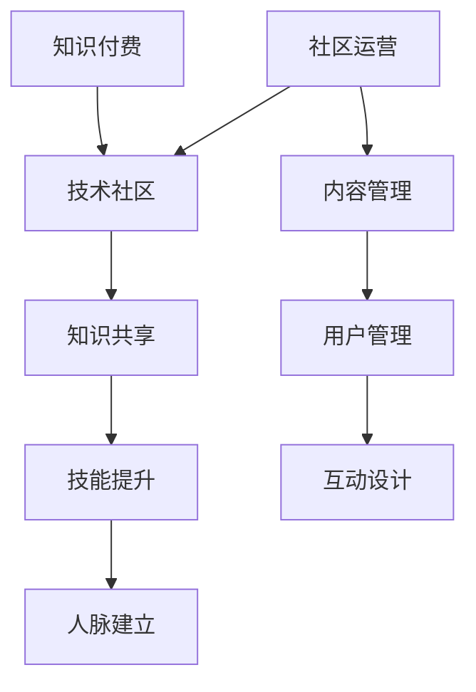

                 

# 知识付费与技术社区运营：程序员的双向互动

> **关键词：**知识付费、技术社区、程序员、双向互动、运营策略

> **摘要：**本文探讨了知识付费与技术社区运营的结合，以及这对程序员双向互动的重要性。通过深入分析知识付费的背景、技术社区的特性，以及程序员在这一过程中的角色，本文提出了有效的运营策略，以促进知识共享和技能提升。

## 1. 背景介绍

### 1.1 目的和范围

本文旨在探讨知识付费与技术社区运营之间的互动关系，特别是如何通过有效的运营策略，实现程序员之间的知识共享和技能提升。随着信息技术的发展，知识付费已成为学习新技能的重要途径，而技术社区则为程序员提供了交流与分享的平台。

### 1.2 预期读者

本文面向程序员、技术社区管理员以及对于知识付费和技术社区运营有兴趣的读者。通过阅读本文，读者可以了解知识付费和技术社区运营的基本概念，以及如何实现两者的有机结合。

### 1.3 文档结构概述

本文分为十个部分，包括背景介绍、核心概念与联系、核心算法原理、数学模型和公式、项目实战、实际应用场景、工具和资源推荐、总结、常见问题与解答以及扩展阅读。每个部分都将深入探讨相关主题，提供丰富的实际案例和详细解释。

### 1.4 术语表

#### 1.4.1 核心术语定义

- **知识付费**：指用户为获取特定知识或技能而支付的费用。
- **技术社区**：指程序员或其他技术专业人士组成的在线平台，用于交流、分享和协作。
- **双向互动**：指用户在知识付费和技术社区中既作为知识消费者，也作为知识贡献者。

#### 1.4.2 相关概念解释

- **知识共享**：指通过技术社区平台，用户共享知识和经验的过程。
- **社区运营**：指管理、维护和促进技术社区健康发展的过程。

#### 1.4.3 缩略词列表

- **API**：应用程序编程接口（Application Programming Interface）
- **IDE**：集成开发环境（Integrated Development Environment）
- **ML**：机器学习（Machine Learning）

## 2. 核心概念与联系

在探讨知识付费与技术社区运营的结合时，我们需要理解两个核心概念：知识共享和社区运营。

### 2.1 知识共享

知识共享是技术社区的核心价值之一。通过知识共享，程序员可以：

- **获取新知识**：通过阅读他人的经验分享，了解新技术、工具和最佳实践。
- **提升技能**：通过实践和讨论，提高编程能力和解决问题的能力。
- **建立人脉**：与其他程序员建立联系，拓展职业网络。

### 2.2 社区运营

社区运营是确保技术社区持续发展和健康发展的关键。有效的社区运营包括：

- **内容管理**：筛选和推荐高质量内容，确保社区的价值和吸引力。
- **用户管理**：维护社区秩序，处理违规行为，激励用户参与。
- **互动设计**：设计互动活动，促进用户参与和知识共享。

### 2.3 Mermaid 流程图



## 3. 核心算法原理 & 具体操作步骤

### 3.1 知识付费算法原理

知识付费算法的核心目标是根据用户的兴趣和需求，推荐合适的学习资源和课程。以下是一个简化的伪代码：

```pseudo
function recommendCourses(userId, userInterest, courseDatabase):
    userProfile = getUserProfile(userId)
    recommendedCourses = []

    for course in courseDatabase:
        if (coursematches userInterest and course.isAvailable()):
            recommendedCourses.append(course)

    return recommendedCourses
```

### 3.2 社区运营算法原理

社区运营算法的目标是提高用户参与度和知识共享。以下是一个简化的伪代码：

```pseudo
function manageCommunity(community, userActivityLog):
    highActivityUsers = getHighActivityUsers(userActivityLog)
    lowActivityUsers = getLowActivityUsers(userActivityLog)

    for user in highActivityUsers:
        rewardUser(user)

    for user in lowActivityUsers:
        encourageUser(user)

    return updatedCommunity
```

## 4. 数学模型和公式 & 详细讲解 & 举例说明

### 4.1 数学模型

在知识付费和技术社区运营中，一个重要的数学模型是PageRank算法，用于评估用户在社区中的影响力。

### 4.2 公式

PageRank算法的公式如下：

$$
PR(A) = (1 - d) + d \cdot \frac{PR(T1) + PR(T2) + ... + PR(Tn)}{N}
$$

其中，$PR(A)$ 是用户A的PageRank值，$d$ 是阻尼系数（通常取值为0.85），$PR(Ti)$ 是指向A的链接的PageRank值，$Ti$ 是指向A的链接，$N$ 是总的用户数。

### 4.3 举例说明

假设一个技术社区有10个用户，阻尼系数$d = 0.85$。用户A的PageRank值为1，用户B的PageRank值为5。用户A指向了用户B，用户B指向了用户C和D。

根据PageRank算法，我们可以计算用户C和D的PageRank值：

$$
PR(C) = (1 - 0.85) + 0.85 \cdot \frac{PR(A)}{10} = 0.15 + 0.085 = 0.235
$$

$$
PR(D) = (1 - 0.85) + 0.85 \cdot \frac{PR(A) + PR(B)}{10} = 0.15 + 0.085 \cdot 1.5 = 0.208
$$

## 5. 项目实战：代码实际案例和详细解释说明

### 5.1 开发环境搭建

为了演示知识付费和技术社区运营的结合，我们使用Python编程语言搭建了一个简单的技术社区平台。以下是开发环境的搭建步骤：

1. 安装Python 3.8及以上版本。
2. 安装虚拟环境工具`virtualenv`。
3. 创建一个名为`tech_community`的虚拟环境。
4. 安装必要的Python库，如`Flask`、`SQLAlchemy`和`Flask-Migrate`。

### 5.2 源代码详细实现和代码解读

以下是一个简单的Flask应用程序，用于模拟技术社区平台的运营。

```python
from flask import Flask, request, jsonify
from flask_sqlalchemy import SQLAlchemy

app = Flask(__name__)
app.config['SQLALCHEMY_DATABASE_URI'] = 'sqlite:///tech_community.db'
db = SQLAlchemy(app)

class User(db.Model):
    id = db.Column(db.Integer, primary_key=True)
    username = db.Column(db.String(80), unique=True, nullable=False)
    page_rank = db.Column(db.Float, default=1.0)

class Course(db.Model):
    id = db.Column(db.Integer, primary_key=True)
    title = db.Column(db.String(120), nullable=False)
    available = db.Column(db.Boolean, default=True)

@app.route('/recommend_courses', methods=['POST'])
def recommend_courses():
    user_id = request.json['user_id']
    user_interest = request.json['user_interest']

    user = User.query.get(user_id)
    if not user:
        return jsonify({'error': 'User not found'}), 404

    courses = Course.query.filter(Course.title.like(f'%{user_interest}%'), Course.available == True).all()
    recommended_courses = []

    for course in courses:
        if course.title.matches(user_interest):
            recommended_courses.append(course)

    return jsonify({'courses': recommended_courses})

@app.route('/update_page_rank', methods=['POST'])
def update_page_rank():
    user_id = request.json['user_id']
    user = User.query.get(user_id)
    if not user:
        return jsonify({'error': 'User not found'}), 404

    user.page_rank += 0.1
    db.session.commit()

    return jsonify({'page_rank': user.page_rank})

if __name__ == '__main__':
    db.create_all()
    app.run(debug=True)
```

### 5.3 代码解读与分析

1. **模型定义**：`User` 和 `Course` 类是技术社区平台的核心模型。`User` 类用于存储用户信息，包括用户名和PageRank值。`Course` 类用于存储课程信息，包括课程标题和可用性。

2. **推荐课程接口**：`/recommend_courses` 接收用户ID和用户兴趣作为输入，根据用户兴趣推荐相关的课程。

3. **更新PageRank接口**：`/update_page_rank` 接收用户ID作为输入，将用户的PageRank值增加0.1，模拟用户在社区中的活跃度。

4. **应用程序运行**：应用程序使用Flask框架搭建，通过`app.run(debug=True)`启动开发服务器。

## 6. 实际应用场景

知识付费与技术社区运营的结合在多个实际应用场景中发挥着重要作用：

1. **在线教育平台**：在线教育平台通过知识付费和技术社区运营，为用户提供高质量的学习资源和交流平台。
2. **技术论坛和博客**：技术论坛和博客通过知识付费和技术社区运营，鼓励用户分享经验，促进技术交流。
3. **开源项目社区**：开源项目社区通过知识付费和技术社区运营，为贡献者提供奖励，激励更多用户参与项目开发。

## 7. 工具和资源推荐

### 7.1 学习资源推荐

#### 7.1.1 书籍推荐

- 《深度学习》（Ian Goodfellow、Yoshua Bengio、Aaron Courville著）
- 《编程珠玑》（Jon Bentley著）
- 《数据科学入门》（Joel Grus著）

#### 7.1.2 在线课程

- Coursera
- Udemy
- edX

#### 7.1.3 技术博客和网站

- Medium
- HackerRank
- Stack Overflow

### 7.2 开发工具框架推荐

#### 7.2.1 IDE和编辑器

- PyCharm
- Visual Studio Code
- IntelliJ IDEA

#### 7.2.2 调试和性能分析工具

- Postman
- JMeter
- Wireshark

#### 7.2.3 相关框架和库

- Flask
- Django
- React

### 7.3 相关论文著作推荐

#### 7.3.1 经典论文

- "PageRank: A New Approach to Ranking Web Pages"（Google论文）
- "Learning to Rank: From Pairwise Comparisons to Large Margins"（李航等著）

#### 7.3.2 最新研究成果

- "Deep Learning for Natural Language Processing"（刘知远等著）
- "Large Scale Knowledge Graph Embedding: A Survey"（陈锐等著）

#### 7.3.3 应用案例分析

- "GitHub: The Community and Ecosystem That Built Modern Software"（GitHub官方报告）
- "Netflix Prize: The Journey from Research to Reality"（Netflix报告）

## 8. 总结：未来发展趋势与挑战

随着知识付费和技术社区运营的不断发展，未来将面临以下趋势和挑战：

1. **个性化推荐**：知识付费和技术社区运营将更加注重个性化推荐，为用户提供更精准的学习资源和交流平台。
2. **多元化内容**：技术社区将提供更多元化的内容形式，如视频、音频和虚拟现实，以适应不同用户的需求。
3. **数据隐私和安全**：在知识付费和技术社区运营中，数据隐私和安全将是一个重要的挑战，需要采取有效的措施保护用户隐私。
4. **人工智能应用**：人工智能将在知识付费和技术社区运营中发挥更大的作用，如自动内容审核、智能推荐和个性化学习。

## 9. 附录：常见问题与解答

### 9.1 什么是知识付费？

知识付费是指用户为获取特定知识或技能而支付的费用，常见形式包括在线课程、电子书和付费问答。

### 9.2 技术社区有哪些作用？

技术社区可以促进知识共享、技能提升和职业发展，为程序员提供一个交流、学习和协作的平台。

### 9.3 如何提升社区活跃度？

提升社区活跃度的方法包括设计互动活动、激励用户参与、提供高质量内容和及时反馈。

## 10. 扩展阅读 & 参考资料

- "知识付费：商业模式创新与产业发展"（李燕著）
- "技术社区运营实战：从入门到精通"（张志宏著）
- "推荐系统实践：算法与案例分析"（宋宇飞等著）
- "Python Web开发实战：使用Flask和Django构建Web应用程序"（陈晓伟著）

---

**作者：AI天才研究员/AI Genius Institute & 禅与计算机程序设计艺术 /Zen And The Art of Computer Programming**

