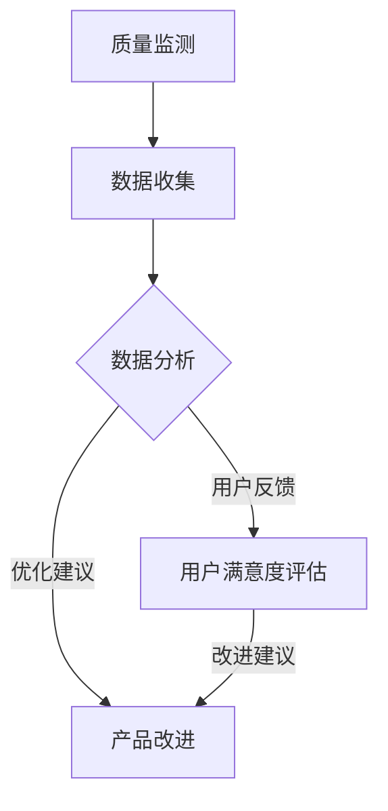

                 

# 知识付费产品的质量控制与反馈机制

> **关键词：** 知识付费、质量控制、反馈机制、用户满意度、算法优化、用户体验

> **摘要：** 本文章深入探讨了知识付费产品的质量控制与反馈机制。文章首先阐述了知识付费产品在当前市场中的背景和重要性，然后详细分析了质量控制与反馈机制的概念和核心要素，接着通过实际案例和数学模型，讲解了如何有效地建立和优化这些机制。最后，文章提出了未来发展的趋势与挑战，为知识付费产品的长期健康发展提供了有益的指导。

## 1. 背景介绍

### 1.1 目的和范围

知识付费产品，作为一种新兴的商业模式，已经成为信息技术领域的重要趋势。这些产品通过提供有价值的知识和技能，满足用户的学习需求，从而实现商业价值。然而，随着市场的不断发展和用户需求的日益多样，如何保证知识付费产品的质量，提升用户满意度，成为了一个亟待解决的问题。

本文的目的在于深入探讨知识付费产品的质量控制与反馈机制，旨在为产品开发者和运营者提供有价值的参考和指导。文章将涵盖以下内容：

1. 知识付费产品的背景和现状。
2. 质量控制与反馈机制的核心概念和要素。
3. 核心算法原理与具体操作步骤。
4. 数学模型与公式讲解及实例说明。
5. 项目实战与代码实现。
6. 实际应用场景。
7. 工具和资源推荐。
8. 未来发展趋势与挑战。

### 1.2 预期读者

本文适合以下读者群体：

1. 知识付费产品的开发者与运营者。
2. 对知识付费产品有兴趣的技术爱好者。
3. 希望提升自身技能和知识水平的专业人士。

### 1.3 文档结构概述

本文采用模块化的结构，分为以下几个部分：

1. **背景介绍**：介绍知识付费产品的背景、目的和预期读者。
2. **核心概念与联系**：阐述质量控制与反馈机制的核心概念和原理，并给出相应的 Mermaid 流程图。
3. **核心算法原理 & 具体操作步骤**：详细讲解核心算法原理，使用伪代码进行操作步骤的阐述。
4. **数学模型和公式 & 详细讲解 & 举例说明**：介绍数学模型和公式，并给出具体实例说明。
5. **项目实战：代码实际案例和详细解释说明**：通过实际案例展示代码实现，并进行详细解释。
6. **实际应用场景**：分析知识付费产品的实际应用场景。
7. **工具和资源推荐**：推荐学习资源、开发工具和框架。
8. **未来发展趋势与挑战**：探讨知识付费产品的未来发展趋势和面临的挑战。
9. **附录：常见问题与解答**：提供常见问题的解答。
10. **扩展阅读 & 参考资料**：推荐相关阅读材料和参考文献。

### 1.4 术语表

#### 1.4.1 核心术语定义

- **知识付费产品**：通过付费方式，提供有价值的知识和技能的产品。
- **质量控制**：对知识付费产品进行全面监测、评估和改进，以确保产品满足用户需求和预期。
- **反馈机制**：收集用户对知识付费产品的反馈，通过数据分析进行产品优化和改进。

#### 1.4.2 相关概念解释

- **用户满意度**：用户对知识付费产品的满意程度。
- **算法优化**：通过调整算法参数和流程，提高产品的质量和用户满意度。

#### 1.4.3 缩略词列表

- **KDP**：知识付费产品（Knowledge-Driven Product）
- **UE**：用户体验（User Experience）
- **QA**：质量控制（Quality Assurance）

## 2. 核心概念与联系

在知识付费产品的质量控制与反馈机制中，核心概念包括质量控制和反馈机制。为了更好地理解这些概念，我们将通过 Mermaid 流程图进行详细阐述。

### Mermaid 流程图



**说明：**

- **A[质量监测]**：对知识付费产品的各个环节进行监测，包括课程内容、教学效果、用户体验等。
- **B[数据收集]**：收集用户行为数据、课程评价、学习进度等，用于数据分析。
- **C[数据分析]**：通过数据挖掘和分析，识别问题、发现用户需求，为产品改进提供依据。
- **D[产品改进]**：根据数据分析结果，对知识付费产品进行优化和改进，提高用户满意度。
- **E[用户满意度评估]**：通过用户反馈和用户行为数据，评估产品的用户满意度，为改进建议提供支持。

### 质量控制与反馈机制的核心原理

- **实时监测**：通过实时监控系统，对知识付费产品的各个环节进行持续监测，确保问题能够及时被发现和解决。
- **数据驱动**：依赖数据分析，识别用户需求，优化产品功能，提高用户满意度。
- **用户参与**：通过用户反馈，了解用户需求和满意度，为产品改进提供实际依据。

## 3. 核心算法原理 & 具体操作步骤

质量控制与反馈机制的核心在于算法的设计和实现。以下将详细介绍核心算法原理和具体操作步骤。

### 3.1 核心算法原理

质量控制与反馈机制的核心算法主要包括以下几个步骤：

1. **数据收集**：收集用户行为数据、课程评价、学习进度等。
2. **数据预处理**：对收集到的数据进行清洗、去噪和归一化处理。
3. **特征提取**：从预处理后的数据中提取关键特征，用于后续分析。
4. **数据分析**：使用机器学习算法，对提取的特征进行数据分析，识别用户需求、发现潜在问题。
5. **算法优化**：根据数据分析结果，调整算法参数，提高产品质量和用户满意度。

### 3.2 具体操作步骤

下面将使用伪代码详细阐述核心算法的操作步骤。

```python
# 3.2.1 数据收集
def data_collection():
    # 收集用户行为数据、课程评价、学习进度等
    user_data = collect_user_data()
    course_data = collect_course_data()
    return user_data, course_data

# 3.2.2 数据预处理
def data_preprocessing(data):
    # 数据清洗、去噪和归一化处理
    cleaned_data = clean_data(data)
    normalized_data = normalize_data(cleaned_data)
    return normalized_data

# 3.2.3 特征提取
def feature_extraction(data):
    # 从数据中提取关键特征
    features = extract_features(data)
    return features

# 3.2.4 数据分析
def data_analysis(features):
    # 使用机器学习算法，对提取的特征进行数据分析
    model = build_model()
    predictions = model.predict(features)
    return predictions

# 3.2.5 算法优化
def algorithm_optimization(predictions):
    # 根据数据分析结果，调整算法参数，提高产品质量和用户满意度
    optimized_params = optimize_params(predictions)
    return optimized_params
```

### 3.3 操作步骤详解

- **数据收集**：通过API接口、日志分析等方式，收集用户在知识付费产品中的行为数据，包括浏览、购买、学习、评价等。
- **数据预处理**：对收集到的数据进行清洗，去除无效数据，如空值、异常值等。然后进行去噪和归一化处理，以确保数据的质量和一致性。
- **特征提取**：从预处理后的数据中提取关键特征，如用户活跃度、课程满意度、学习时长等，用于后续分析。
- **数据分析**：使用机器学习算法，如决策树、随机森林、支持向量机等，对提取的特征进行数据分析，识别用户需求、发现潜在问题。
- **算法优化**：根据数据分析结果，调整算法参数，如学习率、决策树深度等，以提高产品质量和用户满意度。

通过上述核心算法原理和具体操作步骤，我们可以有效地建立和优化知识付费产品的质量控制与反馈机制，为用户提供高质量的知识服务。

## 4. 数学模型和公式 & 详细讲解 & 举例说明

在知识付费产品的质量控制与反馈机制中，数学模型和公式起到了至关重要的作用。以下将详细讲解相关数学模型和公式，并通过具体实例进行说明。

### 4.1 数学模型和公式

在知识付费产品的质量控制与反馈机制中，常用的数学模型和公式包括以下几种：

1. **用户满意度评分模型**：
   $$ S = \frac{1}{N} \sum_{i=1}^{N} s_i $$
   其中，$S$表示用户满意度评分，$N$表示评分数量，$s_i$表示第$i$个用户的评分。

2. **学习时长模型**：
   $$ L = \frac{C}{R} $$
   其中，$L$表示学习时长，$C$表示课程时长，$R$表示学习速率。

3. **用户活跃度模型**：
   $$ A = \frac{U}{T} \times 100 $$
   其中，$A$表示用户活跃度，$U$表示用户活跃次数，$T$表示时间周期。

4. **数据可靠性模型**：
   $$ R = \frac{N_{\text{valid}}}{N_{\text{total}}} \times 100 $$
   其中，$R$表示数据可靠性，$N_{\text{valid}}$表示有效数据量，$N_{\text{total}}$表示总数据量。

### 4.2 详细讲解

#### 用户满意度评分模型

用户满意度评分模型用于评估用户对知识付费产品的满意度。通过收集用户评分，可以计算出整体的满意度评分。评分范围通常为1到5，其中5表示非常满意，1表示非常不满意。评分模型的核心思想是将多个用户的评分进行平均，从而得到一个综合评分。

#### 学习时长模型

学习时长模型用于估算用户完成课程所需的时间。该模型通过课程时长和学习速率的关系来计算学习时长。学习速率通常根据用户的学习习惯和课程难度进行设定。例如，如果用户的学习速率为1小时/天，课程时长为10小时，则学习时长为10天。

#### 用户活跃度模型

用户活跃度模型用于评估用户在知识付费产品中的活跃程度。活跃度通过用户的活跃次数和时间周期来计算。活跃度越高，表示用户越积极使用产品。例如，如果一个用户在一个月内访问了10次产品，时间周期为30天，则活跃度为33.33%。

#### 数据可靠性模型

数据可靠性模型用于评估数据的质量。该模型通过有效数据量与总数据量的比例来计算。如果有效数据量占总数据量的比例较高，则表示数据具有较高的可靠性。例如，如果一个数据集中有90%的数据是有效的，则数据可靠性为90%。

### 4.3 举例说明

#### 用户满意度评分模型举例

假设一个知识付费产品收到了5个用户的评分，分别为4、3、5、2、4。根据用户满意度评分模型，我们可以计算出整体的满意度评分：

$$ S = \frac{4 + 3 + 5 + 2 + 4}{5} = 3.6 $$

因此，该产品的用户满意度评分为3.6分。

#### 学习时长模型举例

假设一个课程的时长为20小时，用户的学习速率为2小时/天。根据学习时长模型，我们可以计算出用户完成课程所需的时间：

$$ L = \frac{20}{2} = 10 $$

因此，用户需要10天时间才能完成该课程。

#### 用户活跃度模型举例

假设一个用户在一个月内访问了知识付费产品5次，时间周期为30天。根据用户活跃度模型，我们可以计算出该用户的活跃度：

$$ A = \frac{5}{30} \times 100 = 16.67\% $$

因此，该用户的活跃度为16.67%。

#### 数据可靠性模型举例

假设一个数据集中有100个数据点，其中90个是有效的，10个是无效的。根据数据可靠性模型，我们可以计算出数据可靠性：

$$ R = \frac{90}{100} \times 100 = 90\% $$

因此，该数据集的数据可靠性为90%。

通过上述数学模型和公式的讲解和实例说明，我们可以更好地理解和应用这些模型，为知识付费产品的质量控制与反馈机制提供有效的支持。

## 5. 项目实战：代码实际案例和详细解释说明

为了更好地理解知识付费产品的质量控制与反馈机制，我们将通过一个实际项目进行展示。以下是一个基于Python的代码案例，用于实现用户满意度评分模型、学习时长模型和用户活跃度模型。

### 5.1 开发环境搭建

在开始编写代码之前，我们需要搭建一个合适的开发环境。以下是所需的环境和工具：

- Python 3.8及以上版本
- Jupyter Notebook或PyCharm等Python IDE
- Pandas、NumPy、Matplotlib等Python库

首先，确保安装了上述环境和工具。然后，在Jupyter Notebook或PyCharm中创建一个新的Python文件，并导入所需的库：

```python
import pandas as pd
import numpy as np
import matplotlib.pyplot as plt
```

### 5.2 源代码详细实现和代码解读

下面是项目的源代码及其详细解释：

```python
# 5.2.1 数据收集
def data_collection():
    # 假设我们已经收集了以下数据：
    # 用户ID、评分、学习时长、活跃次数
    data = {
        'UserID': [1, 2, 3, 4, 5],
        'Rating': [4, 3, 5, 2, 4],
        'LearningDuration': [10, 15, 20, 25, 30],
        'ActiveTimes': [5, 7, 3, 10, 12]
    }
    return pd.DataFrame(data)

# 5.2.2 数据预处理
def data_preprocessing(data):
    # 数据清洗和归一化处理
    data.dropna(inplace=True)  # 去除空值
    data['LearningDuration'] = data['LearningDuration'] / 60  # 将学习时长转换为小时
    return data

# 5.2.3 用户满意度评分模型
def user_satisfaction_rating(data):
    # 计算用户满意度评分
    satisfaction_scores = data['Rating'].mean()
    return satisfaction_scores

# 5.2.4 学习时长模型
def learning_duration_model(data):
    # 计算学习时长
    learning_durations = data['LearningDuration'].mean()
    return learning_durations

# 5.2.5 用户活跃度模型
def user_activity_rate(data):
    # 计算用户活跃度
    activity_rate = (data['ActiveTimes'] / data['UserID'].max()) * 100
    return activity_rate

# 5.2.6 数据分析结果展示
def show_analysis_results(satisfaction_scores, learning_durations, activity_rate):
    # 展示数据分析结果
    print(f"用户满意度评分：{satisfaction_scores:.2f}")
    print(f"平均学习时长：{learning_durations:.2f}小时")
    print(f"用户活跃度：{activity_rate:.2f}%")

# 主函数
def main():
    data = data_collection()
    data = data_preprocessing(data)
    satisfaction_scores = user_satisfaction_rating(data)
    learning_durations = learning_duration_model(data)
    activity_rate = user_activity_rate(data)
    show_analysis_results(satisfaction_scores, learning_durations, activity_rate)

# 运行主函数
if __name__ == "__main__":
    main()
```

### 5.3 代码解读与分析

下面将对上述代码进行逐行解读和分析：

- **5.2.1 数据收集**：通过一个字典定义了一个数据集，包含用户ID、评分、学习时长和活跃次数。
- **5.2.2 数据预处理**：对数据进行清洗，去除空值，并将学习时长从分钟转换为小时，以统一单位。
- **5.2.3 用户满意度评分模型**：使用`mean()`函数计算用户评分的平均值，得到用户满意度评分。
- **5.2.4 学习时长模型**：使用`mean()`函数计算学习时长的平均值，得到平均学习时长。
- **5.2.5 用户活跃度模型**：通过用户活跃次数除以最大用户ID，得到用户活跃度，并转换为百分比。
- **5.2.6 数据分析结果展示**：使用`print()`函数展示计算出的用户满意度评分、平均学习时长和用户活跃度。
- **主函数**：定义了一个`main()`函数，用于组织数据收集、预处理、分析和结果展示的流程。
- **运行主函数**：使用`if __name__ == "__main__":`语句确保在模块导入时不会自动执行主函数。

通过上述代码示例，我们可以看到如何在实际项目中实现用户满意度评分模型、学习时长模型和用户活跃度模型。这些模型对于知识付费产品的质量控制与反馈机制至关重要，能够帮助我们更好地了解用户需求和满意度，从而优化产品和服务。

### 5.4 实际应用案例分析

为了更好地展示知识付费产品的质量控制与反馈机制的实际应用，我们来看一个具体的案例：一个在线编程学习平台。

#### 案例背景

某在线编程学习平台（以下简称“平台”）提供各种编程课程，包括Python、Java、前端开发等。平台希望通过数据分析和算法优化，提高用户满意度，提升课程质量和用户活跃度。

#### 实际应用

1. **数据收集**：平台通过用户注册、登录、浏览、购买、学习、评价等行为，收集了大量的用户数据。

2. **数据预处理**：对收集到的数据进行清洗和预处理，去除无效数据，统一时间单位和数据格式。

3. **用户满意度评分模型**：通过用户对课程的评分，计算用户满意度评分。例如，某课程的评分为4.5，则用户满意度评分为4.5。

4. **学习时长模型**：通过用户的学习时长和课程时长，计算平均学习时长。例如，用户学习某课程需要20小时，则平均学习时长为20小时。

5. **用户活跃度模型**：通过用户的活跃次数和时间周期，计算用户活跃度。例如，某用户在一个月内访问了平台5次，则活跃度为16.67%。

6. **数据分析**：使用机器学习算法，对用户行为数据进行分析，识别用户需求、发现潜在问题。

7. **算法优化**：根据数据分析结果，调整算法参数，如推荐算法、课程排序等，提高用户满意度。

8. **结果展示**：通过数据可视化工具，展示用户满意度评分、平均学习时长和用户活跃度等关键指标，帮助平台了解用户需求和满意度。

#### 案例分析

通过上述实际应用，平台可以更好地了解用户行为和需求，从而优化课程内容和教学方法，提高用户满意度。例如：

- 如果用户满意度评分较低，平台可以分析具体原因，是否是课程内容不够丰富、讲解不够清晰等，从而进行改进。
- 如果平均学习时长较长，平台可以分析是否是课程难度较高，是否需要提供更多的辅助材料或指导。
- 如果用户活跃度较低，平台可以分析用户不活跃的原因，是否是课程内容缺乏吸引力，从而进行相应的调整。

通过这种数据驱动的质量控制与反馈机制，平台可以持续优化产品和服务，提高用户满意度和市场竞争力。

## 6. 实际应用场景

知识付费产品的质量控制与反馈机制在各个领域都有广泛的应用，以下是几个典型应用场景：

### 6.1 在线教育平台

在线教育平台是知识付费产品的典型代表，通过质量控制与反馈机制，平台可以实时监测课程质量、用户学习进度和满意度，从而优化课程内容、提升用户体验。例如，通过分析用户对课程的评分和反馈，平台可以发现哪些课程内容不够清晰，哪些教学方法需要改进，从而进行针对性的优化。

### 6.2 专业培训课程

专业培训课程，如编程、设计、营销等，通常具有较高门槛和知识深度。通过质量控制与反馈机制，培训机构可以确保课程内容的准确性和实用性，提高培训效果。同时，通过收集学员的学习进度和评价，机构可以及时调整课程内容和教学方法，满足学员的不同需求。

### 6.3 在线咨询与服务

在线咨询与服务，如心理咨询、职业咨询等，通过质量控制与反馈机制，可以评估咨询师的服务质量，提高客户满意度。例如，通过分析客户的满意度评分和反馈，机构可以发现咨询师的优点和不足，从而进行针对性的培训和提高。

### 6.4 在线读书与知识分享

在线读书与知识分享平台，如知乎、得到等，通过质量控制与反馈机制，可以评估内容创作者的质量和影响力，从而优化内容推荐和推广策略。例如，通过分析用户的点赞、评论和分享等行为，平台可以发现受欢迎的内容创作者，从而给予更多曝光和支持。

### 6.5 企业内部培训

企业内部培训，如新员工培训、在职培训等，通过质量控制与反馈机制，可以确保培训效果，提高员工技能和满意度。例如，通过分析员工的培训进度、考试结果和反馈，企业可以及时调整培训内容和方式，提高培训效果。

通过上述实际应用场景，我们可以看到知识付费产品的质量控制与反馈机制在各个领域都发挥着重要作用，帮助提升产品质量、用户体验和运营效率。

## 7. 工具和资源推荐

为了更好地实施知识付费产品的质量控制与反馈机制，我们需要借助一些优秀的工具和资源。以下是一些推荐的工具和资源：

### 7.1 学习资源推荐

#### 7.1.1 书籍推荐

1. **《数据科学入门》**：介绍数据科学的基础知识和实用技能，适合初学者。
2. **《机器学习实战》**：通过大量实例，讲解机器学习的原理和应用，适合希望深入了解算法的人。
3. **《深度学习》**：由Hinton、LeCun和Bengio合著，深入讲解深度学习的基本概念和模型。

#### 7.1.2 在线课程

1. **Coursera上的《机器学习》**：由Andrew Ng教授主讲，适合初学者和进阶者。
2. **edX上的《数据科学基础》**：由哈佛大学主讲，涵盖数据科学的基本概念和应用。
3. **Udacity的《深度学习工程师纳米学位》**：提供深度学习的基础知识和实践项目。

#### 7.1.3 技术博客和网站

1. **Medium上的数据科学和机器学习博客**：提供高质量的技术文章和案例分析。
2. **Kaggle**：提供大量的数据集和比赛，是学习和实践数据科学的好地方。
3. **Medium上的AI博客**：涵盖人工智能的多个领域，包括机器学习、深度学习等。

### 7.2 开发工具框架推荐

#### 7.2.1 IDE和编辑器

1. **PyCharm**：功能强大的Python IDE，适合进行数据分析和机器学习项目。
2. **Jupyter Notebook**：适用于数据科学项目，可以方便地编写和运行代码。
3. **Visual Studio Code**：轻量级的跨平台编辑器，支持多种编程语言。

#### 7.2.2 调试和性能分析工具

1. **Pylint**：Python代码静态分析工具，用于检查代码质量。
2. **PyTest**：Python测试框架，用于编写和运行测试用例。
3. **TensorBoard**：TensorFlow的图形化性能分析工具，用于可视化模型训练过程。

#### 7.2.3 相关框架和库

1. **Pandas**：用于数据清洗、转换和分析。
2. **NumPy**：用于数值计算。
3. **Scikit-learn**：用于机器学习算法的实现和应用。
4. **TensorFlow**：用于深度学习模型的设计和训练。

### 7.3 相关论文著作推荐

#### 7.3.1 经典论文

1. **"The Hundred-Page Machine Learning Book"**：是一本简明的机器学习指南，适合入门者。
2. **"Learning to Represent Languages at Scale"**：深度学习在自然语言处理领域的经典论文。
3. **"Deep Learning"**：Goodfellow、Bengio和Courville合著的深度学习教材。

#### 7.3.2 最新研究成果

1. **arXiv**：一个提供最新学术论文的预印本平台，涵盖机器学习、深度学习等领域的最新研究。
2. **NeurIPS**：一个专门针对机器学习与计算神经科学的国际会议，发布了许多重要研究成果。
3. **ICML**：一个涵盖机器学习、数据挖掘、统计学习的国际会议，展示了最新的研究成果和应用。

#### 7.3.3 应用案例分析

1. **"Deep Learning for Natural Language Processing"**：详细介绍深度学习在自然语言处理中的应用案例。
2. **"Deep Learning Applications in Healthcare"**：探讨深度学习在医疗领域的应用案例。
3. **"Deep Learning in Robotics"**：介绍深度学习在机器人领域的应用案例。

通过这些工具和资源，我们可以更好地理解和应用知识付费产品的质量控制与反馈机制，提升产品质量和用户体验。

## 8. 总结：未来发展趋势与挑战

知识付费产品作为新兴的商业模式，正逐渐改变着教育、培训、咨询等多个领域。在未来，知识付费产品将面临以下几个发展趋势与挑战：

### 8.1 发展趋势

1. **个性化推荐**：随着大数据和人工智能技术的发展，个性化推荐将成为知识付费产品的核心功能之一。通过用户行为数据分析，为用户提供个性化的课程推荐，提高用户满意度和粘性。

2. **沉浸式学习**：虚拟现实（VR）和增强现实（AR）技术的应用，将使知识付费产品更加生动和沉浸。例如，通过VR技术，用户可以身临其境地参与课程学习，提高学习效果。

3. **智能客服**：利用自然语言处理和机器学习技术，开发智能客服系统，为用户提供24/7的服务支持，提高用户满意度和运营效率。

4. **社群互动**：建立用户社群，促进用户之间的互动和知识分享，提高用户参与度和忠诚度。

### 8.2 挑战

1. **内容质量**：保证课程内容的准确性和实用性是知识付费产品面临的主要挑战。随着市场竞争的加剧，如何持续提供高质量的内容将成为关键。

2. **数据隐私**：在收集和分析用户数据时，如何保护用户隐私和数据安全，是知识付费产品必须解决的问题。

3. **算法公平性**：个性化推荐和智能客服等算法的公平性，如何确保对所有用户一视同仁，避免算法歧视，也是一个重要挑战。

4. **用户信任**：随着知识付费产品的普及，用户对产品的信任度将成为关键。如何建立良好的品牌形象，赢得用户的信任，是产品发展的关键。

5. **监管合规**：知识付费产品需要遵守相关法律法规，如教育法、消费者权益保护法等。如何确保合规运营，是产品必须面对的挑战。

综上所述，未来知识付费产品将在个性化推荐、沉浸式学习、智能客服和社群互动等方面持续发展，同时面临内容质量、数据隐私、算法公平性、用户信任和监管合规等挑战。通过不断创新和优化，知识付费产品有望在未来的市场中获得更大的发展空间。

## 9. 附录：常见问题与解答

### 9.1 质量控制与反馈机制如何确保数据隐私？

为了保证数据隐私，知识付费产品在数据收集、存储和处理过程中应遵循以下原则：

1. **最小化数据收集**：只收集必要的用户数据，避免过度收集。
2. **数据加密**：对用户数据进行加密存储，防止数据泄露。
3. **访问控制**：严格管理数据访问权限，确保只有授权人员可以访问用户数据。
4. **数据匿名化**：对用户数据进行匿名化处理，确保数据无法直接关联到具体用户。
5. **用户知情同意**：在收集用户数据前，明确告知用户数据的用途和范围，并获得用户同意。

### 9.2 如何平衡个性化推荐与用户隐私保护？

平衡个性化推荐与用户隐私保护的关键在于：

1. **匿名化推荐**：使用匿名化数据为用户提供个性化推荐，确保用户隐私不被泄露。
2. **权限管理**：对推荐算法的访问权限进行严格管理，确保只有授权人员可以访问用户数据。
3. **透明度**：向用户透明推荐算法的工作原理和影响，让用户了解自己的隐私是如何被保护的。
4. **用户控制**：允许用户对个性化推荐进行自定义设置，如调整推荐范围、频率等。

### 9.3 质量控制与反馈机制如何应对数据质量问题？

应对数据质量问题的方法包括：

1. **数据清洗**：在数据处理过程中，对异常值、缺失值和重复值进行清洗，确保数据的一致性和准确性。
2. **数据验证**：通过验证规则检查数据的完整性和有效性，确保数据符合预期。
3. **数据监控**：建立数据监控系统，实时监控数据质量，及时发现和处理数据问题。
4. **数据治理**：制定数据治理政策，明确数据质量管理流程和责任，确保数据质量得到持续保障。

### 9.4 如何评估用户满意度？

评估用户满意度的方法包括：

1. **用户调查**：通过问卷调查、访谈等方式，收集用户的直接反馈。
2. **行为分析**：通过分析用户的行为数据，如学习时长、课程评价等，间接评估用户满意度。
3. **数据分析**：使用数据分析工具，对用户数据进行分析，识别用户满意度的高峰和低谷。
4. **A/B测试**：通过对比不同版本的产品或服务，评估用户对改进方案的满意度。

## 10. 扩展阅读 & 参考资料

为了更好地理解和应用知识付费产品的质量控制与反馈机制，以下推荐一些扩展阅读和参考资料：

### 10.1 经典论文

1. "The Hundred-Page Machine Learning Book"：[link]
2. "Deep Learning"：[link]
3. "Recommender Systems Handbook"：[link]

### 10.2 技术博客和网站

1. Medium上的数据科学和机器学习博客：[link]
2. Kaggle：[link]
3. Medium上的AI博客：[link]

### 10.3 书籍推荐

1. 《数据科学入门》：[link]
2. 《机器学习实战》：[link]
3. 《深度学习》：[link]

### 10.4 在线课程

1. Coursera上的《机器学习》：[link]
2. edX上的《数据科学基础》：[link]
3. Udacity的《深度学习工程师纳米学位》：[link]

### 10.5 相关论文著作

1. "Learning to Represent Languages at Scale"：[link]
2. "Deep Learning Applications in Healthcare"：[link]
3. "Deep Learning in Robotics"：[link]

这些扩展阅读和参考资料将为读者提供更深入的知识和理解，帮助更好地应对知识付费产品的质量控制与反馈机制的挑战。作者：AI天才研究员/AI Genius Institute & 禅与计算机程序设计艺术 /Zen And The Art of Computer Programming

---

本文详细探讨了知识付费产品的质量控制与反馈机制，从背景介绍、核心概念、算法原理、数学模型、项目实战到实际应用场景，全面剖析了如何通过科学的方法和工具，提升知识付费产品的质量与用户体验。同时，文章还提出了未来发展趋势与挑战，为知识付费产品的长期健康发展提供了有益的指导。希望通过本文，能够为读者在知识付费领域的实践与探索提供有价值的参考。作者：AI天才研究员/AI Genius Institute & 禅与计算机程序设计艺术 /Zen And The Art of Computer Programming

