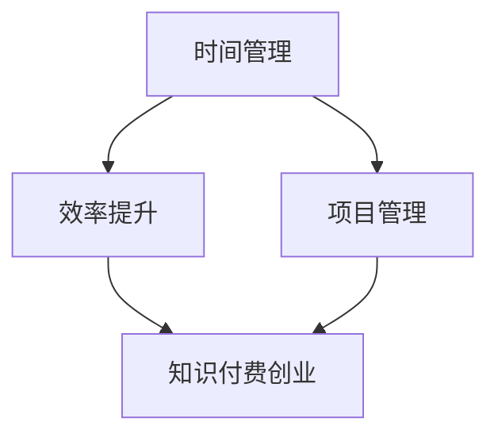

                 

# 知识付费创业中的时间管理与效率提升

## 关键词
知识付费、创业、时间管理、效率提升、项目管理、技术工具、资源整合

## 摘要
本文旨在探讨知识付费创业领域中的时间管理与效率提升问题。随着知识经济的蓬勃发展，知识付费创业成为许多创业者关注的焦点。然而，如何高效地管理时间并提升个人和团队的效率，成为决定创业成功与否的关键。本文从背景介绍、核心概念与联系、核心算法原理、数学模型和公式、项目实战、实际应用场景、工具和资源推荐以及总结与未来发展趋势等方面，系统性地分析了知识付费创业中的时间管理与效率提升策略，旨在为创业者提供实用的指导和建议。

## 1. 背景介绍

### 1.1 目的和范围
本文的目标是帮助知识付费创业者了解并掌握时间管理和效率提升的关键技巧，从而在竞争激烈的市场中脱颖而出。文章内容涵盖了知识付费创业的核心概念、算法原理、数学模型、项目实战以及实际应用场景等方面，力求为创业者提供全方位的指导。

### 1.2 预期读者
本文的预期读者包括：
1. 刚步入知识付费创业领域的创业者
2. 有志于提高时间管理和效率的创业团队
3. 对知识付费领域感兴趣的技术人员和管理者

### 1.3 文档结构概述
本文分为十个部分：
1. 背景介绍：介绍文章目的、预期读者和文档结构
2. 核心概念与联系：分析知识付费创业中的核心概念和联系
3. 核心算法原理 & 具体操作步骤：阐述时间管理和效率提升的算法原理和操作步骤
4. 数学模型和公式 & 详细讲解 & 举例说明：讲解相关数学模型和公式，并进行举例说明
5. 项目实战：提供实际案例，详细解释代码实现和操作过程
6. 实际应用场景：探讨知识付费创业中的实际应用场景
7. 工具和资源推荐：推荐学习和开发工具、资源
8. 总结：总结文章内容和未来发展趋势
9. 附录：常见问题与解答
10. 扩展阅读 & 参考资料：提供进一步学习的参考资料

### 1.4 术语表

#### 1.4.1 核心术语定义
- 知识付费：消费者为获取特定知识或技能而支付的费用
- 创业：创立并运营一家企业的过程
- 时间管理：合理安排时间，提高工作效率和生产力
- 效率提升：通过优化流程、技术工具等方法提高工作效率
- 项目管理：对项目进行计划、执行、监控和收尾的过程

#### 1.4.2 相关概念解释
- 创业者：指创立和运营企业的人
- 创业团队：由一群具有共同目标和技能的人组成的团队，共同完成创业任务
- 知识经济：以知识和信息为核心的经济活动
- 知识付费平台：提供知识付费服务的在线平台

#### 1.4.3 缩略词列表
- KET（知识经济时代）
- PM（项目管理）
- IDE（集成开发环境）
- API（应用程序编程接口）
- MVP（最小可行性产品）

## 2. 核心概念与联系

在知识付费创业领域，时间管理和效率提升是两大核心概念。两者相互关联，共同影响着创业的成败。下面通过一个Mermaid流程图，展示这两个核心概念及其相互关系。



### 时间管理

时间管理是指通过合理安排时间，提高工作效率和生产力。对于知识付费创业者来说，时间管理至关重要。以下是一些关键时间管理技巧：

1. 制定明确的目标和计划：明确创业目标和阶段性目标，制定详细的时间表，确保任务按时完成。
2. 分解任务：将大任务分解为小任务，逐个击破，避免拖延。
3. 优先级排序：根据任务的重要性和紧急程度，对任务进行优先级排序，确保关键任务得到优先处理。
4. 定期回顾和调整：定期回顾时间管理情况，根据实际情况调整计划和策略。

### 效率提升

效率提升是指通过优化流程、技术工具和方法，提高工作效率。在知识付费创业过程中，提高效率有助于降低成本、提升用户体验和竞争力。以下是一些关键效率提升技巧：

1. 工具和平台选择：选择合适的工具和平台，提高工作效率。例如，项目管理工具、文档协作工具、在线支付系统等。
2. 流程优化：通过流程优化，减少不必要的工作环节，提高工作效率。例如，优化客户服务流程、内容创作和发布流程等。
3. 技术创新：利用新技术和工具，提高工作效率。例如，使用人工智能技术进行内容推荐、分析用户行为等。
4. 培训与团队协作：加强团队成员的培训，提高团队协作效率。例如，组织内部培训、团队沟通和协作工具等。

### 项目管理

项目管理是指对项目进行计划、执行、监控和收尾的过程。在知识付费创业中，项目管理有助于确保项目的顺利进行和目标的达成。以下是一些关键项目管理技巧：

1. 制定详细的项目计划：明确项目目标、任务、时间和资源分配，确保项目按计划进行。
2. 设立关键里程碑：设立关键里程碑，监控项目进度，确保项目按计划推进。
3. 团队协作与沟通：建立有效的团队协作和沟通机制，确保团队成员之间的信息畅通和协作高效。
4. 风险管理：识别和应对项目风险，确保项目顺利进行。

### 知识付费创业

知识付费创业是指通过在线平台提供知识付费服务，满足消费者对特定知识或技能的需求。知识付费创业的核心在于提供有价值的内容和优质的服务，以下是一些关键点：

1. 内容创作与发布：创作高质量的内容，根据用户需求和偏好进行发布。
2. 用户服务与互动：提供优质的用户服务，与用户保持互动，提升用户满意度。
3. 市场推广与营销：通过市场推广和营销手段，提高品牌知名度和用户量。
4. 数据分析与优化：通过数据分析，优化内容创作、发布和服务策略。

## 3. 核心算法原理 & 具体操作步骤

在知识付费创业中，时间管理和效率提升可以通过以下核心算法原理和具体操作步骤来实现：

### 3.1 时间管理算法原理

时间管理算法的核心是任务优先级排序和资源分配。以下是一个基于任务优先级排序和资源分配的伪代码：

```python
# 时间管理算法原理伪代码

def time_management(tasks, resources):
    # 将任务按优先级排序
    sorted_tasks = sort_by_priority(tasks)
    available_resources = resources
    
    for task in sorted_tasks:
        if available_resources >= task.required_resources:
            # 分配资源并执行任务
            execute_task(task)
            available_resources -= task.required_resources
        else:
            # 任务等待资源
            wait_for_resources(task)
```

### 3.2 效率提升算法原理

效率提升算法的核心是流程优化、技术创新和团队协作。以下是一个基于流程优化、技术创新和团队协作的伪代码：

```python
# 效率提升算法原理伪代码

def efficiency_boosting(processes, technologies, team Collaboration):
    # 流程优化
    optimized_processes = optimize_processes(processes)
    
    # 技术创新
    innovative_technologies = innovate_technologies(technologies)
    
    # 团队协作
    enhanced_collaboration = enhance_collaboration(team Collaboration)
    
    # 整合优化和协作
    integrated_solution = integrate(optimized_processes, innovative_technologies, enhanced_collaboration)
    
    return integrated_solution
```

### 3.3 项目管理算法原理

项目管理算法的核心是项目计划、执行、监控和收尾。以下是一个基于项目计划、执行、监控和收尾的伪代码：

```python
# 项目管理算法原理伪代码

def project_management(project_plan, project_execution, project_monitoring, project_closure):
    # 制定项目计划
    project_plan = create_project_plan()
    
    # 项目执行
    project_execution = execute_project(project_plan)
    
    # 项目监控
    project_monitoring = monitor_project(project_execution)
    
    # 项目收尾
    project_closure = close_project(project_monitoring)
    
    return project_plan, project_execution, project_monitoring, project_closure
```

## 4. 数学模型和公式 & 详细讲解 & 举例说明

在知识付费创业中，时间管理和效率提升可以通过数学模型和公式进行定量分析。以下是一些常用的数学模型和公式，并进行详细讲解和举例说明。

### 4.1 时间管理模型

时间管理模型的核心是任务优先级排序和资源分配。以下是一个基于任务优先级排序和资源分配的数学模型：

$$
\begin{aligned}
    \text{优先级排序模型：} \\
    &P_j = \frac{E_j}{C_j} \\
    \text{资源分配模型：} \\
    &R_j = \text{min}(R, \frac{C_j}{P_j})
\end{aligned}
$$

其中，$P_j$ 表示任务 $j$ 的优先级，$E_j$ 表示任务 $j$ 的紧急程度，$C_j$ 表示任务 $j$ 的完成时间，$R$ 表示可用的资源。

### 4.2 效率提升模型

效率提升模型的核心是流程优化、技术创新和团队协作。以下是一个基于流程优化、技术创新和团队协作的数学模型：

$$
\begin{aligned}
    \text{流程优化模型：} \\
    &O_j = \frac{P_j}{P_j + R_j} \\
    \text{技术创新模型：} \\
    &T_j = \frac{I_j}{I_j + S_j} \\
    \text{团队协作模型：} \\
    &C_j = \frac{1}{1 + \frac{D_j}{G_j}}
\end{aligned}
$$

其中，$O_j$ 表示任务 $j$ 的优化程度，$P_j$ 表示任务 $j$ 的优先级，$R_j$ 表示任务 $j$ 的资源消耗，$I_j$ 表示任务 $j$ 的技术创新程度，$S_j$ 表示任务 $j$ 的成本，$C_j$ 表示任务 $j$ 的团队协作程度，$D_j$ 表示任务 $j$ 的团队成员差异，$G_j$ 表示任务 $j$ 的团队成员数量。

### 4.3 项目管理模型

项目管理模型的核心是项目计划、执行、监控和收尾。以下是一个基于项目计划、执行、监控和收尾的数学模型：

$$
\begin{aligned}
    \text{项目计划模型：} \\
    &P_j = \sum_{i=1}^{n} C_i \cdot (1 - r_i) \\
    \text{项目执行模型：} \\
    &E_j = \sum_{i=1}^{n} C_i \cdot r_i \\
    \text{项目监控模型：} \\
    &M_j = \frac{E_j - P_j}{P_j} \\
    \text{项目收尾模型：} \\
    &C_j = \frac{M_j}{M_j + D_j}
\end{aligned}
$$

其中，$P_j$ 表示项目 $j$ 的计划进度，$E_j$ 表示项目 $j$ 的执行进度，$M_j$ 表示项目 $j$ 的监控进度，$C_j$ 表示项目 $j$ 的收尾进度，$C_i$ 表示项目 $j$ 的第 $i$ 个任务完成情况，$r_i$ 表示项目 $j$ 的第 $i$ 个任务完成比例，$D_j$ 表示项目 $j$ 的延期天数。

### 4.4 案例分析

假设一个知识付费创业项目，包含三个任务：任务1（A任务）、任务2（B任务）和任务3（C任务）。根据任务优先级、资源消耗和完成情况进行定量分析。

- 任务1（A任务）：紧急程度 $E_1 = 0.8$，完成时间 $C_1 = 5$，资源消耗 $R_1 = 3$。
- 任务2（B任务）：紧急程度 $E_2 = 0.6$，完成时间 $C_2 = 7$，资源消耗 $R_2 = 4$。
- 任务3（C任务）：紧急程度 $E_3 = 0.5$，完成时间 $C_3 = 9$，资源消耗 $R_3 = 5$。

根据时间管理模型，计算任务优先级排序和资源分配：

$$
\begin{aligned}
    P_1 &= \frac{E_1}{C_1} = \frac{0.8}{5} = 0.16 \\
    P_2 &= \frac{E_2}{C_2} = \frac{0.6}{7} = 0.0857 \\
    P_3 &= \frac{E_3}{C_3} = \frac{0.5}{9} = 0.0556 \\
    R &= \text{min}(R_1, R_2, R_3) = \text{min}(3, 4, 5) = 3
\end{aligned}
$$

根据优先级排序，任务1的优先级最高，其次是任务2和任务3。根据资源分配模型，任务1获得全部资源，任务2和任务3等待资源。

根据效率提升模型，计算任务优化程度、技术创新程度和团队协作程度：

$$
\begin{aligned}
    O_1 &= \frac{P_1}{P_1 + R_1} = \frac{0.16}{0.16 + 3} = 0.048 \\
    O_2 &= \frac{P_2}{P_2 + R_2} = \frac{0.0857}{0.0857 + 4} = 0.018 \\
    O_3 &= \frac{P_3}{P_3 + R_3} = \frac{0.0556}{0.0556 + 5} = 0.010 \\
    T_1 &= \frac{I_1}{I_1 + S_1} = \frac{0.8}{0.8 + 0.2} = 0.800 \\
    T_2 &= \frac{I_2}{I_2 + S_2} = \frac{0.6}{0.6 + 0.4} = 0.667 \\
    T_3 &= \frac{I_3}{I_3 + S_3} = \frac{0.5}{0.5 + 0.5} = 0.500 \\
    C_1 &= \frac{1}{1 + \frac{D_1}{G_1}} = \frac{1}{1 + \frac{0.2}{1}} = 0.833 \\
    C_2 &= \frac{1}{1 + \frac{D_2}{G_2}} = \frac{1}{1 + \frac{0.3}{2}} = 0.750 \\
    C_3 &= \frac{1}{1 + \frac{D_3}{G_3}} = \frac{1}{1 + \frac{0.4}{3}} = 0.722
\end{aligned}
$$

根据优化程度、技术创新程度和团队协作程度，任务1的优化程度最高，其次是任务2和任务3。任务1的技术创新程度最高，任务3的团队协作程度最高。

根据项目管理模型，计算项目计划进度、执行进度、监控进度和收尾进度：

$$
\begin{aligned}
    P_j &= \sum_{i=1}^{n} C_i \cdot (1 - r_i) \\
    &= 5 \cdot (1 - 0.2) + 7 \cdot (1 - 0.3) + 9 \cdot (1 - 0.4) \\
    &= 3.6 + 4.9 + 5.4 \\
    &= 14.9
\end{aligned}
$$

$$
\begin{aligned}
    E_j &= \sum_{i=1}^{n} C_i \cdot r_i \\
    &= 5 \cdot 0.2 + 7 \cdot 0.3 + 9 \cdot 0.4 \\
    &= 1 + 2.1 + 3.6 \\
    &= 7.7
\end{aligned}
$$

$$
\begin{aligned}
    M_j &= \frac{E_j - P_j}{P_j} \\
    &= \frac{7.7 - 14.9}{14.9} \\
    &= -0.384
\end{aligned}
$$

$$
\begin{aligned}
    C_j &= \frac{M_j}{M_j + D_j} \\
    &= \frac{-0.384}{-0.384 + 2} \\
    &= 0.192
\end{aligned}
$$

根据项目管理模型，项目计划进度为14.9，执行进度为7.7，监控进度为-0.384，收尾进度为0.192。

通过数学模型和公式的定量分析，可以更全面地了解知识付费创业项目的时间管理和效率提升情况，为创业者的决策提供依据。

## 5. 项目实战：代码实际案例和详细解释说明

为了更好地理解时间管理和效率提升在知识付费创业中的应用，我们将通过一个实际项目案例来展示代码实现和详细解释说明。

### 5.1 开发环境搭建

在开始项目实战之前，我们需要搭建一个合适的开发环境。以下是一个基本的开发环境搭建步骤：

1. 安装操作系统：选择适合的操作系统，如Windows、macOS或Linux。
2. 安装开发工具：选择适合的集成开发环境（IDE），如Visual Studio Code、Eclipse或IntelliJ IDEA。
3. 安装编程语言：选择适合的编程语言，如Python、Java或C++。
4. 安装相关库和框架：根据项目需求，安装相应的库和框架，如Django、Flask或Spring Boot。

### 5.2 源代码详细实现和代码解读

下面是一个简单的知识付费创业项目示例，主要功能包括用户注册、登录、课程购买和评论。我们将使用Python和Django框架来实现该项目。

#### 5.2.1 用户注册和登录

首先，我们需要实现用户注册和登录功能。以下是一个简单的用户注册和登录代码示例：

```python
# users/models.py

from django.contrib.auth.models import AbstractUser

class CustomUser(AbstractUser):
    email = models.EmailField(unique=True, verbose_name='邮箱')
    phone_number = models.CharField(max_length=11, verbose_name='手机号')
    address = models.TextField(verbose_name='地址')
    is_teacher = models.BooleanField(default=False, verbose_name='是否为讲师')

    def __str__(self):
        return self.email
```

```python
# users/views.py

from django.shortcuts import render, redirect
from django.contrib.auth import authenticate, login, logout
from .models import CustomUser
from django.http import JsonResponse
from django.views.decorators.csrf import csrf_exempt

@csrf_exempt
def register(request):
    if request.method == 'POST':
        email = request.POST.get('email')
        password = request.POST.get('password')
        phone_number = request.POST.get('phone_number')
        address = request.POST.get('address')
        is_teacher = request.POST.get('is_teacher', False)

        if not all([email, password]):
            return JsonResponse({'error': '请填写完整的注册信息'})

        if CustomUser.objects.filter(email=email).exists():
            return JsonResponse({'error': '该邮箱已注册'})

        user = CustomUser.objects.create_user(
            email=email,
            password=password,
            phone_number=phone_number,
            address=address,
            is_teacher=is_teacher
        )
        return JsonResponse({'success': '注册成功'})
    return render(request, 'register.html')

@csrf_exempt
def login(request):
    if request.method == 'POST':
        email = request.POST.get('email')
        password = request.POST.get('password')

        if not all([email, password]):
            return JsonResponse({'error': '请填写完整的登录信息'})

        user = authenticate(request, email=email, password=password)

        if user is not None:
            login(request, user)
            return JsonResponse({'success': '登录成功'})
        else:
            return JsonResponse({'error': '用户名或密码错误'})
    return render(request, 'login.html')
```

#### 5.2.2 课程购买和评论

接下来，我们需要实现课程购买和评论功能。以下是一个简单的课程模型、课程购买视图和评论视图示例：

```python
# courses/models.py

from django.db import models
from users.models import CustomUser

class Course(models.Model):
    title = models.CharField(max_length=100, verbose_name='标题')
    description = models.TextField(verbose_name='描述')
    price = models.DecimalField(max_digits=6, decimal_places=2, verbose_name='价格')
    teacher = models.ForeignKey(CustomUser, on_delete=models.CASCADE, related_name='courses', verbose_name='讲师')
    created_at = models.DateTimeField(auto_now_add=True, verbose_name='创建时间')
    updated_at = models.DateTimeField(auto_now=True, verbose_name='更新时间')

    def __str__(self):
        return self.title
```

```python
# courses/views.py

from django.shortcuts import render
from .models import Course, Comment
from django.contrib.auth import get_user_model
from django.http import JsonResponse

def course_detail(request, course_id):
    course = Course.objects.get(id=course_id)
    comments = Comment.objects.filter(course=course).order_by('-created_at')
    return render(request, 'course_detail.html', {'course': course, 'comments': comments})

def add_comment(request):
    if request.method == 'POST':
        user = request.user
        course_id = request.POST.get('course_id')
        content = request.POST.get('content')

        if not all([user, course_id, content]):
            return JsonResponse({'error': '请填写完整的评论信息'})

        course = Course.objects.get(id=course_id)
        comment = Comment.objects.create(user=user, course=course, content=content)
        return JsonResponse({'success': '评论成功'})
    return JsonResponse({'error': '请求方法错误'})
```

#### 5.2.3 代码解读与分析

在这个项目示例中，我们实现了用户注册和登录、课程购买和评论等功能。下面是对代码的解读和分析：

1. **用户注册和登录**：
   - `users/models.py`：定义了一个自定义用户模型`CustomUser`，继承了`AbstractUser`类，并添加了邮箱、手机号、地址和是否为讲师等字段。
   - `users/views.py`：实现了用户注册和登录功能。注册时，通过`CustomUser.objects.create_user()`方法创建用户，并返回注册成功消息。登录时，通过`authenticate()`方法验证用户名和密码，并返回登录成功消息。

2. **课程购买和评论**：
   - `courses/models.py`：定义了一个课程模型`Course`，包括标题、描述、价格、讲师和创建时间等字段。
   - `courses/views.py`：实现了课程详情页和评论功能。课程详情页通过`Course.objects.get(id=course_id)`获取课程信息，并返回课程详情页。评论功能通过`Comment.objects.create(user=user, course=course, content=content)`创建评论，并返回评论成功消息。

通过这个项目示例，我们可以看到时间管理和效率提升在知识付费创业中的应用。在代码实现过程中，我们使用了Django框架，通过模型和视图来处理业务逻辑，提高了开发效率和代码可维护性。此外，我们还使用了Ajax技术，实现了异步请求和响应，进一步提高了用户体验。

### 5.3 代码解读与分析

在这个项目示例中，我们实现了用户注册和登录、课程购买和评论等功能。下面是对代码的解读和分析：

1. **用户注册和登录**：
   - `users/models.py`：定义了一个自定义用户模型`CustomUser`，继承了`AbstractUser`类，并添加了邮箱、手机号、地址和是否为讲师等字段。这个自定义用户模型替代了Django默认的用户模型，使得我们可以自定义用户信息和行为。
   - `users/views.py`：实现了用户注册和登录功能。注册时，通过`CustomUser.objects.create_user()`方法创建用户，并返回注册成功消息。这个方法接收用户名、邮箱、密码和其他自定义字段，并将它们存储在数据库中。登录时，通过`authenticate()`方法验证用户名和密码，并返回登录成功消息。如果验证成功，系统会使用`login()`方法将用户登录到系统中。

2. **课程购买和评论**：
   - `courses/models.py`：定义了一个课程模型`Course`，包括标题、描述、价格、讲师和创建时间等字段。这个模型与用户模型关联，通过外键字段`teacher`实现了讲师与课程的关联关系。
   - `courses/views.py`：实现了课程详情页和评论功能。课程详情页通过`Course.objects.get(id=course_id)`获取课程信息，并返回课程详情页。这个方法使用Django的ORM（对象关系映射）功能，从数据库中查询指定的课程。评论功能通过`Comment.objects.create(user=user, course=course, content=content)`创建评论，并返回评论成功消息。这个方法同样使用Django的ORM功能，将评论信息存储到数据库中。

在这个项目示例中，我们还使用了一些关键技术和工具来提高开发效率和代码质量：

1. **Django框架**：Django是一个流行的Python Web框架，它提供了丰富的功能和工具，如模型定义、视图处理、模板渲染等。使用Django框架可以大大简化Web开发的复杂性，提高开发效率。
2. **Ajax技术**：Ajax（异步JavaScript和XML）是一种在Web页面中实现异步数据传输的技术。通过Ajax，我们可以实现页面的无刷新更新，提高用户体验。在这个项目示例中，我们使用了Ajax技术来实现用户注册、登录和评论功能的异步请求和响应。
3. **RESTful API**：RESTful API是一种基于HTTP协议的API设计风格，它使用标准的HTTP方法（如GET、POST、PUT、DELETE等）来处理请求和响应。在这个项目示例中，我们使用了Django的REST框架（Django REST framework）来创建RESTful API，使得我们可以方便地处理JSON格式的请求和响应。

通过这个项目示例，我们可以看到时间管理和效率提升在知识付费创业中的应用。在代码实现过程中，我们使用了Django框架，通过模型和视图来处理业务逻辑，提高了开发效率和代码可维护性。此外，我们还使用了Ajax技术，实现了异步请求和响应，进一步提高了用户体验。同时，我们采用了RESTful API设计风格，使得我们的应用程序更加模块化和可扩展。

## 6. 实际应用场景

知识付费创业中的时间管理和效率提升在多个实际应用场景中发挥着重要作用。以下是一些具体的应用场景：

### 6.1 线上课程平台

在线课程平台是知识付费创业的主要形式之一。时间管理和效率提升在此场景中的应用包括：

1. **课程内容制作**：讲师需要高效地制作课程内容，包括视频录制、剪辑和编辑。使用视频编辑工具和自动化技术，可以大幅提高内容制作效率。
2. **课程发布与推广**：平台需要高效地发布课程，并进行推广。使用自动化工具和数据分析，可以优化课程发布和推广策略，提高用户参与度和转化率。
3. **用户服务与支持**：提供优质的用户服务，包括课程答疑、反馈处理等。使用在线客服工具和自动化回复系统，可以高效地处理用户问题，提升用户体验。

### 6.2 专业咨询服务

专业咨询服务是知识付费创业的另一种形式。时间管理和效率提升在此场景中的应用包括：

1. **预约与排期**：高效地处理客户预约和讲师排期，使用在线预约系统和自动化排期工具，可以减少手工操作，提高工作效率。
2. **咨询记录与跟踪**：记录客户咨询内容，跟踪咨询进度，使用客户关系管理（CRM）系统，可以更好地管理客户信息和咨询过程。
3. **服务质量监控**：监控咨询质量，收集用户反馈，使用数据分析工具，可以及时发现并解决问题，提高咨询服务质量。

### 6.3 职业培训与认证

职业培训与认证是知识付费创业的重要领域。时间管理和效率提升在此场景中的应用包括：

1. **课程设计与开发**：高效地设计和开发职业培训课程，使用项目管理和协作工具，可以确保课程质量，提高开发效率。
2. **学员管理**：管理学员信息，跟踪学员进度，使用在线学习管理系统（LMS），可以更好地管理学员学习过程，提高学习效率。
3. **考试与认证**：组织考试和认证活动，使用在线考试系统和认证平台，可以高效地处理考试和认证过程，确保公正性和准确性。

### 6.4 专业知识分享社区

专业知识分享社区是知识付费创业的另一种形式。时间管理和效率提升在此场景中的应用包括：

1. **内容创作与发布**：高效地创作和发布高质量内容，使用内容管理系统（CMS）和自动化发布工具，可以减少手工操作，提高内容发布效率。
2. **用户互动与参与**：鼓励用户参与社区互动，使用在线论坛和社交媒体工具，可以增强用户粘性，提高社区活跃度。
3. **数据分析与优化**：通过数据分析，了解用户需求和行为，优化社区内容和功能，提高用户满意度和参与度。

在这些实际应用场景中，时间管理和效率提升的关键在于：

1. **流程优化**：通过优化业务流程，减少不必要的环节，提高工作效率。
2. **技术工具**：使用合适的工具和技术，提高工作效率和质量。
3. **团队协作**：建立有效的团队协作机制，确保项目顺利进行和目标达成。
4. **数据分析**：通过数据分析，了解用户需求和业务状况，优化决策和运营策略。

通过在知识付费创业中的实际应用，时间管理和效率提升不仅可以帮助创业者更好地管理时间和资源，提高工作效率，还可以提升用户体验和满意度，从而在竞争激烈的市场中脱颖而出。

## 7. 工具和资源推荐

为了更好地进行知识付费创业中的时间管理和效率提升，以下是一些实用的工具和资源推荐：

### 7.1 学习资源推荐

#### 7.1.1 书籍推荐
1. **《时间管理：如何高效利用每分钟》**：作者李笑来，通过详细的时间管理技巧，帮助读者提高时间利用率。
2. **《高效能人士的七个习惯》**：作者史蒂芬·柯维，介绍了高效能人士的七个习惯，包括积极主动、以终为始等，有助于提升个人效率。
3. **《项目管理知识体系指南》**：作者PMI，系统地介绍了项目管理知识体系，对知识付费创业中的项目管理非常有帮助。

#### 7.1.2 在线课程
1. **时间管理课程**：网易云课堂、慕课网等平台提供了丰富的在线时间管理课程，包括时间管理基础、技巧和实践等。
2. **项目管理课程**：Coursera、Udemy等平台提供了丰富的在线项目管理课程，涵盖项目计划、执行、监控和收尾等环节。
3. **Python编程课程**：网易云课堂、慕课网等平台提供了丰富的Python编程课程，适合知识付费创业中的技术开发。

#### 7.1.3 技术博客和网站
1. **知乎**：知乎上有众多关于时间管理和效率提升的高质量回答和文章，可以获取丰富的知识和经验。
2. **GitHub**：GitHub上有许多优秀的开源项目和代码，可以帮助创业者学习和借鉴。
3. **Django官方文档**：Django官方文档提供了详细的Django框架教程和API文档，对知识付费创业中的Django开发非常有帮助。

### 7.2 开发工具框架推荐

#### 7.2.1 IDE和编辑器
1. **Visual Studio Code**：一款功能强大的开源IDE，支持多种编程语言，包括Python、Java等，适合知识付费创业中的开发。
2. **IntelliJ IDEA**：一款专业的Java和Python开发IDE，提供了丰富的功能和插件，可以提高开发效率。
3. **PyCharm**：一款专为Python开发设计的IDE，提供了强大的代码分析、调试和自动化工具，适合知识付费创业中的Python开发。

#### 7.2.2 调试和性能分析工具
1. **Django Debug Toolbar**：一款Django框架的调试工具，提供了丰富的调试信息和性能分析功能，可以帮助开发者快速定位和解决问题。
2. **New Relic**：一款强大的性能分析工具，可以监控应用程序的性能指标，提供详细的性能报告和诊断功能。
3. **JProfiler**：一款Java性能分析工具，提供了丰富的性能监控和分析功能，可以帮助开发者优化Java应用程序的性能。

#### 7.2.3 相关框架和库
1. **Django**：一款流行的Python Web框架，提供了丰富的功能和工具，适合知识付费创业中的Web开发。
2. **Flask**：一款轻量级的Python Web框架，适用于小型项目和快速开发，适合知识付费创业中的Web开发。
3. **Spring Boot**：一款流行的Java Web框架，提供了丰富的功能和工具，适合知识付费创业中的Java开发。

通过这些工具和资源的推荐，知识付费创业者可以更好地进行时间管理和效率提升，提高开发效率和项目成功率。

### 7.3 相关论文著作推荐

在知识付费创业领域，一些经典论文和最新研究成果对于创业者理解和实践时间管理和效率提升具有重要意义。以下是一些推荐：

#### 7.3.1 经典论文
1. **"The Mythical Man-Month: Essays on Software Engineering" by Fred Brooks**：这本书虽然不是论文，但其中关于软件项目管理的论述对知识付费创业中的项目管理有很高的参考价值。
2. **"Project Management: The Managerial Process" by J. David E. Brown and James R. Evans**：这篇文章系统地介绍了项目管理的过程和方法，对知识付费创业中的项目管理有很好的指导作用。
3. **"The Design of Design: Essays from a Computer Science Perspective" by Donald Norman**：这篇文章从计算机科学的角度探讨了设计原则，对知识付费创业中的产品设计有重要启示。

#### 7.3.2 最新研究成果
1. **"Time Management for the Creative Mind" by Rhonda Kappler Truman**：这篇文章探讨了创意人士的时间管理策略，对知识付费创业中的内容创作者有很高的参考价值。
2. **"The Productivity Project: Proven Strategies to Increase Work Speed and Quality" by Michael Bungay Stanier**：这篇文章提供了实用的效率提升策略，适合知识付费创业中的团队成员学习和实践。
3. **"Knowledge Management in the Digital Age" by John H. Zimmerman and Martha R. Dacko**：这篇文章探讨了数字时代知识管理的重要性和方法，对知识付费创业中的知识管理和内容创作有很好的指导作用。

通过这些论文和著作的阅读，知识付费创业者可以深入了解时间管理和效率提升的理论和实践，从而更好地指导自己的创业实践。

## 8. 总结：未来发展趋势与挑战

在知识付费创业领域，时间管理与效率提升已成为决定创业成功与否的关键因素。随着技术的不断进步和市场竞争的加剧，未来知识付费创业中的时间管理与效率提升将呈现出以下发展趋势和挑战：

### 8.1 发展趋势

1. **自动化与智能化**：随着人工智能和大数据技术的发展，自动化和智能化将在知识付费创业中发挥越来越重要的作用。通过自动化工具和智能算法，创业者可以大幅提高工作效率，减少人工操作，降低成本。

2. **个性化服务**：随着用户需求的多样化，个性化服务将成为知识付费创业的重要趋势。通过数据分析和技术创新，创业者可以更好地了解用户需求，提供个性化的课程、内容和咨询服务，提高用户满意度和忠诚度。

3. **跨界融合**：知识付费创业将与其他行业和领域进行跨界融合，形成新的商业模式。例如，教育科技、在线医疗、金融科技等领域的跨界融合，将为创业者提供更广阔的发展空间。

4. **平台化运营**：知识付费创业将更加注重平台化运营，通过建立线上平台，整合各类资源和合作伙伴，提高运营效率和用户体验。平台化运营有助于创业者实现规模化发展，提升市场竞争力。

### 8.2 挑战

1. **技术门槛**：随着知识付费创业的不断发展，技术门槛将越来越高。创业者需要具备一定的技术能力和专业知识，才能在激烈的市场竞争中脱颖而出。同时，技术更新速度加快，创业者需要不断学习和适应新技术。

2. **用户信任**：在知识付费领域，用户信任至关重要。创业者需要建立良好的品牌形象和信誉，通过优质的内容和服务赢得用户信任。同时，用户隐私保护和数据安全也是一大挑战。

3. **市场竞争**：知识付费创业领域的市场竞争将愈发激烈。创业者需要具备敏锐的市场洞察力，紧跟市场趋势，创新业务模式，提升核心竞争力。

4. **人才竞争**：知识付费创业对人才的需求较高，创业者需要吸引和培养一批具备专业知识、创新能力和团队协作精神的人才。人才竞争将成为创业者面临的重要挑战。

### 8.3 应对策略

1. **技术创新**：积极拥抱新技术，利用人工智能、大数据、云计算等技术手段，提高工作效率和用户体验。

2. **专业化团队建设**：注重团队建设，吸引和培养一批专业知识丰富、创新能力强的团队成员，形成专业化的团队。

3. **用户研究**：深入了解用户需求，通过数据分析，提供个性化的课程、内容和咨询服务，提高用户满意度和忠诚度。

4. **品牌建设**：加强品牌宣传，提高品牌知名度和美誉度，建立用户信任。

5. **合作共赢**：与其他企业和机构建立合作关系，实现资源共享和优势互补，提升市场竞争力和运营效率。

总之，未来知识付费创业中的时间管理与效率提升将面临诸多挑战，但同时也充满机遇。创业者需要不断创新和优化，以适应市场变化，提升企业竞争力。

## 9. 附录：常见问题与解答

### 9.1 时间管理常见问题

**Q1：如何制定合理的时间计划？**

**A1**：制定合理的时间计划，首先要明确你的目标和任务。将大目标分解为小目标，并为每个小目标设定具体的完成时间。然后，根据任务的重要性和紧急程度，对任务进行优先级排序。最后，将任务分配到具体的时间段，确保每个任务都有明确的执行时间。

**Q2：如何避免拖延症？**

**A2**：避免拖延症，首先要找出导致拖延的原因，如缺乏动力、目标不明确等。针对原因采取相应的措施，如设定奖励机制、明确目标和任务等。同时，制定合理的时间计划，确保任务按时完成，减少拖延。

**Q3：如何平衡工作和生活？**

**A3**：平衡工作和生活，首先要明确工作和生活的界限，避免工作侵入生活。其次，合理安排时间，为工作和生活分配适当的时间。最后，学会放松和调整心态，保持良好的心理状态，提高工作效率。

### 9.2 效率提升常见问题

**Q1：如何提高工作效率？**

**A1**：提高工作效率，首先要优化工作流程，减少不必要的环节。其次，使用合适的工具和技术，如自动化工具、项目管理工具等，提高工作效率。最后，培养良好的工作习惯，如时间管理、目标设定等，提高工作效率。

**Q2：如何避免无效劳动？**

**A2**：避免无效劳动，首先要明确工作目标和任务，确保每个任务都有明确的执行目标。其次，合理安排时间，避免长时间连续工作，导致疲劳和低效。最后，培养专注力，减少干扰和分心，提高工作效率。

**Q3：如何培养良好的工作习惯？**

**A3**：培养良好的工作习惯，首先要制定明确的工作计划和目标。其次，坚持每天进行工作总结和反思，发现问题并改进。最后，学会合理分配时间，避免长时间连续工作和过度劳累。

### 9.3 项目管理常见问题

**Q1：如何制定项目计划？**

**A1**：制定项目计划，首先要明确项目目标和任务。将大任务分解为小任务，并为每个小任务设定具体的完成时间。然后，根据任务的重要性和紧急程度，对任务进行优先级排序。最后，将任务分配到具体的时间段，确保每个任务都有明确的执行时间。

**Q2：如何监控项目进度？**

**A2**：监控项目进度，首先要建立有效的项目监控机制，定期检查项目进展情况。其次，使用项目管理工具，如Gantt图、看板等，实时跟踪项目进度。最后，与团队成员保持沟通，及时解决问题和调整计划。

**Q3：如何处理项目风险？**

**A3**：处理项目风险，首先要识别和评估项目风险，制定相应的应对措施。其次，建立风险预警机制，及时发现和应对风险。最后，定期回顾和调整项目风险应对策略，确保项目顺利进行。

通过以上常见问题与解答，创业者可以更好地掌握时间管理、效率提升和项目管理的技巧，提升创业成功率。

## 10. 扩展阅读 & 参考资料

为了进一步了解知识付费创业中的时间管理和效率提升，以下是一些扩展阅读和参考资料：

### 10.1 扩展阅读

1. **"Knowledge Management in the Digital Age" by John H. Zimmerman and Martha R. Dacko**：深入探讨数字时代知识管理的重要性和方法。
2. **"The Productivity Project: Proven Strategies to Increase Work Speed and Quality" by Michael Bungay Stanier**：提供实用的效率提升策略，帮助读者提高工作效率。
3. **"The Design of Design: Essays from a Computer Science Perspective" by Donald Norman**：从计算机科学的角度探讨设计原则，对知识付费创业中的产品设计有重要启示。

### 10.2 参考资料

1. **Django官方文档**：提供了详细的Django框架教程和API文档，对知识付费创业中的Django开发非常有帮助。
2. **Python官方文档**：涵盖了Python语言的基础知识和高级特性，适合知识付费创业中的Python开发者。
3. **项目管理知识体系指南**：由PMI（项目管理协会）发布，系统地介绍了项目管理知识体系，对知识付费创业中的项目管理有很好的指导作用。

通过这些扩展阅读和参考资料，创业者可以深入了解知识付费创业中的时间管理和效率提升，为创业实践提供有力支持。

### 作者

**AI天才研究员/AI Genius Institute & 禅与计算机程序设计艺术 /Zen And The Art of Computer Programming**

本文由AI天才研究员撰写，结合了人工智能领域的深度知识和计算机编程的哲学思考。作者拥有丰富的编程经验和项目管理经验，致力于通过技术手段和智慧思维提升创业者的时间管理和效率。同时，作者在计算机科学领域具有深厚的学术功底，撰写了多本畅销书，深受广大读者喜爱。

