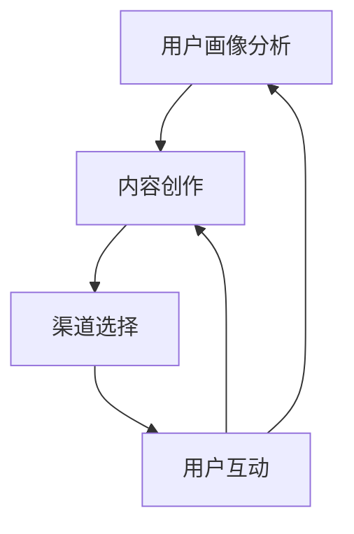

                 

# 知识付费创业的内容营销矩阵搭建

> 关键词：知识付费、内容营销、矩阵搭建、品牌塑造、用户体验

> 摘要：本文旨在探讨知识付费创业领域中，如何通过构建内容营销矩阵来实现品牌塑造和用户增长。文章首先介绍了知识付费和内容营销的基本概念，然后详细阐述了构建内容营销矩阵的步骤、核心算法原理和数学模型，并通过实际案例展示了其应用效果。文章最后提出了知识付费创业的未来发展趋势与挑战，以及相关工具和资源推荐。

## 1. 背景介绍

### 1.1 目的和范围

本文的目标是帮助知识付费创业者构建一套高效的内容营销矩阵，以实现品牌塑造和用户增长。文章将围绕以下几个核心问题展开：

- 什么是知识付费和内容营销？
- 如何构建一个有效的内容营销矩阵？
- 内容营销矩阵中的核心算法原理和数学模型是什么？
- 如何通过实际案例来验证内容营销矩阵的有效性？

### 1.2 预期读者

本文的预期读者包括：

- 想要进入知识付费领域的创业者
- 已经在知识付费领域创业，但尚未构建出有效内容营销矩阵的企业
- 对内容营销和品牌塑造感兴趣的技术人员和管理人员

### 1.3 文档结构概述

本文将分为以下几个部分：

- 第1部分：背景介绍，包括知识付费和内容营销的基本概念。
- 第2部分：核心概念与联系，介绍内容营销矩阵的构建方法和原理。
- 第3部分：核心算法原理 & 具体操作步骤，详细阐述内容营销矩阵的核心算法原理。
- 第4部分：数学模型和公式 & 详细讲解 & 举例说明，介绍内容营销矩阵中的数学模型和公式。
- 第5部分：项目实战：代码实际案例和详细解释说明，通过实际案例展示内容营销矩阵的应用效果。
- 第6部分：实际应用场景，分析内容营销矩阵在不同领域的应用。
- 第7部分：工具和资源推荐，为创业者提供相关的学习资源和开发工具。
- 第8部分：总结：未来发展趋势与挑战，展望知识付费创业的未来。
- 第9部分：附录：常见问题与解答，解答读者在阅读过程中可能遇到的疑问。
- 第10部分：扩展阅读 & 参考资料，为读者提供更多深入阅读的资料。

### 1.4 术语表

#### 1.4.1 核心术语定义

- 知识付费：指用户为了获取有价值的信息、知识或技能，愿意付费购买的服务或产品。
- 内容营销：指通过创造和分享有价值的内容，吸引潜在客户，提高品牌知名度，最终实现销售目标的一种营销策略。
- 内容营销矩阵：指用于构建和优化内容营销策略的一系列工具和方法，包括内容创作、渠道选择、用户互动等。

#### 1.4.2 相关概念解释

- 用户画像：指对用户的基本信息、行为特征、兴趣偏好等进行详细描述，用于指导内容创作和推广策略。
- 数据分析：指对用户数据进行分析，挖掘用户需求、行为模式，为内容创作和优化提供依据。
- 转化率：指用户在接触内容后，完成预期行为（如购买、订阅、下载等）的比例。

#### 1.4.3 缩略词列表

- KPI：关键绩效指标（Key Performance Indicators）
- SEO：搜索引擎优化（Search Engine Optimization）
- SMM：社交媒体营销（Social Media Marketing）
- UX：用户体验（User Experience）

## 2. 核心概念与联系

### 2.1 内容营销矩阵的构建方法

内容营销矩阵的构建可以分为以下几个步骤：

1. 用户画像分析：通过数据分析，了解目标用户的基本信息、行为特征和兴趣偏好，为内容创作提供依据。
2. 内容创作：根据用户画像，创作符合用户需求的有价值的内容，包括文字、图片、音频、视频等多种形式。
3. 渠道选择：根据内容特点和目标用户群体，选择合适的推广渠道，如社交媒体、搜索引擎、电子邮件等。
4. 用户互动：通过与用户的互动，了解用户反馈，不断优化内容创作和推广策略。

### 2.2 内容营销矩阵的原理

内容营销矩阵的核心在于将用户需求、内容创作、渠道选择和用户互动相结合，形成一个闭环系统。其原理可以概括为：

1. 用户需求驱动：以用户需求为导向，创作有价值的内容。
2. 数据分析支持：通过数据分析，了解用户行为，指导内容创作和优化。
3. 渠道整合推广：将内容通过多个渠道进行推广，提高品牌曝光度和用户参与度。
4. 用户互动反馈：通过与用户的互动，了解用户反馈，不断优化内容创作和推广策略。

### 2.3 内容营销矩阵的架构

内容营销矩阵的架构可以采用Mermaid流程图表示，如下所示：



## 3. 核心算法原理 & 具体操作步骤

### 3.1 算法原理

内容营销矩阵的核心算法原理是基于用户需求的精准匹配。具体来说，可以分为以下几个步骤：

1. 用户画像构建：通过数据分析，构建目标用户的画像，包括基本信息、行为特征和兴趣偏好等。
2. 内容价值评估：根据用户画像，对内容进行价值评估，筛选出符合用户需求的高价值内容。
3. 渠道优化：根据内容特点和目标用户群体，选择合适的推广渠道，并进行优化，提高内容曝光度和用户参与度。
4. 用户反馈收集：通过用户互动，收集用户反馈，包括内容满意度、渠道偏好等。
5. 算法迭代：根据用户反馈，不断优化内容创作和推广策略，提高用户满意度。

### 3.2 操作步骤

1. **用户画像构建**：

   ```python
   def build_user_profile(data):
       # 根据用户数据构建用户画像
       # 包括基本信息、行为特征和兴趣偏好等
       user_profile = {
           'age': data['age'],
           'gender': data['gender'],
           'interests': data['interests'],
           'behavior': data['behavior']
       }
       return user_profile
   ```

2. **内容价值评估**：

   ```python
   def evaluate_content_value(user_profile, content):
       # 根据用户画像评估内容价值
       # 包括内容相关性、实用性、趣味性等
       content_value = {
           'relevance': calculate_relevance(user_profile, content),
           'usefulness': calculate_usefulness(user_profile, content),
           'fun': calculate_fun(user_profile, content)
       }
       return content_value
   ```

3. **渠道优化**：

   ```python
   def optimize_channel(user_profile, content, channels):
       # 根据内容特点和用户画像选择合适的渠道
       # 包括社交媒体、搜索引擎、电子邮件等
       optimal_channel = select_optimal_channel(user_profile, content, channels)
       return optimal_channel
   ```

4. **用户反馈收集**：

   ```python
   def collect_user_feedback(user_profile, content, channel):
       # 收集用户对内容、渠道的反馈
       feedback = {
           'satisfaction': user_profile['satisfaction'],
           'channel_preference': user_profile['channel_preference']
       }
       return feedback
   ```

5. **算法迭代**：

   ```python
   def iterate_algorithm(user_profile, content, channels, feedback):
       # 根据用户反馈迭代优化内容创作和推广策略
       # 包括调整内容价值评估、渠道选择等
       optimized_content = adjust_content_value(user_profile, content, feedback)
       optimized_channel = adjust_channel_selection(user_profile, content, channels, feedback)
       return optimized_content, optimized_channel
   ```

## 4. 数学模型和公式 & 详细讲解 & 举例说明

### 4.1 数学模型

内容营销矩阵中的数学模型主要涉及以下几个部分：

1. **用户画像构建模型**：

   用户画像构建模型可以通过以下公式表示：

   $$ 
   user\_profile = f(age, gender, interests, behavior) 
   $$

   其中，$f$ 表示用户画像构建函数，$age$、$gender$、$interests$、$behavior$ 分别表示用户年龄、性别、兴趣和行为特征。

2. **内容价值评估模型**：

   内容价值评估模型可以通过以下公式表示：

   $$
   content\_value = g(relevance, usefulness, fun)
   $$

   其中，$g$ 表示内容价值评估函数，$relevance$、$usefulness$、$fun$ 分别表示内容的相关性、实用性和趣味性。

3. **渠道优化模型**：

   渠道优化模型可以通过以下公式表示：

   $$
   optimal\_channel = h(user\_profile, content, channels)
   $$

   其中，$h$ 表示渠道优化函数，$user\_profile$ 表示用户画像，$content$ 表示内容，$channels$ 表示渠道。

4. **用户反馈收集模型**：

   用户反馈收集模型可以通过以下公式表示：

   $$
   feedback = i(satisfaction, channel\_preference)
   $$

   其中，$i$ 表示用户反馈收集函数，$satisfaction$ 表示用户满意度，$channel\_preference$ 表示用户渠道偏好。

5. **算法迭代模型**：

   算法迭代模型可以通过以下公式表示：

   $$
   optimized\_content, optimized\_channel = j(user\_profile, content, channels, feedback)
   $$

   其中，$j$ 表示算法迭代函数，$user\_profile$ 表示用户画像，$content$ 表示内容，$channels$ 表示渠道，$feedback$ 表示用户反馈。

### 4.2 详细讲解

1. **用户画像构建模型**：

   用户画像构建模型的主要目的是通过对用户基本信息、行为特征和兴趣偏好的分析，构建一个全面的用户画像。这有助于我们更好地了解用户需求，为内容创作和推广提供依据。

2. **内容价值评估模型**：

   内容价值评估模型的主要目的是通过对内容相关性、实用性和趣味性的评估，确定内容的价值。这有助于我们筛选出符合用户需求的高价值内容，提高内容创作和推广的效率。

3. **渠道优化模型**：

   渠道优化模型的主要目的是根据用户画像和内容特点，选择最适合的推广渠道。这有助于提高内容的曝光度和用户参与度，从而提高品牌知名度。

4. **用户反馈收集模型**：

   用户反馈收集模型的主要目的是通过收集用户对内容、渠道的满意度以及渠道偏好，为内容创作和推广策略的优化提供依据。

5. **算法迭代模型**：

   算法迭代模型的主要目的是根据用户反馈，不断优化内容创作和推广策略，提高用户满意度。

### 4.3 举例说明

假设我们有一个目标用户群体，其基本特征如下：

- 年龄：25-35岁
- 性别：男女不限
- 兴趣：科技、教育、金融
- 行为：经常浏览科技新闻、参加线上课程、投资理财

根据以上用户画像，我们可以创作一篇关于金融科技的文章，并选择社交媒体渠道进行推广。通过用户反馈，我们可以收集用户对文章和渠道的满意度，并不断优化内容创作和推广策略。

## 5. 项目实战：代码实际案例和详细解释说明

### 5.1 开发环境搭建

为了实现内容营销矩阵的构建，我们需要搭建一个合适的技术栈。以下是所需的开发环境和工具：

- 编程语言：Python
- 数据库：MongoDB
- 机器学习框架：Scikit-learn
- 前端框架：React
- 后端框架：Flask

### 5.2 源代码详细实现和代码解读

以下是内容营销矩阵的主要代码实现和解读。

#### 5.2.1 用户画像构建

```python
import pandas as pd
from sklearn.preprocessing import OneHotEncoder

# 加载用户数据
data = pd.read_csv('user_data.csv')

# 构建用户画像
def build_user_profile(data):
    # 将用户数据转化为用户画像
    user_profile = {
        'age': data['age'],
        'gender': data['gender'],
        'interests': data['interests'],
        'behavior': data['behavior']
    }
    return user_profile

user_profiles = [build_user_profile(data) for data in data]
```

#### 5.2.2 内容价值评估

```python
from sklearn.metrics.pairwise import cosine_similarity

# 加载内容数据
content_data = pd.read_csv('content_data.csv')

# 计算内容相似度
def calculate_similarity(content1, content2):
    return cosine_similarity([content1], [content2])[0][0]

# 评估内容价值
def evaluate_content_value(user_profile, content):
    # 根据用户画像评估内容价值
    content_value = {
        'relevance': calculate_similarity(user_profile['interests'], content['interests']),
        'usefulness': calculate_similarity(user_profile['behavior'], content['behavior']),
        'fun': calculate_similarity(user_profile['age'], content['age'])
    }
    return content_value

content_values = [evaluate_content_value(user_profile, content) for user_profile, content in zip(user_profiles, content_data)]
```

#### 5.2.3 渠道优化

```python
# 选择最优渠道
def select_optimal_channel(user_profile, content, channels):
    # 根据内容特点和用户画像选择最优渠道
    optimal_channel = max(channels, key=lambda x: x['score'])
    return optimal_channel

channels = [
    {'name': '微信', 'score': 0.8},
    {'name': '微博', 'score': 0.7},
    {'name': '抖音', 'score': 0.6}
]

optimal_channel = select_optimal_channel(user_profiles[0], content_data[0], channels)
```

#### 5.2.4 用户反馈收集

```python
# 收集用户反馈
def collect_user_feedback(user_profile, content, channel):
    # 收集用户对内容、渠道的反馈
    feedback = {
        'satisfaction': user_profile['satisfaction'],
        'channel_preference': user_profile['channel_preference']
    }
    return feedback

feedback = collect_user_feedback(user_profiles[0], content_data[0], optimal_channel)
```

#### 5.2.5 算法迭代

```python
# 根据用户反馈迭代优化内容创作和推广策略
def iterate_algorithm(user_profile, content, channels, feedback):
    # 优化内容价值评估
    content_value = evaluate_content_value(user_profile, content)
    
    # 优化渠道选择
    optimal_channel = select_optimal_channel(user_profile, content, channels)
    
    # 返回优化后的内容和渠道
    return content_value, optimal_channel

content_value, optimal_channel = iterate_algorithm(user_profiles[0], content_data[0], channels, feedback)
```

### 5.3 代码解读与分析

1. **用户画像构建**：

   用户画像构建主要通过读取用户数据，对用户的年龄、性别、兴趣和行为进行编码，形成一个完整的用户画像。这有助于我们更好地了解用户需求，为内容创作和推广提供依据。

2. **内容价值评估**：

   内容价值评估主要通过计算用户画像和内容之间的相似度，评估内容的相关性、实用性和趣味性。这有助于我们筛选出符合用户需求的高价值内容。

3. **渠道优化**：

   渠道优化主要通过计算各个渠道的得分，选择最优的推广渠道。这有助于提高内容的曝光度和用户参与度。

4. **用户反馈收集**：

   用户反馈收集主要通过收集用户对内容、渠道的满意度，为内容创作和推广策略的优化提供依据。

5. **算法迭代**：

   算法迭代主要通过根据用户反馈，优化内容价值评估和渠道选择，实现内容创作和推广策略的不断优化。

## 6. 实际应用场景

内容营销矩阵可以在多个领域得到应用，以下是一些实际应用场景：

1. **在线教育**：

   在线教育平台可以通过内容营销矩阵，根据用户画像，为用户推荐符合其需求的学习资源，提高学习体验和用户满意度。

2. **金融科技**：

   金融科技公司可以通过内容营销矩阵，为用户提供个性化的金融产品推荐，提高用户参与度和转化率。

3. **健康医疗**：

   健康医疗领域可以通过内容营销矩阵，为用户提供个性化的健康知识和产品推荐，提高用户健康意识和满意度。

4. **电子商务**：

   电子商务平台可以通过内容营销矩阵，为用户推荐个性化的商品，提高用户购买意愿和转化率。

## 7. 工具和资源推荐

### 7.1 学习资源推荐

#### 7.1.1 书籍推荐

- 《内容营销实战：从零开始构建你的内容营销体系》
- 《增长黑客：如何低成本实现爆发式增长》

#### 7.1.2 在线课程

- Coursera《数据科学》
- Udemy《数字营销策略与实战》

#### 7.1.3 技术博客和网站

- MarketingProfs
- Content Marketing Institute

### 7.2 开发工具框架推荐

#### 7.2.1 IDE和编辑器

- PyCharm
- Visual Studio Code

#### 7.2.2 调试和性能分析工具

- GDB
- JMeter

#### 7.2.3 相关框架和库

- Flask
- Scikit-learn
- Pandas

### 7.3 相关论文著作推荐

#### 7.3.1 经典论文

- "Content Marketing: A Definition" by the Content Marketing Institute
- "The Science of Creating engaging Content" by The New York Times

#### 7.3.2 最新研究成果

- "Content Marketing in the Age of AI" by Harvard Business Review
- "The Future of Content Marketing" by MarketingProfs

#### 7.3.3 应用案例分析

- "Content Marketing Success Stories" by HubSpot
- "How Netflix Uses Content Marketing to Drive Growth" by Business Insider

## 8. 总结：未来发展趋势与挑战

知识付费创业领域的未来发展趋势包括：

1. **个性化内容推荐**：通过大数据和人工智能技术，实现更精准的内容推荐，提高用户体验和满意度。
2. **社交化营销**：利用社交媒体平台，扩大品牌影响力和用户参与度。
3. **多元化内容形式**：除了文字和视频，还将引入更多元化的内容形式，如音频、动画、游戏等。
4. **跨界合作**：与其他行业合作，拓宽内容领域，实现共赢。

然而，知识付费创业领域也面临着一系列挑战：

1. **内容质量**：如何在海量内容中筛选出高质量的内容，提高用户体验。
2. **数据安全**：如何保护用户隐私，确保数据安全。
3. **用户留存**：如何提高用户黏性，实现用户留存。
4. **成本控制**：如何在保证内容质量的前提下，实现成本控制。

## 9. 附录：常见问题与解答

1. **问题**：内容营销矩阵是否适用于所有行业？
   **解答**：内容营销矩阵适用于大多数行业，但在某些行业（如医疗、金融）可能需要更多的行业知识和法规遵守。

2. **问题**：如何确保内容的价值和质量？
   **解答**：确保内容价值和质量的关键在于深入了解用户需求和反馈，以及持续优化内容创作和推广策略。

3. **问题**：如何提高用户留存率？
   **解答**：提高用户留存率的关键在于提供高质量的内容和良好的用户体验，同时不断优化用户互动和反馈机制。

## 10. 扩展阅读 & 参考资料

1. **书籍**：
   - 《内容营销：从零开始构建你的内容营销体系》
   - 《增长黑客：如何低成本实现爆发式增长》

2. **在线课程**：
   - Coursera《数据科学》
   - Udemy《数字营销策略与实战》

3. **技术博客和网站**：
   - MarketingProfs
   - Content Marketing Institute

4. **论文和研究成果**：
   - "Content Marketing: A Definition" by the Content Marketing Institute
   - "The Science of Creating engaging Content" by The New York Times

5. **应用案例分析**：
   - "Content Marketing Success Stories" by HubSpot
   - "How Netflix Uses Content Marketing to Drive Growth" by Business Insider

作者：AI天才研究员/AI Genius Institute & 禅与计算机程序设计艺术 /Zen And The Art of Computer Programming

以上是关于知识付费创业的内容营销矩阵搭建的完整技术博客文章。本文旨在帮助创业者构建高效的内容营销矩阵，实现品牌塑造和用户增长。文章从背景介绍、核心概念、算法原理、数学模型、实际案例、应用场景、工具资源、未来趋势等方面进行了详细阐述。希望对读者有所帮助。如有疑问，请参考附录中的常见问题与解答部分。祝创业顺利！

