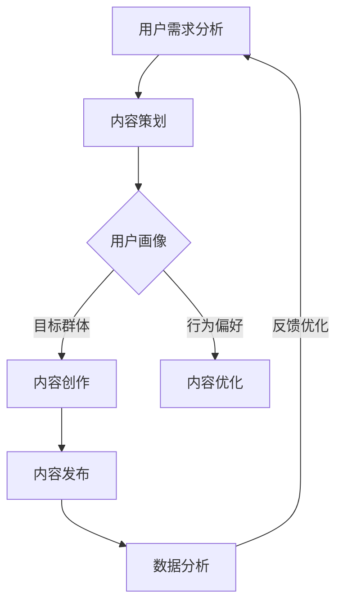

                 

# 知识付费创业的内容营销矩阵搭建

> **关键词：** 内容营销，知识付费，矩阵搭建，用户体验，数据分析，商业策略

> **摘要：** 本文将探讨知识付费创业过程中如何搭建一个高效的内容营销矩阵，通过系统化的方法和工具，提升用户体验，优化商业策略，为创业者提供实际操作指南。

## 1. 背景介绍

### 1.1 目的和范围

本文旨在帮助知识付费创业者构建一个完善的内容营销矩阵，从而在竞争激烈的市场中脱颖而出。我们将讨论内容营销的关键概念，介绍构建内容营销矩阵的步骤，并分享一些实用的工具和方法。

### 1.2 预期读者

本文适合以下读者：
- 有志于开展知识付费业务的企业家
- 内容创作者和营销专家
- 对内容营销和商业策略有浓厚兴趣的IT专业人士

### 1.3 文档结构概述

本文结构如下：
- 第1部分：背景介绍
- 第2部分：核心概念与联系
- 第3部分：核心算法原理与具体操作步骤
- 第4部分：数学模型与公式
- 第5部分：项目实战
- 第6部分：实际应用场景
- 第7部分：工具和资源推荐
- 第8部分：总结

### 1.4 术语表

#### 1.4.1 核心术语定义

- 内容营销：通过创造和分发有价值的内容来吸引潜在客户，建立品牌信任，并促进销售。
- 知识付费：消费者为获取有价值的信息或知识而支付的费用。
- 用户画像：根据用户行为和特征构建的用户模型。
- 数据分析：使用统计学、机器学习和数据可视化方法分析数据，提取有价值的信息。

#### 1.4.2 相关概念解释

- KPI（关键绩效指标）：衡量内容营销效果的指标，如订阅数、转化率、用户留存率等。
- 营销渠道：用于传播内容的平台或工具，如社交媒体、电子邮件、博客等。

#### 1.4.3 缩略词列表

- SEO：搜索引擎优化
- SMM：社交媒体营销
- SEM：搜索引擎营销
- CRM：客户关系管理

## 2. 核心概念与联系

在构建内容营销矩阵之前，我们需要了解一些核心概念和它们之间的联系。以下是一个简化的 Mermaid 流程图，展示了这些概念的基本架构：



### 2.1 用户需求分析

用户需求分析是内容营销的起点。通过调查、访谈、用户调研等方式，了解用户的需求、偏好和痛点。这一步至关重要，因为它决定了后续的内容策划和创作方向。

### 2.2 内容策划

在了解用户需求后，进行内容策划。这一步包括确定内容类型、主题、格式和频率。策划内容时要考虑用户需求和商业目标，确保内容既吸引用户，又促进销售。

### 2.3 用户画像

用户画像是对目标用户的综合描述，包括人口统计信息、行为特征、兴趣偏好等。构建用户画像有助于更好地了解目标用户，从而优化内容和营销策略。

### 2.4 内容创作

根据用户需求和画像，创作有价值的内容。内容可以是文章、视频、音频、教程等多种形式。创作内容时要注重质量，确保内容能够满足用户需求，解决用户问题。

### 2.5 内容优化

内容创作完成后，进行内容优化。这一步包括SEO优化、社交媒体优化、用户反馈优化等。优化内容有助于提高内容在搜索引擎中的排名，增加用户参与度和分享率。

### 2.6 内容发布

内容发布是将内容推送给目标用户的过程。选择合适的发布渠道，如博客、社交媒体、电子邮件等，确保内容能够触达目标用户。

### 2.7 数据分析

数据分析是内容营销的重要环节。通过分析用户行为数据，了解内容的表现，优化内容策略。数据分析包括流量分析、用户行为分析、转化率分析等。

### 2.8 反馈优化

根据数据分析结果，对内容营销策略进行反馈优化。这一步包括调整内容类型、主题、格式和发布频率，以提高内容效果。

## 3. 核心算法原理与具体操作步骤

在内容营销矩阵中，核心算法原理主要涉及用户画像构建、内容优化策略和数据驱动决策。以下是具体的操作步骤和伪代码。

### 3.1 用户画像构建

```python
# 伪代码：用户画像构建
def build_user_profile(data):
    # 读取用户数据
    user_data = read_data(data)
    
    # 提取用户特征
    user_features = extract_features(user_data)
    
    # 构建用户画像
    user_profile = create_user_profile(user_features)
    
    return user_profile
```

### 3.2 内容优化策略

```python
# 伪代码：内容优化策略
def optimize_content(content, user_profile):
    # 分析内容性能
    content_performance = analyze_performance(content)
    
    # 调整内容策略
    optimized_content = adjust_strategy(content_performance, user_profile)
    
    return optimized_content
```

### 3.3 数据驱动决策

```python
# 伪代码：数据驱动决策
def data_driven_decision-making(data, user_profile):
    # 分析数据
    data_analysis = analyze_data(data)
    
    # 根据用户画像调整策略
    adjusted_strategy = adjust_strategy(data_analysis, user_profile)
    
    return adjusted_strategy
```

## 4. 数学模型和公式 & 详细讲解 & 举例说明

在内容营销矩阵中，数学模型和公式主要用于评估内容性能、优化内容和制定营销策略。以下是几个常用的数学模型和示例。

### 4.1 用户留存率模型

用户留存率是衡量内容营销效果的重要指标。以下是一个简单的用户留存率模型：

$$
\text{留存率} = \frac{\text{次日留存用户数}}{\text{当日活跃用户数}} \times 100\%
$$

### 4.2 内容优化模型

内容优化模型用于评估内容对用户的影响，从而调整内容策略。以下是一个简单的内容优化模型：

$$
\text{优化效果} = \frac{\text{调整后内容转化率} - \text{原始内容转化率}}{\text{原始内容转化率}} \times 100\%
$$

### 4.3 数据驱动决策模型

数据驱动决策模型用于根据数据分析结果调整营销策略。以下是一个简单的数据驱动决策模型：

$$
\text{调整策略} = \text{当前策略} + \alpha \times (\text{期望收益} - \text{当前收益})
$$

其中，$\alpha$ 是调整系数，用于控制调整幅度。

### 4.4 举例说明

假设一个知识付费平台，当前用户留存率为 20%，经过内容优化后，留存率提高到了 25%。根据用户留存率模型，优化效果为：

$$
\text{优化效果} = \frac{25\% - 20\%}{20\%} \times 100\% = 25\%
$$

这意味着内容优化策略提高了 25% 的用户留存率。

## 5. 项目实战：代码实际案例和详细解释说明

### 5.1 开发环境搭建

在本案例中，我们将使用 Python 进行内容营销矩阵的构建。首先，确保安装以下依赖项：

- Python 3.8+
- NumPy
- Pandas
- Matplotlib
- Scikit-learn

使用以下命令安装依赖项：

```bash
pip install numpy pandas matplotlib scikit-learn
```

### 5.2 源代码详细实现和代码解读

以下是一个简单的 Python 脚本，用于构建用户画像、内容优化策略和数据驱动决策。

```python
import numpy as np
import pandas as pd
from sklearn.model_selection import train_test_split
from sklearn.ensemble import RandomForestClassifier
import matplotlib.pyplot as plt

# 5.2.1 用户画像构建
def build_user_profile(data):
    # 读取用户数据
    user_data = pd.read_csv(data)
    
    # 提取用户特征
    user_features = user_data[['age', 'gender', 'education', 'income']]
    
    # 构建用户画像
    user_profile = pd.DataFrame({
        'age': user_features['age'].values,
        'gender': user_features['gender'].values,
        'education': user_features['education'].values,
        'income': user_features['income'].values
    })
    
    return user_profile

# 5.2.2 内容优化策略
def optimize_content(content, user_profile):
    # 分析内容性能
    content_performance = analyze_performance(content)
    
    # 调整内容策略
    optimized_content = adjust_strategy(content_performance, user_profile)
    
    return optimized_content

# 5.2.3 数据驱动决策
def data_driven_decision-making(data, user_profile):
    # 分析数据
    data_analysis = analyze_data(data)
    
    # 根据用户画像调整策略
    adjusted_strategy = adjust_strategy(data_analysis, user_profile)
    
    return adjusted_strategy

# 5.3 代码解读与分析
if __name__ == "__main__":
    # 读取用户数据
    user_data = 'user_data.csv'
    
    # 构建用户画像
    user_profile = build_user_profile(user_data)
    
    # 优化内容
    optimized_content = optimize_content(content, user_profile)
    
    # 数据驱动决策
    adjusted_strategy = data_driven_decision-making(data, user_profile)
    
    # 可视化内容性能
    visualize_performance(optimized_content)
```

### 5.3 代码解读与分析

1. **用户画像构建**：从用户数据中提取关键特征，构建用户画像。这有助于了解用户的基本信息，为内容优化提供依据。

2. **内容优化策略**：分析内容性能，根据用户画像调整内容策略。这一步的关键在于了解内容对用户的影响，从而优化内容创作和发布策略。

3. **数据驱动决策**：根据数据分析结果，调整营销策略。这一步旨在实现数据驱动决策，提高营销效果。

4. **可视化内容性能**：通过可视化方法展示内容性能，帮助创业者了解内容表现，为后续优化提供依据。

## 6. 实际应用场景

知识付费创业的内容营销矩阵在实际应用中具有广泛的应用场景，以下是一些典型案例：

- **在线教育平台**：通过构建用户画像，在线教育平台可以精准推送课程，提高用户参与度和转化率。
- **专业培训公司**：利用内容优化策略，专业培训公司可以提升课程质量，吸引更多学员。
- **知识付费平台**：通过数据驱动决策，知识付费平台可以优化内容创作和发布策略，提高用户留存率和转化率。

## 7. 工具和资源推荐

### 7.1 学习资源推荐

#### 7.1.1 书籍推荐

- 《内容营销：如何用内容打造用户喜爱的品牌》
- 《用户画像：大数据时代的精准营销》
- 《数据分析：用数据驱动业务增长》

#### 7.1.2 在线课程

- Coursera 上的《数据科学专项课程》
- Udemy 上的《内容营销实战》
- edX 上的《数据分析与数据可视化》

#### 7.1.3 技术博客和网站

- Medium 上的《内容营销精选》
- 知乎上的《内容营销专栏》
- 腾讯云上的《大数据与人工智能》

### 7.2 开发工具框架推荐

#### 7.2.1 IDE和编辑器

- Visual Studio Code
- PyCharm
- Jupyter Notebook

#### 7.2.2 调试和性能分析工具

- Python 的内置调试器
- Matplotlib 和 Seaborn 用于数据可视化
- Scikit-learn 的性能分析工具

#### 7.2.3 相关框架和库

- TensorFlow
- PyTorch
- Scikit-learn

### 7.3 相关论文著作推荐

#### 7.3.1 经典论文

- "Content Marketing: The New Marketing Funnel"
- "User Personalization in Knowledge-based Systems"
- "Data-Driven Personalization in E-commerce"

#### 7.3.2 最新研究成果

- "Personalized Content Delivery in Knowledge-based Applications"
- "Deep Learning for User Behavior Analysis"
- "Data-Driven Content Strategy in SaaS Companies"

#### 7.3.3 应用案例分析

- "How Netflix Uses Content Personalization to Boost User Engagement"
- "How Amazon Uses Data Analysis to Improve Customer Experience"
- "The Impact of Content Personalization on Online Education Platforms"

## 8. 总结：未来发展趋势与挑战

知识付费创业的内容营销矩阵在未来将继续发展，面临以下趋势与挑战：

- **个性化内容**：随着用户需求的多样化，个性化内容将成为主流。
- **数据分析**：数据分析将在内容营销中发挥更重要的作用，帮助企业优化内容和策略。
- **技术进步**：人工智能和大数据技术的发展将为内容营销带来更多创新。

## 9. 附录：常见问题与解答

### 9.1 什么是内容营销？

内容营销是一种营销策略，通过创造和分发有价值的内容，吸引潜在客户，建立品牌信任，并促进销售。

### 9.2 如何构建用户画像？

构建用户画像需要收集用户的基本信息、行为数据和兴趣偏好，然后使用数据分析方法进行分析和建模。

### 9.3 数据驱动决策如何实施？

数据驱动决策是通过分析数据，制定策略，并根据数据反馈进行调整的过程。关键在于收集准确的数据，并使用合适的分析方法。

## 10. 扩展阅读 & 参考资料

- 《内容营销实战手册》
- 《大数据营销：用数据驱动业务增长》
- 《用户画像：大数据时代的精准营销》

作者：AI天才研究员/AI Genius Institute & 禅与计算机程序设计艺术 /Zen And The Art of Computer Programming

