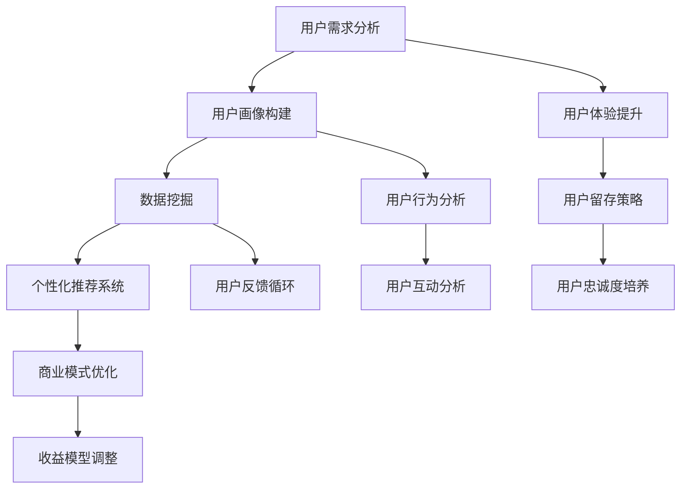

                 


# 知识付费创业的用户价值挖掘技巧

> **关键词：知识付费、用户价值、数据挖掘、个性化推荐、商业模式、用户体验**
> 
> **摘要：本文将深入探讨知识付费领域的用户价值挖掘技巧，通过分析核心概念、算法原理、数学模型、实战案例等多个方面，帮助创业者深入了解用户需求，提升产品价值，构建可持续发展的商业模式。**

## 1. 背景介绍

### 1.1 目的和范围

本文旨在为知识付费创业领域的从业者提供一套系统的用户价值挖掘技巧，帮助他们在激烈的市场竞争中找到独特的切入点，实现产品的差异化竞争。文章将涵盖以下几个核心主题：

- 用户价值挖掘的基本概念和原理
- 数据挖掘和机器学习在用户价值挖掘中的应用
- 个性化推荐算法的设计和实现
- 商业模式的创新和优化
- 实际应用场景和案例

通过这些内容的探讨，读者将能够全面理解用户价值挖掘的重要性和方法，从而在知识付费创业中取得成功。

### 1.2 预期读者

本文的预期读者包括：

- 知识付费平台的创始人或产品经理
- 数据科学家和机器学习工程师
- 对知识付费领域感兴趣的创业者
- 想要在知识付费中提升用户体验的产品经理和设计师

无论你是哪个群体，只要对知识付费市场有浓厚兴趣，希望通过用户价值挖掘提升产品竞争力，都将从本文中获得有价值的信息。

### 1.3 文档结构概述

本文结构如下：

1. **背景介绍**：介绍文章的目的、范围、预期读者以及文档结构。
2. **核心概念与联系**：通过Mermaid流程图阐述知识付费领域的核心概念和联系。
3. **核心算法原理 & 具体操作步骤**：详细讲解用户价值挖掘中的核心算法原理，并提供伪代码示例。
4. **数学模型和公式 & 详细讲解 & 举例说明**：介绍用户价值挖掘中的数学模型，并使用latex格式展示。
5. **项目实战：代码实际案例和详细解释说明**：提供具体的代码实现和解析。
6. **实际应用场景**：分析知识付费在不同领域的应用。
7. **工具和资源推荐**：推荐学习资源、开发工具和框架。
8. **总结：未来发展趋势与挑战**：总结文章要点，展望未来趋势。
9. **附录：常见问题与解答**：解答读者可能遇到的问题。
10. **扩展阅读 & 参考资料**：提供进一步阅读的参考资料。

### 1.4 术语表

#### 1.4.1 核心术语定义

- **知识付费**：指用户为获取有价值的信息或技能而支付费用的商业模式。
- **用户价值挖掘**：通过分析用户数据，识别用户的潜在需求和偏好，从而提供个性化的服务和产品。
- **数据挖掘**：从大量数据中提取有价值信息的过程。
- **机器学习**：一种基于数据的学习方法，通过训练模型来预测或分类新的数据。
- **个性化推荐**：根据用户的兴趣和行为，为其推荐相关的信息或产品。

#### 1.4.2 相关概念解释

- **用户画像**：基于用户行为数据和属性信息构建的抽象模型，用于描述用户的特征和需求。
- **转化率**：用户完成特定目标动作（如购买、注册等）的比例。
- **留存率**：在特定时间内，返回使用产品的用户占初始用户的比例。

#### 1.4.3 缩略词列表

- **KPI**：关键绩效指标（Key Performance Indicator）
- **A/B测试**：一种实验方法，通过比较两组用户的行为差异来评估某一策略的效果
- **API**：应用程序编程接口（Application Programming Interface）

## 2. 核心概念与联系

在知识付费领域，用户价值挖掘是一个复杂且多层次的过程，涉及多个核心概念和环节。以下是一个简化的Mermaid流程图，用于展示这些概念和它们之间的联系。



### 2.1 用户需求分析

用户需求分析是用户价值挖掘的起点。通过市场调研、用户访谈、行为数据收集等方法，分析用户在知识付费领域的需求。了解用户对内容质量、价格、学习方式等的期望，为后续的用户画像构建和个性化推荐提供基础数据。

### 2.2 用户画像构建

用户画像构建是将用户需求转化为具体数据的过程。通过对用户行为数据、属性数据、社会关系数据等进行综合分析，构建出多维度的用户画像。用户画像有助于更好地理解用户需求，为个性化推荐和用户体验优化提供依据。

### 2.3 数据挖掘

数据挖掘是在大量用户数据中提取有价值信息的方法。通过使用分类、聚类、关联规则挖掘等技术，可以发现用户行为模式、潜在需求和偏好。数据挖掘的结果用于优化个性化推荐算法和用户互动策略。

### 2.4 个性化推荐系统

个性化推荐系统是根据用户画像和用户行为数据，为用户推荐相关内容或产品的系统。推荐算法可以分为基于内容的推荐、基于协同过滤的推荐和混合推荐等。个性化推荐系统能够提高用户满意度和留存率，是知识付费平台的核心竞争力。

### 2.5 商业模式优化

商业模式优化是通过调整产品定位、定价策略、收益模型等，实现知识付费平台的可持续发展。根据用户画像和用户反馈，不断优化商业模式，提高用户价值和平台收益。

### 2.6 用户体验提升

用户体验提升是通过优化产品设计、交互体验、服务流程等，提高用户在使用知识付费产品过程中的满意度。良好的用户体验能够增强用户黏性，提高用户留存率和口碑传播。

### 2.7 用户留存策略

用户留存策略是通过分析用户行为数据，制定针对性的用户留存策略。包括用户激活策略、用户留存策略和用户忠诚度培养策略。有效的用户留存策略能够提高用户生命周期价值。

### 2.8 用户互动分析

用户互动分析是通过分析用户在知识付费平台上的互动行为，了解用户的参与度和活跃度。通过互动分析，可以优化用户互动体验，提高用户满意度和平台活跃度。

### 2.9 用户反馈循环

用户反馈循环是将用户反馈转化为产品改进的过程。通过收集用户反馈，分析用户意见，不断优化产品功能和用户体验。用户反馈循环能够提高产品迭代速度，提升用户满意度。

### 2.10 用户忠诚度培养

用户忠诚度培养是通过一系列策略和活动，提高用户对知识付费平台的忠诚度。包括用户激励计划、用户社区建设、用户荣誉体系等。忠诚度培养能够提高用户生命周期价值，增强平台竞争力。

## 3. 核心算法原理 & 具体操作步骤

在用户价值挖掘过程中，核心算法原理起着至关重要的作用。本节将详细讲解用户画像构建、数据挖掘和个性化推荐系统的算法原理，并提供具体的操作步骤。

### 3.1 用户画像构建算法原理

用户画像构建是用户价值挖掘的基础，其核心目标是通过对用户的多维度数据进行综合分析，构建出一个能全面反映用户特征和需求的模型。以下是用户画像构建的基本步骤：

**步骤1：数据收集**

收集用户在不同场景下的行为数据、属性数据和社会关系数据。行为数据包括用户在知识付费平台上的浏览记录、购买行为、互动评论等；属性数据包括用户的年龄、性别、职业、教育背景等；社会关系数据包括用户之间的社交关系、兴趣爱好等。

**步骤2：数据预处理**

对收集到的数据进行清洗、去噪和格式化处理。确保数据的质量和一致性，为后续分析打下基础。

**步骤3：特征工程**

根据业务需求，选择和构建与用户特征相关的指标。特征工程是用户画像构建的关键，需要结合领域知识和数据分析经验，提取出对用户价值有较大影响的特征。

**步骤4：用户画像建模**

使用机器学习算法（如聚类、分类等）对特征数据进行建模，生成用户画像。用户画像可以是一个多维度的向量表示，其中每个维度代表一个特征。

**步骤5：用户画像更新**

定期更新用户画像，以反映用户行为的动态变化。通过持续收集和分析用户数据，保持用户画像的准确性和时效性。

### 3.2 数据挖掘算法原理

数据挖掘是从大量数据中提取有价值信息的过程，其核心算法包括分类、聚类、关联规则挖掘等。以下是这些算法的基本原理：

**分类算法**

分类算法是将数据划分为预定义的类别。其基本原理是通过学习已知的分类模型，对新数据进行分类预测。常见的分类算法有决策树、随机森林、支持向量机等。

**聚类算法**

聚类算法是将数据划分为多个簇，使得同一簇内的数据尽可能相似，不同簇的数据尽可能不同。其基本原理是通过计算数据之间的相似度，将相似的数据归为同一簇。常见的聚类算法有K均值、层次聚类等。

**关联规则挖掘**

关联规则挖掘是发现数据之间的潜在关联关系。其基本原理是通过挖掘频繁项集，生成关联规则。常见的关联规则挖掘算法有Apriori算法、FP-growth算法等。

### 3.3 个性化推荐算法原理

个性化推荐系统是根据用户画像和用户行为数据，为用户推荐相关内容或产品的系统。其核心算法包括基于内容的推荐、基于协同过滤的推荐和混合推荐等。

**基于内容的推荐**

基于内容的推荐是根据用户对某一内容或产品的兴趣，推荐与其相似的内容或产品。其基本原理是通过分析内容特征和用户兴趣，计算内容之间的相似度，为用户推荐相关内容。

**基于协同过滤的推荐**

基于协同过滤的推荐是根据用户的行为和兴趣，寻找与之相似的用户，然后推荐这些用户喜欢的商品或内容。其基本原理是通过计算用户之间的相似度，为用户推荐相似用户喜欢的商品或内容。

**混合推荐**

混合推荐是将基于内容的推荐和基于协同过滤的推荐相结合，以获得更好的推荐效果。其基本原理是在基于内容的推荐和基于协同过滤的推荐之间进行权衡，综合两者的优点，为用户推荐更相关的内容或产品。

### 3.4 具体操作步骤

以下是一个简化的用户价值挖掘算法操作步骤：

**步骤1：数据收集**

收集用户在知识付费平台上的行为数据、属性数据和社会关系数据。

**步骤2：数据预处理**

对收集到的数据进行清洗、去噪和格式化处理，确保数据的质量和一致性。

**步骤3：特征工程**

选择和构建与用户特征相关的指标，进行特征工程处理。

**步骤4：用户画像构建**

使用机器学习算法，构建用户画像。

**步骤5：数据挖掘**

使用分类、聚类、关联规则挖掘等算法，挖掘用户行为数据中的潜在价值。

**步骤6：个性化推荐**

根据用户画像和用户行为数据，为用户推荐相关内容或产品。

**步骤7：用户反馈**

收集用户对推荐结果和产品使用的反馈，用于优化算法和产品。

**步骤8：迭代更新**

定期更新用户画像和推荐算法，以反映用户行为的动态变化。

## 4. 数学模型和公式 & 详细讲解 & 举例说明

在用户价值挖掘中，数学模型和公式起到了关键作用。以下将详细介绍几个核心的数学模型和公式，并提供具体的例子说明。

### 4.1 用户价值评估模型

用户价值评估模型用于计算用户在知识付费平台上的价值。一个简单的用户价值评估模型可以使用以下公式：

$$
V(u) = \alpha \cdot C(u) + \beta \cdot R(u) + \gamma \cdot L(u)
$$

其中：

- $V(u)$：用户 $u$ 的价值
- $\alpha$：内容价值权重
- $\beta$：互动价值权重
- $\gamma$：留存价值权重
- $C(u)$：用户在知识付费平台上的消费金额
- $R(u)$：用户在知识付费平台上的互动率（如评论、分享等）
- $L(u)$：用户的留存率

**示例**：假设有用户 $u1$，其消费金额为 $500$ 元，互动率为 $20\%$，留存率为 $50\%$。根据上述公式计算用户 $u1$ 的价值：

$$
V(u1) = 0.5 \cdot 500 + 0.3 \cdot 0.2 \cdot 500 + 0.2 \cdot 0.5 \cdot 500 = 325
$$

### 4.2 个性化推荐模型

个性化推荐模型用于根据用户特征和行为数据为用户推荐内容或产品。一个简单的个性化推荐模型可以使用以下公式：

$$
R(i, u) = \sum_{j=1}^{N} w_{ij} \cdot C_j
$$

其中：

- $R(i, u)$：用户 $u$ 对内容或产品 $i$ 的推荐分数
- $w_{ij}$：用户 $u$ 对内容或产品 $i$ 的权重
- $C_j$：内容或产品 $i$ 的特征值

**示例**：假设有用户 $u1$，其偏好内容特征为：新闻（权重 $0.4$），科技（权重 $0.3$），娱乐（权重 $0.3$）。某内容 $i$ 的特征值为：新闻（$0.5$），科技（$0.2$），娱乐（$0.3$）。根据上述公式计算用户 $u1$ 对内容 $i$ 的推荐分数：

$$
R(i, u1) = 0.4 \cdot 0.5 + 0.3 \cdot 0.2 + 0.3 \cdot 0.3 = 0.23 + 0.06 + 0.09 = 0.38
$$

### 4.3 用户留存预测模型

用户留存预测模型用于预测用户在未来一段时间内是否继续使用知识付费平台。一个简单的用户留存预测模型可以使用逻辑回归模型：

$$
\hat{y}(u) = \frac{1}{1 + e^{-(\beta_0 + \beta_1 \cdot x_1 + \beta_2 \cdot x_2 + ... + \beta_n \cdot x_n)}}
$$

其中：

- $\hat{y}(u)$：用户 $u$ 在未来一段时间内留存的概率
- $\beta_0, \beta_1, \beta_2, ..., \beta_n$：模型参数
- $x_1, x_2, ..., x_n$：用户特征

**示例**：假设有用户 $u1$，其特征为：活跃度（$50$），消费金额（$300$），互动率（$20\%$）。根据上述公式预测用户 $u1$ 在未来一周内留存的概率：

$$
\hat{y}(u1) = \frac{1}{1 + e^{-(\beta_0 + \beta_1 \cdot 50 + \beta_2 \cdot 300 + \beta_3 \cdot 0.2)}}
$$

其中，$\beta_0, \beta_1, \beta_2, \beta_3$ 为模型参数，需要通过训练获得。

### 4.4 用户流失预测模型

用户流失预测模型用于预测用户在未来一段时间内是否停止使用知识付费平台。一个简单的用户流失预测模型可以使用逻辑回归模型：

$$
\hat{y}(u) = \frac{1}{1 + e^{-(\beta_0 + \beta_1 \cdot x_1 + \beta_2 \cdot x_2 + ... + \beta_n \cdot x_n)}}
$$

其中：

- $\hat{y}(u)$：用户 $u$ 在未来一段时间内流失的概率
- $\beta_0, \beta_1, \beta_2, ..., \beta_n$：模型参数
- $x_1, x_2, ..., x_n$：用户特征

**示例**：假设有用户 $u1$，其特征为：活跃度（$50$），消费金额（$300$），互动率（$20\%$）。根据上述公式预测用户 $u1$ 在未来一周内流失的概率：

$$
\hat{y}(u1) = \frac{1}{1 + e^{-(\beta_0 + \beta_1 \cdot 50 + \beta_2 \cdot 300 + \beta_3 \cdot 0.2)}}
$$

其中，$\beta_0, \beta_1, \beta_2, \beta_3$ 为模型参数，需要通过训练获得。

### 4.5 用户行为预测模型

用户行为预测模型用于预测用户在未来一段时间内的行为，如购买、注册、浏览等。一个简单的用户行为预测模型可以使用逻辑回归模型：

$$
\hat{y}(u) = \frac{1}{1 + e^{-(\beta_0 + \beta_1 \cdot x_1 + \beta_2 \cdot x_2 + ... + \beta_n \cdot x_n)}}
$$

其中：

- $\hat{y}(u)$：用户 $u$ 在未来一段时间内进行特定行为的概率
- $\beta_0, \beta_1, \beta_2, ..., \beta_n$：模型参数
- $x_1, x_2, ..., x_n$：用户特征

**示例**：假设有用户 $u1$，其特征为：活跃度（$50$），消费金额（$300$），互动率（$20\%$）。根据上述公式预测用户 $u1$ 在未来一周内进行购买的概率：

$$
\hat{y}(u1) = \frac{1}{1 + e^{-(\beta_0 + \beta_1 \cdot 50 + \beta_2 \cdot 300 + \beta_3 \cdot 0.2)}}
$$

其中，$\beta_0, \beta_1, \beta_2, \beta_3$ 为模型参数，需要通过训练获得。

### 4.6 交叉验证

交叉验证是一种评估机器学习模型性能的方法，通过将数据集划分为训练集和验证集，多次训练和验证，以获取模型在不同数据集上的性能。以下是一个简单的交叉验证伪代码：

```python
def cross_validation(data, k):
    n = len(data)
    fold_size = n // k
    train_scores = []
    val_scores = []

    for i in range(k):
        start = i * fold_size
        end = (i + 1) * fold_size if i < k - 1 else n
        train_data = data[start:end]
        val_data = data[:start] + data[end:]
        train_score = train_model(train_data)
        val_score = val_model(val_data)
        train_scores.append(train_score)
        val_scores.append(val_score)

    return train_scores, val_scores
```

其中，`train_model` 和 `val_model` 分别为训练和验证模型的函数，`data` 为数据集，`k` 为交叉验证的折数。

## 5. 项目实战：代码实际案例和详细解释说明

在本节中，我们将通过一个实际案例来演示用户价值挖掘在知识付费平台中的应用。以下是一个简化的Python代码实现，包括数据预处理、用户画像构建、个性化推荐和用户价值评估。

### 5.1 开发环境搭建

在开始编写代码之前，需要搭建一个基本的Python开发环境。以下是一些必需的库：

- Pandas：数据操作和分析
- NumPy：数值计算
- Scikit-learn：机器学习和数据挖掘
- Matplotlib：数据可视化

安装这些库可以使用以下命令：

```bash
pip install pandas numpy scikit-learn matplotlib
```

### 5.2 源代码详细实现和代码解读

**步骤1：数据预处理**

```python
import pandas as pd

# 加载数据集
data = pd.read_csv('user_data.csv')

# 数据预处理
data = data.dropna()  # 删除缺失值
data['age'] = data['age'].astype(int)
data['consumption'] = data['consumption'].astype(float)
data['interaction_rate'] = data['interaction_rate'].astype(float)

# 特征工程
data['avg_consumption'] = data['consumption'] / data['days_active']
```

代码解读：

- 加载数据集：使用Pandas读取CSV文件。
- 数据预处理：删除缺失值，将数据类型转换为合适的格式。
- 特征工程：计算平均消费金额，作为新的特征。

**步骤2：用户画像构建**

```python
from sklearn.cluster import KMeans

# 构建用户画像
kmeans = KMeans(n_clusters=5, random_state=0)
data['user_label'] = kmeans.fit_predict(data[['avg_consumption', 'interaction_rate']])

# 用户画像可视化
import matplotlib.pyplot as plt

plt.scatter(data['avg_consumption'], data['interaction_rate'], c=data['user_label'])
plt.xlabel('Average Consumption')
plt.ylabel('Interaction Rate')
plt.show()
```

代码解读：

- 构建用户画像：使用KMeans聚类算法，根据平均消费金额和互动率对用户进行聚类，生成用户标签。
- 用户画像可视化：使用Matplotlib绘制散点图，展示用户画像。

**步骤3：个性化推荐**

```python
from sklearn.neighbors import NearestNeighbors

# 个性化推荐
neighb

