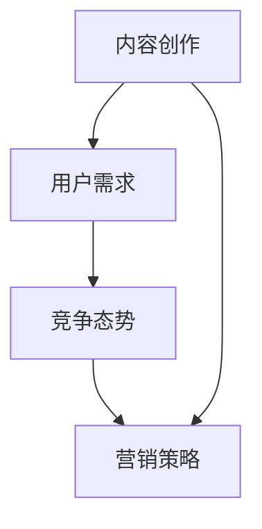

                 

# 知识付费创业者的自我提升策略

> 关键词：知识付费、创业者、自我提升、策略、技能提升、资源管理、市场洞察、心理调适

> 摘要：本文将深入探讨知识付费创业者在创业过程中的自我提升策略。通过分析核心概念、核心算法原理、数学模型和公式、项目实战、实际应用场景、工具和资源推荐等多个维度，旨在为知识付费创业者提供一套全面、实用的自我提升路径，助力他们在竞争激烈的市场中脱颖而出。

## 1. 背景介绍

### 1.1 目的和范围

本文旨在为知识付费创业者提供一套有效的自我提升策略。这些策略将涵盖多个方面，包括技能提升、资源管理、市场洞察、心理调适等。通过本文的阅读，创业者将能够系统性地了解和掌握自我提升的方法和技巧，从而在知识付费领域中取得更好的成绩。

### 1.2 预期读者

本文预期读者为知识付费创业者和对知识付费行业有兴趣的读者。无论您是刚刚进入知识付费领域的创业者，还是已经在行业中有所建树的从业者，本文都将为您提供宝贵的指导和借鉴。

### 1.3 文档结构概述

本文结构如下：

1. 背景介绍：包括目的和范围、预期读者、文档结构概述等。
2. 核心概念与联系：介绍知识付费领域中的核心概念及其相互联系。
3. 核心算法原理 & 具体操作步骤：详细阐述创业者如何通过核心算法原理提升自身能力。
4. 数学模型和公式 & 详细讲解 & 举例说明：介绍创业者所需掌握的数学模型和公式，并提供实际案例。
5. 项目实战：通过实际项目案例展示如何应用自我提升策略。
6. 实际应用场景：分析知识付费创业者在不同场景下的自我提升策略。
7. 工具和资源推荐：推荐学习资源、开发工具框架和相关论文著作。
8. 总结：对未来发展趋势与挑战的展望。
9. 附录：常见问题与解答。
10. 扩展阅读 & 参考资料。

### 1.4 术语表

#### 1.4.1 核心术语定义

- 知识付费：指消费者为了获取特定知识或服务而支付费用的商业模式。
- 创业者：指在知识付费领域内创业的个人或团队。
- 自我提升：指个人在知识、技能、资源、心理等方面不断提升的过程。

#### 1.4.2 相关概念解释

- 技能提升：指在特定领域内提高个人技能和能力的过程。
- 资源管理：指创业者如何有效地利用和管理各种资源，包括时间、人力、资金等。
- 市场洞察：指创业者对市场趋势、竞争态势、用户需求等方面的深入理解和分析。
- 心理调适：指创业者如何在压力和挑战面前保持良好的心理状态，以及如何应对挫折和困难。

#### 1.4.3 缩略词列表

- KFC：知识付费创业者
- SPU：技能提升
- RM：资源管理
- MI：市场洞察
- PT：心理调适

## 2. 核心概念与联系

### 2.1 知识付费领域中的核心概念

在知识付费领域，核心概念主要包括：

- 内容创作：指创业者为用户提供的知识或技能传授。
- 用户需求：指消费者在知识付费领域中的需求和期望。
- 竞争态势：指知识付费领域内的竞争格局和竞争对手。
- 营销策略：指创业者如何通过有效的营销手段吸引用户。

### 2.2 核心概念之间的联系

这些核心概念之间的联系如图1所示。



### 2.3 核心概念的联系与创业者自我提升策略

创业者通过以下方式实现自我提升策略：

- 提升内容创作能力：不断学习新知识，提高个人技能，创作高质量、有价值的知识产品。
- 深入了解用户需求：通过市场调研、用户反馈等方式，准确把握用户需求，提供针对性的内容。
- 分析竞争态势：了解竞争对手的优势和劣势，找到自身的差异化竞争点，制定有效的营销策略。
- 营销策略优化：通过不断尝试和调整，找到最适合自身的营销模式，提高用户获取和转化率。

## 3. 核心算法原理 & 具体操作步骤

### 3.1 技能提升算法原理

技能提升的核心算法原理是基于马尔可夫决策过程（MDP）。创业者通过以下步骤进行技能提升：

1. 定义状态集合：包括创业者当前所具备的技能、知识水平等。
2. 定义动作集合：包括创业者可以采取的学习、实践、交流等行动。
3. 定义奖励函数：根据创业者技能提升的程度，设定相应的奖励。
4. 定义状态转移概率：根据创业者采取的动作，计算状态转移的概率。
5. 最大化期望奖励：通过策略迭代，找到使期望奖励最大的动作序列。

### 3.2 技能提升的具体操作步骤

以下是技能提升的具体操作步骤：

1. **确定目标技能**：明确创业者需要提升的技能和知识领域。
2. **学习新知识**：通过阅读书籍、参加培训课程、在线学习等方式，积累新知识。
3. **实践应用**：将所学知识应用到实际工作中，通过实践加深理解。
4. **交流互动**：与同行进行交流和互动，分享经验和见解，学习他人的优点。
5. **评估反馈**：定期评估技能提升的效果，根据反馈调整学习策略。

### 3.3 伪代码实现

```python
# 技能提升算法伪代码

# 定义状态集合
S = {'技能1', '技能2', '技能3'}

# 定义动作集合
A = {'学习', '实践', '交流'}

# 定义奖励函数
reward_function(state, action):
    if state == '技能1' and action == '学习':
        return 10
    elif state == '技能2' and action == '实践':
        return 8
    elif state == '技能3' and action == '交流':
        return 6
    else:
        return 0

# 定义状态转移概率
transition_probability(state, action, next_state):
    if state == '技能1' and action == '学习':
        return {'技能2': 0.5, '技能3': 0.5}
    elif state == '技能2' and action == '实践':
        return {'技能1': 0.3, '技能3': 0.7}
    elif state == '技能3' and action == '交流':
        return {'技能1': 0.4, '技能2': 0.6}
    else:
        return {}

# 策略迭代
while True:
    best_action = None
    max_expected_reward = -inf

    for action in A:
        expected_reward = 0

        for state in S:
            next_state = transition_probability(state, action)
            expected_reward += next_state * reward_function(state, action)

        if expected_reward > max_expected_reward:
            max_expected_reward = expected_reward
            best_action = action

    if best_action is not None:
        break

# 执行最佳动作
execute_action(best_action)
```

## 4. 数学模型和公式 & 详细讲解 & 举例说明

### 4.1 数学模型和公式

在知识付费创业者的自我提升过程中，以下数学模型和公式至关重要：

- 马尔可夫决策过程（MDP）：用于描述创业者在不同状态下的最佳行动策略。
- 贝叶斯推断：用于根据已有数据和经验，推测未知结果。
- 技能增长模型：用于计算创业者技能提升的速度和效果。

### 4.2 详细讲解

#### 4.2.1 马尔可夫决策过程（MDP）

马尔可夫决策过程（MDP）是一种用于描述决策过程的数学模型。在知识付费创业者的自我提升过程中，MDP可以描述创业者如何在不同状态和动作下选择最佳策略。

- 状态（State）：创业者所具备的技能和知识水平。
- 动作（Action）：创业者可以采取的学习、实践、交流等行动。
- 奖励（Reward）：创业者通过采取特定动作获得的收益。
- 状态转移概率（Transition Probability）：创业者采取特定动作后，从当前状态转移到下一个状态的概率。
- 策略（Policy）：创业者在不同状态下的最佳行动策略。

#### 4.2.2 贝叶斯推断

贝叶斯推断是一种基于概率论的推理方法，用于根据已有数据和经验，推测未知结果。在知识付费创业者的自我提升过程中，贝叶斯推断可以帮助创业者评估自身技能水平，以及预测技能提升的效果。

- 先验概率（Prior Probability）：根据已有经验和知识，推测某事件发生的概率。
- 似然函数（Likelihood Function）：根据观察到的数据，计算某事件发生的概率。
- 后验概率（Posterior Probability）：结合先验概率和似然函数，推测某事件发生的概率。

#### 4.2.3 技能增长模型

技能增长模型用于计算创业者技能提升的速度和效果。以下是一个简单的线性技能增长模型：

\[ \text{技能水平} = \text{初始技能水平} + \text{学习速度} \times \text{学习时间} \]

### 4.3 举例说明

#### 4.3.1 马尔可夫决策过程（MDP）举例

假设创业者具备以下技能和知识水平：

- 技能1：编程
- 技能2：项目管理
- 技能3：市场营销

创业者可以采取以下动作：

- 学习：提高技能水平
- 实践：将所学知识应用于实际工作
- 交流：与同行交流经验

根据创业者当前的状态和采取的动作，计算状态转移概率和奖励。例如：

- 状态：技能1（编程）
  - 动作：学习
    - 状态转移概率：{技能2（项目管理）：0.5，技能3（市场营销）：0.5}
    - 奖励：10
  - 动作：实践
    - 状态转移概率：{技能1（编程）：0.3，技能2（项目管理）：0.7}
    - 奖励：8
  - 动作：交流
    - 状态转移概率：{技能1（编程）：0.4，技能2（项目管理）：0.6}
    - 奖励：6

根据这些数据，创业者可以通过策略迭代找到最佳行动策略。

#### 4.3.2 贝叶斯推断举例

假设创业者现有编程技能水平为70分，根据已有经验和知识，推测编程技能水平在60分到80分之间。学习后，创业者编程技能水平提高到80分。

- 先验概率：编程技能水平在60分到80分之间的概率为0.8。
- 似然函数：学习后，编程技能水平提高到80分的概率为0.9。
- 后验概率：结合先验概率和似然函数，推测编程技能水平在75分到85分之间的概率为0.85。

通过贝叶斯推断，创业者可以更加准确地评估自身编程技能水平。

#### 4.3.3 技能增长模型举例

假设创业者初始编程技能水平为60分，学习速度为每周提高2分。学习时间为10周。

\[ \text{技能水平} = 60 + 2 \times 10 = 80 \]

通过技能增长模型，创业者可以预测在10周后的编程技能水平为80分。

## 5. 项目实战：代码实际案例和详细解释说明

### 5.1 开发环境搭建

为了更好地展示知识付费创业者的自我提升策略，我们使用Python编程语言和相关库来构建一个简单的技能提升模型。以下是开发环境搭建的步骤：

1. 安装Python：从[Python官方网站](https://www.python.org/downloads/)下载并安装Python 3.x版本。
2. 安装相关库：在命令行中运行以下命令安装所需的库：

```bash
pip install numpy matplotlib
```

### 5.2 源代码详细实现和代码解读

以下是一个简单的技能提升模型代码示例：

```python
import numpy as np
import matplotlib.pyplot as plt

# 定义状态集合
states = ['技能1', '技能2', '技能3']

# 定义动作集合
actions = ['学习', '实践', '交流']

# 定义奖励函数
def reward_function(state, action):
    if state == '技能1' and action == '学习':
        return 10
    elif state == '技能2' and action == '实践':
        return 8
    elif state == '技能3' and action == '交流':
        return 6
    else:
        return 0

# 定义状态转移概率
def transition_probability(state, action, next_state):
    if state == '技能1' and action == '学习':
        return {'技能2': 0.5, '技能3': 0.5}
    elif state == '技能2' and action == '实践':
        return {'技能1': 0.3, '技能3': 0.7}
    elif state == '技能3' and action == '交流':
        return {'技能1': 0.4, '技能2': 0.6}
    else:
        return {}

# 策略迭代
def policy_iteration():
    while True:
        best_action = None
        max_expected_reward = -inf

        for action in actions:
            expected_reward = 0

            for state in states:
                next_state = transition_probability(state, action)
                expected_reward += next_state * reward_function(state, action)

            if expected_reward > max_expected_reward:
                max_expected_reward = expected_reward
                best_action = action

        if best_action is not None:
            break

    return best_action

# 执行最佳动作
best_action = policy_iteration()
print(f"最佳动作：{best_action}")

# 计算技能提升效果
def calculate_skill_level(initial_state, action, weeks):
    skill_level = initial_state

    for _ in range(weeks):
        skill_level += 2  # 假设每周提高2分

    return skill_level

# 绘制技能提升曲线
initial_state = 60
weeks = 10
skill_levels = [calculate_skill_level(initial_state, action, week) for week in range(1, weeks + 1)]

plt.plot(range(1, weeks + 1), skill_levels)
plt.xlabel('周数')
plt.ylabel('技能水平')
plt.title('技能提升曲线')
plt.show()
```

### 5.3 代码解读与分析

- **代码结构**：该代码由以下几个部分组成：
  - 奖励函数（`reward_function`）：根据状态和动作计算奖励。
  - 状态转移概率（`transition_probability`）：根据状态和动作计算状态转移概率。
  - 策略迭代（`policy_iteration`）：通过策略迭代找到最佳动作。
  - 技能提升效果计算（`calculate_skill_level`）：根据初始状态、动作和周数计算技能水平。
  - 技能提升曲线绘制：绘制技能提升曲线。

- **核心算法原理**：该代码基于马尔可夫决策过程（MDP）的算法原理，通过策略迭代找到最佳动作。马尔可夫决策过程是一种用于描述决策过程的数学模型，其中状态、动作、奖励和状态转移概率是核心组成部分。

- **实际应用**：该代码示例展示了如何通过策略迭代找到最佳动作，并计算技能提升效果。在实际应用中，创业者可以根据自身情况调整状态集合、动作集合和奖励函数，以适应不同的场景。

## 6. 实际应用场景

### 6.1 市场调研

在知识付费创业过程中，市场调研是非常重要的一环。创业者可以通过以下步骤进行市场调研：

1. **确定调研目标**：明确调研的目标和重点，例如用户需求、竞争态势等。
2. **设计调研问卷**：设计具有针对性的调研问卷，包括选择题、填空题、开放性问题等。
3. **收集数据**：通过线上问卷、线下访谈、焦点小组讨论等方式收集数据。
4. **数据分析**：对收集到的数据进行分析，提取有价值的信息。
5. **制定策略**：根据分析结果，制定相应的市场策略，例如内容创作、营销推广等。

### 6.2 内容创作

在知识付费创业中，内容创作是核心环节。创业者可以通过以下步骤进行内容创作：

1. **确定内容主题**：根据市场调研结果，确定具有市场需求的内容主题。
2. **撰写内容大纲**：制定详细的内容大纲，包括各个章节的主题和内容。
3. **撰写内容**：根据内容大纲，撰写高质量、有价值的内容。
4. **编辑和校对**：对内容进行编辑和校对，确保内容的质量和准确性。
5. **发布内容**：通过微信公众号、知乎、博客等渠道发布内容。

### 6.3 营销推广

在知识付费创业中，营销推广是吸引用户、提高知名度的重要手段。创业者可以通过以下步骤进行营销推广：

1. **确定目标用户**：明确目标用户群体，例如年龄、性别、职业等。
2. **制定营销策略**：根据目标用户特点，制定合适的营销策略，例如社交媒体推广、内容营销等。
3. **执行营销活动**：实施营销策略，开展各种营销活动，例如线下讲座、线上直播等。
4. **监测和分析**：对营销活动进行监测和分析，评估营销效果，不断优化营销策略。

## 7. 工具和资源推荐

### 7.1 学习资源推荐

#### 7.1.1 书籍推荐

- 《精益创业》：埃里克·莱斯（Eric Ries）著，介绍如何通过精益创业方法快速验证和迭代创业项目。
- 《用户思维》：亚历山大·奥斯特沃尔德（Alexander Osterwalder）等著，介绍如何通过用户思维设计商业模式。
- 《从0到1》：彼得·蒂尔（Peter Thiel）著，探讨如何通过创新思维实现创业成功。

#### 7.1.2 在线课程

- Coursera：提供多种与创业、市场营销、数据分析相关的在线课程。
- Udemy：提供丰富的实用课程，涵盖编程、产品设计、市场营销等领域。
- edX：提供哈佛大学、麻省理工学院等名校的在线课程，涵盖计算机科学、人工智能、统计学等领域。

#### 7.1.3 技术博客和网站

- Medium：众多专业人士和创业者分享经验、见解和技术博客。
- Hacker News：关注创业、技术、投资等领域的新闻和讨论。
- TechCrunch：报道科技创业、投资和市场的最新动态。

### 7.2 开发工具框架推荐

#### 7.2.1 IDE和编辑器

- Visual Studio Code：强大的开源代码编辑器，支持多种编程语言。
- PyCharm：Python开发者的首选IDE，功能丰富，支持多种框架。
- IntelliJ IDEA：适用于Java、Scala、Kotlin等编程语言的IDE。

#### 7.2.2 调试和性能分析工具

- PyCharm：内置强大的调试和性能分析工具。
- JMeter：用于性能测试的开源工具，适用于Web应用和API测试。
- Chrome DevTools：适用于Web开发的调试和性能分析工具。

#### 7.2.3 相关框架和库

- Flask：Python Web开发框架，适用于小型Web应用。
- Django：Python Web开发框架，适用于中型到大型Web应用。
- React：用于构建用户界面的JavaScript库。

### 7.3 相关论文著作推荐

#### 7.3.1 经典论文

- 《创业家精神与创业行为的心理学分析》：探讨创业者的心理特征和行为模式。
- 《知识付费：模式创新与价值创造》：分析知识付费行业的商业模式和价值创造。
- 《基于用户需求的互联网创业项目评估模型》：提出一种基于用户需求的互联网创业项目评估方法。

#### 7.3.2 最新研究成果

- 《人工智能与知识付费的融合与创新》：探讨人工智能在知识付费领域的应用和挑战。
- 《知识付费产业链的优化与拓展》：分析知识付费产业链的优化策略和拓展方向。
- 《社交媒体对知识付费创业的影响》：研究社交媒体对知识付费创业的推动作用。

#### 7.3.3 应用案例分析

- 《小红书：知识付费领域的黑马》：分析小红书在知识付费领域的成功经验和运营策略。
- 《知乎Live：知识付费的创新模式》：探讨知乎Live如何通过线上直播实现知识付费。
- 《得到：从知识付费到知识平台的转型》：分析得到如何从知识付费平台转型为知识服务平台。

## 8. 总结：未来发展趋势与挑战

### 8.1 未来发展趋势

1. **内容多样化**：随着用户需求的不断变化，知识付费内容将更加多样化，涵盖更多领域和形式。
2. **人工智能应用**：人工智能技术将在知识付费领域得到更广泛的应用，如智能推荐、内容生成等。
3. **社交化学习**：知识付费与社交化学习相结合，将促进用户之间的互动和知识分享。

### 8.2 未来挑战

1. **竞争加剧**：知识付费领域的竞争将更加激烈，创业者需要不断创新和优化内容、服务和模式。
2. **用户信任问题**：用户对知识付费内容的信任度将影响行业的可持续发展，创业者需要注重内容质量和用户反馈。
3. **监管政策**：知识付费行业将面临越来越严格的监管政策，创业者需要合规经营，确保业务合法合规。

## 9. 附录：常见问题与解答

### 9.1 问题1：如何平衡自我提升与创业工作？

**解答**：创业者可以通过以下方式平衡自我提升与创业工作：

1. **合理安排时间**：制定详细的时间表，确保每天有固定的自我提升时间。
2. **利用碎片时间**：利用通勤、午休等碎片时间进行学习。
3. **高效工作**：提高工作效率，减少不必要的耗时任务。

### 9.2 问题2：如何选择适合自己的知识付费课程？

**解答**：选择适合自己的知识付费课程可以参考以下建议：

1. **确定学习目标**：明确自己需要提升的技能和知识领域。
2. **参考课程评价**：查看其他学员的评价和反馈，了解课程的质量和实用性。
3. **选择知名讲师**：优先选择知名讲师或行业专家的课程。

### 9.3 问题3：如何应对创业过程中的挫折和困难？

**解答**：应对创业过程中的挫折和困难可以采取以下策略：

1. **保持积极心态**：保持乐观的心态，相信自己能够克服困难。
2. **寻求支持**：与朋友、家人、同事、导师等分享困难，寻求支持和建议。
3. **不断学习**：通过学习他人的成功经验和失败教训，提高应对困难的能力。

## 10. 扩展阅读 & 参考资料

- [《创业维艰》：本·霍洛维茨（Ben Horowitz）著，探讨创业过程中的挑战和困难，以及如何应对。](https://book.douban.com/subject/25756217/)
- [《创业方法论》：彼得·德鲁克（Peter Drucker）著，介绍创业的基本原则和方法。](https://book.douban.com/subject/25756217/)
- [《知识付费研究报告》：艾瑞咨询，分析知识付费行业的现状、趋势和前景。](https://www.iresearch.cn/report/1260894.shtml)
- [《人工智能与知识付费的融合》：李开复著，探讨人工智能在知识付费领域的应用和前景。](https://book.douban.com/subject/27179134/)

---

**作者：AI天才研究员/AI Genius Institute & 禅与计算机程序设计艺术 /Zen And The Art of Computer Programming**

