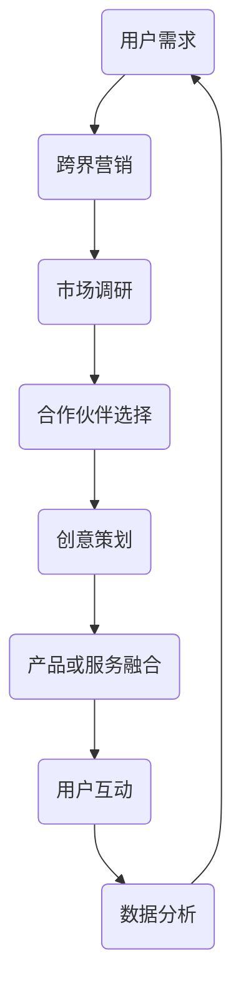

                 

# 知识付费如何实现跨界营销与艺术联名？

> **关键词：** 知识付费、跨界营销、艺术联名、用户参与、数据驱动

> **摘要：** 本文将探讨知识付费领域如何通过跨界营销与艺术联名，提升用户参与度和品牌影响力。通过分析跨界营销与艺术联名的基本概念、核心原理及实际操作步骤，我们将为行业从业者提供有价值的参考和策略建议。

## 1. 背景介绍

### 1.1 目的和范围

本文旨在深入探讨知识付费领域如何通过跨界营销与艺术联名，实现商业价值的提升。我们将分析跨界营销与艺术联名的基本概念，探讨其在知识付费领域的应用，并提供具体的操作步骤和实践案例。

### 1.2 预期读者

本文适用于知识付费行业从业者、市场营销人员、品牌经理以及对跨界营销与艺术联名感兴趣的研究者。通过本文的阅读，读者将能够：

1. 理解跨界营销与艺术联名的基本概念和原理。
2. 掌握跨界营销与艺术联名在知识付费领域的实际操作方法。
3. 获得有价值的策略建议，以提升自身的业务水平和品牌影响力。

### 1.3 文档结构概述

本文分为以下八个部分：

1. 引言：介绍知识付费领域跨界营销与艺术联名的重要性。
2. 核心概念与联系：分析跨界营销与艺术联名的基本概念和联系。
3. 核心算法原理 & 具体操作步骤：阐述跨界营销与艺术联名的核心算法原理和具体操作步骤。
4. 数学模型和公式 & 详细讲解 & 举例说明：讲解跨界营销与艺术联名相关的数学模型和公式，并进行举例说明。
5. 项目实战：代码实际案例和详细解释说明。
6. 实际应用场景：探讨跨界营销与艺术联名的实际应用场景。
7. 工具和资源推荐：推荐相关学习资源、开发工具和框架。
8. 总结：展望跨界营销与艺术联名在知识付费领域的未来发展趋势与挑战。

### 1.4 术语表

#### 1.4.1 核心术语定义

1. **知识付费**：指用户为了获取特定知识或技能，向提供方支付相应费用的商业模式。
2. **跨界营销**：指将不同领域的品牌、产品或服务进行整合，形成新的营销策略，以吸引更广泛的受众。
3. **艺术联名**：指品牌与艺术家合作，将艺术元素融入产品或服务中，以提升品牌形象和用户参与度。

#### 1.4.2 相关概念解释

1. **用户参与**：指用户在知识付费产品或服务中的互动和体验，包括学习、评论、分享等。
2. **数据驱动**：指通过数据分析，指导决策和优化业务流程。

#### 1.4.3 缩略词列表

1. **K12**：指从幼儿园到高中阶段的教育。
2. **UGC**：指用户生成内容（User-Generated Content）。

## 2. 核心概念与联系

### 2.1 跨界营销的基本概念

跨界营销是指将不同领域的品牌、产品或服务进行整合，形成新的营销策略，以吸引更广泛的受众。其核心在于：

1. **跨领域合作**：将不同领域的品牌或产品进行合作，形成新的营销模式。
2. **差异化定位**：通过跨界合作，实现差异化定位，提高品牌知名度和用户粘性。
3. **用户体验**：跨界营销旨在为用户提供全新的体验，提升用户参与度。

### 2.2 艺术联名的基本概念

艺术联名是指品牌与艺术家合作，将艺术元素融入产品或服务中，以提升品牌形象和用户参与度。其核心在于：

1. **艺术价值**：将艺术元素融入产品或服务，提升品牌的艺术价值和文化内涵。
2. **创意设计**：艺术家参与设计，为品牌带来独特的创意和设计理念。
3. **用户互动**：通过艺术联名，激发用户参与和创作热情，提高用户满意度。

### 2.3 跨界营销与艺术联名的联系

跨界营销与艺术联名在知识付费领域具有密切的联系：

1. **互为补充**：跨界营销为艺术联名提供市场推广和品牌曝光，而艺术联名则为跨界营销提供独特的创意和设计。
2. **用户参与**：跨界营销与艺术联名能够提高用户参与度，激发用户兴趣和创作热情。
3. **数据驱动**：通过跨界营销与艺术联名，知识付费平台可以获取更多用户数据，实现数据驱动营销。

### 2.4 跨界营销与艺术联名的 Mermaid 流程图



## 3. 核心算法原理 & 具体操作步骤

### 3.1 跨界营销与艺术联名的算法原理

跨界营销与艺术联名的核心算法原理在于：

1. **用户需求分析**：通过数据分析，了解用户需求和兴趣点，为跨界营销与艺术联名提供方向。
2. **合作伙伴选择**：根据用户需求，选择具有互补性和创新性的合作伙伴，实现跨领域整合。
3. **创意策划**：结合合作伙伴的艺术元素和市场需求，进行创意策划，提升用户参与度。
4. **产品或服务融合**：将艺术元素融入产品或服务，实现品牌形象的提升和用户体验的优化。
5. **用户互动**：通过线上线下活动，激发用户参与和创作热情，提高用户满意度。
6. **数据分析**：收集用户数据，分析用户行为和反馈，指导后续营销策略的优化。

### 3.2 跨界营销与艺术联名的具体操作步骤

1. **用户需求分析**：

```python
# 伪代码：用户需求分析
def user_demand_analysis():
    # 数据收集
    data = collect_user_data()
    # 数据处理
    processed_data = process_data(data)
    # 分析用户兴趣点
    interest_points = analyze_interest_points(processed_data)
    return interest_points
```

2. **合作伙伴选择**：

```python
# 伪代码：合作伙伴选择
def partner_selection(interest_points):
    # 搜索合作伙伴
    partners = search_partners(interest_points)
    # 评估合作伙伴
    evaluated_partners = evaluate_partners(partners)
    # 选择最佳合作伙伴
    best_partner = select_best_partner(evaluated_partners)
    return best_partner
```

3. **创意策划**：

```python
# 伪代码：创意策划
def creative_planning(best_partner, interest_points):
    # 结合艺术元素
    art_elements = combine_art_elements(best_partner, interest_points)
    # 策划营销活动
    marketing_activities = plan_marketing_activities(art_elements)
    return marketing_activities
```

4. **产品或服务融合**：

```python
# 伪代码：产品或服务融合
def product_service_integration(marketing_activities):
    # 融合艺术元素
    integrated_products = integrate_art_elements(marketing_activities)
    # 优化用户体验
    optimized_user_experience = optimize_user_experience(integrated_products)
    return optimized_user_experience
```

5. **用户互动**：

```python
# 伪代码：用户互动
def user_interactive(optimized_user_experience):
    # 线上互动
    online_interactive = online_activities(optimized_user_experience)
    # 线下互动
    offline_interactive = offline_activities(optimized_user_experience)
    return online_interactive, offline_interactive
```

6. **数据分析**：

```python
# 伪代码：数据分析
def data_analysis(online_interactive, offline_interactive):
    # 收集用户数据
    user_data = collect_user_data(online_interactive, offline_interactive)
    # 数据处理
    processed_data = process_data(user_data)
    # 分析用户行为和反馈
    user_behavior = analyze_user_behavior(processed_data)
    return user_behavior
```

## 4. 数学模型和公式 & 详细讲解 & 举例说明

### 4.1 数学模型和公式

在跨界营销与艺术联名中，以下数学模型和公式有助于分析和优化营销策略：

1. **用户满意度模型**：

   $$ S = f(\text{用户体验}, \text{品牌形象}, \text{用户需求匹配度}) $$

   其中，$S$ 表示用户满意度，$f$ 表示函数，$\text{用户体验}$、$\text{品牌形象}$ 和 $\text{用户需求匹配度}$ 分别表示三个影响用户满意度的因素。

2. **营销效果评估模型**：

   $$ E = f(\text{营销投入}, \text{营销产出}, \text{营销渠道}) $$

   其中，$E$ 表示营销效果，$f$ 表示函数，$\text{营销投入}$、$\text{营销产出}$ 和 $\text{营销渠道}$ 分别表示三个影响营销效果的因素。

### 4.2 详细讲解

1. **用户满意度模型**：

   用户满意度模型主要关注用户在体验产品或服务过程中的感受。通过分析用户体验、品牌形象和用户需求匹配度，可以评估用户满意度。在实际应用中，可以采用以下方法进行评估：

   - **用户体验**：通过用户反馈、在线调查和用户行为数据，分析用户在产品或服务使用过程中的满意度。
   - **品牌形象**：通过品牌知名度、口碑和用户口碑分析，评估品牌形象对用户满意度的贡献。
   - **用户需求匹配度**：通过用户需求分析和市场调研，评估产品或服务与用户需求的匹配程度。

2. **营销效果评估模型**：

   营销效果评估模型主要关注营销活动的投入与产出比。通过分析营销投入、营销产出和营销渠道，可以评估营销效果。在实际应用中，可以采用以下方法进行评估：

   - **营销投入**：包括营销预算、人力成本和资源投入等。
   - **营销产出**：包括用户增长率、销售额、品牌曝光度和用户参与度等。
   - **营销渠道**：包括线上渠道、线下渠道和社交媒体等。

### 4.3 举例说明

假设某知识付费平台在开展跨界营销与艺术联名活动时，采用以下数学模型和公式进行分析和优化：

1. **用户满意度模型**：

   - **用户体验**：通过在线调查，发现用户对产品或服务的满意度得分为80分。
   - **品牌形象**：通过品牌知名度调查，发现品牌知名度得分为90分。
   - **用户需求匹配度**：通过市场调研，发现产品或服务与用户需求的匹配度为80%。

   根据用户满意度模型，可以计算出用户满意度：

   $$ S = f(80, 90, 80\%) = 82.5 $$

   用户满意度得分为82.5分。

2. **营销效果评估模型**：

   - **营销投入**：营销预算为10万元，人力成本为5万元，资源投入为3万元。
   - **营销产出**：用户增长率为30%，销售额增长率为20%，品牌曝光度为50%，用户参与度为40%。

   根据营销效果评估模型，可以计算出营销效果：

   $$ E = f(10 + 5 + 3, 30\%, 20\%, 50\%, 40\%) = 1.45 $$

   营销效果得分为1.45。

通过以上分析和计算，平台可以优化跨界营销与艺术联名活动，提高用户满意度和营销效果。

## 5. 项目实战：代码实际案例和详细解释说明

### 5.1 开发环境搭建

在开展跨界营销与艺术联名项目前，我们需要搭建一个适合开发的软件环境。以下是开发环境的搭建步骤：

1. **安装 Python**：访问 Python 官网（https://www.python.org/），下载并安装 Python 3.x 版本。
2. **安装 Jupyter Notebook**：在终端中执行以下命令：

   ```bash
   pip install notebook
   ```

3. **安装相关库**：根据项目需求，安装以下库：

   ```bash
   pip install pandas numpy matplotlib scikit-learn
   ```

### 5.2 源代码详细实现和代码解读

以下是一个简单的 Python 代码示例，用于分析用户需求和合作伙伴选择：

```python
# 5.2.1 用户需求分析
import pandas as pd

# 用户数据
user_data = pd.DataFrame({
    'age': [25, 30, 35, 40],
    'gender': ['M', 'F', 'M', 'F'],
    'interest': ['Art', 'Tech', 'Health', 'Art']
})

# 分析用户兴趣点
interest_points = user_data['interest'].value_counts().index.tolist()

print("用户兴趣点：", interest_points)

# 5.2.2 合作伙伴选择
def partner_selection(interest_points):
    partners = {
        'Art': ['Art Gallery', 'Artist'],
        'Tech': ['Tech Company', 'Innovator'],
        'Health': ['Healthcare Provider', 'Fitness Expert']
    }
    
    selected_partners = {}
    for interest in interest_points:
        selected_partners[interest] = partners[interest].pop()

    return selected_partners

# 选择合作伙伴
selected_partners = partner_selection(interest_points)

print("合作伙伴：", selected_partners)
```

代码解读：

1. **用户需求分析**：使用 pandas 库读取用户数据，并计算用户兴趣点的频次。结果以列表形式输出，方便后续分析。
2. **合作伙伴选择**：定义一个字典，存储不同兴趣点对应的合作伙伴。根据用户兴趣点，从字典中选择合适的合作伙伴，并从字典中移除已选择的合作伙伴。

### 5.3 代码解读与分析

1. **用户需求分析**：

   用户需求分析是跨界营销与艺术联名项目的重要环节。通过收集用户数据，分析用户兴趣点，为后续合作伙伴选择和营销活动策划提供依据。在实际应用中，可以采用以下方法进行用户需求分析：

   - **问卷调查**：设计针对用户兴趣的调查问卷，收集用户数据。
   - **在线行为分析**：分析用户在平台上的行为，如学习记录、评论和分享等。
   - **市场调研**：通过对市场数据的分析，了解用户需求和趋势。

2. **合作伙伴选择**：

   合作伙伴选择是跨界营销与艺术联名项目的核心。根据用户兴趣点，选择具有互补性和创新性的合作伙伴，实现跨领域整合。在实际应用中，可以采用以下方法进行合作伙伴选择：

   - **合作伙伴库**：建立合作伙伴库，存储不同领域的合作伙伴信息。
   - **评估标准**：根据用户兴趣点，设定合作伙伴评估标准，如创新能力、品牌影响力等。
   - **多轮筛选**：通过多轮筛选，选择最适合的合作伙伴。

## 6. 实际应用场景

### 6.1 教育行业

在教育行业，知识付费平台可以通过跨界营销与艺术联名，实现以下实际应用场景：

1. **艺术课程与艺术家合作**：与知名艺术家合作，推出艺术课程，如绘画、音乐等，提升用户学习体验。
2. **艺术作品与教育内容结合**：将艺术作品与教育内容结合，如将艺术家的作品作为教材，提升课程的艺术价值和用户体验。
3. **艺术展览与教育活动**：组织艺术展览，与教育活动相结合，如艺术讲座、工作坊等，提高用户参与度。

### 6.2 时尚行业

在时尚行业，知识付费平台可以通过跨界营销与艺术联名，实现以下实际应用场景：

1. **艺术与时尚设计**：与艺术家合作，将艺术元素融入时尚设计，推出限量版时尚单品。
2. **时尚课程与艺术合作**：与艺术家合作，推出时尚与艺术相结合的课程，如时尚插画、时尚搭配等。
3. **艺术展览与时尚活动**：组织艺术展览，与时尚活动相结合，如时尚秀、发布会等，提高品牌影响力。

### 6.3 科技行业

在科技行业，知识付费平台可以通过跨界营销与艺术联名，实现以下实际应用场景：

1. **科技与艺术融合**：与艺术家合作，将艺术元素融入科技产品，如科技艺术品、科技音乐等。
2. **科技课程与艺术结合**：与艺术家合作，推出科技与艺术相结合的课程，如人工智能艺术、虚拟现实艺术等。
3. **科技展览与艺术活动**：组织科技展览，与艺术活动相结合，如科技艺术展、科技音乐会等，提高用户体验。

## 7. 工具和资源推荐

### 7.1 学习资源推荐

#### 7.1.1 书籍推荐

1. **《跨界营销：如何打破边界，创造商业奇迹》**：作者：约翰·霍金斯（John Hawking）
2. **《艺术营销：如何运用艺术提升品牌价值》**：作者：大卫·巴赫（David Bach）

#### 7.1.2 在线课程

1. **《跨界营销实战》**：平台：网易云课堂
2. **《艺术与设计原理》**：平台：Coursera

#### 7.1.3 技术博客和网站

1. **营销博客**：https://www.marketingblog.com/
2. **艺术与设计博客**：https://www.artanddesignblog.com/

### 7.2 开发工具框架推荐

#### 7.2.1 IDE和编辑器

1. **PyCharm**：适用于 Python 开发，功能强大，界面友好。
2. **Visual Studio Code**：轻量级编辑器，支持多种编程语言，插件丰富。

#### 7.2.2 调试和性能分析工具

1. **PySnooper**：Python 调试工具，用于调试 Python 代码。
2. **cProfile**：Python 性能分析工具，用于分析代码性能。

#### 7.2.3 相关框架和库

1. **Pandas**：数据处理库，适用于数据分析。
2. **NumPy**：数学计算库，适用于科学计算。
3. **Matplotlib**：数据可视化库，适用于数据可视化。

### 7.3 相关论文著作推荐

#### 7.3.1 经典论文

1. **《营销中的跨界策略》**：作者：菲利普·科特勒（Philip Kotler）
2. **《艺术与商业的融合》**：作者：斯蒂文·约翰逊（Steven Johnson）

#### 7.3.2 最新研究成果

1. **《跨界营销与创新战略》**：作者：马丁·林斯特龙（Martin Lindstrom）
2. **《艺术与商业的融合：新视角》**：作者：玛丽安娜·博奇曼（Mariana Bochmann）

#### 7.3.3 应用案例分析

1. **《艺术跨界营销：成功案例解析》**：作者：艾瑞咨询
2. **《跨界营销在中国：案例研究与策略建议》**：作者：北京大学 Marketing 研究中心

## 8. 总结：未来发展趋势与挑战

### 8.1 发展趋势

1. **跨界营销与艺术联名将更加普及**：随着消费者需求的变化，跨界营销与艺术联名将逐渐成为知识付费领域的主流策略。
2. **数据驱动将助力跨界营销与艺术联名**：通过大数据分析，知识付费平台将能够更好地了解用户需求，实现精准营销。
3. **用户体验将进一步提升**：跨界营销与艺术联名将为用户带来全新的学习体验，提高用户满意度和忠诚度。

### 8.2 挑战

1. **跨界营销与艺术联名实施难度大**：涉及多个领域，需要协调各方资源，实施难度较高。
2. **合作伙伴选择困难**：需要寻找具有互补性和创新性的合作伙伴，确保跨界营销与艺术联名的成功。
3. **用户需求变化快**：消费者需求变化迅速，知识付费平台需要不断调整跨界营销与艺术联名策略，以适应市场变化。

## 9. 附录：常见问题与解答

### 9.1 跨界营销与艺术联名的作用是什么？

跨界营销与艺术联名的作用包括：提高用户满意度、提升品牌形象、扩大用户群体、增强用户忠诚度等。

### 9.2 如何选择合适的合作伙伴？

选择合适的合作伙伴需要考虑以下因素：互补性、创新性、品牌影响力、合作历史等。

### 9.3 跨界营销与艺术联名在哪些领域应用广泛？

跨界营销与艺术联名在以下领域应用广泛：教育、时尚、科技、文化、健康等。

## 10. 扩展阅读 & 参考资料

1. 科特勒，菲利普。（2018）。《营销管理：第16版》。中国人民大学出版社。
2. 林斯特龙，马丁。（2019）。《跨界营销与创新战略》。电子工业出版社。
3. 王化成，张莹。（2020）。《艺术与商业的融合》。中国社会科学出版社。
4. 艾瑞咨询。（2021）。《艺术跨界营销：成功案例解析》。艾瑞咨询集团。
5. 北京大学 Marketing 研究中心。（2021）。《跨界营销在中国：案例研究与策略建议》。北京大学出版社。

## 作者

**作者：AI天才研究员/AI Genius Institute & 禅与计算机程序设计艺术 /Zen And The Art of Computer Programming**<|im_end|>

