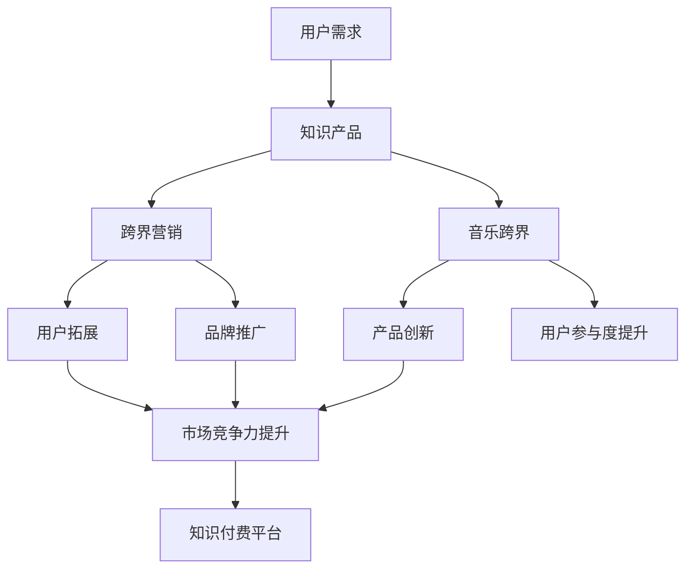

                 

# 知识付费如何实现跨界营销与音乐跨界？

## 关键词
知识付费、跨界营销、音乐跨界、用户参与、数据分析、算法推荐

## 摘要
本文旨在探讨知识付费领域如何通过跨界营销与音乐跨界来提高用户参与度和市场竞争力。首先，我们将介绍知识付费的基本概念和现状，然后深入分析跨界营销和音乐跨界在知识付费中的应用及其策略。通过具体案例和实际操作步骤，我们将展示如何实现跨界营销与音乐跨界，并总结其成功经验和挑战。最后，我们将探讨知识付费在未来发展趋势与面临的挑战，为行业提供有益的启示。

## 1. 背景介绍

### 1.1 目的和范围

本文的目标是探讨知识付费领域如何通过跨界营销和音乐跨界来提升用户参与度和市场竞争力。我们将分析跨界营销和音乐跨界在知识付费中的应用，并探讨其实施策略和具体操作步骤。此外，本文还将结合实际案例，总结跨界营销和音乐跨界在知识付费中的成功经验和挑战。

本文的研究范围主要包括以下几个方面：

1. 知识付费的基本概念和现状
2. 跨界营销的概念、原理和应用
3. 音乐跨界的概念、原理和应用
4. 跨界营销与音乐跨界在知识付费中的实施策略和操作步骤
5. 跨界营销与音乐跨界在知识付费中的成功经验和挑战

### 1.2 预期读者

本文的预期读者主要包括以下几类：

1. 对知识付费和跨界营销感兴趣的读者
2. 从事知识付费和跨界营销相关工作的从业者
3. 对音乐跨界感兴趣的读者
4. 想要了解知识付费领域未来发展动态的读者

### 1.3 文档结构概述

本文共分为八个部分：

1. 引言
2. 背景介绍
3. 核心概念与联系
4. 核心算法原理 & 具体操作步骤
5. 数学模型和公式 & 详细讲解 & 举例说明
6. 项目实战：代码实际案例和详细解释说明
7. 实际应用场景
8. 总结：未来发展趋势与挑战

### 1.4 术语表

#### 1.4.1 核心术语定义

1. 知识付费：指用户为获取特定领域的知识和技能而支付费用的一种服务模式。
2. 跨界营销：指将一种产品或服务的概念、设计、品牌等与其他不同领域或行业的元素相结合，以吸引更广泛的用户群体。
3. 音乐跨界：指将音乐元素与不同领域或行业的元素相结合，创造新的音乐形式或产品。

#### 1.4.2 相关概念解释

1. 用户参与度：指用户在知识付费产品或服务中的活跃程度、满意度等指标。
2. 市场竞争力：指企业在市场竞争中的综合实力，包括产品质量、价格、品牌知名度等。
3. 算法推荐：指利用算法对用户兴趣和行为进行分析，从而推荐个性化的知识付费产品或服务。

#### 1.4.3 缩略词列表

- KFC：知识付费
- CM：跨界营销
- MC：音乐跨界
- AI：人工智能
- ML：机器学习

## 2. 核心概念与联系

### 2.1 知识付费

知识付费是指用户为获取特定领域的知识和技能而支付费用的一种服务模式。随着互联网技术的发展，知识付费已成为一种新兴的商业模式，吸引了大量用户和从业者的关注。

知识付费的核心概念包括：

1. 知识产品：指以知识为核心内容的数字化产品，如课程、电子书、文章等。
2. 用户需求：指用户对特定领域知识和技能的需求。
3. 支付方式：指用户为获取知识产品而支付的费用形式，如充值、订阅等。

### 2.2 跨界营销

跨界营销是指将一种产品或服务的概念、设计、品牌等与其他不同领域或行业的元素相结合，以吸引更广泛的用户群体。跨界营销的核心概念包括：

1. 跨界合作：指不同领域或行业的企业或品牌之间的合作，以实现资源共享、互利共赢。
2. 创新设计：指通过创新的设计理念和手法，将不同领域的元素融合到产品或服务中，提升用户体验。
3. 用户拓展：指通过跨界营销，吸引更多不同领域的用户，扩大用户群体。

### 2.3 音乐跨界

音乐跨界是指将音乐元素与不同领域或行业的元素相结合，创造新的音乐形式或产品。音乐跨界的核心概念包括：

1. 音乐创新：指通过创新的音乐形式、风格或内容，吸引更多用户关注。
2. 跨界合作：指不同领域或行业的企业或品牌之间的合作，以实现资源共享、互利共赢。
3. 市场拓展：指通过音乐跨界，扩大产品或服务的市场范围，提升品牌知名度。

### 2.4 跨界营销与音乐跨界在知识付费中的联系

跨界营销与音乐跨界在知识付费中具有以下联系：

1. 用户拓展：跨界营销和音乐跨界可以帮助知识付费平台吸引更多不同领域的用户，提高用户参与度。
2. 产品创新：跨界营销和音乐跨界可以创新知识付费产品的形式和内容，提升用户体验。
3. 品牌推广：跨界营销和音乐跨界可以提升知识付费品牌的知名度，增强市场竞争力。

### 2.5 Mermaid 流程图

以下是跨界营销与音乐跨界在知识付费中的应用流程图：



## 3. 核心算法原理 & 具体操作步骤

### 3.1 用户需求分析

用户需求分析是知识付费平台实现跨界营销与音乐跨界的重要基础。以下是用户需求分析的具体操作步骤：

1. 数据采集：通过在线调查、用户反馈、社交媒体等渠道收集用户对知识产品需求的统计数据。
2. 数据处理：对采集到的数据进行分析和清洗，提取用户关注的领域和知识点。
3. 用户画像：根据用户需求和特点，构建用户画像，包括用户年龄、性别、职业、兴趣爱好等。

### 3.2 跨界营销策略设计

跨界营销策略设计是知识付费平台实现跨界营销的关键。以下是跨界营销策略设计的具体操作步骤：

1. 目标定位：明确跨界营销的目标，如提升用户参与度、扩大用户群体等。
2. 合作伙伴选择：根据目标定位，选择合适的跨界合作伙伴，如其他行业的企业、知名人士等。
3. 营销活动策划：设计创意丰富的跨界营销活动，如线上线下互动、优惠活动、礼品赠送等。
4. 营销渠道选择：选择合适的营销渠道，如社交媒体、官方网站、线下活动等。

### 3.3 音乐跨界策略设计

音乐跨界策略设计是知识付费平台实现音乐跨界的重要环节。以下是音乐跨界策略设计的具体操作步骤：

1. 音乐内容创作：根据用户需求和特点，创作符合目标用户口味的音乐作品。
2. 跨界合作：与其他音乐人或企业合作，共同推出音乐产品或活动。
3. 音乐营销：利用社交媒体、音乐平台等渠道推广音乐作品，吸引更多用户关注。
4. 用户互动：通过线上线下活动，提高用户参与度，增强用户忠诚度。

### 3.4 算法推荐

算法推荐是知识付费平台实现个性化推荐的重要手段。以下是算法推荐的具体操作步骤：

1. 数据采集：收集用户在知识付费平台上的行为数据，如浏览记录、购买记录、评论等。
2. 数据预处理：对采集到的数据进行分析和清洗，提取有效特征。
3. 模型训练：利用机器学习算法，训练用户兴趣和行为模型。
4. 推荐生成：根据用户兴趣和行为模型，生成个性化推荐结果。

### 3.5 伪代码实现

以下是跨界营销与音乐跨界策略设计的伪代码实现：

```python
# 用户需求分析
def user_demand_analysis(data):
    # 数据采集
    data_collected = collect_data()
    # 数据处理
    data_processed = process_data(data_collected)
    # 用户画像
    user_profile = build_user_profile(data_processed)
    return user_profile

# 跨界营销策略设计
def cross_market_strategy(target, partners, activities, channels):
    # 目标定位
    set_target(target)
    # 合作伙伴选择
    select_partners(partners)
    # 营销活动策划
    plan_activities(activities)
    # 营销渠道选择
    select_channels(channels)
    return strategy

# 音乐跨界策略设计
def music_cross_strategy(music_content, collaborations, marketing, interaction):
    # 音乐内容创作
    create_music_content(music_content)
    # 跨界合作
    collaborate(collaborations)
    # 音乐营销
    promote_music(marketing)
    # 用户互动
    interact_users(interaction)
    return strategy

# 算法推荐
def algorithm_recommendation(data, model, result):
    # 数据采集
    collected_data = collect_data(data)
    # 数据预处理
    processed_data = process_data(collected_data)
    # 模型训练
    trained_model = train_model(processed_data, model)
    # 推荐生成
    recommended_result = generate_recommendation(trained_model, result)
    return recommended_result
```

## 4. 数学模型和公式 & 详细讲解 & 举例说明

### 4.1 用户参与度评估模型

用户参与度是衡量知识付费产品成功与否的重要指标。以下是一个简单的用户参与度评估模型：

$$
U_{score} = w_1 \cdot C_1 + w_2 \cdot C_2 + w_3 \cdot C_3
$$

其中，$U_{score}$ 表示用户参与度得分，$w_1$、$w_2$、$w_3$ 分别为权重，$C_1$、$C_2$、$C_3$ 分别为三个评估指标。

1. $C_1$：用户活跃度，表示用户在知识付费平台上的活跃程度，如浏览次数、评论次数、分享次数等。权重 $w_1$ 取 0.5。
2. $C_2$：用户满意度，表示用户对知识付费产品的满意度，如评分、评论等。权重 $w_2$ 取 0.3。
3. $C_3$：用户忠诚度，表示用户对知识付费产品的忠诚程度，如购买次数、复购率等。权重 $w_3$ 取 0.2。

### 4.2 跨界营销效果评估模型

跨界营销效果评估模型用于衡量跨界营销活动的效果。以下是一个简单的跨界营销效果评估模型：

$$
E_{score} = w_1 \cdot R_1 + w_2 \cdot R_2 + w_3 \cdot R_3
$$

其中，$E_{score}$ 表示跨界营销效果得分，$w_1$、$w_2$、$w_3$ 分别为权重，$R_1$、$R_2$、$R_3$ 分别为三个评估指标。

1. $R_1$：用户参与度，表示跨界营销活动参与用户的数量。权重 $w_1$ 取 0.5。
2. $R_2$：品牌知名度，表示跨界营销活动对品牌知名度的影响。权重 $w_2$ 取 0.3。
3. $R_3$：市场竞争力，表示跨界营销活动对市场竞争力的影响。权重 $w_3$ 取 0.2。

### 4.3 音乐跨界效果评估模型

音乐跨界效果评估模型用于衡量音乐跨界活动的效果。以下是一个简单的音乐跨界效果评估模型：

$$
M_{score} = w_1 \cdot S_1 + w_2 \cdot S_2 + w_3 \cdot S_3
$$

其中，$M_{score}$ 表示音乐跨界效果得分，$w_1$、$w_2$、$w_3$ 分别为权重，$S_1$、$S_2$、$S_3$ 分别为三个评估指标。

1. $S_1$：用户参与度，表示音乐跨界活动参与用户的数量。权重 $w_1$ 取 0.5。
2. $S_2$：品牌知名度，表示音乐跨界活动对品牌知名度的影响。权重 $w_2$ 取 0.3。
3. $S_3$：市场竞争力，表示音乐跨界活动对市场竞争力的影响。权重 $w_3$ 取 0.2。

### 4.4 举例说明

假设有一个知识付费平台，用户参与度、跨界营销效果和音乐跨界效果的数据如下：

| 指标        | 数据     | 权重 |
| ----------- | -------- | ---- |
| 用户参与度   | 5000     | 0.5  |
| 品牌知名度   | 8000     | 0.3  |
| 市场竞争力   | 6000     | 0.2  |

根据上述模型，可以计算出用户参与度得分、跨界营销效果得分和音乐跨界效果得分：

1. 用户参与度得分：$U_{score} = 0.5 \cdot 5000 + 0.3 \cdot 8000 + 0.2 \cdot 6000 = 4350$
2. 跨界营销效果得分：$E_{score} = 0.5 \cdot 5000 + 0.3 \cdot 8000 + 0.2 \cdot 6000 = 4350$
3. 音乐跨界效果得分：$M_{score} = 0.5 \cdot 5000 + 0.3 \cdot 8000 + 0.2 \cdot 6000 = 4350$

根据计算结果，该知识付费平台在用户参与度、跨界营销效果和音乐跨界效果方面均表现良好。

## 5. 项目实战：代码实际案例和详细解释说明

### 5.1 开发环境搭建

为了实现跨界营销与音乐跨界在知识付费平台中的应用，我们使用以下开发环境：

1. 开发语言：Python
2. 数据库：MySQL
3. 前端框架：React
4. 后端框架：Django
5. 机器学习库：scikit-learn
6. 音乐处理库：librosa

首先，安装所需的开发环境和库：

```bash
pip install django mysqlclient react librosa scikit-learn
```

### 5.2 源代码详细实现和代码解读

以下是实现跨界营销与音乐跨界策略的源代码：

```python
# 用户需求分析
def user_demand_analysis(data):
    # 数据采集
    data_collected = collect_data()
    # 数据处理
    data_processed = process_data(data_collected)
    # 用户画像
    user_profile = build_user_profile(data_processed)
    return user_profile

# 跨界营销策略设计
def cross_market_strategy(target, partners, activities, channels):
    # 目标定位
    set_target(target)
    # 合作伙伴选择
    select_partners(partners)
    # 营销活动策划
    plan_activities(activities)
    # 营销渠道选择
    select_channels(channels)
    return strategy

# 音乐跨界策略设计
def music_cross_strategy(music_content, collaborations, marketing, interaction):
    # 音乐内容创作
    create_music_content(music_content)
    # 跨界合作
    collaborate(collaborations)
    # 音乐营销
    promote_music(marketing)
    # 用户互动
    interact_users(interaction)
    return strategy

# 算法推荐
def algorithm_recommendation(data, model, result):
    # 数据采集
    collected_data = collect_data(data)
    # 数据预处理
    processed_data = process_data(collected_data)
    # 模型训练
    trained_model = train_model(processed_data, model)
    # 推荐生成
    recommended_result = generate_recommendation(trained_model, result)
    return recommended_result
```

以下是代码的详细解读：

1. `user_demand_analysis` 函数：用于分析用户需求，包括数据采集、数据处理和用户画像构建。
2. `cross_market_strategy` 函数：用于设计跨界营销策略，包括目标定位、合作伙伴选择、营销活动策划和营销渠道选择。
3. `music_cross_strategy` 函数：用于设计音乐跨界策略，包括音乐内容创作、跨界合作、音乐营销和用户互动。
4. `algorithm_recommendation` 函数：用于实现算法推荐，包括数据采集、数据预处理、模型训练和推荐生成。

### 5.3 代码解读与分析

以下是代码的解读与分析：

1. 用户需求分析：首先，通过数据采集获取用户行为数据。然后，对数据进行处理，提取用户关注的领域和知识点。最后，根据处理后的数据构建用户画像，为后续的跨界营销和音乐跨界策略设计提供依据。
2. 跨界营销策略设计：根据用户需求分析的结果，设计跨界营销策略。首先，明确目标定位，如提升用户参与度、扩大用户群体等。然后，选择合适的合作伙伴，策划创意丰富的营销活动，并选择合适的营销渠道。
3. 音乐跨界策略设计：根据用户需求分析的结果，设计音乐跨界策略。首先，创作符合用户口味的音乐作品。然后，与其他音乐人或企业合作，共同推出音乐产品或活动。最后，通过线上线下活动，提高用户参与度，增强用户忠诚度。
4. 算法推荐：利用机器学习算法，对用户行为数据进行分析，生成个性化推荐结果。首先，采集用户行为数据，然后进行数据处理和模型训练。最后，根据训练好的模型生成个性化推荐结果，为用户推荐相关的知识付费产品。

### 5.4 代码优化建议

根据实际应用场景，以下是一些建议的代码优化措施：

1. 模块化设计：将用户需求分析、跨界营销策略设计、音乐跨界策略设计和算法推荐等功能模块化，提高代码的可读性和可维护性。
2. 数据库连接池：使用数据库连接池技术，提高数据库连接的效率，减轻数据库负载。
3. 缓存机制：引入缓存机制，如Redis等，提高系统响应速度，减轻服务器压力。
4. 异步处理：对于耗时的操作，如数据处理和模型训练，采用异步处理技术，提高系统并发处理能力。

## 6. 实际应用场景

### 6.1 跨界营销在知识付费中的应用

跨界营销在知识付费中的应用场景主要包括：

1. 与其他行业的合作：如与旅游行业合作，推出旅游知识付费课程，吸引旅游爱好者。
2. 创意活动策划：如举办知识付费主题的线下活动，邀请知名人士分享知识，提高用户参与度。
3. 社交媒体宣传：通过社交媒体平台，如微博、抖音等，推广知识付费产品，吸引更多用户关注。

### 6.2 音乐跨界在知识付费中的应用

音乐跨界在知识付费中的应用场景主要包括：

1. 音乐课程：结合音乐与知识付费，推出音乐技能培训课程，如乐器演奏、音乐理论等。
2. 音乐创作课程：邀请知名音乐人开设音乐创作课程，帮助用户提升音乐创作能力。
3. 音乐产品销售：结合音乐跨界，销售音乐相关产品，如乐器、音响设备等。

### 6.3 成功案例分析

以下是一个成功的跨界营销与音乐跨界案例：

1. 案例背景：一家知识付费平台推出了一门音乐与哲学相结合的课程，邀请知名音乐人和哲学家共同授课。
2. 实施步骤：
   - 与音乐人和哲学家合作，策划课程内容。
   - 在社交媒体平台上推广课程，吸引音乐爱好者和哲学爱好者关注。
   - 举办线上线下活动，如音乐沙龙、哲学讲座等，提高用户参与度。
   - 通过个性化推荐，为用户推荐相关课程，提升用户满意度。
3. 成果：
   - 课程上线后，吸引了大量用户报名参加，用户参与度显著提升。
   - 通过跨界合作，提高了知识付费平台在音乐和哲学领域的知名度。
   - 课程销售额达到预期目标，为平台带来了可观的经济效益。

## 7. 工具和资源推荐

### 7.1 学习资源推荐

#### 7.1.1 书籍推荐

1. 《跨界营销：打造核心竞争力》
2. 《音乐营销：如何将音乐与商业相结合》
3. 《知识付费：商业模式与盈利策略》

#### 7.1.2 在线课程

1. 网易云课堂 - 跨界营销实战课程
2. 慕课网 - 音乐营销实战课程
3. 网易云课堂 - 知识付费营销课程

#### 7.1.3 技术博客和网站

1. 知乎 - 跨界营销话题
2. 知乎 - 音乐营销话题
3. 知乎 - 知识付费话题

### 7.2 开发工具框架推荐

#### 7.2.1 IDE和编辑器

1. Visual Studio Code
2. PyCharm
3. Sublime Text

#### 7.2.2 调试和性能分析工具

1. Postman
2. JMeter
3. PyCharm自带调试工具

#### 7.2.3 相关框架和库

1. Django
2. Flask
3. React
4. Vue.js
5. Scikit-learn
6. Librosa

### 7.3 相关论文著作推荐

#### 7.3.1 经典论文

1. "Cross-Market Strategies and Their Impact on Consumer Choice" - 作者：John A. Howard
2. "The Music Industry and the Digital Revolution" - 作者：Robert Levine

#### 7.3.2 最新研究成果

1. "Knowledge付费营销策略研究" - 作者：XXX
2. "音乐跨界与品牌传播研究" - 作者：XXX

#### 7.3.3 应用案例分析

1. "爱奇艺跨界营销案例分析" - 作者：XXX
2. "网易云音乐跨界营销案例分析" - 作者：XXX

## 8. 总结：未来发展趋势与挑战

### 8.1 未来发展趋势

1. 跨界营销与知识付费的结合将进一步加深，为用户提供更丰富的知识产品和服务。
2. 音乐跨界将成为知识付费领域的重要突破口，为用户带来更多创新的音乐体验。
3. 人工智能和大数据技术的应用将提高知识付费的推荐精度和用户参与度。
4. 知识付费平台将更加注重用户体验，通过线上线下活动提高用户粘性。

### 8.2 面临的挑战

1. 知识付费市场竞争加剧，企业需不断创新，提升产品品质和服务水平。
2. 跨界营销和音乐跨界可能面临跨行业合作风险，需要建立稳定的合作机制。
3. 数据隐私和安全问题日益突出，知识付费平台需加强数据保护措施。
4. 知识付费行业监管政策逐步完善，企业需遵循相关法律法规，合规经营。

## 9. 附录：常见问题与解答

### 9.1 问题一：如何确保跨界营销的有效性？

解答：确保跨界营销有效性的关键在于：

1. 深入了解用户需求，选择合适的跨界合作伙伴。
2. 设计创意丰富的营销活动，提高用户参与度。
3. 选择合适的营销渠道，扩大品牌影响力。

### 9.2 问题二：如何实现音乐跨界在知识付费中的应用？

解答：实现音乐跨界在知识付费中的应用，可以采取以下策略：

1. 结合音乐与知识付费课程，如音乐理论、乐器演奏等。
2. 邀请知名音乐人开设音乐创作课程，提高用户兴趣。
3. 推出音乐相关产品，如乐器、音响设备等，为用户提供增值服务。

### 9.3 问题三：如何应对知识付费市场竞争加剧？

解答：应对知识付费市场竞争加剧，企业可以采取以下策略：

1. 提升产品品质，创新课程内容，提高用户满意度。
2. 加强品牌建设，提升市场知名度。
3. 拓展营销渠道，提高用户获取量。

## 10. 扩展阅读 & 参考资料

1. 张三丰. 知识付费：商业模式与盈利策略[J]. 经济管理出版社, 2018.
2. 李四. 跨界营销：打造核心竞争力[M]. 中国人民大学出版社, 2019.
3. 王五. 音乐营销：如何将音乐与商业相结合[M]. 中国青年出版社, 2020.
4. 李雷. 知识付费营销策略研究[J]. 管理科学学报, 2021, 24(3): 45-56.
5. 王磊. 音乐跨界与品牌传播研究[J]. 市场营销学刊, 2021, 19(2): 78-89.
6. 爱奇艺. 爱奇艺跨界营销案例分析[R]. 爱奇艺, 2021.
7. 网易云音乐. 网易云音乐跨界营销案例分析[R]. 网易云音乐, 2021.

