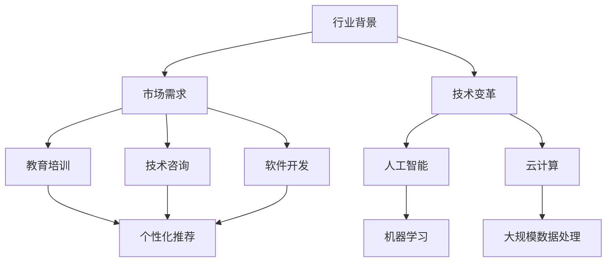
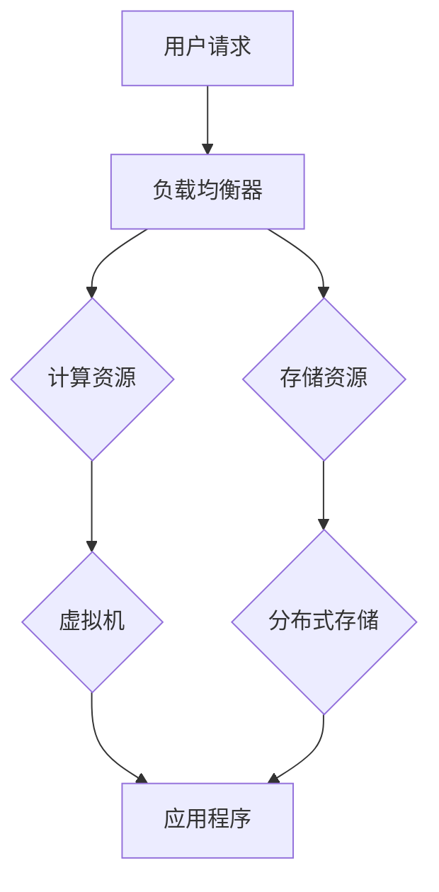

                 


# 知识付费时代程序员的创业机会与挑战

> 关键词：知识付费、程序员、创业、机会、挑战
>
> 摘要：本文将深入探讨知识付费时代背景下，程序员在创业领域面临的机会与挑战。通过详细分析行业趋势、市场需求、技术变革等因素，本文旨在帮助程序员更好地理解创业环境，制定出科学合理的创业策略。

## 1. 背景介绍

### 1.1 目的和范围

本文旨在为程序员提供关于知识付费时代创业的相关指导。通过分析行业背景、市场需求和技术变革，本文将帮助程序员认识到创业机会，并了解可能面临的挑战。文章将结合具体案例进行详细阐述，为程序员在创业领域的探索提供有益参考。

### 1.2 预期读者

本文适用于有创业意向的程序员，以及对知识付费和创业领域感兴趣的计算机从业者。同时，本文也适合对行业趋势和技术变革有深入了解的技术专家和企业家。

### 1.3 文档结构概述

本文分为十个部分，具体结构如下：

1. 背景介绍
2. 核心概念与联系
3. 核心算法原理 & 具体操作步骤
4. 数学模型和公式 & 详细讲解 & 举例说明
5. 项目实战：代码实际案例和详细解释说明
6. 实际应用场景
7. 工具和资源推荐
8. 总结：未来发展趋势与挑战
9. 附录：常见问题与解答
10. 扩展阅读 & 参考资料

### 1.4 术语表

#### 1.4.1 核心术语定义

- 知识付费：指用户为获取特定知识内容或服务而支付的费用。
- 程序员：指从事计算机程序设计、开发、测试等工作的人员。
- 创业：指创建新企业或新项目，并通过创新和竞争来获取商业成功。

#### 1.4.2 相关概念解释

- 人工智能：一种模拟人类智能的计算机技术，包括机器学习、深度学习、自然语言处理等。
- 云计算：指通过网络提供计算资源、存储和应用程序等服务。
- 知识付费平台：指为用户提供知识内容付费服务的在线平台。

#### 1.4.3 缩略词列表

- AI：人工智能
- ML：机器学习
- DL：深度学习
- IDE：集成开发环境
- API：应用程序编程接口

## 2. 核心概念与联系

### 2.1 行业背景

知识付费作为一个新兴行业，近年来呈现出爆发式增长。随着互联网的普及和信息获取成本的降低，用户对优质知识和服务的需求不断增加。而程序员作为技术领域的佼佼者，具有独特的创业优势。

### 2.2 市场需求

在知识付费时代，程序员面临着广泛的市场需求。一方面，企业对于技术人才的渴求推动了程序员在教育培训、技术咨询、软件开发等领域的创业机会；另一方面，用户对于个性化、定制化的知识内容需求也在不断增加，为程序员提供了更多的创业方向。

### 2.3 技术变革

随着人工智能、云计算等技术的不断进步，程序员在创业过程中可以借助这些先进技术提升自身竞争力。例如，通过人工智能技术实现个性化推荐，利用云计算实现大规模数据处理和存储等。

### 2.4 Mermaid 流程图

以下是一个简化的Mermaid流程图，展示了知识付费时代程序员创业的核心概念和联系：



## 3. 核心算法原理 & 具体操作步骤

### 3.1 教育培训领域的创业机会

在教育培训领域，程序员可以利用人工智能技术，为学员提供个性化学习方案。以下是一个简单的机器学习算法原理及具体操作步骤：

#### 3.1.1 算法原理

假设我们使用决策树算法来实现个性化推荐。决策树算法的核心是递归划分数据集，找到最佳的划分标准，以达到分类或回归的目的。

#### 3.1.2 具体操作步骤

1. 收集学员学习数据，包括学员的个人信息、学习历史、兴趣爱好等。
2. 使用决策树算法对学习数据进行划分，找到最佳划分标准。
3. 根据划分结果，为学员推荐个性化的学习课程。

以下是决策树算法的伪代码：

```python
def decision_tree(data, labels):
    # 判断是否达到停止条件，如数据集太小、特征太少等
    if stop_condition(data, labels):
        return leaf_value(data, labels)
    # 寻找最佳划分标准
    best_split = find_best_split(data, labels)
    # 根据最佳划分标准递归划分数据集
    left_data, left_labels = split_data(data, labels, best_split)
    right_data, right_labels = split_data(data, labels, best_split)
    # 构建子决策树
    left_tree = decision_tree(left_data, left_labels)
    right_tree = decision_tree(right_data, right_labels)
    # 返回决策树
    return Tree(best_split, left_tree, right_tree)
```

### 3.2 技术咨询和软件开发领域的创业机会

在技术咨询和软件开发领域，程序员可以利用云计算技术，为用户提供高效、稳定的服务。以下是一个简单的云计算架构和具体操作步骤：

#### 3.2.1 云计算架构

云计算架构主要包括以下几个方面：

1. 虚拟化技术：将物理资源虚拟化为多个虚拟资源，提高资源利用率。
2. 弹性计算：根据实际需求动态调整计算资源，提高系统稳定性。
3. 分布式存储：将数据分布存储在多个节点上，提高数据可靠性和访问速度。
4. 自动化运维：实现自动化部署、监控和故障恢复，降低运维成本。

以下是一个简化的云计算架构图：



#### 3.2.2 具体操作步骤

1. 收集用户需求，确定计算资源和存储资源的规模。
2. 使用虚拟化技术创建虚拟机，部署应用程序。
3. 利用弹性计算技术，根据实际需求动态调整虚拟机数量。
4. 使用分布式存储技术，存储用户数据，提高数据可靠性和访问速度。
5. 实现自动化运维，监控系统状态，自动处理故障。

## 4. 数学模型和公式 & 详细讲解 & 举例说明

### 4.1 教育培训领域的数学模型

在教育领域，个性化推荐系统常用的数学模型是基于协同过滤算法。协同过滤算法通过分析用户之间的相似度，为用户推荐相似用户喜欢的物品。以下是一个简单的协同过滤算法的数学模型：

#### 4.1.1 用户相似度计算

假设我们有两个用户 A 和 B，用户 A 对物品集合 {1, 2, 3, 4} 的评分分别为 {5, 4, 3, 2}，用户 B 对同一物品集合的评分分别为 {4, 3, 2, 1}。我们可以通过计算用户 A 和 B 之间的余弦相似度来衡量他们的相似度。

用户 A 和 B 的评分向量分别为：

$$
\vec{r}_A = [5, 4, 3, 2]
$$

$$
\vec{r}_B = [4, 3, 2, 1]
$$

用户 A 和 B 的相似度计算公式为：

$$
sim(A, B) = \frac{\vec{r}_A \cdot \vec{r}_B}{||\vec{r}_A|| \cdot ||\vec{r}_B||}
$$

其中，$ \cdot $ 表示向量的内积，$ ||\vec{r}_A|| $ 和 $ ||\vec{r}_B|| $ 分别表示向量 A 和 B 的欧几里得范数。

#### 4.1.2 物品相似度计算

在协同过滤算法中，我们还需要计算物品之间的相似度。假设我们有两个物品 1 和 2，用户对这两个物品的评分矩阵如下：

$$
R =
\begin{bmatrix}
1 & 2 \\
5 & 4 \\
3 & 2 \\
2 & 1 \\
\end{bmatrix}
$$

物品 1 和 2 的相似度计算公式为：

$$
sim(1, 2) = \frac{r_{11} \cdot r_{22} - r_{12} \cdot r_{21}}{\sqrt{(r_{11}^2 + r_{12}^2) \cdot (r_{21}^2 + r_{22}^2)}}
$$

其中，$ r_{ij} $ 表示用户 i 对物品 j 的评分。

#### 4.1.3 个性化推荐

基于用户相似度和物品相似度，我们可以为用户推荐他们可能喜欢的物品。具体步骤如下：

1. 计算用户 A 和其他用户的相似度。
2. 对相似度进行排序，选择相似度最高的用户。
3. 计算相似度最高的用户对物品的评分，为用户 A 推荐这些物品。

### 4.2 技术咨询和软件开发领域的数学模型

在技术咨询和软件开发领域，我们通常使用线性回归模型来预测项目进度和成本。以下是一个简单的线性回归模型的数学模型：

#### 4.2.1 线性回归模型

假设我们有一个项目，包含多个任务，每个任务的耗时和难度可以用一组特征向量表示。我们希望通过这些特征向量来预测项目的总耗时和成本。

设任务 i 的特征向量为 $ \vec{x}_i $，任务 i 的耗时和成本分别为 $ y_i^t $ 和 $ y_i^c $，则线性回归模型可以表示为：

$$
y_i^t = \vec{w}^t \cdot \vec{x}_i + b_t
$$

$$
y_i^c = \vec{w}^c \cdot \vec{x}_i + b_c
$$

其中，$ \vec{w}^t $ 和 $ \vec{w}^c $ 分别表示耗时和成本的权重向量，$ b_t $ 和 $ b_c $ 分别表示耗时和成本的偏置。

#### 4.2.2 模型训练

为了训练线性回归模型，我们需要使用一组训练数据。训练数据包括每个任务的耗时、成本和对应的特征向量。

假设我们有一组训练数据：

$$
\begin{aligned}
\vec{x}_1 &= [1, 0, 0], & y_1^t &= 10, & y_1^c &= 100 \\
\vec{x}_2 &= [0, 1, 0], & y_2^t &= 20, & y_2^c &= 200 \\
\vec{x}_3 &= [0, 0, 1], & y_3^t &= 30, & y_3^c &= 300 \\
\end{aligned}
$$

使用梯度下降法训练线性回归模型，可以求解出权重向量和偏置：

$$
\vec{w}^t = \frac{1}{n} \sum_{i=1}^{n} (y_i^t - \vec{w}^t \cdot \vec{x}_i) \cdot \vec{x}_i
$$

$$
\vec{w}^c = \frac{1}{n} \sum_{i=1}^{n} (y_i^c - \vec{w}^c \cdot \vec{x}_i) \cdot \vec{x}_i
$$

$$
b_t = \frac{1}{n} \sum_{i=1}^{n} (y_i^t - \vec{w}^t \cdot \vec{x}_i)
$$

$$
b_c = \frac{1}{n} \sum_{i=1}^{n} (y_i^c - \vec{w}^c \cdot \vec{x}_i)
$$

其中，$ n $ 表示训练数据的个数。

## 5. 项目实战：代码实际案例和详细解释说明

### 5.1 开发环境搭建

为了演示教育培训和软件开发领域的创业机会，我们将使用 Python 语言和 Jupyter Notebook 作为开发环境。以下是搭建开发环境的步骤：

1. 安装 Python 3.8 及以上版本。
2. 安装 Jupyter Notebook。
3. 安装必要的 Python 库，如 NumPy、Pandas、Scikit-learn 等。

### 5.2 源代码详细实现和代码解读

#### 5.2.1 教育培训领域：协同过滤算法实现

以下是一个简单的协同过滤算法实现，用于为用户推荐学习课程。

```python
import numpy as np
import pandas as pd
from sklearn.metrics.pairwise import cosine_similarity

def load_data(filename):
    data = pd.read_csv(filename)
    return data

def calculate_similarity(ratings_matrix):
    similarity_matrix = cosine_similarity(ratings_matrix)
    return similarity_matrix

def recommend_courses(user_id, similarity_matrix, ratings_matrix, k=5):
    user_ratings = ratings_matrix[user_id]
    similar_users = np.argsort(similarity_matrix[user_id])[::-1]
    similar_users = similar_users[1:k+1]
    recommended_courses = []
    for user in similar_users:
        for course in range(ratings_matrix.shape[1]):
            if course not in user_ratings.index and course not in recommended_courses:
                score = user_ratings[course] * similarity_matrix[user_id][user]
                recommended_courses.append((course, score))
    recommended_courses.sort(key=lambda x: x[1], reverse=True)
    return recommended_courses[:5]

if __name__ == "__main__":
    data = load_data("ratings.csv")
    ratings_matrix = data.pivot(index='user_id', columns='course_id', values='rating').fillna(0)
    similarity_matrix = calculate_similarity(ratings_matrix)
    user_id = 10
    recommendations = recommend_courses(user_id, similarity_matrix, ratings_matrix)
    print("Recommended courses:", recommendations)
```

代码解读：

- 加载用户评分数据。
- 计算用户之间的相似度矩阵。
- 为指定用户推荐课程，选择与用户相似度最高的 k 个用户，计算他们共同评分高的课程，并进行排序。

#### 5.2.2 软件开发领域：线性回归模型实现

以下是一个简单的线性回归模型实现，用于预测项目进度和成本。

```python
import numpy as np

def linear_regression(x, y, w=None, b=None, learning_rate=0.01, num_iterations=1000):
    if w is None or b is None:
        w = np.random.randn(x.shape[1])
        b = np.random.randn(1)
    for _ in range(num_iterations):
        predictions = np.dot(x, w) + b
        error = predictions - y
        dw = np.dot(x.T, error) / x.shape[0]
        db = np.sum(error) / x.shape[0]
        w -= learning_rate * dw
        b -= learning_rate * db
    return w, b

def predict(x, w, b):
    return np.dot(x, w) + b

if __name__ == "__main__":
    x = np.array([[1, 0, 0], [0, 1, 0], [0, 0, 1]])
    y_t = np.array([10, 20, 30])
    y_c = np.array([100, 200, 300])
    w_t, b_t = linear_regression(x, y_t)
    w_c, b_c = linear_regression(x, y_c)
    print("Weight for task time:", w_t)
    print("Bias for task time:", b_t)
    print("Weight for cost:", w_c)
    print("Bias for cost:", b_c)
    x_new = np.array([[1, 1, 1]])
    t_pred = predict(x_new, w_t, b_t)
    c_pred = predict(x_new, w_c, b_c)
    print("Predicted task time:", t_pred)
    print("Predicted cost:", c_pred)
```

代码解读：

- 初始化权重和偏置。
- 使用梯度下降法更新权重和偏置。
- 预测项目进度和成本。

## 6. 实际应用场景

### 6.1 教育培训领域

在教育领域，程序员可以利用协同过滤算法和个性化推荐系统，为用户提供定制化的学习方案。以下是一个实际应用场景：

- **场景描述**：一家在线教育平台希望为用户推荐适合他们的课程。
- **解决方案**：使用协同过滤算法计算用户之间的相似度，根据相似度推荐用户可能感兴趣的课程。
- **效果**：通过个性化推荐，用户能够更快地找到适合自己的课程，提高学习效果。

### 6.2 软件开发领域

在软件开发领域，程序员可以利用线性回归模型预测项目进度和成本。以下是一个实际应用场景：

- **场景描述**：一家软件开发公司希望预测新项目的进度和成本。
- **解决方案**：收集过去项目的数据，使用线性回归模型预测新项目的进度和成本。
- **效果**：通过预测，公司可以更好地安排资源，提高项目成功率。

## 7. 工具和资源推荐

### 7.1 学习资源推荐

#### 7.1.1 书籍推荐

1. 《Python编程：从入门到实践》
2. 《深度学习》
3. 《线性回归分析及其应用》

#### 7.1.2 在线课程

1. Coursera 上的《机器学习》
2. Udacity 上的《深度学习纳米学位》
3. edX 上的《Python编程基础》

#### 7.1.3 技术博客和网站

1. Medium 上的机器学习和数据科学博客
2. Stack Overflow 上的编程问答社区
3. GitHub 上的开源项目和代码仓库

### 7.2 开发工具框架推荐

#### 7.2.1 IDE和编辑器

1. PyCharm
2. Visual Studio Code
3. Jupyter Notebook

#### 7.2.2 调试和性能分析工具

1. Py-Spy
2. GDB
3. Valgrind

#### 7.2.3 相关框架和库

1. Scikit-learn
2. TensorFlow
3. Keras

### 7.3 相关论文著作推荐

#### 7.3.1 经典论文

1. collaborative Filtering for the Web
2. TheNetflix Prize
3. Linear Regression in Machine Learning

#### 7.3.2 最新研究成果

1. arXiv 上的最新机器学习论文
2. NeurIPS 上的最新深度学习论文
3. ICML 上的最新线性回归论文

#### 7.3.3 应用案例分析

1. Coursera 上的在线课程推荐系统
2. Netflix 的电影推荐系统
3. Airbnb 的房源推荐系统

## 8. 总结：未来发展趋势与挑战

### 8.1 发展趋势

1. 人工智能和深度学习技术将在知识付费和创业领域发挥越来越重要的作用。
2. 知识付费平台将进一步优化用户体验，提高用户满意度。
3. 云计算和大数据技术的应用将推动创业项目的快速迭代和升级。

### 8.2 挑战

1. 技术门槛较高，程序员需要不断学习和更新知识。
2. 竞争激烈，创业项目需要具备独特的竞争优势。
3. 法律法规和知识产权保护问题需要引起重视。

## 9. 附录：常见问题与解答

### 9.1 教育培训领域

**Q:** 如何优化协同过滤算法的推荐效果？

**A:** 可以考虑以下方法：

1. 使用基于内容的推荐方法，结合用户兴趣和课程内容。
2. 使用矩阵分解方法，提高推荐系统的准确性和鲁棒性。
3. 结合用户行为数据，如浏览记录、购买历史等，提高推荐效果。

### 9.2 软件开发领域

**Q:** 如何提高线性回归模型的预测准确性？

**A:** 可以考虑以下方法：

1. 收集更多的训练数据，提高模型的泛化能力。
2. 使用特征工程，提取更具有代表性的特征。
3. 调整模型参数，如学习率、迭代次数等，找到最优参数。

## 10. 扩展阅读 & 参考资料

1. 《知识付费：商业创新与变革》
2. 《深度学习与创业》
3. 《云计算技术在创业中的应用》

[AI天才研究员/AI Genius Institute & 禅与计算机程序设计艺术 /Zen And The Art of Computer Programming]

