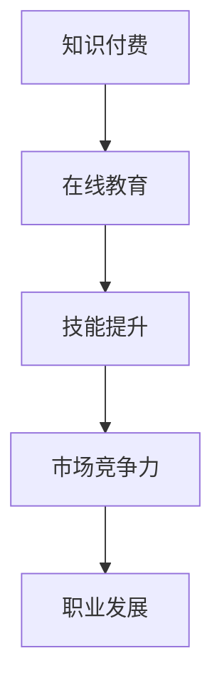

                 

# 知识付费时代程序员的发展机遇

> **关键词：知识付费、程序员、发展机遇、技能提升、市场竞争力**
>
> **摘要：本文将深入探讨知识付费时代对程序员职业发展带来的机遇，分析程序员如何在这个背景下提升自身技能，增强市场竞争力，以及应对潜在挑战。**

## 1. 背景介绍

### 1.1 目的和范围

本文旨在探讨知识付费时代下程序员的发展机遇，旨在帮助程序员理解知识付费的背景、优势及其对职业发展的影响。文章将涵盖以下几个主要方面：

- 知识付费的概念及其在技术领域的应用
- 程序员在知识付费时代的职业发展机遇
- 提升技能的方法与策略
- 增强市场竞争力的重要性
- 面对挑战的策略

### 1.2 预期读者

本文预期读者包括：

- 有志于在知识付费时代提升技能的程序员
- 对编程和软件开发感兴趣的技术爱好者
- 想了解程序员职业发展趋势的技术管理人员

### 1.3 文档结构概述

本文将分为以下几个部分：

- 背景介绍
- 核心概念与联系
- 核心算法原理与具体操作步骤
- 数学模型与公式
- 项目实战：代码实际案例和详细解释
- 实际应用场景
- 工具和资源推荐
- 总结：未来发展趋势与挑战
- 附录：常见问题与解答
- 扩展阅读与参考资料

### 1.4 术语表

#### 1.4.1 核心术语定义

- 知识付费：用户为获取特定知识或服务而支付费用的商业模式。
- 程序员：从事软件开发、编程、系统维护等工作的专业人士。
- 技能提升：通过学习、实践和培训等方式增强个人专业能力和知识水平。
- 市场竞争力：个人或团队在市场竞争中占据优势的能力。

#### 1.4.2 相关概念解释

- 在线教育：利用互联网技术提供的教育服务，包括课程学习、在线讨论和互动等。
- 技术栈：程序员所掌握的编程语言、框架、工具等的集合。

#### 1.4.3 缩略词列表

- MOOC：大规模开放在线课程（Massive Open Online Course）
- AI：人工智能（Artificial Intelligence）
- IoT：物联网（Internet of Things）

## 2. 核心概念与联系

在探讨知识付费时代程序员的发展机遇之前，我们需要了解几个核心概念及其相互联系。

### 2.1 知识付费与在线教育

知识付费是近年来随着在线教育的发展而兴起的一种商业模式。在线教育平台如MOOC（大规模开放在线课程）提供了丰富的课程资源，用户可以通过支付费用来获取特定的知识和技能。知识付费不仅为学习者提供了便捷的学习途径，也为教育机构和内容创作者带来了新的收入来源。

### 2.2 技能提升与市场竞争力

技能提升是程序员在知识付费时代的重要任务。随着技术的不断进步和行业需求的变化，程序员需要不断学习新的编程语言、框架和工具，以保持市场竞争力。市场竞争力不仅体现在技能水平上，还包括沟通能力、解决问题的能力和团队合作精神。

### 2.3 技术栈与职业发展

技术栈是程序员的专业能力体现。一个丰富的技术栈不仅意味着程序员能够应对各种开发需求，还为其职业发展提供了更多机会。在知识付费时代，程序员可以通过在线课程、实战项目和社区互动等方式不断丰富自己的技术栈。

### 2.4 Mermaid 流程图

以下是一个简化的Mermaid流程图，展示了知识付费、在线教育、技能提升和职业发展的相互关系。



## 3. 核心算法原理与具体操作步骤

在知识付费时代，程序员的技能提升往往依赖于核心算法原理的理解和应用。以下是一个简单的伪代码示例，用于说明算法原理与具体操作步骤。

### 3.1 算法原理

快速排序是一种常用的排序算法，其基本思想是通过递归方式将数组划分为较小和较大的两个子数组，然后对这两个子数组进行递归排序，以达到整个数组有序的目的。

### 3.2 伪代码

```pseudocode
快速排序(A[0...n-1]):
    如果 n <= 1，则返回
    设定 pivot 为 A[n-1] 的值
    i 从 0 到 n-1
        如果 A[i] < pivot，则交换 A[i] 和 A[j]，并将 j 增加 1
    交换 A[n-1] 和 A[j]
    左侧子数组 A[0...j-1] 进行快速排序
    右侧子数组 A[j+1...n-1] 进行快速排序
```

### 3.3 操作步骤

1. 确定数组 A 的长度 n。
2. 选择最后一个元素 A[n-1] 作为 pivot。
3. 初始化 i 和 j，i 从 0 开始，j 从 0 到 n-1。
4. 遍历数组 A，如果 A[i] < pivot，则交换 A[i] 和 A[j]，并将 j 增加 1。
5. 交换 A[n-1] 和 A[j]，此时 j 的位置就是 pivot 的最终位置。
6. 对左侧子数组 A[0...j-1] 进行快速排序。
7. 对右侧子数组 A[j+1...n-1] 进行快速排序。

通过以上步骤，数组 A 将被排序。

## 4. 数学模型和公式及详细讲解

在编程领域，数学模型和公式是理解和实现算法的重要工具。以下是一个简单的数学模型示例，用于说明如何使用二分查找算法在有序数组中查找目标元素。

### 4.1 二分查找算法

二分查找算法的基本思想是逐步缩小查找范围，通过重复将数组分成两半来查找目标元素。其时间复杂度为 O(log n)，是一种高效的查找算法。

### 4.2 数学模型

假设有一个有序数组 A[0...n-1]，需要查找目标元素 x。

- 初始化 low = 0，high = n - 1。
- 当 low <= high 时，执行以下步骤：
  - mid = (low + high) / 2。
  - 如果 A[mid] == x，则查找成功，返回 mid。
  - 如果 A[mid] < x，则更新 low = mid + 1。
  - 如果 A[mid] > x，则更新 high = mid - 1。
- 如果未找到目标元素，则返回 -1。

### 4.3 举例说明

假设数组 A = [1, 3, 5, 7, 9]，需要查找目标元素 x = 5。

1. 初始化 low = 0，high = 4。
2. mid = (0 + 4) / 2 = 2，A[2] = 5，查找成功，返回 2。

通过以上步骤，我们成功在数组中找到了目标元素 5。

## 5. 项目实战：代码实际案例和详细解释说明

在本节中，我们将通过一个实际的项目案例来展示知识付费时代程序员如何利用所学知识提升自身技能，并进行代码实战。

### 5.1 开发环境搭建

为了进行项目实战，我们首先需要搭建一个开发环境。以下是一个简单的指南：

1. 安装 Python 3.8 或更高版本。
2. 安装 PyCharm 或 VSCode 作为开发环境。
3. 安装必要的库，例如 requests、beautifulsoup4 等。

### 5.2 源代码详细实现和代码解读

以下是一个使用 Python 编写的简单爬虫项目，用于从某个网站抓取文章列表。

```python
import requests
from bs4 import BeautifulSoup

def fetch_articles(url):
    response = requests.get(url)
    soup = BeautifulSoup(response.text, 'html.parser')
    articles = []

    for article in soup.find_all('article'):
        title = article.find('h2').text
        link = article.find('a')['href']
        articles.append({'title': title, 'link': link})

    return articles

if __name__ == '__main__':
    url = 'https://example.com/articles'
    articles = fetch_articles(url)
    for article in articles:
        print(article['title'], article['link'])
```

**代码解读：**

- 导入 requests 和 BeautifulSoup 库。
- 定义函数 fetch_articles，接收 URL 参数。
- 使用 requests.get 方法获取网页内容，并使用 BeautifulSoup 解析 HTML。
- 使用 soup.find_all('article') 方法获取所有文章节点。
- 遍历文章节点，获取文章标题和链接，并将结果存储在 articles 列表中。
- 返回 articles 列表。
- 在 main 函数中调用 fetch_articles 函数，打印文章列表。

### 5.3 代码解读与分析

1. **requests 库的使用**：requests 是一个强大的 HTTP 客户端库，用于发送 HTTP 请求。在 fetch_articles 函数中，我们使用 requests.get 方法获取网页内容。

2. **BeautifulSoup 的解析**：BeautifulSoup 是一个用于解析 HTML 和 XML 的库。在获取网页内容后，我们使用 BeautifulSoup 解析 HTML，以便提取有用的信息。

3. **循环和列表操作**：在 for 循环中，我们遍历所有文章节点，使用 find 方法获取标题和链接，并将结果存储在字典中，最后将字典添加到 articles 列表中。

通过以上代码，我们可以轻松地从一个网站上抓取文章列表。这是一个简单的示例，但展示了在知识付费时代程序员如何通过学习和实践提升技能，并应用到实际项目中。

## 6. 实际应用场景

知识付费时代为程序员提供了丰富的实际应用场景，以下是一些典型例子：

### 6.1 在线教育平台

程序员可以通过在线教育平台学习最新技术，例如 Python、JavaScript、大数据和人工智能等。这些平台提供了大量高质量的课程和实战项目，有助于程序员提升技能和知识水平。

### 6.2 技术社区和论坛

程序员可以在技术社区和论坛中分享知识和经验，例如 Stack Overflow、GitHub 和 Reddit。这些平台不仅提供了学习资源，还促进了程序员之间的互动和合作。

### 6.3 自动化工具和框架

程序员可以利用知识付费平台学习自动化工具和框架，例如 Jenkins、Docker 和 Kubernetes。这些工具可以帮助程序员提高工作效率，减少手动操作，并确保项目质量和稳定性。

### 6.4 人工智能应用开发

随着人工智能的快速发展，程序员可以在知识付费平台上学习人工智能相关技术，例如深度学习、自然语言处理和计算机视觉。这些技术可以应用于智能助手、图像识别和语音识别等领域。

## 7. 工具和资源推荐

为了帮助程序员在知识付费时代更好地发展，我们推荐以下工具和资源：

### 7.1 学习资源推荐

#### 7.1.1 书籍推荐

- 《Python编程：从入门到实践》
- 《深入理解计算机系统》
- 《算法导论》

#### 7.1.2 在线课程

- Coursera、edX、Udacity
- 网易云课堂、慕课网、极客时间

#### 7.1.3 技术博客和网站

- HackerRank、LeetCode、GitHub
- Medium、TechCrunch、The Register

### 7.2 开发工具框架推荐

#### 7.2.1 IDE和编辑器

- PyCharm、VSCode、Sublime Text
- IntelliJ IDEA、Eclipse、Atom

#### 7.2.2 调试和性能分析工具

- Chrome DevTools、Firefox Developer Tools
- VisualVM、JProfiler、GDB

#### 7.2.3 相关框架和库

- Django、Flask、Spring Boot
- React、Vue.js、Angular
- TensorFlow、PyTorch、Keras

### 7.3 相关论文著作推荐

#### 7.3.1 经典论文

- 《编译原理：艺术与科学》
- 《计算机程序设计的艺术》
- 《深入理解LINUX内核》

#### 7.3.2 最新研究成果

- ACM Transactions on Computer Systems
- IEEE Transactions on Computers
- Nature Communications

#### 7.3.3 应用案例分析

- 《大数据实践指南》
- 《人工智能应用案例分析》
- 《物联网应用与未来》

## 8. 总结：未来发展趋势与挑战

知识付费时代为程序员提供了前所未有的发展机遇。然而，随着技术的不断进步和市场竞争的加剧，程序员也面临一系列挑战。

### 8.1 发展趋势

1. 技术领域的多样化：程序员需要不断学习新的编程语言、框架和工具，以适应不断变化的技术需求。
2. 跨学科融合：人工智能、大数据和物联网等领域的发展使得程序员需要具备跨学科的知识和技能。
3. 个性化和定制化：知识付费平台将为程序员提供更多个性化的学习资源和培训课程。

### 8.2 挑战

1. 学习成本高：随着知识付费的普及，程序员需要投入更多时间和金钱进行学习。
2. 技术更新速度快：程序员需要不断跟进新技术，以保持市场竞争力。
3. 心理压力：面对激烈的市场竞争，程序员可能会感到压力和焦虑。

### 8.3 应对策略

1. 制定学习计划：制定合理的学习计划，确保有足够的时间进行学习和实践。
2. 培养持续学习的习惯：保持对新技术的好奇心和求知欲，不断学习和更新知识。
3. 寻求专业指导：参加线上或线下的技术交流会议，寻求专业人士的指导和建议。

## 9. 附录：常见问题与解答

### 9.1 知识付费的优势是什么？

知识付费的优势包括：

- 提高学习效率：付费课程通常由专业人士提供，内容更系统、深入。
- 确保学习质量：付费平台会对课程质量和讲师水平进行严格审核。
- 提供个性化学习：付费课程可以根据学习者的需求和进度进行个性化推荐。

### 9.2 如何选择合适的知识付费课程？

选择合适的知识付费课程可以从以下几个方面考虑：

- 课程内容：确保课程内容与自己的学习目标和兴趣相符。
- 讲师背景：了解讲师的专业背景和授课经验。
- 课程评价：查看其他学习者的评价和反馈。
- 课程时长和费用：根据自己的时间和预算选择合适的课程。

### 9.3 程序员如何提升市场竞争力？

程序员可以通过以下方式提升市场竞争力：

- 持续学习：不断学习新的编程语言、框架和工具。
- 参与开源项目：参与开源项目可以提高实际编程能力，增加工作经验。
- 提高沟通能力：良好的沟通能力有助于更好地团队合作。
- 培养解决问题的能力：面对复杂问题时，能够快速找到解决方案。

## 10. 扩展阅读与参考资料

为了更深入地了解知识付费时代程序员的发展机遇，读者可以参考以下扩展阅读和参考资料：

- 《程序员修炼之道：从小工到专家》
- 《深度学习：周志华等著》
- 《人工智能：一种现代的方法》
- 《大数据时代：生活、工作与思维的大变革》
- 《黑客与画家：保罗·格雷厄姆著》

### 参考资料：

- Coursera: https://www.coursera.org/
- edX: https://www.edx.org/
- Udacity: https://www.udacity.com/
- 网易云课堂：https://study.163.com/
- 慕课网：https://www.imooc.com/
- 极客时间：https://time.geektime.org/
- HackerRank: https://www.hackerrank.com/
- LeetCode: https://leetcode.com/
- GitHub: https://github.com/
- Medium: https://medium.com/
- TechCrunch: https://techcrunch.com/
- The Register: https://www.theregister.co.uk/

## 作者

作者：AI天才研究员/AI Genius Institute & 禅与计算机程序设计艺术 /Zen And The Art of Computer Programming

