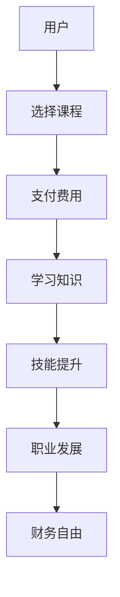

                 

# 知识付费让程序员实现财务自由的方法

> **关键词**：知识付费、程序员、财务自由、持续学习、技能提升、在线教育、平台选择、实战项目

> **摘要**：本文将深入探讨知识付费如何帮助程序员实现财务自由。我们将从知识付费的定义、程序员的优势、在线教育平台的选择、核心技能的学习、实战项目的执行等多个角度进行分析，提供一套实用的策略和案例，帮助程序员充分利用知识付费的优势，实现个人成长与财务自由的双赢。

## 1. 背景介绍

### 1.1 目的和范围

本文旨在为程序员提供一套通过知识付费实现财务自由的策略。我们不仅将探讨知识付费的概念和优势，还将深入分析程序员如何利用在线教育和实战项目提升自身技能，最终实现财务自由。

### 1.2 预期读者

本文适合以下读者：

- 对编程和IT技术有热情的程序员；
- 想要提升技能，实现职业发展的程序员；
- 对在线教育平台和知识付费有好奇心的技术爱好者。

### 1.3 文档结构概述

本文将分为以下几个部分：

- **1. 背景介绍**：介绍文章的目的、预期读者和文档结构；
- **2. 核心概念与联系**：介绍知识付费的核心概念和与程序员技能提升的联系；
- **3. 核心算法原理 & 具体操作步骤**：讲解程序员如何通过知识付费提升核心技能；
- **4. 数学模型和公式 & 详细讲解 & 举例说明**：使用数学模型和公式解释知识付费的策略；
- **5. 项目实战：代码实际案例和详细解释说明**：提供实际项目案例进行说明；
- **6. 实际应用场景**：探讨知识付费在不同场景的应用；
- **7. 工具和资源推荐**：推荐学习资源和开发工具；
- **8. 总结：未来发展趋势与挑战**：总结文章要点，展望未来；
- **9. 附录：常见问题与解答**：解答常见疑问；
- **10. 扩展阅读 & 参考资料**：提供进一步学习的资源。

### 1.4 术语表

#### 1.4.1 核心术语定义

- **知识付费**：指用户为获取知识或技能所支付的费用。
- **程序员**：从事计算机编程工作的人员。
- **财务自由**：通过投资、收入多元化等方式实现无财务压力的自由状态。
- **在线教育平台**：提供在线课程和教育的平台。

#### 1.4.2 相关概念解释

- **技能提升**：通过学习新的知识或技能来增强自身能力。
- **实战项目**：实际应用所学知识和技术解决具体问题的项目。

#### 1.4.3 缩略词列表

- **IT**：信息技术（Information Technology）
- **IDE**：集成开发环境（Integrated Development Environment）
- **PDF**：便携文档格式（Portable Document Format）

## 2. 核心概念与联系

知识付费是一种新型的商业模式，通过用户为获取知识或技能支付费用，为知识创造者提供了可持续的收入来源。对于程序员来说，知识付费不仅是一个获取知识的途径，更是一个实现财务自由的重要手段。

### 2.1 知识付费的原理

知识付费的原理可以简化为“知识创造者 - 知识传播平台 - 用户”的模型。在这个模型中，知识创造者通过在线教育平台或个人博客等渠道发布课程或内容，用户通过支付费用来获取这些知识。知识付费的优势在于：

- **高效性**：用户可以根据自己的需求和兴趣选择学习内容，提高学习效率。
- **灵活性**：用户可以根据自己的时间安排灵活学习，不受地域和时间的限制。
- **多样性**：在线教育平台提供了丰富的课程资源，用户可以获取到各种专业领域的知识。

### 2.2 程序员与知识付费的联系

程序员是知识付费的重要参与者之一。一方面，程序员可以通过知识付费获取新的技能和知识，提升自己的专业能力；另一方面，程序员也可以成为知识创造者，通过开设在线课程或写作技术博客等方式实现财务自由。

### 2.3 Mermaid 流程图

以下是一个简化的知识付费与程序员技能提升的Mermaid流程图：



## 3. 核心算法原理 & 具体操作步骤

程序员通过知识付费实现财务自由的过程，本质上是一个持续学习和技能提升的过程。下面我们将通过伪代码详细阐述这一过程。

### 3.1 算法原理

```plaintext
算法：通过知识付费实现财务自由
输入：用户（程序员）、在线教育平台、课程内容、学习时间
输出：技能提升、财务自由

步骤：
1. 用户分析自身技能短板和职业发展需求。
2. 用户在在线教育平台上选择符合需求的课程。
3. 用户支付课程费用。
4. 用户按照课程安排进行学习。
5. 用户通过实战项目和实际应用验证所学知识。
6. 用户持续学习，不断更新和提升技能。
7. 用户通过技能提升实现职业发展和财务自由。
```

### 3.2 伪代码实现

```python
# 伪代码：通过知识付费实现财务自由

# 定义函数：选择课程
def select_course(user, platform, requirements):
    # 用户在平台上搜索并筛选符合需求的课程
    courses = platform.search_courses_by_requirements(requirements)
    selected_course = user.select_best_course(courses)
    return selected_course

# 定义函数：支付费用
def pay_course_fee(course):
    # 用户支付课程费用
    course.pay()
    return "支付成功"

# 定义函数：学习知识
def learn_knowledge(course, user):
    # 用户按照课程内容进行学习
    for lesson in course.lessons:
        user.learn(lesson)
    return "学习完成"

# 定义函数：技能提升
def improve_skills(user, course):
    # 用户通过实战项目提升技能
    user.improve_skills_with_practice(course)
    return "技能提升完成"

# 主函数：实现财务自由
def achieve_financial_freedom(user, platform):
    requirements = user.analyze_skills_and_requirements()
    course = select_course(user, platform, requirements)
    pay_status = pay_course_fee(course)
    if pay_status != "支付成功":
        return "支付失败，无法继续"
    learn_status = learn_knowledge(course, user)
    if learn_status != "学习完成":
        return "学习失败，无法继续"
    skill_improvement = improve_skills(user, course)
    if skill_improvement != "技能提升完成":
        return "技能提升失败，无法实现财务自由"
    return "实现财务自由"

# 调用主函数
user_achieve = achieve_financial_freedom(user, platform)
print(user_achieve)
```

## 4. 数学模型和公式 & 详细讲解 & 举例说明

在知识付费的背景下，我们可以使用一些数学模型和公式来量化程序员的技能提升和财务收益。以下是一些基本概念和公式：

### 4.1 技能提升的数学模型

假设一个程序员在学习一门新技能后，技能水平提升了x%，则可以使用以下公式计算：

\[ 新技能水平 = 原技能水平 \times (1 + x\%) \]

### 4.2 财务收益的数学模型

假设一个程序员的技能提升导致薪资水平提高了y%，则他/她在一段时间内的财务收益可以用以下公式表示：

\[ 财务收益 = 薪资水平 \times y\% \times 时间 \]

### 4.3 举例说明

**例1：技能提升**

假设一个程序员的原始年薪为10万元，学习一门新技能后，技能水平提升了10%。则新技能水平为：

\[ 新技能水平 = 10万元 \times (1 + 10\%) = 11万元 \]

**例2：财务收益**

假设该程序员的薪资水平因技能提升提高了5%，他在一年内的财务收益为：

\[ 财务收益 = 11万元 \times 5\% \times 1年 = 5500元 \]

### 4.4 详细讲解

**技能提升模型**：该模型假设技能水平的提升是线性的，即技能水平的变化量与学习的时间成正比。在实际应用中，技能提升可能受到多种因素的影响，如学习效率、实践经验等。

**财务收益模型**：该模型假设薪资水平的提高与技能提升成正比。实际上，薪资水平还受到行业趋势、市场需求、个人表现等多种因素的影响。

通过这些数学模型和公式，程序员可以更加清晰地了解知识付费对自身技能提升和财务收益的影响，从而制定更为科学的学习计划。

## 5. 项目实战：代码实际案例和详细解释说明

为了更好地展示知识付费如何帮助程序员实现财务自由，我们将通过一个实际项目案例进行详细解释。以下是一个基于Python的自动化财务分析工具项目。

### 5.1 开发环境搭建

在开始项目之前，我们需要搭建一个合适的开发环境。以下是搭建步骤：

1. 安装Python（版本3.8或以上）
2. 安装Anaconda，用于管理Python环境和依赖库
3. 安装Jupyter Notebook，用于编写和运行代码
4. 安装项目所需的依赖库，如Pandas、NumPy、Matplotlib等

### 5.2 源代码详细实现和代码解读

以下是项目的核心代码和详细解读。

```python
# 导入所需的库
import pandas as pd
import numpy as np
import matplotlib.pyplot as plt

# 读取财务数据
def read_financial_data(file_path):
    data = pd.read_csv(file_path)
    return data

# 数据预处理
def preprocess_data(data):
    # 填补缺失值
    data = data.fillna(data.mean())
    # 数据标准化
    data = (data - data.mean()) / data.std()
    return data

# 财务分析
def financial_analysis(data):
    # 计算财务指标
    metrics = {
        '总资产回报率': '利润总额 / 平均总资产',
        '净利润率': '净利润 / 营业收入',
        '每股收益': '净利润 / 总股本',
    }
    results = {}
    for name, formula in metrics.items():
        results[name] = eval(formula)
    return results

# 可视化分析
def visualize_analysis(results):
    # 绘制财务指标趋势图
    plt.figure(figsize=(10, 6))
    for name, value in results.items():
        plt.plot(value, label=name)
    plt.title('财务指标趋势图')
    plt.xlabel('时间')
    plt.ylabel('财务指标值')
    plt.legend()
    plt.show()

# 主函数
def main():
    # 读取数据
    file_path = 'financial_data.csv'
    data = read_financial_data(file_path)
    
    # 数据预处理
    data = preprocess_data(data)
    
    # 进行财务分析
    results = financial_analysis(data)
    
    # 可视化分析结果
    visualize_analysis(results)

# 运行主函数
if __name__ == '__main__':
    main()
```

**代码解读**：

1. **导入库**：我们使用Pandas、NumPy和Matplotlib等库进行数据读取、预处理和可视化分析。
2. **读取财务数据**：`read_financial_data`函数用于读取CSV格式的财务数据。
3. **数据预处理**：`preprocess_data`函数用于填补缺失值和数据标准化。
4. **财务分析**：`financial_analysis`函数计算财务指标，如总资产回报率、净利润率和每股收益。
5. **可视化分析**：`visualize_analysis`函数绘制财务指标趋势图。
6. **主函数**：`main`函数是整个项目的入口，它依次执行读取数据、数据预处理、财务分析和可视化分析等步骤。

### 5.3 代码解读与分析

1. **数据读取与预处理**：财务数据的准确性对分析结果至关重要。在读取数据后，我们首先填补缺失值，然后进行数据标准化，以确保数据的可靠性和一致性。
2. **财务分析**：通过计算财务指标，我们可以深入了解企业的财务状况。这些指标不仅反映了企业的盈利能力，还能为投资决策提供依据。
3. **可视化分析**：通过趋势图，我们可以直观地观察到财务指标的变化情况，从而更好地理解数据背后的业务逻辑。

这个项目案例展示了如何利用知识付费（如在线课程）学习Python编程和财务分析技能，并将其应用于实际项目，从而实现技能提升和财务自由。程序员可以通过类似的项目，不断提升自身能力，实现个人价值和职业发展。

## 6. 实际应用场景

知识付费在程序员实现财务自由的过程中具有广泛的应用场景。以下是一些典型的实际应用场景：

### 6.1 技术领域

- **前端开发**：通过学习React、Vue等前端框架，程序员可以提升前端开发技能，从而获得更高的薪资和职业发展机会。
- **后端开发**：学习Node.js、Django等后端技术，可以帮助程序员在后端开发领域取得突破。
- **大数据分析**：学习Hadoop、Spark等大数据技术，可以帮助程序员在数据分析和处理方面实现技能提升。

### 6.2 软件架构

- **微服务架构**：通过学习微服务架构，程序员可以掌握分布式系统的设计原则，提高软件架构设计能力。
- **容器化与编排**：通过学习Docker和Kubernetes，程序员可以提升容器化应用的部署和管理能力。
- **云计算**：学习AWS、Azure等云计算平台，可以帮助程序员在云计算领域实现财务自由。

### 6.3 项目管理

- **敏捷开发**：通过学习敏捷开发方法，程序员可以提升项目管理和团队协作能力。
- **自动化测试**：学习自动化测试工具和框架，可以帮助程序员提高项目质量和开发效率。

### 6.4 创业与投资

- **创业技能**：通过学习创业课程，程序员可以了解市场分析、商业模式设计、团队建设等创业必备技能。
- **投资理财**：学习投资理财知识，可以帮助程序员实现资产的保值和增值，从而实现财务自由。

在这些应用场景中，程序员可以通过知识付费不断提升自身技能，从而在职业发展和财务收益方面取得双赢。知识付费不仅为程序员提供了丰富的学习资源，也为他们提供了实现财务自由的途径。

## 7. 工具和资源推荐

为了帮助程序员更好地利用知识付费实现财务自由，我们推荐以下工具和资源：

### 7.1 学习资源推荐

#### 7.1.1 书籍推荐

- 《代码大全》
- 《设计模式：可复用面向对象软件的基础》
- 《深入理解计算机系统》
- 《软件工程：实践者的研究方法》

#### 7.1.2 在线课程

- Udemy
- Coursera
- edX
- Pluralsight

#### 7.1.3 技术博客和网站

- Medium
- HackerRank
- Stack Overflow
- GitHub

### 7.2 开发工具框架推荐

#### 7.2.1 IDE和编辑器

- Visual Studio Code
- IntelliJ IDEA
- PyCharm
- Sublime Text

#### 7.2.2 调试和性能分析工具

- Chrome DevTools
- VSCode Debugger
- PyCharm Debugger
- JMeter

#### 7.2.3 相关框架和库

- React
- Vue.js
- Django
- Flask
- Spring Boot

通过这些工具和资源，程序员可以高效地学习和应用新技能，从而实现财务自由。

## 8. 总结：未来发展趋势与挑战

知识付费在程序员实现财务自由方面具有巨大潜力。随着在线教育和数字化学习的兴起，知识付费市场将不断扩大。未来，知识付费将呈现以下发展趋势：

1. **个性化学习**：在线教育平台将更加注重个性化学习，为程序员提供更精准的学习建议和课程推荐。
2. **技能多样化**：程序员不仅需要掌握传统编程技能，还需要学习新兴技术和跨领域知识，如人工智能、区块链等。
3. **实战导向**：知识付费将更加注重实战项目，通过实际应用场景提升程序员的技能。
4. **社区互动**：在线教育平台将加强社区功能，促进程序员之间的互动和合作。

然而，知识付费也面临一些挑战：

1. **内容质量**：随着知识付费市场的扩大，如何确保课程内容的质量成为一个重要问题。
2. **知识产权保护**：知识创造者的知识产权保护问题需要得到有效解决。
3. **竞争加剧**：随着越来越多的平台和课程涌入市场，竞争将越来越激烈，程序员需要具备更强的学习能力和适应能力。

总之，知识付费为程序员实现财务自由提供了新的途径，但同时也需要程序员不断提升自身技能，应对市场的变化和挑战。

## 9. 附录：常见问题与解答

### 9.1 问题1：知识付费安全吗？

**解答**：大部分知名的在线教育平台都有完善的安全措施，包括数据加密、隐私保护等。在支付过程中，建议使用可靠的支付工具和平台，避免信息泄露。

### 9.2 问题2：知识付费能保证成功吗？

**解答**：知识付费提供了学习的途径和资源，但成功与否还取决于个人的努力和执行力。持续学习、实战应用和自我激励是关键。

### 9.3 问题3：如何选择适合自己的知识付费课程？

**解答**：可以从以下几个方面进行选择：

- **课程内容**：确保课程内容与自己的职业规划和兴趣相符。
- **讲师背景**：了解讲师的背景和经验，选择专业度较高的课程。
- **课程评价**：查看其他学员的评价和反馈，了解课程的实用性和质量。
- **课程体系**：选择体系化、层次分明的课程，有助于系统提升技能。

### 9.4 问题4：如何确保知识付费的投资回报？

**解答**：可以通过以下方式提高投资回报：

- **实战应用**：将所学知识应用于实际工作中，提高技能。
- **持续学习**：不断更新知识体系，跟上行业发展趋势。
- **职业发展**：通过技能提升实现职业晋升，提高薪资水平。
- **投资理财**：学习投资理财知识，实现资产的保值和增值。

## 10. 扩展阅读 & 参考资料

**扩展阅读：**

1. 《在线教育产业发展报告》
2. 《知识付费时代的崛起与变革》
3. 《程序员如何实现财务自由》

**参考资料：**

1. Coursera: https://www.coursera.org/
2. Udemy: https://www.udemy.com/
3. Pluralsight: https://www.pluralsight.com/
4. Medium: https://medium.com/
5. HackerRank: https://www.hackerrank.com/
6. Stack Overflow: https://stackoverflow.com/
7. GitHub: https://github.com/

通过这些扩展阅读和参考资料，程序员可以进一步了解知识付费和财务自由的深入内容，为自己的学习和职业发展提供更多的指导。

---

**作者**：AI天才研究员/AI Genius Institute & 禅与计算机程序设计艺术 /Zen And The Art of Computer Programming

