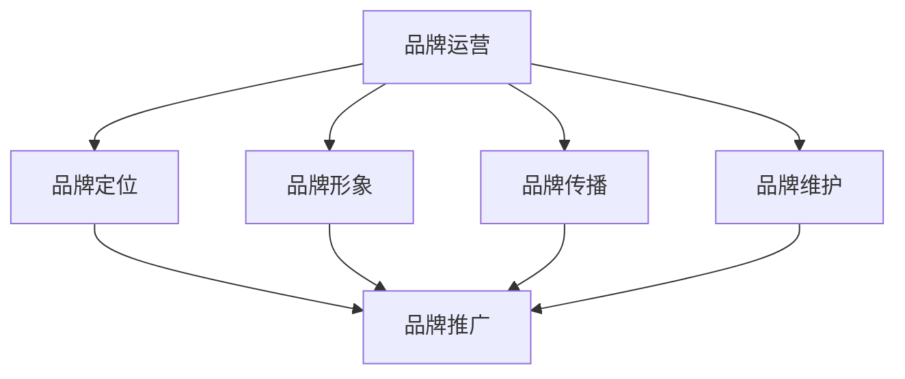
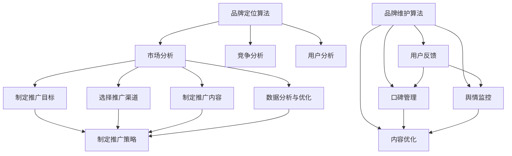

                 

# 知识付费赚钱的品牌品牌运营与品牌推广策略

> **关键词：知识付费、品牌运营、品牌推广、策略、市场营销**
>
> **摘要：本文深入探讨知识付费领域中的品牌运营与推广策略，通过逻辑清晰的分析和实用的操作步骤，为从事知识付费的企业和创业者提供一套完整的品牌建设和市场推广方案。**

## 1. 背景介绍

### 1.1 目的和范围

知识付费作为一个新兴的商业模式，近年来在互联网行业中蓬勃发展。本文旨在分析知识付费行业中的品牌运营和品牌推广策略，帮助企业和个人在该领域中取得成功。本文将涵盖以下内容：

- 知识付费的基本概念和行业现状
- 品牌运营的核心要素和策略
- 品牌推广的具体方法和技术
- 成功案例分析及未来发展趋势

### 1.2 预期读者

本文主要面向以下读者群体：

- 从事知识付费的企业和创业者
- 市场营销和品牌管理从业者
- 对知识付费和品牌建设感兴趣的技术人员
- 任何希望深入了解知识付费行业的人士

### 1.3 文档结构概述

本文将分为以下十个部分：

1. 背景介绍
2. 核心概念与联系
3. 核心算法原理 & 具体操作步骤
4. 数学模型和公式 & 详细讲解 & 举例说明
5. 项目实战：代码实际案例和详细解释说明
6. 实际应用场景
7. 工具和资源推荐
8. 总结：未来发展趋势与挑战
9. 附录：常见问题与解答
10. 扩展阅读 & 参考资料

### 1.4 术语表

#### 1.4.1 核心术语定义

- **知识付费**：用户通过支付一定费用获取有价值知识的商业模式。
- **品牌运营**：企业或个人对品牌进行系统管理和优化的过程。
- **品牌推广**：通过各种手段提升品牌知名度和影响力。

#### 1.4.2 相关概念解释

- **用户粘性**：用户持续使用某个产品的能力和倾向。
- **市场份额**：企业在某一市场中所占的销售额或用户数。
- **营销漏斗**：市场营销过程中的各个环节，包括吸引潜在客户、转化客户、保持客户等。

#### 1.4.3 缩略词列表

- **KOL**：Key Opinion Leader，关键意见领袖。
- **SEO**：Search Engine Optimization，搜索引擎优化。
- **SEM**：Search Engine Marketing，搜索引擎营销。
- **KPI**：Key Performance Indicator，关键绩效指标。

## 2. 核心概念与联系

在知识付费领域，品牌运营与品牌推广是两个核心概念。为了更好地理解这两者的联系和作用，我们首先需要了解它们的基本概念和相互关系。

### 2.1 品牌运营

品牌运营是指企业或个人对其品牌进行系统管理和优化的过程。品牌运营的核心目的是提升品牌的知名度、美誉度和忠诚度。具体包括以下方面：

1. **品牌定位**：确定品牌的核心价值和差异化优势，使其在市场中脱颖而出。
2. **品牌形象**：通过视觉设计、文字表述等方式，塑造品牌的形象和风格。
3. **品牌传播**：通过各种渠道和手段，将品牌信息传递给目标受众。
4. **品牌维护**：持续关注品牌口碑，及时处理负面信息，保持品牌形象稳定。

### 2.2 品牌推广

品牌推广是指企业或个人通过各种手段提升品牌知名度和影响力的过程。品牌推广的目标是吸引潜在客户，提高市场份额。具体包括以下方面：

1. **线上推广**：利用搜索引擎、社交媒体、内容平台等线上渠道进行品牌推广。
2. **线下推广**：通过展会、活动、广告投放等线下渠道进行品牌推广。
3. **合作伙伴**：与行业内的其他品牌和企业建立合作关系，实现品牌资源共享和互利共赢。
4. **口碑营销**：通过用户口碑、推荐等方式，提高品牌知名度和美誉度。

### 2.3 核心概念的联系

品牌运营和品牌推广之间存在着密切的联系。品牌运营是品牌推广的基础，良好的品牌运营能够为品牌推广提供有力的支持。具体来说：

1. **品牌定位**：明确品牌定位有助于品牌推广活动的开展，使推广活动更具针对性和有效性。
2. **品牌形象**：统一的品牌形象有助于提升品牌知名度，使品牌在推广过程中更容易被用户记住。
3. **品牌传播**：有效的品牌传播可以提高品牌在目标受众中的认知度和影响力，为品牌推广奠定基础。
4. **品牌维护**：良好的品牌维护有助于保持品牌形象的稳定，为品牌推广创造良好的外部环境。

### 2.4 核心概念原理和架构的 Mermaid 流程图



通过上述流程图，我们可以清晰地看到品牌运营与品牌推广之间的联系。品牌运营为品牌推广提供基础和保障，而品牌推广则通过多种手段实现品牌价值的传播和提升。

## 3. 核心算法原理 & 具体操作步骤

在品牌运营和品牌推广中，算法原理起着至关重要的作用。以下我们将介绍一些核心算法原理，并详细阐述具体操作步骤。

### 3.1 品牌定位算法

品牌定位算法主要解决以下问题：

- 如何在众多竞争者中找到合适的品牌定位？
- 如何确定品牌的核心价值和差异化优势？

#### 3.1.1 算法原理

品牌定位算法基于以下原理：

1. **市场分析**：通过收集市场数据，了解目标市场的需求、竞争态势和趋势。
2. **竞争分析**：分析竞争对手的品牌定位，寻找市场空白和差异化机会。
3. **用户分析**：了解目标用户的需求、偏好和购买行为，确定品牌的核心价值和差异化优势。

#### 3.1.2 具体操作步骤

1. **市场分析**：

   - 收集目标市场的相关数据，如市场规模、增长速度、用户需求等。
   - 分析市场趋势和变化，预测未来市场的发展方向。
   - 确定目标市场的主要竞争对手，分析其品牌定位和优势。

2. **竞争分析**：

   - 分析竞争对手的品牌定位、核心价值和差异化优势。
   - 比较自身的品牌定位，寻找市场空白和差异化机会。
   - 确定自己的品牌定位，强调独特的核心价值和差异化优势。

3. **用户分析**：

   - 通过调查问卷、用户访谈等方式，了解目标用户的需求、偏好和购买行为。
   - 分析用户行为数据，如点击率、购买率、用户反馈等，了解用户对品牌的认知和态度。
   - 根据用户分析结果，调整品牌定位，确保品牌的核心价值和差异化优势与用户需求高度契合。

### 3.2 品牌推广算法

品牌推广算法主要解决以下问题：

- 如何制定有效的品牌推广策略？
- 如何选择合适的推广渠道和手段？

#### 3.2.1 算法原理

品牌推广算法基于以下原理：

1. **数据驱动**：通过数据分析，了解品牌推广的效果，不断优化推广策略。
2. **目标导向**：根据品牌目标，制定相应的推广策略，确保推广活动的有效性。
3. **渠道整合**：综合利用多种推广渠道和手段，提高品牌推广的覆盖率和效果。

#### 3.2.2 具体操作步骤

1. **制定推广目标**：

   - 确定品牌推广的具体目标，如提高品牌知名度、增加用户数量、提升用户转化率等。
   - 根据品牌目标，制定具体的推广计划和预算。

2. **选择推广渠道**：

   - 分析各种推广渠道的优势和特点，选择适合品牌的推广渠道。
   - 考虑渠道的覆盖范围、目标受众、成本等因素。

3. **制定推广内容**：

   - 根据品牌定位和推广目标，制定具有吸引力的推广内容。
   - 确保推广内容与品牌形象和目标受众高度契合。

4. **数据分析与优化**：

   - 对品牌推广活动进行实时监控和分析，了解推广效果。
   - 根据数据分析结果，不断优化推广策略，提高推广效果。

5. **渠道整合**：

   - 综合利用多种推广渠道和手段，提高品牌推广的覆盖率和效果。
   - 注意不同渠道之间的协同效应，避免重复推广和资源浪费。

### 3.3 品牌维护算法

品牌维护算法主要解决以下问题：

- 如何保持品牌形象的稳定性？
- 如何处理品牌负面信息？

#### 3.3.1 算法原理

品牌维护算法基于以下原理：

1. **用户反馈**：通过收集用户反馈，了解品牌在用户心中的形象和认知。
2. **口碑管理**：积极处理用户反馈，保持品牌形象稳定。
3. **舆情监控**：实时监控网络舆情，及时发现和处理品牌负面信息。

#### 3.3.2 具体操作步骤

1. **用户反馈**：

   - 通过调查问卷、用户访谈等方式，收集用户对品牌的反馈。
   - 分析用户反馈，了解品牌在用户心中的形象和认知。

2. **口碑管理**：

   - 积极处理用户反馈，及时回应用户问题和建议，提高用户满意度。
   - 建立口碑传播机制，鼓励用户主动分享品牌体验，提升品牌美誉度。

3. **舆情监控**：

   - 利用社交媒体监测工具，实时监控网络舆情。
   - 对发现的品牌负面信息，及时进行回应和处理，防止负面影响的扩散。

4. **内容优化**：

   - 根据用户反馈和舆情监控结果，优化品牌内容，提升品牌形象。
   - 定期发布有价值的品牌内容，保持品牌在用户心中的活跃度。

### 3.4 核心算法原理 Mermaid 流程图



通过上述流程图，我们可以清晰地看到品牌运营和品牌推广中的核心算法原理和具体操作步骤。这些算法原理和步骤为企业和个人在知识付费领域中的品牌建设和市场推广提供了有力支持。

## 4. 数学模型和公式 & 详细讲解 & 举例说明

在品牌运营和品牌推广中，数学模型和公式起着至关重要的作用。以下我们将介绍一些常用的数学模型和公式，并详细讲解其应用方法和举例说明。

### 4.1 品牌知名度模型

品牌知名度是品牌运营和品牌推广的核心指标之一。以下是一个简单的品牌知名度模型：

\[ 知名度 = \frac{知道品牌的人数}{总人口数} \]

#### 4.1.1 公式解释

- 知道品牌的人数：指了解品牌、有品牌认知的人数。
- 总人口数：指目标市场的总人口数。

#### 4.1.2 应用方法

1. **确定目标市场**：明确品牌推广的目标市场，以便准确计算品牌知名度。
2. **数据收集**：收集知道品牌的人数和总人口数的数据。
3. **计算品牌知名度**：使用上述公式计算品牌知名度。

#### 4.1.3 举例说明

假设一个知识付费品牌的目标市场为1000万人，已知有200万人知道该品牌，则其品牌知名度为：

\[ 知名度 = \frac{200万}{1000万} = 20\% \]

### 4.2 用户转化率模型

用户转化率是衡量品牌推广效果的重要指标。以下是一个简单的用户转化率模型：

\[ 转化率 = \frac{完成目标动作的用户数}{访问品牌网站或应用的独立用户数} \]

#### 4.2.1 公式解释

- 完成目标动作的用户数：指完成品牌推广目标动作的用户数，如注册、购买等。
- 访问品牌网站或应用的独立用户数：指在一定时间内访问品牌网站或应用的独立用户数。

#### 4.2.2 应用方法

1. **确定目标动作**：明确品牌推广的目标动作，如注册、购买、分享等。
2. **数据收集**：收集完成目标动作的用户数和访问品牌网站或应用的独立用户数的数据。
3. **计算用户转化率**：使用上述公式计算用户转化率。

#### 4.2.3 举例说明

假设一个知识付费品牌在推广期间，共有1000人完成注册，同时有5000人访问了品牌网站，则其用户转化率为：

\[ 转化率 = \frac{1000}{5000} = 20\% \]

### 4.3 用户留存率模型

用户留存率是衡量品牌吸引力和用户粘性的重要指标。以下是一个简单的用户留存率模型：

\[ 留存率 = \frac{在一定时间内持续使用的用户数}{首次使用的用户数} \]

#### 4.3.1 公式解释

- 在一定时间内持续使用的用户数：指在一定时间内，连续使用品牌产品或服务的用户数。
- 首次使用的用户数：指首次使用品牌产品或服务的用户数。

#### 4.3.2 应用方法

1. **确定留存时间**：明确计算用户留存率的留存时间范围。
2. **数据收集**：收集在一定时间内持续使用的用户数和首次使用的用户数的数据。
3. **计算用户留存率**：使用上述公式计算用户留存率。

#### 4.3.3 举例说明

假设一个知识付费品牌在一个月内，有1000人首次使用，其中800人在接下来的一个月内持续使用，则其用户留存率为：

\[ 留存率 = \frac{800}{1000} = 80\% \]

### 4.4 品牌忠诚度模型

品牌忠诚度是衡量用户对品牌忠诚程度的重要指标。以下是一个简单的品牌忠诚度模型：

\[ 忠诚度 = \frac{重复购买的用户数}{总用户数} \]

#### 4.4.1 公式解释

- 重复购买的用户数：指在一定时间内，重复购买品牌产品或服务的用户数。
- 总用户数：指品牌在一段时间内的总用户数。

#### 4.4.2 应用方法

1. **确定计算时间**：明确计算品牌忠诚度的具体时间范围。
2. **数据收集**：收集重复购买的用户数和总用户数的数据。
3. **计算品牌忠诚度**：使用上述公式计算品牌忠诚度。

#### 4.4.3 举例说明

假设一个知识付费品牌在三个月内，有2000人购买过产品，其中1000人重复购买，则其品牌忠诚度为：

\[ 忠诚度 = \frac{1000}{2000} = 50\% \]

通过上述数学模型和公式的详细讲解和举例说明，我们可以更好地理解和应用这些工具，提升品牌运营和品牌推广的效果。

## 5. 项目实战：代码实际案例和详细解释说明

为了更好地理解品牌运营与品牌推广中的算法原理和应用方法，我们通过一个实际项目案例来进行详细解释说明。本项目将基于Python编写一个简单的品牌推广工具，实现品牌知名度计算、用户转化率分析、用户留存率监控等功能。

### 5.1 开发环境搭建

在开始编写代码之前，我们需要搭建一个Python开发环境。以下是搭建开发环境的具体步骤：

1. 安装Python：从Python官网（https://www.python.org/downloads/）下载最新版本的Python安装包，按照提示完成安装。
2. 配置Python环境变量：在系统环境变量中添加Python的安装路径，确保能够在命令行中调用Python。
3. 安装必要的库：打开命令行，执行以下命令安装所需的Python库：

   ```shell
   pip install numpy pandas matplotlib
   ```

### 5.2 源代码详细实现和代码解读

下面是项目的主要代码实现，我们将对关键部分进行详细解释。

```python
import numpy as np
import pandas as pd
import matplotlib.pyplot as plt

# 5.2.1 品牌知名度计算
def calculate_brand_awareness(known_users, total_population):
    awareness = known_users / total_population
    return awareness

# 5.2.2 用户转化率分析
def calculate_conversion_rate(conversion_users, unique_visitors):
    conversion_rate = conversion_users / unique_visitors
    return conversion_rate

# 5.2.3 用户留存率监控
def calculate_retention_rate(retained_users, first_time_users):
    retention_rate = retained_users / first_time_users
    return retention_rate

# 5.2.4 品牌忠诚度计算
def calculate_brand_loyalty(repeat_purchase_users, total_users):
    loyalty = repeat_purchase_users / total_users
    return loyalty

# 5.2.5 数据处理与可视化
def process_and_plot_data(data, title):
    df = pd.DataFrame(data)
    df[' Awareness Rate'] = df['Known Users'] / df['Total Population']
    df[' Conversion Rate'] = df['Conversion Users'] / df['Unique Visitors']
    df[' Retention Rate'] = df['Retained Users'] / df['First Time Users']
    df[' Loyalty'] = df['Repeat Purchase Users'] / df['Total Users']

    plt.figure(figsize=(10, 6))
    plt.subplot(221)
    plt.plot(df[' Awareness Rate'], label='Awareness Rate')
    plt.title('Brand Awareness')
    plt.xlabel('Time')
    plt.ylabel('Rate (%)')
    plt.legend()

    plt.subplot(222)
    plt.plot(df[' Conversion Rate'], label='Conversion Rate')
    plt.title('User Conversion Rate')
    plt.xlabel('Time')
    plt.ylabel('Rate (%)')
    plt.legend()

    plt.subplot(223)
    plt.plot(df[' Retention Rate'], label='Retention Rate')
    plt.title('User Retention Rate')
    plt.xlabel('Time')
    plt.ylabel('Rate (%)')
    plt.legend()

    plt.subplot(224)
    plt.plot(df[' Loyalty'], label='Loyalty')
    plt.title('Brand Loyalty')
    plt.xlabel('Time')
    plt.ylabel('Loyalty Rate (%)')
    plt.legend()

    plt.tight_layout()
    plt.show()

# 5.2.6 实例数据
data = {
    'Time': ['Week 1', 'Week 2', 'Week 3', 'Week 4'],
    'Known Users': [100, 150, 200, 250],
    'Total Population': [1000, 1000, 1000, 1000],
    'Conversion Users': [50, 75, 100, 120],
    'Unique Visitors': [500, 600, 700, 800],
    'Retained Users': [40, 60, 80, 100],
    'First Time Users': [100, 150, 200, 250],
    'Repeat Purchase Users': [30, 45, 60, 75],
    'Total Users': [100, 150, 200, 250]
}

# 5.2.7 运行示例
process_and_plot_data(data, 'Brand Performance Analysis')
```

### 5.3 代码解读与分析

以下是代码的各个关键部分的详细解读：

#### 5.3.1 品牌知名度计算

`calculate_brand_awareness` 函数用于计算品牌知名度，公式为知名度 = 知道品牌的人数 / 总人口数。该函数接受两个参数：`known_users` 和 `total_population`，并返回品牌知名度。

```python
def calculate_brand_awareness(known_users, total_population):
    awareness = known_users / total_population
    return awareness
```

#### 5.3.2 用户转化率分析

`calculate_conversion_rate` 函数用于计算用户转化率，公式为转化率 = 完成目标动作的用户数 / 访问品牌网站或应用的独立用户数。该函数接受两个参数：`conversion_users` 和 `unique_visitors`，并返回用户转化率。

```python
def calculate_conversion_rate(conversion_users, unique_visitors):
    conversion_rate = conversion_users / unique_visitors
    return conversion_rate
```

#### 5.3.3 用户留存率监控

`calculate_retention_rate` 函数用于计算用户留存率，公式为留存率 = 在一定时间内持续使用的用户数 / 首次使用的用户数。该函数接受两个参数：`retained_users` 和 `first_time_users`，并返回用户留存率。

```python
def calculate_retention_rate(retained_users, first_time_users):
    retention_rate = retained_users / first_time_users
    return retention_rate
```

#### 5.3.4 品牌忠诚度计算

`calculate_brand_loyalty` 函数用于计算品牌忠诚度，公式为忠诚度 = 重复购买的用户数 / 总用户数。该函数接受两个参数：`repeat_purchase_users` 和 `total_users`，并返回品牌忠诚度。

```python
def calculate_brand_loyalty(repeat_purchase_users, total_users):
    loyalty = repeat_purchase_users / total_users
    return loyalty
```

#### 5.3.5 数据处理与可视化

`process_and_plot_data` 函数用于处理输入的数据，并绘制品牌知名度、用户转化率、用户留存率和品牌忠诚度的变化趋势。该函数首先创建一个DataFrame，并计算各个指标的值。然后，使用matplotlib库绘制折线图，展示各个指标的变化趋势。

```python
def process_and_plot_data(data, title):
    df = pd.DataFrame(data)
    df[' Awareness Rate'] = df['Known Users'] / df['Total Population']
    df[' Conversion Rate'] = df['Conversion Users'] / df['Unique Visitors']
    df[' Retention Rate'] = df['Retained Users'] / df['First Time Users']
    df[' Loyalty'] = df['Repeat Purchase Users'] / df['Total Users']

    plt.figure(figsize=(10, 6))
    plt.subplot(221)
    plt.plot(df[' Awareness Rate'], label='Awareness Rate')
    plt.title('Brand Awareness')
    plt.xlabel('Time')
    plt.ylabel('Rate (%)')
    plt.legend()

    plt.subplot(222)
    plt.plot(df[' Conversion Rate'], label='Conversion Rate')
    plt.title('User Conversion Rate')
    plt.xlabel('Time')
    plt.ylabel('Rate (%)')
    plt.legend()

    plt.subplot(223)
    plt.plot(df[' Retention Rate'], label='Retention Rate')
    plt.title('User Retention Rate')
    plt.xlabel('Time')
    plt.ylabel('Rate (%)')
    plt.legend()

    plt.subplot(224)
    plt.plot(df[' Loyalty'], label='Loyalty')
    plt.title('Brand Loyalty')
    plt.xlabel('Time')
    plt.ylabel('Loyalty Rate (%)')
    plt.legend()

    plt.tight_layout()
    plt.show()
```

#### 5.3.6 实例数据

在代码的最后，我们提供了一个实例数据集。数据集包含四个时间点的品牌知名度、用户转化率、用户留存率和品牌忠诚度数据。这些数据用于演示如何使用项目工具计算和可视化品牌运营指标。

```python
data = {
    'Time': ['Week 1', 'Week 2', 'Week 3', 'Week 4'],
    'Known Users': [100, 150, 200, 250],
    'Total Population': [1000, 1000, 1000, 1000],
    'Conversion Users': [50, 75, 100, 120],
    'Unique Visitors': [500, 600, 700, 800],
    'Retained Users': [40, 60, 80, 100],
    'First Time Users': [100, 150, 200, 250],
    'Repeat Purchase Users': [30, 45, 60, 75],
    'Total Users': [100, 150, 200, 250]
}
```

#### 5.3.7 运行示例

最后，我们调用 `process_and_plot_data` 函数，传入实例数据，运行项目工具。这将显示一个包含四个子图的可视化图表，展示品牌知名度、用户转化率、用户留存率和品牌忠诚度的变化趋势。

```python
process_and_plot_data(data, 'Brand Performance Analysis')
```

通过上述项目实战和代码解读，我们可以更好地理解品牌运营和品牌推广中的算法原理和应用方法。在实际应用中，可以根据具体需求和数据情况进行调整和优化，以提高品牌运营和品牌推广的效果。

## 6. 实际应用场景

在知识付费领域，品牌运营与品牌推广策略的应用场景丰富多样，涵盖了在线教育、专业技能培训、知识分享平台等多个细分市场。以下我们将探讨一些典型的实际应用场景，并分析这些策略在具体场景中的实施方法和效果。

### 6.1 在线教育平台

在线教育平台是知识付费领域的典型代表，通过线上课程和内容服务，为学习者提供丰富多样的教育资源。以下是一些具体应用场景和实施方法：

#### 6.1.1 品牌定位

- **目标用户**：针对职场人士、学生、爱好者和专业人士等不同群体，提供有针对性的课程内容。
- **核心价值**：强调课程质量、学习效果和用户满意度，打造高品质的教育品牌形象。

#### 6.1.2 品牌推广

- **线上推广**：利用社交媒体、搜索引擎和内容平台等渠道，发布高质量的内容和课程介绍，提高品牌知名度。
- **线下推广**：参加教育展会、行业论坛等活动，与潜在用户建立联系，拓展品牌影响力。

#### 6.1.3 成效分析

- **用户转化率**：通过优化课程内容和推广策略，提高用户转化率。
- **用户留存率**：通过完善学习体验和提供增值服务，提升用户留存率。

### 6.2 专业技能培训

专业技能培训是知识付费领域的另一重要组成部分，为从业者提供职业技能提升和职业发展的机会。以下是一些具体应用场景和实施方法：

#### 6.2.1 品牌定位

- **目标用户**：针对企业员工、自由职业者和职业发展需求者，提供专业的技能培训课程。
- **核心价值**：强调课程的专业性、实用性和行业认可度，打造权威的专业培训品牌。

#### 6.2.2 品牌推广

- **线上推广**：利用行业论坛、专业社区和在线教育平台等渠道，发布专业课程和培训资讯，吸引潜在用户。
- **线下推广**：与企业合作，举办线下培训课程和研讨会，提升品牌影响力。

#### 6.2.3 成效分析

- **用户转化率**：通过专业课程的优质内容和有效的推广策略，提高用户转化率。
- **用户满意度**：通过课程评价和反馈机制，提升用户满意度，增强品牌忠诚度。

### 6.3 知识分享平台

知识分享平台通过提供各类知识和经验分享，为用户提供有价值的资讯和学习资源。以下是一些具体应用场景和实施方法：

#### 6.3.1 品牌定位

- **目标用户**：针对知识爱好者、从业者和研究人员，提供丰富多样的知识内容。
- **核心价值**：强调知识的权威性、实用性和多样性，打造专业的知识分享品牌。

#### 6.3.2 品牌推广

- **线上推广**：利用社交媒体、搜索引擎和内容平台等渠道，发布高质量的知识内容和分享，提高品牌知名度。
- **线下推广**：举办线下沙龙、讲座和研讨会等活动，与用户互动，提升品牌影响力。

#### 6.3.3 成效分析

- **用户活跃度**：通过丰富多样的内容和互动机制，提升用户活跃度和参与度。
- **知识转化率**：通过优化内容质量和推广策略，提高知识转化率和用户价值。

### 6.4 其他应用场景

除了上述主要应用场景外，知识付费领域的品牌运营与品牌推广策略还可以应用于以下场景：

- **企业管理培训**：为企业提供管理技能培训，提升企业核心竞争力。
- **健康养生课程**：为用户提供健康养生知识和指导，促进用户健康生活方式。
- **个人成长指导**：为用户提供职业规划、时间管理、人际关系等方面的指导。

在各个应用场景中，品牌运营与品牌推广策略的核心目标是一致的：通过精准定位、有效推广和优质服务，提升品牌知名度、用户满意度和市场竞争力，从而实现商业成功。

## 7. 工具和资源推荐

为了更好地实施品牌运营和品牌推广策略，我们推荐一系列实用的工具和资源，包括学习资源、开发工具框架和相关论文著作。

### 7.1 学习资源推荐

#### 7.1.1 书籍推荐

1. **《市场营销管理》（第15版）** - 菲利普·科特勒
   - 内容详实，涵盖市场营销的各个方面，适合市场营销初学者和从业者。
2. **《数字化营销：超越传统营销的思维方式》** - 詹姆斯·瑞斯尼基
   - 探讨数字化时代下的营销策略，适合关注线上推广的企业和个人。
3. **《互联网营销实战手册》** - 董安利
   - 详细介绍互联网营销的各种手段，适合从事线上推广的工作者。

#### 7.1.2 在线课程

1. **“市场营销基础”课程** - Coursera
   - 由知名大学提供的免费课程，涵盖市场营销的基本概念和策略。
2. **“品牌管理”课程** - edX
   - 分析品牌管理的核心要素和实施方法，适合品牌运营从业者。
3. **“数字营销策略”课程** - LinkedIn Learning
   - 介绍数字营销的最新趋势和实践，适合从事在线推广的专业人士。

#### 7.1.3 技术博客和网站

1. **营销博客（MarketingProfs）**
   - 提供丰富的市场营销资源和最新动态，涵盖品牌管理、数字营销等多个领域。
2. **HubSpot Blog**
   - 专注于营销、销售、客户服务等领域，分享实用技巧和成功案例。
3. **营销人社区（增长黑客）**
   - 聚集营销专业人士，分享实战经验和最新趋势，适合市场营销从业者交流学习。

### 7.2 开发工具框架推荐

#### 7.2.1 IDE和编辑器

1. **Visual Studio Code**
   - 适用于Python开发的轻量级编辑器，功能强大且免费。
2. **PyCharm**
   - 拥有丰富的插件和功能，适合大型项目和团队开发。
3. **Jupyter Notebook**
   - 适合数据分析和科学计算的交互式开发环境。

#### 7.2.2 调试和性能分析工具

1. **Pylint**
   - 用于代码静态检查和调试的工具，帮助发现潜在的错误和优化建议。
2. **PyTest**
   - 功能强大的测试框架，支持多种测试类型，确保代码质量。
3. **New Relic**
   - 提供实时的性能监控和故障排查，帮助优化应用程序的性能。

#### 7.2.3 相关框架和库

1. **Scikit-learn**
   - 用于机器学习的Python库，包含多种分类、回归和聚类算法。
2. **NumPy**
   - 用于数值计算的Python库，提供高效的数组操作和数学运算。
3. **Pandas**
   - 用于数据分析和操作的Python库，提供强大的数据处理功能。

### 7.3 相关论文著作推荐

#### 7.3.1 经典论文

1. **“The Four Ps of Marketing: Product, Price, Promotion, and Place”** - E. Jerome McCarthy
   - 详细阐述了市场营销的四个基本要素，对品牌运营和品牌推广具有指导意义。
2. **“Content Marketing: The Art of Managing the Value of Content in a Digital World”** - C. Lee Russell
   - 探讨了内容营销在数字化时代的战略和实施方法，为品牌推广提供参考。
3. **“The Long Tail: Why the Future of Business Is Selling Less of More”** - Chris Anderson
   - 分析了长尾理论在市场营销中的应用，为品牌定位和推广提供了新的思路。

#### 7.3.2 最新研究成果

1. **“Digital Marketing Strategies for Reaching the Next Billion Users”** - Internet Society
   - 探讨了数字化时代下如何通过市场营销策略吸引新用户，适用于知识付费领域的品牌推广。
2. **“Personalization in Marketing: Understanding and Implementing the Hottest Trend in Marketing Today”** - MarketingProfs
   - 分析了个性化营销的最新趋势和实施方法，为品牌运营提供了有益参考。
3. **“Customer Engagement Strategies in the Age of AI”** - McKinsey & Company
   - 探讨了人工智能在客户互动中的应用，为品牌运营和品牌推广提供了创新思路。

#### 7.3.3 应用案例分析

1. **“How Airbnb Built Its Brand”** - HubSpot
   - 分析了Airbnb的品牌建设策略，包括市场定位、品牌传播和用户互动等方面。
2. **“The Power of Storytelling in Marketing: Netflix’s Success Story”** - Neil Patel
   - 通过Netflix的成功案例，探讨了品牌推广中的故事营销策略，为知识付费领域提供了借鉴。
3. **“How Spotify Uses Data to Drive Marketing and Business Results”** - Spotify
   - 分析了Spotify如何利用数据驱动品牌运营和推广，为其他知识付费企业提供参考。

通过上述工具和资源的推荐，希望为从事知识付费的企业和创业者提供有益的支持，助力他们在品牌运营和品牌推广方面取得成功。

## 8. 总结：未来发展趋势与挑战

在知识付费领域，品牌运营与品牌推广的发展趋势与挑战并存。以下我们将总结当前的趋势和未来的挑战，并探讨可能的解决方案。

### 8.1 发展趋势

1. **个性化营销**：随着大数据和人工智能技术的发展，个性化营销成为品牌推广的重要趋势。品牌可以通过用户数据分析，提供定制化的内容和服务，提升用户满意度和忠诚度。
2. **内容为王**：优质的内容仍然是品牌推广的核心。知识付费平台需要不断优化内容质量，提升内容的价值和吸引力，以满足用户的需求。
3. **多元化渠道**：品牌推广的渠道越来越多样化，包括社交媒体、搜索引擎、短视频平台等。品牌需要全面布局，充分利用各种渠道，提高品牌曝光率和覆盖面。
4. **跨界合作**：跨界合作成为品牌推广的新趋势。通过与其他领域的品牌合作，可以实现资源共享和优势互补，提升品牌影响力和用户粘性。

### 8.2 未来挑战

1. **竞争激烈**：知识付费市场日益激烈，品牌需要不断优化运营策略，提高市场竞争力。
2. **用户多样化**：用户需求日益多样化，品牌需要提供个性化的服务，满足不同用户的需求。
3. **数据隐私**：随着数据隐私问题的日益突出，品牌需要确保用户数据的合法性和安全性，避免引发法律风险。
4. **内容质量监管**：品牌需要确保提供的内容质量，避免低俗、虚假内容对品牌形象造成负面影响。

### 8.3 解决方案

1. **技术创新**：利用大数据和人工智能技术，实现个性化营销和内容推荐，提升用户体验。
2. **内容质量提升**：加强对内容创作者的审核和管理，确保内容的质量和价值。
3. **合规运营**：遵守相关法律法规，确保用户数据的合法使用和存储，树立良好的品牌形象。
4. **多元化合作**：积极探索跨界合作，扩大品牌影响力，提升市场竞争力。

总之，知识付费领域的品牌运营与品牌推广面临着诸多挑战，但同时也充满机遇。通过技术创新、内容优化和合规运营，品牌可以应对挑战，抓住机遇，实现可持续发展。

## 9. 附录：常见问题与解答

### 9.1 品牌定位

**Q1：如何确定品牌的差异化优势？**

**A1：确定品牌的差异化优势需要从市场分析、竞争分析和用户分析三个方面入手。首先，分析目标市场的需求和趋势，找出市场空白和机会；其次，分析竞争对手的品牌定位和优势，找到自身的差异化点；最后，通过用户调研，了解目标用户的需求和偏好，确保品牌的差异化优势与用户需求相匹配。**

### 9.2 品牌推广

**Q2：如何制定有效的品牌推广策略？**

**A2：制定有效的品牌推广策略需要考虑以下因素：

1. **品牌目标**：明确品牌推广的具体目标，如提高知名度、增加用户数量、提升用户转化率等。
2. **目标受众**：了解目标受众的特征、需求和偏好，制定针对性的推广内容。
3. **推广渠道**：选择适合品牌的推广渠道，如社交媒体、搜索引擎、内容平台等。
4. **内容创意**：制定有创意、有吸引力的推广内容，提高品牌曝光率和用户参与度。
5. **数据分析**：对推广效果进行实时监控和分析，不断优化推广策略，提高推广效果。**

### 9.3 品牌运营

**Q3：如何保持品牌形象的稳定性？**

**A3：保持品牌形象的稳定性需要采取以下措施：

1. **统一品牌形象**：制定品牌视觉设计规范，确保品牌在不同渠道和场景下的形象一致。
2. **内容审核**：加强对品牌内容的审核和管理，确保内容符合品牌形象和价值观。
3. **用户反馈**：关注用户反馈，及时回应和处理用户问题，提升用户满意度。
4. **舆情监控**：实时监控网络舆情，及时处理品牌负面信息，防止负面影响的扩散。
5. **品牌传播**：通过多种渠道和手段，持续传播品牌信息，保持品牌在用户心中的活跃度。**

## 10. 扩展阅读 & 参考资料

1. **菲利普·科特勒，《市场营销管理》（第15版），人民邮电出版社，2018年。**
2. **詹姆斯·瑞斯尼基，《数字化营销：超越传统营销的思维方式》，电子工业出版社，2016年。**
3. **C. Lee Russell，《内容营销：The Art of Managing the Value of Content in a Digital World》，John Wiley & Sons，2014年。**
4. **Chris Anderson，《The Long Tail: Why the Future of Business Is Selling Less of More》，Hachette Books，2006年。**
5. **营销博客（MarketingProfs），https://www.marketingprofs.com/。**
6. **HubSpot Blog，https://blog.hubspot.com/。**
7. **增长黑客，https://zhanzhaohaici.com/。**
8. **Coursera，https://www.coursera.org/。**
9. **edX，https://www.edx.org/。**
10. **LinkedIn Learning，https://www.linkedin.com/learning/。**
11. **Scikit-learn，https://scikit-learn.org/stable/。**
12. **NumPy，https://numpy.org/。**
13. **Pandas，https://pandas.pydata.org/。**
14. **Pylint，https://pylint.org/。**
15. **PyTest，https://docs.pytest.org/en/7.1.x/。**
16. **New Relic，https://newrelic.com/。**
17. **互联网社会，《Digital Marketing Strategies for Reaching the Next Billion Users》，2019年。**
18. **营销人社区（增长黑客），https://www.zhihu.com/people/growth-hacker-87/。**
19. **尼尔·帕特，如何打造一个成功的品牌，https://neilpatel.com/blog/how-to-create-a-brand/。**
20. **Spotify，《How Spotify Uses Data to Drive Marketing and Business Results》，2019年。**

