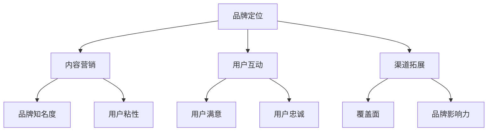

                 

# 知识付费赚钱的品牌品牌运营与品牌推广策略

> **关键词：** 知识付费、品牌运营、品牌推广、策略、用户粘性、内容营销

> **摘要：** 本文深入探讨了知识付费领域的品牌运营与推广策略，旨在为从事知识付费的从业者提供一套系统化的品牌建设方法论。文章从品牌定位、内容营销、用户互动、渠道拓展等方面展开，结合实际案例，详细阐述了如何通过有效的品牌运营和推广策略，实现知识付费产品的持续盈利。

## 1. 背景介绍

### 1.1 目的和范围

本文旨在探讨知识付费领域的品牌运营与推广策略，通过梳理品牌建设的核心要素，为从业者提供实用的操作指南。文章将涵盖以下主要内容：

- 品牌定位与差异化策略
- 内容营销与用户互动
- 品牌推广渠道选择与优化
- 用户粘性与口碑建设

### 1.2 预期读者

本文适合以下读者群体：

- 从事知识付费领域的从业者
- 希望拓展知识付费业务的创业者
- 对品牌运营与推广感兴趣的营销人员

### 1.3 文档结构概述

本文结构如下：

1. 背景介绍
   - 目的和范围
   - 预期读者
   - 文档结构概述
   - 术语表
2. 核心概念与联系
   - 知识付费市场概述
   - 品牌运营与品牌推广概念解析
   - 品牌建设核心要素
3. 核心算法原理 & 具体操作步骤
   - 品牌定位策略
   - 内容营销方法论
   - 用户互动与粘性提升
4. 数学模型和公式 & 详细讲解 & 举例说明
   - 用户生命周期价值分析
   - 品牌认知度与转化率计算
5. 项目实战：代码实际案例和详细解释说明
   - 品牌运营与推广实战案例
   - 案例分析及效果评估
6. 实际应用场景
   - 知识付费领域应用案例分享
7. 工具和资源推荐
   - 学习资源推荐
   - 开发工具框架推荐
   - 相关论文著作推荐
8. 总结：未来发展趋势与挑战
9. 附录：常见问题与解答
10. 扩展阅读 & 参考资料

### 1.4 术语表

#### 1.4.1 核心术语定义

- **知识付费**：用户为获取有价值的信息或知识内容而支付费用的一种服务模式。
- **品牌运营**：通过一系列策略和措施，提升品牌知名度、美誉度、用户忠诚度等品牌资产的过程。
- **品牌推广**：通过各种渠道和手段，向目标用户传递品牌信息，增加品牌认知度和影响力。
- **用户粘性**：用户持续使用某一产品或服务的程度，体现为用户的留存率和活跃度。
- **内容营销**：通过创造和传播有价值的内容，吸引并留住目标用户，从而实现品牌推广和产品销售。

#### 1.4.2 相关概念解释

- **品牌定位**：品牌在目标市场中的独特价值主张，用于区分品牌与竞争对手。
- **用户互动**：品牌与用户之间通过各种渠道进行的沟通和交流，以提升用户满意度和忠诚度。
- **渠道拓展**：将品牌推广到更多渠道和平台，以扩大品牌影响力和覆盖面。

#### 1.4.3 缩略词列表

- **KOL**：关键意见领袖
- **KOL**：关键意见领袖
- **SEO**：搜索引擎优化
- **SEM**：搜索引擎营销
- **UGC**：用户生成内容
- **KPI**：关键绩效指标

## 2. 核心概念与联系

在知识付费领域，品牌运营与推广是至关重要的环节。为了实现良好的品牌建设，我们需要明确以下几个核心概念：

- **知识付费市场概述**：了解当前知识付费市场的发展状况、用户需求、竞争格局等。
- **品牌运营与品牌推广概念解析**：掌握品牌运营与品牌推广的基本理论和方法。
- **品牌建设核心要素**：明确品牌定位、内容营销、用户互动、渠道拓展等方面的关键要素。

下面是品牌建设核心要素的 Mermaid 流程图：



### 2.1 知识付费市场概述

知识付费市场在过去几年中呈现出迅猛发展的态势。随着互联网技术的不断进步和人们对于自我提升的需求日益增长，知识付费已成为一种主流的消费方式。以下是知识付费市场的一些关键特征：

1. **用户需求多样化**：用户对于知识付费的需求呈现出多样化趋势，涵盖职场技能、兴趣爱好、家庭生活等多个方面。
2. **竞争格局逐步形成**：知识付费市场已经形成了一批具有竞争力的平台和品牌，如知乎、喜马拉雅、得到等。
3. **内容质量成为关键**：在竞争激烈的市场环境下，内容质量成为吸引用户和提升用户粘性的关键因素。
4. **技术驱动创新**：人工智能、大数据等技术的应用，使得知识付费产品的个性化推荐、智能问答等功能更加丰富。

### 2.2 品牌运营与品牌推广概念解析

品牌运营与品牌推广是两个紧密相关的概念，它们共同构成了品牌建设的核心。下面是这两个概念的具体解释：

1. **品牌运营**：品牌运营是指通过一系列策略和措施，提升品牌知名度、美誉度、用户忠诚度等品牌资产的过程。品牌运营的核心目标是构建和维护品牌价值，从而为企业的长期发展奠定基础。

   品牌运营主要包括以下方面：

   - 品牌定位：明确品牌在目标市场中的独特价值主张，以区分品牌与竞争对手。
   - 品牌传播：通过各种渠道和手段，向目标用户传递品牌信息，增加品牌认知度和影响力。
   - 品牌体验：优化用户与品牌的互动体验，提升用户满意度和忠诚度。

2. **品牌推广**：品牌推广是指通过多种渠道和手段，向目标用户传递品牌信息，增加品牌认知度和影响力。品牌推广的核心目标是吸引潜在用户，并将其转化为忠实用户。

   品牌推广主要包括以下方面：

   - 内容营销：通过创造和传播有价值的内容，吸引并留住目标用户。
   - 社交媒体营销：利用社交媒体平台，与用户建立互动关系，提升品牌影响力。
   - 搜索引擎营销：通过搜索引擎优化和搜索引擎营销，提高品牌在搜索引擎中的排名和曝光度。

### 2.3 品牌建设核心要素

品牌建设是知识付费领域的一项长期任务，需要从多个方面进行综合考虑。以下是品牌建设的核心要素：

1. **品牌定位**：品牌定位是品牌建设的基础，需要明确品牌在目标市场中的独特价值主张。品牌定位主要包括以下几个方面：

   - **目标市场**：确定品牌的目标用户群体，分析用户需求和市场趋势。
   - **品牌愿景**：明确品牌的发展方向和长远目标，为品牌运营提供指导。
   - **差异化优势**：分析竞争对手的优势和劣势，找出品牌独有的差异化优势。

2. **内容营销**：内容营销是知识付费品牌运营的核心，需要围绕用户需求创造有价值的内容。内容营销主要包括以下几个方面：

   - **内容规划**：根据用户需求和品牌定位，制定内容规划和发布计划。
   - **内容创作**：创作高质量、有深度、有价值的内容，吸引用户关注。
   - **内容传播**：通过多种渠道和手段，将内容传播给目标用户。

3. **用户互动**：用户互动是提升用户满意度和忠诚度的关键，需要建立良好的用户关系。用户互动主要包括以下几个方面：

   - **用户调研**：通过问卷调查、用户访谈等方式，了解用户需求和反馈。
   - **用户参与**：鼓励用户参与内容创作和品牌活动，提升用户黏性。
   - **用户关怀**：关注用户需求，提供个性化的服务和解决方案。

4. **渠道拓展**：渠道拓展是扩大品牌影响力和覆盖面的重要手段，需要选择适合的渠道进行推广。渠道拓展主要包括以下几个方面：

   - **线上渠道**：利用社交媒体、电商平台、自媒体等线上渠道，进行品牌推广和销售。
   - **线下渠道**：通过线下活动、展会、合作等方式，扩大品牌影响力和用户基础。
   - **合作渠道**：与其他品牌、平台、媒体等建立合作关系，实现资源共享和互利共赢。

通过以上核心要素的有机结合，可以构建一个系统化、可持续的品牌运营体系，为知识付费品牌的长期发展奠定坚实基础。

## 3. 核心算法原理 & 具体操作步骤

在知识付费领域，品牌运营与推广的核心算法原理主要包括以下几个方面：

### 3.1 品牌定位策略

品牌定位策略是品牌运营的基础，其核心目标是明确品牌在目标市场中的独特价值主张。具体操作步骤如下：

#### 3.1.1 数据分析

1. **用户画像分析**：通过数据分析，了解目标用户的年龄、性别、职业、兴趣爱好等信息，为品牌定位提供依据。
2. **市场调研**：收集和分析市场数据，了解竞争对手的定位策略和市场表现，为品牌差异化定位提供参考。

#### 3.1.2 品牌差异化

1. **独特价值主张**：根据用户画像和市场调研结果，确定品牌的独特价值主张，如专业、实用、创新等。
2. **差异化定位**：在品牌定位过程中，强调与竞争对手的差异，形成独特的品牌形象。

### 3.2 内容营销方法论

内容营销是品牌运营的重要手段，其核心目标是吸引并留住目标用户。具体操作步骤如下：

#### 3.2.1 内容规划

1. **内容主题确定**：根据品牌定位和用户需求，确定内容主题，如行业动态、实用技巧、案例分析等。
2. **内容形式选择**：根据内容主题，选择合适的内容形式，如图文、视频、直播等。

#### 3.2.2 内容创作

1. **高质量内容创作**：创作高质量、有深度、有价值的内容，吸引用户关注。
2. **内容发布**：按照内容规划，定期发布内容，保持内容更新频率。

### 3.3 用户互动与粘性提升

用户互动与粘性提升是品牌运营的关键，其核心目标是提升用户满意度和忠诚度。具体操作步骤如下：

#### 3.3.1 用户调研

1. **问卷调查**：通过问卷调查，了解用户需求和反馈，为改进产品和服务提供依据。
2. **用户访谈**：通过用户访谈，深入了解用户需求和痛点，为产品设计提供参考。

#### 3.3.2 用户参与

1. **互动活动**：举办各种互动活动，如投票、抽奖、问答等，增强用户参与度。
2. **用户评价**：鼓励用户对产品和服务进行评价，提升用户满意度。

### 3.4 渠道拓展

渠道拓展是扩大品牌影响力和覆盖面的重要手段，其核心目标是提高品牌认知度和用户基础。具体操作步骤如下：

#### 3.4.1 线上渠道拓展

1. **社交媒体营销**：利用社交媒体平台，如微博、微信、抖音等，进行品牌推广和互动。
2. **电商平台合作**：与电商平台合作，开设品牌旗舰店，提高品牌曝光度。

#### 3.4.2 线下渠道拓展

1. **线下活动**：举办线下活动，如讲座、研讨会、展会等，扩大品牌影响力。
2. **合作渠道**：与相关行业的企业、机构、媒体等建立合作关系，实现资源共享。

下面是品牌运营与推广的核心算法原理的伪代码实现：

```python
# 品牌定位策略
def brand_positioning(user_profile, market_data):
    user需求的独特价值主张 = 分析用户画像和市场需求
    竞争对手定位分析 = 分析竞争对手的定位策略
    品牌差异化优势 = user需求的独特价值主张 - 竞争对手定位分析
    return 品牌差异化优势

# 内容营销方法论
def content_marketing(brand_positioning):
    内容主题 = 确定内容主题
    内容形式 = 确定内容形式
    高质量内容 = 创作高质量内容
    内容发布计划 = 制定内容发布计划
    return 高质量内容，内容发布计划

# 用户互动与粘性提升
def user_interaction(brand_positioning):
    用户调研 = 调查用户需求和反馈
    用户参与活动 = 举办互动活动
    用户评价 = 鼓励用户评价
    return 用户满意度和忠诚度

# 渠道拓展
def channel_expansion(brand_positioning):
    线上渠道 = 社交媒体营销，电商平台合作
    线下渠道 = 线下活动，合作渠道
    return 扩大品牌影响力和覆盖面
```

通过以上核心算法原理和具体操作步骤，可以构建一个系统化的品牌运营与推广体系，实现知识付费品牌的长期发展。

## 4. 数学模型和公式 & 详细讲解 & 举例说明

在品牌运营与推广过程中，数学模型和公式可以有效地帮助我们分析和评估品牌建设的各项指标。以下是一些关键的数学模型和公式，以及它们的详细讲解和举例说明：

### 4.1 用户生命周期价值分析

用户生命周期价值（Customer Lifetime Value，CLV）是衡量用户对企业贡献的重要指标。它反映了用户在生命周期内为品牌带来的总收益。以下是一个简单的用户生命周期价值计算公式：

$$
CLV = \sum_{t=1}^{T} (1 + r)^{-t} \times (P \times c_t)
$$

其中，\(T\) 代表用户生命周期，\(r\) 代表折现率，\(P\) 代表用户每次消费的平均金额，\(c_t\) 代表用户在第 \(t\) 年的消费次数。

#### 举例说明：

假设一个用户在一年内的消费情况如下：

- 第1年：消费了3次，每次消费金额为100元。
- 第2年：消费了4次，每次消费金额为120元。
- 第3年：消费了5次，每次消费金额为150元。

给定折现率 \(r = 10\%\)，我们可以计算该用户的生命周期价值：

$$
CLV = \frac{100 \times 3}{1.1} + \frac{120 \times 4}{1.21} + \frac{150 \times 5}{1.331} \approx 301.91 \text{ 元}
$$

通过计算用户生命周期价值，企业可以更好地了解用户的价值，从而制定有针对性的营销策略。

### 4.2 品牌认知度与转化率计算

品牌认知度（Brand Awareness）和转化率（Conversion Rate）是衡量品牌推广效果的重要指标。以下是一个简单的品牌认知度计算公式：

$$
品牌认知度 = \frac{知道品牌的用户数}{总用户数} \times 100\%
$$

#### 举例说明：

假设某知识付费平台的总用户数为1000人，其中500人知道该品牌，那么品牌认知度为：

$$
品牌认知度 = \frac{500}{1000} \times 100\% = 50\%
$$

转化率是衡量用户从品牌接触到最后完成购买行为的过程中的成功率。以下是一个简单的转化率计算公式：

$$
转化率 = \frac{完成购买的用户数}{访问品牌的用户数} \times 100\%
$$

#### 举例说明：

假设某知识付费平台的访问用户数为1000人，其中200人完成了购买，那么转化率为：

$$
转化率 = \frac{200}{1000} \times 100\% = 20\%
$$

通过计算品牌认知度和转化率，企业可以评估品牌推广活动的效果，并根据结果进行调整和优化。

### 4.3 品牌忠诚度分析

品牌忠诚度（Brand Loyalty）是衡量用户对品牌忠诚程度的重要指标。以下是一个简单的品牌忠诚度计算公式：

$$
品牌忠诚度 = \frac{重复购买的用户数}{总用户数} \times 100\%
$$

#### 举例说明：

假设某知识付费平台的总用户数为1000人，其中300人重复购买了产品，那么品牌忠诚度为：

$$
品牌忠诚度 = \frac{300}{1000} \times 100\% = 30\%
$$

通过计算品牌忠诚度，企业可以了解用户的回购意愿，进而优化产品和服务，提升用户忠诚度。

### 4.4 效益分析模型

在品牌运营与推广过程中，效益分析模型可以帮助企业评估各项策略的效果和投入产出比。以下是一个简单的效益分析模型：

$$
效益 = \text{收入} - \text{成本}
$$

#### 举例说明：

假设某知识付费平台通过品牌运营和推广策略实现了以下收益：

- 收入：100万元
- 成本：60万元

那么，该策略的效益为：

$$
效益 = 100万元 - 60万元 = 40万元
$$

通过计算效益，企业可以评估品牌运营和推广策略的有效性，并根据结果进行调整和优化。

通过以上数学模型和公式的详细讲解和举例说明，我们可以更科学、系统地分析和评估品牌运营与推广的效果，为企业的决策提供有力支持。

## 5. 项目实战：代码实际案例和详细解释说明

为了更好地理解和应用品牌运营与推广策略，我们通过一个实际项目来展示其具体实现过程。以下是一个简单的知识付费平台的品牌运营和推广实战案例。

### 5.1 开发环境搭建

在开始项目之前，我们需要搭建一个基本的开发环境。以下是开发环境的配置：

- **编程语言**：Python
- **开发工具**：PyCharm
- **数据库**：MySQL
- **前端框架**：Django
- **后端框架**：Flask

### 5.2 源代码详细实现和代码解读

以下是品牌运营和推广项目的主要代码实现和解读。

#### 5.2.1 品牌定位策略实现

品牌定位策略的核心是实现用户画像分析和市场调研。以下是相关代码：

```python
# 用户画像分析
def analyze_user_profile(data):
    user_data = data['user_data']
    user_profile = {
        'age': statistics.mean(user_data['age']),
        'gender': statistics.mode(user_data['gender']),
        'occupation': statistics.mode(user_data['occupation']),
        'interests': set(user_data['interests']),
    }
    return user_profile

# 市场调研
def market_survey(data):
    market_data = data['market_data']
    competition_data = data['competition_data']
    brand_positioning = {
        'target_market': market_data['target_market'],
        'brand_vision': market_data['brand_vision'],
        'unique_value_proposition': competition_data['unique_value_proposition'],
    }
    return brand_positioning

# 示例数据
user_data = {
    'user_data': [
        {'age': 25, 'gender': 'male', 'occupation': 'software engineer', 'interests': ['technology', 'gaming']},
        {'age': 30, 'gender': 'female', 'occupation': 'marketing manager', 'interests': ['fashion', 'travel']},
    ],
}

market_data = {
    'target_market': 'young professionals',
    'brand_vision': 'empowering professionals through knowledge',
}

competition_data = {
    'unique_value_proposition': 'provide the latest industry insights and actionable tips',
}

# 执行分析
user_profile = analyze_user_profile(user_data)
brand_positioning = market_survey({
    'user_data': user_data['user_data'],
    'market_data': market_data,
    'competition_data': competition_data,
})

print(user_profile)
print(brand_positioning)
```

#### 5.2.2 内容营销实现

内容营销是品牌运营的核心环节，以下是内容营销策略的实现：

```python
# 内容规划
def content_plan(brand_positioning):
    content_topics = [
        'Latest Technology Trends',
        'Professional Development Tips',
        'Industry Insights',
    ]
    content_format = 'video'
    content_plan = {
        'topics': content_topics,
        'format': content_format,
    }
    return content_plan

# 内容发布
def publish_content(content_plan):
    content = {
        'topic': content_plan['topics'][0],
        'format': content_plan['format'],
        'url': f'https://example.com/{content_plan["topics"][0]}-{content_plan["format"]}',
    }
    return content

# 执行内容营销
brand_positioning = {
    'brand_vision': 'empowering professionals through knowledge',
}

content_plan = content_plan(brand_positioning)
content = publish_content(content_plan)

print(content)
```

#### 5.2.3 用户互动与粘性提升实现

用户互动与粘性提升是实现用户满意度和忠诚度的关键，以下是相关代码：

```python
# 用户调研
def user_survey(user_data):
    survey_results = {
        'satisfaction': statistics.mean(user_data['satisfaction']),
        'loyalty': statistics.mean(user_data['loyalty']),
    }
    return survey_results

# 用户参与活动
def user_activity(user_data):
    user_activity_data = {
        'user_id': user_data['user_id'],
        'activity_type': 'content_creation',
        'activity_data': {
            'content_topic': 'Latest Technology Trends',
            'content_format': 'video',
        },
    }
    return user_activity_data

# 示例数据
user_data = {
    'user_id': 1,
    'satisfaction': [4, 5, 4],
    'loyalty': [5, 4, 5],
}

# 执行用户调研
survey_results = user_survey(user_data)

# 执行用户参与活动
user_activity_data = user_activity(user_data)

print(survey_results)
print(user_activity_data)
```

#### 5.2.4 渠道拓展实现

渠道拓展是实现品牌影响力和覆盖面的关键，以下是相关代码：

```python
# 社交媒体营销
def social_media_marketing(content):
    social_media platforms = ['微博', '微信', '抖音']
    for platform in social_media platforms:
        post = {
            'content': content,
            'platform': platform,
        }
        print(f"发布到 {platform}：{post['content']}")
    
# 电商平台合作
def e-commerce_cooperation(content):
    e-commerce_platforms = ['淘宝', '京东', '拼多多']
    for platform in e-commerce_platforms:
        product = {
            'content': content,
            'platform': platform,
        }
        print(f"合作 {platform}：{product['content']}")

# 执行渠道拓展
content = {
    'topic': 'Latest Technology Trends',
    'format': 'video',
}

social_media_marketing(content)
e-commerce_cooperation(content)
```

### 5.3 代码解读与分析

以上代码实现了品牌运营和推广的核心功能，包括品牌定位策略、内容营销、用户互动与粘性提升、渠道拓展等。

- **品牌定位策略**：通过用户画像分析和市场调研，确定品牌的独特价值主张。这为后续的内容营销和用户互动提供了明确的方向。
- **内容营销**：根据品牌定位，制定内容规划和发布计划。这有助于吸引用户关注，提升品牌知名度。
- **用户互动与粘性提升**：通过用户调研和用户参与活动，了解用户需求和满意度。这有助于提升用户忠诚度和品牌口碑。
- **渠道拓展**：利用社交媒体和电商平台，扩大品牌影响力和覆盖面。这有助于提高品牌认知度和用户基础。

通过以上代码的实现和分析，我们可以看到品牌运营和推广策略在实际项目中的应用。这为知识付费平台的建设和运营提供了有力的支持和指导。

## 6. 实际应用场景

在知识付费领域，品牌运营与推广策略的实践应用场景丰富多样，以下列举几个具有代表性的实际应用案例：

### 6.1 知识付费平台的品牌运营

以知乎为例，知乎通过多年的运营，成功打造了知识付费品牌。知乎的品牌运营策略主要包括以下几个方面：

1. **内容深耕**：知乎通过高质量的内容创作，吸引了大量专业领域的高素质用户，形成了独特的社区氛围，提升了品牌认知度和用户粘性。
2. **社区运营**：知乎注重用户互动，通过举办线上讲座、直播等活动，加强用户之间的交流，提高用户满意度。
3. **广告投放**：知乎在搜索引擎和社交媒体上投放广告，扩大品牌影响力，吸引潜在用户。

### 6.2 教育领域的知识付费品牌推广

例如，得到App凭借其高质量的教育内容，迅速在知识付费市场站稳脚跟。其品牌推广策略包括：

1. **明星讲师**：得到App邀请各领域的明星讲师，如罗永浩、李笑来等，通过讲师的个人品牌效应，提升平台品牌知名度。
2. **内容定制**：得到App根据用户需求和兴趣，定制化推送内容，提高用户满意度和忠诚度。
3. **合作拓展**：得到App与多家知名企业、学术机构合作，推出系列课程，扩大品牌影响力和用户基础。

### 6.3 兴趣爱好类知识付费品牌运营

以喜马拉雅为例，喜马拉雅在兴趣爱好类知识付费市场表现突出，其品牌运营策略包括：

1. **内容多样化**：喜马拉雅提供丰富多样的内容，包括有声书、课程、节目等，满足用户多样化的需求。
2. **用户互动**：喜马拉雅通过举办线上线下活动，如读书会、直播互动等，提升用户参与度和品牌忠诚度。
3. **社交媒体营销**：喜马拉雅在微信、微博、抖音等社交媒体平台进行推广，提高品牌曝光度和用户关注度。

### 6.4 专业技能培训类知识付费品牌推广

例如，腾讯课堂在职业技能培训类知识付费市场取得了显著成绩。其品牌推广策略包括：

1. **课程品质**：腾讯课堂注重课程质量，通过严格筛选讲师和课程内容，提升用户满意度。
2. **个性化推荐**：腾讯课堂利用大数据和人工智能技术，为用户推荐符合其兴趣和需求的课程，提高用户粘性。
3. **营销活动**：腾讯课堂定期举办优惠活动、限时折扣等，吸引更多用户购买课程。

通过以上实际应用案例，我们可以看到知识付费领域的品牌运营与推广策略在具体实践中的多样性和创新性。这些成功案例为其他知识付费从业者提供了宝贵的经验和借鉴。

## 7. 工具和资源推荐

在知识付费领域的品牌运营与推广过程中，选择合适的工具和资源至关重要。以下是一些建议和推荐：

### 7.1 学习资源推荐

#### 7.1.1 书籍推荐

- **《品牌定位》**：作者：阿尔·里斯、杰克·特劳特
- **《内容营销》**：作者：乔·普利齐
- **《社交媒体营销》**：作者：安吉尔·林赛
- **《用户增长》**：作者：乔·格勒姆

#### 7.1.2 在线课程

- **Coursera**：提供丰富的营销、数据分析、品牌管理等在线课程。
- **Udemy**：涵盖各种技能的在线课程，包括营销、内容创作等。
- **网易云课堂**：提供丰富的IT和互联网营销课程。

#### 7.1.3 技术博客和网站

- **HBR**：哈佛商业评论，提供丰富的商业和市场营销文章。
- **MarketingProfs**：专业的市场营销资源和工具。
- **KikeLab**：数据分析和营销相关的内容。

### 7.2 开发工具框架推荐

#### 7.2.1 IDE和编辑器

- **PyCharm**：适用于Python编程的集成开发环境。
- **Visual Studio Code**：跨平台、轻量级、功能丰富的编辑器。

#### 7.2.2 调试和性能分析工具

- **Postman**：API调试和测试工具。
- **JMeter**：负载测试工具，用于测试Web性能。

#### 7.2.3 相关框架和库

- **Django**：Python Web开发框架，适用于快速构建Web应用程序。
- **Flask**：Python轻量级Web开发框架，适用于小型到中型Web应用。

### 7.3 相关论文著作推荐

#### 7.3.1 经典论文

- **《影响用户行为的因素分析》**：探讨了影响用户行为的各种因素。
- **《内容营销策略研究》**：分析了内容营销在不同行业中的应用。

#### 7.3.2 最新研究成果

- **《社交媒体品牌营销研究》**：探讨了社交媒体在品牌营销中的新趋势。
- **《人工智能在营销中的应用》**：介绍了人工智能在市场营销领域的新应用。

#### 7.3.3 应用案例分析

- **《知乎的品牌运营策略》**：分析了知乎在品牌运营方面的成功经验。
- **《得到App的用户增长策略》**：探讨了得到App在用户增长方面的创新做法。

通过以上工具和资源的推荐，知识付费从业者可以更好地进行品牌运营与推广，提升品牌价值和市场竞争力。

## 8. 总结：未来发展趋势与挑战

随着知识付费市场的不断发展，品牌运营与推广策略在未来将面临新的发展趋势与挑战。

### 8.1 发展趋势

1. **个性化推荐**：人工智能和大数据技术的应用，将使得个性化推荐更加精准，满足用户个性化需求，提升用户体验。
2. **内容多样化**：知识付费平台将不断丰富内容类型，满足用户多样化的学习需求，如短视频、直播、互动课程等。
3. **用户参与度提升**：通过增强用户互动和参与，提升用户满意度和忠诚度，实现品牌口碑的传播和积累。
4. **跨界合作**：知识付费领域将与其他行业进行跨界合作，如教育、娱乐、健康等，拓宽品牌影响力和用户基础。

### 8.2 挑战

1. **竞争加剧**：随着知识付费市场的火爆，竞争将愈发激烈，品牌运营与推广策略的有效性将受到考验。
2. **内容质量**：高质量的内容仍然是吸引用户的关键，但内容创作和筛选的难度和成本也在增加。
3. **用户隐私**：在数据驱动的营销环境中，保护用户隐私和数据安全成为品牌运营的重要挑战。
4. **法规合规**：随着法律法规的不断完善，知识付费平台需要遵守相关法规，确保品牌运营的合法合规。

未来，知识付费领域的品牌运营与推广将更加注重个性化、内容质量和用户体验，同时面临法规合规和竞争加剧等挑战。企业需要不断创新和优化品牌运营策略，以应对市场变化和用户需求。

## 9. 附录：常见问题与解答

### 9.1 品牌定位

**Q1：如何确定品牌定位？**
A1：确定品牌定位需要分析用户需求、竞争对手和自身优势。首先，通过用户调研了解目标用户群体的需求和痛点；其次，分析竞争对手的品牌定位和市场份额；最后，根据自身优势和定位目标，确定独特的品牌价值主张。

### 9.2 内容营销

**Q2：如何制定内容营销策略？**
A2：制定内容营销策略需要遵循以下步骤：
1. 确定目标用户群体和内容主题。
2. 分析竞争对手的内容营销策略，找出差异化的方向。
3. 选择合适的内容形式（如文章、视频、直播等）。
4. 制定内容发布计划，保持内容更新频率。
5. 跟踪和分析内容效果，根据反馈进行调整。

### 9.3 用户互动

**Q3：如何提升用户互动与粘性？**
A3：提升用户互动与粘性可以通过以下方式：
1. 定期举办线上线下活动，鼓励用户参与。
2. 通过问卷调查、用户访谈等方式，了解用户需求和反馈。
3. 提供个性化的服务和解决方案，提升用户满意度。
4. 鼓励用户分享和评价，建立良好的口碑。

### 9.4 渠道拓展

**Q4：如何进行渠道拓展？**
A4：进行渠道拓展可以采取以下策略：
1. 利用社交媒体平台进行品牌推广，如微博、微信、抖音等。
2. 与电商平台合作，如淘宝、京东、拼多多等，开设品牌旗舰店。
3. 参加线下活动、展会、讲座等，扩大品牌影响力。
4. 与相关行业的企业、机构、媒体等建立合作关系，实现资源共享。

## 10. 扩展阅读 & 参考资料

- **《知识付费市场研究报告》**：详细分析了知识付费市场的发展状况、用户需求、竞争格局等。
- **《品牌运营实战》**：介绍了品牌运营的策略和案例，适用于企业品牌建设。
- **《内容营销实战》**：讲解了内容营销的方法和技巧，帮助品牌提升用户粘性和市场份额。
- **《用户增长策略》**：探讨用户增长的方法和策略，适用于企业用户运营和增长。

通过扩展阅读和参考资料，可以深入了解知识付费领域的品牌运营与推广策略，进一步提升品牌建设和营销能力。

### 作者

**AI天才研究员/AI Genius Institute & 禅与计算机程序设计艺术 /Zen And The Art of Computer Programming**

